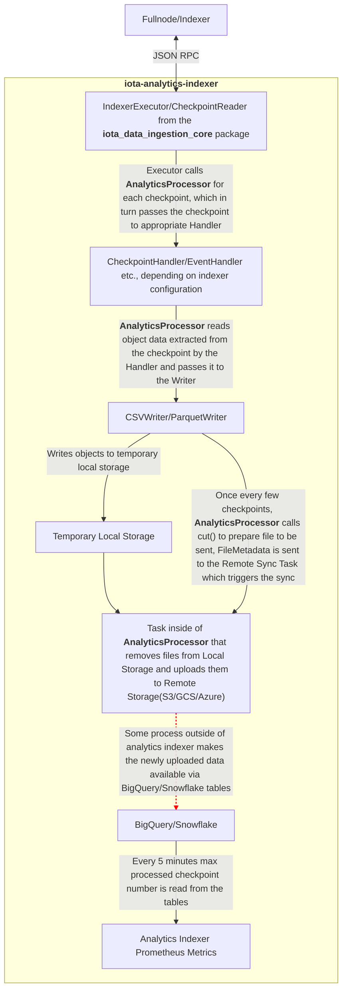

# IOTA Analytics Indexer

The IOTA Analytics Indexer is a service that exports data from the main IOTA network to a remote big object store (S3/GCS/Azure) for further analytical processing. It does not perform any analysis on its own.

## **Key Features**

- Exports data from the IOTA network to a remote big object store
- Provides BigQuery and Snowflake schemas for the exported data

> [!NOTE]
> BigQuery and Snowflake are cloud-based data warehousing solutions.
> After getting data there one can analyse it in the cloud using SQL queries.
>
> BigQuery is part of Google Cloud Platform: [https://cloud.google.com/bigquery]
>
> Snowflake isn't part of any large cloud provider: [https://snowflake.com]

## **Relation to iota-indexer**

### iota-indexer

Currently iota-indexer is computing and storing analytical metrics about:

- network statistics (amount of transactions, transactions per second)
- (active) addresses (transactions senders/recipients)
- move calls

Those metrics are computed by a separate analytical worker instance of the indexer, but it uses the main DB as the main indexer instance.

It seems that some of the values stored in main indexer tables by iota-indexer's `fullnode_sync_worker` are only stored there for analytical purposes (move calls, tx recipients) and could potentially be excluded from further processing if it was not for analytical reasons.

### iota-analytics-indexer

The `iota-analytics-indexer` is not computing any analytical metrics directly.
It is only exporting data for further processing via external tools (BigQuery/SnowFlake).

On this premise, the functionality in `iota-indexer` that is currently used for extracting analytics (and thus unrelated to the JSON-RPC/GraphQL service) could be moved out and delegated to another tool that processes data exported by `iota-analytics-indexer`.
Then the sync logic in `iota-indexer` could be simplified as well to store only data that is needed for the purposes of the RPC APIs.

## **Schemas**

The crate provides:

- [BigQuery Schemas](src/store/bq/schemas/)
- [SnowFlake Schemas](src/store/snowflake/schemas/)
- [Rust struct representations](src/tables.rs)

for the data that it is exporting.

The tables covered by the schemas:

- CHECKPOINT
- EVENT
- MOVE_CALL
- OBJECT
- MOVE_PACKAGE
- TRANSACTION_OBJECT - input and output objects for given transactions
- TRANSACTION

> [!NOTE]
> The following rust structs currently do not have DB schemas prepared:
>
> - DynamicFieldEntry
> - WrappedObjectEntry

## **Architecture**

When running the indexer, one needs to specify object type that would be extracted from checkpoints and uploaded to the cloud.

The following object types are supported:

- Checkpoint
- Object
- Transaction
- TransactionObjects
- Event
- MoveCall
- MovePackage
- DynamicField
- WrappedObject

Only one object type can be passed in given run, to process multiple object types it is needed to run multiple analytics indexer instances.

In general, the data flow is as follows:

- Checkpoints are read via JSON RPC using reused code from `iota_data_ingestion_core`.
- Checkpoints are processed by an appropriate handler (e.g. `EventHandler`), which extracts relevant objects from each transaction of the checkpoint.
- Objects are passed to the Writer, which writes the objects to a local temporary store in CSV or Parquet format.
- The `AnalyticsProcessor` syncs the objects from the local store to the remote store (S3/GCS/Azure, or also local, for testing purposes).
- Every 5 minutes the last processed checkpoint ID is fetched from BigQuery/Snowflake and reported as a metric.

> [!NOTE]
> It is assumed that data from the big object store will be readable from BigQuery/Snowflake automatically, the indexer is not putting the data in BigQuery/Snowflake tables explicitly.

Here is a graph summarizing the data flow:

## **Metrics**

The following Prometheus metrics are served by `iota-analytics-indexer` to monitor the indexer execution:

- **total_received**: count of checkpoints processed in given run
- **last_uploaded_checkpoint**: id of last checkpoint uploaded to the big object store
- **max_checkpoint_on_store**: id of last checkpoint available via BigQuery/Snowflake tables
