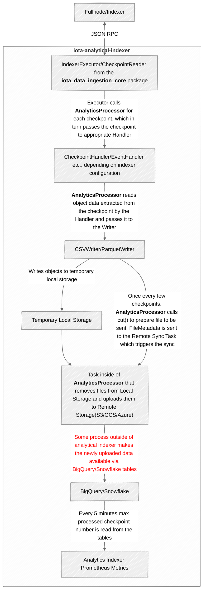

IOTA Analytical Indexer
=======================

The IOTA Analytical Indexer is a service that exports data from the main IOTA network to a remote big object store (S3/GCS/Azure) for further analytical processing. It does not perform any analysis on its own.

**Key Features**
----------------

* Exports data from the IOTA network to a remote big object store
* Provides BigQuery and Snowflake schemas for the exported data

**Relation to iota-indexer**
----------------------------

The data exported by the iota-analytics-indexer can be later analysed by some other solutions outside of the crate.
Functionality from iota-indexer that is not required to serve user JSON RPC/GraphQL requests could potentially be moved away from iota-indexer and served based on data exported by the iota-analytics-indexer.

**Architecture**
----------------

When running the indexer, one needs to specify object type that would be extracted from checkpoints and uploaded to the cloud.

The following object types are supported:
- Checkpoint
- Object
- Transaction
- TransactionObjects
- Event
- MoveCall
- MovePackage
- DynamicField
- WrappedObject

Only one object type can be passed in given run, to process multiple object types it is needed to run multiple analytical indexer instances.

In general, the data flow is as follows:

* Checkpoints are read via JSON RPC using reused code from `iota_data_ingestion_core`.
* Checkpoints are processed by an appropriate handler (e.g. `EventHandler`), which extracts relevant objects from each transaction of the checkpoint.
* Objects are passed to the Writer, which writes the objects to a local temporary store in CSV or Parquet format.
* The `AnalyticsProcessor` syncs the objects from the local store to the remote store (S3/GCS/Azure, or also local, for testing purposes).
* Every 5 minutes the last processed checkpoint ID is fetched from BigQuery/Snowflake and reported as a metric.

**Note:** It is assumed that data from the big object store will be readable from BigQuery/Snowflake automatically, the indexer is not putting the data in BigQuery/Snowflake tables explicitly.

Here is a graph summarizing the data flow:

**Metrics**
-----------

 - **total_received**: count of checkpoints processed in given run
 - **last_uploaded_checkpoint**: id of last checkpoint uploaded to the big object store
 - **max_checkpoint_on_store**: id of last checkpoint available via BigQuery/Snowflake tables
