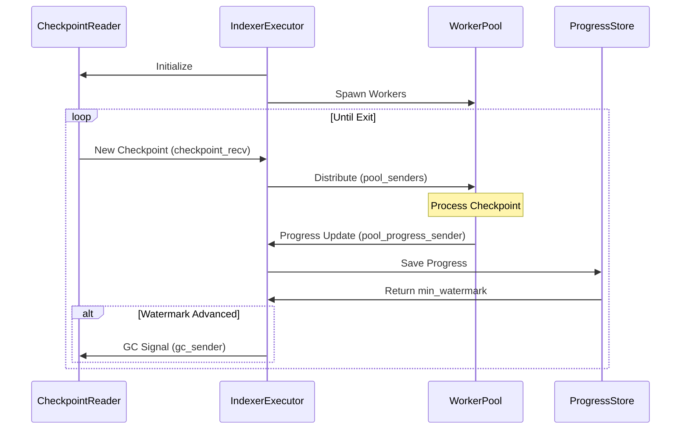

# Custom indexer

The `iota-data-ingestion-core` crate provides an easy solution to create custom indexers. To create an indexer, you subscribe to a checkpoint stream with full checkpoint content. This stream can be one of the publicly available streams from IOTA, one that you set up in your local environment, or a combination of the two.

Establishing a custom indexer helps improve latency, allows pruning of the data of your IOTA Full node, and provides an efficient assemblage of checkpoint data.

## Overview

To start implementing a custom Indexer, the `Worker` trait must be implemented:

```rust
#[async_trait]
pub trait Worker: Send + Sync {
    async fn process_checkpoint(&self, checkpoint: CheckpointData) -> Result<()>;

    async fn save_progress(
        &self,
        sequence_number: CheckpointSequenceNumber,
    ) -> Option<CheckpointSequenceNumber> {
        Some(sequence_number)
    }

    fn preprocess_hook(&self, _: CheckpointData) -> Result<()> {
        Ok(())
    }
}
```

The `process_checkpoint` method is the central component of this trait. It handles the processing of data extracted from the `CheckpointData` struct and its subsequent storage. The `CheckpointData` struct encapsulates the complete content of a checkpoint, containing a summary, the checkpoint data itself, and detailed information about each transaction, including associated events and input/output objects. The framework offers three modes for sourcing checkpoint data: **Local**, **Remote**, and **Hybrid** (Local + Remote), allowing for flexible data ingestion strategies.

#### Local

The local checkpoint fetcher is ideal when the indexer and a Full Node run on the same machine. By configuring the Full Node to save generated checkpoints to a local directory, `iota-data-ingestion-core` can monitor this directory for changes using an inotify-based mechanism. This minimizes ingestion latency, as checkpoints are processed immediately after they are generated by the Full Node.

#### Remote

The remote checkpoint fetcher is useful when the indexer and Full Node reside on separate machines. The Full Node can be configured to expose a REST API for checkpoint retrieval.

#### Hybrid

A hybrid configuration combines local and remote stores, providing a fallback mechanism for continuous data ingestion. The framework prioritizes locally available checkpoint data. This mode is beneficial when transitioning to using a local Full Node for data ingestion while needing to backfill historical data or provide failover capabilities.

## Detailed API Functionality

To fully understand the inner workings and configuration options of `iota-data-ingestion-core`, a closer look at its API is necessary. While the `Worker` trait dictates the processing and storage of `CheckpointData`, the `IndexerExecutor` is responsible for orchestrating the workers and implementing the core ingestion logic. Before diving into the details of the `IndexerExecutor`, we will first analyze the components it relies on.

### Checkpoint Reader

The `CheckpointReader` actor is responsible for reading and managing `CheckpointData` from multiple sources, including local files and remote storage. In addition to fetching new checkpoints, it tracks which checkpoints have been processed, performs garbage collection by deleting processed checkpoint files from local storage, and enforces a memory limit during batch processing to prevent out-of-memory (OOM) conditions. The `CheckpointReader` is instantiated using the `initialize(..)` method.

```rust
pub fn initialize(
    // The directory on which checkpoints will be read
    path: PathBuf,
    // From which checkpoint sequence number to start fetching new checkpoints
    starting_checkpoint_number: CheckpointSequenceNumber,
    // Provide a remote URL to download checkpoints
    remote_store_url: Option<String>,
    // Any config key-value pair for the Remote fetcher
    remote_store_options: Vec<(String, String)>,
    // Customize and optimize the Checkpoint fetch behavior
    options: ReaderOptions,
) -> (
    Self,
    // Channel the Workers will listen and process & store checkpoints
    mpsc::Receiver<CheckpointData>,
    // Channel on which workers will notify GC of the checkpoint
    mpsc::Sender<CheckpointSequenceNumber>,
    // Graceful shutdown
    oneshot::Sender<()>,
)
```

The `ReaderOptions` struct provides options for configuring how the checkpoint reader fetches new checkpoints.

```rust
pub struct ReaderOptions {
    // How often to check for new checkpoints
    // Lower values mean faster detection but more CPU usage
    // Default: 100ms
    pub tick_interval_ms: u64,
    // Network request timeout
    // Applies to remote store operations
    // Default: 5 seconds
    pub timeout_secs: u64,
    // Maximum concurrent remote requests
    // Higher values increase throughput but use more resources
    // Default: 10
    pub batch_size: usize,
    // Memory limit for processing batch checkpoints
    // 0 means no limit
    // Helps prevent OOM issues
    pub data_limit: usize,
}
```

The `run()` method is responsible for starting the actor. It creates an [inotify](https://man7.org/linux/man-pages/man7/inotify.7.html) listener to monitor the local directory for new files. The method then enters a loop with a `tokio::select!` statement to handle three execution branches:

```rust
loop {
    tokio::select! {
        // Graceful shutdown
        _ = &mut self.exit_receiver => break,
        // Receive from Workers the processed checkpoint sequence numbers, this means that the
        // files are no longer needed and a GC can be safely performed
        Some(gc_checkpoint_number) = self.processed_receiver.recv() => {
            self.gc_processed_files(gc_checkpoint_number).expect("Failed to clean the directory");
        }
        // `self.sync()` is invoked either after waiting `self.options.tick_interval_ms`
        // without a new file notification, or immediately upon receiving such a notification.
        Ok(Some(_)) | Err(_) = timeout(Duration::from_millis(self.options.tick_interval_ms), inotify_recv.recv())  => {
            self.sync().await.expect("Failed to read checkpoint files");
        }
    }
}
```

The `sync()` method manages the retrieval of checkpoints, coordinating between local and (optionally) remote sources. It prioritizes local checkpoints, using the `read_local_files()` method to fetch them from the local directory. Remote fetching, performed by the `remote_fetch()` method, is only activated if the local checkpoints are missing or lag behind the expected sequence. This design ensures that local storage is the primary source of truth.

- `read_local_files()` iterates through all entries in the configured directory, attempting to extract a sequence number from each filename. It filters out entries with sequence numbers lower than the current checkpoint number (`current_checkpoint_number`). The remaining entries are then sorted in ascending order by sequence number. The function then attempts to deserialize each remaining file as a `CheckpointData` struct but only adds the deserialized checkpoint to the result if adding it does not exceed the configured capacity (`data_limit`).
- `remote_fetch()` method fetches checkpoints from a remote store. It supports the Full Node REST API and various object-store interfaces, including [Amazon S3](https://docs.rs/object_store/latest/object_store/aws/index.html), [Google Cloud Storage](https://docs.rs/object_store/latest/object_store/gcp/index.html), and [WebDAV](https://docs.rs/object_store/latest/object_store/http/index.html). Based on the configuration, it can also create a hybrid client combining an object store and a REST API client. It fetches checkpoints in batches, starting from the `current_checkpoint_number`, and retrieves data until the `batch_size` is reached. While iterating through the fetched checkpoints, it checks for capacity limitations. If the capacity is exceeded, it stops fetching and returns the collected checkpoints.

### Progress Store

The `ProgressStore` plays a crucial role in tracking the progress of checkpoint synchronization for each task. This ensures that the Worker can resume synchronization from the last successfully processed checkpoint after an Indexer restart. The framework offers two built-in implementations:

- `ShimProgressStore`: A simple, in-memory progress store primarily used for unit testing. It does not persist progress across restarts.
- `FileProgressStore`: A persistent progress store that uses a file to track each task's synchronization state.

Custom progress stores can be created by implementing the `ProgressStore` trait.

```rust
#[async_trait]
pub trait ProgressStore: Send {
    async fn load(&mut self, task_name: String) -> Result<CheckpointSequenceNumber>;
    async fn save(
        &mut self,
        task_name: String,
        checkpoint_number: CheckpointSequenceNumber,
    ) -> Result<()>;
}
```

Instead of directly using the custom `ProgressStore` implementation, the `IndexerExecutor` interacts with it through a wrapper:

```rust
pub type ExecutorProgress = HashMap<String, CheckpointSequenceNumber>;

pub struct ProgressStoreWrapper<P> {
    // Our custom implemented ProgressStore
    progress_store: P,
    // An internal Map holding the TaskName and the CheckpointSequenceNumber
    pending_state: ExecutorProgress,
}
```

This wrapper implements the `ProgressStore` trait. Internally, it retrieves progress data from the underlying `ProgressStore` implementation and populates its own internal cache. This cached data is then used to efficiently calculate the minimum watermark across all tracked tasks.

### WorkerPool

The `WorkerPool` actor has the responsibility to coordinate and manage `Workers`

```rust
pub struct WorkerPool<W: Worker> {
    // An unique name of the Worker task
    pub task_name: String,
    // How many instances of the current Worker to create, more workers are created
    // more checkpoints they can process concurrently
    concurrency: usize,
    // The actual Worker instance itself
    worker: Arc<W>,
}
```

The `run()` method implements the core worker behavior and management logic. It maintains a set of `worker_id`s (ranging from `0` to `concurrency - 1`) to ensure each worker processes a distinct checkpoint without race conditions. A `VecDeque` cache of `CheckpointData` is used to buffer incoming checkpoints from the `CheckpointReader` when no workers are immediately available.

The worker pool's size is determined by the `concurrency` value. The pool is implemented as a vector of tasks, one for each `Worker` instance. `mpsc` channels are used for communication, allowing the pool to receive `CheckpointData`. After initializing the worker pool, the actor enters a loop with a `tokio::select!` statement to handle two distinct execution branches:

```rust
 loop {
	tokio::select! {
		// Receives a synced checkpoint notification from the Worker
		Some((worker_id, status_update, progress_watermark)) = progress_receiver.recv() => {
		   ...
		}
		// Receive a `CheckpointData` from CheckpointReader
		Some(checkpoint) = checkpoint_receiver.recv() => {
			...
		}
	}
}
```

- The first branch first marks the `worker_id` as idle, updates the watermark, and enforces ordered checkpoint execution. It then checks the cache for pending checkpoints and assigns any found to the idle `worker_id`.
- The second branch handles incoming `CheckpointData` from the `CheckpointReader`. It discards checkpoints with sequence numbers less than the `current_checkpoint_number`, assuming they have already been processed. It then invokes the optional `preprocess_hook` method (defined in the `Worker` trait) to allow for validation, preparation, or caching of checkpoint data. If the hook executes successfully and an idle worker is available, the checkpoint is sent for processing otherwise, it is added to the cache for later processing.

### Indexer Executor

The `IndexerExecutor` actor is the coordinator of the entire framework logic.

```rust
pub struct IndexerExecutor<P> {
    // Holds the registered WorkerPools actors
    pools: Vec<Pin<Box<dyn Future<Output = ()> + Send>>>,
    // Store the Sender half of the channel to notofy Worker Pool of new CheckpointData
    pool_senders: Vec<mpsc::Sender<CheckpointData>>,
    // A wrapper around the implemented ProgressStore by having an internal cache
    progress_store: ProgressStoreWrapper<P>,
    // Worker Pools will send on this channel and notify the Executor that
    // the Checkpoint was synced and a GC operation can be performed
    pool_progress_sender: mpsc::Sender<(String, CheckpointSequenceNumber)>,
    // Listens on synced checkpoints from Worker Pools and performs GC operation
    pool_progress_receiver: mpsc::Receiver<(String, CheckpointSequenceNumber)>,
    metrics: DataIngestionMetrics,
}
```

```rust
pub fn new(progress_store: P, number_of_jobs: usize, metrics: DataIngestionMetrics) -> Self {..}
```

Instantiating an `IndexerExecutor` using the `new(..)` method requires careful consideration of the `number_of_jobs` parameter. This parameter determines the capacity of a buffered `mpsc` channel used for communication, calculated as `number_of_jobs * MAX_CHECKPOINTS_IN_PROGRESS` (where `MAX_CHECKPOINTS_IN_PROGRESS` is defined as 10000). The sender end of this channel is cloned and provided to each registered `WorkerPool`. Each `WorkerPool` also maintains its internal buffered channel with a capacity of `MAX_CHECKPOINTS_IN_PROGRESS` to track its internal progress. Therefore, as a best practice, the `number_of_jobs` should be set equal to the number of registered worker pools to ensure efficient and reliable communication of progress updates.

```rust
pub async fn register<W: Worker + 'static>(&mut self, pool: WorkerPool<W>) -> Result<()> {..}
```

After instantiation, the `IndexerExecutor` requires registration of one or more `WorkerPool` instances via the `register(..)` method to function. During registration, the executor retrieves the last recorded watermark from its `ProgressStoreWrapper`, using it as the initial checkpoint sequence number for synchronization. The `register` method also creates a buffered `mpsc` channel with a capacity of `MAX_CHECKPOINTS_IN_PROGRESS` and stores the `WorkerPool` in its internal `pools` vector. While the `pool.run()` method is called, it does not begin execution until awaited. The sender half of the created channel is stored in `pool_senders` vector for later distribution of `CheckpointData`.

```rust
pub async fn run(
    mut self,
    // The directory on which checkpoints will be read
    path: PathBuf,
    // Provide a remote URL to download checkpoints
    remote_store_url: Option<String>,
    // Any config key-value pair for the Remote fetcher
    remote_store_options: Vec<(String, String)>,
    // Customize and optimize the Checkpoint fetch behavior
    reader_options: ReaderOptions,
    // Graceful shutdown signal
    mut exit_receiver: oneshot::Receiver<()>,
) -> Result<ExecutorProgress> {..}
```

The `run(..)` method executes the actor's main logic. The `run(..)` method is the main orchestrator of the checkpoint processing pipeline. It coordinates between:

- Checkpoint reading (local/remote)
- Worker pool management
- Progress tracking
- Garbage collection
- Metric reporting

The following diagram shows on a high level the overall flow:



To initiate checkpoint fetching, the `CheckpointReader` requires an initial checkpoint sequence number. This number is obtained by calling the `ProgressStoreWrapper`'s `min_watermark()` method, which determines the minimum processed checkpoint sequence number across all worker pools. This ensures that no checkpoints are skipped during synchronization and serves as the garbage collection starting point. Subsequently, the `CheckpointReader` is started in a separate task by invoking its `run()` method.

> [!NOTE]
> While each `WorkerPool` retrieves its own watermark during registration, the executor also calculates a global minimum watermark at startup which is needed. This is crucial because different `WorkerPool` instances might be targeting different storage backends. The global minimum watermark ensures that each pool has the opportunity to synchronize the necessary checkpoints for its specific storage, even if other pools have already registered those checkpoints to different targets. Subsequently, each `WorkerPool` uses its `current_checkpoint_number` (set during registration) to discard any redundant checkpoints, preventing duplicate processing.

The next step is to spawn the worker pools in separate tasks:

```rust
for pool in std::mem::take(&mut self.pools) {
    spawn_monitored_task!(pool);
}
```

Finally, the actor enters a loop with a `tokio::select!` statement to handle three distinct execution branches:

```rust
tokio::select! {
	// Handle graceful shutdown
	_ = &mut exit_receiver => break,
	// Receive processed checkpoints from Worker Pools, update the ProgressStore,
	// calculate its minimum watermark and perform GC operation
	Some((task_name, sequence_number)) = self.pool_progress_receiver.recv() => {
		self.progress_store.save(task_name.clone(), sequence_number).await?;
		let seq_number = self.progress_store.min_watermark()?;
		if seq_number > reader_checkpoint_number {
			gc_sender.send(seq_number).await?;
			reader_checkpoint_number = seq_number;
		}
		self.metrics.data_ingestion_checkpoint.with_label_values(&[&task_name]).set(sequence_number as i64);
	}
	// Distribution of checkpoints across Worker pools
	Some(checkpoint) = checkpoint_recv.recv() => {
		for sender in &self.pool_senders {
			sender.send(checkpoint.clone()).await?;
		}
	}
}
```

- The first branch handles the graceful shutdown of the executor.
- The second branch is responsible for receiving the progress of processed checkpoints from worker pools, and it records the current processing sequence number for each task in the progress store. Calculates the lowest processed sequence number across all tasks. If the minimum watermark exceeds the checkpoint reader's current watermark, it signals the reader to initiate garbage collection. Updates the checkpoint reader's last pruned watermark to reflect the new minimum.
- The third branch is responsible for distributing the incoming checkpoints from `CheckpointReader` across all Workers Pools.

## Use cases

The use cases for the `iota-data-ingestion-core` can be endless. It not only could be used to create Custom Indexers but also for analyzing the data and integrate it with external systems

#### 1. **Building Custom Indexers for Specific Data:**

- **Indexing Only the Necessary Data:** Depending on the specific use case, a custom indexer can be developed to store only the relevant data. For example, businesses can register transactions based on the sender and recipient, allowing them to retain essential transactional data for the parties they need without the concern that a full node may delete this information.
- **Indexer as a service**: Provide users with the tools to efficiently index and query specific data, unlocking the potential of the IOTA Tangle for various applications.

#### 2. **Data Analysis and Visualization:**

- **Historical Analysis:** Analyzing historical data to identify trends, patterns, and anomalies.
- **Real-time Analytics:** Processing data in real-time to generate insights and alerts.
- **Data Visualization:** Creating visualizations to represent data insights in a user-friendly way.

#### 3. **Integration with External Systems:**

- **Data Pipelines:** Integrating with other data processing systems (e.g., Apache Kafka, Apache Spark) for large-scale data processing.
- **Machine Learning:** Feeding indexed data into machine learning models for predictive analytics.
- **Alerting Systems:** Triggering alerts based on specific events or conditions identified in the data.

## Usage in existing crates

As an example of a custom indexer the `iota-data-ingestion-core` is used in the `iota-indexer` and `iota-analytics-indexer` both persist data in different storages with completely different use cases:

- **iota-indexer**: The primary function of the indexer is to provide historical data from the ledger, which is crucial for both Explorer and developers who want to utilize ledger data in their applications. By pre-processing and storing this data, the indexer significantly reduces the load on the full node, preventing performance degradation from frequent queries. The data is stored in `PostgreSQL`.

- **iota-analytics-indexer**: This is a specialized indexer designed to analyze and store key metrics from the IOTA blockchain. It tracks network statistics like transaction volume and throughput, user activity such as the number of active addresses, and the execution of Move calls, providing insights into smart contract usage. The collected data is efficiently stored in Object Storage and subsequently transferred to columnar databases like BigQuery or Snowflake, optimized for analytical queries.
