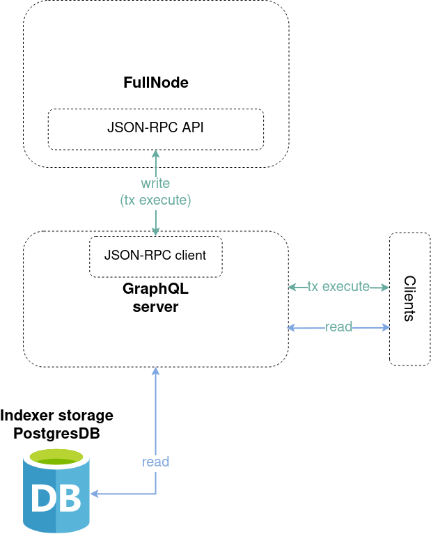

# iota-graphql-rpc

## Architecture

The GraphQL server provides read access to the Indexer database, and enables
execution of transaction through the fullnode JSON-RPC API.

Its architecture can thus be visualized as follows:



To learn more about the GraphQL and how it works, check out the [official documentation](https://graphql.org/learn).

The GraphQL server is built with the [async-graphql](https://async-graphql.github.io/async-graphql/docs/overview) library, which generates the GraphQL schema from Rust types, which you can find [here](schema).
To learn more about how the schema and types in GraphQL, see the [official documentation](https://graphql.org/learn/schema/).

`Query` and `Mutation` are types that provide the main entrypoints to the queries supported by the server.
`Query` handles all data fetching while `Mutation` manages data modification.

Queries that can be mediated via the `Query` type can be found in [query.rs](src/types/query.rs).
For example, it allows to query data about objects, owners, coins, events, transaction blocks, Move packages, checkpoints or protocol. It also allows to simulate (dry_run) a transaction block, which is a non-mutating operation.

Queries that can be mediated via the `Mutation` type can be found in [mutation.rs](src/mutation.rs).
Currently, it only mediates a mutation for executing a transaction which submits a transaction block to the fullnode.

Comparing the GraphQL schema with specific JSON-RPC methods it appeares:

- the `CoinApi` is covered by [coin](src/types/coin.rs) and [coin_metadata](src/types/coin_metadata.rs) types.
- the `GovernanceApi` is mostly covered by [validators](src/types/validator.rs) and [gas](src/types/gas.rs) types. However, it seems timelocked stakes and committee info are not supported by the GraphQL schema.
- the `MoveUtilsApi` is covered by [move_function](src/types/move_function.rs), [move_module](src/types/move_module.rs), [move_object](src/types/move_object.rs), [move_package](src/types/move_package.rs), [move_struct](src/types/move_struct.rs), [move_type](src/types/move_type.rs) and [move_value](src/types/move_value.rs) types.
- the `ReadApi` is covered by [transaction_block](src/types/transaction_block.rs), [transaction_block_effects](src/types/transaction_block_effects.rs), [transaction_metadata](src/types/transaction_metadata.rs), [object](src/types/object.rs), [checkpoint](src/types/checkpoint.rs), [event](src/types/event.rs), [coin](src/types/coin.rs) and [epoch](src/types/epoch.rs) types.
- the `ExtendedApi` is covered by [object](src/types/object.rs), [epoch](src/types/epoch.rs) and [checkpoint](src/types/checkpoint.rs) types. However, it seems explorer metric queries are not supported by the schema.
- the `IndexerApi` is mostly covered by [object](src/types/object.rs), [owner](src/types/transaction_block.rs), [owner](src/types/transaction_block.rs), [event](src/types/event.rs) and [transaction_block](src/types/transaction_block.rs). It seems subscription queries are not supported in GraphQL.
- the `TransactionBuilderApi` is covered by the [types/transaction_block_kind](src/types/transaction_block_kind) type.
- the `WriteApi` is covered by the [mutation](src/mutation.rs) type.

## Dev setup

Note that we use compilation flags to determine the backend for Diesel.
If you're using VS Code, make sure to update `settings.json` with the appropriate `pg_backend` feature flag:

```
"rust-analyzer.cargo.features": ["pg_backend"]
```

## Steps to run a local GraphQL server

### Using docker compose (recommended)

See [pg-services-local](../../docker/pg-services-local/README.md), which automatically sets up the GraphQL server along with an Indexer instance, the postgres database and a local network.

### Using manual setup

Before you can run the GraphQL server, you need to have a running Indexer postgres instance.
Follow the [Indexer database setup](../iota-indexer/README.md#database-setup) to set up the database.
You should end up with a running postgres instance on port `5432` with the database `iota_indexer` accessible by user `postgres` with password `postgrespw`.

## Launching the graphql-rpc server

You can run the server with the following command with default configuration with:

```
cargo run --bin iota-graphql-rpc start-server
```

Per default, the GraphQL server will be served on `127.0.0.1:8000`.

To configure the DB URL, node RPC URL for transaction execution, the GraphQL server host and port or any specific any server options, you can pass the following arguments:

```
cargo run --bin iota-graphql-rpc start-server [--db-url] [--node-rpc-url] [--host] [--port] [--config]
```

`--config` expects a path to a TOML server configuration file.

Example `.toml` config:

```toml
[limits]
max-query-depth = 15
max-query-nodes = 500
max-output-nodes = 100000
max-query-payload-size = 5000
max-db-query-cost = 20000
default-page-size = 5
max-page-size = 10
request-timeout-ms = 15000
max-type-argument-depth = 16
max-type-argument-width = 32
max-type-nodes = 256
max-move-value-depth = 128

[background-tasks]
watermark-update-ms = 500
```

See [ServiceConfig](src/config.rs) for more available service options.

### Starting the GraphQL IDE

When running the GraphQL server, you can access the `GraphiQL` IDE at `http://127.0.0.1:8000` to more easily interact with the server.

Try out the following sample query to see if the server is running successfully:

```graphql
# Returns the chain identifier for the chain that the server is tracking
{
  chainIdentifier
}
```

Find more example queries in the [examples](examples) directory.

### Launching with an Indexer

For local development, it might be useful to spin up an actual Indexer as well (not only the postgres instance for the Indexer) which writes data to the database, so you can query it with the GraphQL server.
You can run it as part of [iota-test-validator](../../crates/iota-test-validator/README.md) or as a [standalone service](../iota-indexer/README.md#standalone-indexer-setup)

`cargo run --bin iota-test-validator -- --with-indexer --pg-port 5432 --pg-db-name iota_indexer --graphql-host 127.0.0.1 --graphql-port 8000`

## Running tests

To run the tests, a running postgres database is required.
To do so, follow the [Indexer database setup](../iota-indexer/README.md#database-setup) to set up a database.

Then, run the following command:

```sh
cargo nextest run -p iota-graphql-rpc --features pg_integration --no-fail-fast --test-threads 1
```

To check for compatibility with json-rpc
`pnpm --filter @iota/graphql-transport test:e2e`
