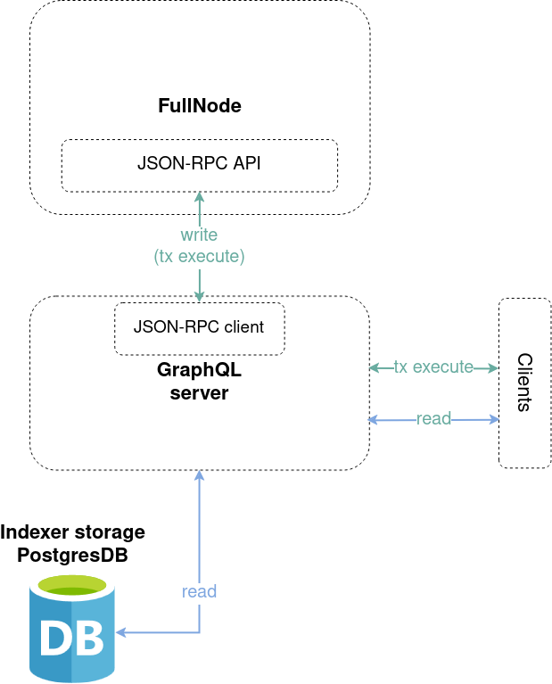

# iota-graphql-rpc

## Architecture

The GraphQL server provides read access to the Indexer database, and enables
execution of transaction through the fullnode JSON-RPC API.

Its architecture can thus be visualized as follows:



To learn more about the GraphQL and how it works, check out the [official documentation](https://graphql.org/learn).

The GraphQL server is built with the [async-graphql](https://async-graphql.github.io/async-graphql/en/index.html) library, which generates the GraphQL schema from Rust types, which you can find [here](schema).
To learn more about how the schema and types in GraphQL work, see the [official documentation](https://graphql.org/learn/schema/).

`Query` and `Mutation` are types that provide the main entrypoints to the queries supported by the server.
`Query` handles all data fetching while `Mutation` manages data modification.

Queries that can be mediated via the `Query` type can be found in [query.rs](src/types/query.rs).
For example, it allows to query data about objects, owners, coins, events, transaction blocks, Move packages, checkpoints or protocol. It also allows to simulate (dry_run) a transaction block, which is a non-mutating operation.

Queries that can be mediated via the `Mutation` type can be found in [mutation.rs](src/mutation.rs).
Currently, it only mediates a mutation for executing a transaction which submits a transaction block to the fullnode.

Comparing the GraphQL schema with specific JSON-RPC methods following relationships can be made:

- `CoinApi`: `Query::coins`, `Query::coin_metadata`
- `GovernanceApi`: `Query::epoch`
- `MoveUtilsApi`: `Query::type_`
- `ReadApi`: `Query::transaction_block`, `Query::transaction_blocks`, `Query::object`, `Query::objects`, `Query::available_range`, `Object::events`, `Query::protocol_config`, `Query::chain_identifier`
- `ExtendedApi`: `Query::epoch`, `Query::objects`, `Query::transaction_blocks`
- `IndexerApi`: `Query::object`, `Object::events`, `Object::address`, `Object::transaction_block`, `Object::transaction_blocks`, `Query::objects`
- `TransactionBuilderApi`: N/A
- `WriteApi`: `Mutation::execute_transaction_block`, `Query::dry_run_transaction_block`

To learn more about GraphQL queries, see the [official documentation](https://graphql.org/learn/queries/).

## Dev setup

Note that we use compilation flags to determine the backend for Diesel.
If you're using VS Code, make sure to update `settings.json` with the appropriate `pg_backend` feature flag:

```
"rust-analyzer.cargo.features": ["pg_backend"]
```

## Steps to run a local GraphQL server

### Using docker compose (recommended)

See [pg-services-local](../../dev-tools/pg-services-local/README.md), which automatically sets up the GraphQL server along with an Indexer instance, the postgres database and a local network.

### Using manual setup

Before you can run the GraphQL server, you need to have a running Indexer database instance so that the server can query it.
This doesn't require the Indexer to be running, only the database. Follow the [Indexer database setup](../iota-indexer/README.md#database-setup) to set up the database.
You should end up with a running postgres instance on port `5432` with the database `iota_indexer` accessible by user `postgres` with password `postgrespw`.

## Launching the graphql-rpc server

You can run the server with the following command with default configuration with:

```
cargo run --bin iota-graphql-rpc start-server
```

Per default, the GraphQL server will be served on `127.0.0.1:8000`.

To configure the DB URL, node RPC URL for transaction execution and the GraphQL server you can pass the following arguments:

```
cargo run --bin iota-graphql-rpc start-server [--db-url] [--node-rpc-url] [--host] [--port] [--config]
```

To further configure the GraphQL service, you can provide a TOML configuration file with the `--config` argument.
An example `.toml` configuration could look like this:

```toml
[limits]
max-query-depth = 15
max-query-nodes = 500
max-output-nodes = 100000
max-query-payload-size = 5000
max-db-query-cost = 20000
default-page-size = 5
max-page-size = 10
request-timeout-ms = 15000
max-type-argument-depth = 16
max-type-argument-width = 32
max-type-nodes = 256
max-move-value-depth = 128

[background-tasks]
watermark-update-ms = 500
```

See [ServiceConfig](src/config.rs) for more available service options.

### Starting the GraphQL IDE

When running the GraphQL server, you can access the `GraphiQL` IDE per default at `http://127.0.0.1:8000` to more easily interact with the server.

Try out the following sample query to see if the server is running successfully:

```graphql
# Returns the chain identifier for the chain that the server is tracking
{
  chainIdentifier
}
```

Find more example queries in the [examples](examples) directory.

### Launching the server with Indexer

For local development, it might be useful to spin up an actual Indexer as well (not only the postgres instance) which writes data to the database, so you can query it with the GraphQL server.
You can run it with a local network using the `iota-localnet start` subcommand or [pg-services-local](../../dev-tools/pg-services-local/README.md) or as a [standalone service](../iota-indexer/README.md#standalone-indexer-setup).

To run it with the `iota-localnet start` subcommand, switch to the root directory of the repository and run the following command to start the Indexer with the Sync worker:

```
`cargo run --features indexer --bin iota-localnet start --with-indexer --pg-port 5432 --pg-db-name iota_indexer --with-graphql=0.0.0.0:8000`
```

## Historic fallback (REST KV store)

The GraphQL server supports an experimental historic fallback feature via the `--fallback-kv-url` flag.
The Indexer prunes historical data below a retention watermark, so by default the server cannot read checkpoints, transactions, events, or object versions older than that watermark.
When a [REST KV store](../../dev-tools/iota-rest-kv/README.md) is configured, the server falls back to it for reads that miss the pruned Postgres data, so pruned history stays queryable.
It depends on the API served by the `iota-rest-kv` crate, which is still being finalized and subject to change.

> [!WARNING]
> This is an experimental feature and is subject to change without notice.

### Enabling

Pass the REST KV store URL when starting the server:

```sh
iota-graphql-rpc start-server \
  --db-url postgres://<user>:<password>@<host>:5432/<db> \
  --node-rpc-url http://<fullnode>:<grpc-port> \
  --fallback-kv-url http://<rest-kv-host>:<port>
```

Without `--fallback-kv-url` (the default), no fallback is performed and pruned data is unreachable.

The remaining options tune batching, concurrency, and caching of the fallback requests:

| Flag                                   | Env var                              | Default  | Description                                                  |
| -------------------------------------- | ------------------------------------ | -------- | ------------------------------------------------------------ |
| `--fallback-kv-url`                    | —                                    | _(none)_ | REST KV store URL. Enables the fallback when set.            |
| `--fallback-kv-multi-fetch-batch-size` | `FALLBACK_KV_MULTI_FETCH_BATCH_SIZE` | `100`    | Maximum number of keys per batch request to the KV store.    |
| `--fallback-kv-concurrent-fetches`     | `FALLBACK_KV_CONCURRENT_FETCHES`     | `10`     | Maximum number of concurrent batch requests to the KV store. |
| `--fallback-kv-cache-size`             | `FALLBACK_KV_CACHE_SIZE`             | `100000` | Number of entries cached from the KV store.                  |

### Queries with fallback

These queries use the fallback when the requested data has been pruned from Postgres:

- Checkpoints: `checkpoint(id)` (by sequence number or digest), `checkpoints`, `Epoch.checkpoints`
- Transactions by digest: `transactionBlock(digest)`, `transactionBlocksByDigests`
- Transactions by filter: `transactionBlocks(filter: { atCheckpoint })` and `Checkpoint.transactionBlocks`; `transactionBlocks(filter: { affectedAddress })` and `Address.transactionBlocks(relation: AFFECTED)`; `transactionBlocks(filter: { transactionIds })`
- Events of a transaction: `events(filter: { transactionDigest })`
- Objects at a past version: `object(address, version)`, including dynamic fields resolved at a parent object's version

Resolving a dynamic field or dynamic object field at a parent object's version needs that version recorded in the indexer's `objects_version` table. On indexers restored from a snapshot, versions below the restore point cannot be served this way and return `DATA_PRUNED`.

Other read paths are served only from Postgres and cannot see pruned data.

## Running tests

The crate provides test coverage for server functionality, covering client validation, query validation, reading and writing data, query limits, and health checks.
For query tests, please see the `iota-graphql-e2e-tests` crate.

To run the tests, a running postgres database is required.
To do so, follow the [Indexer database setup](../iota-indexer/README.md#database-setup) to set up a database.

Then, run the following command:

```sh
cargo nextest run -p iota-graphql-rpc --features pg_integration --no-fail-fast --test-threads 1
```

To check for compatibility with json-rpc
`pnpm --filter @iota/graphql-transport test:e2e`

## To re-generate the GraphQL schema after code changes

In order to re-generate the GraphQL schema ([schema.graphql](schema.graphql)), run the following command:

```sh
cargo run --bin iota-graphql-rpc generate-schema
```

If the snapshot tests are failing:

```sh
cargo nextest run -p iota-graphql-rpc -- test_schema_sdl_export
```

snapshot changes can be reviewed and accepted by running:

```sh
cargo insta review
```
