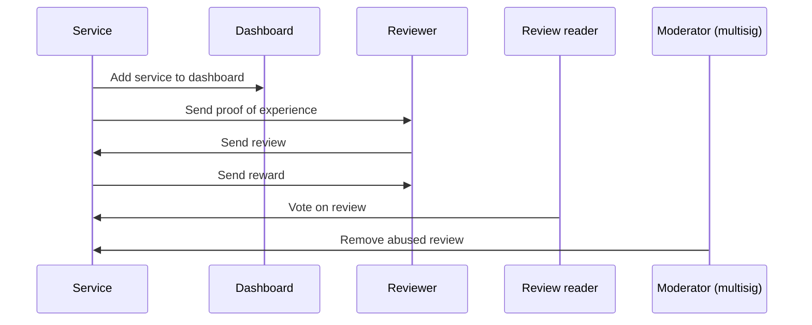

## Introduction

The example illustrates the creation of a review rating platform for the food service industry, utilizing [multisignature](../cryptography/transaction-auth/multisig.mdx) functionality on IOTA. Unlike conventional review platforms, which frequently conceal the algorithms used to rate reviews, this model leverages a transparent, on-chain algorithm that anyone can access and verify. IOTA's low [transaction costs](../../about-iota/tokenomics/gas-in-iota.mdx) make it economically viable to submit, evaluate, and rank all reviews directly on-chain.

**Multisig Setup for Moderators**: The platform uses a multisig account to ensure that key actions like removing inappropriate reviews or approving reward distributions are authorized by multiple trusted moderators.

## Personas

There are four actors in the typical workflow of the Reviews Rating example.

- Service: Review requester.
- Dashboard: Review hub.
- Reviewer: Review creator.
- Moderator: Review list editor.



### Service Owners

Service owners, such as restaurants, list their offerings on the platform with the goal of attracting more customers through positive reviews. To incentivize this, they set aside a specific amount of IOTA in a reward pool. This pool is used to reward reviewers who provide high-rated feedback. A proof of experience (PoE) NFT serves as confirmation that a reviewer has used the service, and this NFT can later be burned to submit a verified review. Service owners issue unique identifiers, possibly through QR codes, to link reviews to individual customers.

### Reviewers

Reviewers are customers who utilize the platform to share their experiences. They provide feedback through comments that highlight particular aspects of the service, along with a star rating to guide others. Reviews are evaluated, with the most helpful ones receiving the highest ratings. The top 10 highest-rated reviews for each service receive rewards from the service owner. The frequency of reward distribution is determined by the service owner, such as weekly or monthly disbursements.

### Review Readers

Review readers use the platform to access feedback, helping them make informed decisions when choosing services. They contribute by voting on reviews, and these votes influence the algorithm that ranks the reviews. Authors of the highest-rated reviews are rewarded based on this ranking. Although not part of this guide, the system could be expanded to reward readers for participating by casting votes on reviews.

### Moderators

Moderators operate within a multisignature setup, ensuring that significant actions, such as removing reviews or distributing rewards, require authorization from multiple parties. This approach enhances security and transparency, as decisions are made collectively, promoting accountability in the moderation process. Moderators review the content and have the authority to remove reviews containing inappropriate material.

Although this guide does not provide a built-in incentive structure for moderators, service owners could contribute to a compensation pool that rewards moderators over time. A staking mechanism could also be implemented, where individuals stake tokens to influence how rewards are allocated to moderators, akin to staking systems for on-chain validators. In this setup, moderator decisions would be influenced by a quorum based on the amount of staked tokens, creating incentives for moderators to perform their duties effectively.

Moderators work within a multisig environment, meaning key actions—such as removing inappropriate reviews or distributing rewards—must be approved by multiple parties. This approach enhances security, encourages collaborative decision-making, and ensures transparency.

## Creating a Multisig for Moderators

To implement multisig for moderators, follow these steps:

### 1. Create Keys for Each Moderator
Each moderator needs a unique key. To generate these keys, use the following commands to create an IOTA address and corresponding key for each moderator:

```shell
iota client new-address ed25519
iota client new-address secp256k1
iota client new-address secp256r1
```
### 2. Add Keys to IOTA Keystore

```shell
iota keytool list
```
This command will list the generated keys with their corresponding addresses and public keys.

### 3. Create a Multisig Address
Create the multisig address by combining the public keys of all moderators and setting their weights and a threshold:

```shell
iota keytool multi-sig-address --pks <PUBLIC-KEY-1> <PUBLIC-KEY-2> <PUBLIC-KEY-3> --weights 1 1 1 --threshold 2
```
This command sets up a multisig address where at least two out of the three keys must sign to authorize a transaction.

### 4. Moderator Multisig Transaction Workflow
To remove a review, moderators must sign a transaction using the multisig setup. The transaction will require signatures from two out of the three moderators to be executed.

### 5. Serialize a Transaction
Serialize the transaction to be signed by the multisig account:

```shell
iota client transfer --to <IOTA-ADDRESS> --object-id <OBJECT-ID> --serialize-unsigned-transaction
```

### 6. Sign the Transaction
Each moderator signs the serialized transaction:

```shell
iota keytool sign --address <IOTA-ADDRESS> --data <TX_BYTES>
```

### 7. Combine Signatures
Once two moderators have signed, combine their signatures into a single multisig signature:

```shell
iota keytool multi-sig-combine-partial-sig --pks <PUBLIC-KEY-1> <PUBLIC-KEY-2> --weights 1 1 1 --threshold 2 --sigs <SIGNATURE-1> <SIGNATURE-2>
```
### 8. Execute the Multisig Transaction
Finally, execute the multisig transaction using the combined signatures:

```shell
iota client execute-signed-tx --tx-bytes <TX_BYTES> --signatures <SERIALIZED-MULTISIG>
```
The transaction will now be processed, and the review will be removed from the platform.
This multisig setup ensures that no single moderator can act unilaterally, thus maintaining fairness and accountability on the platform.

## How Reviews are Scored

The reviews are scored on chain using the following criteria:

- Intrinsic score (IS): Length of review content.
- Extrinsic score (ES): Number of votes a review receives.
- Verification multiplier (VM): Reviews with PoE receive a multiplier to improve rating.

```
Total Score = (IS + ES) * VM
```

## Smart Contracts

There are several modules that create the backend logic for the example.

### Dashboard.move

The `dashboard.move` module defines the `Dashboard` struct that groups services.

```move file=<rootDir>/examples/move/reviews_rating/sources/dashboard.move#L10-L14
```

The services are grouped by attributes, which can be cuisine type, geographical location, operating hours, Google Maps ID, and so on. To keep it basic, the example stores only `service_type` (for example, fast food, Chinese, Italian).

```move file=<rootDir>/examples/move/reviews_rating/sources/dashboard.move#L16-L26

```

A `Dashboard` is a [shared object](../iota-101/objects/object-ownership/shared.mdx), so any service owner can register their service to a dashboard.
A service owner should look for dashboards that best match their service attribute and register.
A [dynamic field](../iota-101/objects/dynamic-fields/dynamic-fields.mdx) stores the list of services that are registered to a dashboard.
A service may be registered to multiple dashboards at the same time. For example, a Chinese-Italian fusion restaurant may be registered to both the Chinese and Italian dashboards.

#### Code Explanation

##### `create_dashboard` Function:
- **Purpose**: This function creates a new `Dashboard` for a specific service type.
- **Parameters**:
    - **`service_type: String`**: A string representing the type of service the dashboard is created for.
    - **`ctx: &mut TxContext`**: A mutable reference to the transaction context, used to generate unique IDs and manage the transaction environment.
- **Process**:
    - A new `Dashboard` is created with an ID generated by `object::new(ctx)`, and the `service_type` is stored.
    - The `Dashboard` object is then shared with others using `transfer::share_object(db)`, making it accessible for further use.

##### `register_service` Function:
- **Purpose**: This function registers a service to an existing `Dashboard`.
- **Parameters**:
    - **`db: &mut Dashboard`**: A mutable reference to the `Dashboard` to which the service is being registered.
    - **`service_id: ID`**: The unique identifier of the service being registered.
- **Process**:
    - The function adds the `service_id` to the `Dashboard`'s list of services by invoking `df::add(&mut db.id, service_id, service_id)`.
    - The `df::add` function associates the `service_id` with the dashboard's `id`, effectively linking the service to the dashboard.


:::info

See [Shared versus Owned Objects](../iota-101/objects/object-ownership/shared.mdx) for more information on the differences between object types.

:::

### Review.move

This module defines the `Review` struct.

```move file=<rootDir>/examples/move/reviews_rating/sources/review.move#L15-L46
```

In addition to the content of a review, all the elements that are required to compute total score are stored in a `Review` object.

A `Review` is a [shared object](../iota-101/objects/object-ownership/shared.mdx), so anyone can cast a vote on a review and update its `total_score` field.
After `total_score` is updated, the [`update_top_reviews`](#casting-votes) function can be called to update the `top_reviews` field of the `Service` object.

#### Code Explanation

#### `Review` Struct:

- **`id: UID`**: Unique identifier for the review.
- **`owner: address`**: Address of the review owner.
- **`service_id: ID`**: Identifier of the reviewed service.
- **`content: String`**: The content of the review.
- **`len: u64`**: Represents the length of the review content, considered the *intrinsic score*.
- **`votes: u64`**: Number of upvotes or endorsements for the review, considered the *extrinsic score*.
- **`time_issued: u64`**: Timestamp when the review was written.
- **`has_poe: bool`**: A boolean flag indicating if the reviewer has proof of experience (PoE), which can affect the review's weight.
- **`total_score: u64`**: The overall calculated score of the review.
- **`overall_rate: u8`**: The overall rating given in the review.

##### `update_total_score` Function:

- This function updates the `total_score` of the review by calling the `calculate_total_score` function.

##### `calculate_total_score` Function:

- This function calculates the `total_score` based on both intrinsic and extrinsic factors.
    - **`intrinsic_score`**: The score based on the length of the review (`len`). It is capped at 150.
    - **`extrinsic_score`**: The score based on the number of votes, with each vote contributing 10 points.
    - **VM (Vote Multiplier)**: If the reviewer has proof of experience (`has_poe` is `true`), the score is multiplied by 2; otherwise, it's multiplied by 1.
- The total score is the sum of the intrinsic and extrinsic scores, multiplied by the VM factor.

### Service.move

This module defines the `Service` struct that service owners manage.

```move file=<rootDir>/examples/move/reviews_rating/sources/service.move#L30-L39
```

### Reward Distribution

The same amount is rewarded to top reviewers, and the reward is distributed to 10 participants at most.
The pool of `IOTA` tokens to be distributed to reviewers is stored in the `reward_pool` field, and the amount of `IOTA` tokens awarded to each participant is configured in `reward` field.

### Storage for Reviews

Because anyone can submit a review for a service, `Service` is defined as a [shared object](../iota-101/objects/shared-owned.mdx). All the reviews are stored in the `reviews` field, which has [ObjectTable](../iota-101/move-overview/collections.mdx)`<ID, Review>` type. The `reviews` are stored as children of the shared object, but they are still accessible by their `ID`.
In other words, anyone can go to a transaction explorer and find a review object by its object ID, but they won't be able to use a review as an input to a transaction by its object ID.


The top rated reviews are stored in `top_reviews` field, which has `vector<ID>` type. A simple vector can store the top rated reviews because the maximum number of reviews that can be rewarded is 10.
The elements of `top_reviews` are sorted by the `total_score` of the reviews, with the highest rated reviews coming first. The vector contains the `ID` of the reviews, which can be used to retrieve content and vote count from the relevant `reviews`.

### Casting Votes

A reader can cast a vote on a review to rate it as follows:

```move file=<rootDir>/examples/move/reviews_rating/sources/service.move#L82-L145
```

#### Code Explanation


##### `upvote` Function

The `upvote` function is responsible for recording an upvote for a specific review. It takes two key pieces of information: the review’s ID and a reference to the `Service` that contains all the reviews.

- **Retrieving the Review**: It fetches the review from the `service.reviews` using the `review_id` provided. Once the review is found, the function proceeds to update its score.
  
- **Incrementing the Score**: It calls the `upvote()` method on the review object. This method increases the total number of upvotes for that particular review.

- **Reordering the Top Reviews**: After the score is updated, the `upvote` function calls another function, `service.reorder()`. This step ensures that the list of top reviews reflects the new score, potentially moving the upvoted review to a higher position or introducing it to the list if it wasn’t previously in the top reviews.

##### `reorder` Function

The `reorder` function takes care of updating the order of the `top_reviews` list when a review’s score changes. It works as follows:

- **Checking if the Review is in Top Reviews**: It first checks whether the review is already in the `top_reviews` list by finding its position or verifying if it is missing.

- **Handling Reviews Already in the List**: If the review is already in the `top_reviews`, the function removes it from its current position and calculates the new position based on its updated score.

- **Adding New Reviews to Top Reviews**: If the review isn’t currently in the `top_reviews`, it calls another function, `service.update_top_reviews()`, to determine if the review now qualifies to be part of the top reviews based on its new score.

##### `update_top_reviews` Function

This function ensures that the top reviews list is always up to date with the most highly rated reviews. It does the following:

- **Checking if the Review Qualifies**: It first checks whether the review's score is high enough to place it within the top 10 reviews.

- **Inserting the Review**: If the review qualifies, it finds the correct position for the new review by comparing its score with the reviews already in the list.

- **Ensuring Top Reviews Limit**: After inserting the review, it checks if the number of top reviews exceeds the allowed limit. If it does, the review with the lowest score is removed from the list.

##### `find_idx` Function

The `find_idx` function determines where a review should be placed in the `top_reviews` list based on its total score. Here’s how it works:

- **Looping Through Reviews**: It loops through the current `top_reviews` list, comparing the new review’s score with each existing review.

- **Finding the Right Spot**: The loop stops when it finds a review with a higher score, meaning the new review should be inserted right before it. This ensures that the list remains sorted in descending order of scores.

##### `prune_top_reviews` Function

Finally, the `prune_top_reviews` function ensures that the `top_reviews` list never exceeds a certain number of entries (defined by `MAX_REVIEWERS_TO_REWARD`).

- **Checking the Length**: It checks if the length of the `top_reviews` list is greater than the maximum allowed number of top reviews.

- **Removing the Lowest Review**: If the list is too long, the function removes the review with the lowest score by popping the last review from the list.

Whenever someone casts a vote on a review, the `total_score` of the review is updated and the `update_top_reviews` function updates the `top_reviews` field, as needed.
Casting a vote also triggers a reordering of the `top_reviews` field to ensure that the top rated reviews are always at the top.

### Authorization

```move
    /// A capability that can be used to perform admin operations on a service
    struct AdminCap has key, store {
        id: UID,
        service_id: ID
    }

    /// Represents a moderator that can be used to delete reviews
    struct Moderator has key {
        id: UID,
    }
```

This example follows a [capabilities](../iota-101/move-overview/patterns/capabilities.mdx) pattern to manage authorizations.
For example, `SERVICE OWNERS` are given `AdminCap` and `MODERATORS` are given `Moderator` such that only they are allowed to perform privileged operations.

To learn more about the capabilities pattern, see [The Move Book](https://move-book.com/programmability/capability.html).

## Deployment

Navigate to the [`publish.sh`](https://github.com/iotaledger/iota/blob/devx/tutorial-for-review-rating-with-multisig/examples/move/reviews_rating/publish.sh) script of the repository and follow the below steps for deployment of the contract. 

### 1. Create the `.env` File
You need to create a `.env` file that contains important environment variables required for the deployment. Here's an example of what the .env file should look like:

```shell
# Admin mnemonic phrase (for deployment account)
ADMIN_PHRASE="your-secret-mnemonic-phrase-here"

# Admin account address (linked to the mnemonic phrase above)
ADMIN_ADDRESS="your-admin-account-address-here"

# Add Iota network url
IOTA_NETWORK="iota-network-url-here"

# Add faucet link
IOTA_FAUCET="iota-network-faucet-link-here"
```
Replace `your-secret-mnemonic-phrase-here` with the secret phrase for the admin account that will be used to deploy the contracts. Also, update the `ADMIN_ADDRESS` with the corresponding account address.

### 2.  Run the `publish.sh` Script
The `publish.sh` script automates the process of deploying a Move contract to the IOTA Alphanet. Here’s how you can run it:

```shell
sh publish.sh
```

### 3. Output
On successful deployment below text will be returned.
```shell
Contract Deployment finished!
```

## Conclusion

This tutorial explains how to build a decentralized review rating platform using multisig on IOTA. Service owners can list their services, while reviewers provide feedback that is rated by readers. Moderators maintain quality control, ensuring that only appropriate reviews remain. Reviews are scored based on their content, upvotes, and proof of experience (PoE), with top reviews earning rewards. The multisig setup enhances security, as key actions like removing reviews or distributing rewards require approval from multiple parties. By storing the review algorithm and data on-chain using Move-based smart contracts, the platform guarantees transparency and fairness.