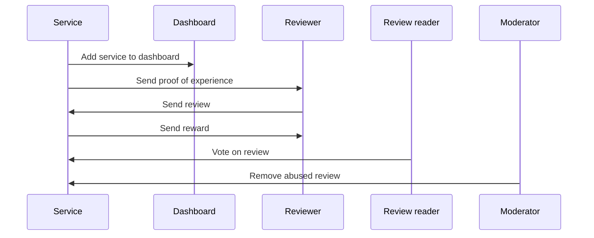

## Introduction

The example demonstrates an implementation of a review rating platform for the food service industry using multisig on Sui.
Unlike traditional review rating platforms that often do not disclose the algorithm used to rate reviews, this example uses an algorithm that is published on-chain for everyone to see and verify. The low gas cost of computation on Sui make it financially feasible to submit, score, and order all reviews on-chain.

## Personas

There are four actors in the typical workflow of the Reviews Rating example.

- Service: Review requester.
- Dashboard: Review hub.
- Reviewer: Review creator.
- Moderator: Review list editor.



### Service Owners

Service owners are entities like restaurants that list their services on the platform. They want to attract more customers by receiving high-rated reviews for their services.

Service owners allocate a specific amount of SUI as a reward pool. Assets from the pool are used to provide rewards for high-rated reviews. A proof of experience (PoE) NFT confirms a reviewer used the service, which the reviewer can burn later to provide a verified review. Service owners provide their customers with unique identifiers (perhaps using QR codes) to identify individual reviewers.

### Reviewers

Reviewers are consumers of services that use the review system. Reviewers provide feedback in the form of comments that detail specific aspects of the service as well as a star rating to inform others. The reviews are rated, with the most effective reviews getting the highest rating. Service owners award the 10 highest rated reviews for their service. How often the rewards are distributed is up to the service owner's discretion; for example, the rewards can be distributed once a week or once a month.

### Review Readers

Review readers access reviews to make informed decisions on selecting services. Readers rate reviews by casting votes. The review readers' ratings are factored into the algorithm that rates the reviews, with the authors of the highest-rated reviews getting rewarded. Although it is not implemented as part of this guide, this example could be extended to award review readers a portion of the rewards for casting votes for reviews.

:::info

See how to create a [Multisig](../cryptography/transaction-auth/multisig.mdx) transactions.
:::

### Moderators

Moderators is a multisig setup ensures that multiple parties must authorize significant actions, such as review removal or reward distribution, adding a layer of security and transparency. Decisions require collective agreement, further ensuring accountability within the moderation process. Moderators monitor content of the reviews and can delete any reviews that contain inappropriate content.

The incentive mechanism for moderators is not implemented for this guide, but service owners can all pay into a pool that goes to moderators on a rolling basis. People can stake moderators to influence what portion of the reward each moderator gets, up to a limit (similar to how validators are staked on chain), and moderator decisions are decided by quorum of stake weight. This process installs incentives for moderators to perform their job well.

## How reviews are scored

The reviews are scored on chain using the following criteria:

- Intrinsic score (IS): Length of review content.
- Extrinsic score (ES): Number of votes a review receives.
- Verification multiplier (VM): Reviews with PoE receive a multiplier to improve rating.

```
Total Score = (IS + ES) * VM
```

## Smart Contracts

There are several modules that create the backend logic for the example.

### Dashboard.move

The `dashboard.move` module defines the `Dashboard` struct that groups services.

```move
/// Dashboard is a collection of services
public struct Dashboard has key, store {
    id: UID,
    service_type: String
}
```

The services are grouped by attributes, which can be cuisine type, geographical location, operating hours, Google Maps ID, and so on. To keep it basic, the example stores only `service_type` (for example, fast food, Chinese, Italian).

```move
/// Creates a new dashboard
public fun create_dashboard(
    service_type: String,
    ctx: &mut TxContext,
) {
    let db = Dashboard {
        id: object::new(ctx),
        service_type
    };
    transfer::share_object(db);
}

/// Registers a service to a dashboard
public fun register_service(db: &mut Dashboard, service_id: ID) {
    df::add(&mut db.id, service_id, service_id);
}
```
A `Dashboard` is a [shared object](../iota-101/objects/object-ownership/shared.mdx), so any service owner can register their service to a dashboard.
A service owner should look for dashboards that best match their service attribute and register.
A [dynamic field](../iota-101/objects/dynamic-fields/dynamic-fields.mdx) stores the list of services that are registered to a dashboard.
A service may be registered to multiple dashboards at the same time. For example, a Chinese-Italian fusion restaurant may be registered to both the Chinese and Italian dashboards.

#### Code Explanation

`create_dashboard` Function:
- **Purpose**: This function creates a new `Dashboard` for a specific service type.
- **Parameters**:
    - **`service_type: String`**: A string representing the type of service the dashboard is created for.
    - **`ctx: &mut TxContext`**: A mutable reference to the transaction context, used to generate unique IDs and manage the transaction environment.
- **Process**:
    - A new `Dashboard` is created with an ID generated by `object::new(ctx)`, and the `service_type` is stored.
    - The `Dashboard` object is then shared with others using `transfer::share_object(db)`, making it accessible for further use.

`register_service` Function:
- **Purpose**: This function registers a service to an existing `Dashboard`.
- **Parameters**:
    - **`db: &mut Dashboard`**: A mutable reference to the `Dashboard` to which the service is being registered.
    - **`service_id: ID`**: The unique identifier of the service being registered.
- **Process**:
    - The function adds the `service_id` to the `Dashboard`'s list of services by invoking `df::add(&mut db.id, service_id, service_id)`.
    - The `df::add` function associates the `service_id` with the dashboard's `id`, effectively linking the service to the dashboard.


:::info

See [Shared versus Owned Objects](../iota-101/objects/object-ownership/shared.mdx) for more information on the differences between object types.

:::

### Review.move

This module defines the `Review` struct.

```move
/// Represents a review of a service
public struct Review has key, store {
    id: UID,
    owner: address,
    service_id: ID,
    content: String,
    // intrinsic score
    len: u64,
    // extrinsic score
    votes: u64,
    time_issued: u64,
    // proof of experience
    has_poe: bool,
    total_score: u64,
    overall_rate: u8,
}

/// Updates the total score of a review
fun update_total_score(rev: &mut Review) {
    rev.total_score = rev.calculate_total_score();
}

/// Calculates the total score of a review
fun calculate_total_score(rev: &Review): u64 {
    let mut intrinsic_score: u64 = rev.len;
    intrinsic_score = math::min(intrinsic_score, 150);
    let extrinsic_score: u64 = 10 * rev.votes;
    // VM = either 1.0 or 2.0 (if user has proof of experience)
    let vm: u64 = if (rev.has_poe) { 2 } else { 1 };
    (intrinsic_score + extrinsic_score) * vm
}
```

In addition to the content of a review, all the elements that are required to compute total score are stored in a `Review` object.

A `Review` is a [shared object](../iota-101/objects/object-ownership/shared.mdx), so anyone can cast a vote on a review and update its `total_score` field.
After `total_score` is updated, the [`update_top_reviews`](#casting-votes) function can be called to update the `top_reviews` field of the `Service` object.

#### Code Explanation

`Review` Struct:

- **`id: UID`**: Unique identifier for the review.
- **`owner: address`**: Address of the review owner.
- **`service_id: ID`**: Identifier of the reviewed service.
- **`content: String`**: The content of the review.
- **`len: u64`**: Represents the length of the review content, considered the *intrinsic score*.
- **`votes: u64`**: Number of upvotes or endorsements for the review, considered the *extrinsic score*.
- **`time_issued: u64`**: Timestamp when the review was written.
- **`has_poe: bool`**: A boolean flag indicating if the reviewer has proof of experience (PoE), which can affect the review's weight.
- **`total_score: u64`**: The overall calculated score of the review.
- **`overall_rate: u8`**: The overall rating given in the review.

`update_total_score` Function:

- This function updates the `total_score` of the review by calling the `calculate_total_score` function.

`calculate_total_score` Function:

- This function calculates the `total_score` based on both intrinsic and extrinsic factors.
    - **`intrinsic_score`**: The score based on the length of the review (`len`). It is capped at 150 using `math::min`.
    - **`extrinsic_score`**: The score based on the number of votes, with each vote contributing 10 points.
    - **VM (Vote Multiplier)**: If the reviewer has proof of experience (`has_poe` is `true`), the score is multiplied by 2; otherwise, it's multiplied by 1.
- The total score is the sum of the intrinsic and extrinsic scores, multiplied by the VM factor.

### Service.move

This module defines the `Service` struct that service owners manage.

```move
const MAX_REVIEWERS_TO_REWARD: u64 = 10;

/// Represents a service
public struct Service has key, store {
    id: UID,
    reward_pool: Balance<SUI>,
    reward: u64,
    top_reviews: vector<ID>,
    reviews: ObjectTable<ID, Review>,
    overall_rate: u64,
    name: String
}
```

### Reward Distribution

The same amount is rewarded to top reviewers, and the reward is distributed to 10 participants at most.
The pool of `SUI` tokens to be distributed to reviewers is stored in the `reward_pool` field, and the amount of `SUI` tokens awarded to each participant is configured in `reward` field.

### Storage for Reviews

Because anyone can submit a review for a service, `Service` is defined as a shared object. All the reviews are stored in the `reviews` field, which has [ObjectTable](../iota-101/move-overview/collections.mdx)`<ID, Review>` type. The `reviews` are stored as children of the shared object, but they are still accessible by their `ID`.
In other words, anyone can go to a transaction explorer and find a review object by its object ID, but they won't be able to use a review as an input to a transaction by its object ID.


The top rated reviews are stored in `top_reviews` field, which has `vector<ID>` type. A simple vector can store the top rated reviews because the maximum number of reviews that can be rewarded is 10.
The elements of `top_reviews` are sorted by the `total_score` of the reviews, with the highest rated reviews coming first. The vector contains the `ID` of the reviews, which can be used to retrieve content and vote count from the relevant `reviews`.

### Casting Votes

A reader can cast a vote on a review to rate it as follows:

```move
/// Upvotes a review and reorders top_reviews
public fun upvote(service: &mut Service, review_id: ID) {
    let review = &mut service.reviews[review_id];
    review.upvote();
    service.reorder(review_id, review.get_total_score());
}

/// Reorders top_reviews after a review is updated
/// If the review is not in top_reviews, it will be added if it is in the top 10
/// Otherwise, it will be reordered
fun reorder(
    service: &mut Service,
    review_id: ID,
    total_score: u64
) {
    let (contains, idx) = service.top_reviews.index_of(&review_id);
    if (!contains) {
        service.update_top_reviews(review_id, total_score);
    } else {
        service.top_reviews.remove(idx);
        let idx = service.find_idx(total_score);
        service.top_reviews.insert(review_id, idx);
    }
}

/// Updates top_reviews if necessary
fun update_top_reviews(
    service: &mut Service,
    review_id: ID,
    total_score: u64
) {
    if (service.should_update_top_reviews(total_score)) {
        let idx = service.find_idx(total_score);
        service.top_reviews.insert(review_id, idx);
        service.prune_top_reviews();
    };
}

/// Finds the index of a review in top_reviews
fun find_idx(service: &Service, total_score: u64): u64 {
    let mut i = service.top_reviews.length();
    while (0 < i) {
        let review_id = service.top_reviews[i - 1];
        if (service.get_total_score(review_id) > total_score) {
            break
        };
        i = i - 1;
    };
    i
}

/// Prunes top_reviews if it exceeds MAX_REVIEWERS_TO_REWARD
fun prune_top_reviews(
    service: &mut Service
) {
    let len = service.top_reviews.length();
    if (len > MAX_REVIEWERS_TO_REWARD) {
        service.top_reviews.pop_back();
    };
}
```

#### Code Explanation

`upvote` Function:
- **Purpose**: This function upvotes a review and reorders the top reviews list.
- **Parameters**:
    - **`service: &mut Service`**: A mutable reference to the `Service` that contains the reviews.
    - **`review_id: ID`**: The unique identifier of the review being upvoted.
- **Process**:
    - Retrieves the review from `service.reviews` using the `review_id`.
    - Calls the `upvote()` method on the review to increment its upvote count.
    - Calls `service.reorder(review_id, review.get_total_score())` to reorder the list of top reviews based on the updated total score of the review.

`reorder` Function:
- **Purpose**: This function reorders the `top_reviews` list after a review is updated.
- **Parameters**:
    - **`service: &mut Service`**: A mutable reference to the `Service` whose `top_reviews` list is being reordered.
    - **`review_id: ID`**: The unique identifier of the review being reordered.
    - **`total_score: u64`**: The updated total score of the review.
- **Process**:
    - Checks if the `review_id` is already in the `top_reviews` list by calling `service.top_reviews.index_of(&review_id)`, which returns whether the review is present (`contains`) and its index (`idx`).
    - If the review is not in `top_reviews`, it calls `service.update_top_reviews(review_id, total_score)` to add the review if it qualifies.
    - If the review is already in `top_reviews`, it removes the review from its current position, finds the new correct position using `service.find_idx(total_score)`, and reinserts it at the correct position.

`update_top_reviews` Function:
- **Purpose**: This function updates the `top_reviews` list by inserting a review if it qualifies for the top 10.
- **Parameters**:
    - **`service: &mut Service`**: A mutable reference to the `Service`.
    - **`review_id: ID`**: The unique identifier of the review to be added.
    - **`total_score: u64`**: The total score of the review.
- **Process**:
    - Checks if the review should be added to `top_reviews` by calling `service.should_update_top_reviews(total_score)`.
    - If it qualifies, the appropriate insertion index is found by calling `service.find_idx(total_score)`.
    - The review is inserted at the calculated index, and `service.prune_top_reviews()` is called to ensure the list doesn’t exceed the maximum allowed number of top reviews.

`find_idx` Function:
- **Purpose**: This function finds the correct index to insert a review into the `top_reviews` list based on its total score.
- **Parameters**:
    - **`service: &Service`**: A reference to the `Service` that contains the `top_reviews`.
    - **`total_score: u64`**: The total score of the review.
- **Process**:
    - Loops through the `top_reviews` list in reverse order (from highest score to lowest) and compares the `total_score` of the current review with those already in the list.
    - The loop stops when it finds a review in the list with a higher score than the new review. The appropriate index (`i`) for insertion is then returned.

`prune_top_reviews` Function:
- **Purpose**: This function ensures that the `top_reviews` list does not exceed the allowed number of reviews to reward.
- **Parameters**:
    - **`service: &mut Service`**: A mutable reference to the `Service`.
- **Process**:
    - Checks if the length of `top_reviews` exceeds `MAX_REVIEWERS_TO_REWARD`.
    - If the list is too long, the review with the lowest score (the last entry) is removed by calling `service.top_reviews.pop_back()`.

Whenever someone casts a vote on a review, the `total_score` of the review is updated and the `update_top_reviews` function updates the `top_reviews` field, as needed.
Casting a vote also triggers a reordering of the `top_reviews` field to ensure that the top rated reviews are always at the top.

### Authorization

```move
/// A capability that can be used to perform admin operations on a service
struct AdminCap has key, store {
    id: UID,
    service_id: ID
}

/// Represents a moderator that can be used to delete reviews
struct Moderator has key {
    id: UID,
}
```

This example follows a capabilities pattern to manage authorizations.
For example, `SERVICE OWNERS` are given `AdminCap` and `MODERATORS` are given `Moderator` such that only they are allowed to perform privileged operations.

To learn more about the capabilities pattern, see [The Move Book](https://move-book.com/programmability/capability.html).

## Conclusion

This tutorial outlined the creation of a decentralized review rating platform using multisig on Sui. Service Owners list their services, Reviewers submit reviews, Review Readers vote on them, and Moderators ensure quality control. Reviews are scored based on content, upvotes, and proof of experience (PoE), with top reviews earning rewards. Multisig moderation adds security by requiring multiple parties to approve key actions like removing reviews or distributing rewards. The platform ensures transparency and fairness by storing the review algorithm and data on-chain, leveraging Move-based smart contracts.
