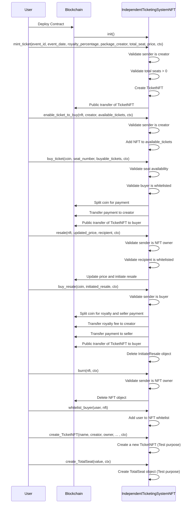

# Independent Ticketing System 

In this tutorial, we will build an independent ticketing system utilizing the Move language for blockchain contracts and the IOTA dApp kit for the frontend application. The project begins with creating a Move package, building and deploying it on the testnet network. Once the backend contract is operational, we will develop the frontend dApp. 

This step-by-step guide provides a comprehensive approach to building a decentralized ticketing system.

## Sequence Diagram 


## Prerequisites

- [Node.js](https://nodejs.org/en) >= v20.18.0
- [npx](https://www.npmjs.com/package/npx) >= 10.8.2
- [iota](https://github.com/iotaledger/iota/releases) >= 0.7.3

## Create a Move Package

Run the following command to create a Move package

```bash
iota move new independent_ticketing_system
```

## Package Overview

### [init](https://github.com/iota-community/independent-ticketing-system/blob/6c6cd27bbf402dc3e1a219a2d6e5556eb968bb59/independent_ticketing_system/sources/independent_ticketing_system.move#L71-L85)

- In will creates three [shared_object] type object - [`Creator`](https://github.com/iota-community/independent-ticketing-system/blob/6c6cd27bbf402dc3e1a219a2d6e5556eb968bb59/independent_ticketing_system/sources/independent_ticketing_system.move#L20-L23), [`TotalSeat`](https://github.com/iota-community/independent-ticketing-system/blob/6c6cd27bbf402dc3e1a219a2d6e5556eb968bb59/independent_ticketing_system/sources/independent_ticketing_system.move#L25-L28), [`AvailableTicketsToBuy`](https://github.com/iota-community/independent-ticketing-system/blob/6c6cd27bbf402dc3e1a219a2d6e5556eb968bb59/independent_ticketing_system/sources/independent_ticketing_system.move#L38-L41)
- [`Creator`](https://github.com/iota-community/independent-ticketing-system/blob/6c6cd27bbf402dc3e1a219a2d6e5556eb968bb59/independent_ticketing_system/sources/independent_ticketing_system.move#L20-L23) - it will contains the address of the package creator.
- [`TotalSeat`](https://github.com/iota-community/independent-ticketing-system/blob/6c6cd27bbf402dc3e1a219a2d6e5556eb968bb59/independent_ticketing_system/sources/independent_ticketing_system.move#L25-L28) - it will contains the total number of seat for the event which will update as per minting the tickets.
- [`AvailableTicketsToBuy`](https://github.com/iota-community/independent-ticketing-system/blob/6c6cd27bbf402dc3e1a219a2d6e5556eb968bb59/independent_ticketing_system/sources/independent_ticketing_system.move#L38-L41) - it will contains the array of all the nft which are minted by the  creator and are available to buy. To buy tickets first user needs to get whitelisted. 

```move reference
https://github.com/iota-community/independent-ticketing-system/blob/6c6cd27bbf402dc3e1a219a2d6e5556eb968bb59/independent_ticketing_system/sources/independent_ticketing_system.move#L71-L85
```

### [mint_ticket](https://github.com/iota-community/independent-ticketing-system/blob/6c6cd27bbf402dc3e1a219a2d6e5556eb968bb59/independent_ticketing_system/sources/independent_ticketing_system.move#L87-L126)

- This function mints the NFTs at the creator address.
- Creator need to pass TotalSeat and Creator object ID to mint the ticket.
- Only the creator can mint the NFTs no one else.

```move reference
https://github.com/iota-community/independent-ticketing-system/blob/6c6cd27bbf402dc3e1a219a2d6e5556eb968bb59/independent_ticketing_system/sources/independent_ticketing_system.move#L87-L126
```

### [enable_ticket_to_buy](https://github.com/iota-community/independent-ticketing-system/blob/6c6cd27bbf402dc3e1a219a2d6e5556eb968bb59/independent_ticketing_system/sources/independent_ticketing_system.move#L128-L134)

- This function is also can only be called by creator because it enable nft to get bought which are minted.
- It Update the AvailableTicketsToBuy shared_object by adding the nft to its array.

```move reference
https://github.com/iota-community/independent-ticketing-system/blob/6c6cd27bbf402dc3e1a219a2d6e5556eb968bb59/independent_ticketing_system/sources/independent_ticketing_system.move#L128-L134
```

### [transfer_ticket](https://github.com/iota-community/independent-ticketing-system/blob/6c6cd27bbf402dc3e1a219a2d6e5556eb968bb59/independent_ticketing_system/sources/independent_ticketing_system.move#L136-L146)

- This will transfer the ownership of the `nft` to the `recipient` address.
- No royalty fee will be provided to the creator when calling this function.

```move reference
https://github.com/iota-community/independent-ticketing-system/blob/6c6cd27bbf402dc3e1a219a2d6e5556eb968bb59/independent_ticketing_system/sources/independent_ticketing_system.move#L136-L146
```

### [resale](https://github.com/iota-community/independent-ticketing-system/blob/6c6cd27bbf402dc3e1a219a2d6e5556eb968bb59/independent_ticketing_system/sources/independent_ticketing_system.move#L149-L170)

- This function will avail the `nft` on resell.
- The `recipient` address needs to first get whiltelisted for the `nft`.
- This function will create a new object named `InitiateResale` and transfer its ownership to the `recipient` address.

```move reference
https://github.com/iota-community/independent-ticketing-system/blob/6c6cd27bbf402dc3e1a219a2d6e5556eb968bb59/independent_ticketing_system/sources/independent_ticketing_system.move#L149-L170
```

### [buy_ticket](https://github.com/iota-community/independent-ticketing-system/blob/6c6cd27bbf402dc3e1a219a2d6e5556eb968bb59/independent_ticketing_system/sources/independent_ticketing_system.move#L173-L210)

- This function can be called to buy the NFTs which are added in the `AvailableTicketsToBuy` object.
- The buyer first needs to get whitelisted.
- The object ID of the `AvailableTicketsToBuy` object will be passed when calling the function.

```move reference
https://github.com/iota-community/independent-ticketing-system/blob/6c6cd27bbf402dc3e1a219a2d6e5556eb968bb59/independent_ticketing_system/sources/independent_ticketing_system.move#L173-L210
```

### [buy_resale](https://github.com/iota-community/independent-ticketing-system/blob/6c6cd27bbf402dc3e1a219a2d6e5556eb968bb59/independent_ticketing_system/sources/independent_ticketing_system.move#L213-L232)

- This function will transfer the ownership of the nft which is wrapped in an `InitiateResale` object.
- The caller address must be same as the buyer address of the `InitiateResale` object.
- An royalty_fee will be transfer to the creator of the nft by the caller of this function.

```move reference
https://github.com/iota-community/independent-ticketing-system/blob/6c6cd27bbf402dc3e1a219a2d6e5556eb968bb59/independent_ticketing_system/sources/independent_ticketing_system.move#L213-L232
```

### [burn](https://github.com/iota-community/independent-ticketing-system/blob/6c6cd27bbf402dc3e1a219a2d6e5556eb968bb59/independent_ticketing_system/sources/independent_ticketing_system.move#L235-L250)

- It burns the nft. The nft object will be deleted from the owner's account.
- Only the owner of the nft can burn the nft. 

```move reference
https://github.com/iota-community/independent-ticketing-system/blob/6c6cd27bbf402dc3e1a219a2d6e5556eb968bb59/independent_ticketing_system/sources/independent_ticketing_system.move#L235-L250
```

### [whitelist_buyer](https://github.com/iota-community/independent-ticketing-system/blob/6c6cd27bbf402dc3e1a219a2d6e5556eb968bb59/independent_ticketing_system/sources/independent_ticketing_system.move#L258-L260)

- This funciton will be called by the owner of an nft to whitelist an user.
- After whitelisting an user, user can becomes eligible to buy the nft.

```move reference
https://github.com/iota-community/independent-ticketing-system/blob/6c6cd27bbf402dc3e1a219a2d6e5556eb968bb59/independent_ticketing_system/sources/independent_ticketing_system.move#L258-L260
```