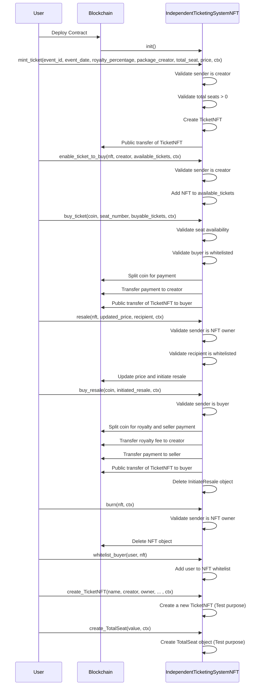

# Independent Ticketing System 

In this tutorial, we will build an independent ticketing system utilizing the Move language for blockchain contracts and the IOTA dApp kit for the frontend application. The project begins with creating a Move package, building and deploying it on the testnet network. Once the backend contract is operational, we will develop the frontend dApp. 

This step-by-step guide provides a comprehensive approach to building a decentralized ticketing system.

## Sequence Diagram 

