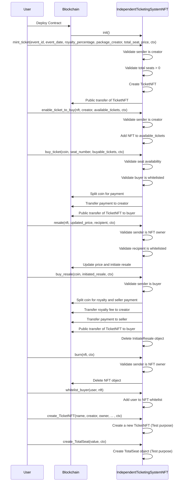

# Independent Ticketing System Tutorial

In this tutorial, we will build an Independent Ticketing System utilizing the Move language for blockchain contracts and the IOTA dApp kit for the frontend application. The project begins with creating a Move package, building and deploying it on the testnet network. Once the backend contract is operational, we will develop the frontend dApp. 

This step-by-step guide provides a comprehensive approach to building a decentralized ticketing system.

## Sequence Diagram 


## Prerequisites

- [Node.js](https://nodejs.org/en) >= v20.18.0
- [npx](https://www.npmjs.com/package/npx) >= 10.8.2
- [iota](https://github.com/iotaledger/iota/releases) >= 0.7.3

## Create a Move Package

Run the following command to create a Move package

```bash
iota move new independent_ticketing_system
```

## Package Overview

### [`init`](https://github.com/iota-community/independent-ticketing-system/blob/6c6cd27bbf402dc3e1a219a2d6e5556eb968bb59/independent_ticketing_system/sources/independent_ticketing_system.move#L71-L85)

- In will create three [`shared_object`](../iota-101/objects/object-ownership/shared.mdx) type object - [`Creator`](https://github.com/iota-community/independent-ticketing-system/blob/6c6cd27bbf402dc3e1a219a2d6e5556eb968bb59/independent_ticketing_system/sources/independent_ticketing_system.move#L20-L23), [`TotalSeat`](https://github.com/iota-community/independent-ticketing-system/blob/6c6cd27bbf402dc3e1a219a2d6e5556eb968bb59/independent_ticketing_system/sources/independent_ticketing_system.move#L25-L28), [`AvailableTicketsToBuy`](https://github.com/iota-community/independent-ticketing-system/blob/6c6cd27bbf402dc3e1a219a2d6e5556eb968bb59/independent_ticketing_system/sources/independent_ticketing_system.move#L38-L41)
- [`Creator`](https://github.com/iota-community/independent-ticketing-system/blob/6c6cd27bbf402dc3e1a219a2d6e5556eb968bb59/independent_ticketing_system/sources/independent_ticketing_system.move#L20-L23) - it will contain the address of the package creator.
- [`TotalSeat`](https://github.com/iota-community/independent-ticketing-system/blob/6c6cd27bbf402dc3e1a219a2d6e5556eb968bb59/independent_ticketing_system/sources/independent_ticketing_system.move#L25-L28) - it will contain the total number of seat for the event which will update as per minting the tickets.
- [`AvailableTicketsToBuy`](https://github.com/iota-community/independent-ticketing-system/blob/6c6cd27bbf402dc3e1a219a2d6e5556eb968bb59/independent_ticketing_system/sources/independent_ticketing_system.move#L38-L41) - it will contains the array of all the nft which are minted by the  creator and are available to buy. To buy tickets first user needs to get whitelisted. 

```move reference
https://github.com/iota-community/independent-ticketing-system/blob/6c6cd27bbf402dc3e1a219a2d6e5556eb968bb59/independent_ticketing_system/sources/independent_ticketing_system.move#L71-L85
```

### [`mint_ticket`](https://github.com/iota-community/independent-ticketing-system/blob/6c6cd27bbf402dc3e1a219a2d6e5556eb968bb59/independent_ticketing_system/sources/independent_ticketing_system.move#L87-L126)

- This function allows the creator to mint NFTs to their address.  
- The creator must provide the total number of seats and the creator's object ID to mint the tickets.  
- Only the creator is authorized to mint these NFTs; no one else can perform this action.

```move reference
https://github.com/iota-community/independent-ticketing-system/blob/6c6cd27bbf402dc3e1a219a2d6e5556eb968bb59/independent_ticketing_system/sources/independent_ticketing_system.move#L87-L126
```

### [`enable_ticket_to_buy`](https://github.com/iota-community/independent-ticketing-system/blob/6c6cd27bbf402dc3e1a219a2d6e5556eb968bb59/independent_ticketing_system/sources/independent_ticketing_system.move#L128-L134)

- This function can only be called by the creator, as it enables the minted NFTs to be available for purchase.  
- It updates the [`AvailableTicketsToBuy`](https://github.com/iota-community/independent-ticketing-system/blob/4eabf7ef0c74e843d95e1658ae071df34488fd04/independent_ticketing_system/sources/independent_ticketing_system.move#L38-L41) shared object by adding the NFT to its array.

```move reference
https://github.com/iota-community/independent-ticketing-system/blob/6c6cd27bbf402dc3e1a219a2d6e5556eb968bb59/independent_ticketing_system/sources/independent_ticketing_system.move#L128-L134
```

### [`transfer_ticket`](https://github.com/iota-community/independent-ticketing-system/blob/6c6cd27bbf402dc3e1a219a2d6e5556eb968bb59/independent_ticketing_system/sources/independent_ticketing_system.move#L136-L146)

- This function transfers the ownership of the `nft` to the `recipient` address.  
- The creator will not receive any royalty fee when this function is called.

```move reference
https://github.com/iota-community/independent-ticketing-system/blob/6c6cd27bbf402dc3e1a219a2d6e5556eb968bb59/independent_ticketing_system/sources/independent_ticketing_system.move#L136-L146
```

### [`resale`](https://github.com/iota-community/independent-ticketing-system/blob/6c6cd27bbf402dc3e1a219a2d6e5556eb968bb59/independent_ticketing_system/sources/independent_ticketing_system.move#L149-L170)

- This function makes the `nft` available for resale.  
- The `recipient` address must first be whitelisted for the `nft`.  
- The function creates a new object called [`InitiateResale`](https://github.com/iota-community/independent-ticketing-system/blob/4eabf7ef0c74e843d95e1658ae071df34488fd04/independent_ticketing_system/sources/independent_ticketing_system.move#L30-L36) and transfers its ownership to the `recipient` address.

```move reference
https://github.com/iota-community/independent-ticketing-system/blob/6c6cd27bbf402dc3e1a219a2d6e5556eb968bb59/independent_ticketing_system/sources/independent_ticketing_system.move#L149-L170
```

### [`buy_ticket`](https://github.com/iota-community/independent-ticketing-system/blob/6c6cd27bbf402dc3e1a219a2d6e5556eb968bb59/independent_ticketing_system/sources/independent_ticketing_system.move#L173-L210)

- This function allows the purchase of NFTs listed in the [`AvailableTicketsToBuy`](https://github.com/iota-community/independent-ticketing-system/blob/4eabf7ef0c74e843d95e1658ae071df34488fd04/independent_ticketing_system/sources/independent_ticketing_system.move#L38-L41) object.  
- The buyer must first be whitelisted.  
- The object ID of the [`AvailableTicketsToBuy`](https://github.com/iota-community/independent-ticketing-system/blob/4eabf7ef0c74e843d95e1658ae071df34488fd04/independent_ticketing_system/sources/independent_ticketing_system.move#L38-L41) object must be provided when calling the function.

```move reference
https://github.com/iota-community/independent-ticketing-system/blob/6c6cd27bbf402dc3e1a219a2d6e5556eb968bb59/independent_ticketing_system/sources/independent_ticketing_system.move#L173-L210
```

### [`buy_resale`](https://github.com/iota-community/independent-ticketing-system/blob/6c6cd27bbf402dc3e1a219a2d6e5556eb968bb59/independent_ticketing_system/sources/independent_ticketing_system.move#L213-L232)

- This function transfers the ownership of the NFT wrapped in the [`InitiateResale`](https://github.com/iota-community/independent-ticketing-system/blob/4eabf7ef0c74e843d95e1658ae071df34488fd04/independent_ticketing_system/sources/independent_ticketing_system.move#L30-L36) object.  
- The caller's address must match the buyer address of the [`InitiateResale`](https://github.com/iota-community/independent-ticketing-system/blob/4eabf7ef0c74e843d95e1658ae071df34488fd04/independent_ticketing_system/sources/independent_ticketing_system.move#L30-L36) object.  
- A royalty fee will be transferred to the creator of the NFT by the caller of this function.

```move reference
https://github.com/iota-community/independent-ticketing-system/blob/6c6cd27bbf402dc3e1a219a2d6e5556eb968bb59/independent_ticketing_system/sources/independent_ticketing_system.move#L213-L232
```

### [`burn`](https://github.com/iota-community/independent-ticketing-system/blob/6c6cd27bbf402dc3e1a219a2d6e5556eb968bb59/independent_ticketing_system/sources/independent_ticketing_system.move#L235-L250)

- This function burns the NFT, removing the NFT object from the owner's account.  
- Only the NFT's owner is authorized to burn the NFT.

```move reference
https://github.com/iota-community/independent-ticketing-system/blob/6c6cd27bbf402dc3e1a219a2d6e5556eb968bb59/independent_ticketing_system/sources/independent_ticketing_system.move#L235-L250
```

### [`whitelist_buyer`](https://github.com/iota-community/independent-ticketing-system/blob/6c6cd27bbf402dc3e1a219a2d6e5556eb968bb59/independent_ticketing_system/sources/independent_ticketing_system.move#L258-L260)

- This function allows the owner of an NFT to whitelist a user.  
- Once whitelisted, the user becomes eligible to purchase the NFT.

```move reference
https://github.com/iota-community/independent-ticketing-system/blob/6c6cd27bbf402dc3e1a219a2d6e5556eb968bb59/independent_ticketing_system/sources/independent_ticketing_system.move#L258-L260
```

See the full example of the contract on [github](https://github.com/iota-community/independent-ticketing-system/blob/main/independent_ticketing_system/sources/independent_ticketing_system.move) .

### [Publish the Package](https://docs.iota.org/developer/getting-started/publish)

Publish the package to the IOTA testnet using the following command:

```bash 
iota client publish
```

## Independent Ticketing System Frontend dApp

Till now you have build the package contract of Independent ticketing system, its time to create the UI. To create the frontend DApp we use [IOTA dApp kit](../../ts-sdk/dapp-kit/index.mdx), apart from dApp kit we will also use an external package for client side routing which is react-router-dom.

### Setup the Frontend dApp

First create an initial react app using the following command

```shell
npm create vite@latest
```

Run the following command to setup the IOTA dApp kit in react app.

```shell
npm add @iota/dapp-kit @iota/iota-sdk @tanstack/react-query
```

### Setting Up Network Configuration

Add the following variables in the [`networkConfig.ts`](https://github.com/iota-community/independent-ticketing-system/blob/main/independent_ticketing_system/Frontend/src/networkConfig.ts) file:

```javascript reference
https://github.com/iota-community/independent-ticketing-system/blob/4eabf7ef0c74e843d95e1658ae071df34488fd04/independent_ticketing_system/Frontend/src/networkConfig.ts#L1-L27
```

* All the shared objects mentioned above were generated during the package publishing process.

* **Note:** To mint a ticket from the UI, ensure that the IOTA wallet account is added to the IOTA CLI. This should be mentioned in the Simple Token Transfer tutorial.

### Folder structure
- [src](https://github.com/iota-community/independent-ticketing-system/blob/main/independent_ticketing_system/Frontend/src)
  * [Components](https://github.com/iota-community/independent-ticketing-system/blob/main/independent_ticketing_system/Frontend/src/components)
    * [molecules](https://github.com/iota-community/independent-ticketing-system/blob/main/independent_ticketing_system/Frontend/src/components/molecules)
      * [Button.tsx](https://github.com/iota-community/independent-ticketing-system/blob/main/independent_ticketing_system/Frontend/src/components/molecules/Button.tsx)
      * [CopyToClipboard.tsx](https://github.com/iota-community/independent-ticketing-system/blob/main/independent_ticketing_system/Frontend/src/components/molecules/CopyToClipboard.tsx)
      * [Loading.tsx](https://github.com/iota-community/independent-ticketing-system/blob/main/independent_ticketing_system/Frontend/src/components/molecules/Loading.tsx)
      * [LoadingBar.tsx](https://github.com/iota-community/independent-ticketing-system/blob/main/independent_ticketing_system/Frontend/src/components/molecules/LoadingBar.tsx)
    * [AvailableTickets.tsx](#availableticketstsx)
    * [BurnTickets.tsx](#burnticketstsx)
    * [Form.tsx](#formtsx)
    * [Home.tsx](#hometsx)
    * [Mint.tsx](#minttsx)
    * [NftForm.tsx](#nftformtsx)
    * [Ownedtickets.tsx](#ownedticketstsx)
    * [ResellTickets.tsx](#resellticketstsx)
    * [TransferTickets.tsx](#transferticketstsx)
  * [hooks](https://github.com/iota-community/independent-ticketing-system/blob/main/independent_ticketing_system/Frontend/src/hooks)
    * [useCreateForm.ts](https://github.com/iota-community/independent-ticketing-system/blob/main/independent_ticketing_system/Frontend/src/hooks/useCreateForm.ts)
  * [utils](https://github.com/iota-community/independent-ticketing-system/blob/main/independent_ticketing_system/Frontend/src/utils)
    * [burn.ts](https://github.com/iota-community/independent-ticketing-system/blob/main/independent_ticketing_system/Frontend/src/utils/Burn.ts)
    * [buyResell.ts](https://github.com/iota-community/independent-ticketing-system/blob/main/independent_ticketing_system/Frontend/src/utils/buyResell.ts)
    * [enableTicketToBuy.ts](https://github.com/iota-community/independent-ticketing-system/blob/main/independent_ticketing_system/Frontend/src/utils/enableTicketToBuy.ts)
    * [mint.ts](https://github.com/iota-community/independent-ticketing-system/blob/main/independent_ticketing_system/Frontend/src/utils/Mint.ts)
    * [parseAddress.ts](https://github.com/iota-community/independent-ticketing-system/blob/main/independent_ticketing_system/Frontend/src/utils/ParseAddress.ts)
    * [resell.ts](https://github.com/iota-community/independent-ticketing-system/blob/main/independent_ticketing_system/Frontend/src/utils/resell.ts)
    * [submitForm.ts](https://github.com/iota-community/independent-ticketing-system/blob/main/independent_ticketing_system/Frontend/src/utils/submitForm.ts)
    * [submitNftForm.ts](https://github.com/iota-community/independent-ticketing-system/blob/main/independent_ticketing_system/Frontend/src/utils/submitNftForm.ts)
    * [transfer.ts](https://github.com/iota-community/independent-ticketing-system/blob/main/independent_ticketing_system/Frontend/src/utils/Transfer.ts)
    * [whilteListBuyer.ts](https://github.com/iota-community/independent-ticketing-system/blob/main/independent_ticketing_system/Frontend/src/utils/whiteListBuyer.ts)
  * [App.tsx](https://github.com/iota-community/independent-ticketing-system/blob/main/independent_ticketing_system/Frontend/src/App.tsx)
  * [constant.tsx](https://github.com/iota-community/independent-ticketing-system/blob/main/independent_ticketing_system/Frontend/src/constant.tsx)
  * [main.tsx](https://github.com/iota-community/independent-ticketing-system/blob/main/independent_ticketing_system/Frontend/src/main.tsx)

### [`App.tsx`](https://github.com/iota-community/independent-ticketing-system/blob/main/independent_ticketing_system/Frontend/src/App.tsx)

This component serves as the entry point, containing the navbar and the `outlet` component for client-side routing.

```javascript reference
https://github.com/iota-community/independent-ticketing-system/blob/4eabf7ef0c74e843d95e1658ae071df34488fd04/independent_ticketing_system/Frontend/src/App.tsx
```

### [`AvailableTickets.tsx`](https://github.com/iota-community/independent-ticketing-system/blob/main/independent_ticketing_system/Frontend/src/components/molecules/AvailableTickets.tsx)

The `AvailableTickets.tsx` component displays all NFT tickets available for purchase, including newly minted tickets and tickets listed for resale.

```javascript reference
https://github.com/iota-community/independent-ticketing-system/blob/4eabf7ef0c74e843d95e1658ae071df34488fd04/independent_ticketing_system/Frontend/src/components/AvailableTickets.tsx
```

### [`BurnTickets.tsx`](https://github.com/iota-community/independent-ticketing-system/blob/main/independent_ticketing_system/Frontend/src/components/molecules/BurnTickets.tsx)

The `BurnTickets.tsx` component handles the burning of ticket nfts. It functions as a child component of [`OwnedTickets.tsx`](#ownedticketstsx) and is rendered only when a ticket listed by the `OwnedTickets.tsx` component is being burned.

```javascript reference
https://github.com/iota-community/independent-ticketing-system/blob/4eabf7ef0c74e843d95e1658ae071df34488fd04/independent_ticketing_system/Frontend/src/components/BurnTickets.tsx
```

### [`Form.tsx`](https://github.com/iota-community/independent-ticketing-system/blob/main/independent_ticketing_system/Frontend/src/components/Form.tsx)

The `Form.tsx` component is an input form used to collect inputs for all operations. It is a versatile component utilized everywhere except in the [`OwnedTickets.tsx`](#ownedticketstsx) operation.

```javascript reference
https://github.com/iota-community/independent-ticketing-system/blob/4eabf7ef0c74e843d95e1658ae071df34488fd04/independent_ticketing_system/Frontend/src/components/Form.tsx
```

### [`Home.tsx`](https://github.com/iota-community/independent-ticketing-system/blob/main/independent_ticketing_system/Frontend/src/components/Home.tsx)

The `Home.tsx` component displays buttons for all operations and a list of owned objects associated with the currently connected account.

```javascript reference
https://github.com/iota-community/independent-ticketing-system/blob/4eabf7ef0c74e843d95e1658ae071df34488fd04/independent_ticketing_system/Frontend/src/components/Home.tsx
```

### [`Mint.tsx`](https://github.com/iota-community/independent-ticketing-system/blob/main/independent_ticketing_system/Frontend/src/components/Mint.tsx)

The `Mint.tsx` component allows the creator to mint tickets and is exclusively accessible to them.

```javascript reference
https://github.com/iota-community/independent-ticketing-system/blob/4eabf7ef0c74e843d95e1658ae071df34488fd04/independent_ticketing_system/Frontend/src/components/Mint.tsx
```

### [`NftForm.tsx`](https://github.com/iota-community/independent-ticketing-system/blob/main/independent_ticketing_system/Frontend/src/components/NftForm.tsx)

The `NftForm.tsx` is an input form used specifically in the [`OwnedTickets.tsx`](#ownedticketstsx) operation.

```javascript reference
https://github.com/iota-community/independent-ticketing-system/blob/4eabf7ef0c74e843d95e1658ae071df34488fd04/independent_ticketing_system/Frontend/src/components/NftForm.tsx
```

### [`Ownedtickets.tsx`](https://github.com/iota-community/independent-ticketing-system/blob/main/independent_ticketing_system/Frontend/src/components/Ownedtickets.tsx)

The [`OwnedTickets.tsx`](#ownedticketstsx) component lists all the NFT tickets owned by the connected account. It only displays objects of the `TicketNFT` type, excluding other types.

```javascript reference
https://github.com/iota-community/independent-ticketing-system/blob/4eabf7ef0c74e843d95e1658ae071df34488fd04/independent_ticketing_system/Frontend/src/components/OwnedTickets.tsx
```

### [`ResellTickets.tsx`](https://github.com/iota-community/independent-ticketing-system/blob/main/independent_ticketing_system/Frontend/src/components/ResellTickets.tsx)

The `ResellTickets.tsx` component is used for reselling NFTs. It is only utilized when someone resells an NFT listed in the [`OwnedTickets.tsx`](#ownedticketstsx) component.

```javascript reference
https://github.com/iota-community/independent-ticketing-system/blob/4eabf7ef0c74e843d95e1658ae071df34488fd04/independent_ticketing_system/Frontend/src/components/ResellTickets.tsx
```

### [`TransferTickets.tsx`](https://github.com/iota-community/independent-ticketing-system/blob/main/independent_ticketing_system/Frontend/src/components/TransferTickets.tsx)

The `TransferTickets.tsx` component is used to transfer the ownership of an NFT to another recipient address. Similar to the `BurnTickets.tsx` and `ResellTickets.tsx` components, this component is rendered when someone transfers an NFT from the list of NFTs in the `OwnedTickets.tsx` component.

```javascript reference
https://github.com/iota-community/independent-ticketing-system/blob/4eabf7ef0c74e843d95e1658ae071df34488fd04/independent_ticketing_system/Frontend/src/components/TransferTickets.tsx
```

- **Deployed Frontend Application**: [Independent Ticketing System](https://independent-ticketing-system.netlify.app/)

## Usage Example

### Dashboard


### Mint Tokens

- Click on the mint button located at the top-right corner (ensure that the creator account is connected).


### Whitelist Users

- Before making the ticket available for purchase, whitelist the users first.


### Enable Ticket to Buy

- After whitelisting users, you can add the ticket to the `AvailableTickets` object. Follow the steps below to complete this process.


### Buy Ticket

- To buy a ticket, enter the seat number and your IOTA coin address.


- Once the ticket is purchased, the NFT will be displayed on the dashboard as shown below:


### Resell Ticket

- Resell a ticket by wrapping the NFT into another object (`InitiateResale`). You can either update the price of the NFT or keep the same price as before.


### Transfer Ticket

- To transfer a ticket, click on the transfer button on the dashboard page or on the transfer button of the NFT listed under owned tickets, and enter the NFT ID.


- After the transaction, the NFT will appear under the recipient's address, as shown below:


## Conclusion

In this tutorial, we successfully built an independent ticketing system where NFT tickets are created using the IOTA Move language for the contract package. We went through the functionality of the contract step by step and demonstrated how it works within the system. Additionally, we explored the integration of the IOTA dApp kit into the frontend, providing a comprehensive guide for building a fully functional dApp. Each component was explained in detail, from minting and transferring tickets to reselling and burning them, ensuring a clear understanding of the system. By following this tutorial, you should now be well-equipped to develop and deploy your own ticketing application using IOTA's technologies, offering a secure and decentralized solution for ticket management.