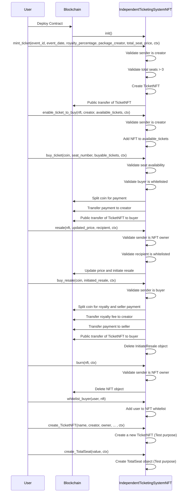

# Independent Ticketing System Tutorial

In this tutorial, we will build an Independent Ticketing System utilizing the Move language for blockchain contracts and the [IOTA dApp kit](../../../ts-sdk/dapp-kit) for the frontend application. The project begins with creating a Move package, building and deploying it on the testnet network. Once the backend contract is operational, we will develop the frontend dApp. 

## Sequence Diagram 


## Prerequisites

- [Node.js](https://nodejs.org/en) >= v20.18.0
- [npx](https://www.npmjs.com/package/npx) >= 10.8.2
- [iota](https://github.com/iotaledger/iota/releases) >= 0.7.3

## [Create a Move Package](../create-a-package.mdx)

Run the following command to create a Move package:

```bash
iota move new independent_ticketing_system
```

## Package Overview

### [`init`](https://github.com/iota-community/independent-ticketing-system/blob/6c6cd27bbf402dc3e1a219a2d6e5556eb968bb59/independent_ticketing_system/sources/independent_ticketing_system.move#L71-L85)

In MOVE, the `init` function only runs once at the time of package publication. Read more: [`init`](../../iota-101/move-overview/init)
The `init` function will create three [`shared_object`](../../iota-101/objects/object-ownership/shared.mdx) type objects: 
- [`Creator`](https://github.com/iota-community/independent-ticketing-system/blob/6c6cd27bbf402dc3e1a219a2d6e5556eb968bb59/independent_ticketing_system/sources/independent_ticketing_system.move#L20-L23) will store the address of the package creator.
- [`TotalSeat`](https://github.com/iota-community/independent-ticketing-system/blob/6c6cd27bbf402dc3e1a219a2d6e5556eb968bb59/independent_ticketing_system/sources/independent_ticketing_system.move#L25-L28) - it will contain the total number of seat for the event which will update as per minting the tickets.
- [`AvailableTicketsToBuy`](https://github.com/iota-community/independent-ticketing-system/blob/6c6cd27bbf402dc3e1a219a2d6e5556eb968bb59/independent_ticketing_system/sources/independent_ticketing_system.move#L38-L41) - it will contains the array of all the nft which are minted by the  creator and are available to buy. To buy tickets first user needs to get whitelisted. 

```move reference
https://github.com/iota-community/independent-ticketing-system/blob/6c6cd27bbf402dc3e1a219a2d6e5556eb968bb59/independent_ticketing_system/sources/independent_ticketing_system.move#L71-L85
```

### [`mint_ticket`](https://github.com/iota-community/independent-ticketing-system/blob/6c6cd27bbf402dc3e1a219a2d6e5556eb968bb59/independent_ticketing_system/sources/independent_ticketing_system.move#L87-L126)

- This function allows the creator to mint NFTs to their address.  
- The creator must provide the total number of seats and the creator's object ID to mint the tickets.  
- Only the creator is authorized to mint these NFTs; no one else can perform this action.

```move reference
https://github.com/iota-community/independent-ticketing-system/blob/6c6cd27bbf402dc3e1a219a2d6e5556eb968bb59/independent_ticketing_system/sources/independent_ticketing_system.move#L87-L126
```

### [`enable_ticket_to_buy`](https://github.com/iota-community/independent-ticketing-system/blob/6c6cd27bbf402dc3e1a219a2d6e5556eb968bb59/independent_ticketing_system/sources/independent_ticketing_system.move#L128-L134)

- This function can only be called by the creator, as it enables the minted NFTs to be available for purchase.  
- It updates the [`AvailableTicketsToBuy`](https://github.com/iota-community/independent-ticketing-system/blob/4eabf7ef0c74e843d95e1658ae071df34488fd04/independent_ticketing_system/sources/independent_ticketing_system.move#L38-L41) shared object by adding the NFT to its array.

```move reference
https://github.com/iota-community/independent-ticketing-system/blob/6c6cd27bbf402dc3e1a219a2d6e5556eb968bb59/independent_ticketing_system/sources/independent_ticketing_system.move#L128-L134
```

### [`transfer_ticket`](https://github.com/iota-community/independent-ticketing-system/blob/6c6cd27bbf402dc3e1a219a2d6e5556eb968bb59/independent_ticketing_system/sources/independent_ticketing_system.move#L136-L146)

- This function transfers the ownership of the `nft` to the `recipient` address.  
- The creator will not receive any royalty fee when this function is called.

```move reference
https://github.com/iota-community/independent-ticketing-system/blob/6c6cd27bbf402dc3e1a219a2d6e5556eb968bb59/independent_ticketing_system/sources/independent_ticketing_system.move#L136-L146
```

### [`resale`](https://github.com/iota-community/independent-ticketing-system/blob/6c6cd27bbf402dc3e1a219a2d6e5556eb968bb59/independent_ticketing_system/sources/independent_ticketing_system.move#L149-L170)

- This function makes the `nft` available for resale.  
- The `recipient` address must first be whitelisted for the `nft`.  
- The function creates a new object called [`InitiateResale`](https://github.com/iota-community/independent-ticketing-system/blob/4eabf7ef0c74e843d95e1658ae071df34488fd04/independent_ticketing_system/sources/independent_ticketing_system.move#L30-L36) and transfers its ownership to the `recipient` address.

```move reference
https://github.com/iota-community/independent-ticketing-system/blob/6c6cd27bbf402dc3e1a219a2d6e5556eb968bb59/independent_ticketing_system/sources/independent_ticketing_system.move#L149-L170
```

### [`buy_ticket`](https://github.com/iota-community/independent-ticketing-system/blob/6c6cd27bbf402dc3e1a219a2d6e5556eb968bb59/independent_ticketing_system/sources/independent_ticketing_system.move#L173-L210)

- This function allows the purchase of NFTs listed in the [`AvailableTicketsToBuy`](https://github.com/iota-community/independent-ticketing-system/blob/4eabf7ef0c74e843d95e1658ae071df34488fd04/independent_ticketing_system/sources/independent_ticketing_system.move#L38-L41) object.  
- The buyer must first be whitelisted.  
- The object ID of the [`AvailableTicketsToBuy`](https://github.com/iota-community/independent-ticketing-system/blob/4eabf7ef0c74e843d95e1658ae071df34488fd04/independent_ticketing_system/sources/independent_ticketing_system.move#L38-L41) object must be provided when calling the function.

```move reference
https://github.com/iota-community/independent-ticketing-system/blob/6c6cd27bbf402dc3e1a219a2d6e5556eb968bb59/independent_ticketing_system/sources/independent_ticketing_system.move#L173-L210
```

### [`buy_resale`](https://github.com/iota-community/independent-ticketing-system/blob/6c6cd27bbf402dc3e1a219a2d6e5556eb968bb59/independent_ticketing_system/sources/independent_ticketing_system.move#L213-L232)

- This function transfers the ownership of the NFT wrapped in the [`InitiateResale`](https://github.com/iota-community/independent-ticketing-system/blob/4eabf7ef0c74e843d95e1658ae071df34488fd04/independent_ticketing_system/sources/independent_ticketing_system.move#L30-L36) object.  
- The caller's address must match the buyer address of the [`InitiateResale`](https://github.com/iota-community/independent-ticketing-system/blob/4eabf7ef0c74e843d95e1658ae071df34488fd04/independent_ticketing_system/sources/independent_ticketing_system.move#L30-L36) object.  
- A royalty fee will be transferred to the creator of the NFT by the caller of this function.

```move reference
https://github.com/iota-community/independent-ticketing-system/blob/6c6cd27bbf402dc3e1a219a2d6e5556eb968bb59/independent_ticketing_system/sources/independent_ticketing_system.move#L213-L232
```

### [`burn`](https://github.com/iota-community/independent-ticketing-system/blob/6c6cd27bbf402dc3e1a219a2d6e5556eb968bb59/independent_ticketing_system/sources/independent_ticketing_system.move#L235-L250)

- This function burns the NFT, removing the NFT object from the owner's account.  
- Only the NFT's owner is authorized to burn the NFT.

```move reference
https://github.com/iota-community/independent-ticketing-system/blob/6c6cd27bbf402dc3e1a219a2d6e5556eb968bb59/independent_ticketing_system/sources/independent_ticketing_system.move#L235-L250
```

### [`whitelist_buyer`](https://github.com/iota-community/independent-ticketing-system/blob/6c6cd27bbf402dc3e1a219a2d6e5556eb968bb59/independent_ticketing_system/sources/independent_ticketing_system.move#L258-L260)

- This function allows the owner of an NFT to whitelist a user.  
- Once whitelisted, the user becomes eligible to purchase the NFT.

```move reference
https://github.com/iota-community/independent-ticketing-system/blob/6c6cd27bbf402dc3e1a219a2d6e5556eb968bb59/independent_ticketing_system/sources/independent_ticketing_system.move#L258-L260
```

See the full example of the contract on [github](https://github.com/iota-community/independent-ticketing-system/blob/main/independent_ticketing_system/sources/independent_ticketing_system.move) .

### [Publish the Package](https://docs.iota.org/developer/getting-started/publish)

Publish the package to the IOTA testnet using the following command:

```bash 
iota client publish
```