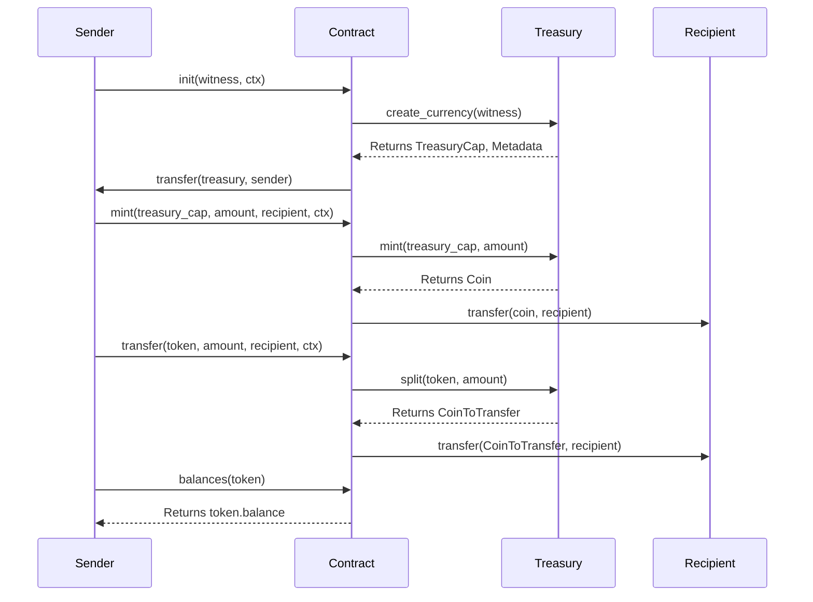

# Before You Start

Simple Token Transfer App

It's a good idea to look at the toolbox before you start building. This section will give you a quick overview
of the most important tools to get started:

* How you can interact with IOTA Nodes using the [CLI](#iota-cli) or the [available SDKs](#iota-sdks).
* IDEs and plugins.

## Interact with IOTA

### IOTA CLI

The [IOTA CLI](../../references/cli.mdx) provides a handy interface you can use to perform all sorts of operation with
IOTA nodes.

### IOTA SDKs

IOTA provides two official SDKs that you can use to interact with the IOTA network from your dApp:

* [Typescript SDK](../../references/ts-sdk/typescript/index.mdx)
* [Rust SDK](../../references/rust-sdk.mdx)

## Move IDEs and plugins

We recommend that you use the [Visual Studio Code](https://code.visualstudio.com/) IDE with the [IOTA Move](https://marketplace.visualstudio.com/items?itemName=iotaledger.iota-move) extension installed.