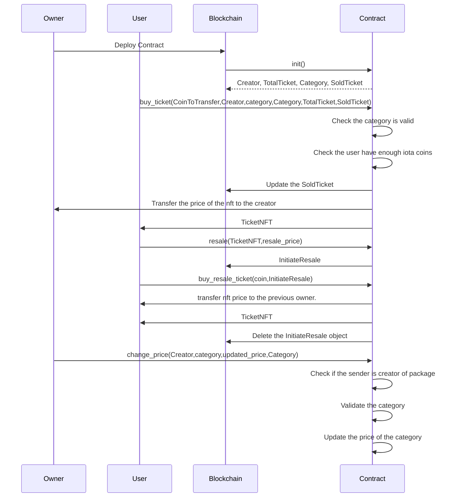

# Live Concerts Ticketing System

In this tutorial, we will create an on chain live concerts ticketing system on which user can buy ticket for the concert. There will be multiple categories of tickets and a every single ticket will be an nft and can be different price also after being same category. The admin can update the price of tickets categories wise. A user can also resale the ticket specifying the price of the ticket. The tutorial will cover the move package and the frontend dApp part. We will walk you through step by step process of creating move package and the frontend dApp using iota dApp kit. By the end, you'll have a fully functional dApp that allows users to buy/resale tickets effortlessly.

## Live Concerts Ticketing System Architecture Overview



## Prerequisites

- [Node.js](https://nodejs.org/) >=v20.18.0
- [npx](https://www.npmjs.com/package/npx) >=10.8.2
- [iota](https://github.com/iotaledger/iota/releases) >=0.7.3 

## Create a Move Package

Run the following command to [create a Move package](/developer/getting-started/create-a-package):


```bash
iota move new live_concert && cd live_concert
```

## Package Overview

### [`init`](https://github.com/iota-community/on-chain-live-concerts-ticketing-system/blob/847b2f98e5de6523072d7058b89ebc96105589aa/package/sources/live_concert.move#L66-L96)

In Move, the [`init`](../iota-101/move-overview/init) function only runs once at package publication.
The `init` function will create four [`shared_object`](../iota-101/objects/object-ownership/shared.mdx) type objects: 
- [`Creator`](https://github.com/iota-community/on-chain-live-concerts-ticketing-system/blob/847b2f98e5de6523072d7058b89ebc96105589aa/package/sources/live_concert.move#L18-L21) will use to verify the creator of the package.
- [`TotalTicket`](https://github.com/iota-community/on-chain-live-concerts-ticketing-system/blob/847b2f98e5de6523072d7058b89ebc96105589aa/package/sources/live_concert.move#L23-L29) will store the total number of seats of concerts.
- [`SoldTicket`](https://github.com/iota-community/on-chain-live-concerts-ticketing-system/blob/847b2f98e5de6523072d7058b89ebc96105589aa/package/sources/live_concert.move#L30-L36) will store the total number of seats sold till date.
- [`Category`](https://github.com/iota-community/on-chain-live-concerts-ticketing-system/blob/847b2f98e5de6523072d7058b89ebc96105589aa/package/sources/live_concert.move#L45-L48) will store all types of seats (silver,gold and platinium)

```move reference
https://github.com/iota-community/on-chain-live-concerts-ticketing-system/blob/847b2f98e5de6523072d7058b89ebc96105589aa/package/sources/live_concert.move#L66-L96
```

### [`buy_ticket`](https://github.com/iota-community/on-chain-live-concerts-ticketing-system/blob/847b2f98e5de6523072d7058b89ebc96105589aa/package/sources/live_concert.move#L99-L133)

- This function allows the purchase of tickets.
- Anyone can buy any tickets.  
- This function will set a limit on resaling the ticket nft.

```move reference
https://github.com/iota-community/on-chain-live-concerts-ticketing-system/blob/847b2f98e5de6523072d7058b89ebc96105589aa/package/sources/live_concert.move#L99-L133
```

### [`resale`](https://github.com/iota-community/on-chain-live-concerts-ticketing-system/blob/847b2f98e5de6523072d7058b89ebc96105589aa/package/sources/live_concert.move#L150-L164)

- This function allows user to resale their tickets.
- User can also set the price at which they wants to resale the ticket.
- The `resale` function then creates an [`shared_object`](../iota-101/objects/object-ownership/shared.mdx) type objects `InitiateResale` in which the nft and its resaling price will be stored.

```move reference
https://github.com/iota-community/on-chain-live-concerts-ticketing-system/blob/847b2f98e5de6523072d7058b89ebc96105589aa/package/sources/live_concert.move#L150-L164
```

### [`buy_resale_ticket`](https://github.com/iota-community/on-chain-live-concerts-ticketing-system/blob/847b2f98e5de6523072d7058b89ebc96105589aa/package/sources/live_concert.move#L167-L187)

- This function will to buy the tickets which are on resale.
- User will pass the address of `InitiateResale` object address which store the nft user wants to buy.
- The function then unwrap the nft from the shared object and transfer it to the sender.
- The `InitiateResale` object will be deleted and the price of resaling the nft will transfer to its previous owner.

```move reference
https://github.com/iota-community/on-chain-live-concerts-ticketing-system/blob/847b2f98e5de6523072d7058b89ebc96105589aa/package/sources/live_concert.move#L167-L187
```

### [`change_price`](https://github.com/iota-community/on-chain-live-concerts-ticketing-system/blob/847b2f98e5de6523072d7058b89ebc96105589aa/package/sources/live_concert.move#L135-L148)

- Only the creator of the package can call this function.
- This function allow to change the price of a category.
- This will update the `Category` object.

```move reference
https://github.com/iota-community/on-chain-live-concerts-ticketing-system/blob/847b2f98e5de6523072d7058b89ebc96105589aa/package/sources/live_concert.move#L135-L148
```

::: Note
There are some helper function also in the package which are used inside the above functions.
:::

See the full example of the contract on [github](https://github.com/iota-community/independent-ticketing-system/blob/main/independent_ticketing_system/sources/independent_ticketing_system.move) .

### Write Unit Test

After creating the module write the test for all the functions. Move the below code to the `live_concert_tests.move` file:

```move reference
https://github.com/iota-community/on-chain-live-concerts-ticketing-system/blob/847b2f98e5de6523072d7058b89ebc96105589aa/package/tests/live_concert_tests.move
```

### Publish the Package


[Publish](./publish.mdx) the package to the IOTA Testnet using the following command:

```bash 
iota client publish
```

## Frontend dApp

Now let's create the ui part of the live concert ticketing system. To build the its frontend dApp we will use like always the [IOTA dApp kit](../../../ts-sdk/dapp-kit/).


### Setup 

Run the following command to setup the initial app:

```bash
npm create @iota/create-dapp
```

### Set Up Network Configuration

Add the following variables in the [`networkConfig.ts`](https://github.com/iota-community/on-chain-live-concerts-ticketing-system/blob/main/frontend/src/networkConfig.ts) file:

```javascript reference
https://github.com/iota-community/on-chain-live-concerts-ticketing-system/blob/847b2f98e5de6523072d7058b89ebc96105589aa/frontend/src/networkConfig.ts
```

To get the address for the above variables see the transaction digest of your package publication or see the public transaction on iota testnet explorer.

### Folder Structure

- [src](https://github.com/iota-community/on-chain-live-concerts-ticketing-system/tree/main/frontend/src)
   * [components](https://github.com/iota-community/on-chain-live-concerts-ticketing-system/tree/main/frontend/src/components)
      * [Button.tsx](https://github.com/iota-community/on-chain-live-concerts-ticketing-system/blob/main/frontend/src/components/Button.tsx)
      * [Form.tsx](https://github.com/iota-community/on-chain-live-concerts-ticketing-system/blob/main/frontend/src/components/Form.tsx)
      * [Home.tsx](https://github.com/iota-community/on-chain-live-concerts-ticketing-system/blob/main/frontend/src/components/Home.tsx)
      * [Loading.tsx](https://github.com/iota-community/on-chain-live-concerts-ticketing-system/blob/main/frontend/src/components/Loading.tsx)
      * [LoadingBar.tsx](https://github.com/iota-community/on-chain-live-concerts-ticketing-system/blob/main/frontend/src/components/LoadingBar.tsx)
   * [hooks](https://github.com/iota-community/on-chain-live-concerts-ticketing-system/blob/main/frontend/src/hooks)
      * [userForm.ts](https://github.com/iota-community/on-chain-live-concerts-ticketing-system/blob/main/frontend/src/hooks/userForm.ts)
   * [utils](https://github.com/iota-community/on-chain-live-concerts-ticketing-system/blob/main/frontend/src/utils)
      * [buyResaleTicket.ts](https://github.com/iota-community/on-chain-live-concerts-ticketing-system/blob/main/frontend/src/utils/buyResaleTicket.ts)
      * [buyTicket.ts](https://github.com/iota-community/on-chain-live-concerts-ticketing-system/blob/main/frontend/src/utils/buyTicket.ts)
      * [changePrice.ts](https://github.com/iota-community/on-chain-live-concerts-ticketing-system/blob/main/frontend/src/utils/changePrice.ts)
      * [parseAddress.ts](https://github.com/iota-community/on-chain-live-concerts-ticketing-system/blob/main/frontend/src/utils/parseAddress.ts)
      * [resale.ts](https://github.com/iota-community/on-chain-live-concerts-ticketing-system/blob/main/frontend/src/utils/resale.ts)
      * [submitForm.ts](https://github.com/iota-community/on-chain-live-concerts-ticketing-system/blob/main/frontend/src/utils/submitForm.ts)
   * [App.tsx](https://github.com/iota-community/on-chain-live-concerts-ticketing-system/blob/main/frontend/src/App.tsx)
   * [main.tsx](https://github.com/iota-community/on-chain-live-concerts-ticketing-system/blob/main/frontend/src/main.tsx)

### [Form.tsx](https://github.com/iota-community/on-chain-live-concerts-ticketing-system/blob/main/frontend/src/components/Form.tsx)

The `Form.tsx` component is an input form used to collect inputs for all operations. It is a versatile component utilized everywhere.

```javascript reference
https://github.com/iota-community/on-chain-live-concerts-ticketing-system/blob/847b2f98e5de6523072d7058b89ebc96105589aa/frontend/src/components/Form.tsx
```

### [Home.tsx](https://github.com/iota-community/on-chain-live-concerts-ticketing-system/blob/main/frontend/src/components/Home.tsx)

The `Home.tsx` component displays buttons for all operations and a list of owned objects associated with the currently connected account.

```javascript reference
https://github.com/iota-community/on-chain-live-concerts-ticketing-system/blob/847b2f98e5de6523072d7058b89ebc96105589aa/frontend/src/components/Home.tsx
```

### [buyResaleTicket.ts](https://github.com/iota-community/on-chain-live-concerts-ticketing-system/blob/main/frontend/src/utils/buyResaleTicket.ts)

In this file we will call the `buy_resale_ticket` function of the package:

```typescript reference
https://github.com/iota-community/on-chain-live-concerts-ticketing-system/blob/847b2f98e5de6523072d7058b89ebc96105589aa/frontend/src/utils/buyResaleTicket.ts
```

### [buyTicket.ts](https://github.com/iota-community/on-chain-live-concerts-ticketing-system/blob/main/frontend/src/utils/buyTicket.ts)

In this file we will call the `buy_ticket` function of the package:

```typescript reference
https://github.com/iota-community/on-chain-live-concerts-ticketing-system/blob/847b2f98e5de6523072d7058b89ebc96105589aa/frontend/src/utils/buyTicket.ts
```

### [changePrice.ts](https://github.com/iota-community/on-chain-live-concerts-ticketing-system/blob/main/frontend/src/utils/changePrice.ts)

In this file we will call the `change_price` function of the package:

```typescript reference
https://github.com/iota-community/on-chain-live-concerts-ticketing-system/blob/847b2f98e5de6523072d7058b89ebc96105589aa/frontend/src/utils/changePrice.ts
```

### [resale.ts](https://github.com/iota-community/on-chain-live-concerts-ticketing-system/blob/main/frontend/src/utils/resale.ts)

In this file we will call the `resale` function of the package:

```typescript reference
https://github.com/iota-community/on-chain-live-concerts-ticketing-system/blob/847b2f98e5de6523072d7058b89ebc96105589aa/frontend/src/utils/resale.ts
```

### [submitForm.ts](https://github.com/iota-community/on-chain-live-concerts-ticketing-system/blob/main/frontend/src/utils/submitForm.ts)

This file contains a function while calls function for specific operation like buy or resale.

```typescript reference
https://github.com/iota-community/on-chain-live-concerts-ticketing-system/blob/847b2f98e5de6523072d7058b89ebc96105589aa/frontend/src/utils/submitForm.ts
```

### [App.tsx](https://github.com/iota-community/on-chain-live-concerts-ticketing-system/blob/main/frontend/src/App.tsx)

This component serves as the entry point, containing the navbar and the home component.

```javascript reference
https://github.com/iota-community/on-chain-live-concerts-ticketing-system/blob/847b2f98e5de6523072d7058b89ebc96105589aa/frontend/src/App.tsx
```


## Usage Example

### Dashboard


