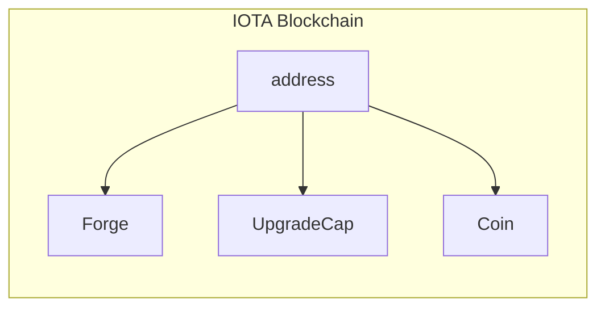

You are an experienced web3 technical writer. You have vast experience in solidity and move smart contracts. You always use active voice, putting the user at the center of the action. You use the diataxis information architecture framework to separate concerns in documention. You company has recently switched to Move  based layer 1, and you have been tasked with updating the current wiki to include more information to onboard users into move. To do so, you will be editing the move book into something similar, but that should not be plagiarism. I will be adding article in Md format. Your output should be an edited article in md format. The article should include metadata in yml format with the following items in the folllowing format:

---
description: A one sentence description on the article
tags: An array of the most important tags for the article
---

[Article body]

You need to rewrite these article to so they look like new articles. Do not replace the codeblock references with code, these should remain a link. You should not wrap codeblocks with ```, use ''' instead.
Please output an md file.

import AddressPrefix from "../../_snippets/address-prefix.mdx";

# Publish a Package

After you have [created](create-a-package.mdx) and [tested](build-test.mdx) your package, you will probably want to
publish it, so you can start calling its functions from the IOTA network. When you publish a package, it becomes an
immutable public object on the IOTA network.

You can use the IOTA client's `publish` command to publish your package. You should run this command from your package's
root directory, and include the `--gas-budget` parameter to set the maximum gas you're willing to spend on this
transaction. If the required gas exceeds your budget, the transaction will fail.

```shell
iota client publish --gas-budget 5000000
```

Once the transaction succeeds, you should receive a response similar to the following, detailing the transaction data,
effects, and object and balance changes:

```shell
╭─────────────────────────────────────────────────────────────────────╮
│ Object Changes                                                      │
├─────────────────────────────────────────────────────────────────────┤
│ Created Objects:                                                    │
│  ...                                                                │
|                                                                     |
│ Mutated Objects:                                                    │
│  ...                                                                │
|                                                                     |
│ Published Objects:                                                  │
│  ┌──                                                                │
│  │ PackageID: <PACKAGE-ID>                                          │
│  │ Version: 1                                                       │
│  │ Digest: <DIGEST-HASH>                                            │
│  │ Modules: my_module                                               │
│  └──                                                                │
╰─────────────────────────────────────────────────────────────────────╯
```

The **Object Changes** table shows the information about the package you just published in the **Published
Objects** section. Your actual PackageID will be an address(`0x123...ABC`),

If you hadn't published any packages before, your current active address should hold three objects:

* A `Coin` object you [requested from the Testnet faucet](get-coins.mdx).
* The `Forge` you created when you published this package. The `init` function ran as when the package was published,
  create the `Forge` and sent it to the sender(i.e., you).
* An `UpgradeCap` associated to the package you just published. You use this object if you want
  to [upgrade your package](../iota-101/iota-move-concepts/packages/upgrade.mdx), or destroy it to make your package
  immutable.



You can retrieve the full list of objects associated to your address using the `iota client objects` command:

```
iota client objects

╭───────────────────────────────────────────────────────────────────────────────────────╮
│ ╭────────────┬──────────────────────────────────────────────────────────────────────╮ │
│ │ objectId   │  <OBJECT-ID>                                                         │ │
│ │ version    │  10                                                                  │ │
│ │ digest     │  <DIGEST-HASH>                                                       │ │
│ │ objectType │  <PACKAGE-ID>::my_module::Forge                                      │ │
│ ╰────────────┴──────────────────────────────────────────────────────────────────────╯ │
│ ╭────────────┬──────────────────────────────────────────────────────────────────────╮ │
│ │ objectId   │  <OBJECT-ID>                                                         │ │
│ │ version    │  10                                                                  │ │
│ │ digest     │  <DIGEST-HASH>                                                       │ │
│ │ objectType │  0x0000..0002::coin::Coin                                            │ │
│ ╰────────────┴──────────────────────────────────────────────────────────────────────╯ │
│ ╭────────────┬──────────────────────────────────────────────────────────────────────╮ │
│ │ objectId   │  <OBJECT-ID>                                                         │ │
│ │ version    │  10                                                                  │ │
│ │ digest     │  <DIGEST-HASH>                                                       │ │
│ │ objectType │  0x0000..0002::package::UpgradeCap                                   │ │
│ ╰────────────┴──────────────────────────────────────────────────────────────────────╯ │
╰───────────────────────────────────────────────────────────────────────────────────────╯
```

### Accessing Your Package

After successfully publishing the package, you can use the `iota move call` command to call individual functions, or
create complex [programmable transaction blocks](../iota-101/transactions/ptb/prog-txn-blocks.mdx) that group commands
together in a single cost-efficient transaction using the `iota client ptb` command.

```mermaid
flowchart TB
    my_module["my_module::new_sword(&Forge, strength, magic)"]
    IOTA_client["IOTA client"]

    subgraph IOTA Blockchain
        my_module
        my_module -- Sword --> address
    end

    IOTA_client -- " PTB " - - > my_module   
```

#### Programmable Transaction Example

The following example will call the package's `new_sword` function to crete a new `Sword`, and then transfer the sword
to an address of your choice.


```shell
$ iota client ptb \
	--assign forge @<FORGE-ID> \
	--assign to_address @<TO-ADDRESS> \
	--move-call <PACKAGE-ID>::my_module::new_sword forge 3 3 \
	--assign sword \
	--transfer-objects "[sword]" to_address \
	--gas-budget 20000000
```

:::info

<AddressPrefix />

:::

Notice how the command uses `--assign` to create variables for the  `<FORGE-ID>`, `<TO-ADDRESS>`, and `<PACKAGE-ID>`,
this is particularly useful to have cleaner PTBs.
Make sure to replace `<FORGE-ID>`, `<TO-ADDRESS>`, and `<PACKAGE-ID>` with the actual `objectId` of the `Forge` object,
the address of the recipient (your address in this case), and the `packageID` of the package, respectively.

After the transaction executes, you can check the status of the `Sword` object by using the `iota client objects`
command again. Provided you used your address as the `<TO-ADDRESS>`, you should now see a total of four objects:

```
╭───────────────────────────────────────────────────────────────────────────────────────╮
│ ╭────────────┬──────────────────────────────────────────────────────────────────────╮ │
│ │ objectId   │  <OBJECT-ID>                                                         │ │
│ │ version    │  11                                                                  │ │
│ │ digest     │  <DIGEST-HASH>                                                       │ │
│ │ objectType │  <PACKAGE-ID>::my_module::Forge                                      │ │
│ ╰────────────┴──────────────────────────────────────────────────────────────────────╯ │
│ ╭────────────┬──────────────────────────────────────────────────────────────────────╮ │
│ │ objectId   │  <OBJECT-ID>                                                         │ │
│ │ version    │  11                                                                  │ │
│ │ digest     │  <DIGEST-HASH>                                                       │ │
│ │ objectType │  0x0000..0002::coin::Coin                                            │ │
│ ╰────────────┴──────────────────────────────────────────────────────────────────────╯ │
│ ╭────────────┬──────────────────────────────────────────────────────────────────────╮ │
│ │ objectId   │  <OBJECT-ID>                                                         │ │
│ │ version    │  11                                                                  │ │
│ │ digest     │  <DIGEST-HASH>                                                       │ │
│ │ objectType │  <PACKAGE-ID>::my_module::Sword                                      │ │
│ ╰────────────┴──────────────────────────────────────────────────────────────────────╯ │
│ ╭────────────┬──────────────────────────────────────────────────────────────────────╮ │
│ │ objectId   │  <OBJECT-ID>                                                         │ │
│ │ version    │  10                                                                  │ │
│ │ digest     │  <DIGEST-HASH>                                                       │ │
│ │ objectType │  0x0000..0002::package::UpgradeCap                                   │ │
│ ╰────────────┴──────────────────────────────────────────────────────────────────────╯ │
╰───────────────────────────────────────────────────────────────────────────────────────╯
```

Congratulations! You have successfully published a package to the IOTA network and modified the blockchain state by
using a programmable transaction block. 
