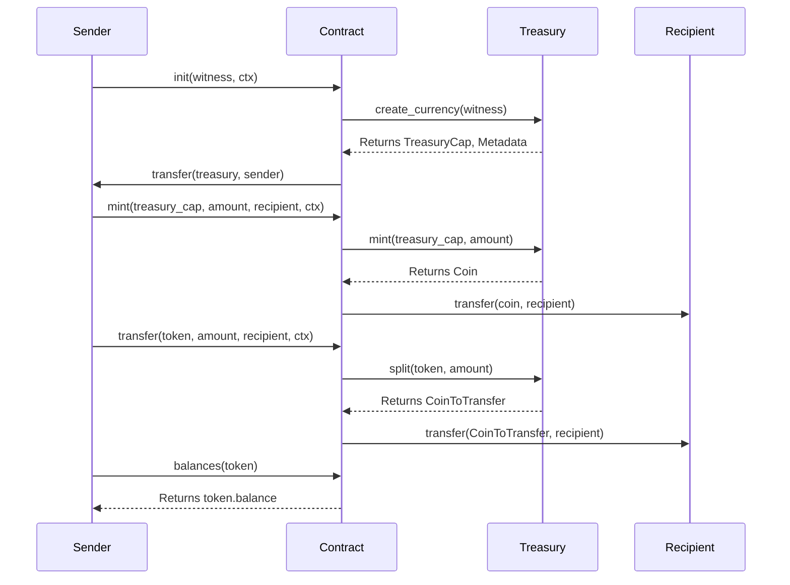

# Simple Token Transfer

In this tutorial, we will walk you through the process of building a simple token transfer dApp using the IOTA Move language and the IOTA dApp kit. You will learn how to create a contract that enables token transfers on the IOTA blockchain and how to integrate it with a frontend application that interacts with the contract's functions. The tutorial covers everything from contract creation to frontend development, giving you a hands-on understanding of how token transfers work within the IOTA ecosystem. By the end, you'll have a fully functional dApp that allows users to transfer tokens effortlessly.

## Simple Token Transfer Architecture Overview 


### Prerequisites

- [Node.js](https://nodejs.org/) >=v20.18.0
- [npx](https://www.npmjs.com/package/npx) >=10.8.2
- [iota](https://github.com/iotaledger/iota/releases) >=0.7.3 

## Create a Move Package

Run the following command to create a Move package

```bash
iota move new token-transfer
```

### Configure the IOTA CLI

Before publishing the package, you need to configure your IOTA CLI with your wallet details.

#### Navigate to the IOTA configuration directory

```bash
cd ~/.iota/iota_config/
```

### Update the following files 

`iota.keystore`: Replace the existing private key with your IOTA wallet private key.

`client.yaml`: Replace the `active_address` field with your IOTA wallet address.

This will generate a new Move package in a folder named token-transfer.

### Package Overview

#### [`init`](https://github.com/iota-community/token-transfer-tutorial/blob/ea71112c1156d1885567353fee0a03e09308e293/sources/token_transfer.move#L9-L13)

- Executes at the time of publication of the package.
- Takes `MY_TOKEN` as a witness and the transaction context (ctx).
- Uses the `coin::create_currency` function to create the token by specifying the name, symbol, and decimal precision of the token.
- The `coin::create_currency` function returns a TreasuryCap, which allows the owner to mint and transfer the token, and the metadata of the token.
- Transfers the metadata to the owner of the contract using `transfer::public_freeze_object(metadata)` and `transfer::public_transfer(treasury, ctx.sender())`.

```move reference
https://github.com/iota-community/token-transfer-tutorial/blob/ea71112c1156d1885567353fee0a03e09308e293/sources/token_transfer.move#L9-L13
```
#### [`mint`](https://github.com/iota-community/token-transfer-tutorial/blob/ea71112c1156d1885567353fee0a03e09308e293/sources/token_transfer.move#L15-L23)

- Mints the token and transfers it to the recipient address.
- Can only be called by the owner of the contract.
- Creates a new object of the `MY_TOKEN` token using the TreasuryCap.
- The TreasuryCap address (which was generated during the contract's publication) is required to mint the tokens.
- Transfers the minted tokens to the recipient after they are created.

```move reference
https://github.com/iota-community/token-transfer-tutorial/blob/ea71112c1156d1885567353fee0a03e09308e293/sources/token_transfer.move#L15-L23
```

#### [`transfer`](https://github.com/iota-community/token-transfer-tutorial/blob/ea71112c1156d1885567353fee0a03e09308e293/sources/token_transfer.move#L25-L33)

- Transfers the token from the caller address to the recipient address.
- Requires the correct token object address that is owned by the caller.
- The function first uses the `coin::split` function to split the specified amount from the token and then uses `transfer::public_transfer` to transfer the split tokens to the recipient.

```move reference
https://github.com/iota-community/token-transfer-tutorial/blob/ea71112c1156d1885567353fee0a03e09308e293/sources/token_transfer.move#L25-L33
```

#### [`balance`](https://github.com/iota-community/token-transfer-tutorial/blob/ea71112c1156d1885567353fee0a03e09308e293/sources/token_transfer.move#L34-L37)

- Returns the balance of the token for the specified owner.
- Requires passing the token address to retrieve the balance.WW
- Uses `coin::balance` to query the balance and returns the value held by the coin object.

```move reference
https://github.com/iota-community/token-transfer-tutorial/blob/ea71112c1156d1885567353fee0a03e09308e293/sources/token_transfer.move#L34-L37
```

Navigate to the [`source/token-transfer.move`](https://github.com/iota-community/token-transfer-tutorial/blob/ea71112c1156d1885567353fee0a03e09308e293/sources/token_transfer.move#L1-L38) file and paste the following code:

```move reference
https://github.com/iota-community/token-transfer-tutorial/blob/ea71112c1156d1885567353fee0a03e09308e293/sources/token_transfer.move#L1-L38
``` 

### Build the Package

Once the contract is ready, build the package by running:

```bash
iota move build
```

### Publish the Package

Publish the package to the IOTA testnet using the following command:

```bash 
iota client publish
```

After publishing, you will receive a detailed transaction output. Here’s an example:

```bash
Transaction Digest: EV17EsY3LXgzwFVSZAK6Xr3ohTnWjrYajo3G7yg88Qa4
╭──────────────────────────────────────────────────────────────────────────────────────────────────────────────╮
│ Transaction Data                                                                                             │
├──────────────────────────────────────────────────────────────────────────────────────────────────────────────┤
│ Sender: 0xedeca9d6897cf86917e45f5c5cd596da48a5c4e3e1d9425aee42bed37c9ee44d                                   │
│ Gas Owner: 0xedeca9d6897cf86917e45f5c5cd596da48a5c4e3e1d9425aee42bed37c9ee44d                                │
│ Gas Budget: 16424800 NANOS                                                                                   │
│ Gas Price: 1000 NANOS                                                                                        │
│ Gas Payment:                                                                                                 │
│  ┌──                                                                                                         │
│  │ ID: 0x410eb60409b8e7ff4b0db6c0ec0e2ba4869359352e8cbb6e6298f38b4f9e8cb6                                    │
│  │ Version: 470532                                                                                           │
│  │ Digest: HEgegyRiXyWZotuRK46uaQJgrVketTtWVX8kfBCPXFAs                                                      │
│  └──                                                                                                         │
│                                                                                                              │
│ Transaction Kind: Programmable                                                                               │
│ ╭──────────────────────────────────────────────────────────────────────────────────────────────────────────╮ │
│ │ Input Objects                                                                                            │ │
│ ├──────────────────────────────────────────────────────────────────────────────────────────────────────────┤ │
│ │ 0   Pure Arg: Type: address, Value: "0xedeca9d6897cf86917e45f5c5cd596da48a5c4e3e1d9425aee42bed37c9ee44d" │ │
│ ╰──────────────────────────────────────────────────────────────────────────────────────────────────────────╯ │
│ ╭─────────────────────────────────────────────────────────────────────────╮                                  │
│ │ Commands                                                                │                                  │
│ ├─────────────────────────────────────────────────────────────────────────┤                                  │
│ │ 0  Publish:                                                             │                                  │
│ │  ┌                                                                      │                                  │
│ │  │ Dependencies:                                                        │                                  │
│ │  │   0x0000000000000000000000000000000000000000000000000000000000000002 │                                  │
│ │  │   0x0000000000000000000000000000000000000000000000000000000000000001 │                                  │
│ │  └                                                                      │                                  │
│ │                                                                         │                                  │
│ │ 1  TransferObjects:                                                     │                                  │
│ │  ┌                                                                      │                                  │
│ │  │ Arguments:                                                           │                                  │
│ │  │   Result 0                                                           │                                  │
│ │  │ Address: Input  0                                                    │                                  │
│ │  └                                                                      │                                  │
│ ╰─────────────────────────────────────────────────────────────────────────╯                                  │
│                                                                                                              │
│ Signatures:                                                                                                  │
│    GGL+ZaqdoxGOmpySTP/GFnVrK50VwuhKptc/5K2aOCcaTAIUKhknn2L9cCN2gG8p9mEVpUDDeb/bt7nzXl4yBw==                  │
│                                                                                                              │
╰──────────────────────────────────────────────────────────────────────────────────────────────────────────────╯
╭───────────────────────────────────────────────────────────────────────────────────────────────────╮
│ Transaction Effects                                                                               │
├───────────────────────────────────────────────────────────────────────────────────────────────────┤
│ Digest: EV17EsY3LXgzwFVSZAK6Xr3ohTnWjrYajo3G7yg88Qa4                                              │
│ Status: Success                                                                                   │
│ Executed Epoch: 18                                                                                │
│                                                                                                   │
│ Created Objects:                                                                                  │
│  ┌──                                                                                              │
│  │ ID: 0x425d4962e3e0dc0c08f87900a7577b240c3778adf54183e10b9832b7e9a51278                         │
│  │ Owner: Immutable                                                                               │
│  │ Version: 470533                                                                                │
│  │ Digest: GYr4WDEwJq95S9NYcVu5koKEH85uc9HUiq3vFkjvaJ7Y                                           │
│  └──                                                                                              │
│  ┌──                                                                                              │
│  │ ID: 0x537d7c04ddd8f7611de17910909c99c610227f9949126e684ba4a7b6eb55e3e1                         │
│  │ Owner: Immutable                                                                               │
│  │ Version: 1                                                                                     │
│  │ Digest: AqFmepZJmqEMi2qPYscZf1X4vZtXs3oUgSg2vn2X7CDz                                           │
│  └──                                                                                              │
│  ┌──                                                                                              │
│  │ ID: 0x9e54291864e24091153c6f6250cb2788d2e928c438ee15c2be4db7614f85ae3e                         │
│  │ Owner: Account Address ( 0xedeca9d6897cf86917e45f5c5cd596da48a5c4e3e1d9425aee42bed37c9ee44d )  │
│  │ Version: 470533                                                                                │
│  │ Digest: EVNTfuzZhBVCageRiKraDHf9vb8uDLxw8yYwEY8zVmqY                                           │
│  └──                                                                                              │
│  ┌──                                                                                              │
│  │ ID: 0xf64b55e996f1ba79ba6517c4d98c604bbf21876841af6088a72150bee8908f09                         │
│  │ Owner: Account Address ( 0xedeca9d6897cf86917e45f5c5cd596da48a5c4e3e1d9425aee42bed37c9ee44d )  │
│  │ Version: 470533                                                                                │
│  │ Digest: 4gYHJNnTERVcFYrpqLBpr3YoYZhaVPV2L73YwmZYbyJ3                                           │
│  └──                                                                                              │
│ Mutated Objects:                                                                                  │
│  ┌──                                                                                              │
│  │ ID: 0x410eb60409b8e7ff4b0db6c0ec0e2ba4869359352e8cbb6e6298f38b4f9e8cb6                         │
│  │ Owner: Account Address ( 0xedeca9d6897cf86917e45f5c5cd596da48a5c4e3e1d9425aee42bed37c9ee44d )  │
│  │ Version: 470533                                                                                │
│  │ Digest: 3KUZySKTbg5SV41WCCi2bFodjQVp9CTWBQCsSiYX7GMf                                           │
│  └──                                                                                              │
│ Gas Object:                                                                                       │
│  ┌──                                                                                              │
│  │ ID: 0x410eb60409b8e7ff4b0db6c0ec0e2ba4869359352e8cbb6e6298f38b4f9e8cb6                         │
│  │ Owner: Account Address ( 0xedeca9d6897cf86917e45f5c5cd596da48a5c4e3e1d9425aee42bed37c9ee44d )  │
│  │ Version: 470533                                                                                │
│  │ Digest: 3KUZySKTbg5SV41WCCi2bFodjQVp9CTWBQCsSiYX7GMf                                           │
│  └──                                                                                              │
│ Gas Cost Summary:                                                                                 │
│    Storage Cost: 14424800 NANOS                                                                   │
│    Computation Cost: 1000000 NANOS                                                                │
│    Storage Rebate: 980400 NANOS                                                                   │
│    Non-refundable Storage Fee: 0 NANOS                                                            │
│                                                                                                   │
│ Transaction Dependencies:                                                                         │
│    63X49x2QuuYNduExZWoJjfXut3s3WDWZ7Tr7nXJu32ZT                                                   │
│    6EUKtb4nRKGwzLBBQ8zY38rHsEU6aZJJSYDuGrDDKaht                                                   │
╰───────────────────────────────────────────────────────────────────────────────────────────────────╯
╭─────────────────────────────╮
│ No transaction block events │
╰─────────────────────────────╯

╭─────────────────────────────────────────────────────────────────────────────────────────────────────────────────────────────────╮
│ Object Changes                                                                                                                  │
├─────────────────────────────────────────────────────────────────────────────────────────────────────────────────────────────────┤
│ Created Objects:                                                                                                                │
│  ┌──                                                                                                                            │
│  │ ObjectID: 0x425d4962e3e0dc0c08f87900a7577b240c3778adf54183e10b9832b7e9a51278                                                 │
│  │ Sender: 0xedeca9d6897cf86917e45f5c5cd596da48a5c4e3e1d9425aee42bed37c9ee44d                                                   │
│  │ Owner: Immutable                                                                                                             │
│  │ ObjectType: 0x2::coin::CoinMetadata<0x537d7c04ddd8f7611de17910909c99c610227f9949126e684ba4a7b6eb55e3e1::my_token::MY_TOKEN>  │
│  │ Version: 470533                                                                                                              │
│  │ Digest: GYr4WDEwJq95S9NYcVu5koKEH85uc9HUiq3vFkjvaJ7Y                                                                         │
│  └──                                                                                                                            │
│  ┌──                                                                                                                            │
│  │ ObjectID: 0x9e54291864e24091153c6f6250cb2788d2e928c438ee15c2be4db7614f85ae3e                                                 │
│  │ Sender: 0xedeca9d6897cf86917e45f5c5cd596da48a5c4e3e1d9425aee42bed37c9ee44d                                                   │
│  │ Owner: Account Address ( 0xedeca9d6897cf86917e45f5c5cd596da48a5c4e3e1d9425aee42bed37c9ee44d )                                │
│  │ ObjectType: 0x2::coin::TreasuryCap<0x537d7c04ddd8f7611de17910909c99c610227f9949126e684ba4a7b6eb55e3e1::my_token::MY_TOKEN>   │
│  │ Version: 470533                                                                                                              │
│  │ Digest: EVNTfuzZhBVCageRiKraDHf9vb8uDLxw8yYwEY8zVmqY                                                                         │
│  └──                                                                                                                            │
│  ┌──                                                                                                                            │
│  │ ObjectID: 0xf64b55e996f1ba79ba6517c4d98c604bbf21876841af6088a72150bee8908f09                                                 │
│  │ Sender: 0xedeca9d6897cf86917e45f5c5cd596da48a5c4e3e1d9425aee42bed37c9ee44d                                                   │
│  │ Owner: Account Address ( 0xedeca9d6897cf86917e45f5c5cd596da48a5c4e3e1d9425aee42bed37c9ee44d )                                │
│  │ ObjectType: 0x2::package::UpgradeCap                                                                                         │
│  │ Version: 470533                                                                                                              │
│  │ Digest: 4gYHJNnTERVcFYrpqLBpr3YoYZhaVPV2L73YwmZYbyJ3                                                                         │
│  └──                                                                                                                            │
│ Mutated Objects:                                                                                                                │
│  ┌──                                                                                                                            │
│  │ ObjectID: 0x410eb60409b8e7ff4b0db6c0ec0e2ba4869359352e8cbb6e6298f38b4f9e8cb6                                                 │
│  │ Sender: 0xedeca9d6897cf86917e45f5c5cd596da48a5c4e3e1d9425aee42bed37c9ee44d                                                   │
│  │ Owner: Account Address ( 0xedeca9d6897cf86917e45f5c5cd596da48a5c4e3e1d9425aee42bed37c9ee44d )                                │
│  │ ObjectType: 0x2::coin::Coin<0x2::iota::IOTA>                                                                                 │
│  │ Version: 470533                                                                                                              │
│  │ Digest: 3KUZySKTbg5SV41WCCi2bFodjQVp9CTWBQCsSiYX7GMf                                                                         │
│  └──                                                                                                                            │
│ Published Objects:                                                                                                              │
│  ┌──                                                                                                                            │
│  │ PackageID: 0x537d7c04ddd8f7611de17910909c99c610227f9949126e684ba4a7b6eb55e3e1                                                │
│  │ Version: 1                                                                                                                   │
│  │ Digest: AqFmepZJmqEMi2qPYscZf1X4vZtXs3oUgSg2vn2X7CDz                                                                         │
│  │ Modules: my_token                                                                                                            │
│  └──                                                                                                                            │
╰─────────────────────────────────────────────────────────────────────────────────────────────────────────────────────────────────╯
╭───────────────────────────────────────────────────────────────────────────────────────────────────╮
│ Balance Changes                                                                                   │
├───────────────────────────────────────────────────────────────────────────────────────────────────┤
│  ┌──                                                                                              │
│  │ Owner: Account Address ( 0xedeca9d6897cf86917e45f5c5cd596da48a5c4e3e1d9425aee42bed37c9ee44d )  │
│  │ CoinType: 0x2::iota::IOTA                                                                      │
│  │ Amount: -14444400                                                                              │
│  └──                                                                                              │
╰───────────────────────────────────────────────────────────────────────────────────────────────────╯
```

## Simple Token Transfer UI

Let’s now set up the frontend application using the [IOTA dApp kit](../../references/ts-sdk/dapp-kit/index.mdx). This kit provides a collection of tools and components that simplify integrating IOTA-based smart contracts into your web applications. By leveraging the dApp kit, you can efficiently build user interfaces that enable users to interact with the blockchain, such as sending transactions, querying contracts, and displaying data.

The dApp kit is designed to streamline the connection between your frontend and the IOTA blockchain, handling important tasks like wallet integration, transaction signing, and communication with your deployed contract. If you’re new to the dApp kit, you can consult its documentation for comprehensive instructions on how to set it up and use its features to create a smooth frontend experience.

In this section, we’ll walk you through the process of configuring the frontend and linking it to the smart contract we created earlier. By the end, you’ll have a fully functional dApp that enables users to interact with your IOTA-based token transfer contract directly from the frontend.

### Setup 

Run the following the command to setup the initial IOTA dApp.

```bash
pnpm add @iota/dapp-kit @iota/iota-sdk @tanstack/react-query
```

### Code Structure

- Components: Contains the components listed below for the UI :
   - [`Balance.tsx`](https://github.com/iota-community/token-transfer-tutorial/blob/3e2023a7c29aa5cf43305c6c42bd463a7a789750/frontend/src/components/Balance.tsx#L1-L27)
   - [`Buttons.tsx`](https://github.com/iota-community/token-transfer-tutorial/blob/3e2023a7c29aa5cf43305c6c42bd463a7a789750/frontend/src/components/Buttons.tsx#L1-L27)
   - [`Mint.tsx`](https://github.com/iota-community/token-transfer-tutorial/blob/3e2023a7c29aa5cf43305c6c42bd463a7a789750/frontend/src/components/Mint.tsx#L1-L144)
   - [`Transfer.tsx`](https://github.com/iota-community/token-transfer-tutorial/blob/3e2023a7c29aa5cf43305c6c42bd463a7a789750/frontend/src/components/Transfer.tsx#L1)
- Utils:
   - [`balance.ts`](https://github.com/iota-community/token-transfer-tutorial/blob/3e2023a7c29aa5cf43305c6c42bd463a7a789750/frontend/src/utils/balance.ts#L1-L26)
   - [`mint.ts`](https://github.com/iota-community/token-transfer-tutorial/blob/3e2023a7c29aa5cf43305c6c42bd463a7a789750/frontend/src/utils/mint.ts#L1-L36)
   - [`transfer.ts`](https://github.com/iota-community/token-transfer-tutorial/blob/3e2023a7c29aa5cf43305c6c42bd463a7a789750/frontend/src/utils/transfer.ts#L1-L37)


### Setting Up Network Configuration

Add the following variables in the `networkConfig.ts` file:
- `packageId`: The package ID for the smart contract.
- `coinAddress`: The address of the token contract.
- `treasuryCap`: The treasury cap address used for minting tokens.

To retrieve this information, visit the testnet explorer, search for your IOTA wallet address, and review the recent transactions.

```typescript reference
https://github.com/iota-community/token-transfer-tutorial/blob/ea71112c1156d1885567353fee0a03e09308e293/frontend/src/networkConfig.ts#L1-L22
```


#### [`App.tsx`](https://github.com/iota-community/token-transfer-tutorial/blob/3e2023a7c29aa5cf43305c6c42bd463a7a789750/frontend/src/App.tsx#L1-L58)

The `App.tsx` file integrates the components and provides the main structure of the frontend application.

```typescript reference
https://github.com/iota-community/token-transfer-tutorial/blob/3e2023a7c29aa5cf43305c6c42bd463a7a789750/frontend/src/App.tsx#L1-L58
```

#### [`Buttons.tsx`](https://github.com/iota-community/token-transfer-tutorial/blob/3e2023a7c29aa5cf43305c6c42bd463a7a789750/frontend/src/components/Buttons.tsx#L1-L27)

The `components` folder contains four primary components, each handling a specific functionality. Here's a detailed description of each component:

```typescript reference
https://github.com/iota-community/token-transfer-tutorial/blob/3e2023a7c29aa5cf43305c6c42bd463a7a789750/frontend/src/components/Buttons.tsx#L1-L27
```

#### [`Balance.tsx`](https://github.com/iota-community/token-transfer-tutorial/blob/3e2023a7c29aa5cf43305c6c42bd463a7a789750/frontend/src/components/Balance.tsx#L1-L27)

This component is designed to fetch and display the balance of the connected wallet for the specified token. It utilizes the blockchain's API to retrieve the token's balance and type, presenting this information to the user in a simple and visually appealing manner. This feature helps users monitor their token holdings without navigating away from the app. It also ensures that data is updated in real time, enhancing the user experience.

```typescript reference
https://github.com/iota-community/token-transfer-tutorial/blob/3e2023a7c29aa5cf43305c6c42bd463a7a789750/frontend/src/components/Balance.tsx#L1-L27
```

#### [`Transfer.tsx`](https://github.com/iota-community/token-transfer-tutorial/blob/3e2023a7c29aa5cf43305c6c42bd463a7a789750/frontend/src/components/Transfer.tsx#L1)

The `Transfer.tsx` component handles the process of transferring tokens from the connected wallet to a recipient address. Users can input the recipient's address and the number of tokens they wish to transfer. This component also manages transaction signing and execution using the dApp kit, ensuring that the transfer operation is seamless and secure. Error handling is built in to notify users of any issues during the transaction process.
 
```typescript reference
https://github.com/iota-community/token-transfer-tutorial/blob/3e2023a7c29aa5cf43305c6c42bd463a7a789750/frontend/src/components/Transfer.tsx#L1
```

#### [`Mint.tsx`](https://github.com/iota-community/token-transfer-tutorial/blob/3e2023a7c29aa5cf43305c6c42bd463a7a789750/frontend/src/components/Mint.tsx#L1-L144)

This component allows users to mint new tokens to a specified address. Users can provide the recipient's address and the amount of tokens to mint. The `Mint.tsx` component interacts with the blockchain's treasury cap and package ID to execute the minting operation. This functionality is critical for applications that require dynamic token issuance, such as token reward systems or initial token distribution.

```typescript reference
https://github.com/iota-community/token-transfer-tutorial/blob/3e2023a7c29aa5cf43305c6c42bd463a7a789750/frontend/src/components/Mint.tsx#L1-L144
```

## Usage example

### Dashboard

- The dashboard of the token transfer app, displaying different operations like Transfer and Mint.


### Connect IOTA wallet

- Click on the Connect wallet button at the top right corner to connect your IOTA wallet.


### Wallet connected

- When the wallet gets connected to the app the address of the selected account will be displayed at top right  corner.


### Minting token

- Click the Mint button to mint the token. Please note that the account used for minting must be the same as the one used during the publication.


### Wallet transaction

- The minted amount will be displayed in the balance changes section of the wallet popup, approve the transaction.


### Transaction successfull

- Once you approve the mint transaction, an alert will appear indicating 'Transaction Successful'.


### Wallet check

- After successfull transaction of mint you can check the balance have increase in the wallet.


/Users/shinchan/Desktop/iota/docs/site/static/img/developer/getting-started/developer/getting-started/token-transfer/check-balance.png
### Check balance

- Click on the Check balance button to check the token balance.


## Conclusion

With this setup, you’ve created a straightforward yet robust frontend application using the IOTA dApp kit. The components provided by the dApp kit enable you to effortlessly perform token-related tasks, such as transferring tokens and querying contract data, with smooth integration to the IOTA blockchain. This setup lays a strong foundation for expanding and customizing your dApp to meet your specific requirements. By completing these steps, you’ve successfully linked your frontend to the smart contract, resulting in a fully functional dApp that interacts seamlessly with the blockchain.