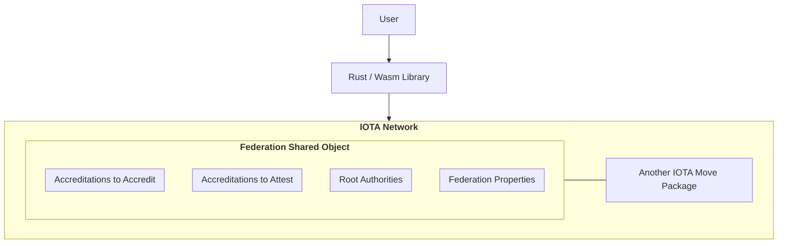

```mermaid
graph TD
    subgraph network["<b>IOTA Network</b>"]
        subgraph federation["<b>Federation Shared Object</b><br/>"]
          subgraph "Federation Properties"
          end
          subgraph "Root Authorities"
          end
          subgraph "Accreditations to Attest"
          end
          subgraph "Accreditations to Accredit"
          end
        end
        federation---federation_2["Another IOTA Move Package"]
    end
    User-->lib
    lib["Rust / Wasm Library"]-->network
```
