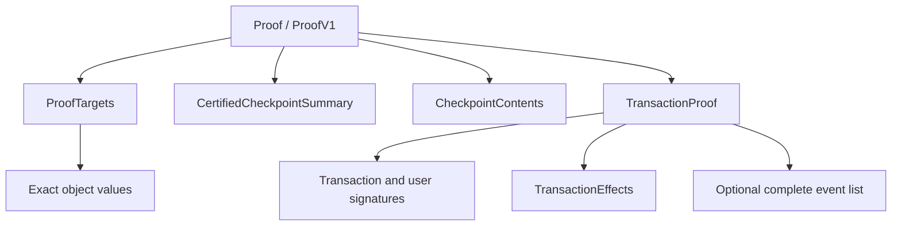

# Proof Model

A Proof of Inclusion is a versioned, portable envelope that carries enough evidence for local verification. The current format is `ProofV1`.

## Evidence Structure

The envelope contains three main layers:

- `ProofTargets` records the transaction, objects, and events explicitly selected by the prover.
- The certified checkpoint summary and checkpoint contents connect the transaction to an IOTA committee-certified checkpoint.
- `TransactionProof` carries the transaction, its effects, and the complete event list when the proof has event targets.

Transaction evidence is required even when the transaction is not an explicit target. Object and event targets rely on the transaction and its effects to establish how the selected value entered the ledger.

## One Transaction per Proof

Every target in one proof must belong to the same transaction. The builder rejects object or event targets from a different transaction.

This constraint keeps the format atomic and avoids repeating or ambiguously grouping transaction evidence. To prove values from multiple transactions, create multiple proofs and reuse the same verifier so it can reuse authenticated committee data.

## Target Semantics

`ProofTargets.transaction` is present only when the caller explicitly requests the transaction. An object-only or event-only proof still carries supporting transaction evidence, but it does not silently add a transaction target.

An object target carries the exact object value and version selected during construction. When the request contains only an object ID, the source resolves the latest available version at that time and the builder discovers the transaction that produced it.

An event target identifies the event by transaction digest and sequence number. The transaction proof carries the complete event list so verification can recompute the digest committed by the effects before selecting the target event.

## Verification Output

`Proof` is the untrusted transport and serialization type. Successful verification returns `VerifiedProof`, a read-only view that borrows authenticated values from the proof.

Use `VerifiedProof` to access checkpoint metadata, the transaction digest, object targets, and event targets. The Rust and Wasm APIs intentionally make this distinction visible so applications do not accidentally treat unverified payload fields as trusted.

## JSON Compatibility

Proof JSON is a versioned persistence and exchange format. Releases that support `ProofV1` must continue to deserialize its existing JSON shape and serialize the same field structure.

Frozen version 1 fixtures enforce transaction, object, and event compatibility. An incompatible representation requires a new `Proof` variant instead of silently changing `ProofV1`.

Treat JSON parsing and proof verification as separate steps. Successful deserialization confirms only that the payload has a supported shape; it does not authenticate the payload.
