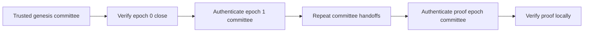

# Trust and Verification

Proof verification is meaningful only relative to a **committee** the verifier trusts. The ledger source can supply all proof and committee-transition data, but it must not silently decide the verifier's trust anchor.

---

## Committee Resolution Modes

### Genesis or Committee Anchored

Anchored resolution starts from a committee the verifier already trusts. The common workflow loads that committee from an independently obtained IOTA `genesis.blob`.

For each epoch between the anchor and the proof, the resolver fetches the previous epoch's closing checkpoint, verifies its certified summary with the current committee, and accepts the next committee only after that check succeeds. The final `ProofVerifier` then verifies the proof locally with the authenticated committee for its checkpoint epoch.

Anchored resolution avoids trusting the source for committee identity. It also requires the verifier to obtain and protect an authentic starting point.

### Trusted Node

Trusted-node resolution accepts committee data returned directly by the connected node. It does not authenticate the committee lineage from genesis.

Use this mode only when the node is already inside the application's trust boundary, such as a node operated and secured by the verifier's organization. Do not describe this mode as trustless verification.

See [Verify a Proof Using a Trusted Node](../how-tos/advanced/trusted-node.mdx) for a complete Rust and TypeScript example.

---

## Verification Checks

The verifier performs the following checks:

1. The proof selects at least one transaction, object, or event target.
2. The trusted committee certifies the checkpoint summary and the checkpoint-contents digest.
3. The packaged transaction digest matches the transaction effects.
4. The transaction and effects appear together in the authenticated checkpoint contents.
5. The packaged user signatures match the signatures committed by the checkpoint.
6. The packaged event list matches the digest in the transaction effects.
7. An explicit transaction target matches the packaged transaction.
8. Every object target's exact reference appears in the transaction effects.
9. Every event target belongs to the packaged transaction and selects an existing event.

The signature check binds the exact packaged signature bytes to the certified checkpoint. It does not rerun every historical user-signature authentication rule independently; the network already performed those checks before execution.

Successful proof verification authenticates the inclusion of the transaction and its effects in the certified checkpoint. It does not require transaction execution to have succeeded: a failed transaction can also have a valid inclusion proof. Applications that require successful execution must check the authenticated execution status separately.

---

## Trust Anchors and Network Identity

Obtain a custom-network genesis blob or initial committee independently from the party that supplies the proof. Confirm that the anchor belongs to the same network as the proof evidence.

The proof's `chain` field is an informational label supplied by the source. Verification does not authenticate it. Never use that field to select a network endpoint, genesis blob, committee, or committee cache namespace.

The CLI validates managed mainnet and testnet genesis blobs against pinned network genesis digests. Devnet has no stable genesis digest, so CLI verification requires an explicit trusted blob.

### Genesis Sources

Choose the network and its trusted genesis source before accepting a proof. The public-network URLs below are the sources configured in the PoI CLI:

| Network | Genesis source | Trust requirement |
| --- | --- | --- |
| Mainnet | [Mainnet genesis blob](https://dbfiles.mainnet.iota.cafe/genesis.blob) | The CLI validates the blob against its pinned mainnet genesis digest. |
| Testnet | [Testnet genesis blob](https://dbfiles.testnet.iota.cafe/genesis.blob) | The CLI validates the blob against its pinned testnet genesis digest. |
| Devnet | [Devnet genesis blob](https://dbfiles.devnet.iota.cafe/genesis.blob) | Confirm the blob belongs to the intended devnet deployment. Devnet resets, so the CLI requires an explicit trusted blob. |
| Local network | The `genesis.blob` generated by your own local network | Use the blob from the configuration of the running network. Follow the [PoI example setup](https://github.com/iotaledger/notarization/tree/v0.1/bindings/wasm/poi_wasm/examples/README.md#step-2-configure-the-example) for the local genesis path. |
| Custom network | The network operator's genesis blob | Obtain it through an operator channel you already trust, independently of the proof supplier. |

“Independently” means the proof supplier does not choose the trust anchor for you. For example, use the public-network source configured by your application, the genesis file generated by your own node, or a blob whose genesis checkpoint digest you confirm with a trusted network operator through a separate channel. A genesis blob bundled with a proof is not sufficient by itself.

Rust's `CommitteeResolution::from_genesis()` and Wasm's `CommitteeResolution.fromGenesis()` load the blob you supply; these constructors do not download it or enforce the CLI's public-network digest pins. Applications using them directly must establish that the supplied blob is authentic and belongs to the intended network. A filename such as `trusted-testnet-genesis.blob` does not establish trust.

---

## Committee Caching

Anchored verification can require many epoch transitions on an established network. Retain the verifier when checking multiple proofs so it can reuse committees authenticated during earlier checks.

The Rust API also accepts a caller-provided `CommitteeCache` for persistence. Shared cache entries are scoped by the trusted genesis checkpoint digest and epoch, which prevents committees from different networks from colliding.

The Wasm Package creates a fresh in-memory cache inside each anchored `CommitteeResolution`. Verifiers created from the same resolution share that cache. It does not accept a caller-provided cache, so retain the verifier for as long as the application needs to reuse authenticated committees.

### How the Cache Is Used

For each proof, the resolver determines the committee epoch required by its certified checkpoint. It then:

1. Looks for that committee, or the nearest successor to its trusted anchor, in the cache.
2. Fetches any missing end-of-epoch checkpoint evidence from the ledger source.
3. Authenticates each missing committee transition from the last trusted committee.
4. Stores each newly authenticated committee and uses the target committee to verify the proof.

The cache key contains both the network's chain identifier and the epoch. The chain identifier is the genesis checkpoint digest, so one backend can hold committees for several networks without mixing committees from the same epoch.

:::warning

The resolver treats a committee returned by the cache as previously authenticated. Protect persistent cache data from modification, preserve the complete cache key, and reject conflicting values instead of overwriting them.

:::

### Choose a Cache Strategy

Choose the smallest cache lifetime that fits your application:

| Strategy | Use it when | Lifetime | Configuration |
| --- | --- | --- | --- |
| Resolution-owned memory | One verifier checks one or more proofs in the same process. | Until the resolution and its verifiers are dropped | Use `from_genesis()` or `anchored()`. |
| Shared memory | Several verifiers in one process should share authenticated committees. | Until the process exits | Pass a cloned `MemoryCommitteeCache` to `from_genesis_with_cache()` or `anchored_with_cache()`. |
| Persistent custom cache | Later processes or application instances should reuse authenticated committees. | Defined by the backend | Implement `CommitteeCache` with a file, database, or key-value store. |

The standard [Reuse a Verifier](../how-tos/reuse-verifier.mdx) example is normally enough for a long-running process. A custom cache adds storage, concurrency, and access-control responsibilities, so use one only when committees must outlive a verifier or be shared across verifier instances.

The Wasm Package keeps verifier state in memory and does not expose a custom committee-cache interface. Reuse the same Wasm verifier instance when verifying several proofs.

See [Build a Committee Cache](../how-tos/advanced/committee-cache.mdx) to build and configure a persistent Rust cache.
