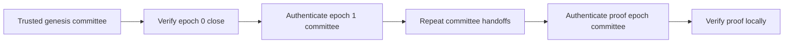

# Trust and Verification

Proof verification is meaningful only relative to a committee the verifier trusts. The ledger source can supply all proof and committee-transition data, but it must not silently decide the verifier's trust anchor.

## Committee Resolution Modes

### Genesis or Committee Anchored

Anchored resolution starts from a committee the verifier already trusts. The common workflow loads that committee from an independently obtained IOTA `genesis.blob`.

For each epoch between the anchor and the proof, the resolver fetches the previous epoch's closing checkpoint, verifies its certified summary with the current committee, and accepts the next committee only after that check succeeds. The final `ProofVerifier` then verifies the proof locally with the authenticated committee for its checkpoint epoch.

Anchored resolution avoids trusting the source for committee identity. It also requires the verifier to obtain and protect an authentic starting point.

### Trusted Node

Trusted-node resolution accepts committee data returned directly by the connected node. It does not authenticate the committee lineage from genesis.

Use this mode only when the node is already inside the application's trust boundary, such as a node operated and secured by the verifier's organization. Do not describe this mode as trustless verification.

## Verification Checks

The verifier performs the following checks:

1. The proof selects at least one transaction, object, or event target.
2. The trusted committee certifies the checkpoint summary and the checkpoint-contents digest.
3. The packaged transaction digest matches the transaction effects.
4. The transaction and effects appear together in the authenticated checkpoint contents.
5. The packaged user signatures match the signatures committed by the checkpoint.
6. The packaged event list matches the digest in the transaction effects.
7. An explicit transaction target matches the packaged transaction.
8. Every object target's exact reference appears in the transaction effects.
9. Every event target belongs to the packaged transaction and selects an existing event.

The signature check binds the exact packaged signature bytes to the certified checkpoint. It does not rerun every historical user-signature authentication rule independently; the network already performed those checks before execution.

## Trust Anchors and Network Identity

Obtain a custom-network genesis blob or initial committee independently from the party that supplies the proof. Confirm that the anchor belongs to the same network as the proof evidence.

The proof's `chain` field is an informational label supplied by the source. Verification does not authenticate it. Never use that field to select a network endpoint, genesis blob, committee, or committee cache namespace.

The CLI validates managed mainnet and testnet genesis blobs against pinned network genesis digests. Devnet has no stable genesis digest, so CLI verification requires an explicit trusted blob.

## Committee Caching

Anchored verification can require many epoch transitions on an established network. Retain the verifier when checking multiple proofs so it can reuse committees authenticated during earlier checks.

The Rust API also accepts a caller-provided `CommitteeCache` for persistence. Shared cache entries are scoped by the trusted genesis checkpoint digest and epoch, which prevents committees from different networks from colliding.

The Wasm Package keeps a fresh in-memory cache inside each anchored verifier. It does not accept a caller-provided cache, so retain the verifier for as long as the application needs to reuse authenticated committees.
