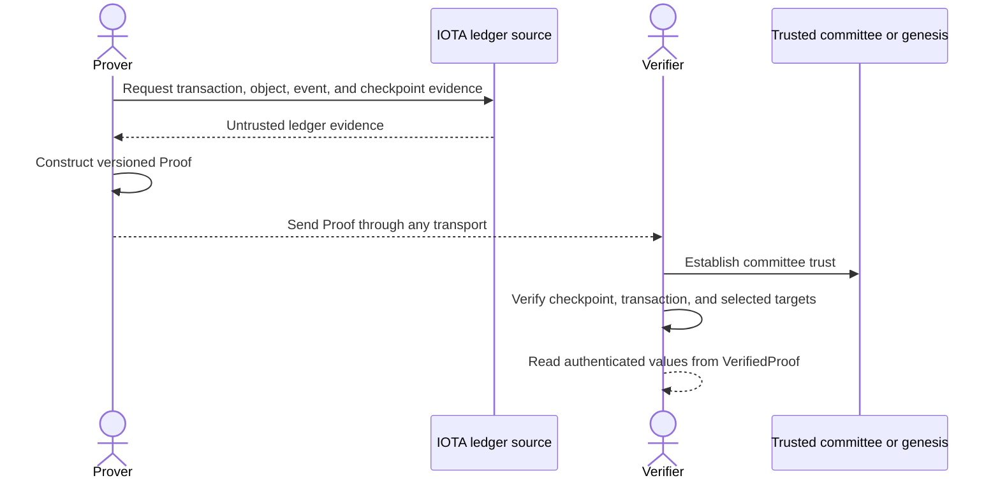

# IOTA Proof of Inclusion

IOTA Proof of Inclusion constructs portable cryptographic evidence that ledger activity is included in a certified IOTA checkpoint. A verifier can check the evidence locally against a committee trust anchor without trusting the node, API, file store, or application that transports the proof.

Proof of Inclusion works with existing ledger activity. It does not create a separate on-chain object or Move Package. You can prove activity created by [Single Notarization](../single-notarization/index.mdx), [Audit Trails](../audit-trails/index.mdx), or any other IOTA application.

## When to Use Proof of Inclusion

Use Proof of Inclusion when an application must send independently verifiable evidence outside the ledger access path that produced it. Common examples include compliance exports, cross-organization data exchange, offline verification, and long-lived evidence archives.

| Requirement | Proof target |
|-------------|--------------|
| Prove that a transaction and its effects are in a certified checkpoint | Transaction |
| Prove the exact version and value of an object written by a transaction | Object |
| Prove that a specific event and its contents were emitted by a transaction | Event |
| Prove several related values without duplicating checkpoint evidence | Multiple targets from one transaction |

Proof of Inclusion proves inclusion, not current state. An object proof created from only an object ID resolves the latest version available during proof construction, but the proof does not claim that the object remains latest when another party verifies it.

## How It Works

Proof construction and verification are separate workflows with different trust responsibilities.

The prover selects one or more targets and uses `PoiClient` to collect the transaction, effects, checkpoint, and target data. The resulting `Proof` remains untrusted while it is stored or transported.

The verifier chooses how to trust the committee for the proof's checkpoint epoch. After verification succeeds, the returned `VerifiedProof` exposes the authenticated checkpoint metadata, transaction, objects, and events.

## Committee Trust

Proof of Inclusion supports two committee-resolution modes:

- **Genesis or committee anchored:** Start from an independently trusted genesis blob or committee and authenticate each committee transition up to the proof's epoch. This mode does not trust the source for committee identity.
- **Trusted node:** Accept the committee reported by a node that is already inside the verifier's trust boundary. This mode is simpler, but the node becomes part of the security assumption.

Network selection only chooses where proof material comes from. It does not establish verification trust. The proof's `chain` field is informational and must not select a network, genesis blob, committee, or other trust anchor.

Read [Trust and Verification](./explanations/trust-and-verification.mdx) before choosing a resolution mode.

## Supported Interfaces

The toolkit provides three interfaces:

- The **Rust Package** provides `PoiClient`, `ProofBuilder`, committee resolution, offline verification, custom ledger sources, and persistent committee-cache support.
- The **Wasm Package** provides a Node.js and TypeScript API backed by ConnectRPC and the Rust verifier compiled to WebAssembly.
- The **CLI** creates JSON proofs and verifies them with genesis-anchored committee history.

## Where to Start

- Read [About Proof of Inclusion](./explanations/about-proof-of-inclusion.mdx) for the concepts and actors.
- Read the [Proof Model](./explanations/proof-model.mdx) to understand the evidence carried by a proof.
- Set up the [Rust](./getting-started/rust.mdx), [Wasm](./getting-started/wasm.mdx), or [CLI](./getting-started/cli.mdx) interface.
- Start with the [Transaction Proof](./how-tos/examples/transaction-proof.mdx) example for the complete construction, transfer, and verification workflow.

## Examples

The standard examples cover the main proof workflows:

1. [Transaction Proof](./how-tos/examples/transaction-proof.mdx)
2. [Multi-Target Proof](./how-tos/examples/multi-target-proof.mdx)
3. [Reuse a Verifier](./how-tos/examples/reuse-verifier.mdx)
4. [Object Proof](./how-tos/examples/object-proof.mdx)
5. [Event Proof](./how-tos/examples/event-proof.mdx)

The advanced examples cover optional trust and storage configurations:

1. [Persistent Committee Cache](./how-tos/examples/advanced/committee-cache.mdx)
2. [Trusted Node](./how-tos/examples/advanced/trusted-node.mdx)
