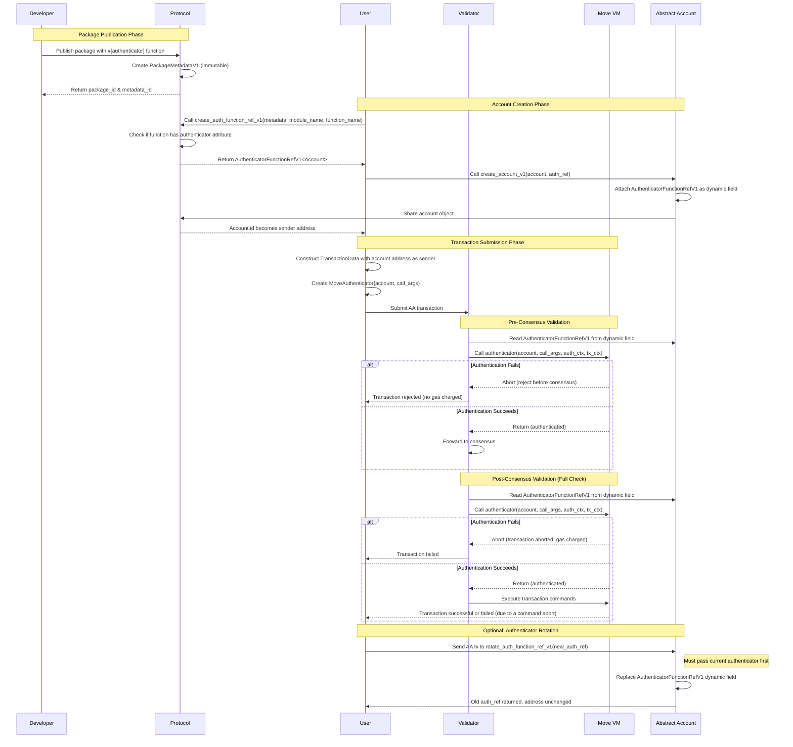

# Account Abstraction

## Summary

Account Abstraction in IOTA replaces fixed cryptographic signature verification with a programmable Move function. An abstract account is a Move object whose ObjectID is its address; its authenticator function is registered on-chain via [`AuthenticatorFunctionRefV1`](../../../references/framework/iota/authenticator_function.mdx#iota_authenticator_function_AuthenticatorFunctionRefV1) and called by the protocol on every incoming AA transaction. The AA transaction sender provides a `MoveAuthenticator` instead of a traditional signature, supplying the arguments the authenticator function needs. The authenticator function receives the account, those arguments, an [`AuthContext`](../../../references/framework/iota/auth_context.mdx#iota_auth_context_AuthContext) describing the AA transaction, and a [`TxContext`](../../../references/framework/iota/tx_context.mdx#iota_tx_context_TxContext), and it either returns (authenticated) or aborts (rejected).

## What Is Account Abstraction?

Traditional IOTA accounts, known as Externally Owned Accounts (EOAs), are controlled by a single cryptographic key pair. Every transaction sent from an EOA must be signed with the corresponding private key; the protocol verifies the signature before allowing the transaction to proceed. This model is simple but rigid: authentication is always reduced to possession of a private key.

**Account Abstraction (AA)** replaces this fixed rule with programmable logic.

Instead of forcing the authentication of an account to the checking of a cryptographic signature, the protocol calls a Move function _you_ define. That function decides whether the transaction is authorized. If the function executes successfully, the transaction proceeds; if the function aborts, the transaction is rejected.

This means abstract accounts can be authenticated using:

- A cryptographic scheme not natively supported by IOTA (e.g., ECDSA on a custom curve)
- A weighted threshold of multiple signers (multisig)
- A time window (only allow transactions before a deadline)
- A permission check (only allow calls to specific Move functions)
- Any combination of the above
- **Anything else expressible in Move**

## The Authentication Lifecycle Example

The following sequence diagram illustrates how the components interact from package publication through transaction execution:

<Tabs groupId="diagram" queryString>
<TabItem value="Sequence Diagram" label="Sequence Diagram">



</TabItem>

<TabItem value="Flowchart" label="Flowchart">



</TabItem>

</Tabs>


```mermaid
flowchart TD
    Start([Developer Starts]) --> Publish["Publish Move Package<br/>with #[authenticator] function"]
    
    Publish --> MetadataCreated[Protocol creates<br/>PackageMetadataV1<br/>immutable object]
    
    MetadataCreated --> UserPhase([User Creates Account])
    UserPhase --> CreateAuthRef[Call create_auth_function_ref_v1<br/>metadata, module_name, function_name]
    
    CreateAuthRef --> ValidateAuth{Check if function<br/>has authenticator<br/>attribute?}
    
    ValidateAuth -->|Invalid| Error1[Abort:<br/>Invalid authenticator]
    ValidateAuth -->|Valid| AuthRefCreated[AuthenticatorFunctionRefV1<br/>created]
    
    AuthRefCreated --> BuildAccount[Build Account Object<br/>IOTAccountBuilder pattern]
    
    BuildAccount --> AttachFields[Attach dynamic fields:<br/>- Public keys<br/>- Admin address<br/>- Time locks<br/>- Spending limits<br/>- Member lists]
    
    AttachFields --> CreateAccount[Call create_account_v1<br/>account, authenticator]
    
    CreateAccount --> AttachAuthRef[Attach AuthenticatorFunctionRefV1<br/>as dynamic field on account]
    
    AttachAuthRef --> ShareAccount[Share account object<br/>account.id = sender address]
    
    ShareAccount --> AccountReady[Account Ready<br/>Can receive transactions]
    
    AccountReady --> UserSubmit[User constructs AA transaction<br/>sender = account address]
    
    UserSubmit --> CreateMoveAuth[Create MoveAuthenticator:<br/>- account<br/>- call_args<br/>- type_arguments]
    
    CreateMoveAuth --> SubmitTx[Submit transaction to validator]
    
    SubmitTx --> PreConsensus{Pre-Consensus<br/>Validation<br/>Optimistic Check}
    
    PreConsensus --> ReadAuthRef1[Read AuthenticatorFunctionRefV1<br/>from account dynamic field]
    
    ReadAuthRef1 --> CallAuth1[Call authenticator function:<br/>account, call_args, auth_ctx, tx_ctx]
    
    CallAuth1 --> AuthCheck1{Authenticator<br/>returns or<br/>aborts?}
    
    AuthCheck1 -->|Abort| Reject1[Reject transaction<br/>NO gas charged<br/>before consensus]
    AuthCheck1 -->|Return| ToConsensus[Forward to consensus]
    
    ToConsensus --> Consensus[Consensus reached]
    
    Consensus --> PostConsensus{Post-Consensus<br/>Validation<br/>Full Check}
    
    PostConsensus --> ReadAuthRef2[Read AuthenticatorFunctionRefV1<br/>from account dynamic field]
    
    ReadAuthRef2 --> CallAuth2[Call authenticator function:<br/>account, call_args, auth_ctx, tx_ctx]
    
    CallAuth2 --> AuthCheck2{Authenticator<br/>returns or<br/>aborts?}
    
    AuthCheck2 -->|Abort| Reject2[Transaction aborted<br/>Gas charged]
    AuthCheck2 -->|Return| Execute[Execute transaction commands]
    
    Execute --> Success[Transaction successful <br/>or<br/> failed due to a command abort]
    
    Success --> NextAction{Need to update<br/>authenticator?}
    
    NextAction -->|Yes| RotateAuth[Send AA tx:<br/>rotate_auth_function_ref_v1]
    NextAction -->|No| End([End])
    
    RotateAuth --> MustPassCurrent[Must pass current<br/>authenticator first]
    
    MustPassCurrent --> RotateAuthRef[Replace AuthenticatorFunctionRefV1<br/>dynamic field]
    
    RotateAuthRef --> AddressUnchanged[Account address unchanged<br/>Old auth_ref returned]
    
    AddressUnchanged --> End
    
    Reject1 --> End
    Reject2 --> End
    Error1 --> End
```

In the following, the specification for the V1 of the implementation of Account Abstraction in IOTA will be described. Account Abstraction in IOTA is defined by [IIP-0009](https://github.com/iotaledger/IIPs/blob/main/iips/IIP-0009/IIP-0009.md).

---

## Main Components

Account Abstraction involves five interconnected components:

| Component                        | Role                                                                                             |
| -------------------------------- | ------------------------------------------------------------------------------------------------ |
| **Abstract Account**             | A Move object whose ObjectID is its address                                                      |
| **Authenticator Function**       | A Move function that decides if the sender of a transaction is an authenticated abstract account |
| **[`AuthenticatorFunctionRefV1`](../../../references/framework/iota/authenticator_function.mdx#iota_authenticator_function_AuthenticatorFunctionRefV1)** | An on-chain, validated reference to an authenticator function                                    |
| **`MoveAuthenticator`**          | A new transaction signature type used to invoke the authenticator function                       |
| **[`AuthContext`](../../../references/framework/iota/auth_context.mdx#iota_auth_context_AuthContext)**                | A runtime context passed to the authenticator function describing the transaction                |

---

### Abstract Account

An abstract account is a Move object, that is, any Move struct with the `key` ability. What makes it an abstract account is not its structure, but what is attached to it: an [`AuthenticatorFunctionRefV1`](../../../references/framework/iota/authenticator_function.mdx#iota_authenticator_function_AuthenticatorFunctionRefV1) dynamic field, which tells the protocol which Move function to call when an AA transaction is sent from this account.

The account's **ObjectID** becomes its on-chain address. Objects that are owned by an abstract account use the "ordinary" ownership model, with the ObjectID serving as the address owning those objects. From the protocol's perspective, abstract accounts are indistinguishable from traditional EOAs at the address level.

Abstract accounts exist in two forms:

- **Mutable shared** (created in Move with [`iota::account::create_account_v1`](../../../references/framework/iota/account.mdx#iota_account_create_account_v1)): the main account object use case, that can be modified by anyone on the basis of an access control implemented in Move code. This is the form used when the account holds mutable state. For example: member lists, approval records, or key stores.

- **Immutable** (created in Move with [`iota::account::create_immutable_account_v1`](../../../references/framework/iota/account.mdx#iota_account_create_immutable_account_v1)): the account object that can never change state, but that can own other objects. This is appropriate when authentication logic is fully self-contained (or "static") and the account holds no mutable state.

What's worth repeating here, is that **any Move object type can become an account**, even object types already existing today in the ledger (through a Move package upgrade).

The IOTA Move bytecode verifier enforces a critical invariant: the account Move object type passed to [`create_account_v1`](../../../references/framework/iota/account.mdx#iota_account_create_account_v1) or [`create_immutable_account_v1`](../../../references/framework/iota/account.mdx#iota_account_create_immutable_account_v1) must be defined in the **same module** as the call site. This prevents one module from registering an unauthorized abstract accounts using another module's object type.

---

### Authenticator Function

The authenticator function is the core of Account Abstraction: it is the logic that decides whether an AA transaction is allowed to use an abstract account as sender.

An authenticator function is a regular Move function with an `#[authenticator]` attribute. It must conform to a strict signature:

1. **Public, non-entry**: the function must be `public` and must **not** be `entry`.
2. **First parameter**: an immutable reference to the account object type (`&Account`).
3. **Middle parameters**: any number of additional inputs, each of which must be read-only: either pure values or references to shared or immutable objects. No owned objects, no mutable references.
4. **Second-to-last parameter**: [`&AuthContext`](../../../references/framework/iota/auth_context.mdx#iota_auth_context_AuthContext), a set of data extracted from the transaction that is being authorized, not present in the [`TxContext`](../../../references/framework/iota/tx_context.mdx#iota_tx_context_TxContext) and useful for authenticating.
5. **Last parameter**: [`&TxContext`](../../../references/framework/iota/tx_context.mdx#iota_tx_context_TxContext), the context of the transaction that is being authorized.
6. **No return type**: authentication is expressed by control flow, not by a return value; a successful return means "authenticated"; an abort means "rejected".

The `#[authenticator]` attribute is what makes the function eligible for use as an authenticator. Any public, non-entry function annotated with this attribute and satisfying the signature rules can be referenced.

**The authenticator function must not have mutable effects.** All its inputs are read-only: it can inspect the account, read shared state, and examine the AA transaction, but it cannot write anything.

The authenticator function's signature constraints are enforced at publication time by the bytecode verifier and validated on-chain via [`PackageMetadataV1`](../../../references/framework/iota/package_metadata.mdx#iota_package_metadata_PackageMetadataV1) ([IIP-0010](https://github.com/iotaledger/IIPs/blob/main/iips/IIP-0010/iip-0010.md)), an immutable object created exclusively by the protocol during publish and upgrade operations, making it a trusted source of package metadata.

---

### [`AuthenticatorFunctionRefV1`](../../../references/framework/iota/authenticator_function.mdx#iota_authenticator_function_AuthenticatorFunctionRefV1)

[`AuthenticatorFunctionRefV1<T>`](../../../references/framework/iota/authenticator_function.mdx#iota_authenticator_function_AuthenticatorFunctionRefV1) is the on-chain proof that a specific Move function is a valid authenticator for a specific account type. It is created using a [`PackageMetadataV1`](../../../references/framework/iota/package_metadata.mdx#iota_package_metadata_PackageMetadataV1). In fact, a [`PackageMetadataV1`](../../../references/framework/iota/package_metadata.mdx#iota_package_metadata_PackageMetadataV1) includes information related to a specific package, for all its modules and all functions. So, using this on-chain source of information, a [`AuthenticatorFunctionRefV1<T>`](../../../references/framework/iota/authenticator_function.mdx#iota_authenticator_function_AuthenticatorFunctionRefV1) is created by encapsulating three values:

- `package`: the ID of the package containing the authenticator function
- `module_name`: the module within that package containing the authenticator function
- `function_name`: the authenticator function name

The type parameter `T` binds the reference to a specific account type. This ensures you cannot attach a multisig authenticator designed for `T: MultisigAccount` to a `T: FunctionKeysAccount`.

To create an [`AuthenticatorFunctionRefV1`](../../../references/framework/iota/authenticator_function.mdx#iota_authenticator_function_AuthenticatorFunctionRefV1), you must call [`iota::authenticator_function::create_auth_function_ref_v1`](../../../references/framework/iota/authenticator_function.mdx#iota_authenticator_function_create_auth_function_ref_v1) with a valid [`PackageMetadataV1`](../../../references/framework/iota/package_metadata.mdx#iota_package_metadata_PackageMetadataV1) object. The function validates that the referenced function exists in the metadata and that its account type matches the type parameter. You cannot create an [`AuthenticatorFunctionRefV1`](../../../references/framework/iota/authenticator_function.mdx#iota_authenticator_function_AuthenticatorFunctionRefV1) by hand, but it must always be produced through this validated path.

Once created, _an [`AuthenticatorFunctionRefV1`](../../../references/framework/iota/authenticator_function.mdx#iota_authenticator_function_AuthenticatorFunctionRefV1) is stored as a dynamic field on the account object_. The protocol uses this known dynamic field to locate the authenticator function when an AA transaction arrives.

**Authenticator rotation** is supported via [`iota::account::rotate_auth_function_ref_v1`](../../../references/framework/iota/account.mdx#iota_account_rotate_auth_function_ref_v1). This replaces the current authenticator with a new one without changing the abstract account's address. The old [`AuthenticatorFunctionRefV1`](../../../references/framework/iota/authenticator_function.mdx#iota_authenticator_function_AuthenticatorFunctionRefV1) is returned, and the new one is installed.

---

### `MoveAuthenticator`

`MoveAuthenticator` is a new variant of IOTA's `GenericSignature` type within the SDK. It is what a transaction sender provides instead of a traditional cryptographic signature when sending a transaction from an abstract account.

A `MoveAuthenticator` (in its V1) contains:

- **`object_to_authenticate`**: A reference to the account object that is the AA transaction sender. This object's ID determines the sender address. It must be a reference to an immutable or non-mutable shared object. _Owned objects and mutable shared objects are not allowed_.
- **`call_args`**: A vector of additional arguments (`CallArg`) that will be forwarded to the authenticator function. These correspond to the "middle parameters" described above.
- **`type_arguments`**: Type arguments for the authenticator function, if it is generic.

The sender address is derived directly from the account object's ID. The protocol validates that the `object_to_authenticate` field matches the declared sender of the AA transaction.

When the protocol processes the AA transaction, it reads the [`AuthenticatorFunctionRefV1`](../../../references/framework/iota/authenticator_function.mdx#iota_authenticator_function_AuthenticatorFunctionRefV1) dynamic field from the referenced account object, constructs a Move call to the corresponding authenticator function with the provided `call_args` arguments, and executes it. _The `MoveAuthenticator` carries no cryptographic material itself, all authentication logic lives in Move_.

---

### [`AuthContext`](../../../references/framework/iota/auth_context.mdx#iota_auth_context_AuthContext)

The [`AuthContext`](../../../references/framework/iota/auth_context.mdx#iota_auth_context_AuthContext) is a struct passed by the protocol to the authenticator function as its second-to-last parameter. It describes the transaction being authorized:

- **`auth_digest`**: The digest of the `MoveAuthenticator` itself. This uniquely identifies the authenticator invocation.
- **[`tx_inputs`](../../../references/framework/iota/auth_context.mdx#iota_auth_context_tx_inputs)**: The full list of inputs to the Programmable Transaction Block (PTB); this allows to read the object references and pure values passed as input to the AA transaction.
- **[`tx_commands`](../../../references/framework/iota/auth_context.mdx#iota_auth_context_tx_commands)**: The ordered list of commands in the PTB; this allows to parse all the commands that are going to be executed for the AA transaction if the authentication is successful.

The [`AuthContext`](../../../references/framework/iota/auth_context.mdx#iota_auth_context_AuthContext) allows the authenticator function to inspect what the AA transaction will do before allowing it. This enables **intent-aware authentication**: for example, a function-keys authenticator can verify that the AA transaction calls only an approved Move function; a spending-limit authenticator can check that coin transfers do not exceed a threshold (in a specific scenario).

---

## The Authentication Lifecycle Example

The components interact as follows:

```
[Package Publication]
  └─► PackageMetadataV1 created automatically
        └─► create_auth_function_ref_v1(metadata, module, function)
              └─► AuthenticatorFunctionRefV1<Account>
                    └─► create_account_v1(account_object, auth_ref)
                          └─► Account is now an abstract account (shared object)
                                └─► account.id == sender address

[Transaction Submission]
  └─► MoveAuthenticator { object_to_authenticate, call_args, type_arguments }
        └─► Protocol reads AuthenticatorFunctionRefV1 from account dynamic field
              └─► Calls authenticator_function(account, ...call_args, auth_context, tx_context)
                    ├─► Returns normally → transaction authorized
                    └─► Aborts → transaction rejected
```

### 1. Package publication

When a developer publishes a package containing an `#[authenticator]` function, the IOTA protocol automatically creates a [`PackageMetadataV1`](../../../references/framework/iota/package_metadata.mdx#iota_package_metadata_PackageMetadataV1) immutable object. This object records the function name and account type. The developer receives the package object id and its associated metadata object id in the transaction effects.

### 2. Account creation

Any user (also through sponsorship) can call a package-defined function that creates the account object and invokes [`iota::account::create_account_v1`](../../../references/framework/iota/account.mdx#iota_account_create_account_v1), which:

1. Creates the account object (a Move struct with `key`) of type `CustomDevAccount`.
2. Calls [`iota::authenticator_function::create_auth_function_ref_v1`](../../../references/framework/iota/authenticator_function.mdx#iota_authenticator_function_create_auth_function_ref_v1) with the object id of the [`PackageMetadataV1`](../../../references/framework/iota/package_metadata.mdx#iota_package_metadata_PackageMetadataV1), the module name, and the authenticator function name as inputs (this produces an [`AuthenticatorFunctionRefV1<CustomDevAccount>`](../../../references/framework/iota/authenticator_function.mdx#iota_authenticator_function_AuthenticatorFunctionRefV1)).
3. Calls [`iota::account::create_account_v1(account, authenticator_ref)`](../../../references/framework/iota/account.mdx#iota_account_create_account_v1), which:
   - Attaches the [`AuthenticatorFunctionRefV1<CustomDevAccount>`](../../../references/framework/iota/authenticator_function.mdx#iota_authenticator_function_AuthenticatorFunctionRefV1) as a dynamic field on the account.
   - Shares the object.
   - Emits a [`MutableAccountCreated`](../../../references/framework/iota/account.mdx#iota_account_MutableAccountCreated) event.

After this point, the account's ObjectID is a valid IOTA address, and any transaction claiming to come from that address must "pass" the attached authenticator function.

### 3. AA Transaction submission

A client that wants to send an AA transaction from the abstract account constructs:

- A `TransactionData` with the account's address as the sender.
- A `MoveAuthenticator` containing:
  - A reference to the `CustomDevAccount` object.
  - The arguments the authenticator function needs (signatures, proofs, digests, etc.).

The `MoveAuthenticator` is placed in the AA transaction's signature field.

### 4. Validator's authentication process

- **Pre-consensus**: Before an AA transaction reaches consensus, each validator independently invokes the authenticator function. This optimistic check allows validators to reject obviously invalid transactions early, without waiting for consensus and without charging gas.
  If the authenticator function aborts in this phase, the transaction is rejected before consensus.
- **Post-consensus**: After consensus, the authenticator function is called again with the full resolved AA transaction context and inputs. If it aborts, the transaction is aborted and gas is deducted.
  If it returns successfully, the AA transaction proceeds to normal execution.

### 5. Authenticator rotation

When an account's security policy needs to change, for example, to add a new member, rotate a key, or upgrade to a new authenticator, the account calls [`iota::account::rotate_auth_function_ref_v1`](../../../references/framework/iota/account.mdx#iota_account_rotate_auth_function_ref_v1). Because this is an AA transaction sent from the abstract account itself, it must first pass the existing authenticator. Once authorized, the old [`AuthenticatorFunctionRefV1`](../../../references/framework/iota/authenticator_function.mdx#iota_authenticator_function_AuthenticatorFunctionRefV1) is replaced with the new one. The account's address is unchanged.
