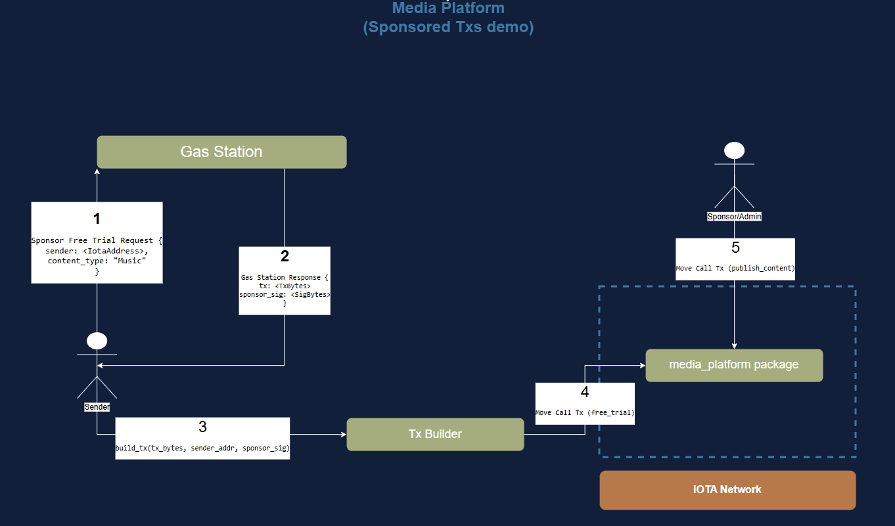

# Sponsored Transactions: Part I

In this tutorial, we will learn how to create a [sponsored transaction](../iota-101/transactions/sponsored-transactions/about-sponsored-transactions.mdx) on the IOTA network using the [IOTA Rust SDK](../../references/rust-sdk.mdx).
We are going to create a media platform, where users can subscribe to several types of content. There is a free trial option, from which users can try the service for a limited time.
For new users on the IOTA network, the platform admin will sponsor the gas fees for the `free trial` option. This will allow users to experience the platform without having to pay for gas fees nor subscription fees.


## Architecture and Flow Overview

The workflow of the sponsored transaction is as follows:
1- A user who does not have an IOTA balance wants to subscribe to the free trial option. They will send a request to the Gas Station server to sponsor their transaction alongside content type (Music, News or Movies).
2- The [Gas Station server] will verify that this user has not used the free trial option before. If the user is eligible, the Gas Station will build a transaction (with gas payment from the sponsor's balance), sign it, and send back both the transaction and the signature separately as the response.
3- The user, having received the transaction and the sponsor's signature, will sign the transaction and send it to the IOTA network. The user can do this using the CLI, Rust SDK or TS SDK. In this part, we will use the Rust SDK.
4- The sponsor/admin (they can be different addresses, but for simplicity, we will assume they are the same) can now call the `publish` content function on the platform to publish the content to the user's address.




## Prerequisites

- [Installed Rust](https://www.rust-lang.org/tools/install)
- [Installed IOTA CLI tool](../getting-started/install-iota.mdx)

### First Component: Media Platform Package

The first component is the media platform package, which will contain the `free_trial` function that users can call to subscribe to the free trial option. The `free_trial` function will be called by the user's signed transaction, which will be sponsored by the Gas Station server.

First, [create a new Move project](../getting-started/create-a-package.mdx) and add the following code to the `src/lib.rs` file:

```move
module sponsored_transactions_packages::sponsored_transactions_packages;

use iota::event;
use iota::linked_table::{Self, LinkedTable};
use iota::package::Publisher;
use std::string::{Self, String};

const ENotAuthorized: u64 = 0;
const EInvalidSubscriptionType: u64 = 1;

/// Enum representing subscription types
public enum SubscriptionType has copy, drop, store {
    Music,
    Movies,
    News,
}

public struct Content has key, store {
    id: UID,
    content_type: SubscriptionType,
    content: String,
}

/// Event for subscriptions
public struct Subscribed has copy, drop {
    id: address,
    subscription_type: SubscriptionType,
}

/// The OTW type for the Subscription Manager
public struct SPONSORED_TRANSACTIONS_PACKAGES has drop {}

/// Subscription manager struct encapsulating subscription and trial tables
public struct SubscriptionManager has key, store {
    id: UID,
    subscriptions: LinkedTable<address, SubscriptionType>,
    trials: LinkedTable<address, SubscriptionType>,
}

/// function init for SubscriptionManager
fun init(otw: SPONSORED_TRANSACTIONS_PACKAGES, ctx: &mut TxContext) {
    let manager = SubscriptionManager {
        id: object::new(ctx),
        subscriptions: linked_table::new<address, SubscriptionType>(ctx),
        trials: linked_table::new<address, SubscriptionType>(ctx),
    };

    let publisher: Publisher = iota::package::claim(otw, ctx);

    // Share the manager
    transfer::public_share_object(manager);

    // transfer the publisher to the sender
    transfer::public_transfer(publisher, ctx.sender());
}

/// Allows a user to subscribe to a specific type of content
/// TODO: Deduct coins from the user's balance
entry fun subscribe(subscription_type: String, manager: &mut SubscriptionManager, ctx: &TxContext) {
    let mut sub_type = SubscriptionType::News;
    // get the type of subscription
    if (subscription_type.as_bytes() == b"Music") {
        sub_type = SubscriptionType::Music;
    } else if (subscription_type.as_bytes() == b"Movies") {
        sub_type = SubscriptionType::Movies;
    } else if (subscription_type.as_bytes() == b"News") {
        sub_type = SubscriptionType::News;
    } else {
        // Invalid subscription type
        assert!(false, EInvalidSubscriptionType);
    };

    // Get the address from the context
    let addr = ctx.sender();

    // Add the subscription to the subscription table
    manager.subscriptions.push_back(ctx.sender(), sub_type);

    // Emit the subscription event
    event::emit(Subscribed { id: addr, subscription_type: sub_type });
}

entry fun free_trial(
    subscription_type: String,
    manager: &mut SubscriptionManager,
    ctx: &TxContext,
) { let mut sub_type = SubscriptionType::News; // get the type of subscription
    if (subscription_type.as_bytes() == b"Music") {
        sub_type = SubscriptionType::Music;
    } else if (subscription_type.as_bytes() == b"Movies") {
        sub_type = SubscriptionType::Movies;
    } else if (subscription_type.as_bytes() == b"News") {
        sub_type = SubscriptionType::News;
    } else {
        // Invalid subscription type
        assert!(false, EInvalidSubscriptionType);
    };  // Get the address from the context
    let addr = ctx.sender();  // Add the subscription to the trial table
    manager.trials.push_back(ctx.sender(), sub_type);  // Emit the subscription event
    event::emit(Subscribed { id: addr, subscription_type: sub_type }); }

/// publish content to the subscribers and trials
/// This function is only callable by the publisher, it loops through the subscriptions and trials
/// and sends the content to the subscribers and trials
entry fun publish(manager: &SubscriptionManager, publisher: &Publisher, ctx: &mut TxContext) {
    assert!(publisher.from_module<SubscriptionManager>(), ENotAuthorized);

    let mut first_sub = manager.subscriptions.front();
    let mut first_trial = manager.trials.front();

    while (option::is_some(first_sub)) {
        let k = *option::borrow(first_sub); // option::borrow - returns an immutable reference to the value inside the Option
        let v = linked_table::borrow(&manager.subscriptions, k);

        let content = Content {
            id: object::new(ctx),
            content_type: *v,
            content: string::utf8(b"This is the content"),
        };
        transfer::transfer(content, k);
        first_sub = manager.subscriptions.next(k);
    };

    while (option::is_some(first_trial)) {
        let k = *option::borrow(first_trial); // option::borrow - returns an immutable reference to the value inside the Option
        let v = linked_table::borrow(&manager.trials, k);

        let content = Content {
            id: object::new(ctx),
            content_type: *v,
            content: string::utf8(b"This is the content"),
        };
        transfer::transfer(content, k);
        first_trial = manager.trials.next(k);
    };
}
```

When you [publish the package](../getting-started/publish.mdx), `init` will be called creating a `SubscriptionManager` shared object and transferring the `Publisher` object to the sender. The `Publisher` object is used to ensure that only the publisher can call the `publish` function.

```shell
$ iota client publish
UPDATING GIT DEPENDENCY https://github.com/iotaledger/iota.git
INCLUDING DEPENDENCY Iota
INCLUDING DEPENDENCY MoveStdlib
BUILDING sponsored_transactions_packages
Successfully verified dependencies on-chain against source.
Transaction Digest: HMNX7GPsiMpCTBw7UTxWsc7afDC4BhKLuJMv8sWev1xh
╭──────────────────────────────────────────────────────────────────────────────────────────────────────────────╮
│ Transaction Data                                                                                             │
├──────────────────────────────────────────────────────────────────────────────────────────────────────────────┤
│ Sender: 0xbf293ced2593118cd231f107f341bb1ad9db39cd0497bff29d355730cf4e2bc2                                   │
│ Gas Owner: 0xbf293ced2593118cd231f107f341bb1ad9db39cd0497bff29d355730cf4e2bc2                                │
│ Gas Budget: 26175600 NANOS                                                                                   │
│ Gas Price: 1000 NANOS                                                                                        │
│ Gas Payment:                                                                                                 │
│  ┌──                                                                                                         │
│  │ ID: 0x39ea9a3f9889c1fc3d79d63d97ae293a74859d0ce0b876c090211471e37067bb                                    │
│  │ Version: 5133                                                                                             │
│  │ Digest: FUX3cb9c2Wovk4ELYM1NCmSukV59PRgZzAGZZ14DF641                                                      │
│  └──                                                                                                         │
│                                                                                                              │
│ Transaction Kind: Programmable                                                                               │
│ ╭──────────────────────────────────────────────────────────────────────────────────────────────────────────╮ │
│ │ Input Objects                                                                                            │ │
│ ├──────────────────────────────────────────────────────────────────────────────────────────────────────────┤ │
│ │ 0   Pure Arg: Type: address, Value: "0xbf293ced2593118cd231f107f341bb1ad9db39cd0497bff29d355730cf4e2bc2" │ │
│ ╰──────────────────────────────────────────────────────────────────────────────────────────────────────────╯ │
│ ╭─────────────────────────────────────────────────────────────────────────╮                                  │
│ │ Commands                                                                │                                  │
│ ├─────────────────────────────────────────────────────────────────────────┤                                  │
│ │ 0  Publish:                                                             │                                  │
│ │  ┌                                                                      │                                  │
│ │  │ Dependencies:                                                        │                                  │
│ │  │   0x0000000000000000000000000000000000000000000000000000000000000002 │                                  │
│ │  │   0x0000000000000000000000000000000000000000000000000000000000000001 │                                  │
│ │  └                                                                      │                                  │
│ │                                                                         │                                  │
│ │ 1  TransferObjects:                                                     │                                  │
│ │  ┌                                                                      │                                  │
│ │  │ Arguments:                                                           │                                  │
│ │  │   Result 0                                                           │                                  │
│ │  │ Address: Input  0                                                    │                                  │
│ │  └                                                                      │                                  │
│ ╰─────────────────────────────────────────────────────────────────────────╯                                  │
│                                                                                                              │
│ Signatures:                                                                                                  │
│    LDs5QIxx4VyYOJkswnNtDSSCYnzSJcT1Y4angwSU2F+Q4xv3wH14/ftCzwDRkEkhR2l/JxFvAnAEzLzc8jUcDg==                  │
│                                                                                                              │
╰──────────────────────────────────────────────────────────────────────────────────────────────────────────────╯
╭───────────────────────────────────────────────────────────────────────────────────────────────────╮
│ Transaction Effects                                                                               │
├───────────────────────────────────────────────────────────────────────────────────────────────────┤
│ Digest: HMNX7GPsiMpCTBw7UTxWsc7afDC4BhKLuJMv8sWev1xh                                              │
│ Status: Success                                                                                   │
│ Executed Epoch: 46                                                                                │
│                                                                                                   │
│ Created Objects:                                                                                  │
│  ┌──                                                                                              │
│  │ ID: 0x1470020d52099b5181ede006875eb4d5f4e95745c405cd6d0a202c4734f4d280                         │
│  │ Owner: Account Address ( 0xbf293ced2593118cd231f107f341bb1ad9db39cd0497bff29d355730cf4e2bc2 )  │
│  │ Version: 5134                                                                                  │
│  │ Digest: 42AvDhg1F9tDkW5pfFR2AYHcjBQLa787YxF9XbAWdfjb                                           │
│  └──                                                                                              │
│  ┌──                                                                                              │
│  │ ID: 0x2069e91c8333350bdf6bbd2991266ad33992757db7af48291adb58e7a5b0e1aa                         │
│  │ Owner: Immutable                                                                               │
│  │ Version: 1                                                                                     │
│  │ Digest: 9BjRWZpBPZYaKxU4GxSJzTD4AmWi6L1pcbb8AwKHFtEJ                                           │
│  └──                                                                                              │
│  ┌──                                                                                              │
│  │ ID: 0x995919215d7d3282e92446436921ea850d14df9fa98eb5c84a84e325519e0875                         │
│  │ Owner: Account Address ( 0xbf293ced2593118cd231f107f341bb1ad9db39cd0497bff29d355730cf4e2bc2 )  │
│  │ Version: 5134                                                                                  │
│  │ Digest: AVsPGE2FYNtron4CSrfpiCkaV7rNuviEZ4SWitemsgUg                                           │
│  └──                                                                                              │
│  ┌──                                                                                              │
│  │ ID: 0xb05236e6ca067e3fa114bab1558f35e44097e0078aa681761faa62220858a176                         │
│  │ Owner: Shared( 5134 )                                                                          │
│  │ Version: 5134                                                                                  │
│  │ Digest: JDZ8KD6sHapkZdrLCutM9jRd9MR7jDVZc3U61bLrdRM2                                           │
│  └──                                                                                              │
│ Mutated Objects:                                                                                  │
│  ┌──                                                                                              │
│  │ ID: 0x39ea9a3f9889c1fc3d79d63d97ae293a74859d0ce0b876c090211471e37067bb                         │
│  │ Owner: Account Address ( 0xbf293ced2593118cd231f107f341bb1ad9db39cd0497bff29d355730cf4e2bc2 )  │
│  │ Version: 5134                                                                                  │
│  │ Digest: 5W22iUDDMKdVnEeeLiDf2zKWzZqz7BbsjazTyKyhsb22                                           │
│  └──                                                                                              │
│ Gas Object:                                                                                       │
│  ┌──                                                                                              │
│  │ ID: 0x39ea9a3f9889c1fc3d79d63d97ae293a74859d0ce0b876c090211471e37067bb                         │
│  │ Owner: Account Address ( 0xbf293ced2593118cd231f107f341bb1ad9db39cd0497bff29d355730cf4e2bc2 )  │
│  │ Version: 5134                                                                                  │
│  │ Digest: 5W22iUDDMKdVnEeeLiDf2zKWzZqz7BbsjazTyKyhsb22                                           │
│  └──                                                                                              │
│ Gas Cost Summary:                                                                                 │
│    Storage Cost: 24175600 NANOS                                                                   │
│    Computation Cost: 1000000 NANOS                                                                │
│    Storage Rebate: 980400 NANOS                                                                   │
│    Non-refundable Storage Fee: 0 NANOS                                                            │
│                                                                                                   │
│ Transaction Dependencies:                                                                         │
│    63X49x2QuuYNduExZWoJjfXut3s3WDWZ7Tr7nXJu32ZT                                                   │
│    HWkNmvRAAGgj4qh2B4X16CqQ829TQmSmexdDzFekRRTH                                                   │
╰───────────────────────────────────────────────────────────────────────────────────────────────────╯
╭─────────────────────────────╮
│ No transaction block events │
╰─────────────────────────────╯

╭──────────────────────────────────────────────────────────────────────────────────────────────────────────────────────────────────────────╮
│ Object Changes                                                                                                                           │
├──────────────────────────────────────────────────────────────────────────────────────────────────────────────────────────────────────────┤
│ Created Objects:                                                                                                                         │
│  ┌──                                                                                                                                     │
│  │ ObjectID: 0x1470020d52099b5181ede006875eb4d5f4e95745c405cd6d0a202c4734f4d280                                                          │
│  │ Sender: 0xbf293ced2593118cd231f107f341bb1ad9db39cd0497bff29d355730cf4e2bc2                                                            │
│  │ Owner: Account Address ( 0xbf293ced2593118cd231f107f341bb1ad9db39cd0497bff29d355730cf4e2bc2 )                                         │
│  │ ObjectType: 0x2::package::Publisher                                                                                                   │
│  │ Version: 5134                                                                                                                         │
│  │ Digest: 42AvDhg1F9tDkW5pfFR2AYHcjBQLa787YxF9XbAWdfjb                                                                                  │
│  └──                                                                                                                                     │
│  ┌──                                                                                                                                     │
│  │ ObjectID: 0x995919215d7d3282e92446436921ea850d14df9fa98eb5c84a84e325519e0875                                                          │
│  │ Sender: 0xbf293ced2593118cd231f107f341bb1ad9db39cd0497bff29d355730cf4e2bc2                                                            │
│  │ Owner: Account Address ( 0xbf293ced2593118cd231f107f341bb1ad9db39cd0497bff29d355730cf4e2bc2 )                                         │
│  │ ObjectType: 0x2::package::UpgradeCap                                                                                                  │
│  │ Version: 5134                                                                                                                         │
│  │ Digest: AVsPGE2FYNtron4CSrfpiCkaV7rNuviEZ4SWitemsgUg                                                                                  │
│  └──                                                                                                                                     │
│  ┌──                                                                                                                                     │
│  │ ObjectID: 0xb05236e6ca067e3fa114bab1558f35e44097e0078aa681761faa62220858a176                                                          │
│  │ Sender: 0xbf293ced2593118cd231f107f341bb1ad9db39cd0497bff29d355730cf4e2bc2                                                            │
│  │ Owner: Shared( 5134 )                                                                                                                 │
│  │ ObjectType: 0x2069e91c8333350bdf6bbd2991266ad33992757db7af48291adb58e7a5b0e1aa::sponsored_transactions_packages::SubscriptionManager  │
│  │ Version: 5134                                                                                                                         │
│  │ Digest: JDZ8KD6sHapkZdrLCutM9jRd9MR7jDVZc3U61bLrdRM2                                                                                  │
│  └──                                                                                                                                     │
│ Mutated Objects:                                                                                                                         │
│  ┌──                                                                                                                                     │
│  │ ObjectID: 0x39ea9a3f9889c1fc3d79d63d97ae293a74859d0ce0b876c090211471e37067bb                                                          │
│  │ Sender: 0xbf293ced2593118cd231f107f341bb1ad9db39cd0497bff29d355730cf4e2bc2                                                            │
│  │ Owner: Account Address ( 0xbf293ced2593118cd231f107f341bb1ad9db39cd0497bff29d355730cf4e2bc2 )                                         │
│  │ ObjectType: 0x2::coin::Coin<0x2::iota::IOTA>                                                                                          │
│  │ Version: 5134                                                                                                                         │
│  │ Digest: 5W22iUDDMKdVnEeeLiDf2zKWzZqz7BbsjazTyKyhsb22                                                                                  │
│  └──                                                                                                                                     │
│ Published Objects:                                                                                                                       │
│  ┌──                                                                                                                                     │
│  │ PackageID: 0x2069e91c8333350bdf6bbd2991266ad33992757db7af48291adb58e7a5b0e1aa                                                         │
│  │ Version: 1                                                                                                                            │
│  │ Digest: 9BjRWZpBPZYaKxU4GxSJzTD4AmWi6L1pcbb8AwKHFtEJ                                                                                  │
│  │ Modules: sponsored_transactions_packages                                                                                              │
│  └──                                                                                                                                     │
╰──────────────────────────────────────────────────────────────────────────────────────────────────────────────────────────────────────────╯
╭───────────────────────────────────────────────────────────────────────────────────────────────────╮
│ Balance Changes                                                                                   │
├───────────────────────────────────────────────────────────────────────────────────────────────────┤
│  ┌──                                                                                              │
│  │ Owner: Account Address ( 0xbf293ced2593118cd231f107f341bb1ad9db39cd0497bff29d355730cf4e2bc2 )  │
│  │ CoinType: 0x2::iota::IOTA                                                                      │
│  │ Amount: -24195200                                                                              │
│  └──                                                                                              │
╰───────────────────────────────────────────────────────────────────────────────────────────────────╯
```

What we will need to call the `free_trial` function is the `SubscriptionManager` shared object.
Both `subscribe` and `free_trial` functions allow users to subscribe to a specific type of content, with the distinction that `free_trial` doesn't deduct coins from the user's balance.

:::info
The package implementation is over simplified as the main focus is the sponsored transactions workflow. In a real-world application, you would want:
1- Use timestamps to track the subscription duration, and automatically unsubscribe users after the trial period.
2- Restrict the number of free trials a user can have.
:::

This package contains the following functions:
1- `subscribe`: Allows a user to subscribe to a specific type of content.
2- `free_trial`: Allows a user to subscribe to the free trial option.
3- `publish`: Publishes content to the subscribers and trials. This function is only callable by the publisher.

And the following structs:
1- `SubscriptionType`: Enum representing subscription types.
2- `Content`: Struct representing content.
3- `Subscribed`: Event for subscriptions.
4- `SubscriptionManager`: Struct encapsulating subscription and trial tables. This is used to manage subscriptions and trials.


### Second Compononent: Gas Station Server
The Gas Station server is responsible for verifying the user's eligibility for the free trial, building the transaction, and signing it. The server's response will include the transaction and the sponsor's signature.
We will use [axum](https://docs.rs/axum/latest/axum/) as the web framework for the Gas Station server. However, you can use any web framework you are comfortable with.

To start, create a new rust project and add the following dependencies to your `Cargo.toml` file (we will se their usage as we go through the code):

```toml
[dependencies]
axum = "0.6.20"
hyper = { version = "0.14.27", features = ["full"] }
tower = "0.4.13"
iota-sdk = { git = "https://github.com/iotaledger/iota", package = "iota-sdk" }
iota-keys = { git = "https://github.com/iotaledger/iota", package = "iota-keys" }
iota-config = { git = "https://github.com/iotaledger/iota", package = "iota-config" }
shared_crypto = { git = "https://github.com/iotaledger/iota", package = "shared-crypto" }

tokio = { version = "1.2", features = ["full"] }
anyhow = "1.0"
serde = { version = "1.0", features = ["derive"] }
futures = "0.3"
serde_json = "1.0"
reqwest = {version = "0.11.4", features = ["json"]}
fastcrypto = "0.1.8"
bcs = "0.1.4"
```

The Gas Station server will have the following `main` funcion in the `src/main.rs` file:

```rust
// TODO: This is a simple example of a shared state. In a real-world application, you would want to use a database to store this information.
// Shared state to keep track of addresses and total sponsored fees
type SharedState = Arc<RwLock<(HashSet<IotaAddress>, u128)>>;

#[tokio::main]
async fn main() -> Result<(), anyhow::Error> {
    // Create shared state
    let state: SharedState = Arc::new(RwLock::new((HashSet::new(), 0))); // (addresses, total_sponsored_fees)

    // Initialize IOTA client
    let iota_testnet = IotaClientBuilder::default().build_testnet().await?;
    let msg = format!("Welcome to IOTA Testnet {:?}", iota_testnet.api_version());

    // Build the router
    let app = Router::new()
        .route("/", get(move || async { msg }))
        .route(
            "/sign_and_fund_transaction",
            post(sign_and_fund_transaction),
        )
        .with_state(state);

    // Run the server
    axum::Server::bind(&"0.0.0.0:3001".parse().unwrap())
        .serve(app.into_make_service())
        .await
        .unwrap();

    Ok(())
}
```


We technically have two routes in the Gas Station server:
1- The root route `/` will return a welcome message.
2- The `/sign_and_fund_transaction` route will handle the user's request to sponsor the free trial. This route will call the `sign_and_fund_transaction` function, which we will implement next.

:::danger
In a real-world application, you would want to use a database to store the shared state information. However, for simplicity, we are using a shared state in memory. 
This means that if the server restarts, the shared state will be lost.
:::

Next, we will implement the `sign_and_fund_transaction` function, which will be called when the user sends a request to the `/sign_and_fund_transaction` route. This function will verify the user's eligibility, build the transaction, sign it, and return the transaction and the sponsor's signature.

```rust
/// Get an address from the user, and send back a signed sponsored transaction
async fn sign_and_fund_transaction(
    State(state): State<SharedState>,
    Json(payload): Json<GaslessTransactionRequest>,
) -> impl axum::response::IntoResponse {
    println!("Received gasless transaction request: {:?}", payload);

    let mut state_guard = state.write().await;
    let (addresses, total_sponsored_fees) = &mut *state_guard;

    if addresses.contains(&payload.sender) {
        // Return a conflict status if the address has already requested funds
        return (
            StatusCode::CONFLICT,
            Json(json!({"error": "Address already funded"})),
        );
    }

    // Add the address to the set
    addresses.insert(payload.sender);

    println!("Received gasless transaction request: {:?}", payload);

    // now lets create a signed and funded transaction
    let iota_testnet = IotaClientBuilder::default().build_testnet().await.unwrap();

    // Change this to the sponsor address you want to use
    let sponsor =
        IotaAddress::from_str("0xbf293ced2593118cd231f107f341bb1ad9db39cd0497bff29d355730cf4e2bc2")
            .unwrap();
    let signed_tx = utils::sign_and_fund_transaction(
        &iota_testnet,
        &payload.sender,
        &sponsor,
        &payload.content_type,
    )
    .await
    .unwrap();

    let gas_price = iota_testnet
        .read_api()
        .get_reference_gas_price()
        .await
        .unwrap();
    // increment the total sponsored fees
    *total_sponsored_fees += gas_price as u128;

    let (bytes, sigs) = signed_tx.to_tx_bytes_and_signatures();

    // Respond with tx-bytes and sponsor signature
    (
        StatusCode::OK,
        Json(
            json!({"message": "Transaction signed and funded successfully",
                            "bytes": bytes,
                            "sigs": sigs,
            }),
        ),
    )
}
```

The function `sign_and_fund_transaction` will:
1- Check if the user has already requested funds. If they have, it will return a conflict status.
2- Add the user's address to the set of addresses that have requested funds.
3- Build a signed and funded transaction using the `sign_and_fund_transaction` util function, which we will implement next.
4- Increment the total sponsored fees by the gas price. This is used for tracking by the sponsor.
5- Respond with the transaction bytes and the sponsor's signature.

Next, we will implement the `sign_and_fund_transaction` util function, which will build the transaction, sign it, and return the signed transaction.
under the `utils.rs` file, add the following code:

```rust
/// Create signed and funded transaction
/// Supposed to return a transaction that calls the `free_trial` function of the `sponsored_transactions_packages` package.
// │ Published Objects:                                                                                                                       │
// │  ┌──                                                                                                                                     │
// │  │ PackageID: 0x2069e91c8333350bdf6bbd2991266ad33992757db7af48291adb58e7a5b0e1aa                                                         │
// │  │ Version: 1                                                                                                                            │
// │  │ Digest: 2EXnq389M6Vjazdv7NDetC75ahJZWdpDuUKtzNEYqjfc                                                                                  │
// │  │ Modules: sponsored_transactions_packages                                                                                              │
// │  └──                                                                                                                                     │
// ╰──────────────────────────────────────────────────────────────────────────────────────────────────────────────────────────────────────────╯
pub async fn sign_and_fund_transaction(
    client: &IotaClient,
    sender: &IotaAddress,
    sponsor: &IotaAddress,
    content_type: &str,
) -> Result<Envelope<SenderSignedData, EmptySignInfo>, anyhow::Error> {
    let keystore = FileBasedKeystore::new(&iota_config_dir()?.join(IOTA_KEYSTORE_FILENAME))?;

    let pt = {
        let mut builder = ProgrammableTransactionBuilder::new();

        // Call the `free_trial` function of the `sponsored_transactions_packages` package
        let package = ObjectID::from_str(
            "0x2069e91c8333350bdf6bbd2991266ad33992757db7af48291adb58e7a5b0e1aa",
        )?;
        let module = Identifier::from_str("sponsored_transactions_packages")?;
        let function = Identifier::from_str("free_trial")?;

        // The content type is passed as a parameter to the `free_trial` function. options are "Music", "News" or "Movies"
        let content_type_arg = CallArg::Pure(bcs::to_bytes(content_type)?);

        // This is the SubscriptionManager object that is used to manage subscriptions, it is a shared object.
        let object_arg = ObjectArg::SharedObject {
            id: ObjectID::from_str(
                "0xb05236e6ca067e3fa114bab1558f35e44097e0078aa681761faa62220858a176",
            )?,
            initial_shared_version: 5134.into(),
            mutable: true,
        };
        let manager_object = CallArg::Object(object_arg);
        builder
            .move_call(
                package,
                module,
                function,
                vec![],
                vec![content_type_arg, manager_object],
            )
            .unwrap();
        builder.finish()
    };

    // Get the gas coin of the sponsor
    let gas_coin = client
        .coin_read_api()
        .get_coins(*sponsor, None, None, None)
        .await?
        .data
        .into_iter()
        .next()
        .ok_or(anyhow!("No coins found for sender"))?;

    let gas_budget = 5_000_000;
    let gas_price = client.read_api().get_reference_gas_price().await?;

    let tx = TransactionData::new_programmable_allow_sponsor(
        *sender,
        vec![gas_coin.object_ref()],
        pt,
        gas_budget,
        gas_price,
        *sponsor,
    );

    // Sign the transaction by the sponsor
    let sponsor_signature = keystore.sign_secure(sponsor, &tx, Intent::iota_transaction())?;

    let intent_msg = IntentMessage::new(Intent::iota_transaction(), tx);

    // Now we have a signed tx, which will be sent back to the user (with tx bytes separated from the sponsor singnature)
    let signed_tx = types::transaction::Transaction::from_generic_sig_data(
        intent_msg.value,
        vec![GenericSignature::Signature(sponsor_signature)],
    );

    Ok(signed_tx)
}
```

This function will:
1- Build a programmable transaction that calls the `free_trial` function of the `sponsored_transactions_packages` package.
2- Get the gas coin of the sponsor.
3- Create a transaction data object with the programmable transaction, gas budget, gas price, and sponsor address.
4- Sign the transaction by the sponsor.
5- Return the signed transaction.


Finally, we can now run the server and call the /sign_and_fund_transaction route to sponsor the free trial. The server will return the transaction bytes and the sponsor's signature, which the user can use to send the transaction to the IOTA network.

In a terminal, run the server:
```shell
cargo run
```
and in another terminal, send a POST request to the /sign_and_fund_transaction route:
```shell
curl -X POST \
    -H "Content-Type: application/json" \
    -d '{
        "sender": "0xc7d158a9b05c6dfd07c233649c9e0f78320d066e5ac0e8f5101de500ad9e84e8",
        "content_type": "Music"        
    }' \
    http://localhost:3001/sign_and_fund_transaction

# Change the sender address to the one you want to use, and the content type to "Music", "Movies", or "News"
```

The server will return the transaction bytes and the sponsor's signature, which the user can use to send the transaction to the IOTA network.

```json
{
"message":"Transaction signed and funded successfully",
"bytes":"AAACAAYFTXVzaWMBAbBSNubKBn4/oRS6sVWPNeRAl+AHiqaBdh+qYiIIWKF2DhQAAAAAAAABAQAgaekcgzM1C99rvSmRJmrTOZJ1fbevSCka21jnpbDhqh9zcG9uc29yZWRfdHJhbnNhY3Rpb25zX3BhY2thZ2VzCmZyZWVfdHJpYWwAAgEAAAEBAMfRWKmwXG39B8IzZJyeD3gyDQZuWsDo9RAd5QCtnoToATnqmj+YicH8PXnWPZeuKTp0hZ0M4Lh2wJAhFHHjcGe7ERQAAAAAAAAgAakPl91BjzezX1DLa+BnLWkJ5k0vnTX6/Qg/iJw11gW/KTztJZMRjNIx8QfzQbsa2ds5zQSXv/KdNVcwz04rwugDAAAAAAAAQEtMAAAAAAAA",
"sigs":["ACCPERsBa2Wt7TFO1p7KDbDI5epikVJEmwvE3yLKv3nuMvgMVFZbh9EJ0kQjLAlHGfUaYMEvrZuNMSuR7zOqrA/p1vxEC3McO9IvqEI8BXaHBgCUFx3DXTO+QWmQKwj2uA=="]
}
```


For the full code of the Gas Station server, you can check the [Gas Station server implementation](https://github.com/iota-community/sponsored-transactions-demo/blob/main/backend/src/main.rs)


### Third Component: Transaction builder

The transaction builder is a simple program that takes the raw tx bytes,sponsor signature and user address as parameters, and sends the transaction to the IOTA network then returns the result.
To make it dynamic, we will use the `clap` crate to parse the command-line arguments.

`init` a new rust project, different from the Gas Station server, and add the following dependencies to your `Cargo.toml` file:

```toml
[dependencies]
tower = "0.4.13"
iota-sdk = { git = "https://github.com/iotaledger/iota", package = "iota-sdk" }
iota-keys = { git = "https://github.com/iotaledger/iota", package = "iota-keys" }
shared_crypto = { git = "https://github.com/iotaledger/iota", package = "shared-crypto" }

tokio = { version = "1.2", features = ["full"] }
anyhow = "1.0"
bcs = "0.1.4"
clap = "3.0.0-beta.2"
```

and in the `src/main.rs` file, add the logic for `construct_tx` function:

```rust
async fn construct_tx(
    keystore_path: &str,
    encoded_tx: &str,
    encoded_sponsor_sig: &str,
    sender_addr: &str,
) -> Result<(), anyhow::Error> {
    let keystore = FileBasedKeystore::new(&PathBuf::from(keystore_path))
        .map_err(|e| anyhow::anyhow!("Failed to load keystore: {:?}", e))?;

    let decoded_tx = fastcrypto::encoding::Base64::decode(encoded_tx)
        .map_err(|_| anyhow::anyhow!("Failed to decode transaction"))?;
    let decoded_sig = fastcrypto::encoding::Base64::decode(encoded_sponsor_sig)
        .map_err(|_| anyhow::anyhow!("Failed to decode sponsor's signature"))?;

    let tx: TransactionData = bcs::from_bytes(&decoded_tx)
        .map_err(|_| anyhow::anyhow!("Failed to deserialize transaction data"))?;
    let sig_bcs = Signature::from_bytes(&decoded_sig)
        .map_err(|_| anyhow::anyhow!("Failed to deserialize sponsor's signature"))?;

    let intent_msg = IntentMessage::new(Intent::iota_transaction(), tx.clone());

    let sender_addr = IotaAddress::from_str(sender_addr)
        .map_err(|_| anyhow::anyhow!("Failed to parse sender address"))?;

    let sender_sig = keystore
        .sign_secure(&sender_addr, &tx, intent_msg.intent)
        .map_err(|_| anyhow::anyhow!("Failed to sign transaction with sender's keystore"))?;

    let signed_tx = iota_sdk::types::transaction::Transaction::from_generic_sig_data(
        intent_msg.value,
        vec![
            iota_sdk::types::signature::GenericSignature::Signature(sender_sig),
            iota_sdk::types::signature::GenericSignature::Signature(sig_bcs),
        ],
    );

    let iota_testnet = IotaClientBuilder::default()
        .build_testnet()
        .await
        .map_err(|_| anyhow::anyhow!("Failed to connect to IOTA testnet"))?;

    let transaction_block_response = iota_testnet
        .quorum_driver_api()
        .execute_transaction_block(
            signed_tx.clone(),
            iota_sdk::rpc_types::IotaTransactionBlockResponseOptions::full_content()
                .with_raw_input(),
            iota_sdk::types::quorum_driver_types::ExecuteTransactionRequestType::WaitForLocalExecution,
        )
        .await
        .map_err(|e| anyhow!("Failed to execute transaction: {:?}", e))?;

    println!("{:?}", transaction_block_response);
    Ok(())
}
```

`construct_tx` function will try to decode the provided transaction bytes and sponsor's signature. Then, it will sign the transaction with the sender's keystore and send the transaction to the IOTA network and print the response.

Now that we have the `tx_bytes` and `sponsor_sig` from the Gas Station server, we can use the `construct_tx` function to send the transaction to the IOTA network:

```shell
# Replace values with actual values from the Gas Server response. Also try to use a different address for the sponosor address that has no funds
$ cargo run -- --keystore <KEYSTORE-PATH> --encoded-sig "AA15MUFqu8BQX3zWINWVewS5Ci0QeoCLp1AEffmZmzc8w+tnvVAS7gVkHRh61pdyNe+H4NdseUvwW9yLnchqkQ3p1vxEC3McO9IvqEI8BXaHBgCUFx3DXTO+QWmQKwj2uA==" --encoded-tx "AAACAAVNdXNpYwEBsFI25soGfj+hFLqxVY815ECX4AeKpoF2H6piIghYoXYOFAAAAAAAAAEBACBp6RyDMzUL32u9KZEmatM5knV9t69IKRrbWOelsOGqH3Nwb25zb3JlZF90cmFuc2FjdGlvbnNfcGFja2FnZXMKZnJlZV90cmlhbAACAQAAAQEAx9FYqbBcbf0HwjNknJ4PeDINBm5awOj1EB3lAK2ehOgBOeqaP5iJwfw9edY9l64pOnSFnQzguHbAkCEUceNwZ7sOFAAAAAAAACBC3cFbtd21gUyztwvt5k6hwgXZg7/nTKjNvH5WoXR0078pPO0lkxGM0jHxB/NBuxrZ2znNBJe/8p01VzDPTivC6AMAAAAAAABAS0wAAAAAAAA=" --sender-addr 0xc7d158a9b05c6dfd07c233649c9e0f78320d066e5ac0e8f5101de500ad9e84e8
```


For the full code of the transaction builder and argument parser, you can check the [Transaction builder implementation](https://github.com/iota-community/sponsored-transactions-demo/blob/main/sender_client_rust/src/main.rs)


## Conclusion

This tutorial marks the first part of our journey into implementing sponsored transactions on the IOTA network. We explored the backend architecture, including creating a Move-based package for managing subscriptions, setting up a Gas Station server for transaction sponsorship, and building a transaction submission tool using the IOTA Rust SDK. This backend workflow demonstrates how to abstract gas fees for users, providing a seamless onboarding experience for new users on the IOTA network.
In the second part, we will focus on building the front-end application. This will allow users to interact with the platform, request sponsored transactions, and subscribe to content types. The front-end will serve as the user-facing layer, completing the workflow and ensuring a smooth user experience.
By the end of this series, you'll have a comprehensive understanding of how to build decentralized applications that integrate sponsored transactions, utilizing the full power of the IOTA ecosystem.

