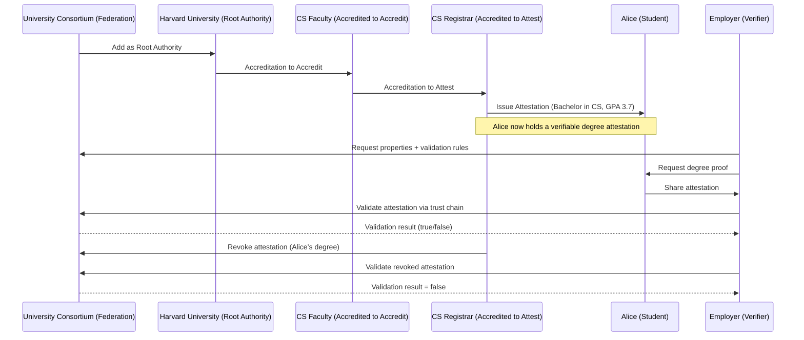

# IOTA Hierarchy Workshop

In this workshop, we will build a **University Degree Verification system** using **IOTA Hierarchies** and **Rust**. This workshop demonstrates a decentralized trust framework for a consortium of universities, where accreditations and attestations create a tamper-proof chain for issuing and verifying degrees.

## The Problem

Traditional degree verification is slow, costly, and prone to fraud. Universities issue paper or digital degrees that employers must verify through manual processes, often contacting institutions directly. This creates delays, administrative burdens, and risks of forged credentials. Centralized systems are vulnerable to tampering, and students lack control over their own credentials, relying on third parties for validation.

## The Opportunity

**IOTA Hierarchies** offers a decentralized solution for secure, instant degree verification. By using a trust chain (Consortium → University → Faculty → Registrar), universities can issue tamper-proof digital degrees. Employers can validate them directly on the IOTA network, reducing costs, eliminating fraud, and empowering students with portable, verifiable credentials.

## What You Will Build in This Workshop

You’ll create a full University Degree Verification system in Rust using IOTA Hierarchies. The system includes a consortium federation, trusted universities (e.g., Harvard), faculties, and registrars. You’ll issue digital degrees to students (e.g., Alice’s Bachelor in CS) and enable employers to validate them. You’ll also implement revocation, simulating real-world credential management, all anchored on the IOTA network.

## What You'll Learn
- Create a federation representing a university consortium.
- Define academic properties (e.g., degree type, field, GPA).
- Add root authorities (universities) to the federation.
- Delegate trust through accreditations (to accredit and to attest).
- Issue attestations as digital degrees.
- Validate attestations against the federation's trust chain.
- Revoke and reinstate degrees.

By the end, you'll have a complete system where universities delegate authority to faculties and registrars, issue verifiable degrees to students, and allow employers to validate them securely on the IOTA network.



## Business Context

Universities need a secure way to issue degrees that employers can verify without manual checks. With IOTA Hierarchies:

In this context of a Uinversity Degree Verification System:

- A **Federation** represents the consortium of universities.
- **Root Authorities** are trusted universities (e.g., Harvard, MIT).
- **Accreditations** delegate authority from universities to faculties and registrars.
- **Attestations** are the tamper-proof degrees issued to students.
- **Validation** allows employers to check authenticity via the trust chain.
- **Revocation** enables invalidating degrees if needed.

This creates a decentralized, efficient system reducing fraud and costs.

## Prerequisites

Before starting:

- Rust (v1.70+ recommended) and Cargo installed (Install Guide).
- A code editor like VS Code with Rust extensions (Install Guide).
- Basic knowledge of Rust and IOTA Identity concepts (DIDs, VCs, VPs).
- Set up a local IOTA network with Hierarchies contract deployed (Local Network Setup).
    - See [Local Network Setup](https://docs.iota.org/developer/iota-identity/getting-started/local-network-setup)
    - Ensure you can request test tokens from the faucet.
- Environment variables (set in the next section).

## Understanding the Core Concepts Before We Code

Before diving into the code, let’s solidify our understanding of the fundamental building blocks of IOTA Hierarchies. These concepts form the foundation for building decentralized trust systems such as our university degree verification project.

### 1. Federation

Think of a Federation as the umbrella organization that defines the rules of trust for a specific domain — in our case, the University Consortium.

**What it is**:

- A federation is a decentralized trust framework that groups together multiple trusted parties (e.g., universities) under common governance.
- It sets the properties (like "degree", "field", "GPA") that can be issued, and it anchors root authorities (universities) who are recognized as trusted issuers.

**How it works**:

- A federation is created on IOTA and published publicly.
- It is the highest-level authority that others can reference for validation.
- Once established, the federation manages who can join and what claims can be issued.

In our project:

- The "University Consortium" is the federation that brings together Harvard, MIT, and other universities.
- This federation defines what counts as a valid academic credential.

### 2. Root Authority

Root Authorities are the trusted institutions at the top level of a federation.

**What it is**:

- An entity that the federation explicitly trusts to delegate power or issue claims.
- Typically large institutions such as accredited universities, government ministries, or professional licensing boards.

**How it works**:

- The federation adds an authority as a root authority.
- Once added, that authority can either issue claims directly or delegate responsibility to others.

In our project:

- Harvard and MIT are added as root authorities of the "University Consortium".
- This means both universities are recognized as legitimate sources of academic credentials.

### 3. Accreditation

**Accreditation** is the process of delegating trust down the hierarchy.

**What it is**:

- A **cryptographic proof** that one authority grants certain powers to another.
- Two main types:
    - **Accreditation to accredit**: grants the right to further delegate authority.
    - **Accreditation to attest**: grants the right to issue actual claims (attestations).

**How it works**:

- A university (root authority) can accredit a faculty.
- That faculty can then accredit a registrar.
- Each step is cryptographically recorded so the entire chain can be verified.

In our project:

- Harvard accredits its CS Faculty (to accredit).
- The CS Faculty accredits its Registrar (to attest).

### 4. Attestation

An attestation is the actual claim or credential issued to an individual.

**What it is**:

- A statement that an authority makes about a subject, bound by the federation’s rules.
- Examples: “Alice holds a Bachelor in Computer Science with GPA 3.7”, “Bob completed a Master in Biology”.

**How it works**:

- **Attestations** are cryptographically signed by an accredited authority.
- They are anchored into the federation so anyone can verify them against the root trust chain.

In our project:

- The Harvard CS Registrar issues an attestation to Alice: degree=bachelor, field=cs, gpa=3.7.
- Another attestation is issued to Bob: degree=master, field=cs, gpa=3.9.

### 5. Validation

**Validation** is the process of checking whether an attestation is trustworthy.

What it is:

- A check that confirms:
    - The attestation exists and hasn’t been revoked.
    - The issuer was properly accredited.
    - The chain of accreditations leads back to a federation root authority.

**How it works**:

- A **verifier** (e.g., an employer) queries the federation for the properties and checks the trust chain.
- If everything aligns, the claim is considered valid.

In our project:

- An employer validates Alice’s Bachelor’s degree by confirming the trust chain:
Consortium → Harvard → CS Faculty → Registrar → Attestation for Alice.

### 6. Revocation

Finally, credentials need to be revoked if they become invalid.

What it is:

- The process of invalidating an attestation or accreditation.
- Ensures that outdated or fraudulent credentials are no longer trusted.

How it works:

- A registrar or authority can revoke attestations they’ve issued.
- The federation ensures revocation is discoverable during validation.

In our project:

- If Alice’s degree was mistakenly issued, Harvard’s Registrar can revoke it.
- Validation checks after revocation will fail.

With these core concepts — Federation, Root Authority, Accreditation, Attestation, Validation, and Revocation — we can now clearly understand the trust model behind IOTA Hierarchies.
In the next section, we’ll implement these concepts step by step in Rust.

## Project Setup and Initialization

Let’s set up the Rust project and initialize the environment for the IOTA Hierarchies workshop.

1. Create a New Rust Project:

    - Open a terminal and create a new binary project:
    ```bash
    cargo new iota-hierarchies-workshop --bin
    cd iota-hierarchies-workshop
    ```
    - This creates a project with `Cargo.toml` and `src/main.rs`.

2. Add Dependencies:
    - Open `Cargo.toml` and add the following:
    ```toml
    [package]
    name = "iota-hierarchies-workshop"
    version = "0.1.0"
    edition = "2021"

    [dependencies]
    anyhow = "1.0"
    async-trait = "0.1"
    bcs = "0.1"
    chrono = { version = "0.4", features = ["serde"] }
    iota-sdk = { git = "https://github.com/iotaledger/iota.git", tag = "v1.9.2", package = "iota-sdk" }
    iota_interaction = { git = "https://github.com/iotaledger/product-core.git", default-features = false, tag = "v0.8.4", package = "iota_interaction" }
    iota_interaction_rust = { git = "https://github.com/iotaledger/product-core.git", default-features = false, tag = "v0.8.4", package = "iota_interaction_rust" }
    iota_interaction_ts = { git = "https://github.com/iotaledger/product-core.git", default-features = false, tag = "v0.8.4", package = "iota_interaction_ts" }
    product_common = { git = "https://github.com/iotaledger/product-core.git", tag = "v0.8.4", default-features = false, package = "product_common" }
    secret-storage = { git = "https://github.com/iotaledger/secret-storage", tag = "v0.3.0", default-features = false }
    serde = { version = "1", features = ["derive"] }
    serde_json = "1"
    strum = { version = "0.27", default-features = false, features = ["std", "derive"] }
    thiserror = "2.0"
    tokio = { version = "1.46", default-features = false, features = ["sync"] }
    ```
    - These include `anyhow` (error handling), `tokio` (async runtime), `iota-sdk` (IOTA network), `hierarchies` (core framework), and `product-common` (test utilities).

3. Set Environment Variables:

    - Set the required variables for the IOTA network and Hierarchies contract:
        - Command Prompt:
    ```cmd
    export API_ENDPOINT="http://127.0.0.1:8545"
    export IOTA_HIERARCHIES_PKG_ID="<your_deployed_hierarchies_package_id>"
    ```
    - Note: Replace `your_deployed_hierarchies_package_id` with the package ID from your local IOTA network’s Hierarchies contract deployment (see Local Network Setup).
    - Verify variables:
        - PowerShell:

    ```PowerShell
    $env:API_ENDPOINT="http://127.0.0.1:8545"
    $env:IOTA_HIERARCHIES_PKG_ID="<your_deployed_hierarchies_package_id>"
    ```
    - Note: Replace `your_deployed_hierarchies_package_id` with the package ID from your local IOTA network’s Hierarchies contract deployment (see Local Network Setup).
    - Verify variables:
        - Command Prompt:
        ```bash
        echo %API_ENDPOINT%
        echo %IOTA_HIERARCHIES_PKG_ID%
        ```
        - PowerShell:

        ```PowerShell
        $env:API_ENDPOINT
        $env:IOTA_HIERARCHIES_PKG_ID
        ```

4. Test the Setup:
    - Run a build to ensure dependencies are downloaded:
    ```bash
    cargo build
    ```
    - If the build succeeds, your environment is ready.

## Code Scaffold

To keep the main workshop concise, the scaffold code (foundational setup for Cargo.toml and main.rs) is available on a separate page. Visit the Scaffold Code page to copy the setup code, then return here to implement the Hierarchies functionality step by step.

### Step 1: Set Up Utilities

Create a `src/utils.rs` file to handle client setup. This helper abstracts connecting to the IOTA network and funding test accounts.

```rust
// src/utils.rs

// Copyright 2020-2025 IOTA Stiftung
// SPDX-License-Identifier: Apache-2.0

use anyhow::Context;
use hierarchies::client::{HierarchiesClient, HierarchiesClientReadOnly};
use iota_sdk::{IOTA_LOCAL_NETWORK_URL, IotaClientBuilder};
use product_common::test_utils::{InMemSigner, request_funds};

/// Create a read-only Hierarchies client.
/// This is useful for querying hierarchies without sending transactions.
pub async fn get_read_only_client() -> anyhow::Result<HierarchiesClientReadOnly> {
    let api_endpoint = std::env::var("API_ENDPOINT")
        .unwrap_or_else(|_| IOTA_LOCAL_NETWORK_URL.to_string());

    let iota_client = IotaClientBuilder::default()
        .build(&api_endpoint)
        .await
        .map_err(|err| anyhow::anyhow!(format!("failed to connect to network; {}", err)))?;

    let package_id = std::env::var("IOTA_HIERARCHIES_PKG_ID")
        .map_err(|e| {
            anyhow::anyhow!(
                "env variable IOTA_HIERARCHIES_PKG_ID must be set in order to run the examples"
            )
            .context(e)
        })
        .and_then(|pkg_str| pkg_str.parse().context("invalid package id"))?;

    HierarchiesClientReadOnly::new_with_pkg_id(iota_client, package_id)
        .await
        .context("failed to create a read-only HierarchiesClient")
}

/// Create a funded Hierarchies client with an in-memory signer.
/// This client can send transactions and manage attestations.
pub async fn get_funded_client() -> Result<HierarchiesClient<InMemSigner>, anyhow::Error> {
    let signer = InMemSigner::new();
    let sender_address = signer.get_address().await?;

    // Request faucet funds for testing
    request_funds(&sender_address).await?;

    let read_only_client = get_read_only_client().await?;
    let hierarchies_client: HierarchiesClient<InMemSigner> =
        HierarchiesClient::new(read_only_client, signer).await?;

    Ok(hierarchies_client)
}
```
Explanation:

- **What it does**: Defines two functions to create Hierarchies clients. `get_read_only_client` creates a client for querying the network without transactions. `get_funded_client` creates a funded client with signing capabilities for creating federations and issuing attestations.
- **Why it matters**: These utilities handle boilerplate like network connection, package ID retrieval, and test funding, keeping the main code focused on Hierarchies logic.
- **Key concepts**:
    - **HierarchiesClientReadOnly**: For read-only operations like validation.
    - **HierarchiesClient**: For write operations like creating federations or accreditations.
    - **InMemSigner**: An in-memory signer for test purposes, with `request_funds` to get faucet tokens.
In `main.rs`, import it with `use crate::utils::{get_funded_client, get_read_only_client};`.

### Step 2: Create the University Consortium Federation

In `main.rs`, start by creating the federation.

```rust
use hierarchies::{federation::Federation};
use crate::utils::get_funded_client;

#[tokio::main]
async fn main() -> anyhow::Result<()> {
    // Create a funded Hierarchies client using our utils.rs helper
    let client = get_funded_client().await?;

    // Create the federation
    let consortium = Federation::create("University Consortium", &client).await?;
    println!("✅ Created federation: {}", consortium.name());

    Ok(())
}
```

Explanation:

- **What it does**: Uses the funded client to create a new federation named "University Consortium" and prints its name.
- **Why it matters**: The federation is the top-level trust anchor for the consortium, defining the rules for accreditations and attestations.
- **Key concepts**:
    - **Federation**: The root entity grouping trusted authorities (e.g., universities).

### Step 3: Define Academic Properties

Add properties that can be used in attestations (degrees).

```Rust
use hierarchies::property::{Property, PropertyType};

async fn define_properties(consortium: &Federation) -> anyhow::Result<()> {
    consortium.add_property(
        Property::new("degree", PropertyType::String, vec!["bachelor", "master", "phd"]).unwrap()
    ).await?;

    consortium.add_property(
        Property::new("field", PropertyType::String, vec!["cs", "math", "biology"]).unwrap()
    ).await?;

    consortium.add_property(
        Property::new("gpa", PropertyType::Number, vec![]).unwrap()
    ).await?;

    println!("✅ Properties defined: degree, field, gpa");
    Ok(())
}
```
Explanation:

- **What it does**: Adds three properties to the federation: "degree" (string with allowed values), "field" (string with allowed values), and "gpa" (number with no restrictions).
- **Why it matters**: Properties define the structure of attestations, ensuring consistency and enabling validation (e.g., only "bachelor" is valid for "degree").
- **Key concepts**:
    - **Property**: A defined field with a type (String, Number) and optional allowed values for enforcement.

Call this function in `main` after creating the consortium: `define_properties(&consortium).await?;`.

### Step 4: Add Universities as Root Authorities

Add trusted universities to the federation.

```rust
use hierarchies::authority::Authority;

async fn add_universities(consortium: &Federation) -> anyhow::Result<()> {
    let harvard = Authority::create("Harvard University").await?;
    let mit = Authority::create("MIT").await?;

    consortium.add_root_authority(&harvard).await?;
    consortium.add_root_authority(&mit).await?;

    println!("✅ Added root authorities: Harvard, MIT");
    Ok(())
}
```
Explanation:

- **What it does**: Creates authorities for Harvard and MIT, then adds them as root authorities to the consortium.
- **Why it matters**: Root authorities are the starting point of trust; they can delegate accreditations to faculties.
- **Key concepts**:
    - **Authority**: An entity (e.g., university) that can be accredited or issue attestations.
Call this in `main: add_universities(&consortium).await?;`.

### Step 5: Delegate to Faculties

Delegate accreditation rights from universities to faculties.

```rust
use hierarchies::accreditation::Accreditation;

async fn delegate_to_faculty(harvard: &Authority) -> anyhow::Result<Authority> {
    let cs_faculty = Authority::create("Harvard CS Faculty").await?;
    Accreditation::create_to_accredit(harvard, &cs_faculty).await?;
    println!("✅ Harvard accredited CS Faculty");
    Ok(cs_faculty)
}
```

Explanation:

- **What it does**: Creates a faculty authority and accredits it "to accredit" from Harvard, allowing the faculty to further delegate.
- **Why it matters**: This builds the trust hierarchy: University → Faculty.
- **Key concepts**:
    - **Accreditation to Accredit**: Grants delegation rights.
Call this in `main: let cs_faculty = delegate_to_faculty(&harvard).await?;`.

### Step 6: Grant Registrar Attestation Rights

Faculties grant attestation rights to registrars.

```rust
async fn empower_registrar(cs_faculty: &Authority) -> anyhow::Result<Authority> {
    let registrar = Authority::create("Harvard CS Registrar").await?;
    Accreditation::create_to_attest(cs_faculty, &registrar).await?;
    println!("✅ CS Faculty empowered Registrar to issue degrees");
    Ok(registrar)
}
```

Explanation:

- **What it does**: Creates a registrar authority and accredits it "to attest" from the faculty, allowing it to issue degrees.
- **Why it matters**: Completes the hierarchy: Faculty → Registrar.
- **Key concepts**:
    - **Accreditation to Attest**: Grants rights to issue attestations (degrees).
Call this in `main: let registrar = empower_registrar(&cs_faculty).await?;`.

### Step 7: Issue Degrees (Create Attestations)

Registrars issue degrees as attestations.

```rust
use hierarchies::attestation::Attestation;

async fn issue_degrees(registrar: &Authority) -> anyhow::Result<()> {
    Attestation::create(registrar, "Alice", vec![
        ("degree", "bachelor"),
        ("field", "cs"),
        ("gpa", "3.7"),
    ]).await?;

    Attestation::create(registrar, "Bob", vec![
        ("degree", "master"),
        ("field", "cs"),
        ("gpa", "3.9"),
    ]).await?;

    println!("✅ Issued degrees for Alice (Bachelor CS) and Bob (Master CS)");
    Ok(())
}
```

Explanation:

- **What it does**: Creates attestations for Alice and Bob with property values (degree, field, GPA).
- **Why it matters**: Attestations are the verifiable degrees issued to students.
- **Key concepts**:
    - **Attestation**: A signed claim (degree) bound to the federation's properties.

Call this in main: issue_degrees(&registrar).await?;.

### Step 8: Validate Credentials

Validate a student's degree.

```rust
use hierarchies::validation::validate_properties;

async fn validate_example(consortium: &Federation) -> anyhow::Result<()> {
    let valid = validate_properties(
        consortium,
        "Alice",
        vec![("degree", "bachelor"), ("field", "cs")]
    ).await?;

    println!("✅ Validation result for Alice: {}", valid);

    Ok(())
}
```

Explanation:

- **What it does**: Validates if Alice has a bachelor in CS by checking the trust chain and properties.
- **Why it matters**: Allows employers to verify degrees against the consortium's rules.
- **Key concepts**:
    - **Validation**: Checks attestation existence, non-revocation, and trust chain.

Call this in main: validate_example(&consortium).await?;.

### Step 9: Revoke a Degree

Revoke an attestation.

```rust
use hierarchies::revocation::revoke_attestation;

async fn revoke_degree(registrar: &Authority) -> anyhow::Result<()> {
    revoke_attestation(registrar, "Alice").await?;
    println!("⚠️ Revoked Alice’s degree");

    Ok(())
}
```

Explanation:

- **What it does**: Revokes Alice's attestation, making it invalid.
- **Why it matters**: Handles errors or changes (e.g., degree revocation).
- **Key concepts**:
    - **Revocation**: Invalidates an attestation, discoverable during validation.

Call this in main: revoke_degree(&registrar).await?;. Then re-run validation to see it fail.

## Running the Workshop

Compile and run:

```bash
cargo run
```

Expected output:

- Federation created.
- Properties defined.
- Authorities added.
- Accreditations delegated.
- Attestations issued.
- Validation succeeds.
- Attestation revoked.
- Validation fails.

## Next Steps

- Explore revocation reinstatement.
- Integrate with a frontend for UI-based verification.