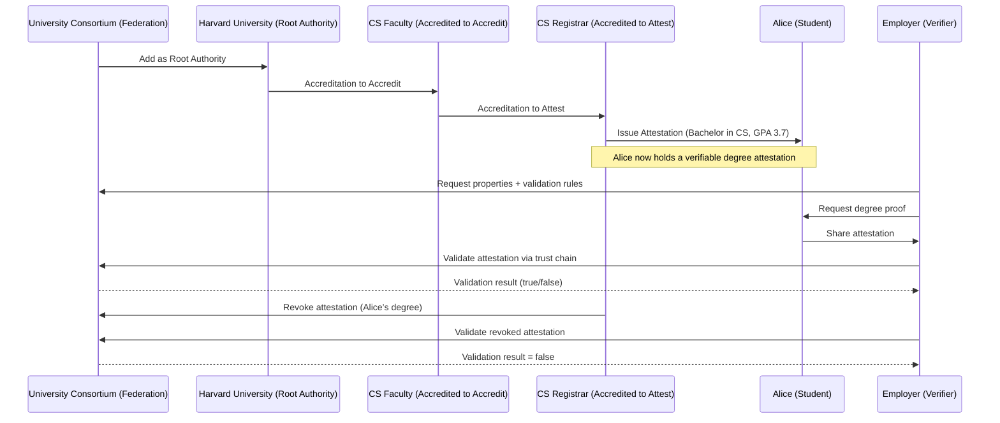

# IOTA Hierarchies Guided Codelab: University Degree Verification

**Description**: In this hands-on codelab, you'll build a **University Degree Verification system** using **IOTA Hierarchies** and **Rust**. This tutorial demonstrates a decentralized trust framework for a consortium of universities, where accreditations and attestations create a tamper-proof chain for issuing and verifying degrees.

**Tags**: tutorial, Rust, IOTA Hierarchies, decentralized trust, verifiable credentials

**Duration**: 60-90 minutes

## The Problem

Traditional degree verification is slow, costly, and prone to fraud. Universities issue paper or digital degrees that employers must verify through manual processes, often contacting institutions directly. This creates delays, administrative burdens, and risks of forged credentials. Centralized systems are vulnerable to tampering, and students lack control over their own credentials, relying on third parties for validation.

## The Opportunity

IOTA Hierarchies offers a decentralized solution for secure, instant degree verification. By using a trust chain (Consortium → University → Faculty → Registrar), universities can issue tamper-proof digital degrees. Employers can validate them directly on the IOTA network, reducing costs, eliminating fraud, and empowering students with portable, verifiable credentials.

## What You Will Build in This Workshop

You’ll create a full University Degree Verification system in Rust using IOTA Hierarchies. The system includes a consortium federation, trusted universities (e.g., Harvard), faculties, and registrars. You’ll issue digital degrees to students (e.g., Alice’s Bachelor in CS) and enable employers to validate them. You’ll also implement revocation, simulating real-world credential management, all anchored on the IOTA network.

## What You'll Learn
- Create a federation representing a university consortium.
- Define academic properties (e.g., degree type, field, GPA).
- Add root authorities (universities) to the federation.
- Delegate trust through accreditations (to accredit and to attest).
- Issue attestations as digital degrees.
- Validate attestations against the federation's trust chain.
- Revoke and reinstate degrees.

By the end, you'll have a complete system where universities delegate authority to faculties and registrars, issue verifiable degrees to students, and allow employers to validate them securely on the IOTA network.

## Business Context

Universities need a secure way to issue degrees that employers can verify without manual checks. With IOTA Hierarchies:

- A Federation represents the consortium of universities.
- Root Authorities are trusted universities (e.g., Harvard, MIT).
- Accreditations delegate authority from universities to faculties and registrars.
- Attestations are the tamper-proof degrees issued to students.
- Validation allows employers to check authenticity via the trust chain.
- Revocation enables invalidating degrees if needed.

This creates a decentralized, efficient system reducing fraud and costs.

## Prerequisites

Before starting:

- Rust (v1.70+ recommended) and Cargo installed (Install Guide).
- A code editor like VS Code with Rust extensions (Install Guide).
- Basic knowledge of Rust and IOTA Identity concepts (DIDs, VCs, VPs).
- Set up a local IOTA network with Hierarchies contract deployed (Local Network Setup).
    - Ensure you can request test tokens from the faucet.
- Environment variables (set in the next section).