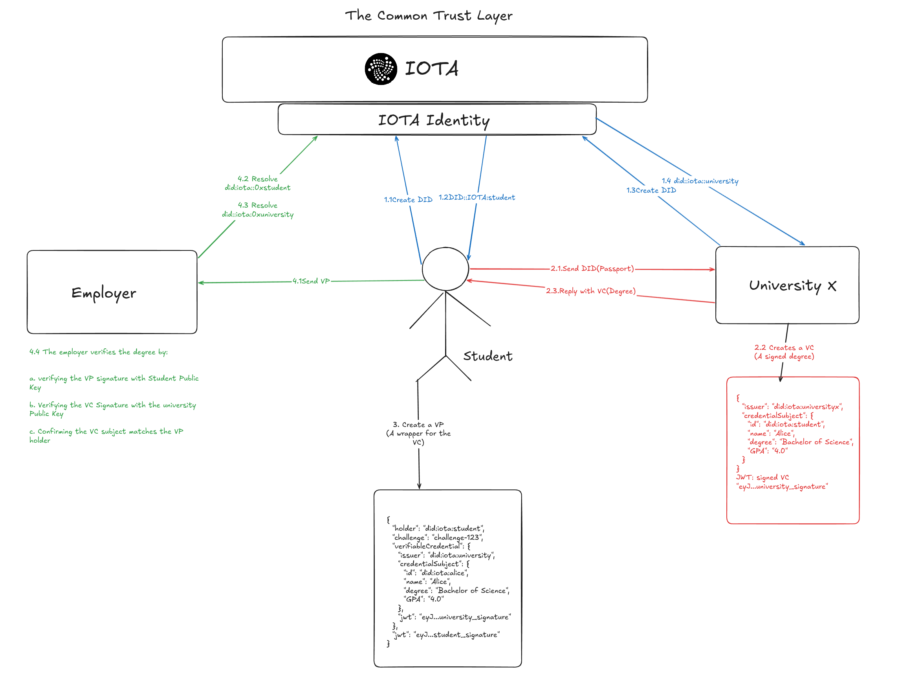
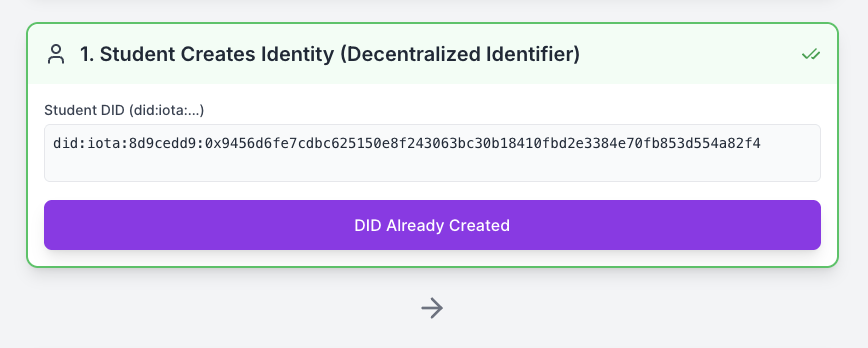
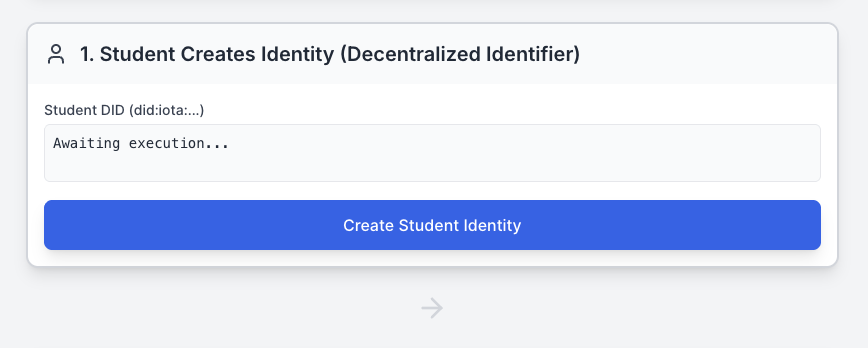
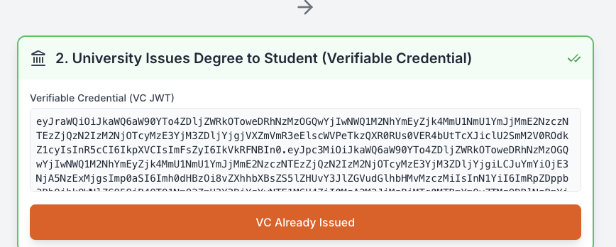
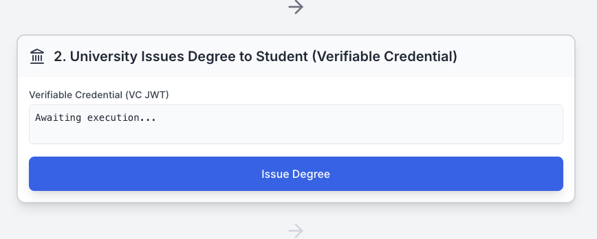
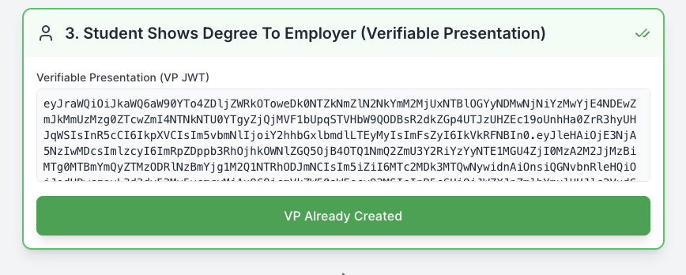
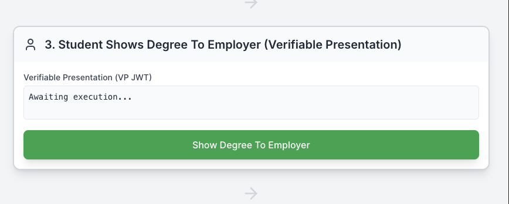
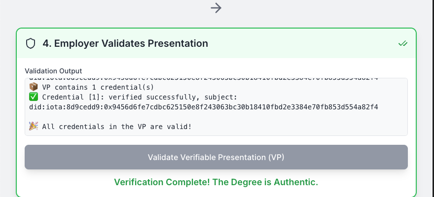
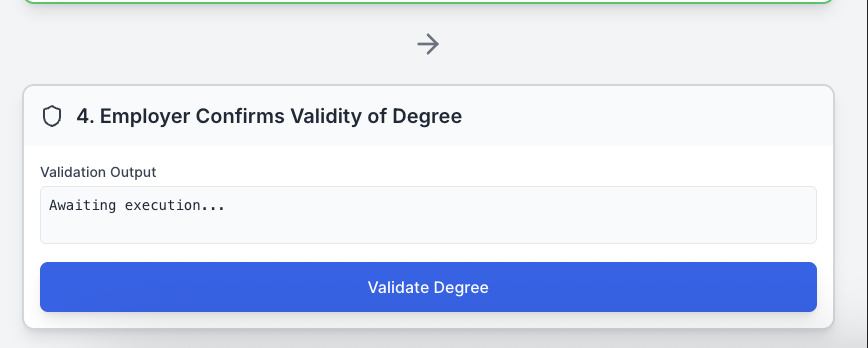

# IOTA Identity Workshop

IOTA Identity is part of the IOTA trust framework — a unifying layer that enables people, organizations, and things to establish verifiable digital identities without relying on central authorities. Built on the IOTA ledger, it implements the W3C standards for Decentralized Identifiers (DIDs) and Verifiable Credentials (VCs), enabling tamper-proof, privacy-respecting identity interactions across any domain.

:::info What is a DID?
A **Decentralized Identifier (DID)** is like a digital passport — except no government or company issues it. You create it yourself, you control it, and it lives on the IOTA network. It proves *who you are* without asking anyone for permission.
:::

:::info What is a VC?
A **Verifiable Credential (VC)** is like a diploma or a stamp of approval — a signed statement from a trusted party (e.g. a university) saying something is true about you. Because it's cryptographically signed, anyone can verify it instantly without calling the issuer.
:::

In this workshop, you'll apply that framework to a concrete real-world scenario: **University Degree Verification**. You'll build a full-stack application — a Rust backend and a React frontend — that walks through the four core identity steps: creating a DID, issuing a VC, presenting it as a VP, and verifying it on the IOTA network.


## The Problem

Today, verifying a university degree means calling the university, paying a third-party verification service, or hoping the employer trusts a PDF. The process is:

- **Slow** — manual back-and-forth between employers, students, and institutions
- **Costly** — centralized verification services charge per check
- **Fraud-prone** — fake or altered certificates circulate freely because there is no cryptographic proof of authenticity
- **Privacy-invasive** — students hand over full transcripts when an employer only needs to confirm graduation

At the root of the problem is a lack of digital trust. Credentials today are either paper-based or locked inside institutional databases that third parties must query. The student has no ownership or control over their own degree data.

### What You'll Build in this Workshop

You will implement a University Degree Verification system using the IOTA Identity library, where IOTA acts as the common trust layer between the student, university, and employer. The workshop walks through four steps:

1. **Both the student and university create a DID** — Each party publishes a Decentralized Identifier to the IOTA network, establishing their digital identity. The student sends their DID to the university as proof of who they are.

2. **University issues a VC** — The university issues a signed Verifiable Credential (the degree) referencing the student's DID and sends it back to the student.

3. **Student creates a VP** — The student wraps the received VC in a Verifiable Presentation, signs it with their own private key, and sends it to the employer.

4. **Employer verifies** — The employer resolves both DIDs from the IOTA network, verifies the VP signature with the student's public key, verifies the VC signature with the university's public key, and confirms the VC subject matches the VP holder.



## Prerequisites

Before starting this workshop, make sure you have:

- **Rust** (latest stable version) and **Cargo** installed
- A **local IOTA network** running with the IOTA Identity contract deployed
    - See [Local Network Setup](https://docs.iota.org/developer/iota-identity/getting-started/local-network-setup)
    - Ensure you can request test tokens from the faucet
- (Optional but recommended) Basic familiarity with:
    - **IOTA Decentralized Identifiers (DIDs)**
    - **IOTA Verifiable Credentials (VCs)** and **IOTA Verifiable Presentations (VPs)**

:::info
All code is in the [iota-community/workshops](https://github.com/iota-community/workshops/tree/main/workshop-module-10) repository — you can clone it and run the finished project directly, or use the scaffold files below to follow along:
- [`backend-scaffold.rs`](https://github.com/iota-community/workshops/blob/main/workshop-module-10/backend-scaffold.rs) — Rust project setup, imports, data structures, and Axum server boilerplate
- [`frontend-scaffold.jsx`](https://github.com/iota-community/workshops/blob/main/workshop-module-10/frontend-scaffold.jsx) — React app with UI, state, and the `handleApiCall` utility
:::

:::warning
In a real-world deployment, each party would run independently — the student would create their DID and sign their VP client-side using `@iota/identity-wasm`, keeping their private keys in the browser. For simplicity, this workshop runs all three roles (Student, University, Employer) on a single Rust backend.
:::

## Part 1: Backend

The Rust Axum backend handles all IOTA Identity logic, exposed as four HTTP endpoints — one per step.

### Step 1: Student and University Create DIDs

Both the student and the university must establish their identity on the IOTA network before any credential exchange can happen. Each gets a DID anchored on-chain, with their private key stored securely in Stronghold.

Both endpoints rely on a shared helper, `create_or_load_did`, which creates a new DID and publishes it to the network on first run, or loads the existing one from disk on subsequent runs:

```rust
async fn create_or_load_did(
    doc_path: &str,
    fragment_path: &str,
    stronghold_path: &str,
) -> anyhow::Result<(IotaDocument, String)> {
    if Path::new(doc_path).exists() {
        // Load existing DID from disk
        let doc_json = fs::read_to_string(doc_path)?;
        let fragment = fs::read_to_string(fragment_path)?;
        let doc = IotaDocument::from_json(&doc_json)?;
        return Ok((doc, fragment));
    }

    // Create a new DID and publish it to the IOTA network
    let storage = get_stronghold_storage(Some(PathBuf::from(stronghold_path)))?;
    let client = get_funded_client().await?;
    let (document, fragment) = client.create_did(&storage).await?;

    fs::write(doc_path, document.to_json()?)?;
    fs::write(fragment_path, &fragment)?;

    Ok((document, fragment))
}
```

#### Student (`/holder/create-did`)

```rust
// iota-identity-backend/src/main.rs (holder_create_did)

/// Creates or loads the student's DID and anchors it to the IOTA network.
///
/// # Input
/// - `body`: `PackageId` — the IOTA Identity package ID (from env/config)
///
/// # Output
/// - `200 OK`: `DidResponse { did: String }` — the student's DID (e.g. `did:iota:...`)
/// - `500 Internal Server Error`: if DID creation or network interaction fails
async fn holder_create_did(Json(_body): Json<PackageId>) -> Result<Json<DidResponse>, StatusCode> {
    let holder_doc_file = "./holder_doc.json";
    let holder_fragment_file = "./holder_fragment.txt";
    let stronghold_path = "./holder.stronghold";

    let (holder_doc, _) = create_or_load_did(
        holder_doc_file,
        holder_fragment_file,
        stronghold_path
    ).await.map_err(|e| {
        eprintln!("Error creating holder DID: {:?}", e);
        StatusCode::INTERNAL_SERVER_ERROR
    })?;

    Ok(Json(DidResponse {
        did: holder_doc.id().to_string(),
    }))
}
```

#### University (`/issuer/create-did`)

```rust
// iota-identity-backend/src/main.rs (issuer_create_did)

/// Creates or loads the university's DID and anchors it to the IOTA network.
///
/// # Input
/// - `body`: `PackageId` — the IOTA Identity package ID (from env/config)
///
/// # Output
/// - `200 OK`: `DidResponse { did: String }` — the university's DID (e.g. `did:iota:...`)
/// - `500 Internal Server Error`: if DID creation or network interaction fails
async fn issuer_create_did(Json(_body): Json<PackageId>) -> Result<Json<DidResponse>, StatusCode> {
    let issuer_doc_file = "./issuer_doc.json";
    let issuer_fragment_file = "./issuer_fragment.txt";
    let stronghold_path = "./issuer.stronghold";

    let (issuer_doc, _) = create_or_load_did(
        issuer_doc_file,
        issuer_fragment_file,
        stronghold_path
    ).await.map_err(|e| {
        eprintln!("Error creating issuer DID: {:?}", e);
        StatusCode::INTERNAL_SERVER_ERROR
    })?;

    Ok(Json(DidResponse {
        did: issuer_doc.id().to_string(),
    }))
}
```

Both endpoints follow the same pattern — `create_or_load_did` creates the DID and anchors it to the IOTA network on first run, or loads it from disk on subsequent runs. Each actor stores their own private key in a separate Stronghold file (`holder.stronghold` / `issuer.stronghold`).

### Checkpoint

- Verify that `holder_doc.json` and `issuer_doc.json` are created on disk.
- Confirm both returned DIDs are valid `did:iota:...` strings.

Output after a successful creation of the student's DID:



#### Frontend



```javascript
// src/App.jsx
// handleApiCall is a shared HTTP utility used by all steps — see App.jsx in the scaffold repo:
// https://github.com/iota-community/workshops/blob/main/workshop-module-10/frontend-scaffold.jsx

const handleCreateDid = async () => {
    const data = await handleApiCall(1, '/holder/create-did', {});
    if (data && data.did) {
        setDid(data.did);
    }
};

const handleCreateIssuerDid = async () => {
    const data = await handleApiCall(1, '/issuer/create-did', {});
    if (data && data.did) {
        setIssuerDid(data.did);
    }
};
```

### Step 2: University Issues VC (`/issuer/issue-vc`)

The `issuer_issue_vc` function handles the `/issuer/issue-vc` endpoint. With both DIDs already created in Step 1, the university loads them, builds a `UniversityDegreeCredential`, signs it, and returns the signed JWT to the student.

```rust
/// Loads the university's DID and the student's DID, builds a `UniversityDegreeCredential`,
/// signs it with the university's private key, and returns it as a JWT.
///
/// # Input
/// - `body`: `PackageId` — the IOTA Identity package ID (from env/config)
/// - Reads `holder_doc.json` from disk — must exist from Step 1
///
/// # Output
/// - `200 OK`: `JwtResponse { jwt: String }` — the signed VC as a JWT (`eyJ...`)
/// - `404 Not Found`: if `holder_doc.json` is missing (Step 1 not completed)
/// - `500 Internal Server Error`: if signing or DID loading fails
async fn issuer_issue_vc(Json(_body): Json<PackageId>) -> Result<Json<JwtResponse>, StatusCode> {
    let issuer_doc_file = "./issuer_doc.json";
    let issuer_fragment_file = "./issuer_fragment.txt";
    let issuer_stronghold_path = "./issuer.stronghold";

    // 1. Create/Load Issuer DID
    let (issuer_doc, issuer_fragment) = create_or_load_did(
        issuer_doc_file,
        issuer_fragment_file,
        issuer_stronghold_path,
    ).await.map_err(|e| {
        eprintln!("Error creating issuer DID: {:?}", e);
        StatusCode::INTERNAL_SERVER_ERROR
    })?;

    // 2. Load Student DID (must exist from Step 1)
    let holder_doc_json = fs::read_to_string("./holder_doc.json").map_err(|_| StatusCode::NOT_FOUND)?;
    let holder_doc = IotaDocument::from_json(&holder_doc_json).map_err(|_| StatusCode::INTERNAL_SERVER_ERROR)?;

    // 3. Build Verifiable Credential
    let subject = Subject::from_json_value(serde_json::json!({
        "id": holder_doc.id().as_str(),
        "name": "Alice",
        "degree": { "type": "BachelorDegree", "name": "Bachelor of Science and Arts" },
        "GPA": "4.0"
    })).map_err(|_| StatusCode::INTERNAL_SERVER_ERROR)?;

    let credential: Credential<Object> = CredentialBuilder::default()
        .id(Url::parse("https://example.edu/credentials/3732").map_err(|_| StatusCode::INTERNAL_SERVER_ERROR)?)
        .issuer(Url::parse(issuer_doc.id().as_str()).map_err(|_| StatusCode::INTERNAL_SERVER_ERROR)?)
        .type_("UniversityDegreeCredential")
        .subject(subject)
        .build().map_err(|_| StatusCode::INTERNAL_SERVER_ERROR)?;

    // 4. Sign Verifiable Credential
    let issuer_storage = get_stronghold_storage(Some(PathBuf::from(issuer_stronghold_path))).map_err(|_| StatusCode::INTERNAL_SERVER_ERROR)?;
    let credential_jwt = issuer_doc
        .create_credential_jwt(
            &credential,
            &issuer_storage,
            &issuer_fragment,
            &JwsSignatureOptions::default(),
            None,
        )
        .await
        .map_err(|e| {
            eprintln!("Error signing VC: {:?}", e);
            StatusCode::INTERNAL_SERVER_ERROR
        })?;

    // Return VC JWT string
    Ok(Json(JwtResponse {
        jwt: credential_jwt.as_str().to_string(),
    }))
}
```

### Checkpoint

- Verify that `issuer_doc.json`, `issuer_fragment.txt`, and `issuer.stronghold` are created.
- Confirm the VC JWT is a long string starting with `eyJ...`.
- Use an online JWT decoder to inspect the credential contents (e.g., Alice's name, degree).

Output after a successful creation of the student's Verifiable Credential:



#### Frontend



```javascript
// src/App.jsx
// handleApiCall is a shared HTTP utility used by all steps — see App.jsx in the scaffold repo:
// https://github.com/iota-community/workshops/blob/main/workshop-module-10/frontend-scaffold.jsx

const handleIssueVc = async () => {
    const data = await handleApiCall(2, '/issuer/issue-vc', {});
    if (data && data.jwt) {
        setVcJwt(data.jwt);
    }
};
```

### Step 3: Student Creates VP (`/holder/create-vp`)

The `holder_create_vp` function handles the `/holder/create-vp` endpoint. The Student loads their DID, wraps the received VC JWT in a Verifiable Presentation, signs it with a challenge nonce and expiration, and returns the signed VP JWT.

```rust
// iota-identity-backend/src/main.rs (holder_create_vp)

/// Wraps the received VC JWT in a Verifiable Presentation, signs it with the student's
/// private key, and returns the signed VP as a JWT.
///
/// # Input
/// - `body`: `VcJwt { vc_jwt: String }` — the VC JWT received from Step 2
///
/// # Output
/// - `200 OK`: `JwtResponse { jwt: String }` — the signed VP as a JWT (`eyJ...`)
/// - `404 Not Found`: if the student's DID cannot be loaded from disk
/// - `500 Internal Server Error`: if VP construction or signing fails
async fn holder_create_vp(Json(body): Json<VcJwt>) -> Result<Json<JwtResponse>, StatusCode> {
    let stronghold_path = "./holder.stronghold";
    let holder_doc_file = "./holder_doc.json";
    let holder_fragment_file = "./holder_fragment.txt";

    // 1. Load Holder DID
    let (holder_doc, holder_fragment) = create_or_load_did(
        holder_doc_file,
        holder_fragment_file,
        stronghold_path,
    ).await.map_err(|_| StatusCode::NOT_FOUND)?;

    let holder_storage = get_stronghold_storage(Some(PathBuf::from(stronghold_path))).map_err(|_| StatusCode::INTERNAL_SERVER_ERROR)?;

    let challenge = "challenge-123";
    let expires = Timestamp::now_utc().checked_add(Duration::minutes(10)).unwrap();

    // 2. Build VP
    let presentation: Presentation<Jwt> = PresentationBuilder::new(
        holder_doc.id().to_url().into(),
        Default::default())
        .credential(Jwt::new(body.vc_jwt))
        .build().map_err(|e| {
            eprintln!("Error building presentation: {:?}", e);
            StatusCode::INTERNAL_SERVER_ERROR
        })?;

    // 3. Sign VP
    let vp_jwt: Jwt = holder_doc
        .create_presentation_jwt(
            &presentation,
            &holder_storage,
            &holder_fragment,
            &JwsSignatureOptions::default().nonce(challenge.to_owned()),
            &JwtPresentationOptions::default().expiration_date(expires),
        )
        .await
        .map_err(|e| {
            eprintln!("Error signing VP: {:?}", e);
            StatusCode::INTERNAL_SERVER_ERROR
        })?;

    // Return VP JWT string
    Ok(Json(JwtResponse {
        jwt: vp_jwt.as_str().to_string(),
    }))
}
```

Output after a successful creation of the student's Verifiable Presentation:



#### Frontend



```javascript
// src/App.jsx
// handleApiCall is a shared HTTP utility used by all steps — see App.jsx in the scaffold repo:
// https://github.com/iota-community/workshops/blob/main/workshop-module-10/frontend-scaffold.jsx

const handleCreateVp = async () => {
    const data = await handleApiCall(3, '/holder/create-vp', { vcJwt });
    if (data && data.jwt) {
        setVpJwt(data.jwt);
    }
};
```

### Step 4: Employer Validates (`/verifier/validate`)

The `verifier_validate` function handles the `/verifier/validate` endpoint. This is the most network-intensive step — the Employer resolves both DIDs from the IOTA network, verifies the VP signature and challenge, then validates each embedded VC against the University's public key.

```rust
/// Resolves both the student's and university's DIDs from the IOTA network, verifies the VP
/// signature and challenge nonce, then validates each embedded VC against the university's public key.
///
/// # Input
/// - `body`: `VpJwt { vp_jwt: String }` — the VP JWT received from Step 3
///
/// # Output
/// - `200 OK`: `ValidationResponse { success: bool, output: String }` — validation result with a
///   step-by-step log; `success: false` if any check fails (invalid signature, wrong subject, etc.)
/// - `400 Bad Request`: if the VP JWT is malformed or the VP signature is invalid
/// - `500 Internal Server Error`: if DID resolution or network access fails
async fn verifier_validate(Json(body): Json<VpJwt>) -> Result<Json<ValidationResponse>, StatusCode> {
    let vp_jwt = Jwt::new(body.vp_jwt);
    let challenge = "challenge-123";
    let mut output = String::new();

    // 1. Setup a read-only IOTA client and resolver to fetch DID documents from the network
    let verifier_client = get_read_only_client().await.map_err(|_| StatusCode::INTERNAL_SERVER_ERROR)?;
    let mut resolver: Resolver<IotaDocument> = Resolver::new();
    resolver.attach_iota_handler(verifier_client);

    let presentation_verifier_options = JwsVerificationOptions::default().nonce(challenge.to_owned());
    output.push_str(&format!("Using challenge: {}\n", challenge));

    // 2. Extract the student's DID from the VP JWT, then resolve it from the IOTA network
    //    to get their public key for VP signature verification
    let holder_did: CoreDID = JwtPresentationValidatorUtils::extract_holder(&vp_jwt)
        .map_err(|_| StatusCode::BAD_REQUEST)?;
    output.push_str(&format!("Extracted holder DID from VP: {}\n", holder_did));

    let holder_doc: IotaDocument = resolver.resolve(&holder_did).await.map_err(|e| {
        output.push_str(&format!("Failed to resolve holder DID: {:?}\n", e));
        StatusCode::INTERNAL_SERVER_ERROR
    })?;
    output.push_str(&format!("Resolved student DID from network: {}\n", holder_doc.id()));

    // 3. Verify the VP signature against the student's public key and check the challenge nonce
    let vp_validation_options = JwtPresentationValidationOptions::default()
        .presentation_verifier_options(presentation_verifier_options);

    let decoded_vp: DecodedJwtPresentation<Jwt> = JwtPresentationValidator::with_signature_verifier(EdDSAJwsVerifier::default())
        .validate(&vp_jwt, &holder_doc, &vp_validation_options)
        .map_err(|e| {
            output.push_str(&format!("VP Validation Failed: {:?}\n", e));
            StatusCode::BAD_REQUEST
        })?;

    output.push_str("VP JWT verified successfully\n");
    output.push_str(&format!("VP Holder matches Subject: {}\n", decoded_vp.presentation.holder));

    // 4. Extract embedded VCs, resolve the university's DID, verify each VC's signature,
    //    and confirm the VC subject matches the VP holder
    let jwt_credentials: &Vec<Jwt> = &decoded_vp.presentation.verifiable_credential;
    output.push_str(&format!("VP contains {} credential(s)\n", jwt_credentials.len()));

    let issuers: Vec<CoreDID> = jwt_credentials
        .iter()
        .map(|jwt| identity_iota::credential::JwtCredentialValidatorUtils::extract_issuer_from_jwt(jwt))
        .collect::<Result<Vec<CoreDID>, _>>()
        .map_err(|_| StatusCode::INTERNAL_SERVER_ERROR)?;

    let issuers_documents: HashMap<CoreDID, IotaDocument> = resolver.resolve_multiple(&issuers).await
        .map_err(|_| StatusCode::INTERNAL_SERVER_ERROR)?;

    let credential_validator = JwtCredentialValidator::with_signature_verifier(EdDSAJwsVerifier::default());
    let credential_validation_options = JwtCredentialValidationOptions::default()
        .subject_holder_relationship(holder_did.to_url().into(), SubjectHolderRelationship::AlwaysSubject);

    for (index, jwt_vc) in jwt_credentials.iter().enumerate() {
        let issuer_doc = &issuers_documents[&issuers[index]];
        let result: Result<DecodedJwtCredential<Object>, _> = credential_validator
            .validate(jwt_vc, issuer_doc, &credential_validation_options, FailFast::FirstError);

        match result {
            Ok(decoded_credential) => {
                let subject_id = decoded_credential
                    .credential
                    .credential_subject
                    .first()
                    .and_then(|subj| subj.id.as_ref())
                    .map(|id| id.as_str())
                    .unwrap_or("unknown");

                output.push_str(&format!(
                    "Credential [{}]: verified successfully, subject: {}\n",
                    index + 1,
                    subject_id
                ));
            },
            Err(e) => {
                output.push_str(&format!("Credential [{}] Validation Failed: {:?}\n", index + 1, e));
                return Ok(Json(ValidationResponse { success: false, output }));
            }
        }
    }

    // 5. All checks passed — return success
    output.push_str("\nAll credentials in the VP are valid!");
    Ok(Json(ValidationResponse { success: true, output }))
}
```

Output after a successful validation:



#### Frontend



```javascript
// src/App.jsx
// handleApiCall is a shared HTTP utility used by all steps — see App.jsx in the scaffold repo:
// https://github.com/iota-community/workshops/blob/main/workshop-module-10/frontend-scaffold.jsx

const handleValidateVp = async () => {
    const data = await handleApiCall(4, '/verifier/validate', { vpJwt });
    if (data) {
        setValidationOutput(data.output);
        setIsValidationSuccess(data.success);
    }
};
```

## Summary

You built a university degree verification system where a student and university each established a digital identity on IOTA, the university issued a cryptographically signed credential, the student presented it to an employer, and the employer verified everything — resolving both identities from the network, checking every signature — without calling anyone or trusting a PDF.

That's the full identity flow from the diagram above, running end-to-end. The same pattern applies to passports, medical records, product certifications, and any trust relationship where a credential needs to move between parties who don't already know each other.

## Extension Task

This workshop runs all three roles on a single backend for simplicity — but in a real system, the student should be in full control of their own identity. The private key should never leave their device.

Your task is to address the warning at the top of this workshop: move the student's operations (DID creation and VP signing) into the React frontend using [`@iota/identity-wasm`](https://www.npmjs.com/package/@iota/identity-wasm).

Concretely:
- The student creates their DID directly in the browser using `@iota/identity-wasm/web`, with their private key stored client-side
- The student sends their DID to the backend so the university can issue the VC
- When showing the degree, the student signs the VP in the browser with their own key and sends the signed VP JWT to the employer

The [`Getting Started with Wasm`](../iota-identity/getting-started/wasm.mdx) guide is a good starting point.
