# Minting Managing Tokens

In this tutorial, we build the WKT dApp — a decentralized Workshop Token and Badge system — using the Move language for blockchain contracts and the [IOTA dApp kit](../../../developer/ts-sdk/dapp-kit/) for the frontend. The project starts with creating and deploying the [Move package](../../getting-started/create-a-package.mdx) on the IOTA Network. After the backend contract is live, the frontend dApp is developed to enable wallet connection, daily token claims, coupon redemptions, peer payments with auto-badge minting, badge redemption, and admin controls. This tutorial demonstrates seamless integration between Move smart contracts and IOTA’s frontend tools. Once the backend contract is operational, we will develop the [frontend dApp](./frontend.mdx). 


## Sequence Diagram

This sequence diagram illustrates the flow of interactions within the WKT (Workshop Token) decentralized application involving the Admin, User, Blockchain, and the token_contract::wkt Move smart contract. The process begins with the Admin deploying the contract to the IOTA Network, which initializes the WKT token, metadata, and shared Faucet object for token distribution. Users can claim daily tokens, with the contract ensuring claims are limited to once per day, and claim tokens using unique coupons managed by the Admin through a coupon registry.

Users can make peer-to-peer payments with WKT tokens, where the contract validates balances and transfers coins to recipients. If configured, the contract automatically mints a WorkshopBadge NFT for the user on their first payment. Badge redemption allows users to burn their WorkshopBadge NFTs to receive 30 WKT tokens, with ownership and one-time redemption enforced by the contract.

The Admin manages coupon codes, configures auto-badge settings, and manually mints badges to recipients. Administrative controls also include transferring admin rights securely. Throughout these interactions, the contract emits events to signal token claims, payments, badge minting, and redemptions, ensuring transparency and synchronization with the front end. This diagram demonstrates how the system maintains secure token flows, proper validations, and flexible administrative oversight on the blockchain.

```mermaid
sequenceDiagram
    participant Admin as Admin
    participant User as User
    participant Blockchain as IOTA Network
    participant WKTContract as token_contract::wkt

    %% Contract Initialization
    Admin ->> Blockchain: Deploy Contract
    Blockchain ->> WKTContract: init(witness, ctx)
    WKTContract ->> WKTContract: Create WKT currency and metadata
    WKTContract ->> WKTContract: Create Faucet with treasury_cap
    WKTContract ->> Blockchain: Share Faucet object

    %% Daily Token Claim
    User ->> WKTContract: claim_tokens(faucet, ctx)
    WKTContract ->> WKTContract: Validate not claimed today
    WKTContract ->> WKTContract: Update claimed table
    WKTContract ->> WKTContract: Mint 10 WKT tokens
    WKTContract ->> Blockchain: Transfer tokens to user
    WKTContract ->> Blockchain: Emit TokensClaimed event

    %% Coupon Token Claim
    User ->> WKTContract: claim_with_coupon(faucet, code, ctx)
    WKTContract ->> WKTContract: Validate coupon exists
    WKTContract ->> WKTContract: Validate user hasn't used coupon
    WKTContract ->> WKTContract: Update user_coupons table
    WKTContract ->> WKTContract: Mint 10 WKT tokens
    WKTContract ->> Blockchain: Transfer tokens to user
    WKTContract ->> Blockchain: Emit TokensClaimed event

    %% Peer Payment with Auto Badge
    User ->> WKTContract: make_payment(faucet, coin, recipient, amount, ctx)
    WKTContract ->> WKTContract: Validate sufficient balance
    WKTContract ->> WKTContract: Split coin and transfer to recipient
    WKTContract ->> Blockchain: Emit PaymentMade event
    alt Auto-badge configured AND first payment
        WKTContract ->> WKTContract: Create WorkshopBadge
        WKTContract ->> WKTContract: Update badge_issued table
        WKTContract ->> Blockchain: Transfer badge to sender
        WKTContract ->> Blockchain: Emit BadgeMinted event
    end

    %% Badge Redemption
    User ->> WKTContract: redeem_badge(faucet, badge, ctx)
    WKTContract ->> WKTContract: Validate user owns badge
    WKTContract ->> WKTContract: Validate not already redeemed
    WKTContract ->> WKTContract: Mint 30 WKT tokens
    WKTContract ->> Blockchain: Transfer tokens to user
    WKTContract ->> WKTContract: Update nft_redeemed table
    WKTContract ->> WKTContract: Delete WorkshopBadge object
    WKTContract ->> Blockchain: Emit BadgeRedeemed event

    %% Admin: Coupon Management
    Admin ->> WKTContract: add_coupon_code(faucet, code, ctx)
    WKTContract ->> WKTContract: Validate sender is admin
    WKTContract ->> WKTContract: Insert code into coupon_codes map

    Admin ->> WKTContract: remove_coupon_code(faucet, code, ctx)
    WKTContract ->> WKTContract: Validate sender is admin
    WKTContract ->> WKTContract: Remove code from coupon_codes map

    %% Admin: Auto Badge Configuration
    Admin ->> WKTContract: set_auto_badge_config(faucet, workshop_id, url, ctx)
    WKTContract ->> WKTContract: Validate sender is admin
    WKTContract ->> WKTContract: Update auto badge configuration

    %% Admin: Manual Badge Minting
    Admin ->> WKTContract: mint_badge(faucet, recipient, workshop_id, url, ctx)
    WKTContract ->> WKTContract: Validate sender is admin
    WKTContract ->> WKTContract: Create WorkshopBadge object
    WKTContract ->> WKTContract: Increment badge_counter
    WKTContract ->> Blockchain: Transfer badge to recipient
    WKTContract ->> Blockchain: Emit BadgeMinted event

    %% Admin: Transfer Admin Rights
    Admin ->> WKTContract: transfer_admin(faucet, new_admin, ctx)
    WKTContract ->> WKTContract: Validate sender is current admin
    WKTContract ->> WKTContract: Update faucet.admin to new_admin

    %% View Functions
    User ->> WKTContract: view_claim_status(faucet, ctx)
    WKTContract ->> WKTContract: Check claim status for user
    WKTContract ->> Blockchain: Emit ClaimStatus event
```



## Prerequisites

- [Node.js](https://nodejs.org/en) >= v22.14.0
- [npx](https://www.npmjs.com/package/npx) >= 11.4.2
- [iota](https://github.com/iotaledger/iota/releases) >= 1.5.0

## Create a Move Package

Run the following command to [create a Move package](/developer/getting-started/create-a-package):

```bash
iota move new token_contract && cd token_contract
```

## Package Overview

### Struct and Constants

- [WKT](https://github.com/iota-community/workshops/blob/cf7b277a01da9e6e957dcca9f1671d88475c169c/workshop-module-7/token_contract/sources/token_contract.move#L9) - The main token type for Workshop Tokenas as a fungible token type.
- [WorkshopBadge](https://github.com/iota-community/workshops/blob/cf7b277a01da9e6e957dcca9f1671d88475c169c/workshop-module-7/token_contract/sources/token_contract.move#L12-L18) - NFT badge struct containing recipient, minting timestamp, workshop ID, and metadata URL.
- [Faucet](https://github.com/iota-community/workshops/blob/cf7b277a01da9e6e957dcca9f1671d88475c169c/workshop-module-7/token_contract/sources/token_contract.move#L21-L33) - Main contract state storing treasury, admin address, claims, coupons, issued badges, auto badge config, and redemption tracking.


### Events

- [TokensClaimed](https://github.com/iota-community/workshops/blob/cf7b277a01da9e6e957dcca9f1671d88475c169c/workshop-module-7/token_contract/sources/token_contract.move#L36-L40) - Emitted on daily or coupon token claim.
- [ClaimStatus](https://github.com/iota-community/workshops/blob/cf7b277a01da9e6e957dcca9f1671d88475c169c/workshop-module-7/token_contract/sources/token_contract.move#L42-L45) - Emitted for claim status checks.
- [BadgeMinted](https://github.com/iota-community/workshops/blob/cf7b277a01da9e6e957dcca9f1671d88475c169c/workshop-module-7/token_contract/sources/token_contract.move#L47-L52) - Emitted when a badge NFT is minted.
- [BadgeRedeemed](https://github.com/iota-community/workshops/blob/cf7b277a01da9e6e957dcca9f1671d88475c169c/workshop-module-7/token_contract/sources/token_contract.move#L54-L57) - Emitted when a badge is redeemed (burned for tokens).
- [PaymentMade](https://github.com/iota-community/workshops/blob/cf7b277a01da9e6e957dcca9f1671d88475c169c/workshop-module-7/token_contract/sources/token_contract.move#L59-L63) - Emitted for peer-to-peer payments.

### Error Codes

- [EAlreadyClaimed](https://github.com/iota-community/workshops/blob/cf7b277a01da9e6e957dcca9f1671d88475c169c/workshop-module-7/token_contract/sources/token_contract.move#L65-L72) - User has already claimed tokens for the day
- [EInvalidCoupon](https://github.com/iota-community/workshops/blob/cf7b277a01da9e6e957dcca9f1671d88475c169c/workshop-module-7/token_contract/sources/token_contract.move#L65-L72) - Coupon code does not exist or is invalid
- [ECouponAlreadyUsed](https://github.com/iota-community/workshops/blob/cf7b277a01da9e6e957dcca9f1671d88475c169c/workshop-module-7/token_contract/sources/token_contract.move#L65-L72) - Coupon has already been redeemed by the user
- [ENotAdmin](https://github.com/iota-community/workshops/blob/cf7b277a01da9e6e957dcca9f1671d88475c169c/workshop-module-7/token_contract/sources/token_contract.move#L65-L72) - Caller is not the admin, unauthorized action
- [ENoBadge](https://github.com/iota-community/workshops/blob/cf7b277a01da9e6e957dcca9f1671d88475c169c/workshop-module-7/token_contract/sources/token_contract.move#L65-L72) - Badge does not belong to caller or is missing
- [EAlreadyRedeemed](https://github.com/iota-community/workshops/blob/cf7b277a01da9e6e957dcca9f1671d88475c169c/workshop-module-7/token_contract/sources/token_contract.move#L65-L72) - Badge already redeemed once by the user
- [EInsufficientBalance](https://github.com/iota-community/workshops/blob/cf7b277a01da9e6e957dcca9f1671d88475c169c/workshop-module-7/token_contract/sources/token_contract.move#L65-L72) - Insufficient WKT token balance to make payment

### Initialization (init Function)

The `init` function is called once at the contract deployment to set up the initial state of the WKT token ecosystem.

- Creates the WKT fungible token with metadata (name, symbol, description).
- Freezes token metadata to prevent modification after deployment.
- Initializes the shared `Faucet` object containing:
  - The token treasury cap for minting new WKT tokens.
  - Admin address set as contract deployer.
  - Empty tables and maps to track daily claims, coupons, badge issuance, and redemption.
  - Default empty strings for auto badge configuration.

- Shares the `Faucet` object on-chain to allow shared access during contract interactions.

```move reference
https://github.com/iota-community/workshops/blob/cf7b277a01da9e6e957dcca9f1671d88475c169c/workshop-module-7/token_contract/sources/token_contract.move#L74-L104
```

### Admin Functions
Admin functions allow the authorized admin to manage coupon codes, badges, configurations, and transfer admin rights. Authorization is enforced by asserting the transaction sender matches the stored `faucet.admin` address.

`Add Coupon Code`

Allows the admin to add a coupon code to the contract for token claims.

```move reference
https://github.com/iota-community/workshops/blob/cf7b277a01da9e6e957dcca9f1671d88475c169c/workshop-module-7/token_contract/sources/token_contract.move#L106-L114
```
- Verifies sender is admin.
- Converts coupon code bytes to string.
- Inserts the coupon code as active into coupon_codes map.

`Remove Coupon Code`

Allows the admin to remove a coupon code.

```move reference
https://github.com/iota-community/workshops/blob/cf7b277a01da9e6e957dcca9f1671d88475c169c/workshop-module-7/token_contract/sources/token_contract.move#L116-L124
```
- Checks admin authority.
- Removes the coupon code from coupon_codes.

`Transfer Admin Rights`

Transfers the admin role to a new address.

```move reference
https://github.com/iota-community/workshops/blob/cf7b277a01da9e6e957dcca9f1671d88475c169c/workshop-module-7/token_contract/sources/token_contract.move#L126-L133
```
- Ensures only current admin can transfer adminship.
- Updates admin address in Faucet.

`Set Auto Badge Configuration`

Configures the Workshop ID and URL for automatic badge minting on first payment.

```move reference
https://github.com/iota-community/workshops/blob/cf7b277a01da9e6e957dcca9f1671d88475c169c/workshop-module-7/token_contract/sources/token_contract.move#L135-L144
```
- Only admin can set.
- Updates the `auto_badge_workshop_id` and `auto_badge_url`.

`Mint Badge`

Manually mints a WorkshopBadge NFT to a recipient.

```move reference
https://github.com/iota-community/workshops/blob/cf7b277a01da9e6e957dcca9f1671d88475c169c/workshop-module-7/token_contract/sources/token_contract.move#L146-L173
```
- Authorized admin only.
- Creates a new WorkshopBadge NFT object.
- Increments badge count.
- Transfers the badge to the recipient.
- Emits `BadgeMinted` event with badge details.

### User Functions
Users interact with the contract primarily through token claims, coupon redemption, badge redemption, and payments.

`Claim Daily Tokens`

Allows users to claim 10 WKT tokens once per UTC day.

```move reference
https://github.com/iota-community/workshops/blob/cf7b277a01da9e6e957dcca9f1671d88475c169c/workshop-module-7/token_contract/sources/token_contract.move#L176-L201
```
- Verifies the user has not claimed today, enforcing once daily claims.
- Mints 10 WKT tokens and transfers to the caller.
- Emits a `TokensClaimed` event with claim details.

`Claim Tokens with Coupon`

Enables users to claim tokens using an admin-issued coupon code.

```move reference
https://github.com/iota-community/workshops/blob/cf7b277a01da9e6e957dcca9f1671d88475c169c/workshop-module-7/token_contract/sources/token_contract.move#L203-L233
```
- Validates provided coupon exists and is unused by caller.
- Records coupon usage for the user to prevent reuse.
- Mints 10 WKT tokens and transfers them to the caller.
- Emits a `TokensClaimed` event marking the claim as coupon-based.

`Redeem Badge`

Users can burn a WorkshopBadge NFT to redeem 30 WKT tokens.

```move reference
https://github.com/iota-community/workshops/blob/cf7b277a01da9e6e957dcca9f1671d88475c169c/workshop-module-7/token_contract/sources/token_contract.move#L235-L256
```
- Checks badge ownership and ensures one-time redemption.
- Mints and transfers 30 WKT tokens to the caller.
- Marks badge as redeemed and deletes the badge NFT from storage.
- Emits a BadgeRedeemed event.

`Make Payment`

Facilitates peer-to-peer payments with WKT tokens and auto-badge minting on first payment if admin had configured the nft badge from there end.

```move reference
https://github.com/iota-community/workshops/blob/cf7b277a01da9e6e957dcca9f1671d88475c169c/workshop-module-7/token_contract/sources/token_contract.move#L258-L304
```

- Checks the sender has sufficient balance.
- Splits the coin and transfers the payment to the recipient.
- Emits `PaymentMade` event.
- Auto-mints a WorkshopBadge if it is the sender's first payment and auto-badge config is set.
- Records badge issuance and emits `BadgeMinted` event.

### View Functions
These functions provide read-only access to contract state for frontend checks and testing.

`View Claim Status`

A safe entry function to check if a user has already claimed tokens today, suitable for use with devInspectTransactionBlock from the frontend.

```move reference
https://github.com/iota-community/workshops/blob/cf7b277a01da9e6e957dcca9f1671d88475c169c/workshop-module-7/token_contract/sources/token_contract.move#L308-L324
```
- Returns whether the calling user has claimed tokens in the current UTC day.
- Emits ClaimStatus event indicating claim status.

`Has Redeemed Badge`

Checks if a user has already redeemed a badge.

```move reference
https://github.com/iota-community/workshops/blob/cf7b277a01da9e6e957dcca9f1671d88475c169c/workshop-module-7/token_contract/sources/token_contract.move#L326-L328
```
- Returns true if the user has redeemed their WorkshopBadge NFT.

`Is Valid Coupon For User`

Checks whether a coupon code exists and is unused by the user.

```move reference
https://github.com/iota-community/workshops/blob/cf7b277a01da9e6e957dcca9f1671d88475c169c/workshop-module-7/token_contract/sources/token_contract.move#L330-L345
```
- Returns true if the coupon is valid and has not been used by the user.

`Get Badge Count`

Returns the total number of badges minted.

```move reference
https://github.com/iota-community/workshops/blob/cf7b277a01da9e6e957dcca9f1671d88475c169c/workshop-module-7/token_contract/sources/token_contract.move#L347-L349
```

`Test Init (Test-Only)`

Provides a test utility to initialize the contract instance for unit tests.

```move reference
https://github.com/iota-community/workshops/blob/cf7b277a01da9e6e957dcca9f1671d88475c169c/workshop-module-7/token_contract/sources/token_contract.move#L351-L354
```

See the full example of the contract on [github](https://github.com/iota-community/workshops/blob/main/workshop-module-7/token_contract/sources/token_contract.move).

## Write Unit Tests

After creating the module write the test for all the functions. Move the below code to the `token_contract_tests.move` file:

```move reference
https://github.com/iota-community/workshops/blob/cf7b277a01da9e6e957dcca9f1671d88475c169c/workshop-module-7/token_contract/tests/token_contract_tests.move#L1-L335
```

You can use the following command in the package root to run any unit tests you have created.

```shell
iota move test
```

## Publish the Package

[Publish](../../getting-started/publish.mdx) the package to the IOTA Network using the following command:

```bash 
iota client publish
```

## Next Steps

You have now built and deployed the WKT Move smart contract, which manages token minting, coupon claims, payments, badge minting, and admin controls on the IOTA blockchain.

Make sure to copy the following object IDs from your contract deployment: `packageId`, `faucetObjectId`

Add these values into the `src/networkConfig.ts` file in the respective network configuration (testnet or devnet) where you deployed the contract.

Next, we will move forward to building the frontend dApp to interact with this published contract. The frontend will enable users to connect wallets, claim tokens, make payments, redeem badges, and access administrative features through a user-friendly interface.

Continue to the [frontend dApp](./frontend.mdx) tutorial to start integrating your contract with a React-based application using the IOTA dApp Kit.
