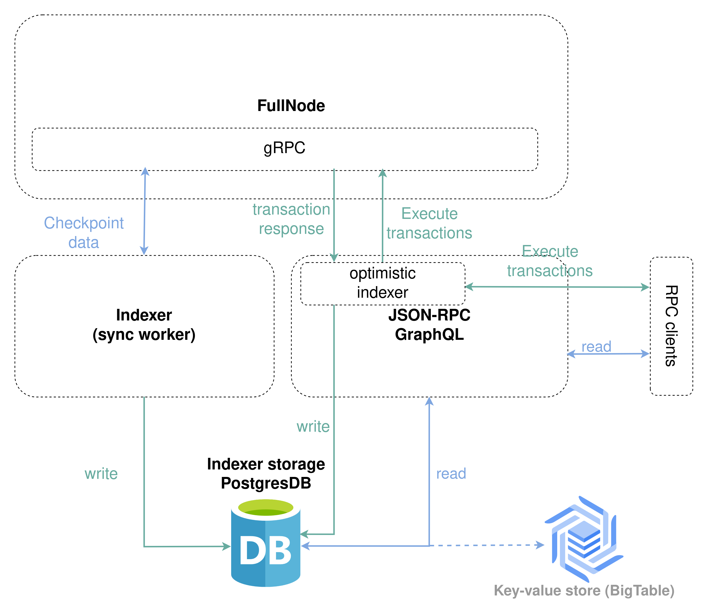
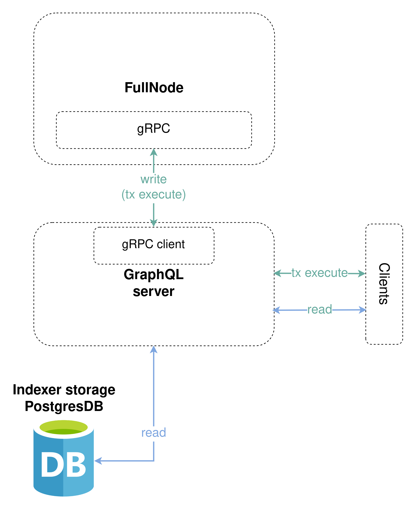

The IOTA Indexer is an off-chain service that makes IOTA network data easy to query. It ingests data from an IOTA node, stores it in a PostgreSQL database, and serves it through query APIs [JSON-RPC](./json-rpc) and [GraphQL](./graphql).



## Functions

The IOTA Indexer provides three main functionalities:

- Ingest data from a full node to a relational database. Data on full nodes is stored as BCS bytes in an embedded RocksDB database, thus the query capabilities are very limited. The indexer pulls checkpoint blob data, schematizing them into various tables like objects, transactions, and so on, with proper indices.

:::info Hybrid Historical Checkpoint Store

If the full node does not retain its historical data, the indexer can be configured to ingest from a **hybrid historical checkpoint store** instead. This combines two sources:

- A **historical checkpoint store** with the full archive from genesis to the network tip.
- An optional **live checkpoint store** storing only current-epoch checkpoints, used for real-time ingestion.

```shell
iota-indexer \
  --db-url <DATABASE_URL> \
  indexer \
  --remote-store-url https://checkpoints.<NETWORK>.iota.cafe/ingestion/historical \
  --live-checkpoints-store-url https://checkpoints.<NETWORK>.iota.cafe/ingestion/live
```

For more info see the [reference table](/developer/advanced/custom-indexer#historical-checkpoint-store).
:::

- Serve online transaction processing (OLTP) RPC requests. With data in relational databases, IOTA indexer spins a stateless reader binary as JSON RPC server with the associated [interface](/iota-api-ref).
- Other than OLTP data ingestion and requests, the Indexer also supports some analytical data ingestion like transactions per second (TPS) and daily active user (DAU) metrics.

:::info Indexer Worker

One Indexer instance can provide one of the above mentioned functionalities. They can be enabled with the corresponding subcommands in the Indexer CLI like:

- `indexer`
- `json-rpc-service`
- `analytical-worker`

Most RPC calls mentioned in [interface](/iota-api-ref) will only work with an indexer running. This is always mentioned in the RPC call description if it is the case. Indexer RPC calls that provide metrics are provided by the analytical worker.

:::

## Run an Indexer

- [**IOTA Indexer**](./iota-indexer) — ingest checkpoint data into a local or managed Postgres-compatible database, with optional pruning to control storage growth.
- [**IOTA Indexer JSON-RPC**](./json-rpc) — serve online transaction processing (OLTP) RPC requests against the indexed data.

## Run GraphQL Interface

Alternatively to the JSON-RPC, a GraphQL [interface](../../developer/references/iota-graphql.mdx) can be used to provide read access to the Indexer database, and enable execution of transactions to the full node.



A running Indexer database instance is required for the GraphQL API to be functional, so it is advised that an Indexer sync worker is setup and started first.

For more information, see [GraphQL](./graphql).
