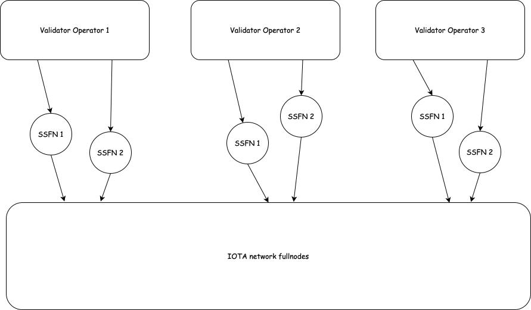

import FullnodeRequirements from '../_snippets/operator/fullnode-requirements-tab.mdx'


# State Sync Full Node (SSFN) Guide

## Hardware requirements

<FullnodeRequirements/ >

## What is a State Sync Full Node?

A State Sync Full Node (SSFN) is a specialized IOTA full node that acts as a bridge between validators and the broader IOTA network. While it shares most characteristics with regular full nodes, it is specifically configured to optimize state synchronization for validators.

## Why are SSFNs Important for Validators?

SSFNs play a crucial role in a validator's infrastructure for several reasons:

1. **Network Isolation**: SSFNs provide a security buffer between validators and the public network, helping protect validators from potential attacks or network issues.
2. **Optimized State Sync**: They are specifically configured to handle state synchronization efficiently, ensuring validators maintain accurate and up-to-date network state.
3. **Resource Optimization**: By offloading some network communication tasks to SSFNs, validators can focus their resources on their primary validation duties.
4. **Redundancy**: Running multiple SSFNs provides failover capability and ensures continuous operation even if one SSFN experiences issues.

## Recommended Setup

For optimal validator operation, we recommend:

- Running at least 1 SSFN per validator
- Deploying SSFNs on separate machines from the validator
- Ensuring high-bandwidth, low-latency connections between SSFNs and their validator



## How SSFNs Differ from Regular Full Nodes

SSFNs have several key differences from standard full nodes:

1. **Peering Configuration**:

   - SSFNs are directly peered with their validator
   - They are the only nodes that explicitly set validators as their peers
2. **Resource Optimization**:

   - Indexing is disabled to reduce resource usage
   - Aggressive pruning is enabled to maintain a smaller database footprint
   - Metrics are pushed to IOTA's metric proxy for monitoring

## Configuration Guide

### 1. Generate Network Keys

First, generate a network key for your SSFN:

```bash
iota keytool generate ed25519
# Make note of the generated peerId
```

### 2. SSFN Configuration

Create or modify your SSFN's configuration file with these specific settings:

<Tabs groupId="network">
    <TabItem label="Mainnet" value="mainnet">
      ```yaml
      # Network Configuration
      network-key-pair:
        path: /opt/iota/key-pairs/network.key

      # Peering Configuration
      p2p-config:
        seed-peers:
          - address: /dns/validator-hostname/udp/8084
            peer-id: <validator-peer-id>  # Get this from your validator's network.key
          - address: /dns/access-0.r.mainnet.iota.cafe/udp/8084
            peer-id: 66b55de43e925417761f3c66cd734451b5876e1496b961052095bdd8a7732189
          - address: /dns/access-1.r.mainnet.iota.cafe/udp/8084
            peer-id: 7f8dc46616df5b5640ffd118c6ef640b3f7f5cae8a2bedfa700769e12150a197
          - address: /dns/access-2.r.mainnet.iota.cafe/udp/8084
            peer-id: c9fbf6fb511fc5243989c7a455d36f277844288b1a1d8453331c200b6ac4d99f
          - address: /dns/access-3.r.mainnet.iota.cafe/udp/8084
            peer-id: 2c1e05e9bddaf505b70184baf21a188a7c270b1b58f38d55e3aea42d067c5fb6

      # Resource Optimization
      enable-index-processing: false

      # Pruning Configuration
      authority-store-pruning-config:
        num-latest-epoch-dbs-to-retain: 3
        epoch-db-pruning-period-secs: 3600
        max-checkpoints-in-batch: 10
        max-transactions-in-batch: 1000
        num-epochs-to-retain: 0
        num-epochs-to-retain-for-checkpoints: 2
        periodic-compaction-threshold-days: 1

      # Metrics Configuration
      metrics:
        push-interval-seconds: 60
        push-url: https://metrics-proxy.mainnet.iota.cafe:8443/publish/metrics
      
      state-archive-read-config:
        - object-store-config:
            object-store: "S3"
            aws-endpoint: "https://archive.mainnet.iota.cafe"
            aws-virtual-hosted-style-request: true
            object-store-connection-limit: 20
            no-sign-request: true
          concurrency: 5
          use-for-pruning-watermark: false
      ```
    </TabItem>
    <TabItem label="Testnet" value="testnet">
      ```yaml
      # Network Configuration
      network-key-pair:
        path: /opt/iota/key-pairs/network.key

      # Peering Configuration
      p2p-config:
        seed-peers:
          - address: /dns/validator-hostname/udp/8084
            peer-id: <validator-peer-id>  # Get this from your validator's network.key
          - address: /dns/access-0.r.testnet.iota.cafe/udp/8084
            peer-id: 46064108d0b689ed89d1f44153e532bb101ce8f8ca3a3d01ab991d4dea122cfc
          - address: /dns/access-1.r.testnet.iota.cafe/udp/8084
            peer-id: 8ffd25fa4e86c30c3f8da7092695e8a103462d7a213b815d77d6da7f0a2a52f5

      # Resource Optimization
      enable-index-processing: false

      # Pruning Configuration
      authority-store-pruning-config:
        num-latest-epoch-dbs-to-retain: 3
        epoch-db-pruning-period-secs: 3600
        max-checkpoints-in-batch: 10
        max-transactions-in-batch: 1000
        num-epochs-to-retain: 0
        num-epochs-to-retain-for-checkpoints: 2
        periodic-compaction-threshold-days: 1

      # Metrics Configuration
      metrics:
        push-interval-seconds: 60
        push-url: https://metrics-proxy.testnet.iota.cafe:8443/publish/metrics

      state-archive-read-config:
        - object-store-config:
            object-store: "S3"
            aws-endpoint: "https://archive.testnet.iota.cafe"
            aws-virtual-hosted-style-request: true
            object-store-connection-limit: 20
            no-sign-request: true
          concurrency: 5
          use-for-pruning-watermark: false
      ```
    </TabItem>
</Tabs>

### 3. Metrics Whitelisting

To successfully push metrics from your SSFN to IOTA's metrics proxy, you need to be whitelisted:

1. **Provide the following information to the IOTA team**:
   - Your SSFN's p2p-address (e.g., `/dns/your-ssfn-hostname/udp/8084`)
   - Your SSFN's peer-id (generated in step 1)

2. **Whitelisting Process**:
   - Submit this information through the official IOTA Discord or by IOTA Slack
   - Wait for confirmation that your SSFN has been added to the whitelist
   - Without whitelisting, your metrics will be rejected by the proxy

> **Note**: Whitelisting is required for security reasons and helps prevent unauthorized access to the metrics infrastructure.

### 4. Validator Configuration

Update your validator's configuration to connect to your SSFNs:

```yaml
p2p-config:
  seed-peers:
    - address: /dns/ssfn1-hostname/udp/8084
      peer-id: <ssfn1-peer-id>
    - address: /dns/ssfn2-hostname/udp/8084
      peer-id: <ssfn2-peer-id>
```

## Best Practices

1. **Monitoring**:

   - Regularly monitor SSFN metrics through IOTA's metric proxy
   - Set up alerts for connectivity issues or resource constraints
2. **Maintenance**:

   - Keep SSFNs updated with the latest IOTA software
   - Regularly verify the connection between SSFNs and validator
   - Monitor disk usage as even with pruning, storage needs will grow over time
3. **Security**:

   - Place SSFNs behind appropriate firewalls
   - Restrict network access to only necessary ports
   - Regularly update the underlying operating system and dependencies

## Troubleshooting

If you experience issues with your SSFNs:

1. Verify network connectivity between SSFNs and validator
2. Check logs for any error messages
3. Ensure all peer IDs are correctly configured
4. Verify that pruning is working as expected by monitoring database size
5. Confirm metrics are being successfully pushed to the metrics proxy