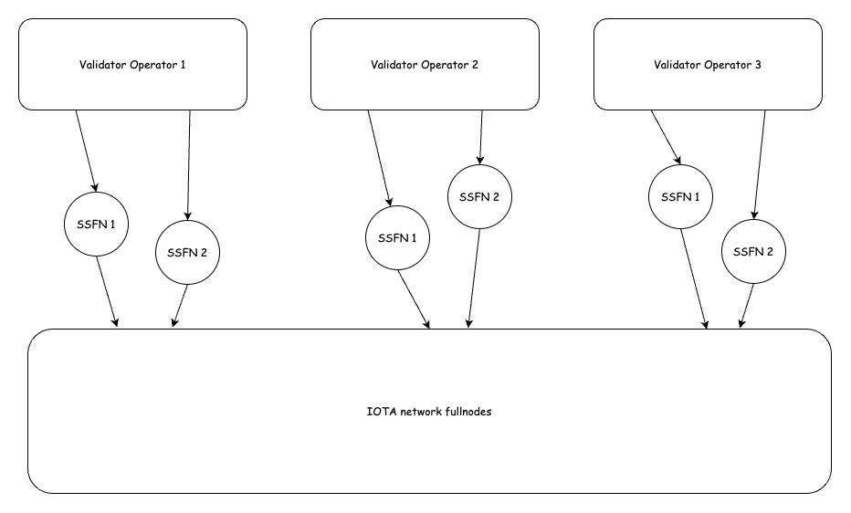

import NodeHardwareRequirements from '../_snippets/node-hardware-requirements.mdx'

# State Sync Full Node (SSFN) Guide

<NodeHardwareRequirements/ >

## What is a State Sync Full Node?

A State Sync Full Node (SSFN) is a specialized IOTA full node that acts as a bridge between validators and the broader IOTA network. While it shares most characteristics with regular full nodes, it is specifically configured to optimize state synchronization for validators.

## Why are SSFNs Important for Validators?

SSFNs play a crucial role in a validator's infrastructure for several reasons:

1. **Network Isolation**: SSFNs provide a security buffer between validators and the public network, helping protect validators from potential attacks or network issues.
2. **Optimized State Sync**: They are specifically configured to handle state synchronization efficiently, ensuring validators maintain accurate and up-to-date network state.
3. **Resource Optimization**: By offloading some network communication tasks to SSFNs, validators can focus their resources on their primary validation duties.
4. **Redundancy**: Running multiple SSFNs provides failover capability and ensures continuous operation even if one SSFN experiences issues.

## Recommended Setup

For optimal validator operation, we recommend:

- Running at least 2 SSFNs per validator
- Deploying SSFNs on separate machines from the validator
- Ensuring high-bandwidth, low-latency connections between SSFNs and their validator



## How SSFNs Differ from Regular Full Nodes

SSFNs have several key differences from standard full nodes:

1. **Peering Configuration**:

   - SSFNs are directly peered with their validator
   - They are the only nodes that explicitly set validators as their peers
2. **Resource Optimization**:

   - Indexing is disabled to reduce resource usage
   - Aggressive pruning is enabled to maintain a smaller database footprint
   - Metrics are pushed to IOTA's metric proxy for monitoring

## Configuration Guide

### 1. Generate Network Keys

First, generate a network key for your SSFN:

```bash
iota keytool generate ed25519
# Make note of the generated peerId
```

### 2. SSFN Configuration

Create or modify your SSFN's configuration file with these specific settings:

```yaml
# Network Configuration
network-key-pair:
  path: /opt/iota/key-pairs/network.key

# Peering Configuration
p2p-config:
  seed-peers:
    - address: /dns/validator-hostname/udp/8084
      peer-id: <validator-peer-id>  # Get this from your validator's network.key

# Resource Optimization
enable-index-processing: false

# Pruning Configuration
authority-store-pruning-config:
  num-latest-epoch-dbs-to-retain: 3
  epoch-db-pruning-period-secs: 3600
  max-checkpoints-in-batch: 10
  max-transactions-in-batch: 1000
  num-epochs-to-retain: 0
  num-epochs-to-retain-for-checkpoints: 2
  periodic-compaction-threshold-days: 1

# Metrics Configuration
metrics:
  push-interval-seconds: 60
  push-url: https://metrics-proxy.mainnet.iota.cafe:8443/publish/metrics
```

### 3. Validator Configuration

Update your validator's configuration to connect to your SSFNs:

```yaml
p2p-config:
  seed-peers:
    - address: /dns/ssfn1-hostname/udp/8084
      peer-id: <ssfn1-peer-id>
    - address: /dns/ssfn2-hostname/udp/8084
      peer-id: <ssfn2-peer-id>
```

## Setting Up SSFN with Docker Compose (An Example)

For a more comprehensive setup that includes monitoring capabilities, you can use Docker Compose to deploy your SSFN along with iota-proxy, Mimir, and Grafana. This setup provides a complete solution for running and monitoring your SSFN.

### Prerequisites

- Docker and Docker Compose installed on your server
- SSL certificates for iota-proxy (fullchain.pem and privkey.pem)
- Generated network key for your SSFN
- Genesis and migration blobs for the network you're connecting to

### Directory Structure

Create a directory for your SSFN setup with the following structure:

```
ssfn-setup/
├── docker-compose.yaml
├── fullnode-template.yaml
├── iota-proxy.yaml
├── mimir.yaml
├── genesis.blob
├── migration.blob
├── network.key
├── privkey.pem
├── fullchain.pem
└── data/
    └── mimir/
```

### Step 1: Create Docker Compose Configuration

Create a `docker-compose.yaml` file with the following content:

```yaml
---
services:
    fullnode:
        # Use the appropriate image tag for your network (mainnet, testnet, devnet)
        image: iotaledger/iota-node:devnet
        ports:
            - '8080:8080'
            - '8084:8084/udp'
            - '9000:9000'
            - '9184:9184'
        volumes:
            - ./fullnode-template.yaml:/opt/iota/config/fullnode.yaml:ro
            - ./validator.yaml:/opt/iota/config/validator.yaml:ro
            - ./genesis.blob:/opt/iota/config/genesis.blob:ro
            - ./migration.blob:/opt/iota/config/migration.blob:ro
            - ./iotadb:/opt/iota/db:rw
            - ./network.key:/opt/iota/config/network.key:ro
        command: ['/usr/local/bin/iota-node', '--config-path', '/opt/iota/config/fullnode.yaml']
        depends_on:
            - iota-proxy
            - mimir
    
    mimir:
        image: grafana/mimir:latest
        container_name: mimir
        restart: unless-stopped
        ports:
            - "9009:9009"
        environment:
            - ENABLE_MULTITENANCY=false
        volumes:
            - ./mimir.yaml:/etc/mimir/mimir.yaml
            - ./data/mimir:/data
        command:
            - -config.file=/etc/mimir/mimir.yaml

    grafana:
        image: grafana/grafana:latest
        environment:
            - GF_AUTH_ANONYMOUS_ENABLED=true
            - GF_AUTH_ANONYMOUS_ORG_ROLE=Admin
            - GF_AUTH_DISABLE_LOGIN_FORM=true
            - GF_FEATURE_TOGGLES_ENABLE=traceqlEditor
        ports:
            - "3000:3000"

    iota-proxy:
        image: iotaledger/iota-proxy
        environment:
            - RUST_BACKTRACE=1
            - RUST_LOG=debug
        command:
            - "/usr/local/bin/iota-proxy"
            - "--config=/etc/iota-proxy.yaml"
        ports:
            - "8443:8443"
        volumes:
            - ./iota-proxy.yaml:/etc/iota-proxy.yaml
            - ./privkey.pem:/etc/privkey.pem:ro
            - ./fullchain.pem:/etc/fullchain.pem:ro
        depends_on:
            - mimir

volumes:
    iotadb:

networks:
    default:
        name: iota-network
```

### Step 2: Configure SSFN (fullnode-template.yaml)

Create a `fullnode-template.yaml` file with the following content, adjusting the values as needed for your setup:

```yaml
# Database path
db-path: /opt/iota/db

# Network configuration
network-address: /dns/0.0.0.0/tcp/8080/http
metrics-address: '0.0.0.0:9184'
json-rpc-address: '0.0.0.0:9000'
enable-event-processing: true

# Network key configuration
network-key-pair:
    path: /opt/iota/config/network.key

# P2P configuration
p2p-config:
    listen-address: "0.0.0.0:8084"
    external-address: /dns/your-node-hostname/udp/8084
    seed-peers:
        # For connecting to your validator
        - address: /dns/validator-hostname/udp/8084
          peer-id: <validator-peer-id>
        # For connecting to the network (example for devnet)
        - address: /dns/access-0.r.devnet.iota.cafe/udp/8084
          peer-id: 01589ac910a5993f80fbc34a6e0c8b2041ddc5526a951c838df3037e11ab0188

# Resource optimization
enable-index-processing: false

# Genesis configuration
genesis:
    genesis-file-location: /opt/iota/config/genesis.blob

# Migration configuration
migration-tx-data-path: /opt/iota/config/migration.blob

# Pruning configuration
authority-store-pruning-config:
    num-latest-epoch-dbs-to-retain: 3
    epoch-db-pruning-period-secs: 3600
    max-checkpoints-in-batch: 10
    max-transactions-in-batch: 1000
    num-epochs-to-retain: 0
    num-epochs-to-retain-for-checkpoints: 2
    periodic-compaction-threshold-days: 1

# Metrics configuration for iota-proxy
metrics:
    push-interval-seconds: 10
    push-url: https://your-node-hostname:8443/publish/metrics
```

### Step 3: Configure iota-proxy

Create an `iota-proxy.yaml` file with the following content:

```yaml
# Specify the network you're connecting to
network: devnet  # Change to mainnet or testnet as needed
listen-address: 0.0.0.0:8443

# Mimir configuration for metrics storage
remote-write:
  url: http://mimir:9009/api/v1/push
  username: ""  # Leave empty if no auth required
  password: ""  # Leave empty if no auth required
  pool-max-idle-per-host: 8

# Metrics endpoint configuration
metrics:
  endpoint: /publish/metrics

# Static peers configuration
static-peers:
  pub-keys:
    - name: my-fullnode
      p2p-address: /dns/your-node-hostname/udp/8084
      peer-id: "<your-fullnode-peer-id>"  # Use the peer ID from your network.key
    # Add additional peers if needed

# Dynamic peers configuration (for committee information)
dynamic-peers:
  url: https://api.devnet.iota.cafe  # Change to the appropriate API URL for your network
  interval: 30
  certificate-file: /etc/fullchain.pem
  private-key: /etc/privkey.pem

# Metrics addresses
metrics-address: 0.0.0.0:9184
histogram-address: 0.0.0.0:9185
```

### Step 4: Configure Mimir

Create a `mimir.yaml` file with the following content:

```yaml
server:
  http_listen_address: 0.0.0.0
  http_listen_port: 9009

# Disable multi-tenant auth
multitenancy_enabled: false

blocks_storage:
  backend: filesystem
  bucket_store:
    sync_dir: /tmp/mimir/tsdb-sync
  filesystem:
    dir: /tmp/mimir/data/tsdb
  tsdb:
    dir: /tmp/mimir/tsdb

alertmanager_storage:
  storage_prefix: alertmanager

ruler_storage:
  storage_prefix: ruler

# Lower the replication factor for single-node
ingester:
  ring:
    replication_factor: 1

limits:
  compactor_blocks_retention_period: 60d
  ingestion_rate: 250000
  ingestion_burst_size: 500000
  max_global_series_per_user: 1000000
```

### Step 5: Start the SSFN Stack

Once all configuration files are in place, start the SSFN stack with Docker Compose:

```bash
docker-compose up -d
```

This command will start all services in detached mode. You can check the status of the services with:

```bash
docker-compose ps
```

### Step 6: Configure Grafana

After starting the stack, Grafana will be available at `http://your-server-ip:3000`. Follow these steps to configure Grafana for monitoring your SSFN:

1. Log in to Grafana (authentication is disabled by default in this setup)
2. Add a new data source:
   - Type: Prometheus
   - URL: `http://mimir:9009/prometheus`
   - Access: Server (default)
3. Import IOTA dashboards:
   - Go to Dashboards > Import
   - Import dashboard ID `15111` for IOTA Node metrics
   - Alternatively, you can create custom dashboards for your specific monitoring needs

## Monitoring Your SSFN

With the complete setup, you can monitor your SSFN through:

### Grafana Dashboards

Access Grafana at `http://your-server-ip:3000` to view:
- Node health metrics
- Network connectivity status
- Resource usage (CPU, memory, disk)
- Transaction processing metrics

### iota-proxy Metrics

The iota-proxy collects and forwards metrics from your SSFN to Mimir. These metrics include:
- Peer connection status
- Network traffic statistics
- Message processing rates
- Synchronization status

### Log Monitoring

You can view logs for each service using Docker Compose:

```bash
# View logs for all services
docker-compose logs

# View logs for a specific service
docker-compose logs fullnode
docker-compose logs iota-proxy
```

## Best Practices

1. **Monitoring**:

   - Regularly monitor SSFN metrics through Grafana
   - Set up alerts for connectivity issues or resource constraints
   - Create custom dashboards for metrics most relevant to your operation
2. **Maintenance**:

   - Keep SSFNs updated with the latest IOTA software
   - Regularly verify the connection between SSFNs and validator
   - Monitor disk usage as even with pruning, storage needs will grow over time
3. **Security**:

   - Place SSFNs behind appropriate firewalls
   - Restrict network access to only necessary ports
   - Regularly update the underlying operating system and dependencies
   - Secure your SSL certificates and network keys
4. **Backup**:
   - Regularly backup your network keys
   - Consider periodic database backups for faster recovery in case of failure

## Troubleshooting

If you experience issues with your SSFNs:

1. Verify network connectivity between SSFNs and validator
2. Check logs for any error messages
3. Ensure all peer IDs are correctly configured
4. Verify that pruning is working as expected by monitoring database size
5. Confirm metrics are being successfully pushed to the metrics proxy
6. Check iota-proxy logs for connection issues
7. Verify Mimir is receiving and storing metrics properly
8. Ensure Grafana can connect to Mimir as a data source


