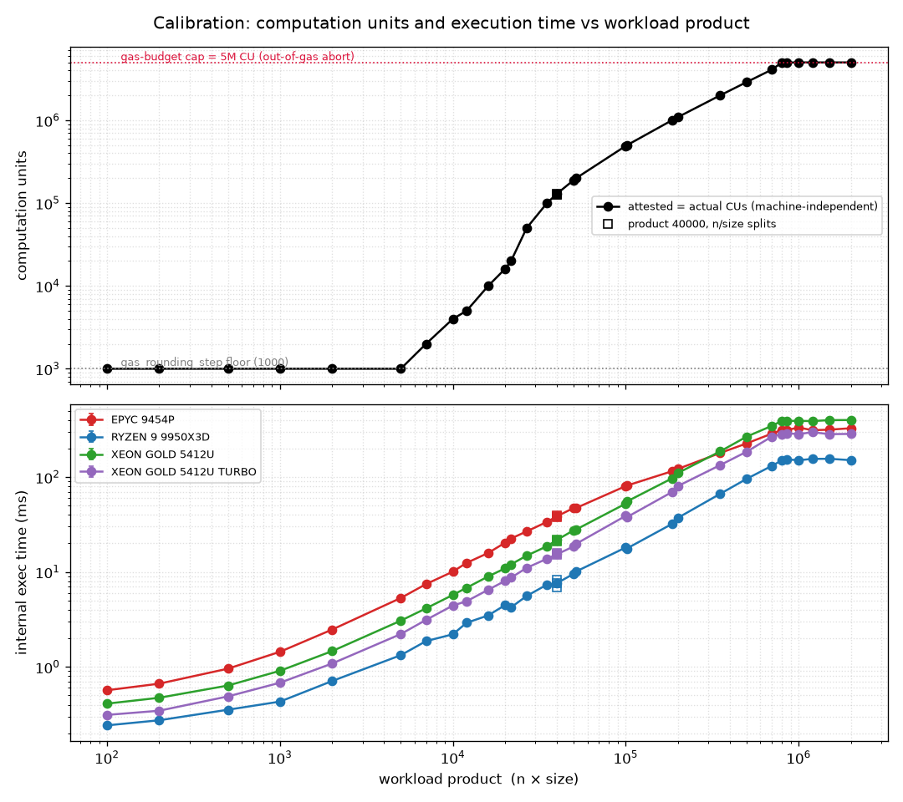
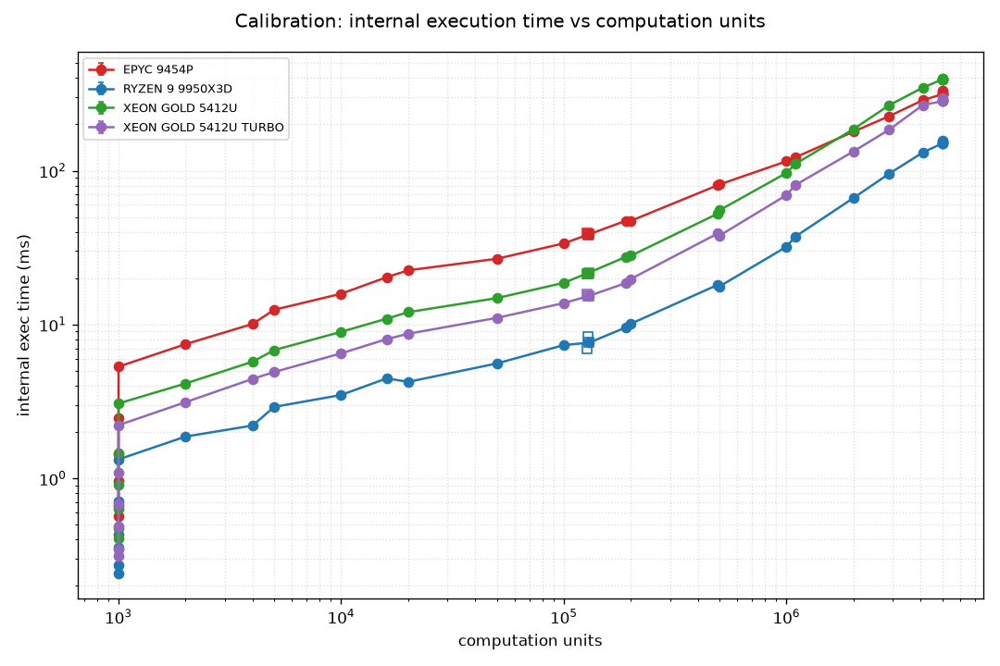
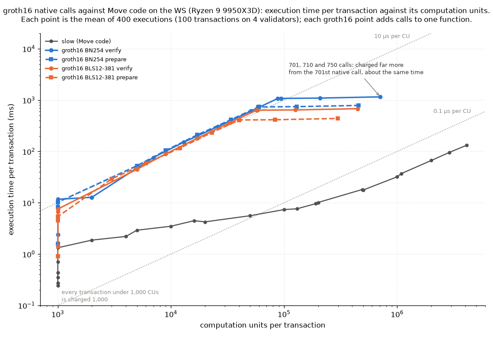
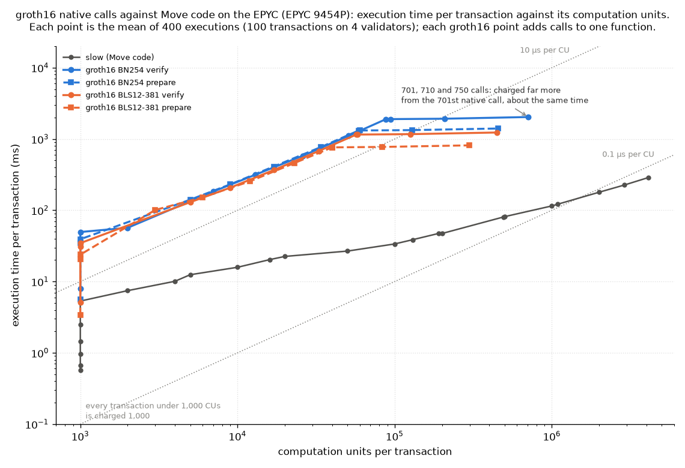
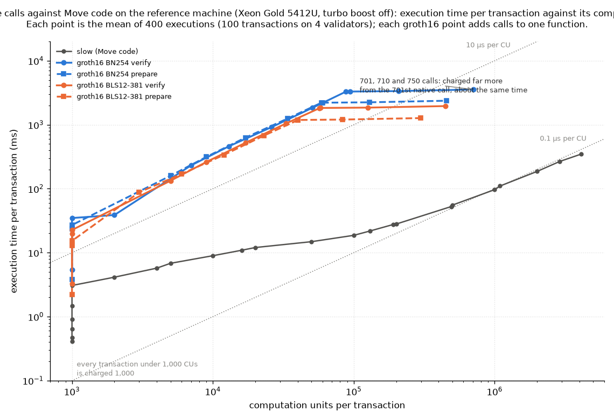

# H2 calibration — probe results

The probe (`probe.sh`, swept by `probe_sweep.sh`) measures one `slow::slow(n,
size)` point at a low rate. For each point, it records the per-transaction
computation units — **attested**, metered during the attestation dry-run and the
value `TotalComputationUnits` uses for scheduling, and **actual**, metered at
post-consensus execution — plus the Move VM execution time. The workload is the
owned-object form of `slow` (W4 in `../stress-plan.md`), so attested and actual
computation units should be equal, because no state can change between the
dry-run and execution. *Sizing the `TotalComputationUnits` limit* below covers
what the numbers are used for; `README.md` has the run plan.

The sweep covers three groups of points, 32 in all, `size` fixed at 100 except
where noted. A geometric ladder steps the product `n × size` from 100 to 2M.
Three points hold the product at 40000 while changing how it divides between
`n` and `size`. The rest are the twelve cost points the mode comparison runs
(`matrix.sh`), whose `n` were chosen so the attested cost lands on a round
target — 1,000, 2,000, 5,000 … 5,000,000 — which puts them between the
ladder's steps. Each point ran 20 s at 5 QPS, so 100 transactions. The same 32
points ran on three machines, and twice on the third:

| Machine | CPU | Arch | Boost | Cores |
| --- | --- | --- | --- | --- |
| EPYC | EPYC 9454P | Zen4 | ≈3.8 GHz | 48 |
| WS | Ryzen 9 9950X3D | Zen5 | 5.76 GHz | 16 (+3D V-Cache) |
| Reference | Xeon Gold 5412U | Sapphire Rapids | off (2.1 GHz base), then 3.9 GHz | 24 |

The reference machine is a spare server of the type the mainnet validators run
on: 24 cores / 48 threads, 128 GB of DDR5-4800 in four of its eight slots, two
NVMe drives, Ubuntu 24.04, running directly on the hardware. That is exactly the
published
[validator requirement](../../docs/content/_snippets/operator/validator-requirements-tab.mdx)
of a 24-core processor with 48 vCPUs and 128 GB of RAM. Its turbo boost is off,
as on the validators, where the default was never changed, so the CPU holds its
2.1 GHz base clock; that run is the reference result. A second run with turbo
boost on, where the busy cores ran at 3.2–3.4 GHz, shows what changes if the
validators ever turn it on. In the tables and figures, the two runs appear as
`XEON GOLD 5412U` and `XEON GOLD 5412U TURBO`.

`make_calibration_table.py` reproduces the tables below, `compare_machines.py`
the cross-machine comparison for any two runs, and `plot_calibration.py` the
figures.

The last section, *groth16 native calls (W8)*, runs the same probe on
transactions that call a native function instead of Move code.

## How the probe measures

The client is the `stress` benchmark running in-docker on the private network,
submitting *directly to the validators* via the transaction driver (the
attested `submit_tx` path). Every measured value comes from validator-side
Prometheus histograms, pooled over the 4 validators and differenced over the
point's measurement window:

- **Computation units** — `attested_computation_units` and
  `actual_computation_units`, as `Δ_sum / Δ_count`. Only attested user
  transactions reach these histograms, and the workload is deterministic (100
  identical owned-object transactions), so the mean is the exact
  per-transaction value.
- **Execution time** — `authority_state_internal_execution_latency_user`:
  post-consensus execution, user transactions only. This histogram was added for
  the probe, because the existing all-transactions one also counts the network's
  steady stream of system transactions (commit prologues and similar). Those
  outnumber a low-rate workload roughly 30 to 1 and, being sub-millisecond, pull
  the mean down.

The measurement window is anchored at the exact instant spamming starts — the
client prints that timestamp when its warmup ends — so the delta excludes
the gas coin setup transactions, which run during warmup. Without this, the
few cheap setup transactions (at the 1,000-CU floor) pool into the mean and
bias it low. The client also waits 2 s between warmup and spamming so the
baseline sits in a quiet gap. Every row below has exactly 400 samples: 100
workload transactions executed on each of the 4 validators.

---

## Results

### EPYC 9454P

| N | Size | Product | CU | Exec mean (ms) | Exec sem (ms) | Samples |
| --- | --- | --- | --- | --- | --- | --- |
| 1 | 100 | 100 | 1,000 | 0.568 | 0.012 | 400 |
| 2 | 100 | 200 | 1,000 | 0.665 | 0.016 | 400 |
| 5 | 100 | 500 | 1,000 | 0.958 | 0.061 | 400 |
| 10 | 100 | 1,000 | 1,000 | 1.443 | 0.077 | 400 |
| 20 | 100 | 2,000 | 1,000 | 2.470 | 0.027 | 400 |
| 50 | 100 | 5,000 | 1,000 | 5.323 | 0.114 | 400 |
| 70 | 100 | 7,000 | 2,000 | 7.455 | 0.066 | 400 |
| 100 | 100 | 10,000 | 4,000 | 10.087 | 0.251 | 400 |
| 120 | 100 | 12,000 | 5,000 | 12.470 | 0.251 | 400 |
| 160 | 100 | 16,000 | 10,000 | 15.855 | 0.092 | 400 |
| 200 | 100 | 20,000 | 16,000 | 20.294 | 0.519 | 400 |
| 217 | 100 | 21,700 | 20,000 | 22.512 | 0.519 | 400 |
| 267 | 100 | 26,700 | 50,000 | 26.754 | 0.494 | 400 |
| 350 | 100 | 35,000 | 100,000 | 33.695 | 0.206 | 400 |
| 100 | 400 | 40,000 | 127,000 | 39.398 | 0.973 | 400 |
| 200 | 200 | 40,000 | 128,000 | 38.197 | 0.863 | 400 |
| 400 | 100 | 40,000 | 130,000 | 38.623 | 0.861 | 400 |
| 500 | 100 | 50,000 | 190,000 | 47.269 | 0.901 | 400 |
| 516 | 100 | 51,600 | 200,000 | 47.212 | 0.838 | 400 |
| 1000 | 100 | 100,000 | 491,000 | 80.410 | 1.085 | 400 |
| 1015 | 100 | 101,500 | 500,000 | 81.336 | 1.613 | 400 |
| 1848 | 100 | 184,800 | 1,000,000 | 115.076 | 2.942 | 400 |
| 2000 | 100 | 200,000 | 1,092,000 | 121.788 | 2.652 | 400 |
| 3511 | 100 | 351,100 | 2,000,000 | 179.278 | 0.214 | 400 |
| 5000 | 100 | 500,000 | 2,895,000 | 226.288 | 4.245 | 400 |
| 7000 | 100 | 700,000 | 4,097,000 | 287.149 | 4.420 | 400 |
| 8000 | 100 | 800,000 | 5,000,000 | 313.681 | 3.144 | 400 |
| 8500 | 100 | 850,000 | 5,000,000 | 312.723 | 3.203 | 400 |
| 10000 | 100 | 1,000,000 | 5,000,000 | 332.276 | 2.647 | 400 |
| 12000 | 100 | 1,200,000 | 5,000,000 | 311.850 | 3.420 | 400 |
| 15000 | 100 | 1,500,000 | 5,000,000 | 315.672 | 3.171 | 400 |
| 20000 | 100 | 2,000,000 | 5,000,000 | 326.821 | 2.488 | 400 |

### WS Ryzen 9 9950X3D

| N | Size | Product | CU | Exec mean (ms) | Exec sem (ms) | Samples |
| --- | --- | --- | --- | --- | --- | --- |
| 1 | 100 | 100 | 1,000 | 0.242 | 0.001 | 400 |
| 2 | 100 | 200 | 1,000 | 0.274 | 0.002 | 400 |
| 5 | 100 | 500 | 1,000 | 0.354 | 0.006 | 400 |
| 10 | 100 | 1,000 | 1,000 | 0.431 | 0.011 | 400 |
| 20 | 100 | 2,000 | 1,000 | 0.709 | 0.015 | 400 |
| 50 | 100 | 5,000 | 1,000 | 1.329 | 0.080 | 400 |
| 70 | 100 | 7,000 | 2,000 | 1.870 | 0.057 | 400 |
| 100 | 100 | 10,000 | 4,000 | 2.206 | 0.040 | 400 |
| 120 | 100 | 12,000 | 5,000 | 2.916 | 0.004 | 400 |
| 160 | 100 | 16,000 | 10,000 | 3.485 | 0.054 | 400 |
| 200 | 100 | 20,000 | 16,000 | 4.468 | 0.099 | 400 |
| 217 | 100 | 21,700 | 20,000 | 4.241 | 0.092 | 400 |
| 267 | 100 | 26,700 | 50,000 | 5.585 | 0.107 | 400 |
| 350 | 100 | 35,000 | 100,000 | 7.353 | 0.137 | 400 |
| 100 | 400 | 40,000 | 127,000 | 6.931 | 0.080 | 400 |
| 200 | 200 | 40,000 | 128,000 | 8.300 | 0.205 | 400 |
| 400 | 100 | 40,000 | 130,000 | 7.627 | 0.185 | 400 |
| 500 | 100 | 50,000 | 190,000 | 9.579 | 0.217 | 400 |
| 516 | 100 | 51,600 | 200,000 | 10.122 | 0.253 | 400 |
| 1000 | 100 | 100,000 | 491,000 | 18.117 | 0.184 | 400 |
| 1015 | 100 | 101,500 | 500,000 | 17.689 | 0.179 | 400 |
| 1848 | 100 | 184,800 | 1,000,000 | 32.029 | 0.294 | 400 |
| 2000 | 100 | 200,000 | 1,092,000 | 37.170 | 0.560 | 400 |
| 3511 | 100 | 351,100 | 2,000,000 | 66.516 | 0.424 | 400 |
| 5000 | 100 | 500,000 | 2,895,000 | 95.760 | 2.167 | 400 |
| 7000 | 100 | 700,000 | 4,097,000 | 131.356 | 2.182 | 400 |
| 8000 | 100 | 800,000 | 5,000,000 | 150.195 | 1.240 | 400 |
| 8500 | 100 | 850,000 | 5,000,000 | 153.786 | 1.061 | 400 |
| 10000 | 100 | 1,000,000 | 5,000,000 | 150.430 | 1.228 | 400 |
| 12000 | 100 | 1,200,000 | 5,000,000 | 155.437 | 0.978 | 400 |
| 15000 | 100 | 1,500,000 | 5,000,000 | 155.804 | 0.960 | 400 |
| 20000 | 100 | 2,000,000 | 5,000,000 | 150.736 | 1.213 | 400 |

### Reference machine: Xeon Gold 5412U, turbo boost off

| N | Size | Product | CU | Exec mean (ms) | Exec sem (ms) | Samples |
| --- | --- | --- | --- | --- | --- | --- |
| 1 | 100 | 100 | 1,000 | 0.410 | 0.008 | 400 |
| 2 | 100 | 200 | 1,000 | 0.473 | 0.012 | 400 |
| 5 | 100 | 500 | 1,000 | 0.636 | 0.006 | 400 |
| 10 | 100 | 1,000 | 1,000 | 0.909 | 0.056 | 400 |
| 20 | 100 | 2,000 | 1,000 | 1.465 | 0.077 | 400 |
| 50 | 100 | 5,000 | 1,000 | 3.071 | 0.004 | 400 |
| 70 | 100 | 7,000 | 2,000 | 4.138 | 0.098 | 400 |
| 100 | 100 | 10,000 | 4,000 | 5.733 | 0.119 | 400 |
| 120 | 100 | 12,000 | 5,000 | 6.819 | 0.043 | 400 |
| 160 | 100 | 16,000 | 10,000 | 8.968 | 0.236 | 400 |
| 200 | 100 | 20,000 | 16,000 | 10.911 | 0.245 | 400 |
| 217 | 100 | 21,700 | 20,000 | 12.036 | 0.249 | 400 |
| 267 | 100 | 26,700 | 50,000 | 14.849 | 0.133 | 400 |
| 350 | 100 | 35,000 | 100,000 | 18.667 | 0.462 | 400 |
| 100 | 400 | 40,000 | 127,000 | 21.221 | 0.466 | 400 |
| 200 | 200 | 40,000 | 128,000 | 21.328 | 0.461 | 400 |
| 400 | 100 | 40,000 | 130,000 | 21.791 | 0.455 | 400 |
| 500 | 100 | 50,000 | 190,000 | 27.526 | 0.500 | 400 |
| 516 | 100 | 51,600 | 200,000 | 28.009 | 0.510 | 400 |
| 1000 | 100 | 100,000 | 491,000 | 52.557 | 0.871 | 400 |
| 1015 | 100 | 101,500 | 500,000 | 55.311 | 0.925 | 400 |
| 1848 | 100 | 184,800 | 1,000,000 | 96.707 | 2.389 | 400 |
| 2000 | 100 | 200,000 | 1,092,000 | 110.212 | 2.495 | 400 |
| 3511 | 100 | 351,100 | 2,000,000 | 186.286 | 3.538 | 400 |
| 5000 | 100 | 500,000 | 2,895,000 | 266.564 | 4.971 | 400 |
| 7000 | 100 | 700,000 | 4,097,000 | 346.691 | 4.021 | 400 |
| 8000 | 100 | 800,000 | 5,000,000 | 391.486 | 6.570 | 400 |
| 8500 | 100 | 850,000 | 5,000,000 | 390.833 | 6.329 | 400 |
| 10000 | 100 | 1,000,000 | 5,000,000 | 390.721 | 6.641 | 400 |
| 12000 | 100 | 1,200,000 | 5,000,000 | 388.979 | 5.381 | 400 |
| 15000 | 100 | 1,500,000 | 5,000,000 | 397.762 | 6.004 | 400 |
| 20000 | 100 | 2,000,000 | 5,000,000 | 399.054 | 7.159 | 400 |

Reference machine: Xeon Gold 5412U, turbo boost on

| N | Size | Product | CU | Exec mean (ms) | Exec sem (ms) | Samples |
| --- | --- | --- | --- | --- | --- | --- |
| 1 | 100 | 100 | 1,000 | 0.312 | 0.004 | 400 |
| 2 | 100 | 200 | 1,000 | 0.345 | 0.005 | 400 |
| 5 | 100 | 500 | 1,000 | 0.489 | 0.012 | 400 |
| 10 | 100 | 1,000 | 1,000 | 0.681 | 0.003 | 400 |
| 20 | 100 | 2,000 | 1,000 | 1.084 | 0.068 | 400 |
| 50 | 100 | 5,000 | 1,000 | 2.219 | 0.039 | 400 |
| 70 | 100 | 7,000 | 2,000 | 3.129 | 0.006 | 400 |
| 100 | 100 | 10,000 | 4,000 | 4.434 | 0.103 | 400 |
| 120 | 100 | 12,000 | 5,000 | 4.914 | 0.111 | 400 |
| 160 | 100 | 16,000 | 10,000 | 6.497 | 0.050 | 400 |
| 200 | 100 | 20,000 | 16,000 | 8.039 | 0.234 | 400 |
| 217 | 100 | 21,700 | 20,000 | 8.711 | 0.228 | 400 |
| 267 | 100 | 26,700 | 50,000 | 11.048 | 0.251 | 400 |
| 350 | 100 | 35,000 | 100,000 | 13.786 | 0.186 | 400 |
| 100 | 400 | 40,000 | 127,000 | 15.831 | 0.084 | 400 |
| 200 | 200 | 40,000 | 128,000 | 15.324 | 0.109 | 400 |
| 400 | 100 | 40,000 | 130,000 | 15.375 | 0.106 | 400 |
| 500 | 100 | 50,000 | 190,000 | 18.596 | 0.433 | 400 |
| 516 | 100 | 51,600 | 200,000 | 19.790 | 0.460 | 400 |
| 1000 | 100 | 100,000 | 491,000 | 39.073 | 1.002 | 400 |
| 1015 | 100 | 101,500 | 500,000 | 37.822 | 0.887 | 400 |
| 1848 | 100 | 184,800 | 1,000,000 | 69.417 | 2.223 | 400 |
| 2000 | 100 | 200,000 | 1,092,000 | 80.364 | 2.788 | 400 |
| 3511 | 100 | 351,100 | 2,000,000 | 133.517 | 2.074 | 400 |
| 5000 | 100 | 500,000 | 2,895,000 | 184.973 | 3.078 | 400 |
| 7000 | 100 | 700,000 | 4,097,000 | 267.158 | 4.982 | 400 |
| 8000 | 100 | 800,000 | 5,000,000 | 282.667 | 5.077 | 400 |
| 8500 | 100 | 850,000 | 5,000,000 | 289.938 | 5.063 | 400 |
| 10000 | 100 | 1,000,000 | 5,000,000 | 283.314 | 5.044 | 400 |
| 12000 | 100 | 1,200,000 | 5,000,000 | 297.106 | 4.872 | 400 |
| 15000 | 100 | 1,500,000 | 5,000,000 | 283.200 | 5.061 | 400 |
| 20000 | 100 | 2,000,000 | 5,000,000 | 284.844 | 5.049 | 400 |

> [!NOTE]
> At the ceiling (product ≥ 800k), the transactions fail with insufficient gas
> before finishing, so those rows measure the execution time the budget paid
> for, not the time the whole product would take. See *Where the 5,000,000 limit
> comes from* below.

---

## Findings

**1. Computation units sit at a floor, then rise steeply, then stop at a
ceiling.** Up to product 5,000, every point is charged 1,000 — one
`gas_rounding_step` — so light workloads cannot be distinguished by computation
cost. The floor ends between there and product 7,000, which is charged 2,000.
Above it the charge rises fast (4,000 at product 10,000 → 20,000 at 21,700 →
2,895,000 at 500,000). The steepest stretch is products 21,700 to 26,700,
where a 23 % larger product costs 2.5× more; growth flattens toward linear
above product 100,000. At the top it stops: product 700k gives 4,097,000, and
800k through 2M all give exactly 5,000,000 (`max_gas_computation_bucket`).
The wide range below the ceiling is what gives the mode comparison distinct
gas buckets to calibrate against. The execution times match: across the six
plateau points a transaction executes for 150-156 ms on the WS, 312-332 ms on
the EPYC and 389-399 ms on the reference machine (283-297 ms with turbo boost
on), where the whole product at 2M would take about 378 ms, 717 ms and 960 ms
respectively, by the linear trend from products 200k-700k, so the VM stopped
before finishing the work.

Where the 5,000,000 limit comes from

That 5,000,000 is the transaction's gas budget expressed in computation units.
The client does not set that budget from the workload:
`SlowTestPayload::create_transaction` never calls `with_gas_budget`, so
`TestTransactionBuilder` uses the gas price times
`TEST_ONLY_GAS_UNIT_FOR_HEAVY_COMPUTATION_STORAGE`, a constant of 5,000,000
(`iota-types/src/transaction.rs`). At the reference gas price of 1,000, that
is 5,000,000,000 `NANOS`, or 5 IOTA, and `slow(1, 100)` gets the same budget
as `slow(20000, 100)`. Since the budget is the gas price times a fixed number
of units, the limit in computation units is 5,000,000 at any gas price. Once
the work costs more than that, the transaction fails and is charged the whole
budget, so every point past that reports the same figure.

The 5,000,000 is also the value of `max_gas_computation_bucket`, and the two
limits are connected: the gas meter is created with
`min(gas_budget, max_gas_computation_bucket × gas_price)` (`computation_budget`
in `gas_model/gas_v1.rs`). So no transaction on this network is metered above
5,000,000 computation units, whatever budget it declares, and a larger budget
changes only what a failed transaction is charged.

**At the ceiling, the transactions fail** with
`ExecutionErrorKind::InsufficientGas`. `bucketize_computation` rounds the
metered units up to `gas_rounding_step`, and if the rounded cost has reached the
budget it charges the whole budget and returns that error. A charge of exactly
5,000,000 units therefore means the transaction failed; one that finishes is
always charged less.

**2. The product drives the cost; how it divides between `n` and `size` barely
matters.** At product 40,000 the three divisions (100×400, 200×200, 400×100)
give computation units within 2.4 % of each other (127,000 / 128,000 /
130,000), with more vectors at the same product costing marginally more. So
`n × size` sets the charge, and the product alone is enough to describe the
workload's cost. Execution time is looser — 3 % apart across the three
divisions on the EPYC and 3 % on the reference machine (21.22 / 21.33 /
21.79 ms) but 20 % apart on the WS (6.93 / 8.30 / 7.63 ms) — which is
run-to-run noise at that scale rather than a real dependence on the split, and
is why the invariance is stated as a result about units.

*Top: computation units vs product — one curve, since CUs are
machine-independent; the square markers are the product-40000 splits, which
land on the curve; the top six points (800k–2M) sit exactly on the 5M
gas-budget cap (red). Bottom: internal execution time vs product, per machine
(all four runs to product 2M).*

**3. CUs are machine-independent; execution time is not.** All 32 points match
to the digit across all three machines and both reference machine runs —
computation units are protocol defined gas metering, not wall-clock. Execution
time, in contrast, is the single-threaded Move-VM cost, so it tracks per-core
performance. Each ratio divides that run's time by the EPYC's:

| Product | N×size | CU | EPYC 9454P exec (ms) | RYZEN 9 9950X3D exec (ms) | XEON GOLD 5412U exec (ms) | XEON GOLD 5412U TURBO exec (ms) | RYZEN 9 9950X3D / EPYC 9454P | XEON GOLD 5412U / EPYC 9454P | XEON GOLD 5412U TURBO / EPYC 9454P |
| --- | --- | --- | --- | --- | --- | --- | --- | --- | --- |
| 100 | 1×100 | 1,000 | 0.568 | 0.242 | 0.410 | 0.312 | 0.43 | 0.72 | 0.55 |
| 200 | 2×100 | 1,000 | 0.665 | 0.274 | 0.473 | 0.345 | 0.41 | 0.71 | 0.52 |
| 500 | 5×100 | 1,000 | 0.958 | 0.354 | 0.636 | 0.489 | 0.37 | 0.66 | 0.51 |
| 1,000 | 10×100 | 1,000 | 1.443 | 0.431 | 0.909 | 0.681 | 0.30 | 0.63 | 0.47 |
| 2,000 | 20×100 | 1,000 | 2.470 | 0.709 | 1.465 | 1.084 | 0.29 | 0.59 | 0.44 |
| 5,000 | 50×100 | 1,000 | 5.323 | 1.329 | 3.071 | 2.219 | 0.25 | 0.58 | 0.42 |
| 7,000 | 70×100 | 2,000 | 7.455 | 1.870 | 4.138 | 3.129 | 0.25 | 0.56 | 0.42 |
| 10,000 | 100×100 | 4,000 | 10.087 | 2.206 | 5.733 | 4.434 | 0.22 | 0.57 | 0.44 |
| 12,000 | 120×100 | 5,000 | 12.470 | 2.916 | 6.819 | 4.914 | 0.23 | 0.55 | 0.39 |
| 16,000 | 160×100 | 10,000 | 15.855 | 3.485 | 8.968 | 6.497 | 0.22 | 0.57 | 0.41 |
| 20,000 | 200×100 | 16,000 | 20.294 | 4.468 | 10.911 | 8.039 | 0.22 | 0.54 | 0.40 |
| 21,700 | 217×100 | 20,000 | 22.512 | 4.241 | 12.036 | 8.711 | 0.19 | 0.53 | 0.39 |
| 26,700 | 267×100 | 50,000 | 26.754 | 5.585 | 14.849 | 11.048 | 0.21 | 0.56 | 0.41 |
| 35,000 | 350×100 | 100,000 | 33.695 | 7.353 | 18.667 | 13.786 | 0.22 | 0.55 | 0.41 |
| 40,000 | 100×400 | 127,000 | 39.398 | 6.931 | 21.221 | 15.831 | 0.18 | 0.54 | 0.40 |
| 40,000 | 200×200 | 128,000 | 38.197 | 8.300 | 21.328 | 15.324 | 0.22 | 0.56 | 0.40 |
| 40,000 | 400×100 | 130,000 | 38.623 | 7.627 | 21.791 | 15.375 | 0.20 | 0.56 | 0.40 |
| 50,000 | 500×100 | 190,000 | 47.269 | 9.579 | 27.526 | 18.596 | 0.20 | 0.58 | 0.39 |
| 51,600 | 516×100 | 200,000 | 47.212 | 10.122 | 28.009 | 19.790 | 0.21 | 0.59 | 0.42 |
| 100,000 | 1000×100 | 491,000 | 80.410 | 18.117 | 52.557 | 39.073 | 0.23 | 0.65 | 0.49 |
| 101,500 | 1015×100 | 500,000 | 81.336 | 17.689 | 55.311 | 37.822 | 0.22 | 0.68 | 0.47 |
| 184,800 | 1848×100 | 1,000,000 | 115.076 | 32.029 | 96.707 | 69.417 | 0.28 | 0.84 | 0.60 |
| 200,000 | 2000×100 | 1,092,000 | 121.788 | 37.170 | 110.212 | 80.364 | 0.31 | 0.90 | 0.66 |
| 351,100 | 3511×100 | 2,000,000 | 179.278 | 66.516 | 186.286 | 133.517 | 0.37 | 1.04 | 0.74 |
| 500,000 | 5000×100 | 2,895,000 | 226.288 | 95.760 | 266.564 | 184.973 | 0.42 | 1.18 | 0.82 |
| 700,000 | 7000×100 | 4,097,000 | 287.149 | 131.356 | 346.691 | 267.158 | 0.46 | 1.21 | 0.93 |
| 800,000 | 8000×100 | 5,000,000 | 313.681 | 150.195 | 391.486 | 282.667 | 0.48 | 1.25 | 0.90 |
| 850,000 | 8500×100 | 5,000,000 | 312.723 | 153.786 | 390.833 | 289.938 | 0.49 | 1.25 | 0.93 |
| 1,000,000 | 10000×100 | 5,000,000 | 332.276 | 150.430 | 390.721 | 283.314 | 0.45 | 1.18 | 0.85 |
| 1,200,000 | 12000×100 | 5,000,000 | 311.850 | 155.437 | 388.979 | 297.106 | 0.50 | 1.25 | 0.95 |
| 1,500,000 | 15000×100 | 5,000,000 | 315.672 | 155.804 | 397.762 | 283.200 | 0.49 | 1.26 | 0.90 |
| 2,000,000 | 20000×100 | 5,000,000 | 326.821 | 150.736 | 399.054 | 284.844 | 0.46 | 1.22 | 0.87 |

The WS runs 2.0–5.7× faster per transaction than the EPYC, and the WS / EPYC
ratio is U-shaped rather than flat:

- **Small products** (≤ 2,000): ratio ≈ 0.29–0.43 (WS ≈2.3–3.4× faster).
  Execution here is mostly per-transaction overhead (≈0.24 ms WS vs ≈0.57 ms
  EPYC).
- **Middle of the range** (product 10k–100k): ratio dips to ≈ 0.18–0.23 (WS
  ≈4.3–5.7× faster). Raw Move VM compute dominates, and the WS's higher clock,
  newer core, and 3D V-Cache gain the most here — well beyond the ≈1.5× clock
  ratio alone.
- **Large products** (≥ 500k, CU ≥ 2.9M): ratio climbs back to ≈ 0.42–0.50 (WS
  ≈2.0–2.4× faster). Consistent with the working set outgrowing cache and the
  tail becoming memory-bandwidth bound, where the EPYC's many-channel server
  memory competes better and offsets the WS's clock edge. (The U-shape is solid;
  the explanation is a guess.)

At the ceiling both machines are roughly flat across the six plateau points:
WS ≈150–156 ms, EPYC ≈312–332 ms.

The reference machine, with turbo boost off, runs 1.4–1.9× faster than the EPYC
up to 500,000 CUs (a ratio of 0.53–0.72) and slower than it from 2,000,000 CUs
up (a ratio of 1.04 there and 1.18–1.26 at the ceiling). The shape is the WS's:
the ratio is smallest in the middle of the range, 0.53–0.59 at products
2,000–50,000, and rises at both ends, but here it rises past 1. Against the WS,
it is 1.7–3.1× slower everywhere. With turbo boost on, every point takes
0.68–0.77 of its turbo-off time, about 0.72 throughout, so the shape against the
other two machines is unchanged and only shifted: 1.8–2.6× faster than the EPYC
up to 500,000 CUs (a ratio of 0.39–0.55), still 1.05–1.2× faster at the ceiling
(0.85–0.95), and 1.3–2.3× slower than the WS. The clock rose more than that,
from 2.1 GHz to 3.2–3.4 GHz on the busy cores, so execution time does not follow
the clock in proportion. At the ceiling, where all six points cost
5,000,000 CUs, a transaction executes for 389–399 ms on the reference machine
with turbo boost off and 283–297 ms with it on.

*Internal execution time vs computation units, per machine. The vertical
cluster at CU = 1,000 is the gas-rounding floor: execution time still rises
with the real work (the product) while the billed CU stays pinned at the floor.
The points piled at CU = 5M are the ceiling plateau.*

So when reading results across machines: computation units transfer exactly, but
per-transaction execution time does not. The EPYC's strength is core count (48c)
for parallel throughput, not per-transaction speed — so it lags the high-clock
desktop on anything that depends on a single transaction's execution, by ≈2.0×
at the ceiling and up to ≈5.7× in the compute-bound middle of the range. The
reference machine sits between the two on Move code, nearer the EPYC, and it
is the one whose times a mainnet limit should be read from.

That is also why `matrix.sh`'s drain column is read off the mode comparison
rather than from these numbers: a probe measurement at 5 QPS with nothing
contending does not describe the drain rate on a contended object under the
grid's load, and it does not transfer between machines.

---

## Sizing the `TotalComputationUnits` limit

This is what the calibration is for. Production runs per-object congestion
control in `TotalTxCount` mode with a base limit of 10 and an overshoot of 100
per object per commit (`max_accumulated_txn_cost_per_object_in_mysticeti_commit`
= 10, `max_congestion_limit_overshoot_per_commit` = 100). That mode counts every
transaction as 1, ignoring cost: a per-object commit admits the same 10 (+100
burst) transactions whether each costs 1,000 CU or 5,000,000 CU — the same count
covering a 5,000× difference in real work.

`TotalComputationUnits` limits on attested cost instead of count. The question
H2 answers is which CU limit to give it. Mapping today's count limits onto the
CU scale means multiplying by the per-transaction cost — but the calibration
shows that cost spans 1,000 → 5,000,000 CU, so the equivalent limit spans the
same 5,000×:

| CU per tx | Base limit (×10) | Overshoot (×100) |
| --- | --- | --- |
| 1,000 | 10,000 | 100,000 |
| 2,000 | 20,000 | 200,000 |
| 4,000 | 40,000 | 400,000 |
| 5,000 | 50,000 | 500,000 |
| 10,000 | 100,000 | 1,000,000 |
| 16,000 | 160,000 | 1,600,000 |
| 20,000 | 200,000 | 2,000,000 |
| 50,000 | 500,000 | 5,000,000 |
| 100,000 | 1,000,000 | 10,000,000 |
| 127,000 | 1,270,000 | 12,700,000 |
| 128,000 | 1,280,000 | 12,800,000 |
| 130,000 | 1,300,000 | 13,000,000 |
| 190,000 | 1,900,000 | 19,000,000 |
| 200,000 | 2,000,000 | 20,000,000 |
| 491,000 | 4,910,000 | 49,100,000 |
| 500,000 | 5,000,000 | 50,000,000 |
| 1,000,000 | 10,000,000 | 100,000,000 |
| 1,092,000 | 10,920,000 | 109,200,000 |
| 2,000,000 | 20,000,000 | 200,000,000 |
| 2,895,000 | 28,950,000 | 289,500,000 |
| 4,097,000 | 40,970,000 | 409,700,000 |
| 5,000,000 | 50,000,000 | 500,000,000 |

Both ends of that range are unusable:

- **Lower bound** — size the limit for all-light traffic (1,000 CU): base
  10,000, overshoot 100,000 CU. But 10,000 CU is smaller than a single heavy
  transaction (5,000,000 CU), so not even one heavy transaction fits per object
  per commit — heavy traffic is deferred indefinitely.
- **Upper bound** — size it for all-heavy traffic (5,000,000 CU): base
  50,000,000, overshoot 500,000,000 CU. That admits 50,000 light transactions
  (1,000 CU each) per object per commit — 5,000× today's 10, i.e. effectively
  no throttling of light traffic.

So the workable limit sits between, and where exactly depends on the workload
mix. Choosing and justifying it is the H2 mode comparison, which runs
`TotalTxCount` (limit 10, burst off) against `TotalComputationUnits` at
candidate limits from this range and compares throughput, latency and per-object
cancellation. It uses the shared form of `slow` (W5), one cost per
configuration, over the twelve cost points calibrated here — see `README.md` for
the grid and `matrix.sh` for the configurations.

One cost per configuration cannot separate the modes: at a single cost a unit
limit of `10 × cost` admits the same ten transactions a count limit of 10 does,
so the two are expected to produce the same numbers, and measuring that they do
is what makes the grid trustworthy. The modes can only
diverge when a commit carries transactions of *different* cost, which is what
the `SLOW_MIX` configurations add — a count limit then admits a fixed number and
lets the admitted work swing, while a unit limit admits a fixed amount of work
and lets the number swing.

---

## groth16 native calls (W8)

The same probe, run on W8 (`../stress-plan.md`): owned-object transactions that
call one native function of the framework's `0x2::groth16` module a set number of
times. Native functions are charged a fixed amount per call, set in the protocol
config, not per instruction like Move code, so this checks whether computation
units follow execution time for native calls as they do for `slow`. `probe.sh` runs
one point with `WORKLOAD=groth16`, and `probe_sweep.sh groth16` runs the grid. It
ran on all three machines, and on the reference machine with turbo boost off
and on.

There are four workloads, the two functions on each of two curves:

- `verify_groth16_proof` checks one proof against a verifying key prepared in
  advance. It is the call that runs once per proof.
- `prepare_verifying_key` turns a raw verifying key into that prepared form,
  which includes one pairing. It runs once per circuit.

The keys and proofs are the framework's own test vectors
(`groth16_tests.move`), so every verify returns true and does its full work.
Each call is charged a fixed amount (mainnet protocol version 34):

| Function | BN254 | BLS12-381 |
| --- | --- | --- |
| `verify_groth16_proof`, one public input | 125 CUs | 80 CUs |
| `prepare_verifying_key` | 82 CUs | 54 CUs |

A transaction's total is rounded up to the next 1,000, as for `slow`. From the
701st native call in a transaction, gas model v2 charges each call's amount as
instructions, so later calls cost far more. The grid steps the calls per
transaction: 1, 7, 8, 50, 100, 200, 400, 700, 701, 710 and 750. For BN254
verify, 1 and 7 calls both round up to 1,000 CUs, 8 is the first step to 2,000,
700 is the most at the flat price, and the last three show the jump.

Each point ran 100 s at 1 transaction per second, so still 100 transactions and
400 samples, and the client allowed 4 transactions in flight instead of 2
(`IN_FLIGHT_RATIO`). At 700 calls a transaction executes for about 1 s on every WS
validator and about 2 s on every EPYC one: at 5 per second the four validators
would need more cores than the machine has, and with 2 in flight the client
could not keep up with its ≈2.3 s transactions. On the EPYC, where they took
≈3.9 s from submission to finality, 4 in flight still fell short (84–89 of 100
delivered), so it ran with 8, as did the reference machine. There, at 750 BN254
verify calls, where a transaction executes for ≈3.5 s, the sweep fell 4–12
transactions short of 400 samples in four attempts and a single rerun with the
same settings passed; a run of that point with 16 in flight gave the same
time, 3,555 against 3,553 ms. The rate cap keeps the load on the validators
the same either way; only the client's room to keep up changes. The
measurement is the one described in *How the probe measures*. The rows are in
`results/probe/groth16-<machine>.csv`, which `make_calibration_table.py` and
`plot_groth16.py` read.

### Results: EPYC 9454P

#### BN254 verify

| Calls | CU | Exec mean (ms) | Exec sem (ms) | Samples |
| --- | --- | --- | --- | --- |
| 1 | 1,000 | 7.947 | 0.167 | 400 |
| 7 | 1,000 | 49.550 | 0.758 | 400 |
| 8 | 2,000 | 56.783 | 0.920 | 400 |
| 50 | 7,000 | 182.925 | 0.396 | 400 |
| 100 | 13,000 | 315.228 | 2.989 | 400 |
| 200 | 26,000 | 581.594 | 8.420 | 400 |
| 400 | 51,000 | 1109.786 | 19.511 | 400 |
| 700 | 88,000 | 1898.412 | 19.921 | 400 |
| 701 | 94,000 | 1900.602 | 20.030 | 400 |
| 710 | 207,000 | 1924.949 | 21.270 | 400 |
| 750 | 707,000 | 2033.157 | 23.519 | 400 |

#### BLS12-381 verify

| Calls | CU | Exec mean (ms) | Exec sem (ms) | Samples |
| --- | --- | --- | --- | --- |
| 1 | 1,000 | 5.094 | 0.107 | 400 |
| 7 | 1,000 | 31.168 | 0.515 | 400 |
| 8 | 1,000 | 34.595 | 0.529 | 400 |
| 50 | 5,000 | 129.813 | 2.259 | 400 |
| 100 | 9,000 | 207.724 | 1.636 | 400 |
| 200 | 17,000 | 366.285 | 0.436 | 400 |
| 400 | 33,000 | 680.472 | 3.476 | 400 |
| 700 | 57,000 | 1154.233 | 17.288 | 400 |
| 701 | 58,000 | 1154.263 | 17.287 | 400 |
| 710 | 126,000 | 1169.410 | 16.529 | 400 |
| 750 | 448,000 | 1233.435 | 13.328 | 400 |

#### BN254 prepare

| Calls | CU | Exec mean (ms) | Exec sem (ms) | Samples |
| --- | --- | --- | --- | --- |
| 1 | 1,000 | 5.609 | 0.096 | 400 |
| 7 | 1,000 | 34.900 | 0.333 | 400 |
| 8 | 1,000 | 39.232 | 0.475 | 400 |
| 50 | 5,000 | 140.772 | 1.717 | 400 |
| 100 | 9,000 | 231.133 | 2.807 | 400 |
| 200 | 17,000 | 411.056 | 1.803 | 400 |
| 400 | 34,000 | 772.060 | 1.103 | 400 |
| 700 | 59,000 | 1313.705 | 9.315 | 400 |
| 701 | 60,000 | 1316.145 | 9.193 | 400 |
| 710 | 129,000 | 1331.897 | 8.405 | 400 |
| 750 | 457,000 | 1403.601 | 4.820 | 400 |

#### BLS12-381 prepare

| Calls | CU | Exec mean (ms) | Exec sem (ms) | Samples |
| --- | --- | --- | --- | --- |
| 1 | 1,000 | 3.399 | 0.066 | 400 |
| 7 | 1,000 | 20.723 | 0.320 | 400 |
| 8 | 1,000 | 23.853 | 0.401 | 400 |
| 50 | 3,000 | 101.115 | 3.256 | 400 |
| 100 | 6,000 | 151.904 | 1.155 | 400 |
| 200 | 12,000 | 254.889 | 5.818 | 400 |
| 400 | 23,000 | 459.169 | 4.208 | 400 |
| 700 | 40,000 | 762.758 | 0.638 | 400 |
| 701 | 40,000 | 762.812 | 0.641 | 400 |
| 710 | 83,000 | 773.489 | 1.174 | 400 |
| 750 | 299,000 | 814.241 | 3.212 | 400 |

### Results: WS Ryzen 9 9950X3D

#### BN254 verify

| Calls | CU | Exec mean (ms) | Exec sem (ms) | Samples |
| --- | --- | --- | --- | --- |
| 1 | 1,000 | 2.391 | 0.030 | 400 |
| 7 | 1,000 | 11.660 | 0.292 | 400 |
| 8 | 2,000 | 12.787 | 0.236 | 400 |
| 50 | 7,000 | 76.143 | 0.057 | 400 |
| 100 | 13,000 | 151.628 | 1.169 | 400 |
| 200 | 26,000 | 304.394 | 3.530 | 400 |
| 400 | 51,000 | 610.116 | 6.994 | 400 |
| 700 | 88,000 | 1075.494 | 21.225 | 400 |
| 701 | 94,000 | 1078.186 | 21.091 | 400 |
| 710 | 207,000 | 1093.618 | 20.319 | 400 |
| 750 | 707,000 | 1155.873 | 17.206 | 400 |

#### BLS12-381 verify

| Calls | CU | Exec mean (ms) | Exec sem (ms) | Samples |
| --- | --- | --- | --- | --- |
| 1 | 1,000 | 1.418 | 0.079 | 400 |
| 7 | 1,000 | 6.655 | 0.063 | 400 |
| 8 | 1,000 | 7.535 | 0.035 | 400 |
| 50 | 5,000 | 44.744 | 0.362 | 400 |
| 100 | 9,000 | 89.680 | 0.734 | 400 |
| 200 | 17,000 | 179.684 | 0.234 | 400 |
| 400 | 33,000 | 360.750 | 0.713 | 400 |
| 700 | 57,000 | 634.803 | 5.760 | 400 |
| 701 | 58,000 | 635.335 | 5.733 | 400 |
| 710 | 126,000 | 643.445 | 5.328 | 400 |
| 750 | 448,000 | 680.450 | 3.478 | 400 |

#### BN254 prepare

| Calls | CU | Exec mean (ms) | Exec sem (ms) | Samples |
| --- | --- | --- | --- | --- |
| 1 | 1,000 | 1.602 | 0.070 | 400 |
| 7 | 1,000 | 8.277 | 0.091 | 400 |
| 8 | 1,000 | 10.244 | 0.281 | 400 |
| 50 | 5,000 | 52.593 | 1.120 | 400 |
| 100 | 9,000 | 104.544 | 3.523 | 400 |
| 200 | 17,000 | 208.869 | 1.694 | 400 |
| 400 | 34,000 | 416.701 | 2.085 | 400 |
| 700 | 59,000 | 731.961 | 0.902 | 400 |
| 701 | 60,000 | 735.684 | 0.716 | 400 |
| 710 | 129,000 | 745.443 | 0.228 | 400 |
| 750 | 457,000 | 786.233 | 1.812 | 400 |

#### BLS12-381 prepare

| Calls | CU | Exec mean (ms) | Exec sem (ms) | Samples |
| --- | --- | --- | --- | --- |
| 1 | 1,000 | 0.902 | 0.050 | 400 |
| 7 | 1,000 | 4.497 | 0.086 | 400 |
| 8 | 1,000 | 5.376 | 0.111 | 400 |
| 50 | 3,000 | 29.215 | 0.414 | 400 |
| 100 | 6,000 | 58.189 | 0.841 | 400 |
| 200 | 12,000 | 116.302 | 2.935 | 400 |
| 400 | 23,000 | 232.871 | 2.893 | 400 |
| 700 | 40,000 | 408.768 | 1.688 | 400 |
| 701 | 40,000 | 409.836 | 1.742 | 400 |
| 710 | 83,000 | 413.925 | 1.946 | 400 |
| 750 | 299,000 | 438.647 | 3.182 | 400 |

### Results: reference machine, Xeon Gold 5412U, turbo boost off

#### BN254 verify

| Calls | CU | Exec mean (ms) | Exec sem (ms) | Samples |
| --- | --- | --- | --- | --- |
| 1 | 1,000 | 5.437 | 0.105 | 400 |
| 7 | 1,000 | 34.802 | 0.656 | 400 |
| 8 | 2,000 | 38.783 | 0.500 | 400 |
| 50 | 7,000 | 231.257 | 3.426 | 400 |
| 100 | 13,000 | 460.279 | 5.359 | 400 |
| 200 | 26,000 | 914.131 | 8.444 | 400 |
| 400 | 51,000 | 1842.182 | 17.338 | 400 |
| 700 | 88,000 | 3294.586 | 11.096 | 400 |
| 701 | 94,000 | 3302.410 | 9.880 | 400 |
| 710 | 207,000 | 3357.719 | 7.114 | 400 |
| 750 | 707,000 | 3553.435 | 7.197 | 400 |

#### BLS12-381 verify

| Calls | CU | Exec mean (ms) | Exec sem (ms) | Samples |
| --- | --- | --- | --- | --- |
| 1 | 1,000 | 3.239 | 0.050 | 400 |
| 7 | 1,000 | 19.812 | 0.281 | 400 |
| 8 | 1,000 | 22.626 | 0.338 | 400 |
| 50 | 5,000 | 133.141 | 2.093 | 400 |
| 100 | 9,000 | 262.070 | 5.646 | 400 |
| 200 | 17,000 | 521.272 | 11.436 | 400 |
| 400 | 33,000 | 1045.519 | 22.724 | 400 |
| 700 | 57,000 | 1812.845 | 16.653 | 412 |
| 701 | 58,000 | 1829.514 | 16.605 | 400 |
| 710 | 126,000 | 1852.679 | 17.945 | 400 |
| 750 | 448,000 | 1957.824 | 23.538 | 400 |

#### BN254 prepare

| Calls | CU | Exec mean (ms) | Exec sem (ms) | Samples |
| --- | --- | --- | --- | --- |
| 1 | 1,000 | 3.811 | 0.054 | 400 |
| 7 | 1,000 | 23.662 | 0.368 | 400 |
| 8 | 1,000 | 27.052 | 0.513 | 400 |
| 50 | 5,000 | 159.266 | 0.787 | 400 |
| 100 | 9,000 | 314.592 | 3.020 | 400 |
| 200 | 17,000 | 627.419 | 6.129 | 400 |
| 400 | 34,000 | 1252.147 | 12.393 | 400 |
| 700 | 59,000 | 2211.288 | 14.436 | 400 |
| 701 | 60,000 | 2210.289 | 14.486 | 400 |
| 710 | 129,000 | 2241.610 | 12.919 | 400 |
| 750 | 457,000 | 2373.323 | 6.334 | 400 |

#### BLS12-381 prepare

| Calls | CU | Exec mean (ms) | Exec sem (ms) | Samples |
| --- | --- | --- | --- | --- |
| 1 | 1,000 | 2.228 | 0.039 | 400 |
| 7 | 1,000 | 12.877 | 0.231 | 400 |
| 8 | 1,000 | 15.293 | 0.110 | 400 |
| 50 | 3,000 | 87.903 | 1.476 | 400 |
| 100 | 6,000 | 170.244 | 0.238 | 400 |
| 200 | 12,000 | 337.927 | 1.854 | 400 |
| 400 | 23,000 | 674.854 | 3.757 | 400 |
| 700 | 40,000 | 1178.085 | 16.540 | 402 |
| 701 | 40,000 | 1186.978 | 15.651 | 400 |
| 710 | 83,000 | 1204.313 | 14.784 | 400 |
| 750 | 299,000 | 1270.751 | 11.462 | 400 |

Results: reference machine, Xeon Gold 5412U, turbo boost on

**BN254 verify**

| Calls | CU | Exec mean (ms) | Exec sem (ms) | Samples |
| --- | --- | --- | --- | --- |
| 1 | 1,000 | 4.004 | 0.072 | 400 |
| 7 | 1,000 | 24.146 | 0.382 | 400 |
| 8 | 2,000 | 27.110 | 0.512 | 400 |
| 50 | 7,000 | 160.704 | 0.715 | 400 |
| 100 | 13,000 | 318.070 | 2.846 | 400 |
| 200 | 26,000 | 636.052 | 5.697 | 400 |
| 400 | 51,000 | 1296.922 | 10.154 | 400 |
| 700 | 88,000 | 2320.639 | 8.968 | 400 |
| 701 | 94,000 | 2325.022 | 8.749 | 400 |
| 710 | 207,000 | 2359.477 | 7.026 | 400 |
| 750 | 707,000 | 2487.615 | 0.619 | 400 |

**BLS12-381 verify**

| Calls | CU | Exec mean (ms) | Exec sem (ms) | Samples |
| --- | --- | --- | --- | --- |
| 1 | 1,000 | 2.399 | 0.030 | 400 |
| 7 | 1,000 | 14.152 | 0.167 | 400 |
| 8 | 1,000 | 16.202 | 0.303 | 400 |
| 50 | 5,000 | 95.481 | 1.623 | 400 |
| 100 | 9,000 | 182.393 | 0.607 | 400 |
| 200 | 17,000 | 363.267 | 0.587 | 400 |
| 400 | 33,000 | 725.503 | 1.225 | 400 |
| 700 | 57,000 | 1288.157 | 10.592 | 400 |
| 701 | 58,000 | 1294.716 | 10.264 | 400 |
| 710 | 126,000 | 1308.272 | 9.586 | 400 |
| 750 | 448,000 | 1388.811 | 5.559 | 400 |

**BN254 prepare**

| Calls | CU | Exec mean (ms) | Exec sem (ms) | Samples |
| --- | --- | --- | --- | --- |
| 1 | 1,000 | 2.868 | 0.007 | 400 |
| 7 | 1,000 | 16.827 | 0.275 | 400 |
| 8 | 1,000 | 19.456 | 0.313 | 400 |
| 50 | 5,000 | 111.401 | 3.180 | 400 |
| 100 | 9,000 | 218.473 | 3.041 | 400 |
| 200 | 17,000 | 433.442 | 3.024 | 400 |
| 400 | 34,000 | 872.390 | 6.120 | 400 |
| 700 | 59,000 | 1556.153 | 2.808 | 400 |
| 701 | 60,000 | 1555.229 | 6.117 | 402 |
| 710 | 129,000 | 1587.654 | 4.383 | 400 |
| 750 | 457,000 | 1672.083 | 8.604 | 400 |

**BLS12-381 prepare**

| Calls | CU | Exec mean (ms) | Exec sem (ms) | Samples |
| --- | --- | --- | --- | --- |
| 1 | 1,000 | 1.633 | 0.068 | 400 |
| 7 | 1,000 | 9.520 | 0.180 | 400 |
| 8 | 1,000 | 10.557 | 0.251 | 400 |
| 50 | 3,000 | 60.712 | 1.455 | 400 |
| 100 | 6,000 | 118.319 | 2.834 | 400 |
| 200 | 12,000 | 234.862 | 3.792 | 400 |
| 400 | 23,000 | 463.175 | 6.016 | 400 |
| 700 | 40,000 | 815.792 | 3.704 | 400 |
| 701 | 40,000 | 821.106 | 3.555 | 400 |
| 710 | 83,000 | 832.510 | 4.744 | 400 |
| 750 | 299,000 | 878.093 | 6.756 | 400 |

### Findings

**1. The charge is exactly what the protocol config says.** Attested and actual
computation units are equal at every point, and every machine reports the same
units at every point. Every total is the charge per call times the number of
calls, rounded up to 1,000: 700 BN254 verify calls cost 88,000. The rule for the
701st call works as intended: 701 calls cost 94,000, 710 cost 207,000 and 750
cost 707,000.

**2. Execution time grows with calls, and is far above the charge.** On the WS,
from 50 calls up, each call takes the same time: 1.52–1.54 ms for BN254 verify,
0.90 ms for BLS12-381 verify, 1.04–1.05 ms for BN254 prepare and 0.58 ms for
BLS12-381 prepare, which is 10–12 µs per computation unit for all four. On the
EPYC, at 700 calls, each call takes 2.71, 1.65, 1.88 and 1.09 ms, 19–22 µs per
unit; there the time per call keeps falling up to about 400 calls (finding 6).
On the reference machine with turbo boost off, each call takes 4.6–4.7,
2.6–2.7, 3.1–3.2 and 1.7–1.8 ms from 50 calls up, 31–39 µs per unit, and
0.69–0.77 of that with turbo boost on, 22–27 µs per unit. `slow` takes
0.07–0.11 µs per unit at 50,000–100,000 units on the WS, 0.34–0.54 µs on the
EPYC and 0.19–0.30 µs on the reference machine (0.14–0.22 µs with turbo boost
on).

**3. At the same computation units, the groth16 transactions run 80–155× longer
than `slow` on the WS, 30–59× longer on the EPYC and 85–186× longer on the
reference machine.** At 700 calls, the most at the flat price:

| Workload | CU | WS exec (ms) | `slow` on the WS (ms) | Ratio | EPYC exec (ms) | `slow` on the EPYC (ms) | Ratio |
| --- | --- | --- | --- | --- | --- | --- | --- |
| BN254 verify | 88,000 | 1,075 | 6.9 | 155× | 1,898 | 32.0 | 59× |
| BN254 prepare | 59,000 | 732 | 5.9 | 124× | 1,314 | 28.0 | 47× |
| BLS12-381 verify | 57,000 | 635 | 5.8 | 109× | 1,154 | 27.7 | 42× |
| BLS12-381 prepare | 40,000 | 409 | 5.1 | 80× | 763 | 25.3 | 30× |

On the reference machine, with turbo boost off and on:

| Workload | CU | Exec (ms) | `slow` (ms) | Ratio | Exec, turbo on (ms) | `slow`, turbo on (ms) | Ratio |
| --- | --- | --- | --- | --- | --- | --- | --- |
| BN254 verify | 88,000 | 3,295 | 17.8 | 186× | 2,321 | 13.1 | 177× |
| BN254 prepare | 59,000 | 2,211 | 15.5 | 142× | 1,556 | 11.5 | 135× |
| BLS12-381 verify | 57,000 | 1,813 | 15.4 | 118× | 1,288 | 11.4 | 113× |
| BLS12-381 prepare | 40,000 | 1,178 | 13.9 | 85× | 816 | 10.3 | 79× |

The `slow` values are read off each machine's table between the two nearest
points. The ratio is smaller for smaller transactions, 14–24× at 50 calls on the
WS and 10–13× on the EPYC, because `slow` takes much more time per unit when its
transactions are small.

**4. The two curves are priced correctly relative to each other; the scale is
off.** BLS12-381 runs 1.6–1.8× faster than BN254 in both functions, on both
machines, and is charged about 1.5× less, so on each machine all four land close
together: 10–12 µs per unit on the WS, 19–22 µs on the EPYC and 31–39 µs on the
reference machine. What is too low is
the per-call charge compared with Move code, by one to two orders of magnitude
depending on the machine, not one curve's charge against the other's.

**5. The rule for the 701st call narrows the gap but does not close it.** 750
BN254 verify calls cost 707,000 units and take 1,156 ms on the WS, where `slow` at
707,000 units takes about 24 ms: still about 49× longer, and the same 49× on
the reference machine, 3,553 ms against 72 ms. Across the four workloads it is
34–49× on the WS, 14–21× on the EPYC and 35–49× on the reference machine.

**6. The gap depends on the machine, because the two kinds of work speed up
differently.** At 700 calls the WS runs these calls 1.8× faster than the EPYC (a
WS/EPYC ratio of 0.54–0.57), but it runs Move code 4.5–5× faster in the same
range of units (a ratio of 0.20–0.22 in the slow comparison table above). So the
same transaction is 80–155× slower than Move code on the WS but only 30–59× on
the EPYC. The reference machine makes the same point the other way round: at
700 calls it runs these calls 1.5–1.7× slower than the EPYC (a ratio of
1.54–1.74 with turbo boost off, 1.07–1.22 with it on) while it runs Move code
1.7–1.9× faster (0.53–0.59), so the gap is widest there, 85–186×. For H2 the
smaller gap on the EPYC is no comfort: a 700-call BN254 verify transaction
executes for 1.9 s there, and for 3.3 s (2.3 s with turbo boost on) on the
machine the validators run.

Short transactions are relatively slow on the EPYC. Its time per call falls as
calls grow, from 7.9 ms at 1 BN254 verify call and 3.7 ms at 50 to 2.7 ms from
400 up, so the WS/EPYC ratio rises from 0.21–0.30 at 1–8 calls to 0.54–0.57 from
700. The WS shows a smaller version of this: 2.4 ms at 1 call, 1.5 ms from 50
up. The reference machine shows little of it: 5.4 ms at 1 call and 4.6–4.7 ms
from 50 up, so against the EPYC it is faster at 1–8 calls (0.64–0.70) and
slower from 50 calls (1.03–1.26) to 700 (1.54–1.74). The cause is a guess, not
checked: the EPYC's cores may run at a lower clock while each transaction is
short.

Per-point comparison across machines

Each ratio divides that run's time by the EPYC's.

**BN254 verify**

| Calls | CU | EPYC 9454P exec (ms) | RYZEN 9 9950X3D exec (ms) | XEON GOLD 5412U exec (ms) | XEON GOLD 5412U TURBO exec (ms) | RYZEN 9 9950X3D / EPYC 9454P | XEON GOLD 5412U / EPYC 9454P | XEON GOLD 5412U TURBO / EPYC 9454P |
| --- | --- | --- | --- | --- | --- | --- | --- | --- |
| 1 | 1,000 | 7.947 | 2.391 | 5.437 | 4.004 | 0.30 | 0.68 | 0.50 |
| 7 | 1,000 | 49.550 | 11.660 | 34.802 | 24.146 | 0.24 | 0.70 | 0.49 |
| 8 | 2,000 | 56.783 | 12.787 | 38.783 | 27.110 | 0.23 | 0.68 | 0.48 |
| 50 | 7,000 | 182.925 | 76.143 | 231.257 | 160.704 | 0.42 | 1.26 | 0.88 |
| 100 | 13,000 | 315.228 | 151.628 | 460.279 | 318.070 | 0.48 | 1.46 | 1.01 |
| 200 | 26,000 | 581.594 | 304.394 | 914.131 | 636.052 | 0.52 | 1.57 | 1.09 |
| 400 | 51,000 | 1109.786 | 610.116 | 1842.182 | 1296.922 | 0.55 | 1.66 | 1.17 |
| 700 | 88,000 | 1898.412 | 1075.494 | 3294.586 | 2320.639 | 0.57 | 1.74 | 1.22 |
| 701 | 94,000 | 1900.602 | 1078.186 | 3302.410 | 2325.022 | 0.57 | 1.74 | 1.22 |
| 710 | 207,000 | 1924.949 | 1093.618 | 3357.719 | 2359.477 | 0.57 | 1.74 | 1.23 |
| 750 | 707,000 | 2033.157 | 1155.873 | 3553.435 | 2487.615 | 0.57 | 1.75 | 1.22 |

**BLS12-381 verify**

| Calls | CU | EPYC 9454P exec (ms) | RYZEN 9 9950X3D exec (ms) | XEON GOLD 5412U exec (ms) | XEON GOLD 5412U TURBO exec (ms) | RYZEN 9 9950X3D / EPYC 9454P | XEON GOLD 5412U / EPYC 9454P | XEON GOLD 5412U TURBO / EPYC 9454P |
| --- | --- | --- | --- | --- | --- | --- | --- | --- |
| 1 | 1,000 | 5.094 | 1.418 | 3.239 | 2.399 | 0.28 | 0.64 | 0.47 |
| 7 | 1,000 | 31.168 | 6.655 | 19.812 | 14.152 | 0.21 | 0.64 | 0.45 |
| 8 | 1,000 | 34.595 | 7.535 | 22.626 | 16.202 | 0.22 | 0.65 | 0.47 |
| 50 | 5,000 | 129.813 | 44.744 | 133.141 | 95.481 | 0.34 | 1.03 | 0.74 |
| 100 | 9,000 | 207.724 | 89.680 | 262.070 | 182.393 | 0.43 | 1.26 | 0.88 |
| 200 | 17,000 | 366.285 | 179.684 | 521.272 | 363.267 | 0.49 | 1.42 | 0.99 |
| 400 | 33,000 | 680.472 | 360.750 | 1045.519 | 725.503 | 0.53 | 1.54 | 1.07 |
| 700 | 57,000 | 1154.233 | 634.803 | 1812.845 | 1288.157 | 0.55 | 1.57 | 1.12 |
| 701 | 58,000 | 1154.263 | 635.335 | 1829.514 | 1294.716 | 0.55 | 1.59 | 1.12 |
| 710 | 126,000 | 1169.410 | 643.445 | 1852.679 | 1308.272 | 0.55 | 1.58 | 1.12 |
| 750 | 448,000 | 1233.435 | 680.450 | 1957.824 | 1388.811 | 0.55 | 1.59 | 1.13 |

**BN254 prepare**

| Calls | CU | EPYC 9454P exec (ms) | RYZEN 9 9950X3D exec (ms) | XEON GOLD 5412U exec (ms) | XEON GOLD 5412U TURBO exec (ms) | RYZEN 9 9950X3D / EPYC 9454P | XEON GOLD 5412U / EPYC 9454P | XEON GOLD 5412U TURBO / EPYC 9454P |
| --- | --- | --- | --- | --- | --- | --- | --- | --- |
| 1 | 1,000 | 5.609 | 1.602 | 3.811 | 2.868 | 0.29 | 0.68 | 0.51 |
| 7 | 1,000 | 34.900 | 8.277 | 23.662 | 16.827 | 0.24 | 0.68 | 0.48 |
| 8 | 1,000 | 39.232 | 10.244 | 27.052 | 19.456 | 0.26 | 0.69 | 0.50 |
| 50 | 5,000 | 140.772 | 52.593 | 159.266 | 111.401 | 0.37 | 1.13 | 0.79 |
| 100 | 9,000 | 231.133 | 104.544 | 314.592 | 218.473 | 0.45 | 1.36 | 0.95 |
| 200 | 17,000 | 411.056 | 208.869 | 627.419 | 433.442 | 0.51 | 1.53 | 1.05 |
| 400 | 34,000 | 772.060 | 416.701 | 1252.147 | 872.390 | 0.54 | 1.62 | 1.13 |
| 700 | 59,000 | 1313.705 | 731.961 | 2211.288 | 1556.153 | 0.56 | 1.68 | 1.18 |
| 701 | 60,000 | 1316.145 | 735.684 | 2210.289 | 1555.229 | 0.56 | 1.68 | 1.18 |
| 710 | 129,000 | 1331.897 | 745.443 | 2241.610 | 1587.654 | 0.56 | 1.68 | 1.19 |
| 750 | 457,000 | 1403.601 | 786.233 | 2373.323 | 1672.083 | 0.56 | 1.69 | 1.19 |

**BLS12-381 prepare**

| Calls | CU | EPYC 9454P exec (ms) | RYZEN 9 9950X3D exec (ms) | XEON GOLD 5412U exec (ms) | XEON GOLD 5412U TURBO exec (ms) | RYZEN 9 9950X3D / EPYC 9454P | XEON GOLD 5412U / EPYC 9454P | XEON GOLD 5412U TURBO / EPYC 9454P |
| --- | --- | --- | --- | --- | --- | --- | --- | --- |
| 1 | 1,000 | 3.399 | 0.902 | 2.228 | 1.633 | 0.27 | 0.66 | 0.48 |
| 7 | 1,000 | 20.723 | 4.497 | 12.877 | 9.520 | 0.22 | 0.62 | 0.46 |
| 8 | 1,000 | 23.853 | 5.376 | 15.293 | 10.557 | 0.23 | 0.64 | 0.44 |
| 50 | 3,000 | 101.115 | 29.215 | 87.903 | 60.712 | 0.29 | 0.87 | 0.60 |
| 100 | 6,000 | 151.904 | 58.189 | 170.244 | 118.319 | 0.38 | 1.12 | 0.78 |
| 200 | 12,000 | 254.889 | 116.302 | 337.927 | 234.862 | 0.46 | 1.33 | 0.92 |
| 400 | 23,000 | 459.169 | 232.871 | 674.854 | 463.175 | 0.51 | 1.47 | 1.01 |
| 700 | 40,000 | 762.758 | 408.768 | 1178.085 | 815.792 | 0.54 | 1.54 | 1.07 |
| 701 | 40,000 | 762.812 | 409.836 | 1186.978 | 821.106 | 0.54 | 1.56 | 1.08 |
| 710 | 83,000 | 773.489 | 413.925 | 1204.313 | 832.510 | 0.54 | 1.56 | 1.08 |
| 750 | 299,000 | 814.241 | 438.647 | 1270.751 | 878.093 | 0.54 | 1.56 | 1.08 |

*Execution time per transaction against its computation units on the WS: the
four groth16 workloads drawn over the `slow` points (Move code). The dotted
diagonals mark 0.1 and 10 µs per unit. Up to 700 calls, the groth16 lines follow
the 10 µs line, about two orders of magnitude above `slow`; past 700 calls they
run flat to the right, charged more for about the same time. The vertical stacks
at 1,000 units are transactions below 1,000, all charged 1,000.*

*The same on the EPYC. Everything sits higher, Move code more than groth16, so
the two are closer together; the groth16 lines climb less steeply at the left,
where short transactions take longer per call.*

*The same on the reference machine with turbo boost off. The groth16 lines sit
highest of the three machines and Move code between the other two, so the gap
is widest here. The turbo-on run
(`groth16_exec_vs_cu-xeon-gold-5412u-turbo.png`) is the same picture with
every point at about 0.7 of these times.*

For H2 this matters because the mode comparison sets its unit limit in
computation units, on the assumption that they stand for execution time. A
700-call BN254 verify transaction costs 88,000 units, so it fits under a
150,000-unit limit, the best one H2 found for mixing 1,000- and 100,000-unit
transactions on the EPYC, yet it executes for about 1.9 s on the EPYC, 1.1 s on
the WS and 3.3 s on the reference machine, against the ≈50 ms of work per
commit that limit is meant to admit.
`RESULTS.md` lists a rerun of a mix ladder with such transactions on a shared
object as a next step.

Caveats:

- In every run, the four validators share one machine.
- The EPYC and reference machine clients ran with 8 transactions in flight and
  the WS with 4, all at 1 transaction per second.
- The `slow` points were taken on 7 September on the EPYC and the WS, the
  groth16 points on 24 September (WS) and 25 September (EPYC) with a newer node
  build. The reference machine's points were taken on 6 October (turbo boost
  off) and 7 October (turbo boost on).
- Two reference machine rows with turbo boost off, BLS12-381 verify and prepare
  at 700 calls, have 412 and 402 samples instead of 400: a few transactions
  from outside the point's own 100 landed in its window. The means are as
  measured.
- The ratio depends on the size it is read at, as finding 3 shows.
