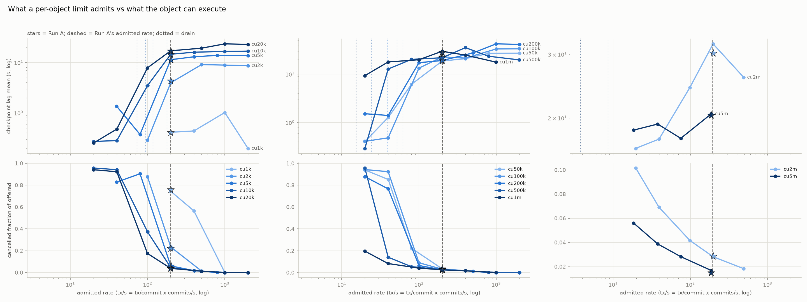
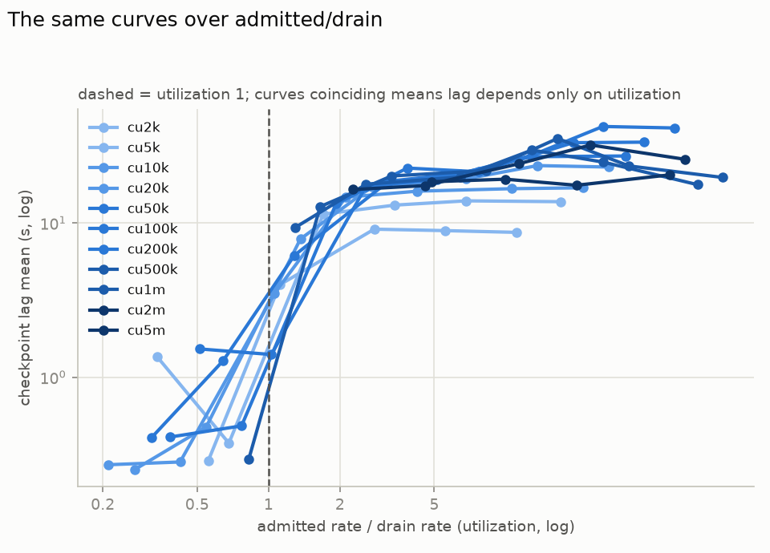

# H2 — congestion-control mode (W5: slow shared-object; count vs units)

**Goal:** measure and report the difference in throughput and latency between
the two per-object congestion-control modes. `TotalTxCount` is the mode every
network runs today: it charges each transaction 1 against a per-object,
per-commit limit of 10, whatever the transaction costs. `TotalComputationUnits`
charges each transaction its attested computation units against a limit given
in units. Each configuration is run twice under identical load — Run A in
`TotalTxCount` ("A"), Run B in `TotalComputationUnits` ("B") — and the two runs
are compared. The stress plan asks for numbers only; there is no pass/fail
threshold. The only pass/fail here is H4 (safety), reported at the end.

80 of the 85 configurations give every transaction in a run the **same**
cost. Those are the control, not the experiment: when every transaction
costs C units, a unit limit of `10 × C` admits the same ten transactions per
commit that a count limit of 10 admits, so the two modes should agree, and
measuring that they do is what makes the grid trustworthy (findings 1–6).
The modes can only differ when one commit carries transactions of
*different* cost; the five `SLOW_MIX` configurations do that, and they are
where the modes part (finding 7).

---

## TL;DR

**The two limits enforce exactly what they are set to, and at one cost per
config the two modes are the same mode.** Across the 12 configs where Run B's
limit is ten times the transaction cost — the unit-limit equivalent of Run
A's count limit of 10 — success throughput agrees to B/A = 1.005 (0.984 to
1.025), and cancellations, checkpoint lag and settlement latency agree the
same way (findings 1, 2). So a network moving from `TotalTxCount` to
`TotalComputationUnits` at a limit of ten mean-cost transactions loses
nothing at uniform cost. It also gains nothing: with one cost, the modes
cannot differ.

**What the limit does is choose where the shortfall lands.** From 5,000 units
per transaction upward, one shared object cannot execute what a limit of ten
per commit admits — it drains 118 tx/s at 5,000 units and 3.7 tx/s at
5,000,000 — and both modes admit more than that. While the limit admits less
than the object can execute, the surplus is cancelled (800–950/s) and
checkpoint lag stays under a second. Once the limit admits more than the
object executes, cancellations fall towards zero and the same surplus
becomes an execution backlog: checkpoint lag jumps to 10–40 s and settlement
latency from under a second to 6–25 s at p95, while success throughput stays
flat at the drain rate (findings 3, 4, 5). Neither mode's limit is tied to
how long a transaction actually takes, so neither can prevent this; a limit
in computation units can at least be set per cost, which a count of 10
cannot.

**With two costs in the same commit, the modes part — and the unit limit
admits more.** Nine cheap transactions for every expensive one, against a
unit limit of ten mean-cost transactions: the count limit admits exactly 10
per commit in every commit, while the unit limit admits 10 when a commit
holds an expensive transaction and up to `limit / cheap cost` when it holds
none — 13 per commit on average at a 10:1 cost ratio, 31 at 100:1. Success
throughput follows: +32 % and +38 % at 10:1, +113 % and +207 % at 100:1,
+46 % at 500:1, with cancellations falling from ≈790/s to 31–730/s. At the
two heaviest mixes the extra work is real work the object must execute, so
checkpoint lag rises from 0.7–2.3 s to 3.9–8.1 s and median settlement from
0.75 s to 2.5–5.5 s; at the three lighter ones both stay flat (finding 7).

**Two things to know when reading the numbers.** The stress client sends a
new transaction only when one of its 2,000 in-flight ones completes, so at
heavy cost the offered load falls with the network's own latency — from the
1,000 tx/s target at 1,000 units to ≈40 tx/s at 5,000,000 — and "1000 QPS"
describes the light configs only (finding 3). And the deferral budget is
counted in leader rounds, not scheduling attempts: a skipped leader round
spends budget without a retry, so 1–4 % of deferred transactions are
cancelled after 11–12 rounds instead of the configured 10, in both modes
alike (finding 6).

**No safety event in 1,600 runs** (H4 PASS).

---

## Experiment as run

H2 sweeps a grid: 12 per-transaction costs, and for each cost a ladder of
`TotalComputationUnits` limits, all at one submission rate. Driven by
`stress-attestation-sequencer/h2/matrix.sh` (each configuration calls
`run.sh`, which bootstraps a fresh network, runs A, resets to the same
genesis with empty databases, runs B, and scrapes Prometheus into one JSON
per run):

- **Workload**: `slow::slow(n, size)` with `size = 100`, shared-object form
  (`SLOW_SHARED=true`): the workload publishes one `slow::Obj` and every
  transaction takes it as a mutable input, so all of them contend on the
  same object and go through per-object congestion control. The input is not
  read by the Move code, so the cost is the same as the owned form measured
  in `probe-test.md`.
- **Cost points** (`slow_n` → attested computation units per transaction,
  measured by the probe and identical on both machines): 1 → 1,000
  (`cu1k`), 70 → 2,000, 120 → 5,000, 160 → 10,000, 217 → 20,000, 267 →
  50,000, 350 → 100,000, 516 → 200,000, 1015 → 500,000, 1848 → 1,000,000,
  3511 → 2,000,000, 8000 → 5,000,000 (`cu5m`). The last is the metering
  ceiling: 5,000,000 units is the gas budget expressed in units, so those
  transactions fail with `InsufficientGas` and are charged the whole budget
  — their work is cut short, which matters when reading `cu5m`'s throughput.
- **Run A**: `TotalTxCount`, limit 10 (production's value), overshoot 0.
- **Run B**: `TotalComputationUnits`, limit `LIMIT_B` in units, overshoot 0.
  Per cost point the limits step geometrically from one rung *below* the
  transaction's own cost (which admits nothing) to where the limit stops
  binding, capped at 50,000,000 (ten ceiling-cost transactions): 4 to 8
  rungs per point, 80 configs. The rung at `10 × cost` is the count limit's
  equivalent, one per cost point.
- **Mixed-cost configs** (5): `SLOW_MIX` draws each transaction's `n` from two
  levels with fixed weights, so one commit holds transactions of two costs.
  Named by their mean cost: `mix1900` (1,000 and 10,000 units, 9:1),
  `mix3700` (1,000 and 10,000, 7:3), `mix10900` (1,000 and 100,000, 9:1),
  `mix20800` (1,000 and 100,000, 4:1), `mix50900` (1,000 and 500,000, 9:1).
  `LIMIT_B` is ten times the mean cost, so Run B's budget is the work Run
  A's count limit admits on average and the spread is the only difference
  between the arms. Their control is the fixed-cost config of the same mean.
- **Both runs**: attestation on, `max_deferral_rounds = 10`, 4 validators.
- **Client**: via the fullnode (`DIRECT=false`), target 1,000 tx/s for 60 s,
  24 workers on 12 threads, 4 gas accounts, at most `2 × 1000 = 2,000`
  transactions in flight: a worker submits a new transaction only when one
  of its in-flight ones has completed.
- **Machine**: all runs on one AMD EPYC 9454P server (48 cores / 96 threads,
  251 GiB RAM, Ubuntu 24.04), running the private network in docker — 4
  validators plus 1 fullnode — with the stress client on the same host.
- **85 configurations**: the 80 fixed-cost configs at **10 iterations** each
  (800 iterations, 1,600 runs, 4–7 August 2026) and the 5 mixed-cost configs
  at **11 iterations** each (55 iterations, 110 runs, 9 September 2026 —
  the first iteration was the accept/reject pass on each config, same
  configuration, kept). Labels read `cu<cost>-lim<LIMIT_B>-qps1000`, e.g.
  `cu10k-lim100k-qps1000`, and `mix<mean>-w<weight>-lim<LIMIT_B>-qps1000`.

Aggregation and reporting tooling (in this directory, sharing
`../aggregate.py`,
`../dump_timeseries.py` and `../exp_dir.py` with H1):

- `aggregate.py` pools every label's iterations (histogram buckets summed
  before quantiles; rates averaged over runs) into one A-vs-B row per config:
  `results/matrix/summary.md` for reading, `results/matrix/summary.csv` for
  plotting.
- `plot.py` renders the cross-config figures into
  `results/matrix/summary_plots/`, the mixed-cost configs in their own figure
  from the per-commit admission histogram `aggregate.py` writes to
  `results/matrix/admits_hist.csv`.

> [!NOTE]
> The stress plan names `transactions_included_in_checkpoint` as H2's
> throughput metric. It is reported here as the finalized rate, but the
> headline throughput is **success tps = executed − cancelled − commits**:
> user transactions that did real work. Checkpoint inclusion lags execution
> by the checkpoint lag, and once that lag approaches the 60 s window it
> undercounts what the window processed — at the three heaviest cost points,
> `included − cancelled − commits` comes out at 0.0, −13.4 and −27.8 tx/s.
> Cancelled transactions are subtracted because they execute but do nothing,
> and the commit rate because every commit carries one consensus commit
> prologue, a system transaction that both counters count.

---

## Findings (10 iterations per configuration)

Numbers below are means over all iterations; latencies are exact histogram
means or quantiles over buckets combined across the 4 validators and all
iterations. Run A is the same configuration in every config of a cost point,
so its spread across those configs is the run-to-run noise: within ±3 % of the
mean everywhere except `cu2k` (156–176 tx/s).

Two effects shape every heavy-cost number and are worth holding in mind:

- **The offered load is not 1,000 tx/s.** The client keeps at most 2,000
  transactions in flight and waits for each to finish, so it can offer only
  2,000 divided by the current latency. At 1,000 units that is the full
  target; at 5,000 units about 200 tx/s arrive; at 500,000 about 80; at
  5,000,000 about 40 (finding 3).
- **Checkpoint lag is measured only for checkpoints built inside the
  window.** A backlog that outlives the 60 s run is never observed, so the
  lag mean is biased low exactly where lag is worst. The share of
  checkpoints past 30 s is the honest tail indicator, and quantiles beyond
  30 s are not measurements at all — the histogram buckets step 25, 30, 60,
  90 — so the tables print `>30` there.

In the figures, one curve per cost point, coloured light to dark by cost;
Run A is drawn as a star or a vertical line, since it is the same admitted
rate in every config of a point.

---

**1. Both limits enforce exactly what they are set to.**

Metric descriptions

| metric | codebase description | aggregation |
| --- | --- | --- |
| `consensus_handler_scheduled_transactions_per_object_per_commit` | Number of transactions admitted (scheduled) to a shared object in a single consensus commit (one observation per object per commit) | histogram; per-commit mean `Δ_sum / Δ_count` combined across validators over all iterations. Observed only on commits that scheduled at least one transaction on the object |
| `consensus_handler_cancelled_transactions` | Number of transactions cancelled by consensus handler | counter; rate, averaged across validators and iterations |
| `consensus_committed_subdags` | Number of committed subdags, sliced by leader | counter; rate = consensus commits per second, averaged across validators |

`admits/cmt` is the transactions each run actually let onto the object per
commit. Run A sits at its limit wherever enough transactions arrive:
9.98–10.00 in every `cu1k` and `cu2k` config. Run B sits at `LIMIT_B / cost`,
rounded down — a limit of 50,000 units admits exactly 2.000 transactions of
20,000 units, never a partial third — in all 25 configs where that quotient is
at or below what the object can execute per commit:

| cost point | `LIMIT_B / cost` → measured B admits/cmt |
| --- | --- |
| `cu1k` | 10 → 9.99, 20 → 19.95, 50 → 49.65 |
| `cu2k` | 5 → 5.00, 10 → 10.00 |
| `cu5k` | 2 → 2.000, 4 → 4.000 |
| `cu10k` | 1 → 1.000, 2 → 2.000, 5 → 5.000 |
| `cu20k` | 1 → 1.000, 2.5 → 2.000, 5 → 4.97 |
| `cu50k` | 1 → 1.000, 2 → 2.000, 4 → 3.999 |
| `cu100k` | 1 → 1.000, 2 → 2.000 |
| `cu200k` | 1 → 1.000, 2.5 → 2.000 |
| `cu500k` | 1 → 1.000, 2 → 2.000 |
| `cu1m`, `cu2m`, `cu5m` | 1 → 1.000 |

The worst deviation is 0.69 % (`cu1k-lim50k`, 49.65 for 50, where 50 per
commit is also all that arrives); most are exact to three decimals. The
scheduler's rule is `start_time + cost <= limit` with a start time of at
least 0, so the 8 configs whose limit is below one transaction's cost admit
nothing at all: Run B there cancels everything that arrives after ten
rounds — 740–950/s in six of the eight, fewer in the two heaviest for the
reason below — and completes 0.4–1.7 tx/s, while Run A in the same config is
unaffected. Above the object's capacity the limit stops mattering and Run
B's admits track Run A's instead (finding 3).

Two of those admit-nothing configs show something else: in `cu2m-lim1m` and
`cu5m-lim2m`, Run B's consensus handler processed only 11.6 and 7.2 commits
per second against Run A's 19.7 and 18.5, with skipped leader rounds
climbing to 74–77 per run from Run A's 24–45 (finding 6). Every transaction
in those runs is deferred and re-evaluated every commit at 2–5 million units
each, and the handler fell behind consensus. It is the only place in the
grid where the mode changed the commit rate; the cause is a follow-up.

---

**2. At one cost per config, the two modes agree — the control holds at every
cost point.**

The 12 configs where `LIMIT_B = 10 × cost` are the unit-limit equivalent of
Run A's count limit of 10. In every one of them the two runs admit the same
number of transactions per commit and complete the same throughput:

| cost point | admits/cmt A → B | success tps A → B | B/A | cancelled/s A → B | ckpt lag mean s A → B |
| --- | --- | --- | --- | --- | --- |
| `cu1k` | 10.00 → 9.99 | 192.7 → 193.2 | 1.003 | 753 → 745 | 0.37 → 0.41 |
| `cu2k` | 9.99 → 10.00 | 176.2 → 176.4 | 1.001 | 226 → 234 | 4.13 → 3.97 |
| `cu5k` | 7.44 → 7.41 | 117.9 → 117.4 | 0.995 | 61 → 61 | 11.3 → 11.4 |
| `cu10k` | 6.47 → 6.38 | 93.6 → 94.5 | 1.009 | 44 → 45 | 14.0 → 14.7 |
| `cu20k` | 5.60 → 5.60 | 73.7 → 74.2 | 1.006 | 38 → 38 | 17.3 → 17.2 |
| `cu50k` | 5.21 → 5.11 | 63.7 → 62.7 | 0.984 | 34 → 34 | 18.5 → 18.7 |
| `cu100k` | 4.73 → 4.79 | 51.1 → 52.0 | 1.016 | 31 → 31 | 23.2 → 22.7 |
| `cu200k` | 4.51 → 4.51 | 38.8 → 39.3 | 1.013 | 26 → 26 | 19.6 → 19.1 |
| `cu500k` | 4.05 → 4.04 | 24.1 → 24.2 | 1.003 | 25 → 25 | 22.1 → 21.9 |
| `cu1m` | 3.78 → 3.77 | 15.5 → 15.6 | 1.004 | 26 → 25 | 29.0 → 29.7 |
| `cu2m` | 4.33 → 4.38 | 8.4 → 8.4 | 1.002 | 29 → 28 | 30.0 → 32.1 |
| `cu5m` | 4.83 → 4.67 | 3.2 → 3.3 | 1.025 | 17 → 17 | 19.7 → 20.5 |

B/A on success throughput averages 1.005 over the twelve, between 0.984 and
1.025 — inside the run-to-run noise of Run A itself. Settlement latency
agrees the same way (finding 5). This is the expected result, and it is the
one that makes the rest of the grid usable: it shows that a limit in units
and a limit in count are interchangeable at uniform cost, so any difference
in a mixed-cost config is the cost spread and nothing else. The other 68 configs
vary `LIMIT_B` away from that equivalence and are read in findings 3 and 4.

*Every config at a glance: success tps, cancelled share, checkpoint lag mean
and share past 30 s, one panel each, Run A in the top row and each `LIMIT_B`
rung below it, coloured on one scale per panel so equal values look equal
everywhere. The `10 × cost` column matches the Run A row in every panel.*

---

**3. Throughput is set by how fast one object can execute the transaction,
and from 5,000 units up neither limit reaches it.**

Metric descriptions

| metric | codebase description | aggregation |
| --- | --- | --- |
| `execution_driver_executed_transactions` | Cumulative number of transaction executed by execution driver | counter; rate, averaged across validators and iterations. Counts cancelled transactions and the per-commit system transaction too, hence the success formula |
| `transactions_included_in_checkpoint` | Transactions included in a checkpoint | counter; rate, averaged across validators — the finalized rate, prologues included |
| `consensus_handler_deferred_transactions` | Number of transactions deferred by consensus handler | counter; rate. A transaction counts once for every commit it stays deferred |

Transactions on one mutable shared object execute one after another, so the
object has a top speed for each cost: the success rate in the configs whose
limit admits more than that. Read off the grid, it falls 50-fold across the
cost range while the count limit stays at 10 per commit throughout:

| cost point | units/tx | object drains (tx/s) | arrivals/s | scheduled/s | success tps | scheduled / success |
| --- | --- | --- | --- | --- | --- | --- |
| `cu1k` | 1,000 | not reached (client-limited) | 943 | 190 | 192.7 | 0.99 |
| `cu2k` | 2,000 | 179 | 424 | 198 | 176.2 | 1.12 |
| `cu5k` | 5,000 | 118 | 205 | 144 | 117.9 | 1.22 |
| `cu10k` | 10,000 | 94 | 163 | 119 | 93.6 | 1.28 |
| `cu20k` | 20,000 | 73 | 141 | 103 | 73.7 | 1.39 |
| `cu50k` | 50,000 | 62 | 127 | 93 | 63.7 | 1.46 |
| `cu100k` | 100,000 | 52 | 113 | 82 | 51.1 | 1.60 |
| `cu200k` | 200,000 | 39 | 96 | 70 | 38.8 | 1.80 |
| `cu500k` | 500,000 | 24 | 80 | 55 | 24.1 | 2.30 |
| `cu1m` | 1,000,000 | 15 | 72 | 46 | 15.5 | 2.94 |
| `cu2m` | 2,000,000 | 8.5 | 65 | 36 | 8.4 | 4.27 |
| `cu5m` | 5,000,000 | 3.7 | 40 | 23 | 3.2 | 7.08 |

Run A at the count limit of 10; scheduled = the admits histogram's sum
rate; arrivals = scheduled + cancelled, everything the client got into
consensus. Run B at `10 × cost` is identical to within 1 %.

Three things follow.

*The offered load collapses with cost.* The client can only offer 2,000
transactions divided by how long each takes. At 1,000 units that is the
full 1,000 tx/s (943 arrive); by 5,000 units settlement takes 6.6 s at the
median and about 200 tx/s arrive; at 5,000,000 units, 40 tx/s. So the configs
from `cu5k` up do not measure the network under a 1,000 tx/s load — they
measure it under whatever load its own latency lets through. The target
rate describes the two lightest cost points only.

*The scheduler admits more than the object executes.* Scheduled exceeds
success by 12 % at 2,000 units and by 7× at 5,000,000 — every scheduled
transaction beyond the drain rate joins an execution backlog that grows for
the whole window. Both limits let this happen because neither is a measure
of time: a count of 10 is the same ten transactions whether each takes 0.5
ms or 300 ms, and `10 × cost` units is the same amount of "work" whether the
machine executes a unit in a nanosecond or a microsecond. The backlog is
what checkpoint lag measures (finding 4).

*Admission falls short of the limit under overload, in both modes.* In the
commits where the object received anything, Run A admitted 7.4 per commit
at `cu5k` and 3.8 at `cu1m` against a limit of 10 — with dozens of deferred
transactions queued (57 per commit at `cu5k`) and a quarter of commits
admitting only 2–5. The share of commits that scheduled anything at all
falls from 95 % at `cu1k` to 25 % at `cu5m`. Run B at the matched limit shows
the same numbers, so it does not affect the A-vs-B comparison, but it means
the scheduler leaves capacity unused while transactions wait and are later
cancelled. Slot debt cannot explain it (with overshoot 0 there is none), and
the suggested-gas-price machinery is advisory in this code path. The cause is
open and worth a dedicated look.

*Checkpoint lag (top) and cancelled share (bottom) against the admitted
rate, `admits/cmt × commits/s`, one curve per cost point; Run A is the
vertical line at 10 per commit. Where that line sits right of a curve's
bend, the count limit admits more than the object can execute; left of it,
less.*

---

**4. The limit chooses where the shortfall lands: cancelled before
consensus, or queued after it.**

Metric descriptions

| metric | codebase description | aggregation |
| --- | --- | --- |
| `checkpoint_creation_latency` | Latency from consensus commit timestamp to local checkpoint creation in milliseconds | histogram; the exact mean from `Δ_sum / Δ_count` and the share of observations above the 30 s bucket edge, combined across validators over all iterations. Quantiles past 30 s print as `>30` |

Along each cost point's ladder the same picture repeats. While the limit
admits fewer transactions than the object can execute, the surplus is
deferred and cancelled at ten rounds — 800–950/s, most of what arrives —
and checkpoint lag stays under 1.5 s because nothing scheduled waits for
execution. The first rung whose admitted rate reaches the drain rate flips
it: cancellations fall towards zero, success flattens at the drain rate,
and lag jumps by an order of magnitude and keeps growing with the limit:

| cost point | drain (tx/s) | last rung under it: admitted/s → lag s, cancelled/s | first rung over it: admitted/s → lag s, cancelled/s |
| --- | --- | --- | --- |
| `cu2k` | 179 | 100 → 0.3, 877 | 200 → 4.0, 234 |
| `cu5k` | 118 | 80 → 0.4, 904 | 148 → 11.4, 60 |
| `cu10k` | 94 | 40 → 0.3, 942 | 100 → 3.5, 372 |
| `cu20k` | 73 | 40 → 0.5, 923 | 99 → 7.9, 175 |
| `cu50k` | 62 | 40 → 1.3, 852 | 80 → 6.2, 223 |
| `cu100k` | 52 | 40 → 0.5, 924 | 88 → 13.3, 89 |
| `cu200k` | 39 | 40 → 1.4, 767 | 79 → 17.3, 64 |
| `cu500k` | 24 | 20 → 0.3, 957 | 40 → 12.8, 140 |
| `cu1m` | 15 | — | 20 → 9.3, 196 |
| `cu2m` | 8.5 | — | 20 → 16.5, 102 |
| `cu5m` | 3.7 | — | 18 → 18.5, 56 |

The three heaviest points are over the drain rate at their very first rung
(one transaction per commit is already 18–20 tx/s against a drain of 4–15),
so for them every admitting limit builds a backlog. Past the flip, raising
the limit further changes little: at `cu50k` the rungs from 4 to 100
transactions per commit all complete 60–64 tx/s, while the lag mean climbs
from 6 s to 27 s and the share of checkpoints past 30 s from 0 to 30 %. At
`cu100k` and `cu200k` the top rungs put 85–90 % of checkpoints past 30 s,
and their lag means of 33–42 s are lower bounds (see the note on the 60 s
window above).

This is the actual trade the limit makes. A tight limit turns the surplus
into cancellations, which the client sees as failures within ten rounds and
can resubmit; a loose one turns it into a queue, which the client sees as
latency and the network as checkpoint lag. Success throughput is the same
either way once the object is saturated, so there is no setting of either
mode that raises it — only a choice of failure mode.

*Success tps against checkpoint lag mean, one point per config, Run A starred.
Lower-right is fast and stable; the configs arc up and right as the limit
loosens: no extra throughput, more lag.*

*The curves of finding 3 with the x-axis divided by each cost point's drain
rate. They land close to one line: cost enters only through how full the
object is.*

---

**5. Latency: identical between modes at matched limits; set by the
backlog, not the mode.**

Metric descriptions

| metric | codebase description | aggregation |
| --- | --- | --- |
| `transaction_driver_settlement_finality_latency` | Settlement finality latency observed from transaction driver | histogram on the fullnode (the runs submit through it); p50/p95 over buckets combined across iterations |
| `validator_transaction_execution_latency` | Validator-internal latency from receiving a transaction via `submit_tx` until it finished executing (pre-consensus check, consensus, post-consensus validation, sequencing incl. deferral, execution) | histogram; p95 over buckets combined across validators and iterations |
| `authority_state_internal_execution_latency` | Latency of actual certificate executions | histogram; mean, validators only. Blends the per-commit system transactions and the cancelled transactions in with the workload, so it understates the workload's cost where cancellations are many |

At the twelve matched configs the client-facing latency is the same in both
modes at every cost point:

| cost point | settlement p50 ms A → B | settlement p95 ms A → B | receipt→executed p95 ms A → B | VM exec mean ms A → B |
| --- | --- | --- | --- | --- |
| `cu1k` | 727 → 726 | 872 → 872 | 984 → 986 | 0.23 → 0.23 |
| `cu2k` | 784 → 789 | 7,457 → 7,291 | 7,087 → 6,852 | 2.43 → 2.39 |
| `cu5k` | 6,646 → 6,635 | 18,866 → 18,861 | 18,418 → 18,435 | 5.05 → 5.07 |
| `cu10k` | 8,609 → 8,692 | 23,406 → 23,345 | 25,323 → 24,930 | 6.36 → 6.31 |
| `cu20k` | 8,804 → 8,874 | 27,879 → 28,028 | 26,868 → 26,953 | 7.60 → 7.58 |
| `cu50k` | 6,173 → 6,437 | 27,740 → 27,818 | 28,488 → 28,395 | 8.55 → 8.57 |
| `cu100k` | 3,031 → 3,003 | 26,668 → 26,675 | 45,639 → 44,960 | 9.80 → 9.75 |
| `cu200k` | 4,163 → 4,409 | 25,594 → 25,706 | 50,291 → 50,251 | 11.8 → 11.8 |
| `cu500k` | 851 → 881 | 24,831 → 24,774 | 48,740 → 48,447 | 14.4 → 14.4 |
| `cu1m` | 1,453 → 1,411 | 25,674 → 24,278 | 45,999 → 47,819 | 16.3 → 16.5 |
| `cu2m` | 3,694 → 3,695 | 21,921 → 21,906 | 47,756 → 47,556 | 17.6 → 17.7 |
| `cu5m` | 7,781 → 7,881 | 21,647 → 21,145 | 45,127 → 44,626 | 26.4 → 25.1 |

Along a ladder, latency follows the backlog of finding 4 and nothing else.
Every rung that admits less than the drain rate settles in ≈ 730–750 ms at
the median and ≈ 900 ms at p95, at every cost from 1,000 to 500,000 units,
because a transaction that is admitted executes at once and the rest are
cancelled within ten rounds. The first rung over the drain rate takes p95
to 6–25 s while the median mostly holds near 750 ms — the queue is not yet
long enough to reach the typical transaction — and one or two rungs further
the median follows, to 3–16 s. Receipt-to-executed p95 — the validator's own
view, including time spent deferred — reaches 45–56 s at the heavy points,
close to the window length. The median's non-monotonic
path down the cost column (8.8 s at `cu20k`, 0.85 s at `cu500k`) is the
client's shrinking offered load: with fewer transactions in flight, the
ones that do get admitted wait behind fewer others.

The VM execution column is the blended
`authority_state_internal_execution_latency` (the user-only variant was
added after these runs). It grows from 0.23 to
26 ms across the cost range on this machine and is identical between modes
— cost is a property of the transaction, and the mode only decides how many
of them are let in.

---

**6. The deferral budget is spent in leader rounds, so a skipped round
cancels transactions a round early — in both modes.**

Metric descriptions

| metric | codebase description | aggregation |
| --- | --- | --- |
| `consensus_handler_transaction_deferral_rounds` | Number of consensus rounds a transaction spent deferred before it was scheduled or cancelled | histogram; share of observations above 10, combined across validators and iterations |
| `consensus_handler_leader_round` | The leader round of the current consensus output being processed in the consensus handler | gauge; its advance over a run minus the commits in that run = skipped leader rounds (validator-1) |

With `max_deferral_rounds = 10` a deferred transaction should be cancelled
on its tenth round, so the deferral-rounds histogram should never exceed 10.
It does, in every config of both modes: 1 % of deferral resolutions at
`cu1k` under Run A land in the (10, 20] bucket, 4 % under Run B, 1–3 % at
the heavy points — 496,000 observations in Run A and 1,594,000 in Run B
over the whole grid. The excess is small (the real values are 11–12) and it
is not a difference between the modes.

The mechanism is how the budget is counted. A transaction's deferral key
records the leader round it was first deferred from
(`DeferralKey::ConsensusRound { future_round, deferred_from_round }`), the
limit check compares `future_round − deferred_from_round` against the
maximum, and the round used is the commit's leader round
(`consensus_handler.rs:243`, `consensus_output.leader_round()`). Consensus
does not produce a commit for every leader round: over a 60 s run the leader
round advances 23–44 times more than the number of commits, in both modes,
at every cost point (2–4 % of ≈ 1,200 commits). Each skipped round moves the
counter without a scheduling attempt, so a transaction deferred across one
skipped round is cancelled after nine evaluations, and the rounds it is
charged (`commit_round.saturating_sub(deferred_from_round)`,
`authority_per_epoch_store.rs`) read 11 or 12.

The consequence for the numbers here is small. The consequence for the
design is that the budget is not what it says: it is "ten leader rounds",
not "ten chances to be scheduled", and under consensus conditions that skip
more rounds the gap grows. Counting evaluations rather than the round
difference would make the two the same; this is worth an upstream issue.

---

**7. With two costs in one commit the modes part: the count limit pins the
number admitted, the unit limit pins the work — and admits more.**

The six findings above hold cost fixed within a run, so the two modes could
only agree. The five `SLOW_MIX` configs give the transactions in one commit two
costs. Measured over 11 iterations, the mix is what was configured — 90.0 %
cheap at `mix1900`, `mix10900` and `mix50900`, 70.0 % at `mix3700`, 79.8 %
at `mix20800`, mean cost within 1.7 % of design — and Run A's count limit
binds in every config (`admits/cmt` 10.00), so every config measures what it
was meant to.

| config | costs (units), ratio | admits/cmt A → B | success tps A → B | B/A | cancelled/s A → B | ckpt lag mean s A → B |
| --- | --- | --- | --- | --- | --- | --- |
| `mix1900` | 1K / 10K, 9:1 | 10.00 → 13.3 | 200.9 → 265.9 | 1.32 | 793 → 719 | 0.42 → 0.44 |
| `mix3700` | 1K / 10K, 7:3 | 10.00 → 13.6 | 198.4 → 272.9 | 1.38 | 788 → 727 | 0.55 → 0.34 |
| `mix10900` | 1K / 100K, 9:1 | 10.00 → 31.5 | 199.9 → 626.7 | 3.13 | 791 → 366 | 0.78 → 0.63 |
| `mix20800` | 1K / 100K, 4:1 | 10.00 → 21.6 | 194.7 → 402.9 | 2.07 | 786 → 186 | 0.74 → 3.88 |
| `mix50900` | 1K / 500K, 9:1 | 10.0 → 14.8 | 181.9 → 265.0 | 1.46 | 788 → 31 | 2.34 → 8.06 |

*How the number swings.* Run A admits exactly 10 in every commit of every
config — 100 % of its commits sit in the 7–10 bucket of the admission
histogram. Run B's budget is `10 × mean cost` in units, so what it admits
depends on what the commit holds. At `mix1900` the budget is 19,000 units: a
commit holding one 10,000-unit transaction has room for 9 cheap ones (10 in
all), a commit holding none fits 19. The measured distribution is 63 % of
commits at 7–10 and 37 % at 10–20, mean 13.3. At `mix10900` the budget is
109,000: one expensive transaction plus 9 cheap, or 109 cheap — 78 % of
commits at 7–10 and 22 % at 100–200, mean 31.5. The all-cheap commits are
the ones where no expensive transaction was waiting; with 20 % expensive
(`mix20800`) they are rarer, 11 %, and the mean drops to 21.6. So the size
of the effect is set by the **ratio** between the two costs, which sets how
far the number can swing, not by the mean: the two 10:1 configs gain a third,
the two 100:1 configs double and triple.

*What the extra admissions are.* Cheap transactions that a count of 10
would have deferred and, mostly, cancelled after ten rounds. Under the count
limit a 1,000-unit transaction and a 100,000-unit one are the same one slot;
under the unit limit the cheap one costs a hundredth of the budget, so the
budget a commit's expensive transaction leaves unused is filled with cheap
ones instead of being spent on deferrals. Cancellations fall accordingly,
from ≈790/s in every Run A to 719, 727, 366, 186 and 31/s, and success
throughput rises by the same transactions.

*Where it costs something.* At the three lighter mixes the gain is free:
checkpoint lag and settlement latency are unchanged (0.3–0.8 s lag, ≈730 ms
median settlement in both arms). At `mix20800` and `mix50900` they are not:
lag goes from 0.74 to 3.88 s and from 2.34 to 8.06 s, median settlement from
≈745 ms to 2.5 and 5.5 s, p95 from 1.3–3.9 s to 6.6–13.8 s. The extra work
here is not only cheap transactions. Run A's queue is first-come, and it
cancels expensive transactions at the same rate as cheap ones; Run B holds an
expensive transaction until it fits and admits cheap ones around it, so it
executes more of the expensive ones — and a 500,000-unit transaction is
≈80 ms of execution on this machine, against 0.6 ms for a cheap one. More of
those per second is more real work than one object drains, and the backlog
of finding 4 follows. `mix50900` also shows Run B admitting fewer than seven
in a quarter of its commits: its expensive level is 98 % of the budget, so a
commit that schedules one has room for nine cheap ones at most, and the
client's offered load at that latency (≈300 tx/s) leaves some commits with
few cheap ones eligible.

*Top: the share of commits that admitted each number of transactions to the
object, Run A (blue) next to Run B (orange), one panel per config. Bottom:
success throughput, cancellations and checkpoint lag, A next to B.*

This is the answer to the question the stress plan poses for H2. At uniform
cost the two modes are interchangeable and `TotalComputationUnits` is a
drop-in replacement (finding 2). With a cost spread — the situation any real
shared object is in — it admits the cheap transactions a count limit turns
away, for more throughput at the same limit, and the price is paid only where
the spread includes transactions heavy enough that executing more of them
overruns the object. Which limit is right then depends on how much
checkpoint lag is acceptable — a product decision the plan leaves open.

---

## H4 — safety (pass/fail)

**PASS.** All safety counters are zero across all 1,600 runs of the 80
configurations — checkpoint forks (`split_brain_checkpoint_forks`,
`remote_checkpoint_forks`), inconsistent state hash, double-spend attempts,
attestation task panics, soft-lock equivocation — and the per-iteration node
state scan found no validator crash, restart or OOM inside any measurement
window. The metric descriptions are in `../h1/RESULTS.md`, H4 section. The
only
run-to-run irregularity anywhere in the grid is the consensus-handler
slowdown of finding 1, which is a performance observation, not a safety
event.

---

## Summary

The takeaway is the TL;DR at the top of this document. Full per-config
numbers: `results/matrix/summary.md` and `summary.csv`; figures:
`results/matrix/summary_plots/`; the cost calibration behind the grid:
`probe-test.md`.
