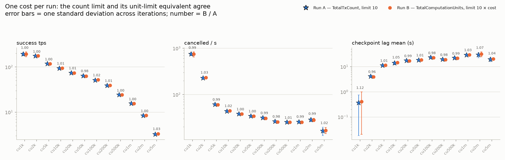
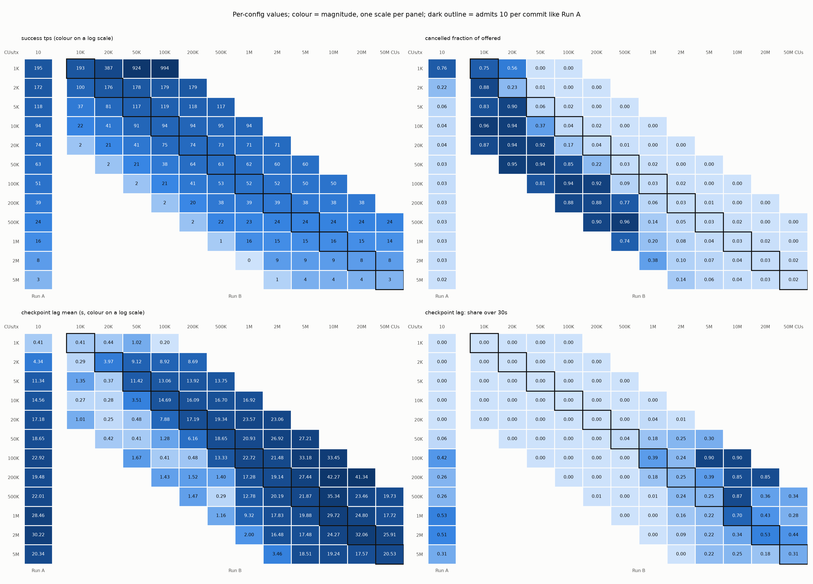
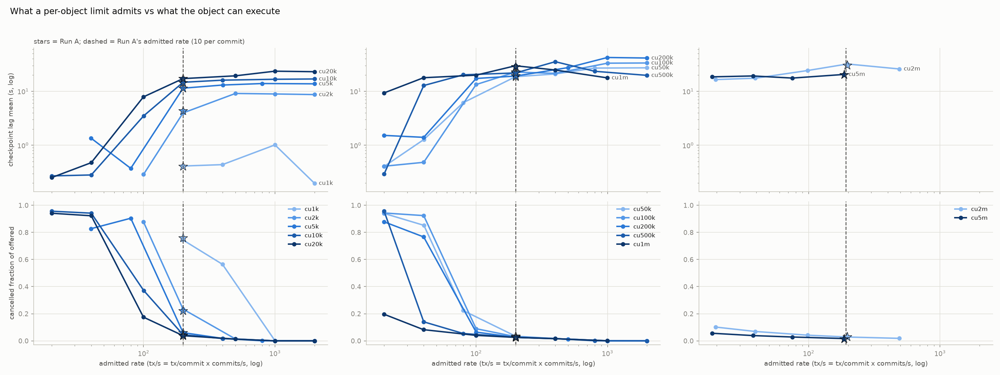
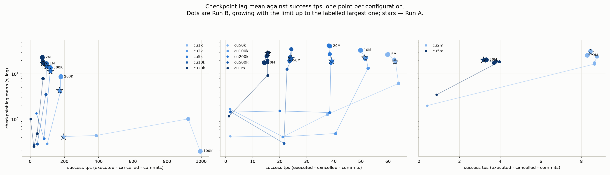
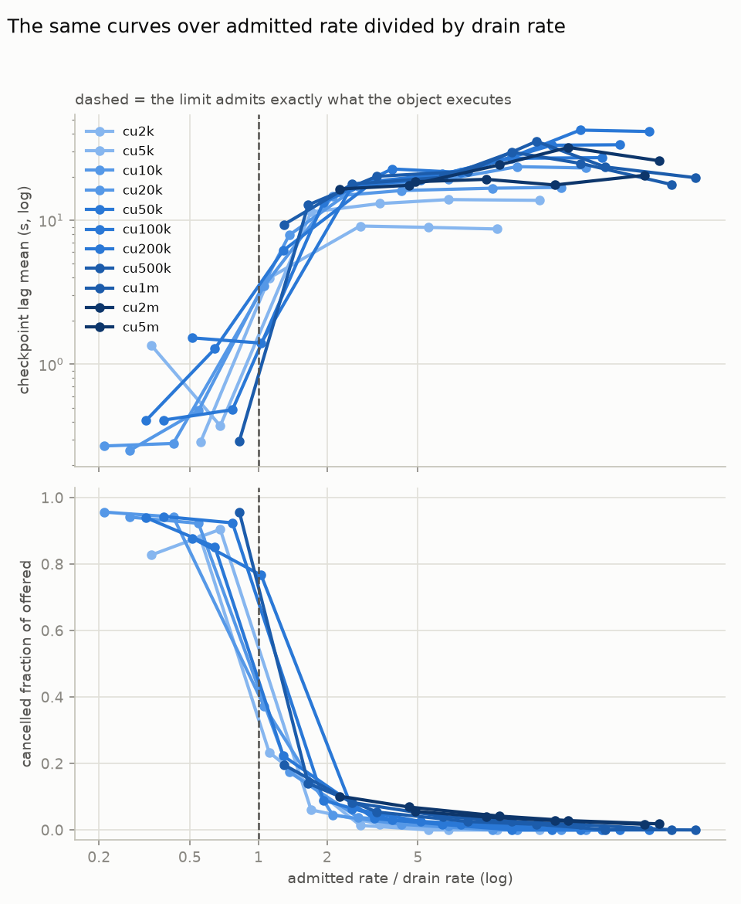
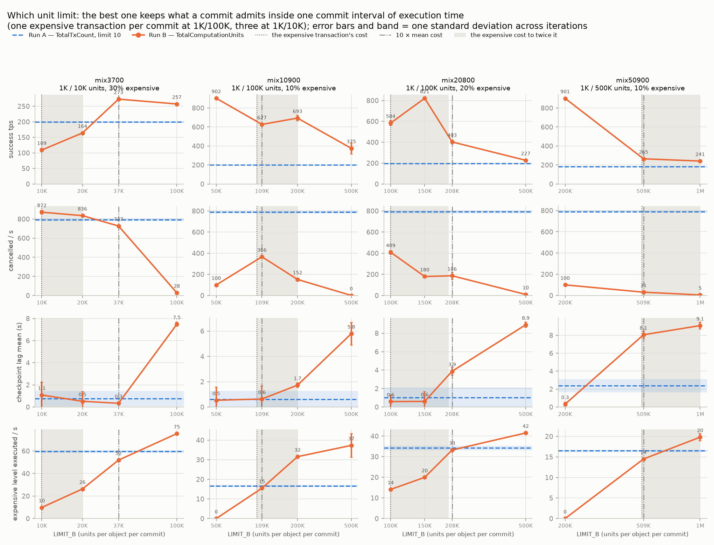
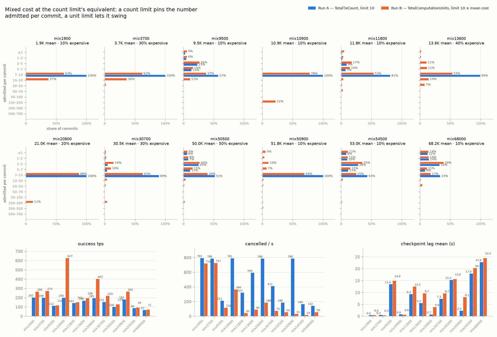
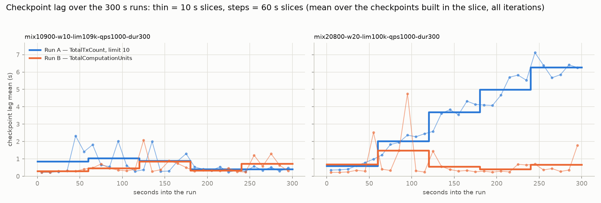
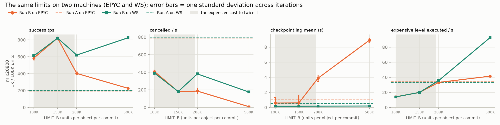

# H2 — congestion-control mode (W5: slow shared-object; count vs units)

**Goal:** measure and report the difference in throughput and latency between
the two per-object congestion-control modes. `TotalTxCount` is the mode every
network runs today: it charges each transaction 1 against a per-object,
per-commit limit of 10, whatever the transaction costs. `TotalComputationUnits`
charges each transaction its attested computation units against a limit given
in units. Each configuration is run twice under identical load — Run A in
`TotalTxCount` ("A"), Run B in `TotalComputationUnits` ("B") — and the two runs
are compared. The stress plan asks for numbers only; there is no pass/fail
threshold. The only pass/fail here is H4 (safety), reported at the end.

80 of the 105 configurations give every transaction in a run the **same**
cost. Those are the control, not the experiment: when every transaction
costs C units, a unit limit of `10 × C` admits the same ten transactions per
commit that a count limit of 10 admits, so the two modes should agree, and
measuring that they do is what makes the grid trustworthy (findings 1–6).
The modes can only differ when one commit carries transactions of
*different* cost; the 25 `SLOW_MIX` configurations do that, and they are
where the modes differ (finding 7).

---

## TL;DR

**The two limits enforce exactly what they are set to, and at one cost per
config the two modes are the same mode.** Across the 12 configs where Run B's
limit is ten times the transaction cost — the unit-limit equivalent of Run
A's count limit of 10 — success throughput agrees to B/A = 1.005 (0.984 to
1.025), and cancellations, checkpoint lag and settlement latency agree the
same way (findings 1, 2). So a network moving from `TotalTxCount` to
`TotalComputationUnits` at a limit of ten mean-cost transactions loses
nothing at uniform cost. It also gains nothing: with one cost, the modes
cannot differ.

**What the limit does is choose where the shortfall lands.** From 5,000 units
per transaction upward, one shared object cannot execute what a limit of ten
per commit admits — it drains 118 tx/s at 5,000 units and 3.7 tx/s at
5,000,000 — and both modes admit more than that. While the limit admits less
than the object can execute, the surplus is cancelled (800–950/s) and
checkpoint lag stays under a second. Once the limit admits more than the
object executes, cancellations fall towards zero and the same surplus
becomes an execution backlog: checkpoint lag jumps to 10–40 s and settlement
latency from under a second to 6–25 s at p95, while success throughput stays
flat at the drain rate (findings 3, 4, 5). Neither mode's limit is tied to
how long a transaction actually takes, so neither can prevent this; a limit
in computation units can at least be set per cost, which a count of 10
cannot.

**With two costs in the same commit the modes differ, and a well-chosen
unit limit does better than the count limit on throughput, cancellations and
lag.** Nine cheap transactions for
every expensive one: the count limit admits exactly 10 per commit, always;
the unit limit admits 10 when a commit holds an expensive transaction and up
to `limit / cheap cost` when it holds none. At the count limit's equivalent
(`10 × mean cost`) that already gives 1.3–3.1× the throughput at fewer
cancellations. But that equivalent is not the best limit. Running each mix
at several limits shows what the best limit does: it lets a commit admit
about one commit interval of execution time. At 1K/100K, where one
expensive transaction takes ≈34 ms of the ≈50 ms interval, that is one
expensive transaction per commit with the rest of the limit left for cheap
ones: a limit from the expensive cost up to, but not including, twice it,
so that one fits and two never do. At 100K–150K units that gives 3–4× the
count limit's throughput, about half its cancellations or fewer, and
checkpoint lag no higher than the count limit's, flat over a 300 s run
where the count limit's lag climbs from 0.6 to 6 s. Where the expensive
transaction is small against the interval (10,000 units, ≈16 ms) the same
rule allows three per commit, and the limits at one to two times the
expensive cost admit too little and fall below the count limit. Two
conditions bound the gain: the cheap transactions must be cheap enough that
a count of 10 leaves the object idle (with 2,000–5,000-unit "cheap"
transactions the object is already full and the modes agree again), and a
transaction whose execution alone exceeds the commit interval (500,000
units, ≈80 ms here) has no good limit — admitting one per commit lags,
excluding it never lets it through. The same limit ladder on a second
machine reproduces the peak to within a few percent; past it, the machine
that executes a 100K-unit transaction 4.6× faster keeps up where EPYC does
not, so a limit below twice the expensive cost is the safe choice on both
(finding 7).

**How to read the numbers.** The stress client sends a
new transaction only when one of its 2,000 in-flight ones completes, so at
heavy cost the offered load falls with the network's own latency — from the
1,000 tx/s target at 1,000 units to ≈40 tx/s at 5,000,000 — and "1000 QPS"
describes the light configs only (finding 3). And the deferral limit is
counted in leader rounds, not scheduling attempts: a skipped leader round
uses up a round without a retry, so 1–4 % of deferred transactions are
cancelled after 11–12 rounds instead of the configured 10, in both modes
alike (finding 6).

**No safety event in any of the 2,150 runs** (H4 PASS).

---

## Experiment as run

H2 sweeps a grid: 12 per-transaction costs, and for each cost a ladder of
`TotalComputationUnits` limits, all at one submission rate. Driven by
`stress-attestation-sequencer/h2/matrix.sh` (each configuration calls
`run.sh`, which bootstraps a fresh network, runs A, resets to the same
genesis with empty databases, runs B, and scrapes Prometheus into one JSON
per run):

- **Workload**: `slow::slow(n, size)` with `size = 100`, shared-object form
  (`SLOW_SHARED=true`): the workload publishes one `slow::Obj` and every
  transaction takes it as a mutable input, so all of them contend on the
  same object and go through per-object congestion control. The input is not
  read by the Move code, so the cost is the same as the owned form measured
  in `probe-test.md`. The plan names W1 (`--shared-counter`) as H2's
  workload; it is not run separately, because with one counter every
  transaction costs the 1,000-unit floor on one hot object, which is what
  the `cu1k` configs measure with `slow`.
- **Cost points** (`slow_n` → attested computation units per transaction,
  measured by the probe and identical on both machines): 1 → 1,000
  (`cu1k`), 70 → 2,000, 120 → 5,000, 160 → 10,000, 217 → 20,000, 267 →
  50,000, 350 → 100,000, 516 → 200,000, 1015 → 500,000, 1848 → 1,000,000,
  3511 → 2,000,000, 8000 → 5,000,000 (`cu5m`). The last is the metering
  ceiling: 5,000,000 units is the gas budget expressed in units, so those
  transactions fail with `InsufficientGas` and are charged the whole budget
  — their work is cut short, which matters when reading `cu5m`'s throughput.
- **Run A**: `TotalTxCount`, limit 10, overshoot 0. Production runs this
  mode with limit 10 and an overshoot of 100 (protocol version 22 and
  later); the overshoot is off here, in both runs, so that each run is
  described by one number and no debt is carried between commits. The
  comparison is therefore between the two limits, not against production's
  exact setting; a rerun with the overshoot on is listed under next steps
  in `README.md`.
- **Run B**: `TotalComputationUnits`, limit `LIMIT_B` in units, overshoot 0.
  Per cost point the limits step geometrically from one rung *below* the
  transaction's own cost (which admits nothing) to where the limit stops
  binding, capped at 50,000,000 (ten ceiling-cost transactions): 4 to 8
  rungs per point, 80 configs. The rung at `10 × cost` is the count limit's
  equivalent, one per cost point.
- **Mixed-cost configs** (25): `SLOW_MIX` draws each transaction's `n` from
  two (or three) levels with fixed weights, so one commit holds transactions
  of different costs. Named by their mean cost and expensive share, e.g.
  `mix10900-w10`: 1,000 and 100,000 units, 9:1. Five mixes were run at
  `LIMIT_B = 10 × mean cost`, the count limit's equivalent (`mix1900`,
  `mix3700`, `mix10900`, `mix20800`, `mix50900`). A second round added 20
  more: limit ladders on four of those mixes (2–4 further limits each,
  including one below the expensive cost); the same expensive level with a
  costlier cheap side, near the 10K and 55K means (`mix9500` 5K/50K,
  `mix11800` 2K/100K, `mix54500` 5K/500K, `mix68000` 20K/500K); 1K/100K at
  30 % and 50 % expensive (`mix30700`, `mix50500`); one three-level mix
  (`mix13600`: 1K/10K/100K at 60/30/10 %); and 300 s runs of two configs
  (`-dur300`). Each mix's control is the fixed-cost config of the same mean.
  Finally the `mix20800` ladder (4 configs) was rerun on the second machine
  of `probe-test.md`, a Ryzen 9 9950X3D workstation (WS below), where a
  100K-unit transaction executes in 7.4 ms instead of 34 — with `-ws`
  labels, kept under `results/matrix-ws/` so they never mix with the EPYC
  data.
- **Both runs**: attestation on, `max_deferral_rounds = 10`, 4 validators.
- **Client**: via the fullnode (`DIRECT=false`), target 1,000 tx/s for 60 s,
  24 workers on 12 threads, 4 gas accounts, at most `2 × 1000 = 2,000`
  transactions in flight: a worker submits a new transaction only when one
  of its in-flight ones has completed.
- **Rate**: one target rate, 1,000 tx/s, for every config. The plan asks to
  raise the rate to saturation; here that has no room: at 1,000 units the
  limit already binds at this rate, and from 5,000 units up the client's
  in-flight cap lowers what it offers to what the object can execute, so a
  higher target would not change what arrives (finding 3).
- **Machine**: all runs on one AMD EPYC 9454P server (48 cores / 96 threads,
  251 GiB RAM, Ubuntu 24.04), running the private network in docker — 4
  validators plus 1 fullnode — with the stress client on the same host.
- **105 configurations**: the 80 fixed-cost configs at **10 iterations**
  each (800 iterations, 1,600 runs, 4–7 August 2026); the first five mixes at
  **11** (one iteration was run first to check the configuration, then ten
  more; same configuration, so all eleven are pooled); the 20 second-round
  mixes at **10** (9–10 September 2026). 1,055 iterations, 2,110 runs in
  all. Labels read `cu<cost>-lim<LIMIT_B>-qps1000` and
  `mix<mean>-w<weight>-lim<LIMIT_B>-qps1000`, with `-dur300` for the 300 s
  runs. The WS rerun adds 4 configs at 5 iterations, 40 runs (11
  September).

Aggregation and reporting tooling (in this directory, sharing
`../aggregate.py`,
`../dump_timeseries.py` and `../exp_dir.py` with H1):

- `aggregate.py` pools every label's iterations (histogram buckets summed
  before quantiles; rates averaged over runs) into one A-vs-B row per config:
  `results/matrix/summary.md` for reading, `results/matrix/summary.csv` for
  plotting. It also writes the spread of each value across the iterations,
  the rate of transactions executed at the expensive level of a mix, the
  per-commit admission histogram (`admits_hist.csv`) and the checkpoint lag
  per 10 s and 60 s slice of the window (`lag_over_time.csv`).
- `plot.py` renders the figures into `results/matrix/summary_plots/`; with
  `results/matrix-ws` as a second argument it also draws the two machines
  together.

> [!NOTE]
> The stress plan names `transactions_included_in_checkpoint` as H2's
> throughput metric. It is reported here as the finalized rate, but the
> headline throughput is **success tps = executed − cancelled − commits**:
> user transactions that did real work. Checkpoint inclusion lags execution
> by the checkpoint lag, and once that lag approaches the 60 s window it
> undercounts what the window processed — at the three heaviest cost points,
> `included − cancelled − commits` comes out at 0.0, −13.4 and −27.8 tx/s.
> Cancelled transactions are subtracted because they execute but do nothing,
> and the commit rate because every commit carries one consensus commit
> prologue, a system transaction that both counters count.

---

## Findings (10 iterations per config, 11 for the first five mixes, 5 on the WS)

Numbers below are means over all iterations; latencies are exact histogram
means or quantiles over buckets combined across the 4 validators and all
iterations. Run A is the same configuration in every config of a cost point,
so its spread across those configs is the run-to-run noise: within ±3 % of the
mean everywhere except `cu2k` (156–176 tx/s). Within one config, the standard
deviation of success throughput across its iterations is 1–4 % of the mean
at most cost points, up to 12 % at `cu1k` and 14 % at `cu5m`, where the
offered load varies most; `results/matrix/summary.md` lists it per config,
and the figures draw it as error bars.

Keep the client's in-flight cap and the 60 s window in mind when reading the
heavy-cost numbers:

- **The offered load is not 1,000 tx/s.** The client keeps at most 2,000
  transactions in flight and waits for each to finish, so it can offer only
  2,000 divided by the current latency. At 1,000 units that is the full
  target; at 5,000 units about 200 tx/s arrive; at 500,000 about 80; at
  5,000,000 about 40 (finding 3).
- **Checkpoint lag is measured only for checkpoints built inside the
  window.** A backlog that outlives the 60 s run is never observed, so the
  lag mean is biased low exactly where lag is worst. The share of
  checkpoints past 30 s is the reliable measure of the tail, and quantiles
  beyond 30 s are not measurements at all — the histogram buckets step 25,
  30, 60, 90 — so the tables print `>30` there.

In the figures, one curve per cost point, coloured light to dark by cost;
Run A is drawn as a star or a vertical line, since it is the same admitted
rate in every config of a point.

---

**1. Both limits enforce exactly what they are set to.**

Metric descriptions

| metric | codebase description | aggregation |
| --- | --- | --- |
| `consensus_handler_scheduled_transactions_per_object_per_commit` | Number of transactions admitted (scheduled) to a shared object in a single consensus commit (one observation per object per commit) | histogram; per-commit mean `Δ_sum / Δ_count` combined across validators over all iterations. Observed only on commits that scheduled at least one transaction on the object |
| `consensus_handler_cancelled_transactions` | Number of transactions cancelled by consensus handler | counter; rate, averaged across validators and iterations |
| `consensus_committed_subdags` | Number of committed subdags, sliced by leader | counter; rate = consensus commits per second, averaged across validators |

`admits/cmt` is the transactions each run actually let onto the object per
commit. Run A sits at its limit wherever enough transactions arrive:
9.98–10.00 in every `cu1k` and `cu2k` config. Run B sits at `LIMIT_B / cost`,
rounded down — a limit of 50,000 units admits exactly 2.000 transactions of
20,000 units, never a partial third — in all 25 configs where that quotient is
at or below what the object can execute per commit:

| cost point | `LIMIT_B / cost` → measured B admits/cmt |
| --- | --- |
| `cu1k` | 10 → 9.99, 20 → 19.95, 50 → 49.65 |
| `cu2k` | 5 → 5.00, 10 → 10.00 |
| `cu5k` | 2 → 2.000, 4 → 4.000 |
| `cu10k` | 1 → 1.000, 2 → 2.000, 5 → 5.000 |
| `cu20k` | 1 → 1.000, 2.5 → 2.000, 5 → 4.97 |
| `cu50k` | 1 → 1.000, 2 → 2.000, 4 → 3.999 |
| `cu100k` | 1 → 1.000, 2 → 2.000 |
| `cu200k` | 1 → 1.000, 2.5 → 2.000 |
| `cu500k` | 1 → 1.000, 2 → 2.000 |
| `cu1m`, `cu2m`, `cu5m` | 1 → 1.000 |

The worst deviation is 0.69 % (`cu1k-lim50k`, 49.65 for 50, where 50 per
commit is also all that arrives); most are exact to three decimals. The
scheduler's rule is `start_time + cost <= limit` with a start time of at
least 0, so the 8 configs whose limit is below one transaction's cost admit
nothing at all: Run B there cancels everything that arrives after ten
rounds — 740–950/s in six of the eight, fewer in the two heaviest for the
reason below — and completes 0.4–1.7 tx/s, while Run A in the same config is
unaffected. Above the object's capacity the limit stops mattering and Run
B's admits track Run A's instead (finding 3).

Two of those eight configs show something else: in `cu2m-lim1m` and
`cu5m-lim2m`, Run B's consensus handler processed only 11.6 and 7.2 commits
per second against Run A's 19.7 and 18.5, with skipped leader rounds
climbing to 74–77 per run from Run A's 24–45 (finding 6). Every transaction
in those runs is deferred and re-evaluated every commit at 2–5 million units
each, and the handler fell behind consensus. It is the only place in the
grid where the mode changed the commit rate; the cause is left for a
follow-up.

---

**2. At one cost per config, the two modes agree — the control holds at every
cost point.**

The 12 configs where `LIMIT_B = 10 × cost` are the unit-limit equivalent of
Run A's count limit of 10. In every one of them the two runs admit the same
number of transactions per commit and complete the same throughput:

| cost point | admits/cmt A → B | success tps A → B | B/A | cancelled/s A → B | ckpt lag mean s A → B |
| --- | --- | --- | --- | --- | --- |
| `cu1k` | 10.00 → 9.99 | 192.7 → 193.2 | 1.003 | 753 → 745 | 0.37 → 0.41 |
| `cu2k` | 9.99 → 10.00 | 176.2 → 176.4 | 1.001 | 226 → 234 | 4.13 → 3.97 |
| `cu5k` | 7.44 → 7.41 | 117.9 → 117.4 | 0.995 | 61 → 61 | 11.3 → 11.4 |
| `cu10k` | 6.47 → 6.38 | 93.6 → 94.5 | 1.009 | 44 → 45 | 14.0 → 14.7 |
| `cu20k` | 5.60 → 5.60 | 73.7 → 74.2 | 1.006 | 38 → 38 | 17.3 → 17.2 |
| `cu50k` | 5.21 → 5.11 | 63.7 → 62.7 | 0.984 | 34 → 34 | 18.5 → 18.7 |
| `cu100k` | 4.73 → 4.79 | 51.1 → 52.0 | 1.016 | 31 → 31 | 23.2 → 22.7 |
| `cu200k` | 4.51 → 4.51 | 38.8 → 39.3 | 1.013 | 26 → 26 | 19.6 → 19.1 |
| `cu500k` | 4.05 → 4.04 | 24.1 → 24.2 | 1.003 | 25 → 25 | 22.1 → 21.9 |
| `cu1m` | 3.78 → 3.77 | 15.5 → 15.6 | 1.004 | 26 → 25 | 29.0 → 29.7 |
| `cu2m` | 4.33 → 4.38 | 8.4 → 8.4 | 1.002 | 29 → 28 | 30.0 → 32.1 |
| `cu5m` | 4.83 → 4.67 | 3.2 → 3.3 | 1.025 | 17 → 17 | 19.7 → 20.5 |

B/A on success throughput averages 1.005 over the twelve, between 0.984 and
1.025 — inside the run-to-run noise of Run A itself: the standard deviation
across iterations is 1–4 % of the mean for both runs at most cost points, so
none of the ratios can be told from 1. Settlement latency agrees the same
way (finding 5). This is the expected result, and it is the
one that makes the rest of the grid usable: it shows that a limit in units
and a limit in count are interchangeable at uniform cost, so any difference
in a mixed-cost config is the cost spread and nothing else. The other 68 configs
vary `LIMIT_B` away from that equivalence and are read in findings 3 and 4.

*The twelve matched configs: Run A (star) next to Run B (dot) with one
standard deviation across iterations as error bars, and B/A above each
pair. The error bars are mostly smaller than the markers.*

*Every config at a glance: success tps, cancelled share, checkpoint lag mean
and share past 30 s, one panel each, Run A in the left column and each
`LIMIT_B` rung to its right, coloured on one scale per panel so equal values
look equal everywhere (success and lag on a log colour scale). The outlined
`10 × cost` squares match the Run A column in every panel.*

---

**3. Throughput is set by how fast one object can execute the transaction,
and from 5,000 units up neither limit reaches it.**

Metric descriptions

| metric | codebase description | aggregation |
| --- | --- | --- |
| `execution_driver_executed_transactions` | Cumulative number of transaction executed by execution driver | counter; rate, averaged across validators and iterations. Counts cancelled transactions and the per-commit system transaction too, hence the success formula |
| `transactions_included_in_checkpoint` | Transactions included in a checkpoint | counter; rate, averaged across validators — the finalized rate, prologues included |
| `consensus_handler_deferred_transactions` | Number of transactions deferred by consensus handler | counter; rate. A transaction counts once for every commit it stays deferred |

Transactions on one mutable shared object execute one after another, so the
object has a top speed for each cost: the success rate in the configs whose
limit admits more than that. Read off the grid, it falls 50-fold across the
cost range while the count limit stays at 10 per commit throughout:

| cost point | units/tx | object drains (tx/s) | arrivals/s | scheduled/s | success tps | scheduled / success |
| --- | --- | --- | --- | --- | --- | --- |
| `cu1k` | 1,000 | not reached (the client offers too little) | 943 | 190 | 192.7 | 0.99 |
| `cu2k` | 2,000 | 179 | 424 | 198 | 176.2 | 1.12 |
| `cu5k` | 5,000 | 118 | 205 | 144 | 117.9 | 1.22 |
| `cu10k` | 10,000 | 94 | 163 | 119 | 93.6 | 1.28 |
| `cu20k` | 20,000 | 73 | 141 | 103 | 73.7 | 1.39 |
| `cu50k` | 50,000 | 62 | 127 | 93 | 63.7 | 1.46 |
| `cu100k` | 100,000 | 52 | 113 | 82 | 51.1 | 1.60 |
| `cu200k` | 200,000 | 39 | 96 | 70 | 38.8 | 1.80 |
| `cu500k` | 500,000 | 24 | 80 | 55 | 24.1 | 2.30 |
| `cu1m` | 1,000,000 | 15 | 72 | 46 | 15.5 | 2.94 |
| `cu2m` | 2,000,000 | 8.5 | 65 | 36 | 8.4 | 4.27 |
| `cu5m` | 5,000,000 | 3.7 | 40 | 23 | 3.2 | 7.08 |

Run A at the count limit of 10; scheduled = the admits histogram's sum
rate; arrivals = scheduled + cancelled, everything the client got into
consensus. Run B at `10 × cost` is identical to within 1 %.

*The offered load falls with cost.* The client can only offer 2,000
transactions divided by how long each takes. At 1,000 units that is the
full 1,000 tx/s (943 arrive); by 5,000 units settlement takes 6.6 s at the
median and about 200 tx/s arrive; at 5,000,000 units, 40 tx/s. So the configs
from `cu5k` up do not measure the network under a 1,000 tx/s load — they
measure it under whatever load its own latency lets through. The target
rate describes the two lightest cost points only.

*The scheduler admits more than the object executes.* Scheduled exceeds
success by 12 % at 2,000 units and by 7× at 5,000,000 — every scheduled
transaction beyond the drain rate joins an execution backlog that grows for
the whole window. Both limits let this happen because neither is a measure
of time: a count of 10 is the same ten transactions whether each takes 0.5
ms or 300 ms, and `10 × cost` units is the same amount of "work" whether the
machine executes a unit in a nanosecond or a microsecond. The backlog is
what checkpoint lag measures (finding 4).

*Admission falls short of the limit under overload, in both modes.* In the
commits where the object received anything, Run A admitted 7.4 per commit
at `cu5k` and 3.8 at `cu1m` against a limit of 10 — with dozens of deferred
transactions queued (57 per commit at `cu5k`) and a quarter of commits
admitting only 2–5. The share of commits that scheduled anything at all
falls from 95 % at `cu1k` to 25 % at `cu5m`. Run B at the matched limit shows
the same numbers, so it does not affect the A-vs-B comparison, but it means
the scheduler leaves capacity unused while transactions wait and are later
cancelled. Debt carried between commits cannot explain it (with overshoot 0
there is none), and the suggested-gas-price code is advisory on this path.
The cause is open and worth a dedicated look.

*Checkpoint lag (top) and cancelled share (bottom) against the admitted
rate, `admits/cmt × commits/s`, one curve per cost point; Run A is the
vertical line at 10 per commit. Where that line sits right of a curve's
bend, the count limit admits more than the object can execute; left of it,
less.*

---

**4. The limit chooses where the shortfall lands: cancelled by the
scheduler, or queued for execution.**

Metric descriptions

| metric | codebase description | aggregation |
| --- | --- | --- |
| `checkpoint_creation_latency` | Latency from consensus commit timestamp to local checkpoint creation in milliseconds | histogram; the exact mean from `Δ_sum / Δ_count` and the share of observations above the 30 s bucket edge, combined across validators over all iterations. Quantiles past 30 s print as `>30` |

Along each cost point's ladder the same picture repeats. While the limit
admits fewer transactions than the object can execute, the surplus is
deferred and cancelled at ten rounds — 800–950/s, most of what arrives —
and checkpoint lag stays under 1.5 s because nothing scheduled waits for
execution. At the first rung whose admitted rate reaches the drain rate the
picture turns around: cancellations fall towards zero, success flattens at
the drain rate, and lag jumps by an order of magnitude and keeps growing
with the limit:

| cost point | drain (tx/s) | last rung under it: admitted/s → lag s, cancelled/s | first rung over it: admitted/s → lag s, cancelled/s |
| --- | --- | --- | --- |
| `cu2k` | 179 | 100 → 0.3, 877 | 200 → 4.0, 234 |
| `cu5k` | 118 | 80 → 0.4, 904 | 148 → 11.4, 60 |
| `cu10k` | 94 | 40 → 0.3, 942 | 100 → 3.5, 372 |
| `cu20k` | 73 | 40 → 0.5, 923 | 99 → 7.9, 175 |
| `cu50k` | 62 | 40 → 1.3, 852 | 80 → 6.2, 223 |
| `cu100k` | 52 | 40 → 0.5, 924 | 88 → 13.3, 89 |
| `cu200k` | 39 | 40 → 1.4, 767 | 79 → 17.3, 64 |
| `cu500k` | 24 | 20 → 0.3, 957 | 40 → 12.8, 140 |
| `cu1m` | 15 | — | 20 → 9.3, 196 |
| `cu2m` | 8.5 | — | 20 → 16.5, 102 |
| `cu5m` | 3.7 | — | 18 → 18.5, 56 |

The three heaviest points are over the drain rate at their very first rung
(one transaction per commit is already 18–20 tx/s against a drain of 4–15),
so for them every admitting limit builds a backlog. Past that rung, raising
the limit further changes little: at `cu50k` the rungs from 4 to 100
transactions per commit all complete 60–64 tx/s, while the lag mean climbs
from 6 s to 27 s and the share of checkpoints past 30 s from 0 to 30 %. At
`cu100k` and `cu200k` the top rungs put 85–90 % of checkpoints past 30 s,
and their lag means of 33–42 s are lower bounds (see the note on the 60 s
window above).

This is the actual trade the limit makes. A tight limit turns the surplus
into cancellations, which the client sees as failures within ten rounds and
can resubmit; a loose one turns it into a queue, which the client sees as
latency and the network as checkpoint lag. Success throughput is the same
either way once the object is fully busy, so there is no setting of either
mode that raises it — only a choice of failure mode.

*Success tps against checkpoint lag mean, one point per config, Run A starred.
Lower-right is fast and stable; the configs arc up and right as the limit
loosens: no extra throughput, more lag.*

*The curves of finding 3 with the x-axis divided by each cost point's drain
rate, lag above and cancelled share below. They land close to one line: cost
enters only through how full the object is, and the two outcomes trade
places at the dashed line.*

---

**5. Latency: identical between modes at matched limits; set by the
backlog, not the mode.**

Metric descriptions

| metric | codebase description | aggregation |
| --- | --- | --- |
| `transaction_driver_settlement_finality_latency` | Settlement finality latency observed from transaction driver | histogram on the fullnode (the runs submit through it); p50/p95 over buckets combined across iterations |
| `validator_transaction_execution_latency` | Validator-internal latency from receiving a transaction via `submit_tx` until it finished executing (pre-consensus check, consensus, post-consensus validation, sequencing incl. deferral, execution) | histogram; p95 over buckets combined across validators and iterations |
| `authority_state_internal_execution_latency` | Latency of actual certificate executions | histogram; mean, validators only. Blends the per-commit system transactions and the cancelled transactions in with the workload, so it understates the workload's cost where cancellations are many |

At the twelve matched configs the client-facing latency agrees between the
modes at every cost point (each run's own values, as in finding 2):

| cost point | settlement p50 ms A → B | settlement p95 ms A → B | receipt→executed p95 ms A → B | VM exec mean ms A → B |
| --- | --- | --- | --- | --- |
| `cu1k` | 728 → 726 | 877 → 872 | 983 → 986 | 0.23 → 0.23 |
| `cu2k` | 788 → 789 | 7,566 → 7,291 | 7,166 → 6,852 | 2.44 → 2.39 |
| `cu5k` | 6,803 → 6,635 | 18,813 → 18,861 | 18,436 → 18,435 | 5.05 → 5.07 |
| `cu10k` | 7,844 → 8,692 | 23,448 → 23,345 | 25,555 → 24,930 | 6.34 → 6.31 |
| `cu20k` | 8,648 → 8,874 | 28,013 → 28,028 | 26,925 → 26,953 | 7.60 → 7.58 |
| `cu50k` | 6,788 → 6,437 | 27,732 → 27,818 | 28,153 → 28,395 | 8.50 → 8.57 |
| `cu100k` | 2,704 → 3,003 | 26,220 → 26,675 | 46,888 → 44,960 | 9.80 → 9.75 |
| `cu200k` | 4,034 → 4,409 | 25,691 → 25,706 | 50,365 → 50,251 | 11.8 → 11.8 |
| `cu500k` | 859 → 881 | 24,840 → 24,774 | 48,655 → 48,447 | 14.4 → 14.4 |
| `cu1m` | 1,427 → 1,411 | 25,417 → 24,278 | 46,839 → 47,819 | 16.3 → 16.5 |
| `cu2m` | 3,627 → 3,695 | 21,833 → 21,906 | 47,885 → 47,556 | 17.6 → 17.7 |
| `cu5m` | 7,773 → 7,881 | 21,290 → 21,145 | 44,723 → 44,626 | 25.4 → 25.1 |

The p95 values agree within 1–5 %. The medians move by up to 11 % between
the runs (`cu10k`, `cu100k`), which is inside the spread of Run A's own
median across the configs of a cost point (7.8 to 8.9 s at `cu10k`).

Along a ladder, latency follows the backlog of finding 4 and nothing else.
Every rung that admits less than the drain rate settles in ≈ 730–750 ms at
the median and ≈ 900 ms at p95, at every cost from 1,000 to 500,000 units,
because a transaction that is admitted executes at once and the rest are
cancelled within ten rounds. The first rung over the drain rate takes p95
to 6–25 s while the median mostly holds near 750 ms — the queue is not yet
long enough to reach the typical transaction — and one or two rungs further
the median follows, to 3–16 s. Receipt-to-executed p95 — the validator's own
view, including time spent deferred — reaches 45–56 s at the heavy points,
close to the window length. That the median does not fall
steadily down the cost column (8.6 s at `cu20k`, 0.86 s at `cu500k`) is the
client's shrinking offered load: with fewer transactions in flight, the
ones that do get admitted wait behind fewer others.

The VM execution column is the blended
`authority_state_internal_execution_latency` (the user-only variant was
added after these runs). It grows from 0.23 to
25 ms across the cost range on this machine and is identical between modes
— cost is a property of the transaction, and the mode only decides how many
of them are let in.

---

**6. The deferral limit is counted in leader rounds, so a skipped round
cancels transactions a round early — in both modes.**

Metric descriptions

| metric | codebase description | aggregation |
| --- | --- | --- |
| `consensus_handler_transaction_deferral_rounds` | Number of consensus rounds a transaction spent deferred before it was scheduled or cancelled | histogram; share of observations above 10, combined across validators and iterations |
| `consensus_handler_leader_round` | The leader round of the current consensus output being processed in the consensus handler | gauge; its advance over a run minus the commits in that run = skipped leader rounds (validator-1) |

With `max_deferral_rounds = 10` a deferred transaction should be cancelled
on its tenth round, so the deferral-rounds histogram should never exceed 10.
It does, in every config of both modes: 1 % of deferral resolutions at
`cu1k` under Run A land in the (10, 20] bucket, 4 % under Run B, 1–3 % at
the heavy points — 496,000 observations in Run A and 1,594,000 in Run B
over the whole grid. The excess is small (the real values are 11–12) and it
is not a difference between the modes.

The mechanism is how the rounds are counted. A transaction's deferral key
records the leader round it was first deferred from
(`DeferralKey::ConsensusRound { future_round, deferred_from_round }`), the
limit check compares `future_round − deferred_from_round` against the
maximum, and the round used is the commit's leader round
(`consensus_handler.rs:243`, `consensus_output.leader_round()`). Consensus
does not produce a commit for every leader round: over a 60 s run the leader
round advances more than the number of commits by 7 to 77, in most configs
by 20 to 40, in both modes and at every cost point (20 to 40 is 2–3 % of
≈ 1,200 commits; the two configs of finding 1 whose handler fell behind are
the 74 and 77). The two 300 s configs skip 111 to 176 across their runs,
which is the same share of a window five times longer. Each skipped round
moves the counter without a scheduling attempt, so a transaction deferred
across one skipped round is cancelled after nine evaluations, and the rounds
it is charged (`commit_round.saturating_sub(deferred_from_round)`,
`authority_per_epoch_store.rs`) read 11 or 12.

The consequence for the numbers here is small. The consequence for the
design is that the limit is not what it says: it is "ten leader rounds",
not "ten chances to be scheduled", and under consensus conditions that skip
more rounds the gap grows. Counting evaluations rather than the round
difference would make the two the same; this is worth an upstream issue.

---

**7. With two costs in one commit the modes differ, and a well-chosen unit
limit does better than the count limit on throughput, cancellations and lag
at the same time.**

The six findings above hold cost fixed within a run, so the two modes could
only agree. The 25 `SLOW_MIX` configs give the transactions in one commit
two or three costs. In every one of them the mix is what was configured
(the expensive share within half a percentage point of design, the mean
cost within 3 %),
and Run A's count limit binds wherever the object still has spare capacity
(`admits/cmt` 10.00), so the configs measure what they were meant to.

*At the count limit's equivalent.* The first five mixes ran at
`LIMIT_B = 10 × mean cost`, so Run B's limit is the work Run A admits on
average and the spread is the only difference:

| config | costs (units), ratio | admits/cmt A → B | success tps A → B | B/A | cancelled/s A → B | ckpt lag mean s A → B |
| --- | --- | --- | --- | --- | --- | --- |
| `mix1900` | 1K / 10K, 9:1 | 10.00 → 13.3 | 200.9 → 265.9 | 1.32 | 793 → 719 | 0.42 → 0.44 |
| `mix3700` | 1K / 10K, 7:3 | 10.00 → 13.6 | 198.4 → 272.9 | 1.38 | 788 → 727 | 0.55 → 0.34 |
| `mix10900` | 1K / 100K, 9:1 | 10.00 → 31.5 | 199.9 → 626.7 | 3.13 | 791 → 366 | 0.78 → 0.63 |
| `mix20800` | 1K / 100K, 4:1 | 10.00 → 21.6 | 194.7 → 402.9 | 2.07 | 786 → 186 | 0.74 → 3.88 |
| `mix50900` | 1K / 500K, 9:1 | 10.0 → 14.8 | 181.9 → 265.0 | 1.46 | 788 → 31 | 2.34 → 8.06 |

Run A admits exactly 10 in every commit — 100 % of its commits sit in the
7–10 bucket of the admission histogram. Run B's limit is in units, so what
it admits depends on what the commit holds. At `mix1900` the limit is
19,000 units: a commit holding one 10,000-unit transaction has room for 9
cheap ones (10 in all), a commit holding none fits 19 — measured, 63 % of
commits at 7–10 and 37 % at 10–20. At `mix10900` the limit is 109,000: one
expensive plus 9 cheap, or 109 cheap — 78 % of commits at 7–10 and 22 % at
100–200. The extra admissions are cheap transactions that a count of 10 would
have deferred and, mostly, cancelled after ten rounds; cancellations fall
from ≈790/s in every Run A to 719, 727, 366, 186 and 31/s.

*Which limit.* Four of those mixes were then run at several limits. This is
the question the stress plan asks, in the only setting where the answer can
depend on the mode:

| config | LIMIT_B | admits/cmt B | success tps B | cancelled/s B | lag mean s B | expensive executed/s B | Run A: success, cancelled, lag, expensive executed/s |
| --- | --- | --- | --- | --- | --- | --- | --- |
| `mix3700` (1K/10K, 7:3) | 10K | 5.4 | 109 | 872 | 1.08 | 10 | 199, 792, 0.4–1.4, 59 |
| | 20K | 8.1 | 164 | 836 | 0.52 | 26 | |
| | **37K** | 13.6 | **273** | 727 | **0.34** | 52 | |
| | 100K | 16.2 | 257 | 28 | 7.48 | 75 | |
| `mix10900` (1K/100K, 9:1) | 50K | 45.3 | 902 | 100 | 0.53 | 0 | 200, 790, 0.3–0.8, 17 |
| | 109K | 31.5 | 627 | 366 | 0.63 | 16 | |
| | **200K** | 36.0 | **693** | 152 | 1.73 | 32 | |
| | 500K | 22.6 | 375 | 0 | 5.79 | 37 | |
| `mix20800` (1K/100K, 4:1) | 100K | 29.3 | 584 | 409 | **0.59** | 14 | 195, 791, 0.7–1.7, 34 |
| | **150K** | 41.0 | **821** | 180 | **0.61** | 20 | |
| | 208K | 21.7 | 403 | 186 | 3.88 | 33 | |
| | 500K | 13.8 | 227 | 10 | 8.91 | 42 | |
| `mix50900` (1K/500K, 9:1) | 200K | 46.2 | 901 | 100 | 0.32 | 0 | 182, 791, 2.3–2.4, 16 |
| | 509K | 14.8 | 265 | 31 | 8.06 | 15 | |
| | 1M | 14.4 | 241 | 5 | 9.08 | 20 | |

**The count limit's equivalent is not the best limit.** At `mix20800`, 208K
units (`10 × mean`) admits two 100K transactions per commit and 8 cheap ones
— 88 % of Run B's commits sit at ≤10 — and lag is 3.9 s. One rung down, at
150K, only one expensive transaction fits and the remaining 50K units go to
cheap ones: Run B admits 41 per commit (50 % of commits at 20–50, 41 % at
50–70), completes **821 tx/s against Run A's 198**, cancels 180/s against
795, and its checkpoint lag is **0.61 s against Run A's 1.0 s**. At 100K
exactly one expensive fits and nothing else, so commits alternate between one
expensive transaction (71 %) and 70–100 cheap ones (29 %): 584 tx/s, lag
0.59 s. The same shape at `mix10900`: 200K does better than 109K on
throughput (693 vs 627) and cancellations (152 vs 366), but 200K is exactly
twice the expensive cost, so two of them fit per commit, and lag rises to
1.7 s against Run A's 0.3–0.8 s; 500K falls to 375 tx/s at 5.8 s. At
`mix3700`, where the expensive transaction is 10K, the `10 × mean` rung
(37K, three expensive plus seven cheap) is the best; 10K and 20K, which fit
one or two expensive transactions, fall below the count limit (109 and 164
tx/s against 199), and 100K (ten expensive) lags 7.5 s.

**Why: what the limit admits must fit the commit interval in execution
time.** The object executes one transaction at a time; consensus commits
every ≈50 ms;
on this machine a 100K-unit transaction takes ≈34 ms, a 10K one ≈16 ms, a
500K one ≈81 ms, a cheap one 0.6 ms (`probe-test.md`). One 100K transaction
per commit plus fifty cheap ones is ≈62 ms of work per 50 ms commit — the
object keeps up and lag stays under a second. Two 100K transactions per
commit is 67 ms before any cheap one, and lag climbs. Three 10K transactions
plus seven cheap is 52 ms (`mix3700` at 37K, fine); ten is 159 ms (100K,
7.5 s of lag). And a 500K transaction alone is 81 ms, more than the interval,
which is why `mix50900` lags at *every* limit that admits one (8.1 s at 509K,
9.1 s at 1M): no unit limit fixes a level whose single transaction overruns
the commit. The count limit has the same problem with no knob at all — at
`mix20800` its ten admissions hold two expensive transactions on average, so
Run A's lag grows too (below).

**A limit below the expensive cost meets the goal by dropping a whole
level.** At
`mix10900`/50K and `mix50900`/200K, Run B never admits an expensive
transaction: it cancels exactly that level (100/s, the 10 % that arrive) and
runs the cheap ones at 900 tx/s with 0.3–0.5 s lag. Fewest cancellations and
no lag, because one level of transaction is never let through. Any rule for
choosing the limit has to exclude this: every level still has to get
through.

*Run B (orange) against `LIMIT_B`, with one standard deviation across
iterations as error bars; Run A (blue dashes, band = its spread) as the
reference. The dotted line marks the expensive transaction's cost, the
dash-dotted line `10 × mean`, and the shaded band runs from the expensive
cost to twice it. The bottom row is the expensive level's execution rate.
At 1K/100K success peaks inside the band and lag rises at the rung that fits
two expensive transactions; at 1K/10K the peak is at 37K, three per
commit.*

*What the gain needs.* Holding the expensive level at 500K and raising the
cheap one from 1K to 5K and 20K (`mix50900` → `mix54500` → `mix68000`) takes
the gain from 1.46× to 1.10× to 1.07×; holding 100K and raising the cheap
side from 1K to 2K (`mix10900` → `mix11800`) takes it from 3.13× to 1.05×,
and 5K/50K (`mix9500`) gives 1.04×. In those configs both runs' admission
histograms sit below 10 and Run A's lag is already 9–23 s: the object is
kept fully busy by the "cheap" level alone (5K transactions drain at 118/s,
2K at 179/s, finding 3), so there is no idle capacity for the unit limit to
fill.
The gain is not set by how far apart the two costs are but by whether a
count of 10 leaves the object idle — which needs the cheap level to be cheap
against the object's drain rate, ≈1,000 units here. Raising the expensive
share does the same from the other side: 1K/100K gains 3.1× at 10 %
expensive, 2.1× at 20 %, 1.4× at 30 % (`mix30700`, lag 7.4 → 9.7 s) and 1.3×
at 50 % (`mix50500`, lag 15 s in both runs), because past 20 % the expensive
level alone fills the object. The three-level mix (`mix13600`, 1K/10K/100K at
60/30/10 %) gains 1.17× with lag 5.5 → 9.7 s: its 10K middle level uses the
capacity the cheap ones would have filled.

*The twelve mixes run at `LIMIT_B = 10 × mean`. Top: the share of commits
admitting each number of transactions, Run A (blue) next to Run B (orange).
Bottom: success, cancellations and lag. Run B gains where Run A's bar is
100 % at 7–10 — where the count limit binds and the object has room; where
both runs have slid below 10 the object is already full and the modes agree.*

*Stable, not just low.* The 60 s window cannot tell a queue that is high but
stable from one that keeps growing, so the two likely recommended configs
ran for 300 s, ten iterations each. Checkpoint lag per 60 s slice of the
window, the exact mean over the checkpoints built in that slice across the
iterations (`lag_over_time.csv`):

| config | run | 0–60 s | 60–120 | 120–180 | 180–240 | 240–300 | success tps |
| --- | --- | --- | --- | --- | --- | --- | --- |
| `mix10900` at 109K | A | 0.86 | 1.04 | 0.90 | 0.41 | 0.41 | 200 |
| | B | 0.30 | 0.46 | 0.85 | 0.34 | 0.73 | 631 |
| `mix20800` at 100K | A | 0.60 | 2.02 | 3.69 | 4.98 | 6.28 | 186 |
| | B | 0.69 | 1.48 | 0.56 | 0.40 | 0.67 | 590 |

Run B's lag stays under 1.5 s in every minute of both configs. Run A's grows
steadily at `mix20800` — its ten admissions per commit average two 100K
transactions, 67 ms of work per 50 ms commit — reaching 6.3 s in the last
minute with 1 % of checkpoints past 30 s. So at this mix the unit limit is
not only faster and cancels less; it is the run that stays stable, and the
count limit is the one that does not.

*Checkpoint lag over the 300 s runs, Run A (blue) against Run B (orange):
the thin line is the mean per 10 s slice, the steps the mean per 60 s
slice, all iterations pooled. The count limit's lag at `mix20800` climbs
for the whole five minutes; the unit limit's holds, apart from short
spikes.*

*The same ladder on the WS.* The explanation above says the limit is really
about execution time per commit, which is a property of the machine. So the
four `mix20800` configs were rerun on the WS, where a 100K-unit transaction
executes in 7.4 ms instead of EPYC's 34 (5 iterations each). Run A is the
same on both: 202 tx/s, 800 cancelled/s, ≈34 expensive transactions executed
per second, lag 0.2–0.9 s on the WS.

| LIMIT_B | success tps B, WS / EPYC | cancelled/s B, WS / EPYC | lag mean s B, WS / EPYC | expensive executed/s B, WS / EPYC |
| --- | --- | --- | --- | --- |
| 100K | 611 / 584 | 391 / 409 | 0.17 / 0.59 | 14 / 14 |
| 150K | 821 / 821 | 181 / 180 | 0.17 / 0.61 | 20 / 20 |
| 208K | 621 / 403 | 381 / 186 | 0.18 / 3.88 | 36 / 33 |
| 500K | 825 / 227 | 176 / 10 | 0.20 / 8.91 | 93 / 42 |

Up to 150K the two machines agree on everything but lag, to within a few
percent — how many transactions the limit admits, and of which level, is
arithmetic on units. Above it they differ, for the reason given above. At
208K the limit fits two expensive transactions in any commit that has
two waiting and leaves 8K units for cheap ones — 79 % of Run B's commits
admit ≤10 on the WS, 88 % on EPYC — so throughput dips on both. On EPYC the
dip is deeper (403 against 621) and lag climbs to 3.9 s, because two 100K
transactions are 67 ms of execution per 50 ms commit; on the WS they are
15 ms, and lag stays at 0.18 s. At 500K the two machines no longer agree at
all. The WS admits up to five expensive transactions per commit (37 ms,
inside the
interval) in 63 % of commits and 100–200 cheap ones in the rest: 825 tx/s,
matching 150K, at 0.20 s lag, while executing **93 expensive transactions
per second** — 4.6× what 150K lets through and 2.8× what the count limit
does. EPYC, where five would be 170 ms, admits fewer than the limit allows
(finding 3), executes 42 expensive per second, completes 227 tx/s and lags
8.9 s.

The rule has two parts, and only one of them depends on the machine. How
the limit splits between the two levels does not: a limit of exactly two
expensive transactions crowds the cheap ones out on both machines. Whether
the expensive transactions it admits fit the commit does: the WS keeps up at
500K, EPYC does not past 150K. So a limit from the expensive cost up to,
but not including, twice it is the safe choice on both — the peak
throughput on both, no lag on either — and on hardware that executes fast
enough, larger limits are as good on throughput and lag and let far more of
the expensive level through.

*The `mix20800` ladder on EPYC (orange) and the WS (green): Run B as the
line with markers, that machine's Run A dashed. The two agree up to 150K;
above it the WS keeps lag flat and executes more of the expensive level,
where EPYC's lag climbs.*

*The answer to the H2 question.* For a shared object whose traffic is mostly
cheap with some expensive transactions that each take a good part of a
commit interval to execute, set the unit limit at the expensive
transaction's cost or above, but below twice it, so that one expensive
transaction fits per commit, two never do, and the rest of the limit goes
to the cheap ones. Measured at 1K/100K, 100K–150K units: 3–4× the count
limit's throughput, about half its cancellations or fewer (409 and 180
against ≈790), checkpoint lag no higher than the count limit's, stable over
300 s on EPYC, and the same peak on both machines. `10 × mean cost` is the
wrong rule: it admits as many expensive transactions as the mean allows,
and on EPYC two of them already overrun the commit.

The rule comes with caveats.

- The gain is made of cheap transactions. At that limit the unit limit
  executes fewer expensive transactions than the count limit does — 20 per
  second against 34 at `mix20800` — and nearly all of its remaining
  cancellations are expensive ones that did not fit. The count limit spreads
  its cancellations over both levels; the unit limit puts them on the
  expensive one. Whether that trade is acceptable depends on what the two
  levels are worth, which the data cannot say.
- The best limit for a given machine is not a fixed number of units. The
  rule behind it is one commit interval of execution time, and how many
  expensive transactions fit in that interval depends on their cost and on
  the machine: one 100K transaction on EPYC, five on the WS, where 500K
  serves 4.6× more of the expensive level at the same throughput and lag;
  three 10K transactions on EPYC at `mix3700`, where the limits that fit
  only one or two fall below the count limit. A limit below twice the
  expensive cost is the choice that is safe on both machines when one
  expensive transaction fills most of the interval. Doing better needs the
  expensive level's execution time on that machine — or a limit expressed
  in time rather than units.
- A level whose single transaction overruns the commit interval has no good
  limit, only a choice between lag and never admitting it.
- The gain exists only where the count limit leaves the object idle, which
  needs the cheap level to be cheap against the object's drain rate.

---

## H4 — safety (pass/fail)

**PASS.** All safety counters are zero across all 2,110 runs of the 105
configurations on EPYC and the 40 runs on the WS — checkpoint forks
(`split_brain_checkpoint_forks`, `remote_checkpoint_forks`), inconsistent
state hash, double-spend attempts, attestation task panics, soft-lock
equivocation — and the per-iteration node state scan found no validator
crash, restart or OOM inside any measurement window. The metric descriptions
are in `../h1/RESULTS.md`, H4 section. The only run-to-run irregularity
anywhere in the grid is the consensus-handler slowdown of finding 1, which is
a performance observation, not a safety event.

---

## Summary

The takeaway is the TL;DR at the top of this document. Full per-config
numbers: `results/matrix/summary.md` and `summary.csv`, and for the WS
rerun `results/matrix-ws/summary.md`; figures:
`results/matrix/summary_plots/`; the cost calibration behind the grid:
`probe-test.md`.
