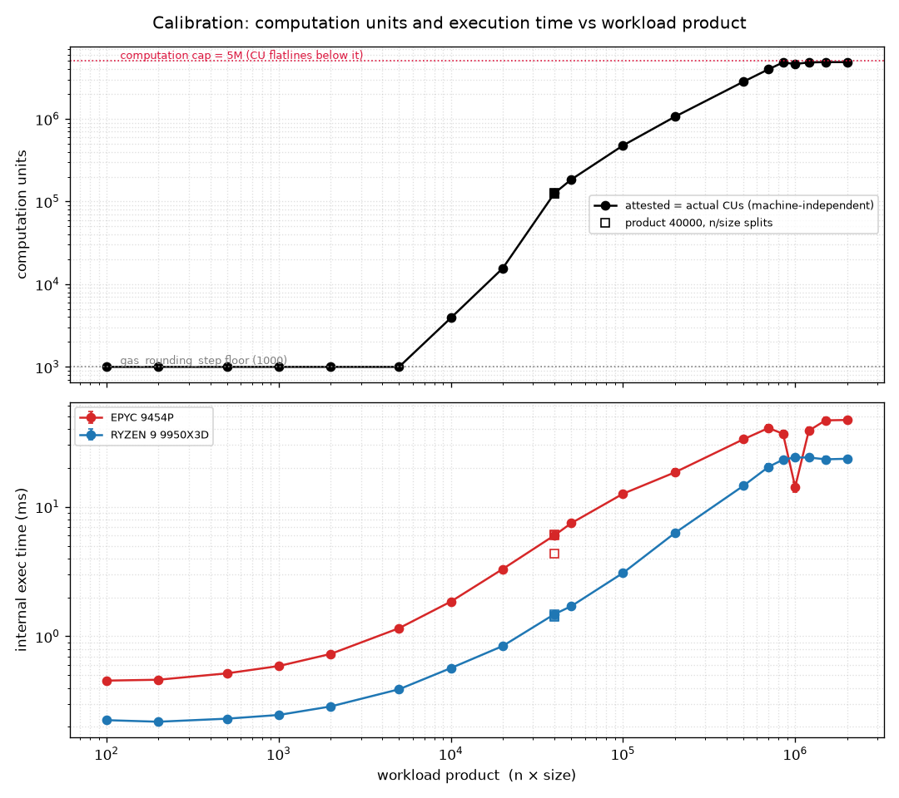
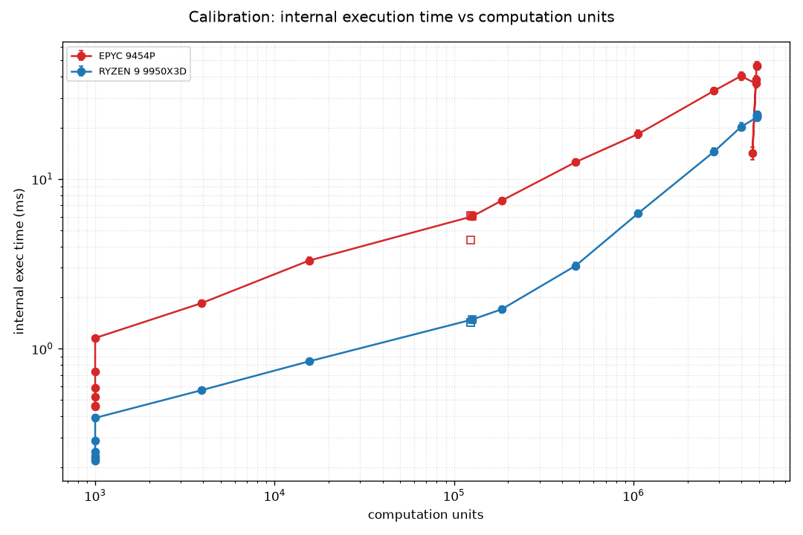

# H2 calibration — probe results

The probe (`probe.sh`, swept by `probe_sweep.sh`) characterizes one
`slow::slow(n, size)` point at low rate: the per-transaction computation units
(attested + actual, the values `TotalComputationUnits` schedules on) and the
internal Move-VM execution time. The computation units select the W5 cost points
and set the per-object limits for the H2 mode comparison; see `README.md`.

The grid is a geometric ladder of the product `n·size` (size fixed at 100,
varying n, product 100 → 2M) plus a split-invariance check (product 40000 at
three n/size splits). Each point ran 20 s at 5 QPS, giving ≈1,800–4,400
execution samples. The same 21-point sweep ran on two machines:

| machine | CPU | arch | boost | cores |
| --- | --- | --- | --- | --- |
| EPYC | EPYC 9454P | Zen4 | ≈3.8 GHz | 48 |
| WS | Ryzen 9 9950X3D | Zen5 | 5.76 GHz | 16 (+3D V-Cache) |

`compare_machines.py` reproduces the cross-machine table below;
`plot_calibration.py` reproduces the figures.

---

## Results

### EPYC 9454P

| n | size | product | CU | exec mean (ms) | exec sem (ms) | samples |
| --- | --- | --- | --- | --- | --- | --- |
| 1 | 100 | 100 | 1,000 | 0.455 | 0.006 | 1812 |
| 2 | 100 | 200 | 1,000 | 0.462 | 0.005 | 3125 |
| 5 | 100 | 500 | 1,000 | 0.518 | 0.012 | 3254 |
| 10 | 100 | 1,000 | 1,000 | 0.590 | 0.017 | 3246 |
| 20 | 100 | 2,000 | 1,000 | 0.731 | 0.017 | 3231 |
| 50 | 100 | 5,000 | 1,000 | 1.155 | 0.030 | 3258 |
| 100 | 100 | 10,000 | 3,913 | 1.853 | 0.072 | 3256 |
| 200 | 100 | 20,000 | 15,563 | 3.304 | 0.149 | 3245 |
| 100 | 400 | 40,000 | 123,220 | 4.371 | 0.184 | 4430 |
| 200 | 200 | 40,000 | 124,301 | 6.105 | 0.270 | 3238 |
| 400 | 100 | 40,000 | 126,243 | 6.018 | 0.276 | 3260 |
| 500 | 100 | 50,000 | 184,495 | 7.460 | 0.332 | 3255 |
| 1000 | 100 | 100,000 | 476,728 | 12.592 | 0.502 | 3252 |
| 2000 | 100 | 200,000 | 1,060,223 | 18.403 | 1.085 | 3260 |
| 5000 | 100 | 500,000 | 2,810,709 | 33.120 | 1.332 | 3259 |
| 7000 | 100 | 700,000 | 3,977,699 | 40.476 | 2.214 | 3386 |
| 8500 | 100 | 850,000 | 4,807,731 | 36.556 | 2.159 | 3122 |
| 10000 | 100 | 1,000,000 | 4,605,342 | 14.213 | 1.240 | 3909 |
| 12000 | 100 | 1,200,000 | 4,817,110 | 38.604 | 2.187 | 3159 |
| 15000 | 100 | 1,500,000 | 4,854,398 | 46.387 | 2.362 | 3262 |
| 20000 | 100 | 2,000,000 | 4,854,398 | 46.697 | 2.371 | 3244 |

### WS Ryzen 9 9950X3D

| n | size | product | CU | exec mean (ms) | exec sem (ms) | samples |
| --- | --- | --- | --- | --- | --- | --- |
| 1 | 100 | 100 | 1,000 | 0.225 | 0.002 | 3256 |
| 2 | 100 | 200 | 1,000 | 0.219 | 0.001 | 3148 |
| 5 | 100 | 500 | 1,000 | 0.231 | 0.001 | 3262 |
| 10 | 100 | 1,000 | 1,000 | 0.247 | 0.002 | 3257 |
| 20 | 100 | 2,000 | 1,000 | 0.287 | 0.004 | 3262 |
| 50 | 100 | 5,000 | 1,000 | 0.390 | 0.018 | 3258 |
| 100 | 100 | 10,000 | 3,913 | 0.569 | 0.018 | 3149 |
| 200 | 100 | 20,000 | 15,563 | 0.841 | 0.029 | 3256 |
| 100 | 400 | 40,000 | 123,330 | 1.429 | 0.062 | 3154 |
| 200 | 200 | 40,000 | 124,301 | 1.423 | 0.068 | 3259 |
| 400 | 100 | 40,000 | 126,243 | 1.483 | 0.069 | 3262 |
| 500 | 100 | 50,000 | 184,495 | 1.707 | 0.080 | 3258 |
| 1000 | 100 | 100,000 | 476,728 | 3.083 | 0.129 | 3264 |
| 2000 | 100 | 200,000 | 1,060,223 | 6.266 | 0.264 | 3147 |
| 5000 | 100 | 500,000 | 2,810,709 | 14.491 | 0.705 | 3260 |
| 7000 | 100 | 700,000 | 3,977,699 | 20.292 | 1.111 | 3256 |
| 8500 | 100 | 850,000 | 4,854,398 | 23.079 | 1.105 | 3261 |
| 10000 | 100 | 1,000,000 | 4,854,398 | 23.998 | 1.146 | 3146 |
| 12000 | 100 | 1,200,000 | 4,854,398 | 23.970 | 1.141 | 3148 |
| 15000 | 100 | 1,500,000 | 4,854,398 | 23.218 | 1.117 | 3261 |
| 20000 | 100 | 2,000,000 | 4,854,398 | 23.440 | 1.107 | 3254 |

> [!NOTE]
> At the ceiling (product ≥ 850k) every transaction aborts out-of-gas, so the
> 20 s window pools capped slow txs (≈4.85M CU) with tiny setup txs (1,000 CU).
> WS runs the slow txs fast enough to keep its windows clean (CU pins at
> 4,854,398 across all five plateau points); the slower EPYC catches more setup
> txs, so its ceiling CU/exec scatter — `product 1M` is a clear outlier. Read the
> ceiling from WS; treat EPYC's plateau numbers as noisy.

---

## Findings

**1. CUs sit at the floor, rise superlinearly, then hit a hard ceiling.** For
product ≤ 5,000 every point bills at 1,000 — one `gas_rounding_step` — so small
workloads are indistinguishable on cost. From product 10,000 upward CUs rise
steeply (3,913 → 15,563 → … → 2,810,709 at product 500,000), roughly quadratic
in the product at first and flattening toward linear. At the top they hit a
ceiling: product 700k → 3.98M, then 850k through 2M all pin at the *same*
4,854,398 — a five-point plateau. The metered CU flatlines just under the 5M
`max_gas_computation_bucket`, because the VM computation budget is
`min(gas_budget, 5M × gas_price)` — past ≈850k product a transaction can't meter
more, it caps (and aborts out-of-gas) at ≈4.85M. The wide, well-separated CU
range below the ceiling is what gives the mode comparison distinct gas buckets
to calibrate against.

**2. The product is the cost axis; the n/size split barely matters.** At product
40,000 the three splits (100×400, 200×200, 400×100) give CUs within 2.4 %
(123,330 / 124,301 / 126,243) and exec times within ≈6 %. So `n·size` sets the
cost; more vectors at equal product cost marginally more. This validates the
product as the single W5 cost axis.

*Top: computation units vs product — one curve, since CUs are
machine-independent; hollow squares are the product-40000 splits, which land on
the curve; the top five rungs (850k–2M) flatline just under the 5M computation
cap (red). Bottom: internal execution time vs product, per machine (both to
product 2M).*

**3. CUs are machine-independent; execution time is not.** Through the
completing range (product ≤ 700k) every CU matches to the digit across both
machines — computation units are protocol-defined gas metering, not wall-clock.
Execution time, in contrast, is the single-threaded Move-VM cost, so it tracks
per-core performance:

| product | n×size | CU | EPYC exec (ms) | WS exec (ms) | WS/EPYC |
| --- | --- | --- | --- | --- | --- |
| 100 | 1×100 | 1,000 | 0.455 | 0.225 | 0.50 |
| 200 | 2×100 | 1,000 | 0.462 | 0.219 | 0.47 |
| 500 | 5×100 | 1,000 | 0.518 | 0.231 | 0.45 |
| 1,000 | 10×100 | 1,000 | 0.590 | 0.247 | 0.42 |
| 2,000 | 20×100 | 1,000 | 0.731 | 0.287 | 0.39 |
| 5,000 | 50×100 | 1,000 | 1.155 | 0.390 | 0.34 |
| 10,000 | 100×100 | 3,913 | 1.853 | 0.569 | 0.31 |
| 20,000 | 200×100 | 15,563 | 3.304 | 0.841 | 0.25 |
| 40,000 | 100×400 | 123,330 | 4.371 | 1.429 | 0.33 |
| 40,000 | 200×200 | 124,301 | 6.105 | 1.423 | 0.23 |
| 40,000 | 400×100 | 126,243 | 6.018 | 1.483 | 0.25 |
| 50,000 | 500×100 | 184,495 | 7.460 | 1.707 | 0.23 |
| 100,000 | 1000×100 | 476,728 | 12.592 | 3.083 | 0.24 |
| 200,000 | 2000×100 | 1,060,223 | 18.403 | 6.266 | 0.34 |
| 500,000 | 5000×100 | 2,810,709 | 33.120 | 14.491 | 0.44 |
| 700,000 | 7000×100 | 3,977,699 | 40.476 | 20.292 | 0.50 |
| 850,000 | 8500×100 | 4,854,398 | 36.556 | 23.079 | 0.63 |
| 1,000,000 | 10000×100 | 4,854,398 | 14.213 | 23.998 | 1.69 |
| 1,200,000 | 12000×100 | 4,854,398 | 38.604 | 23.970 | 0.62 |
| 1,500,000 | 15000×100 | 4,854,398 | 46.387 | 23.218 | 0.50 |
| 2,000,000 | 20000×100 | 4,854,398 | 46.697 | 23.440 | 0.50 |

Through the completing range the WS runs 2.0–4.3× faster per transaction, and
the ratio is U-shaped rather than flat:

- **Fixed-overhead floor** (product ≤ 500): ratio ≈ 0.45–0.50 (WS ≈2× faster).
  Exec here is mostly per-tx overhead (≈0.22 ms WS vs ≈0.46 ms EPYC).
- **Compute-bound middle** (product 20k–100k): ratio dips to ≈ 0.23–0.25 (WS
  ≈4× faster). Raw Move-VM compute dominates and the WS's higher clock and
  newer core win big.
- **Large tail** (product 500k, CU 2.8M): ratio climbs back to ≈ 0.44.
  Consistent with the working set outgrowing cache and the tail becoming
  memory-bandwidth bound, where the EPYC's many-channel server memory competes
  better and offsets the WS's clock edge. (The U-shape is solid; the mechanism
  is inference.)

At the ceiling (product ≥ 850k) both machines cap at the same 4,854,398 CU, but
those rows aren't cleanly comparable: every tx aborts out-of-gas and the fixed
window pools a variable mix of capped and setup txs (see the note above). WS
stays clean (exec ≈23 ms flat); EPYC scatters (37–47 ms) with `product 1M` a
clear outlier — so ignore the ceiling ratios.

*Internal execution time vs computation units, per machine. The vertical cluster
at CU = 1,000 is the gas-rounding floor: exec time still rises with the real
work (the product) while the billed CU stays pinned at the floor. The points
piled at CU ≈ 4.85M are the ceiling plateau; EPYC's scatter there is windowing
noise (finding 3).*

The takeaway for cross-machine reading: computation units transfer exactly, but
per-transaction latency does not. The EPYC's strength is core count (48c) for
parallel throughput, not per-tx speed — so it lags the high-clock desktop on
anything gated on single-transaction execution (e.g. checkpoint-creation lag at
low concurrency).
