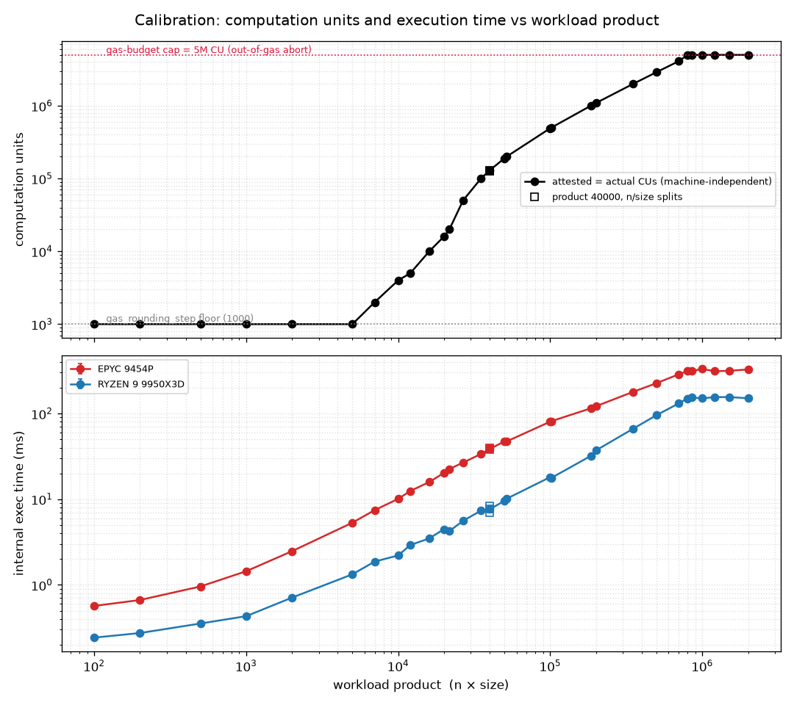
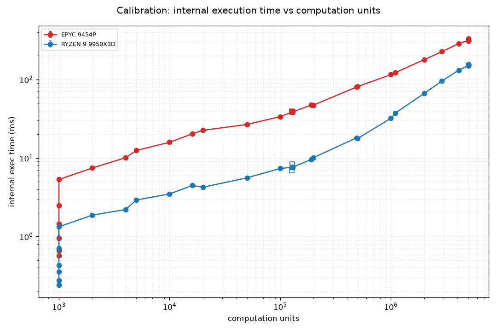
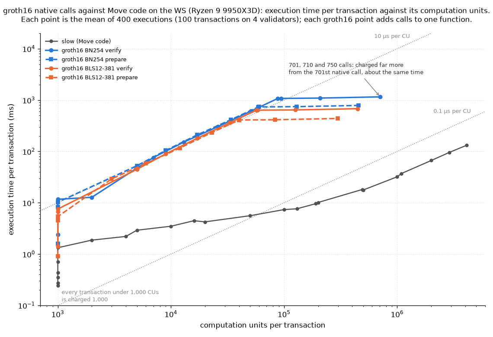

# H2 calibration — probe results

The probe (`probe.sh`, swept by `probe_sweep.sh`) measures one `slow::slow(n,
size)` point at a low rate. For each point, it records the per-transaction
computation units — **attested**, metered during the attestation dry-run and the
value `TotalComputationUnits` uses for scheduling, and **actual**, metered at
post-consensus execution — plus the Move VM execution time. The workload is the
owned-object form of `slow` (W4 in `../stress-plan.md`), so attested and actual
computation units should be equal, because no state can change between the
dry-run and execution. *Sizing the `TotalComputationUnits` limit* below covers
what the numbers are used for; `README.md` has the run plan.

The sweep covers three groups of points, 32 in all, `size` fixed at 100 except
where noted. A geometric ladder steps the product `n × size` from 100 to 2M.
Three points hold the product at 40000 while changing how it divides between
`n` and `size`. The rest are the twelve cost points the mode comparison runs
(`matrix.sh`), whose `n` were chosen so the attested cost lands on a round
target — 1,000, 2,000, 5,000 … 5,000,000 — which puts them between the
ladder's steps. Each point ran 20 s at 5 QPS, so 100 transactions. The same 32
points ran on two machines:

| Machine | CPU | Arch | Boost | Cores |
| --- | --- | --- | --- | --- |
| EPYC | EPYC 9454P | Zen4 | ≈3.8 GHz | 48 |
| WS | Ryzen 9 9950X3D | Zen5 | 5.76 GHz | 16 (+3D V-Cache) |

`compare_machines.py` reproduces the cross-machine table below;
`plot_calibration.py` reproduces the figures.

The last section, *groth16 native calls (W8)*, runs the same probe on
transactions that call a native function instead of Move code.

## How the probe measures

The client is the `stress` benchmark running in-docker on the private network,
submitting *directly to the validators* via the transaction driver (the
attested `submit_tx` path). Every measured value comes from validator-side
Prometheus histograms, pooled over the 4 validators and differenced over the
point's measurement window:

- **Computation units** — `attested_computation_units` and
  `actual_computation_units`, as `Δ_sum / Δ_count`. Only attested user
  transactions reach these histograms, and the workload is deterministic (100
  identical owned-object transactions), so the mean is the exact
  per-transaction value.
- **Execution time** — `authority_state_internal_execution_latency_user`:
  post-consensus execution, user transactions only. This histogram was added for
  the probe, because the existing all-transactions one also counts the network's
  steady stream of system transactions (commit prologues and similar). Those
  outnumber a low-rate workload roughly 30 to 1 and, being sub-millisecond, pull
  the mean down.

The measurement window is anchored at the exact instant spamming starts — the
client prints that timestamp when its warmup ends — so the delta excludes
the gas coin setup transactions, which run during warmup. Without this, the
few cheap setup transactions (at the 1,000-CU floor) pool into the mean and
bias it low. The client also waits 2 s between warmup and spamming so the
baseline sits in a quiet gap. Every row below has exactly 400 samples: 100
workload transactions executed on each of the 4 validators.

---

## Results

### EPYC 9454P

| N | Size | Product | CU | Exec mean (ms) | Exec sem (ms) | Samples |
| --- | --- | --- | --- | --- | --- | --- |
| 1 | 100 | 100 | 1,000 | 0.568 | 0.012 | 400 |
| 2 | 100 | 200 | 1,000 | 0.665 | 0.016 | 400 |
| 5 | 100 | 500 | 1,000 | 0.958 | 0.061 | 400 |
| 10 | 100 | 1,000 | 1,000 | 1.443 | 0.077 | 400 |
| 20 | 100 | 2,000 | 1,000 | 2.470 | 0.027 | 400 |
| 50 | 100 | 5,000 | 1,000 | 5.323 | 0.114 | 400 |
| 70 | 100 | 7,000 | 2,000 | 7.455 | 0.066 | 400 |
| 100 | 100 | 10,000 | 4,000 | 10.087 | 0.251 | 400 |
| 120 | 100 | 12,000 | 5,000 | 12.470 | 0.251 | 400 |
| 160 | 100 | 16,000 | 10,000 | 15.855 | 0.092 | 400 |
| 200 | 100 | 20,000 | 16,000 | 20.294 | 0.519 | 400 |
| 217 | 100 | 21,700 | 20,000 | 22.512 | 0.519 | 400 |
| 267 | 100 | 26,700 | 50,000 | 26.754 | 0.494 | 400 |
| 350 | 100 | 35,000 | 100,000 | 33.695 | 0.206 | 400 |
| 100 | 400 | 40,000 | 127,000 | 39.398 | 0.973 | 400 |
| 200 | 200 | 40,000 | 128,000 | 38.197 | 0.863 | 400 |
| 400 | 100 | 40,000 | 130,000 | 38.623 | 0.861 | 400 |
| 500 | 100 | 50,000 | 190,000 | 47.269 | 0.901 | 400 |
| 516 | 100 | 51,600 | 200,000 | 47.212 | 0.838 | 400 |
| 1000 | 100 | 100,000 | 491,000 | 80.410 | 1.085 | 400 |
| 1015 | 100 | 101,500 | 500,000 | 81.336 | 1.613 | 400 |
| 1848 | 100 | 184,800 | 1,000,000 | 115.076 | 2.942 | 400 |
| 2000 | 100 | 200,000 | 1,092,000 | 121.788 | 2.652 | 400 |
| 3511 | 100 | 351,100 | 2,000,000 | 179.278 | 0.214 | 400 |
| 5000 | 100 | 500,000 | 2,895,000 | 226.288 | 4.245 | 400 |
| 7000 | 100 | 700,000 | 4,097,000 | 287.149 | 4.420 | 400 |
| 8000 | 100 | 800,000 | 5,000,000 | 313.681 | 3.144 | 400 |
| 8500 | 100 | 850,000 | 5,000,000 | 312.723 | 3.203 | 400 |
| 10000 | 100 | 1,000,000 | 5,000,000 | 332.276 | 2.647 | 400 |
| 12000 | 100 | 1,200,000 | 5,000,000 | 311.850 | 3.420 | 400 |
| 15000 | 100 | 1,500,000 | 5,000,000 | 315.672 | 3.171 | 400 |
| 20000 | 100 | 2,000,000 | 5,000,000 | 326.821 | 2.488 | 400 |

### WS Ryzen 9 9950X3D

| N | Size | Product | CU | Exec mean (ms) | Exec sem (ms) | Samples |
| --- | --- | --- | --- | --- | --- | --- |
| 1 | 100 | 100 | 1,000 | 0.242 | 0.001 | 400 |
| 2 | 100 | 200 | 1,000 | 0.274 | 0.002 | 400 |
| 5 | 100 | 500 | 1,000 | 0.354 | 0.006 | 400 |
| 10 | 100 | 1,000 | 1,000 | 0.431 | 0.011 | 400 |
| 20 | 100 | 2,000 | 1,000 | 0.709 | 0.015 | 400 |
| 50 | 100 | 5,000 | 1,000 | 1.329 | 0.080 | 400 |
| 70 | 100 | 7,000 | 2,000 | 1.870 | 0.057 | 400 |
| 100 | 100 | 10,000 | 4,000 | 2.206 | 0.040 | 400 |
| 120 | 100 | 12,000 | 5,000 | 2.916 | 0.004 | 400 |
| 160 | 100 | 16,000 | 10,000 | 3.485 | 0.054 | 400 |
| 200 | 100 | 20,000 | 16,000 | 4.468 | 0.099 | 400 |
| 217 | 100 | 21,700 | 20,000 | 4.241 | 0.092 | 400 |
| 267 | 100 | 26,700 | 50,000 | 5.585 | 0.107 | 400 |
| 350 | 100 | 35,000 | 100,000 | 7.353 | 0.137 | 400 |
| 100 | 400 | 40,000 | 127,000 | 6.931 | 0.080 | 400 |
| 200 | 200 | 40,000 | 128,000 | 8.300 | 0.205 | 400 |
| 400 | 100 | 40,000 | 130,000 | 7.627 | 0.185 | 400 |
| 500 | 100 | 50,000 | 190,000 | 9.579 | 0.217 | 400 |
| 516 | 100 | 51,600 | 200,000 | 10.122 | 0.253 | 400 |
| 1000 | 100 | 100,000 | 491,000 | 18.117 | 0.184 | 400 |
| 1015 | 100 | 101,500 | 500,000 | 17.689 | 0.179 | 400 |
| 1848 | 100 | 184,800 | 1,000,000 | 32.029 | 0.294 | 400 |
| 2000 | 100 | 200,000 | 1,092,000 | 37.170 | 0.560 | 400 |
| 3511 | 100 | 351,100 | 2,000,000 | 66.516 | 0.424 | 400 |
| 5000 | 100 | 500,000 | 2,895,000 | 95.760 | 2.167 | 400 |
| 7000 | 100 | 700,000 | 4,097,000 | 131.356 | 2.182 | 400 |
| 8000 | 100 | 800,000 | 5,000,000 | 150.195 | 1.240 | 400 |
| 8500 | 100 | 850,000 | 5,000,000 | 153.786 | 1.061 | 400 |
| 10000 | 100 | 1,000,000 | 5,000,000 | 150.430 | 1.228 | 400 |
| 12000 | 100 | 1,200,000 | 5,000,000 | 155.437 | 0.978 | 400 |
| 15000 | 100 | 1,500,000 | 5,000,000 | 155.804 | 0.960 | 400 |
| 20000 | 100 | 2,000,000 | 5,000,000 | 150.736 | 1.213 | 400 |

> [!NOTE]
> At the ceiling (product ≥ 800k), the transactions fail with insufficient gas
> before finishing, so those rows measure the execution time the budget paid
> for, not the time the whole product would take. See *Where the 5,000,000 limit
> comes from* below.

---

## Findings

**1. Computation units sit at a floor, then rise steeply, then stop at a
ceiling.** Up to product 5,000, every point is charged 1,000 — one
`gas_rounding_step` — so light workloads cannot be distinguished by computation
cost. The floor ends between there and product 7,000, which is charged 2,000.
Above it the charge rises fast (4,000 at product 10,000 → 20,000 at 21,700 →
2,895,000 at 500,000). The steepest stretch is products 21,700 to 26,700,
where a 23 % larger product costs 2.5× more; growth flattens toward linear
above product 100,000. At the top it stops: product 700k gives 4,097,000, and
800k through 2M all give exactly 5,000,000 (`max_gas_computation_bucket`).
The wide range below the ceiling is what gives the mode comparison distinct
gas buckets to calibrate against. The execution times match: across the six
plateau points the WS holds 150-156 ms and the EPYC 312-332 ms, where the
whole product at 2M would take about 378 ms and 717 ms by the linear trend
from products 200k-700k, so the VM stopped before finishing the work.

Where the 5,000,000 limit comes from

That 5,000,000 is the transaction's gas budget expressed in computation units.
The client does not set that budget from the workload:
`SlowTestPayload::create_transaction` never calls `with_gas_budget`, so
`TestTransactionBuilder` uses the gas price times
`TEST_ONLY_GAS_UNIT_FOR_HEAVY_COMPUTATION_STORAGE`, a constant of 5,000,000
(`iota-types/src/transaction.rs`). At the reference gas price of 1,000, that
is 5,000,000,000 `NANOS`, or 5 IOTA, and `slow(1, 100)` gets the same budget
as `slow(20000, 100)`. Since the budget is the gas price times a fixed number
of units, the limit in computation units is 5,000,000 at any gas price. Once
the work costs more than that, the transaction fails and is charged the whole
budget, so every point past that reports the same figure.

The 5,000,000 is also the value of `max_gas_computation_bucket`, and the two
limits are connected: the gas meter is created with
`min(gas_budget, max_gas_computation_bucket × gas_price)` (`computation_budget`
in `gas_model/gas_v1.rs`). So no transaction on this network is metered above
5,000,000 computation units, whatever budget it declares, and a larger budget
changes only what a failed transaction is charged.

**At the ceiling, the transactions fail** with
`ExecutionErrorKind::InsufficientGas`. `bucketize_computation` rounds the
metered units up to `gas_rounding_step`, and if the rounded cost has reached the
budget it charges the whole budget and returns that error. A charge of exactly
5,000,000 units therefore means the transaction failed; one that finishes is
always charged less.

**2. The product drives the cost; how it divides between `n` and `size` barely
matters.** At product 40,000 the three divisions (100×400, 200×200, 400×100)
give computation units within 2.4 % of each other (127,000 / 128,000 /
130,000), with more vectors at the same product costing marginally more. So
`n × size` sets the charge, and the product alone is enough to describe the
workload's cost. Execution time is looser — 3 % apart across the three
divisions on the EPYC but 20 % apart on the WS (6.93 / 8.30 / 7.63 ms) — which
is run-to-run noise at that scale rather than a real dependence on the split,
and is why the invariance is stated as a result about units.

*Top: computation units vs product — one curve, since CUs are
machine-independent; the square markers are the product-40000 splits, which
land on the curve; the top six points (800k–2M) sit exactly on the 5M
gas-budget cap (red). Bottom: internal execution time vs product, per machine
(both to product 2M).*

**3. CUs are machine-independent; execution time is not.** All 32 points match
to the digit across both machines — computation units are protocol-defined gas
metering, not wall-clock. Execution time, in contrast, is the single-threaded
Move-VM cost, so it tracks per-core performance:

| Product | N×size | CU | EPYC 9454P exec (ms) | RYZEN 9 9950X3D exec (ms) | Ratio |
| --- | --- | --- | --- | --- | --- |
| 100 | 1×100 | 1,000 | 0.568 | 0.242 | 0.43 |
| 200 | 2×100 | 1,000 | 0.665 | 0.274 | 0.41 |
| 500 | 5×100 | 1,000 | 0.958 | 0.354 | 0.37 |
| 1,000 | 10×100 | 1,000 | 1.443 | 0.431 | 0.30 |
| 2,000 | 20×100 | 1,000 | 2.470 | 0.709 | 0.29 |
| 5,000 | 50×100 | 1,000 | 5.323 | 1.329 | 0.25 |
| 7,000 | 70×100 | 2,000 | 7.455 | 1.870 | 0.25 |
| 10,000 | 100×100 | 4,000 | 10.087 | 2.206 | 0.22 |
| 12,000 | 120×100 | 5,000 | 12.470 | 2.916 | 0.23 |
| 16,000 | 160×100 | 10,000 | 15.855 | 3.485 | 0.22 |
| 20,000 | 200×100 | 16,000 | 20.294 | 4.468 | 0.22 |
| 21,700 | 217×100 | 20,000 | 22.512 | 4.241 | 0.19 |
| 26,700 | 267×100 | 50,000 | 26.754 | 5.585 | 0.21 |
| 35,000 | 350×100 | 100,000 | 33.695 | 7.353 | 0.22 |
| 40,000 | 100×400 | 127,000 | 39.398 | 6.931 | 0.18 |
| 40,000 | 200×200 | 128,000 | 38.197 | 8.300 | 0.22 |
| 40,000 | 400×100 | 130,000 | 38.623 | 7.627 | 0.20 |
| 50,000 | 500×100 | 190,000 | 47.269 | 9.579 | 0.20 |
| 51,600 | 516×100 | 200,000 | 47.212 | 10.122 | 0.21 |
| 100,000 | 1000×100 | 491,000 | 80.410 | 18.117 | 0.23 |
| 101,500 | 1015×100 | 500,000 | 81.336 | 17.689 | 0.22 |
| 184,800 | 1848×100 | 1,000,000 | 115.076 | 32.029 | 0.28 |
| 200,000 | 2000×100 | 1,092,000 | 121.788 | 37.170 | 0.31 |
| 351,100 | 3511×100 | 2,000,000 | 179.278 | 66.516 | 0.37 |
| 500,000 | 5000×100 | 2,895,000 | 226.288 | 95.760 | 0.42 |
| 700,000 | 7000×100 | 4,097,000 | 287.149 | 131.356 | 0.46 |
| 800,000 | 8000×100 | 5,000,000 | 313.681 | 150.195 | 0.48 |
| 850,000 | 8500×100 | 5,000,000 | 312.723 | 153.786 | 0.49 |
| 1,000,000 | 10000×100 | 5,000,000 | 332.276 | 150.430 | 0.45 |
| 1,200,000 | 12000×100 | 5,000,000 | 311.850 | 155.437 | 0.50 |
| 1,500,000 | 15000×100 | 5,000,000 | 315.672 | 155.804 | 0.49 |
| 2,000,000 | 20000×100 | 5,000,000 | 326.821 | 150.736 | 0.46 |

The WS runs 2.0–5.7× faster per transaction, and the ratio is U-shaped rather
than flat:

- **Small products** (≤ 2,000): ratio ≈ 0.29–0.43 (WS ≈2.3–3.4× faster).
  Execution here is mostly per-transaction overhead (≈0.24 ms WS vs ≈0.57 ms
  EPYC).
- **Middle of the range** (product 10k–100k): ratio dips to ≈ 0.18–0.23 (WS
  ≈4.3–5.7× faster). Raw Move VM compute dominates, and the WS's higher clock,
  newer core, and 3D V-Cache gain the most here — well beyond the ≈1.5× clock
  ratio alone.
- **Large products** (≥ 500k, CU ≥ 2.9M): ratio climbs back to ≈ 0.42–0.50 (WS
  ≈2.0–2.4× faster). Consistent with the working set outgrowing cache and the
  tail becoming memory-bandwidth bound, where the EPYC's many-channel server
  memory competes better and offsets the WS's clock edge. (The U-shape is solid;
  the explanation is a guess.)

At the ceiling both machines are roughly flat across the six plateau points:
WS ≈150–156 ms, EPYC ≈312–332 ms.

*Internal execution time vs computation units, per machine. The vertical
cluster at CU = 1,000 is the gas-rounding floor: execution time still rises
with the real work (the product) while the billed CU stays pinned at the floor.
The points piled at CU = 5M are the ceiling plateau.*

So when reading results across machines: computation units transfer exactly, but
per-transaction execution time does not. The EPYC's strength is core count (48c)
for parallel throughput, not per-transaction speed — so it lags the high-clock
desktop on anything that depends on a single transaction's execution, by ≈2.0×
at the ceiling and up to ≈5.7× in the compute-bound middle of the range.

That is also why `matrix.sh`'s drain column is read off the mode comparison
rather than from these numbers: a probe measurement at 5 QPS with nothing
contending does not describe the drain rate on a contended object under the
grid's load, and it does not transfer between machines.

---

## Sizing the `TotalComputationUnits` limit

This is what the calibration is for. Production runs per-object congestion
control in `TotalTxCount` mode with a base limit of 10 and an overshoot of 100
per object per commit (`max_accumulated_txn_cost_per_object_in_mysticeti_commit`
= 10, `max_congestion_limit_overshoot_per_commit` = 100). That mode counts every
transaction as 1, ignoring cost: a per-object commit admits the same 10 (+100
burst) transactions whether each costs 1,000 CU or 5,000,000 CU — the same count
covering a 5,000× difference in real work.

`TotalComputationUnits` limits on attested cost instead of count. The question
H2 answers is which CU limit to give it. Mapping today's count limits onto the
CU scale means multiplying by the per-transaction cost — but the calibration
shows that cost spans 1,000 → 5,000,000 CU, so the equivalent limit spans the
same 5,000×:

| CU per tx | Base limit (×10) | Overshoot (×100) |
| --- | --- | --- |
| 1,000 | 10,000 | 100,000 |
| 2,000 | 20,000 | 200,000 |
| 4,000 | 40,000 | 400,000 |
| 5,000 | 50,000 | 500,000 |
| 10,000 | 100,000 | 1,000,000 |
| 16,000 | 160,000 | 1,600,000 |
| 20,000 | 200,000 | 2,000,000 |
| 50,000 | 500,000 | 5,000,000 |
| 100,000 | 1,000,000 | 10,000,000 |
| 127,000 | 1,270,000 | 12,700,000 |
| 128,000 | 1,280,000 | 12,800,000 |
| 130,000 | 1,300,000 | 13,000,000 |
| 190,000 | 1,900,000 | 19,000,000 |
| 200,000 | 2,000,000 | 20,000,000 |
| 491,000 | 4,910,000 | 49,100,000 |
| 500,000 | 5,000,000 | 50,000,000 |
| 1,000,000 | 10,000,000 | 100,000,000 |
| 1,092,000 | 10,920,000 | 109,200,000 |
| 2,000,000 | 20,000,000 | 200,000,000 |
| 2,895,000 | 28,950,000 | 289,500,000 |
| 4,097,000 | 40,970,000 | 409,700,000 |
| 5,000,000 | 50,000,000 | 500,000,000 |

Both ends of that range are unusable:

- **Lower bound** — size the limit for all-light traffic (1,000 CU): base
  10,000, overshoot 100,000 CU. But 10,000 CU is smaller than a single heavy
  transaction (5,000,000 CU), so not even one heavy transaction fits per object
  per commit — heavy traffic is deferred indefinitely.
- **Upper bound** — size it for all-heavy traffic (5,000,000 CU): base
  50,000,000, overshoot 500,000,000 CU. That admits 50,000 light transactions
  (1,000 CU each) per object per commit — 5,000× today's 10, i.e. effectively
  no throttling of light traffic.

So the workable limit sits between, and where exactly depends on the workload
mix. Choosing and justifying it is the H2 mode comparison, which runs
`TotalTxCount` (limit 10, burst off) against `TotalComputationUnits` at
candidate limits from this range and compares throughput, latency and per-object
cancellation. It uses the shared form of `slow` (W5), one cost per
configuration, over the twelve cost points calibrated here — see `README.md` for
the grid and `matrix.sh` for the configurations.

One cost per configuration cannot separate the modes: at a single cost a unit
limit of `10 × cost` admits the same ten transactions a count limit of 10 does,
so the two are expected to produce the same numbers, and measuring that they do
is what makes the grid trustworthy. The modes can only
diverge when a commit carries transactions of *different* cost, which is what
the `SLOW_MIX` configurations add — a count limit then admits a fixed number and
lets the admitted work swing, while a unit limit admits a fixed amount of work
and lets the number swing.

---

## groth16 native calls (W8)

The same probe, run on W8 (`../stress-plan.md`): owned-object transactions
that call one native function of the framework's `0x2::groth16` module a set
number of times. Native functions are charged a fixed amount per call, set in
the protocol config, not per instruction like Move code, so this checks whether
computation units follow execution time for native calls as they do for
`slow`. `probe.sh` runs one point with `WORKLOAD=groth16`, and `probe_sweep.sh
groth16` runs the grid. Only the WS has run it so far.

There are four workloads, the two functions on each of two curves:

- `verify_groth16_proof` checks one proof against a verifying key prepared in
  advance. It is the call that runs once per proof.
- `prepare_verifying_key` turns a raw verifying key into that prepared form,
  which includes one pairing. It runs once per circuit.

The keys and proofs are the framework's own test vectors
(`groth16_tests.move`), so every verify returns true and does its full work.
Each call is charged a fixed amount (mainnet protocol version 34):

| Function | BN254 | BLS12-381 |
| --- | --- | --- |
| `verify_groth16_proof`, one public input | 125 CUs | 80 CUs |
| `prepare_verifying_key` | 82 CUs | 54 CUs |

A transaction's total is rounded up to the next 1,000, as for `slow`. From the
701st native call in a transaction, gas model v2 charges each call's amount as
instructions, so later calls cost far more. The grid steps the calls per
transaction: 1, 7, 8, 50, 100, 200, 400, 700, 701, 710 and 750. For BN254
verify, 1 and 7 calls both round up to 1,000 CUs, 8 is the first step to 2,000,
700 is the most at the flat price, and the last three show the jump.

Each point ran 100 s at 1 transaction per second, so still 100 transactions and
400 samples, and the client allowed 4 transactions in flight instead of 2
(`IN_FLIGHT_RATIO`). At 700 calls a transaction executes for about a second on
every validator: at 5 per second the four validators would need more cores than
the machine has, and with 2 in flight the client could not keep up with its
≈2.3 s transactions. The measurement is the one described in *How the probe
measures*. The rows are in `results/probe/groth16-<machine>.csv`, which
`make_calibration_table.py` and `plot_groth16.py` read.

### Results: WS Ryzen 9 9950X3D

#### BN254 verify

| Calls | CU | Exec mean (ms) | Exec sem (ms) | Samples |
| --- | --- | --- | --- | --- |
| 1 | 1,000 | 2.391 | 0.030 | 400 |
| 7 | 1,000 | 11.660 | 0.292 | 400 |
| 8 | 2,000 | 12.787 | 0.236 | 400 |
| 50 | 7,000 | 76.143 | 0.057 | 400 |
| 100 | 13,000 | 151.628 | 1.169 | 400 |
| 200 | 26,000 | 304.394 | 3.530 | 400 |
| 400 | 51,000 | 610.116 | 6.994 | 400 |
| 700 | 88,000 | 1075.494 | 21.225 | 400 |
| 701 | 94,000 | 1078.186 | 21.091 | 400 |
| 710 | 207,000 | 1093.618 | 20.319 | 400 |
| 750 | 707,000 | 1155.873 | 17.206 | 400 |

#### BLS12-381 verify

| Calls | CU | Exec mean (ms) | Exec sem (ms) | Samples |
| --- | --- | --- | --- | --- |
| 1 | 1,000 | 1.418 | 0.079 | 400 |
| 7 | 1,000 | 6.655 | 0.063 | 400 |
| 8 | 1,000 | 7.535 | 0.035 | 400 |
| 50 | 5,000 | 44.744 | 0.362 | 400 |
| 100 | 9,000 | 89.680 | 0.734 | 400 |
| 200 | 17,000 | 179.684 | 0.234 | 400 |
| 400 | 33,000 | 360.750 | 0.713 | 400 |
| 700 | 57,000 | 634.803 | 5.760 | 400 |
| 701 | 58,000 | 635.335 | 5.733 | 400 |
| 710 | 126,000 | 643.445 | 5.328 | 400 |
| 750 | 448,000 | 680.450 | 3.478 | 400 |

#### BN254 prepare

| Calls | CU | Exec mean (ms) | Exec sem (ms) | Samples |
| --- | --- | --- | --- | --- |
| 1 | 1,000 | 1.602 | 0.070 | 400 |
| 7 | 1,000 | 8.277 | 0.091 | 400 |
| 8 | 1,000 | 10.244 | 0.281 | 400 |
| 50 | 5,000 | 52.593 | 1.120 | 400 |
| 100 | 9,000 | 104.544 | 3.523 | 400 |
| 200 | 17,000 | 208.869 | 1.694 | 400 |
| 400 | 34,000 | 416.701 | 2.085 | 400 |
| 700 | 59,000 | 731.961 | 0.902 | 400 |
| 701 | 60,000 | 735.684 | 0.716 | 400 |
| 710 | 129,000 | 745.443 | 0.228 | 400 |
| 750 | 457,000 | 786.233 | 1.812 | 400 |

#### BLS12-381 prepare

| Calls | CU | Exec mean (ms) | Exec sem (ms) | Samples |
| --- | --- | --- | --- | --- |
| 1 | 1,000 | 0.902 | 0.050 | 400 |
| 7 | 1,000 | 4.497 | 0.086 | 400 |
| 8 | 1,000 | 5.376 | 0.111 | 400 |
| 50 | 3,000 | 29.215 | 0.414 | 400 |
| 100 | 6,000 | 58.189 | 0.841 | 400 |
| 200 | 12,000 | 116.302 | 2.935 | 400 |
| 400 | 23,000 | 232.871 | 2.893 | 400 |
| 700 | 40,000 | 408.768 | 1.688 | 400 |
| 701 | 40,000 | 409.836 | 1.742 | 400 |
| 710 | 83,000 | 413.925 | 1.946 | 400 |
| 750 | 299,000 | 438.647 | 3.182 | 400 |

### Findings

**1. The charge is exactly what the protocol config says.** Attested and actual
computation units are equal at every point, and every total is the charge per
call times the number of calls, rounded up to 1,000: 700 BN254 verify calls
cost 88,000. The rule for the 701st call works as intended: 701 calls cost
94,000, 710 cost 207,000 and 750 cost 707,000.

**2. Execution time is linear in calls, and far above the charge.** From 50
calls up, each call takes the same time: 1.52–1.54 ms for BN254 verify, 0.90 ms
for BLS12-381 verify, 1.04–1.05 ms for BN254 prepare and 0.58 ms for BLS12-381
prepare. Per computation unit, that is 10–12 µs for all four. `slow` takes
0.07–0.11 µs per unit at 50,000–100,000 units.

**3. At the same computation units, the groth16 transactions run 80–155×
longer than `slow`.** At 700 calls, the most at the flat price:

| Workload | CU | Exec mean (ms) | `slow` at the same CU (ms) | Ratio |
| --- | --- | --- | --- | --- |
| BN254 verify | 88,000 | 1,075 | 6.9 | 155× |
| BN254 prepare | 59,000 | 732 | 5.9 | 124× |
| BLS12-381 verify | 57,000 | 635 | 5.8 | 109× |
| BLS12-381 prepare | 40,000 | 409 | 5.1 | 80× |

The `slow` values are read off its table between the two nearest points. The
ratio is smaller for smaller transactions, 14–24× at 50 calls, because `slow`
takes more time per unit when its transactions are small, while groth16's time
per unit stays the same.

**4. The two curves are priced correctly relative to each other; the scale is
off.** BLS12-381 runs 1.7–1.8× faster than BN254 in both functions and is
charged about 1.5× less, so all four land at 10–12 µs per unit. What is too low
is the per-call charge compared with Move code, by about two orders of
magnitude, not one curve's charge against the other's.

**5. The rule for the 701st call narrows the gap but does not close it.** 750
BN254 verify calls cost 707,000 units and take 1,156 ms, where `slow` at
707,000 units takes about 24 ms: still about 49× longer, and 34–49× across the
four workloads.

*Execution time per transaction against its computation units on the WS: the
four groth16 workloads drawn over the `slow` points (Move code). The dotted
diagonals mark 0.1 and 10 µs per unit. Up to 700 calls, the groth16 lines
follow the 10 µs line, about two orders of magnitude above `slow`; past 700
calls they run flat to the right, charged more for about the same time. The
vertical stacks at 1,000 units are transactions below 1,000, all charged
1,000.*

For H2 this matters because the mode comparison sets its unit limit in
computation units, on the assumption that they stand for execution time. A
700-call BN254 verify transaction costs 88,000 units, so it fits under a
150,000-unit limit, the best one H2 found for mixing 1,000- and 100,000-unit
transactions on the EPYC, yet it executes for about 1.1 s, against the ≈50 ms
of work per commit that limit is meant to admit. `RESULTS.md` lists a rerun of
a mix ladder with such transactions on a shared object as a next step.

Caveats:

- One machine so far, with the four validators sharing it.
- The `slow` points were taken on 7 September, the groth16 points on
  24 September with a newer node build.
- The ratio depends on the size it is read at, as finding 3 shows.
