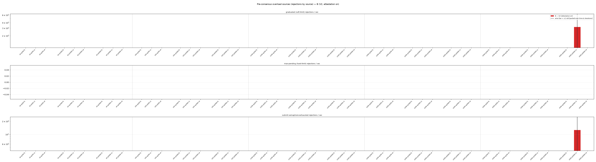
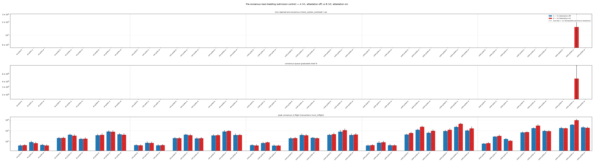

# Stress-test runs and results

Running log of the stress tests from `stress-plan.md`: the exact commands,
the results of each run, and a brief analysis.

All commands are run from the `iota` monorepo root unless noted.

---

## H1 — attestation overhead (W4: slow owned-object; V1 vs V2)

**Goal:** measure what validator attestation costs. Attestation (the
pre-consensus dry-run) happens in the `submit_tx` path independent of the
congestion mode, so H1 deliberately keeps sequencing out of the picture:
**owned-object** transactions only (no shared-object scheduling at all). Each
configuration is run twice under identical load; the only difference is
attestation off (all `UserTransactionV1`, the zero-attestation control — "A")
vs on (all `UserTransactionV2`, attested — "B"). We then compare the two runs to
see how the metrics differ between them; this is purely a measurement, with no
pass/fail threshold.

---

### Experiment as run

Rather than a single submission rate (target QPS), H1 sweeps a matrix so the
overhead is measured across a range of per-transaction computation units, both
client submission paths (via fullnode vs direct to a single validator), and
three load levels — target QPS of 200, 1000, and 2000 tx/s. Driven by
`stress-attestation-sequencer/h1/matrix.sh` (each configuration calls `run.sh`,
which runs A then B back-to-back on a fresh network, scrapes Prometheus into
per-run JSON, aggregates, and plots):

- **Workload**: `slow::slow(n, size)` with `n == size`, owned-object
  (`SLOW_SHARED=false`) — each transaction only does CPU work (no shared
  objects), so no congestion control or scheduling noise, so nothing but
  attestation drives the A vs B difference.
- **Computation** (`slow_size`, with `n == size`): {0, 50, 100, 200, 500} — the
  argument passed to `slow::slow(n, size)`; larger values mean more CPU work
  per transaction. But gas is bucketed (rounded up to `gas_rounding_step`), so
  the two smallest workloads fall in the same bucket and bill identically:
  `slow0` and `slow50` both sit at the floor (equal attestation cost — see
  finding 1), and the per-transaction computation cost only steps up from
  `slow100` onward.
- **Path**: `f` = submit via fullnode (`DIRECT=false`); `v` = pinned
  direct-to-one-validator (`DIRECT=true NUM_TARGET_VALIDATORS=1`).
- **Rate** (`target_qps`): {200, 1000, 2000}.
- **Machine**: all runs on one AMD EPYC 9454P server (48 cores / 96 threads,
  251 GiB RAM, Ubuntu 24.04), running the private network in docker — 4
  validators plus 1 fullnode — with the stress client on the same host.
- 5 × 2 × 3 = **30 configurations**, **10 iterations** each; every iteration
  runs Run A (V1, attestation OFF) and Run B (V2, attestation ON).

`run.sh` re-bootstraps a fresh genesis and network (empty DB) between A and B so
both share the same cold baseline and warmup — only attestation differs. The
monitoring stack is cycled down (without wiping its volume) and back up too,
since leaving Prometheus up across the reset would give Run B a longer warmup.
In unattended runs the TSDB is additionally wiped between A and B (Run A's JSON
is saved first); run interactively it is kept, so both windows coexist in one
Grafana view.

Aggregation and reporting tooling (all under `h1/` directory):

- `make_table.py` generates `results/summary_table_n<N>.md` (+
  `results/summary_table_n<N>.csv`) for one network size at a time (`--net`,
  default 4): one row per configuration, an A/B cell per
  metric (`mean ± std` over all seconds of all iterations), with the
  network-level series computed exactly as `plot.py` does (rate /
  `histogram_quantile`, per-validator collapse). Bursty queue and shedding
  gauges (in-flight count, dispatch queue, pending transactions, shed
  percentages) instead report the
  peak: max over time per iteration, averaged across iterations — their mean
  over time would hide the short spikes that actually hit a limit.
- `summary_plot.py` generates `results/summary_plots_n<N>/*.png` (same `--net`
  switch): grouped A vs B bar charts per metric, configurations on the x-axis,
  log-scale y.

> [!NOTE]
> Client-side `settlement_finality_latency` and `submit_transaction_latency` are
> recorded only on the fullnode path, so they exist for `f` configurations only;
> the `v` (direct-to-validator) configurations bypass the fullnode and report no
> client-side latency.

---

### Findings (10 iterations per configuration)

Numbers below are means over all seconds of all iterations, except the bursty
queue/shedding gauges, which report peaks (see the tooling note above).
Per-configuration means are steady at light and moderate load — they vary a
few percent from run to run — and noisier on the heavy-compute configurations,
where throughput is small (up to tens of percent). 10 iterations still pin
down every effect below: the effects reported are far larger than that noise.
Where A and B come out almost equal, such as throughput, the gap is smaller
than the run-to-run noise: we can't tell them apart, which is exactly the
point — attestation makes no measurable difference there. Figure error bars
are ±1 std (signal variability) by default; `summary_plot.py --disp sem`
switches them to the standard error of the mean.

In the figures below, blue = **A (V1, attestation off)** and red = **B (V2,
attestation on)**; the x-axis is one group per configuration
(`s<size>·q<qps>·<path>`, `f` = fullnode, `v` = direct-to-validator), with
dashed separators between computation sizes; the y-axis is log-scaled.

---

**1. Attestation is a full execution dry-run, plus scheduling overhead that
grows with load.**

| metric | codebase description | aggregation |
| --- | --- | --- |
| `validator_attestation_latency` | Latency of `attest_transaction` (the pre-consensus dry-run) for `UserTransactionV2` transactions; spans pool wait + dry-run execution + async resume | histogram; p50/p95/p99 (`histogram_quantile`) over buckets combined across validators; averaged over all seconds of all iterations |
| `validator_attestation_queue_wait` | Time an attestation dry-run waits on the `spawn_blocking` pool before a worker starts it (queue wait only) | histogram; p50/p95/p99 (`histogram_quantile`) over buckets combined across validators; averaged over all seconds of all iterations |
| `validator_attestation_execution_latency` | Wall-clock of the attestation Move-VM dry-run itself (`spawn_blocking` closure body), excluding pool wait | histogram; p50/p95/p99 (`histogram_quantile`) over buckets combined across validators; averaged over all seconds of all iterations |
| `validator_attestation_async_resume_latency` | Time from the dry-run finishing on the blocking pool until the awaiting async task resumes (`spawn_blocking` join). Grows when the async runtime is saturated; full latency = queue wait + execution + this | histogram; p50/p95/p99 (`histogram_quantile`) over buckets combined across validators; averaged over all seconds of all iterations |
| `authority_state_internal_execution_latency` | Latency of actual certificate executions | histogram; p50/p95/p99 (`histogram_quantile`) over buckets combined across validators; averaged over all seconds of all iterations |
| `actual_computation_units` | Actual computation cost in gas units (CU) of attested transactions (`computation_cost` / `gas_price`), observed after execution | histogram; per-tx mean `rate(_sum)/rate(_count)` combined across validators (exact, not a quantile); averaged over all seconds of all iterations |

> [!IMPORTANT]
> The dry-run does not run on the async runtime: it is handed to a separate
> thread pool (`tokio::task::spawn_blocking`), and the async task that
> submitted it waits for the result. **Pool wait** is the time the dry-run sits
> queued before a pool thread starts it. **Async resume** is the time after the
> dry-run finishes until the waiting async task gets CPU time to continue. So
> full attestation latency = pool wait + dry-run execution + async resume.
> Under heavy load the pool's threads keep all CPU cores busy, which starves
> the async runtime — the async resume part then grows to seconds.

`validator_attestation_execution_latency` (B only — the dry-run itself, without
the pool wait and async resume around it) grows with the transaction's
computation cost and tracks the actual execution latency across the whole
sweep, matching it at the heavy end. The full attestation latency
(`validator_attestation_latency`) equals the dry-run at light compute, then
pulls away from `slow200` on — the wait and resume around the dry-run grow
with load. Both client paths, at `qps1000`:

Fullnode path (`f`):

| slow_size | attest. exec. lat. p95 | exec. lat. p95 | attest. full lat. p95 | CUs  |
| --- | --- | --- | --- | --- |
| 0   | 0.95 ms   | 1.80 ms   | 0.95 ms   | 1k    |
| 50  | 4.80 ms   | 5.41 ms   | 4.82 ms   | 1k    |
| 100 | 14.80 ms  | 19.88 ms  | 17.93 ms  | 4k    |
| 200 | 93.33 ms  | 187.48 ms | 461.92 ms | 128k  |
| 500 | 1.267 s   | 1.195 s   | 2.030 s   | 1.37M |

Direct-to-one-validator path (`v`):

| slow_size | attest. exec. lat. p95 | exec. lat. p95 | attest. full lat. p95 | CUs  |
| --- | --- | --- | --- | --- |
| 0   | 0.95 ms   | 1.34 ms   | 0.95 ms   | 1k    |
| 50  | 4.80 ms   | 5.57 ms   | 4.84 ms   | 1k    |
| 100 | 16.38 ms  | 21.08 ms  | 20.04 ms  | 4k    |
| 200 | 75.64 ms  | 204.58 ms | 467.44 ms | 128k  |
| 500 | 965.05 ms | 973.46 ms | 2.548 s   | 1.37M |

The dry-run and the real execution share the bulk of the work — load the
inputs, run the Move VM — so their latencies scale together with computation
cost. The differences are at the edges. For a no-op transaction (`slow0`) the
Move work is almost nothing and only fixed overhead remains; the real
execution (`try_execute_immediately`: lock, input load, Move VM, effects
commit) carries more of it than the attestation checks do, so it sits a little
above the dry-run (≈1.3–1.8 vs ≈0.95 ms). At mid-range compute (`slow200`) the
real execution reads about twice the dry-run — not extra work, but timing: it
runs after consensus, where a whole commit's transactions land at once and
execute in parallel, and every one of the 4 validators executes every
transaction, while each transaction is attested once, paced by client
arrivals. On this one machine that is 4× the CPU demand, so the parallel
executions share cores and each takes longer on the wall clock. At `slow500`
the machine is saturated continuously either way and the two converge. The
full attestation latency adds the scheduling around the dry-run: nothing at
light load, but from `slow200` on the pool wait and async resume grow to
dominate it (462 ms full vs 93 ms dry-run on `f`). A heavy attested
transaction is still executed twice — once for the dry-run, once for real —
so it costs the validator roughly double.

*Computation units, attestation dry-run execution latency (p50/p95), and actual
execution latency (p95) — findings 1–3. CUs sit at the gas floor for
`slow0`/`slow50` and step up from `slow100`; the dry-run tracks actual
execution latency across the sweep.*

The full attestation latency split into its three parts (pool wait + dry-run
execution + async resume), at `qps1000`:

Fullnode path (`f`), p50:

| slow_size | pool wait | dry-run exec | async resume | full |
| --- | --- | --- | --- | --- |
| 0   | 0.50 ms   | 0.50 ms   | 0.50 ms  | 0.50 ms   |
| 50  | 0.51 ms   | 2.95 ms   | 0.50 ms  | 2.97 ms   |
| 100 | 0.54 ms   | 5.62 ms   | 0.51 ms  | 6.11 ms   |
| 200 | 63.15 ms  | 36.10 ms  | 0.83 ms  | 116.15 ms |
| 500 | 158.62 ms | 750.41 ms | 8.99 ms  | 1.051 s   |

Fullnode path (`f`), p99:

| slow_size | pool wait | dry-run exec | async resume | full |
| --- | --- | --- | --- | --- |
| 0   | 0.99 ms   | 0.99 ms   | 0.99 ms   | 0.99 ms   |
| 50  | 1.91 ms   | 4.96 ms   | 0.99 ms   | 5.04 ms   |
| 100 | 6.91 ms   | 22.94 ms  | 2.61 ms   | 23.71 ms  |
| 200 | 630.34 ms | 136.01 ms | 69.83 ms  | 683.81 ms |
| 500 | 1.489 s   | 1.425 s   | 663.71 ms | 2.545 s   |

Direct-to-one-validator path (`v`), p50:

| slow_size | pool wait | dry-run exec | async resume | full |
| --- | --- | --- | --- | --- |
| 0   | 0.50 ms  | 0.50 ms   | 0.50 ms   | 0.50 ms   |
| 50  | 0.51 ms  | 2.96 ms   | 0.50 ms   | 2.98 ms   |
| 100 | 0.57 ms  | 5.97 ms   | 0.51 ms   | 6.55 ms   |
| 200 | 8.51 ms  | 12.43 ms  | 8.73 ms   | 66.19 ms  |
| 500 | 41.28 ms | 199.64 ms | 174.69 ms | 620.67 ms |

Direct-to-one-validator path (`v`), p99:

| slow_size | pool wait | dry-run exec | async resume | full |
| --- | --- | --- | --- | --- |
| 0   | 0.99 ms   | 0.99 ms   | 0.99 ms   | 0.99 ms   |
| 50  | 3.05 ms   | 4.96 ms   | 0.99 ms   | 5.88 ms   |
| 100 | 13.45 ms  | 23.28 ms  | 2.72 ms   | 26.18 ms  |
| 200 | 456.48 ms | 120.51 ms | 503.28 ms | 701.27 ms |
| 500 | 1.408 s   | 1.265 s   | 2.229 s   | 3.326 s   |

At light compute, every part sits at the histogram floor (≈0.5 ms) — the full
latency is just the dry-run. Under heavy compute the overhead appears, and the
two paths pay it differently. On `f` the dry-runs queue up for a pool thread:
pool wait dominates (630 ms at `slow200` p99) while resume stays small. On `v`
the one pinned validator attests everything; its cores saturate and finished
dry-runs wait for the starved async runtime to pick the result up — async
resume grows into the largest part at the tail (2.229 s at `slow500` p99, more
than the dry-run itself). The parts do not sum exactly to the full column:
each column is its own percentile over different transactions, so the split is
additive at the mean, not per percentile.

*Attestation pool wait (p99/p95/p50) — how long a dry-run sits queued before a
`spawn_blocking` pool thread starts it. Grows on the heavy `f` configurations,
where dry-runs arrive faster than pool threads get CPU.*

*Attestation async resume (p99/p95/p50) — how long after the dry-run finishes
until the waiting async task gets CPU time to continue. The tail grows largest
on the heavy pinned (`v`) configurations, where the one attesting validator's
cores are saturated.*

*Full attestation latency (p99/p95/p50) — pool wait + dry-run execution +
async resume, the whole `attest_transaction` span.*

---

**2. Internal execution latency: unchanged by attestation.**

> [!TIP]
> Both metrics of this finding — `authority_state_internal_execution_latency`
> and `actual_computation_units` — are described in finding 1's metric table.

`authority_state_internal_execution_latency` (the real, post-consensus VM
execution) is A≈B: the p95 B/A ratio has median **1.00** across all 30
configurations (range 0.80–1.34). The deviations sit on the heavy-compute
configurations and swing in both directions — B faster on some, slower on
others — so they are load noise, not a systematic attestation cost.
Attestation does not touch the execution path itself; its cost lives in the
pre-consensus dry-run (finding 1). Execution latency p95 at `qps1000` (CUs are
measured on attested transactions, so they exist for B only):

| slow_size | f: A | f: B | f B/A | v: A | v: B | v B/A | CUs |
| --- | --- | --- | --- | --- | --- | --- | --- |
| 0   | 1.80 ms   | 1.80 ms   | 1.00 | 1.25 ms   | 1.34 ms   | 1.07 | 1k    |
| 50  | 5.41 ms   | 5.41 ms   | 1.00 | 5.72 ms   | 5.57 ms   | 0.97 | 1k    |
| 100 | 21.13 ms  | 19.88 ms  | 0.94 | 21.87 ms  | 21.08 ms  | 0.96 | 4k    |
| 200 | 214.56 ms | 187.48 ms | 0.87 | 221.94 ms | 204.58 ms | 0.92 | 128k  |
| 500 | 966.96 ms | 1.195 s   | 1.24 | 970.63 ms | 973.46 ms | 1.00 | 1.37M |

---

**3. Compute-unit accounting is exact.**

| metric | codebase description | aggregation |
| --- | --- | --- |
| `attested_computation_units` | Attestor's pre-consensus estimate of the computation cost in gas units (CU), for transactions that arrived as `UserTransactionV2` | histogram; per-tx mean `rate(_sum)/rate(_count)` combined across validators; averaged over all seconds of all iterations |
| `actual_to_attested_computation_units_ratio` | Ratio actual / attested computation units for attested transactions | histogram; per-tx mean `rate(_sum)/rate(_count)` combined across validators; averaged over all seconds of all iterations |

> [!TIP]
> `actual_computation_units` — the other metric of this finding — is described
> in finding 1's metric table.

Attested computation units equal actual computation units for every
owned-object configuration (ratio = 1.0), confirming attestation predicts the
computation cost precisely for these transactions. CUs are reported as the
exact per-transaction mean (`_sum`/`_count`), not a p50: the
workload is deterministic, so every transaction is identical and the mean is
the exact cost. A p50 would instead interpolate between histogram bucket edges
and land on impossible values (e.g., 850 for `slow0`, below the 1000-unit
`gas_rounding_step` floor).

---

**4. Receipt → execution latency: roughly doubles under heavy load.**

| metric | codebase description | aggregation |
| --- | --- | --- |
| `validator_transaction_execution_latency` | Validator-internal latency from receiving a transaction via `submit_tx` until it finished executing (pre-consensus check, consensus, post-consensus validation, sequencing incl. deferral, execution); excludes client/fullnode time | histogram; p50/p95/p99 (`histogram_quantile`) per validator, then max across validators (busiest); averaged over all seconds of all iterations |

`validator_transaction_execution_latency` times the whole internal pipeline on
the receiving validator — receipt via `submit_tx`, attestation, consensus,
post-consensus validation, and execution — no client/fullnode time. Median
(p50) at `qps1000`:

| slow_size | f: A | f: B | f B/A | v: A | v: B | v B/A |
| --- | --- | --- | --- | --- | --- | --- |
| 0   | 303 ms | 271 ms | 0.89 | 261 ms  | 240 ms  | 0.92 |
| 50  | 307 ms | 301 ms | 0.98 | 237 ms  | 275 ms  | 1.16 |
| 100 | 301 ms | 306 ms | 1.02 | 273 ms  | 299 ms  | 1.09 |
| 200 | 759 ms | 1.44 s | 1.89 | 1.28 s  | 2.77 s  | 2.16 |
| 500 | 3.97 s | 9.31 s | 2.35 | 10.34 s | 18.38 s | 1.78 |

At light load the pipeline is ≈240–310 ms and A≈B — dominated by consensus,
with attestation (a few ms at these sizes) lost in the noise. At heavy compute
B runs ≈1.8–2.4× A (`slow500-f` 3.97 s → 9.31 s), because attestation adds a
second full execution before consensus (finding 1) and, under load, the extra
work compounds through queueing. p95 tracks the same (`slow500-f` 6.2 s →
14.3 s).

*Validator-internal receipt → executed latency — the pure validator-internal
pipeline, with no client/fullnode time.*

---

**5. Checkpoint creation lag: attestation moves the backlog ahead of
consensus.**

| metric | codebase description | aggregation |
| --- | --- | --- |
| `checkpoint_creation_latency` | Latency from consensus commit timestamp to local checkpoint creation in milliseconds | histogram; p50/p95/p99 (`histogram_quantile`) over buckets combined across validators; averaged over all seconds of all iterations |

`checkpoint_creation_latency` times consensus commit created → checkpoint
built (values are seconds, despite the help text saying milliseconds). The
builder can only seal a checkpoint once that commit's transactions have
executed, so the lag is a direct view of the post-consensus execution backlog.
p95 at `qps1000`:

| slow_size | f: A | f: B | f B/A | v: A | v: B | v B/A |
| --- | --- | --- | --- | --- | --- | --- |
| 0   | 382 ms | 279 ms  | 0.73 | 278 ms  | 273 ms  | 0.98 |
| 50  | 279 ms | 354 ms  | 1.27 | 401 ms  | 394 ms  | 0.98 |
| 100 | 269 ms | 526 ms  | 1.96 | 686 ms  | 272 ms  | 0.40 |
| 200 | 3.02 s | 4.30 s  | 1.42 | 16.24 s | 5.97 s  | 0.37 |
| 500 | 9.90 s | 12.71 s | 1.28 | 26.20 s | 10.50 s | 0.40 |

At light compute the lag is a steady ≈0.3–0.7 s on both paths. Under heavy
compute the two paths diverge. On `f`, B lags ≈1.3–1.4× A (12.71 vs 9.90 s at
`slow500`) — the dry-runs add CPU load that slows post-consensus execution
down. On `v`, it flips: A lags far more than B (26.20 vs 10.50 s; at p50 15.40
vs 2.50 s). Without attestation the pinned validator admits the full load
straight into consensus, and the backlog piles up after it — exactly where
checkpoints wait. With attestation, each transaction first spends time in the
dry-run while the client holds a bounded number in flight, so transactions
enter consensus more slowly and the backlog sits before consensus instead
(finding 4's receipt→execution shows that side: B ≈1.8× A on `v`). Attestation
does not shrink the total backlog — it moves it from after consensus, where
checkpoints wait on it, to before consensus.

*Checkpoint creation lag (p99/p95/p50) — consensus commit created → checkpoint
built. Note the heavy pinned (`v`) configurations: A (attestation off) lags far
more than B, because its backlog sits after consensus.*

---

**6. Post-consensus validation latency: unaffected by attestation.**

| metric | codebase description | aggregation |
| --- | --- | --- |
| `post_consensus_validation_latency` | Latency of `validate_and_resolve_conflicts` over one consensus commit's user transactions (Checks #0-#3 plus owned-object conflict resolution) | histogram; p50/p95/p99 (`histogram_quantile`) over buckets combined across validators; averaged over all seconds of all iterations |

`validate_and_resolve_conflicts` (the post-consensus pass) is where attestation
adds Check #3 — attestor verification plus cost bounds. But that's a few integer
comparisons per tx; the pass is dominated by the already-executed cache lookup
(Check #1) and owned-object lock/conflict resolution. Both paths, `qps1000`:

Fullnode path (`f`):

| slow_size | p50 A | p50 B | p50 B/A | p95 A | p95 B | p95 B/A |
| --- | --- | --- | --- | --- | --- | --- |
| 0   | 3.0 ms | 2.9 ms | 0.97 | 5.9 ms | 5.2 ms | 0.89 |
| 50  | 2.9 ms | 2.7 ms | 0.93 | 5.1 ms | 4.9 ms | 0.96 |
| 100 | 2.6 ms | 2.1 ms | 0.82 | 4.9 ms | 4.7 ms | 0.97 |
| 200 | 2.5 ms | 1.3 ms | 0.52 | 20 ms  | 13 ms  | 0.67 |
| 500 | 2.3 ms | 1.8 ms | 0.79 | 26 ms  | 30 ms  | 1.13 |

Direct-to-one-validator path (`v`):

| slow_size | p50 A | p50 B | p50 B/A | p95 A | p95 B | p95 B/A |
| --- | --- | --- | --- | --- | --- | --- |
| 0   | 2.9 ms | 2.8 ms | 0.96 | 5.3 ms | 5.3 ms | 1.00 |
| 50  | 2.9 ms | 2.7 ms | 0.92 | 5.5 ms | 5.4 ms | 0.99 |
| 100 | 2.5 ms | 2.2 ms | 0.87 | 5.2 ms | 4.9 ms | 0.94 |
| 200 | 3.5 ms | 0.7 ms | 0.19 | 22 ms  | 20 ms  | 0.95 |
| 500 | 7.5 ms | 0.4 ms | 0.05 | 68 ms  | 14 ms  | 0.20 |

p50 is ≈2–3 ms at light load, and the B/A column has no consistent direction —
it swings from 0.05 to 1.13, worst on the `v` heavy configs. That's noise, not
an attestation effect: the pass is timed per consensus commit, so heavy configs
(low throughput) get few samples. p95 rises under load (≈5 ms → 13–68 ms) on
both A and B, from contention on the pass. Attestation's Check #3 is lost in the
noise; its cost is pre-consensus (finding 1), not here.

*Time in `validate_and_resolve_conflicts`; Check #3 (attestor verification) is
the attestation-added work on this path.*

---

**7. Submit latency (fullnode path): a fixed per-transaction addition.**

| metric | codebase description | aggregation |
| --- | --- | --- |
| `transaction_driver_submit_transaction_latency` | Time in seconds to successfully submit a transaction to a validator | histogram; p50/p95/p99 (`histogram_quantile`), fullnode client series only; averaged over all seconds of all iterations |

> [!NOTE]
> The full help text continues: "Includes all retries and measures from the
> start of submission until a validator accepts the transaction." The timer
> runs on the fullnode's `TransactionDriver`, and the validator's `submit_tx`
> RPC responds only after the transaction passed the overload check, the whole
> attestation span finished (pool wait + dry-run + async resume — the
> attestation payload is needed to build the consensus transaction), and the
> transaction was handed to the consensus adapter. It does not wait for
> consensus sequencing — that time is in settlement finality (finding 8), not
> here.

B's submit `p50` exceeds A's by roughly the full attestation latency
(`validator_attestation_latency`, pool wait + dry-run execution + async
resume — the submit RPC returns only after the whole attestation span), so the
*ratio* is largest where the baseline is smallest (low rate / low computation
cost): `slow0-q200` 4.5 ms → 15.3 ms (3.4×), `slow500-q200` 25.5 ms → 616 ms
(24×, i.e. +591 ms ≈ the full attestation p50, 556 ms at that configuration).
At high rate the queueing baseline dominates and the ratio shrinks (≈1.1–5×).
The *added* latency (B − A) equals the full attestation span only at low rate;
under load the dry-runs queue and it grows well past that (`slow500-q2000`
submit reaches 3.8 s).

Submit p50 (ms) on the fullnode path (A = attestation off, B = on):

| slow_size | q200 A | q200 B | q200 B/A | q1000 A | q1000 B | q1000 B/A | q2000 A | q2000 B | q2000 B/A |
| --- | --- | --- | --- | --- | --- | --- | --- | --- | --- |
| 0   | 4.5  | 15.3 | 3.4  | 3.7  | 4.2  | 1.1 | 3.6 | 3.8  | 1.1 |
| 50  | 4.3  | 24.9 | 5.7  | 3.7  | 9.9  | 2.7 | 3.1 | 6.3  | 2.0 |
| 100 | 4.3  | 26.0 | 6.0  | 3.3  | 14.5 | 4.4 | 5.3 | 19.5 | 3.7 |
| 200 | 3.8  | 40.3 | 10.6 | 87.8 | 266  | 3.0 | 101 | 433  | 4.3 |
| 500 | 25.5 | 616  | 24.2 | 434  | 2241 | 5.2 | 817 | 3849 | 4.7 |

Full attestation latency p50 (ms) at the same configurations, to check the
addition directly (submit A + full attestation ≈ submit B):

| slow_size | q200 | q1000 | q2000 |
| --- | --- | --- | --- |
| 0   | 0.5  | 0.5  | 0.5  |
| 50  | 3.0  | 3.0  | 2.6  |
| 100 | 8.4  | 6.1  | 8.0  |
| 200 | 32.5 | 116  | 127  |
| 500 | 556  | 1051 | 1287 |

The addition holds at low rate — e.g. `slow500-q200`: 25.5 + 556 ≈ 616, and
`slow200-q200`: 3.8 + 32.5 ≈ 40.3. At high rate B's submit grows past the sum
(`slow500-q2000`: 817 + 1287 = 2104 vs 3849 measured) — the extra is queueing
on the loaded validator beyond the attestation span itself.

*Client submit latency, fullnode path only — finding 7.*

---

**8. Settlement finality latency: the client sees the same doubling.**

| metric | codebase description | aggregation |
| --- | --- | --- |
| `transaction_driver_settlement_finality_latency` | Settlement finality latency observed from transaction driver | histogram; p50/p95/p99 (`histogram_quantile`), fullnode client series only; averaged over all seconds of all iterations |

`settlement_finality_latency` is the client's submit→finality time (fullnode
path only). It's the end-to-end view of the internal pipeline (finding 4) plus
network and finality, so it moves the same way. Fullnode path, `qps1000`:

| slow_size | p50 A | p50 B | p50 B/A | p95 A | p95 B | p95 B/A |
| --- | --- | --- | --- | --- | --- | --- |
| 0   | 253 ms | 247 ms | 0.98 | 365 ms | 356 ms  | 0.97 |
| 50  | 255 ms | 258 ms | 1.01 | 352 ms | 366 ms  | 1.04 |
| 100 | 259 ms | 266 ms | 1.03 | 362 ms | 354 ms  | 0.98 |
| 200 | 822 ms | 1.25 s | 1.52 | 1.18 s | 1.96 s  | 1.66 |
| 500 | 4.26 s | 8.27 s | 1.94 | 7.16 s | 13.25 s | 1.85 |

At light load B≈A (≈250 ms, dominated by consensus/finality; attestation is
negligible). At heavy compute B runs ≈1.5–1.9× A (`slow500` 4.26 s → 8.27 s
p50), the doubling from finding 4 carried through to what the client observes.

*Client settlement-finality latency, fullnode path only.*

---

**9. CPU: attestation adds ≈25 % busy cores.**

| metric | codebase description | aggregation |
| --- | --- | --- |
| `container_cpu_usage_seconds_total` | cadvisor (no in-repo help): cumulative CPU seconds consumed by the container | counter; `rate()` → busy cores, max across validators (busiest); averaged over all seconds of all iterations |
| `container_memory_rss` | cadvisor (no in-repo help): container resident set size (RSS) in bytes | gauge; max across validators (busiest); averaged over all seconds of all iterations |
| `node_cpu_seconds_total` | node-exporter (no in-repo help): seconds each CPU spent in each mode | counter; `rate()` over non-idle modes summed to whole-machine busy cores; averaged over all seconds of all iterations |

Per-validator CPU (busiest validator, cadvisor) B/A median = **1.25×** (range
1.02–2.01×) — e.g. `slow100-f-q1000` 8.8 → 10.7 cores, `slow500-f-q1000`
21.0 → 24.7 cores. Consistent with the extra dry-run execution.

Busiest-validator CPU (cores) by slow_size at `qps1000`:

| slow_size | f: A | f: B | f B/A | v: A | v: B | v B/A |
| --- | --- | --- | --- | --- | --- | --- |
| 0   | 2.7  | 2.9  | 1.07 | 3.0  | 3.3  | 1.09 |
| 50  | 5.2  | 6.2  | 1.19 | 5.5  | 7.7  | 1.40 |
| 100 | 8.8  | 10.7 | 1.22 | 9.0  | 14.0 | 1.55 |
| 200 | 18.9 | 22.7 | 1.20 | 21.2 | 32.0 | 1.51 |
| 500 | 21.0 | 24.7 | 1.17 | 22.4 | 35.5 | 1.58 |

The pinned path (`v`) rises more (up to ≈1.6×) than the fullnode path
(≈1.2×), because that one validator attests every transaction, while on `f`
the attestation work is spread across the four.

Busiest-validator memory RSS (GB) by slow_size at `qps1000`:

| slow_size | f: A | f: B | f B/A | v: A | v: B | v B/A |
| --- | --- | --- | --- | --- | --- | --- |
| 0   | 0.8 | 0.8 | 0.99 | 0.8 | 0.8 | 1.00 |
| 50  | 0.8 | 0.8 | 1.00 | 0.8 | 0.8 | 1.03 |
| 100 | 0.7 | 0.7 | 0.97 | 0.8 | 0.8 | 0.99 |
| 200 | 0.7 | 0.8 | 1.08 | 0.8 | 0.9 | 1.09 |
| 500 | 0.5 | 0.6 | 1.28 | 0.5 | 0.7 | 1.38 |

Memory stays small and roughly flat (≈0.7–0.8 GB); attestation barely moves it —
the heavy-config bumps are on ≈0.5–0.9 GB and noisy. Attestation's cost is CPU,
not memory.

*Whole-machine host CPU and busiest-validator CPU / memory (RSS) — finding 9.*

---

**10. Throughput: no penalty at normal load; a fullnode cost at heavy compute.**

| metric | codebase description | aggregation |
| --- | --- | --- |
| `transactions_included_in_checkpoint` | Transactions included in a checkpoint | counter; `rate()` → finalized TPS, mean across validators (replicated); averaged over all seconds of all iterations |
| `validator_attestations_total` | Number of attestations performed (dry-runs that completed without panicking) | counter; `rate()` → attestations/s, max across validators (busiest); averaged over all seconds of all iterations |

Finalized TPS (`transactions_included_in_checkpoint`) is statistically
identical A vs B at normal load — median `(B−A)/A = −0.6 %` across all 30
configurations, within the few-percent run-to-run noise.

Finalized TPS by slow_size at `qps1000` (A = attestation off, B = on; `slow500`
is small and noisy):

| slow_size | f: A | f: B | f B/A | v: A | v: B | v B/A |
| --- | --- | --- | --- | --- | --- | --- |
| 0   | 1014 | 1019 | 1.01 | 1021 | 1020 | 1.00 |
| 50  | 1022 | 1004 | 0.98 | 1020 | 1020 | 1.00 |
| 100 | 1021 | 988  | 0.97 | 1005 | 1021 | 1.02 |
| 200 | 781  | 652  | 0.83 | 637  | 640  | 1.00 |
| 500 | 135  | 100  | 0.74 | 108  | 94   | 0.87 |

Caveat: the −0.6 % median is the normal-load result. On the fullnode path the
cost grows with compute — B/A ≈ 0.83 at `slow200`, ≈ 0.74 at `slow500` — while
the pinned path (`v`) pays much less (1.00 at `slow200`, 0.87 at `slow500`),
even though it sends every attestation to a single validator. Why the fullnode
path pays more is not established here (both sit at ≈81–85/96 host CPU, so it
is not spare capacity); it needs a dedicated look.

attestations / sec (the busiest validator's rate) shows how the two client
paths spread attestation work. On the pinned path (`v`) one validator attests
nearly all traffic, so its rate tracks the full transaction rate; on the
fullnode path (`f`), the fullnode spreads submissions across the four
validators, so the busiest one attests only its share — about half the pinned
rate at light load (`slow0-q1000`: 501 vs 995 /s) and roughly a quarter under
heavy compute (`slow200-q1000`: 338 vs 1482 /s). Finalized TPS is approximately
the same on both paths, so this is about how attestation work is spread, not
throughput.

attestations / sec by path (busiest validator, `qps1000`):

| config          | `f` | `v`  | v/f  |
| ---             | --- | ---  | ---  |
| `slow0-q1000`   | 501 | 995  | 2.0× |
| `slow100-q1000` | 485 | 995  | 2.1× |
| `slow200-q1000` | 338 | 1482 | 4.4× |
| `slow500-q1000` | 80  | 526  | 6.6× |

---

**11. No post-consensus validation drops.**

| metric | codebase description | aggregation |
| --- | --- | --- |
| `consensus_handler_validation_dropped_transactions` | Number of `UserTransactionV1`/`UserTransactionV2` transactions dropped by post-consensus validation | counter; `rate()` → drops/s, mean across validators; averaged over all seconds of all iterations |

`consensus_handler_validation_dropped_transactions` is ≈0 on both the attested
(V2) and unattested (V1) paths, across every configuration.

*Finalized TPS, attestations / sec, and post-consensus validation-drops / sec —
findings 10 and 11. TPS is A≈B; no validation drops on either path.*

---

**12. Execution queues and backpressure: deeper backlog under heavy load.**

| metric | codebase description | aggregation |
| --- | --- | --- |
| `execution_queueing_delay_s` | Queueing delay between a transaction is ready for execution until it starts executing | histogram; p50/p95/p99 (`histogram_quantile`) per validator, then max across validators; averaged over all seconds of all iterations |
| `execution_driver_dispatch_queue` | Number of transaction pending in execution driver dispatch queue | gauge; max across validators (busiest); peak — max over time per iteration, averaged across iterations |
| `transaction_manager_num_pending_certificates` | Number of certificates pending in `TransactionManager`, with at least 1 missing input object | gauge; max across validators (busiest); peak — max over time per iteration, averaged across iterations |

Under load, execution work queues up. Headline signal: queue-delay p95 (how long
a tx waits before executing); dispatch-queue depth and pending-tx count track
it. `qps1000`:

| slow_size | f: A | f: B | f B/A | v: A | v: B | v B/A |
| --- | --- | --- | --- | --- | --- | --- |
| 0   | 5 ms   | 5 ms   | 1.04 | 5 ms   | 5 ms   | 1.02 |
| 50  | 10 ms  | 10 ms  | 1.04 | 11 ms  | 12 ms  | 1.13 |
| 100 | 26 ms  | 23 ms  | 0.92 | 29 ms  | 27 ms  | 0.91 |
| 200 | 490 ms | 1.13 s | 2.31 | 1.84 s | 1.77 s | 0.96 |
| 500 | 2.07 s | 3.71 s | 1.79 | 5.11 s | 5.68 s | 1.11 |

Light configs barely queue (≈5–29 ms, A≈B). On the fullnode path B carries a
deeper backlog under heavy compute — queue-delay 1.8–2.3× A, and the
dispatch-queue peak grows the same way (`slow200-f` 742 → 1322) — because
attestation's extra execution piles onto a busy pipeline. The pinned path shows
no clean effect on queue delay (B/A 0.91–1.13), but its A side carries a large
pending-transactions outlier (`slow200-v`: peak 1966 pending in A vs 63 in B) —
the same picture as finding 5: without attestation the pinned validator's
backlog sits after consensus.

*Execution dispatch queue, pending transactions, and execution queue delay
(p95).*

---

**13. Post-consensus load shedding: sheds under heavy compute, but only drops
unattested transactions.**

| metric | codebase description | aggregation |
| --- | --- | --- |
| `consensus_handler_load_shedding_dropped_transactions` | Number of user transactions dropped by post-consensus load shedding, based on the quorum load shedding percentage | counter; `rate()` → drops/s, max across validators (busiest); averaged over all seconds of all iterations |
| `consensus_handler_load_shedding_percentage` | Stake-weighted quorum (2f+1) load shedding percentage enforced on user transactions in the most recent consensus commit. 0 when the P-COOL flow is disabled | gauge; max across validators; peak — max over time per iteration, averaged across iterations |
| `authority_load_shedding_percentage` | This authority's locally computed load shedding percentage. In the P-COOL flow this is the value broadcast to peers, not necessarily the rate enforced (see `consensus_handler_load_shedding_percentage`) | gauge; max across validators; peak — max over time per iteration, averaged across iterations |

Light and moderate configurations (`slow0`–`slow100`) never shed — all three
metrics are 0 there. The heavy configurations:

| config | A drops/s | A quorum % | A local % | B drops/s | B quorum % | B local % |
| --- | --- | --- | --- | --- | --- | --- |
| `slow200-f-q1000` | 0    | 0    | 0    | 0 | 0    | 1.7  |
| `slow200-v-q1000` | 14.9 | 10.3 | 25.9 | 0 | 0    | 16.3 |
| `slow500-f-q1000` | 1.4  | 4.9  | 11.7 | 0 | 33.1 | 50.4 |
| `slow500-v-q1000` | 14.5 | 34.7 | 48.4 | 0 | 27.2 | 65.1 |
| `slow200-f-q2000` | 0    | 0    | 7.0  | 0 | 20.0 | 36.4 |
| `slow200-v-q2000` | 68.9 | 26.6 | 31.2 | 0 | 14.2 | 32.4 |
| `slow500-f-q2000` | 1.2  | 6.7  | 20.4 | 0 | 16.2 | 52.4 |
| `slow500-v-q2000` | 35.3 | 68.8 | 77.9 | 0 | 35.5 | 55.9 |

Under heavy compute both A and B raise the shedding percentages (the locally
broadcast value runs ahead of the enforced quorum value, as expected — the
quorum needs 2f+1 validators to agree). But actual drops happen **only in A**.
That is not because B's overload is milder — its quorum percentage reaches
35 % — but because the post-consensus dropper never applies to attested
transactions: `user_transaction_digest()` (`consensus_handler.rs`) returns a
digest only for `CertifiedTransaction` and `UserTransactionV1`; for
`UserTransactionV2` it returns `None`, so the drop check is skipped. Whether
that exemption is intentional is not established here — it deserves a look.
In practice B's overload relief comes from admission instead: attestation
throttles what enters consensus (finding 5).

*Post-consensus load shedding: drops / sec, enforced quorum shed %, and locally
broadcast shed % (peaks). Drops only ever occur on A (V1).*

---

**14. Pre-consensus load shedding: quiet until the heaviest pinned
configuration hits the submit semaphore.**

| metric | codebase description | aggregation |
| --- | --- | --- |
| `transaction_overload_sources` | Number of times each source indicates transaction overload | counter with a `source` label (`consensus_graduated` / `consensus_max_pending` / `consensus_semaphore`); `rate()` → rejections/s per source, max across validators; averaged over all seconds of all iterations |
| `validator_service_num_rejected_tx_during_overload` | Number of rejected transaction due to system overload | counter; `rate()` → rejections/s summed over error types, max across validators; averaged over all seconds of all iterations |
| `consensus_queue_load_shedding_percentage` | Percentage of transactions shed due to consensus queue length. Separate admission-control signal, not an input to `authority_load_shedding_percentage` | gauge; max across validators; peak — max over time per iteration, averaged across iterations |
| `sequencing_certificate_inflight` | The inflight requests to sequence certificates | gauge, one series per transaction type; summed per validator = `num_inflight` (the value the graduated / max-pending limits gate on), max across validators; peak — max over time per iteration, averaged across iterations |

`check_system_overload` rejects a transaction before consensus when the
consensus queue is saturated, labeled by which limit tripped: the graduated
soft band, the `max_pending_transactions` hard limit (20000), or the submit
semaphore (`max_pending_transactions × 2 / committee size` = 10000 for this
4-validator network). Across the whole matrix it fired in exactly one
configuration — B at `slow500-v-qps2000`. `—` below means the counter never
incremented, so the series does not exist:

| config | A `num_inflight` | B `num_inflight` | B graduated/s | B semaphore/s | B cons-queue % |
| --- | --- | --- | --- | --- | --- |
| `slow200-v-q1000` | 1146 | 2570 | — | —     | 0   |
| `slow500-v-q1000` | 1766 | 2802 | — | —     | 0   |
| `slow200-v-q2000` | 2029 | 4390 | — | —     | 0   |
| `slow500-f-q2000` | 1610 | 1778 | — | —     | 0   |
| `slow500-v-q2000` | 3585 | 9177 | 9.0 | 183.3 | 1.7 |

`num_inflight` (transactions submitted to consensus but not yet sequenced) peaks
higher in B than A on every heavy configuration — under attestation each
transaction stays in the submit pipeline longer, so more sit in flight at
once. At `slow500-v-qps2000` B's peak reaches ≈9200 ≈ the 10000-permit submit
semaphore, and rejections fire: mostly `consensus_semaphore` (≈183/s) with a
little `consensus_graduated` (≈9/s), and `consensus_max_pending` never — the
semaphore is reached first and holds `num_inflight` below the 20000 hard limit.
The totals cross-check: rejections/s (≈193) = graduated + semaphore. A never
sheds pre-consensus at any configuration.

*Pre-consensus overload rejections by source (graduated / max-pending /
semaphore). Only B at `slow500-v-qps2000` has data.*

*Pre-consensus rejections / sec, consensus-queue shed % (peak), and consensus
in-flight transactions (`num_inflight`, peak).*

---

### H4 — safety (pass/fail)

**PASS.** All safety counters are zero across all runs (checkpoint forks,
inconsistent state hash, double-spend, attestation task panics, soft-lock
equivocation), and no validator crashed, restarted, or OOM'd.

| metric | codebase description | aggregation |
| --- | --- | --- |
| `split_brain_checkpoint_forks` | Number of checkpoints that have resulted in a split brain | counter; max across validators over the whole window (H4 requires 0) |
| `remote_checkpoint_forks` | Number of remote checkpoints that forked from local checkpoints | counter; max across validators over the whole window (H4 requires 0) |
| `global_state_hash_inconsistent_state` | 1 if accumulated live object set differs from `GlobalStateHasher` root state hash for the previous epoch | gauge; max across validators over the whole window (H4 requires 0) |
| `total_client_double_spend_attempts_detected` | Total number of client double spend attempts that are detected | counter; max over the whole window (H4 requires 0) |
| `validator_attestation_task_panics` | Number of attestation dry-runs that panicked (surfaced as a `JoinError`) | counter; max across validators over the whole window (H4 requires 0) |
| `validator_service_num_rejected_tx_soft_lock_conflict` | Number of transactions rejected due to pre-consensus soft lock conflict on owned objects | counter; max across validators over the whole window (H4 requires 0) |

> [!NOTE]
> These results use two temporary post-consensus-validation fixes (one per
> transaction path): each keeps a sequenced transaction when an owned input is
> not yet available (`ObjectNotFound`) rather than dropping it, since a drop
> there is per-node and would fork the checkpoint. Both fixes come from branch
> `protocol-research/fix/attestation-coin-deny-post-consensus-drop-fork` and
> are cherry-picked into the branch tested here. The
> proper fix routes such deterministic failures to a cancelled-execution status
> — tracked in
> [iota-private#438](https://github.com/iotaledger/iota-private/issues/438).

---

### Takeaway

Attestation's cost is a **pre-consensus execution dry-run plus the scheduling
around it**. The dry-run itself tracks the real execution latency — a heavy
attested transaction is executed twice, roughly doubling the validator's work
(≈+25 % busy cores). At light load that is the whole story (sub-millisecond
overhead); under load the pool wait and async resume around the dry-run grow
to dominate the attestation time (findings 1, 9). Compute-unit accounting is
exact, and actual execution, post-consensus validation, and throughput at
normal load are untouched (findings 2, 3, 6, 10).

The costs surface under heavy compute. The client pays the full attestation
span on every fullnode submit, and end-to-end latency — receipt→execution and
settlement finality — roughly doubles; on the fullnode path throughput also
dips (B/A ≈ 0.74–0.83) and the execution backlog deepens (findings 4, 7, 8,
12). But attestation also *relocates* load: by slowing admission it moves the
backlog from after consensus to before it — checkpoint lag on the pinned path
is far smaller with attestation on, while `num_inflight` grows until the
heaviest pinned configuration reaches the submit semaphore and pre-consensus
shedding fires (findings 5, 14). Two observations deserve follow-up: the
post-consensus load shedder never drops attested transactions (the drop check
skips `UserTransactionV2` — finding 13), and the fullnode-path throughput dip
is unexplained (finding 10). With the temporary post-consensus fixes in place,
there are no validation drops or checkpoint forks on either path (finding 11,
H4 PASS).

Full per-configuration numbers: `h1/results/summary_table_n4.md`. Figures:
`h1/results/summary_plots_n4/*.png`.
