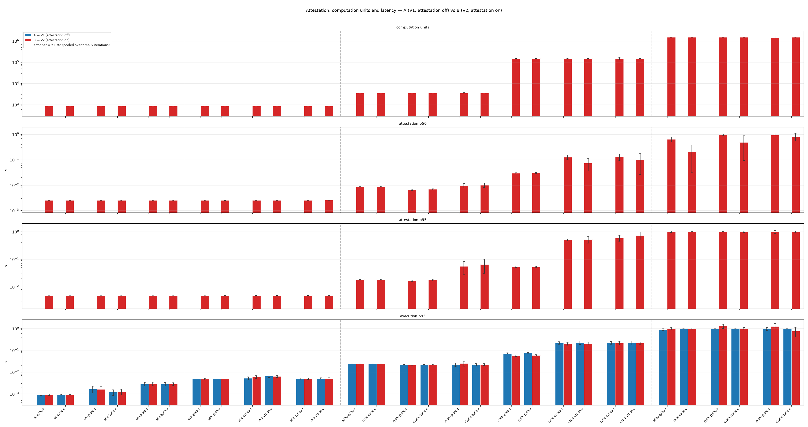
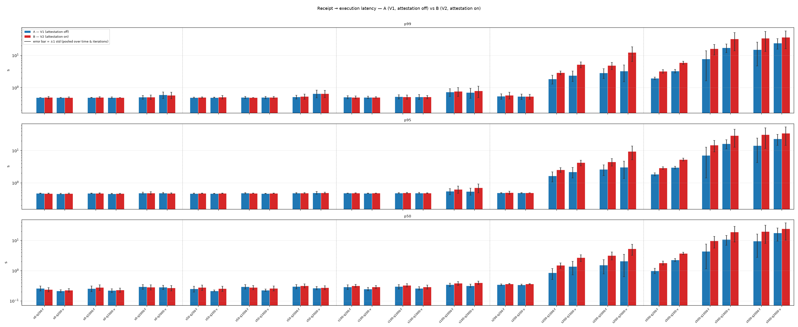
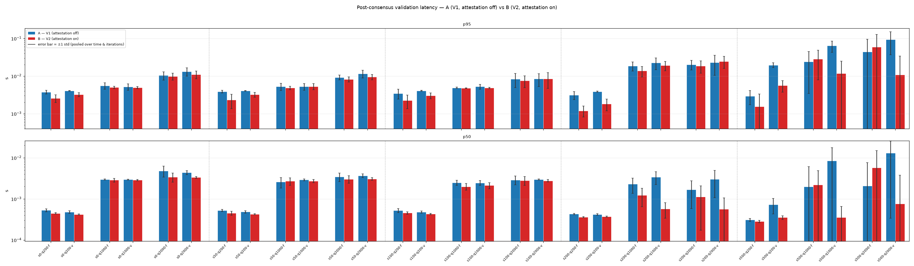
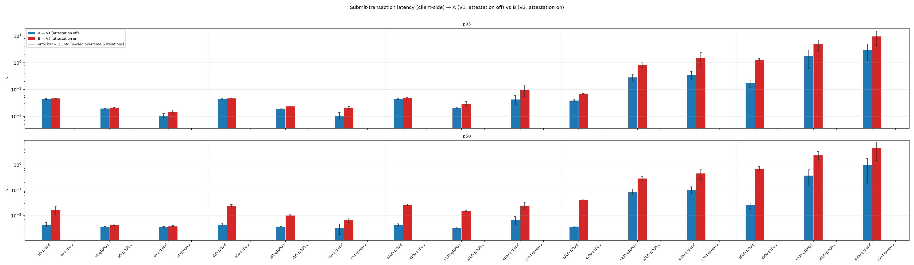
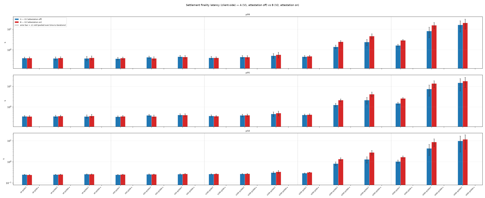
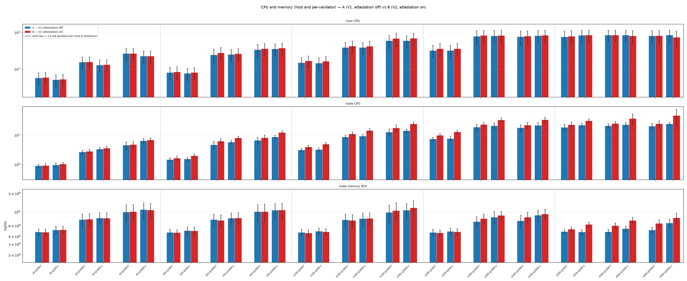
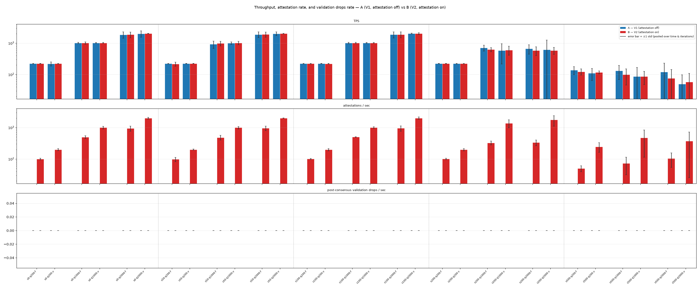
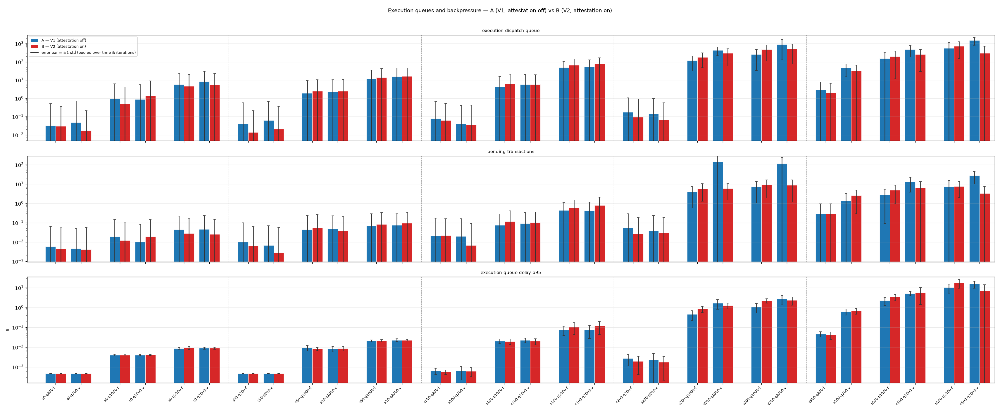

# Stress-test runs and results

Running log of the stress tests from `stress-plan.md`: the exact commands,
the results of each run, and a brief analysis.

All commands are run from the `iota` monorepo root unless noted.

---

## H1 — attestation overhead (W4: slow owned-object; V1 vs V2)

**Goal:** measure what validator attestation costs. Attestation (the
pre-consensus dry-run) happens in the `submit_tx` path independent of the
congestion mode, so H1 deliberately keeps sequencing out of the picture:
**owned-object** transactions only (no shared-object scheduling at all). Each
configuration is run twice under identical load; the only difference is
attestation off (all `UserTransactionV1`, the zero-attestation control — "A")
vs on (all `UserTransactionV2`, attested — "B"). We then compare the two runs to
see how the metrics differ between them; this is purely a measurement, with no
pass/fail threshold.

---

### Experiment as run

Rather than a single submission rate (target QPS), H1 sweeps a matrix so the
overhead is measured across a range of per-transaction computation units, both
client submission paths (via fullnode vs direct to a single validator), and
three load levels — target QPS of 200, 1000, and 2000 tx/s. Driven by
`stress-attestation-sequencer/h1/matrix.sh` (each configuration calls `run.sh`,
which runs A then B back-to-back on a fresh network, scrapes Prometheus into
per-run JSON, aggregates, and plots):

- **Workload**: `slow::slow(n, size)` with `n == size`, owned-object
  (`SLOW_SHARED=false`) — each transaction only does CPU work (no shared
  objects), so no congestion control or scheduling noise, so nothing but
  attestation drives the A vs B difference.
- **Computation** (`slow_size`, with `n == size`): {0, 50, 100, 200, 500} — the
  argument passed to `slow::slow(n, size)`; larger values mean more CPU work
  per transaction. But gas is bucketed (rounded up to `gas_rounding_step`), so
  the two smallest workloads fall in the same bucket and bill identically:
  `slow0` and `slow50` both sit at the floor (equal attestation cost — see
  finding 1), and the per-transaction computation cost only steps up from
  `slow100` onward.
- **Path**: `f` = submit via fullnode (`DIRECT=false`); `v` = pinned
  direct-to-one-validator (`DIRECT=true NUM_TARGET_VALIDATORS=1`).
- **Rate** (`target_qps`): {200, 1000, 2000}.
- 5 × 2 × 3 = **30 configurations**, **10 iterations** each; every iteration
  runs Run A (V1, attestation OFF) and Run B (V2, attestation ON).

`run.sh` re-bootstraps a fresh genesis and network (empty DB) between A and B so
both share the same cold baseline and warmup — only attestation differs. The
monitoring stack is cycled down (without wiping its volume) and back up too,
since leaving Prometheus up across the reset would give Run B a longer warmup.
In unattended runs the TSDB is additionally wiped between A and B (Run A's JSON
is saved first); run interactively it is kept, so both windows coexist in one
Grafana view.

Aggregation and reporting tooling (all under `h1/` directory):

- `make_table.py` generates `results/summary_table.md` (+
  `results/summary_table.csv`): one row per configuration, an A/B cell per
  metric (`mean ± std` pooled over time × iterations), with the network-level
  series computed exactly as `plot.py` does (rate / `histogram_quantile`,
  per-validator collapse).
- `summary_plot.py` generates `results/summary_plots/*.png`: grouped A vs B
  bar charts per metric, configurations on the x-axis, log-scale y.

> [!NOTE]
> Client-side `settlement_finality_latency` and `submit_transaction_latency` are
> recorded only on the fullnode path, so they exist for `f` configurations only;
> the `v` (direct-to-validator) configurations bypass the fullnode and report no
> client-side latency.

---

### Findings (10 iterations per configuration)

Numbers below are means pooled over time × iterations. Per-configuration means
are steady — they vary only about 0.3–2 % from run to run — so 10 iterations
are enough to pin down every effect below. Where A and B come out almost equal,
such as throughput, the gap is smaller than that run-to-run noise: we can't
tell them apart, which is exactly the point — attestation makes no measurable
difference there. Figure error bars are ±1 std (signal variability) by default;
`summary_plot.py --disp sem` switches them to the standard error of the mean.

In the figures below, blue = **A (V1, attestation off)** and red = **B (V2,
attestation on)**; the x-axis is one group per configuration
(`s<size>·q<qps>·<path>`, `f` = fullnode, `v` = direct-to-validator), with
dashed separators between computation sizes; the y-axis is log-scaled.

---

**1. Attestation is a full execution dry-run, plus a small fixed overhead.**
`validator_attestation_latency` (B only) grows with the transaction's
computation cost and, once that cost is large, lands close to the actual
execution latency. Both client paths, at `qps1000`:

Fullnode path (`f`):

| slow_size | attest. lat. p50 | attest. lat. p95 | exec. lat. p95 | CUs  |
| --- | --- | --- | --- | --- |
| 0   | 2.5 ms | 4.8 ms | 1.6 ms | 850  |
| 50  | 2.5 ms | 4.8 ms | 6.0 ms | 850  |
| 100 | 6.6 ms | 17 ms  | 21 ms  | 3.5k |
| 200 | 127 ms | 499 ms | 199 ms | 150k |
| 500 | 961 ms | 1.00 s | 1.28 s | 1.5M |

Direct-to-one-validator path (`v`):

| slow_size | attest. lat. p50 | attest. lat. p95 | exec. lat. p95 | CUs  |
| --- | --- | --- | --- | --- |
| 0   | 2.5 ms | 4.8 ms | 1.2 ms | 850  |
| 50  | 2.5 ms | 4.8 ms | 6.3 ms | 850  |
| 100 | 6.9 ms | 18 ms  | 22 ms  | 3.5k |
| 200 | 74 ms  | 526 ms | 204 ms | 150k |
| 500 | 482 ms | 988 ms | 973 ms | 1.5M |

Attestation and execution are close but not the same number, because
`validator_attestation_latency` covers more than the execute step. Both load
the inputs and run the Move VM. On top, attestation runs the deny / input /
coin-deny checks, builds the attestation, and hops onto a separate worker
thread. `exec. lat. p95` (`try_execute_immediately`) times only the execute
path — lock, input load, Move VM, effects — without those extras. For a no-op
transaction (`slow0`) the Move work is almost nothing, so both are just fixed
overhead; attestation carries more of it (the checks and the thread hop), so it
sits a little above execution (≈2.5 vs ≈1.6 ms). As the transaction does real
work, that shared Move cost dominates both and the extras fade, so the two move
together. A heavy attested transaction is still executed twice, though — once
for the dry-run, once for real — so it costs the validator roughly double.

---

**2. Internal execution latency: unchanged.**
`authority_state_internal_execution_latency` (the real, post-consensus VM
execution) is A≈B (median B/A = **1.00**, range 0.77–1.32). Attestation adds
nothing to actual execution — its cost lives entirely in the pre-consensus
dry-run.

---

**3. Compute-unit accounting is exact.** Attested computation units equal actual
computation units for every owned-object configuration (ratio = 1.0), confirming
attestation predicts the computation cost precisely for these transactions.

*Computation units, attestation latency (p50/p95), and actual execution latency
(p95) — findings 1–3. CUs sit at the gas floor for `slow0`/`slow50` and step up
from `slow100`; attestation latency converges to execution latency.*

---

**4. Receipt → execution latency: roughly doubles under heavy load.**
`validator_transaction_execution_latency` times the whole internal pipeline on
the receiving validator — receipt via `submit_tx`, attestation, consensus,
post-consensus validation, and execution — no client/fullnode time. Median
(p50) at `qps1000`:

| slow_size | f: A | f: B | f B/A | v: A | v: B | v B/A |
| --- | --- | --- | --- | --- | --- | --- |
| 0   | 255 ms | 280 ms | 1.10 | 220 ms | 227 ms | 1.03 |
| 50  | 294 ms | 277 ms | 0.94 | 226 ms | 260 ms | 1.15 |
| 100 | 297 ms | 329 ms | 1.11 | 261 ms | 289 ms | 1.11 |
| 200 | 844 ms | 1.49 s | 1.77 | 1.37 s | 2.68 s | 1.95 |
| 500 | 4.4 s  | 9.6 s  | 2.21 | 10.8 s | 18.9 s | 1.75 |

At light load the pipeline is ≈250–330 ms and A≈B — dominated by consensus,
with attestation (≈2.5 ms) lost in the noise. At heavy compute B runs ≈1.8–2.2×
A (`slow500-f` 4.4 s → 9.6 s), because attestation adds a second full execution
before consensus (finding 1) and, under load, the extra work compounds through
queueing. p95 tracks the same (`slow500-f` 7.1 s → 14.8 s).

*Validator-internal receipt → executed latency — the pure validator-internal
pipeline, with no client/fullnode time.*

---

**5. Post-consensus validation latency: unaffected by attestation.**
`validate_and_resolve_conflicts` (the post-consensus pass) is where attestation
adds Check #3 — attestor verification plus cost bounds. But that's a few integer
comparisons per tx; the pass is dominated by the already-executed cache lookup
(Check #1) and owned-object lock/conflict resolution. Both paths, `qps1000`:

Fullnode path (`f`):

| slow_size | p50 A | p50 B | p50 B/A | p95 A | p95 B | p95 B/A |
| --- | --- | --- | --- | --- | --- | --- |
| 0   | 3.0 ms | 2.9 ms | 0.96 | 5.6 ms | 5.0 ms | 0.90 |
| 50  | 2.6 ms | 2.7 ms | 1.05 | 5.2 ms | 4.8 ms | 0.92 |
| 100 | 2.5 ms | 2.0 ms | 0.80 | 4.9 ms | 4.8 ms | 0.98 |
| 200 | 2.3 ms | 1.2 ms | 0.54 | 19 ms  | 14 ms  | 0.74 |
| 500 | 2.0 ms | 2.2 ms | 1.12 | 24 ms  | 28 ms  | 1.18 |

Direct-to-one-validator path (`v`):

| slow_size | p50 A | p50 B | p50 B/A | p95 A | p95 B | p95 B/A |
| --- | --- | --- | --- | --- | --- | --- |
| 0   | 3.0 ms | 2.9 ms | 0.97 | 5.2 ms | 5.0 ms | 0.95 |
| 50  | 2.9 ms | 2.7 ms | 0.94 | 5.2 ms | 5.3 ms | 1.01 |
| 100 | 2.5 ms | 2.1 ms | 0.87 | 5.3 ms | 4.8 ms | 0.92 |
| 200 | 3.4 ms | 0.6 ms | 0.17 | 23 ms  | 19 ms  | 0.85 |
| 500 | 8.4 ms | 0.4 ms | 0.04 | 64 ms  | 12 ms  | 0.18 |

p50 is ≈2–3 ms at light load, and the B/A column has no consistent direction —
it swings from 0.04 to 1.2, worst on the `v` heavy configs. That's noise, not an
attestation effect: the pass is timed per consensus commit, so heavy configs
(low throughput) get few samples. p95 rises under load (≈5 ms → 14–64 ms) on
both A and B, from contention on the pass. Attestation's Check #3 is lost in the
noise; its cost is pre-consensus (finding 1), not here.

*Time in `validate_and_resolve_conflicts`; Check #3 (attestor verification) is
the attestation-added work on this path.*

---

**6. Submit latency (fullnode path): a fixed per-transaction addition.** B's
submit `p50` exceeds A's by roughly the attestation latency, so the *ratio* is
largest where the baseline is smallest (low rate / low computation cost):
`slow0-q200` 4.4 ms → 16.7 ms (3.8×), `slow500-q200` 26 ms → 693 ms (26×, i.e.
+667 ms ≈ the attestation cost). At high rate the queueing baseline dominates
and the ratio shrinks (≈1.1–6×). The *added* latency (B − A) equals the dry-run
only at low rate; under load the dry-runs queue and it grows well past that
(`slow500-q2000` submit reaches 4.6 s).

Submit p50 (ms) on the fullnode path (A = attestation off, B = on):

| slow_size | q200 A | q200 B | q1000 A | q1000 B | q2000 A | q2000 B |
| --- | --- | --- | --- | --- | --- | --- |
| 0   | 4.4 | 17  | 3.7 | 4.2  | 3.6 | 3.8  |
| 50  | 4.4 | 24  | 3.7 | 10   | 3.2 | 6.6  |
| 100 | 4.4 | 26  | 3.3 | 15   | 6.8 | 25   |
| 200 | 3.7 | 41  | 88  | 288  | 103 | 457  |
| 500 | 26  | 693 | 383 | 2344 | 965 | 4574 |

*Client submit latency, fullnode path only — finding 6.*

---

**7. Settlement finality latency: the client sees the same doubling.**
`settlement_finality_latency` is the client's submit→finality time (fullnode
path only). It's the end-to-end view of the internal pipeline (finding 4) plus
network and finality, so it moves the same way. Fullnode path, `qps1000`:

| slow_size | p50 A | p50 B | p50 B/A | p95 A | p95 B | p95 B/A |
| --- | --- | --- | --- | --- | --- | --- |
| 0   | 248 ms | 252 ms | 1.02 | 347 ms | 360 ms | 1.04 |
| 50  | 257 ms | 257 ms | 1.00 | 391 ms | 347 ms | 0.89 |
| 100 | 265 ms | 273 ms | 1.03 | 388 ms | 397 ms | 1.02 |
| 200 | 821 ms | 1.35 s | 1.64 | 1.24 s | 2.12 s | 1.71 |
| 500 | 4.33 s | 8.70 s | 2.01 | 7.39 s | 13.7 s | 1.85 |

At light load B≈A (≈250 ms, dominated by consensus/finality; attestation is
negligible). At heavy compute B runs ≈1.6–2× A (`slow500` 4.3 s → 8.7 s p50),
the doubling from finding 4 carried through to what the client observes.

*Client settlement-finality latency, fullnode path only.*

---

**8. CPU: attestation adds ≈30 % busy cores.** Per-validator CPU (busiest
validator, cadvisor) B/A median = **1.29×** (range 1.02–1.95×) — e.g.
`slow100-f-q1000` 8.7 → 11.1 cores, `slow500-f-q1000` 21.0 → 24.8 cores.
Consistent with the extra dry-run execution.

Busiest-validator CPU (cores) by slow_size at `qps1000`:

| slow_size | f: A | f: B | f B/A | v: A | v: B | v B/A |
| --- | --- | --- | --- | --- | --- | --- |
| 0   | 2.7  | 2.8  | 1.05 | 3.3  | 3.6  | 1.08 |
| 50  | 4.7  | 6.3  | 1.33 | 5.8  | 8.1  | 1.39 |
| 100 | 8.7  | 11.1 | 1.27 | 9.2  | 14.3 | 1.56 |
| 200 | 18.6 | 22.9 | 1.23 | 21.0 | 32.7 | 1.56 |
| 500 | 21.0 | 24.8 | 1.18 | 22.8 | 36.8 | 1.62 |

The pinned path (`v`) rises more (up to ≈1.6×) than the fullnode path
(≈1.2–1.3×), because that one validator attests every transaction, while on `f`
the attestation work is spread across the four.

Busiest-validator memory RSS (GB) by slow_size at `qps1000`:

| slow_size | f: A | f: B | f B/A | v: A | v: B | v B/A |
| --- | --- | --- | --- | --- | --- | --- |
| 0   | 0.8 | 0.8 | 1.01 | 0.8 | 0.8 | 0.99 |
| 50  | 0.8 | 0.7 | 0.98 | 0.8 | 0.8 | 1.01 |
| 100 | 0.7 | 0.7 | 0.98 | 0.8 | 0.8 | 1.01 |
| 200 | 0.7 | 0.8 | 1.12 | 0.8 | 0.9 | 1.07 |
| 500 | 0.5 | 0.6 | 1.27 | 0.5 | 0.7 | 1.37 |

Memory stays small and roughly flat (≈0.7–0.8 GB); attestation barely moves it —
the heavy-config bumps are on ≈0.5–0.9 GB and noisy. Attestation's cost is CPU,
not memory.

*Whole-machine host CPU and busiest-validator CPU / memory (RSS) — finding 8.*

---

**9. Throughput: no penalty at normal load; a fullnode cost at heavy compute.**
Finalized TPS (`transactions_included_in_checkpoint`) is statistically identical
A vs B at most configs — median `(B−A)/A = +0.1 %`, within the ≈0.6 % standard
error.

Finalized TPS by slow_size at `qps1000` (A = attestation off, B = on; `slow500`
is small and noisy):

| slow_size | f: A | f: B | f B/A | v: A | v: B | v B/A |
| --- | --- | --- | --- | --- | --- | --- |
| 0   | 1016 | 1012 | 1.00 | 1020 | 1021 | 1.00 |
| 50  | 927  | 980  | 1.06 | 1008 | 1022 | 1.01 |
| 100 | 1014 | 1017 | 1.00 | 1022 | 1022 | 1.00 |
| 200 | 711  | 626  | 0.88 | 585  | 604  | 1.03 |
| 500 | 131  | 99   | 0.75 | 87   | 87   | 1.00 |

Caveat: the +0.1 % median is the normal-load result. On the fullnode path the
cost grows with compute — B/A ≈ 0.88 at `slow200`, ≈ 0.75 at `slow500` — while
the pinned path (`v`) shows no penalty (B/A ≈ 1.0), even though it sends every
attestation to a single validator. Why the fullnode path pays and the pinned
path does not is not established here (both sit at ≈80/96 host CPU, so it is not
spare capacity); it needs a dedicated look.

attestations / sec (the busiest validator's rate) shows how the two client
paths spread attestation work. On the pinned path (`v`) one validator attests
nearly all traffic, so its rate tracks the full transaction rate; on the
fullnode path (`f`), the fullnode spreads submissions across the four
validators, so the busiest one attests only its share — about half the pinned
rate at light load (`slow0-q1000`: 497 vs 992 /s) and roughly a quarter under
heavy compute (`slow200-q1000`: 327 vs 1371 /s). Finalized TPS is approximately
the same on both paths, so this is about how attestation work is spread, not
throughput.

attestations / sec by path (busiest validator, `qps1000`):

| config          | `f` | `v`  | v/f  |
| ---             | --- | ---  | ---  |
| `slow0-q1000`   | 497 | 992  | 2.0× |
| `slow100-q1000` | 503 | 997  | 2.0× |
| `slow200-q1000` | 327 | 1371 | 4.2× |
| `slow500-q1000` | 73  | 475  | 6.5× |

---

**10. No post-consensus validation drops.**
`consensus_handler_validation_dropped_transactions` is ≈0 on both the attested
(V2) and unattested (V1) paths, across every configuration.

*Finalized TPS, attestations / sec, and post-consensus validation-drops / sec —
findings 9 and 10. TPS is A≈B; no validation drops on either path.*

---

**11. Execution queues and backpressure: deeper backlog under heavy load.**
Under load, execution work queues up. Headline signal: queue-delay p95 (how long
a tx waits before executing); dispatch-queue depth and pending-tx count track
it. `qps1000`:

| slow_size | f: A | f: B | f B/A | v: A | v: B | v B/A |
| --- | --- | --- | --- | --- | --- | --- |
| 0   | 4 ms   | 4 ms   | 1.00 | 4 ms  | 4 ms  | 1.01 |
| 50  | 9 ms   | 8 ms   | 0.87 | 8 ms  | 9 ms  | 1.04 |
| 100 | 20 ms  | 20 ms  | 0.96 | 23 ms | 20 ms | 0.89 |
| 200 | 459 ms | 852 ms | 1.86 | 1.7 s | 1.3 s | 0.76 |
| 500 | 2.2 s  | 3.4 s  | 1.51 | 5.2 s | 5.8 s | 1.11 |

Light configs barely queue (≈4–20 ms, A≈B). On the fullnode path B carries a
deeper backlog under heavy compute — queue-delay 1.5–1.9× A, and dispatch queue
and pending grow the same way (`slow200-f` 121 → 182 and 4.0 → 5.9) — because
attestation's extra execution piles onto a busy pipeline. The pinned path shows
no clean effect (B/A 0.76–1.11, noisy, A-side outliers), matching its throughput
not dipping under attestation either.

*Execution dispatch queue, pending transactions, and execution queue delay
(p95).*

---

### H4 — safety (pass/fail)

**PASS.** All safety counters are zero across the pooled runs (checkpoint forks,
inconsistent state hash, double-spend, attestation task panics, soft-lock
equivocation), and no validator crashed, restarted, or OOM'd.

> [!NOTE]
> These results use two temporary post-consensus-validation fixes (one per
> transaction path): each keeps a sequenced transaction when an owned input is
> not yet available (`ObjectNotFound`) rather than dropping it, since a drop
> there is per-node and would fork the checkpoint. Both fixes are on branch
> `protocol-research/fix/attestation-coin-deny-post-consensus-drop-fork`. The
> proper fix routes such deterministic failures to a cancelled-execution status
> — tracked in
> [iota-private#438](https://github.com/iotaledger/iota-private/issues/438).

---

### Takeaway

Attestation's cost is a **pre-consensus execution dry-run**: a ≈2.5 ms fixed
floor that converges to a full extra execution for heavy transactions (roughly
2× execution cost, ≈+30 % validator CPU). It adds a fixed amount to fullnode
submit latency but costs no throughput at normal load, and leaves internal
(post-consensus) execution latency and post-consensus validation unchanged.
Only under heavy compute on the fullnode path is there a real cost: throughput
dips and end-to-end latency — receipt→execution and client settlement finality
— roughly doubles as the extra work deepens the execution backlog. With the
temporary post-consensus fixes in place, there are no validation drops or
checkpoint forks on either path.

Full per-configuration numbers: `h1/results/summary_table.md`. Figures:
`h1/results/summary_plots/*.png`.
