# Stress-test runs and results

Running log of the stress tests from `stress-plan.md`: the exact commands,
the results of each run, and a brief analysis.

All commands are run from the `iota` monorepo root unless noted.

---

## TL;DR

Attestation's cost is a **pre-consensus execution dry-run plus the pool wait
and async resume around it**. The dry-run itself tracks the real execution
latency — a heavy attested transaction is executed twice, roughly doubling
the validator's work (≈+30 % busy cores on `n4`). At light load, that is the
whole story (sub-millisecond overhead); under load, the pool wait and async
resume around the dry-run grow to dominate the attestation time (findings 1,
7). Compute-unit
accounting is exact, and actual execution, post-consensus validation, and
throughput at normal load are untouched (findings 1, 2, 5, 8).

On `n4`, the costs surface under heavy compute. The client pays the full
attestation latency on every fullnode submit, and end-to-end latency —
receipt→execution and settlement finality — roughly doubles; on the fullnode
path, throughput also dips (B/A ≈ 0.78–0.81) and the execution backlog deepens
(findings 3, 6, 9). But attestation also moves the backlog: by slowing
admission it shifts it from after consensus to before it — checkpoint
lag on the direct paths is far smaller with attestation on, while
`num_inflight` grows until the heaviest pinned configuration reaches the submit
semaphore and pre-consensus shedding fires (findings 4, 11). The strength of
that shift follows how concentrated the attestation is (pinned strongest,
direct-to-all weaker, fullnode weakest), and the fullnode's own transaction
driver queues and paces what enters consensus: with attestation off, the
direct paths — spread over all validators or pinned to one — build several
times the fullnode path's post-consensus backlog (finding 4). One observation
deserves follow-up: the fullnode-path throughput dip is unexplained (finding
8). With the temporary post-consensus fixes in place, there are no validation
drops or checkpoint forks on either path or network size (finding 8, H4 PASS).

The 24-validator campaign was run to test the spreading argument directly:
each transaction is attested by one validator, so the more validators share
the stream, the smaller each one's share of the overhead. On the validator
side, the data confirms it. On `f1` and `v24`, the busiest validator attests
≈150–170/s of a ≈1000 TPS stream (its 1/24th share plus imbalance), CPU B/A
stays at 1.00–1.06 across the sizes (from 1.04–1.30 on `n4`), and B behaves
like A after consensus — same checkpoint lag, same shedding (findings 4, 7,
10). Concentrating the same stream on one validator shows the opposite pole:
the attesting host doubles its CPU (B/A up to 2.06) and sheds pre-consensus
from `slow100` on against the smaller submit semaphore (1666 permits) — on
the pinned path the admission throttle, not the dry-run, shapes every
comparison from `slow100` up (findings 2, 4, 5, 9, 11).

On the client side, there is nothing for spreading to reduce at normal load:
in `n24`'s unsaturated regime (`slow0`/`slow50` deliver the full 1000 TPS),
settlement finality is ≈270–300 ms with B/A = 1.00–1.01 and submit adds
≈1–3 ms — the same picture as `n4`. The per-transaction attestation latency
stays in the submit path regardless of committee size: spreading divides the
validators' aggregate load, not the individual transaction's added wait. The
regime where `n4` showed a client-visible cost (heavy compute, ≈1.6–2×) is
the regime a single machine cannot test at committee scale — from `slow100`
on, 24 replicated executions saturate the host and both sides measure the
shared backlog (findings 3, 6). A 48-validator campaign was also run; it
oversaturated the machine outright (≈60 % of the target delivered already at
`slow0`, the no-attestation control itself semaphore-throttled), so it is
not presented here — where comparable, it agrees in direction with `n24`
(e.g. the pinned host's CPU B/A continues 1.56 → 2.06 → 2.34 across
`n4` → `n24` → `n48`).

---

## H1 — attestation overhead (W4: slow owned-object; V1 vs V2)

**Goal:** measure what validator attestation costs. Attestation (the
pre-consensus dry-run) happens in the `submit_tx` path independent of the
congestion mode, so H1 deliberately keeps sequencing out of the picture:
**owned-object** transactions only (no shared-object scheduling at all). Each
configuration is run twice under identical load; the only difference is
attestation off (all `UserTransactionV1`, the zero-attestation control — "A")
vs on (all `UserTransactionV2`, attested — "B"). We then compare the two runs to
see how the metrics differ between them; this is purely a measurement, with no
pass/fail threshold.

---

### Experiment as run

Rather than a single submission rate (target QPS), H1 sweeps a matrix so the
overhead is measured across a range of per-transaction computation units,
three client submission paths (via fullnode, direct to a single validator,
direct to all four), and three load levels — target QPS of 200, 1000, and
2000 tx/s. Driven by
`stress-attestation-sequencer/h1/matrix.sh` (each configuration calls `run.sh`,
which runs A then B back-to-back on a fresh network, scrapes Prometheus into
per-run JSON, aggregates, and plots):

- **Workload**: `slow::slow(n, size)` with `n == size`, owned-object
  (`SLOW_SHARED=false`) — each transaction only does CPU work (no shared
  objects), so no congestion control or scheduling noise, so nothing but
  attestation drives the A vs B difference.
- **Computation** (`slow_size`, with `n == size`): {0, 50, 100, 200, 500} — the
  argument passed to `slow::slow(n, size)`; larger values mean more CPU work
  per transaction. But gas is bucketed (rounded up to `gas_rounding_step`), so
  the two smallest workloads fall in the same bucket and bill identically:
  `slow0` and `slow50` both sit at the floor (equal attestation cost — see
  finding 1), and the per-transaction computation cost only steps up from
  `slow100` onward.
- **Path**: `f1` = submit via fullnode (`DIRECT=false`); `v1` = pinned
  direct-to-one-validator (`DIRECT=true NUM_TARGET_VALIDATORS=1`); `v4` =
  direct to all 4 validators (`DIRECT=true NUM_TARGET_VALIDATORS=4`), the
  driver spreading submissions across them.
- **Rate** (`target_qps`): {200, 1000, 2000}.
- **Machine**: all runs on one AMD EPYC 9454P server (48 cores / 96 threads,
  251 GiB RAM, Ubuntu 24.04), running the private network in docker — 4
  validators plus 1 fullnode — with the stress client on the same host.
- 5 × 3 × 3 = **45 configurations**, **10 iterations** each; every iteration
  runs Run A (V1, attestation OFF) and Run B (V2, attestation ON).

The same matrix was then re-run on a **24-validator** network (plus 1
fullnode) on the same machine, to check how the overhead changes when
attestation spreads across a larger committee instead of concentrating on 4
validators. Differences from the 4-validator campaign:

- the all-validators path becomes `v24` (`DIRECT=true
  NUM_TARGET_VALIDATORS=24`); configuration labels carry the network size as
  an `-n24` suffix (`-n4` for the 4-validator matrix);
- the host needed tuning to hold the extra node containers: larger kernel
  neighbor table limits, static container hostnames via `extra_hosts`
  (docker's embedded DNS drops lookups under the churn of that many peers),
  and larger UDP buffers.

Its results land in `results/summary_table_n24.{md,csv}` and
`results/summary_plots_n24/` (`--net 24` on the tooling below).

Two host-bound effects shape the `n24` results from `slow100` up:

- **The machine saturates at the heavier sizes.** At `slow0` and `slow50`
  the host keeps up (the full 1000 tx/s is delivered), but from `slow100`
  on, 24 validators executing every transaction on the same 96 hardware
  threads run out of CPU: delivered TPS collapses (≈320–460 at `slow100`,
  single digits at `slow500`) and latencies pile up to ≈30 s p50 at the
  heavy end — half the 60 s measurement window, pure backlog — on A and B
  alike. Client-side A vs B comparisons above `slow50` therefore mostly
  measure the shared backlog, not attestation.
- **The pinned path throttles its own intake.** The submit semaphore scales
  down with committee size (10000 permits on `n4`, 1666 on `n24` — finding
  11), so from `slow100` on, the one validator receiving the whole stream
  rejects part of B's stream before consensus (B holds each permit through
  the dry-run, so B trips the limit long before A). Wherever B's `v1`
  numbers look *better* than A's downstream of admission (execution wall
  clock, commit sizes, queues, checkpoint lag, post-consensus shedding),
  that is less load being admitted, not a cheaper pipeline.

A third campaign on a **48-validator** network was run as well, but is not
presented: doubling the replication again oversaturated the machine (only
≈60 % of the target delivered already at `slow0`, every latency
backlog-shaped, and the semaphore down to 833 permits — small enough that
even the no-attestation control shed continuously on the pinned path).
Where its numbers are comparable, they agree in direction with `n24`. Its
tables and figures remain in `results/summary_table_n48.{md,csv}` and
`results/summary_plots_n48/`.

Unless stated otherwise, every table and figure below shows the `qps1000`
rate. All three rates were run; the effects barely depend on the rate, so one
representative rate keeps the tables and figures readable. Where a result does
depend on the rate, the prose or an extra table says so explicitly.

`run.sh` re-bootstraps a fresh genesis and network (empty DB) between A and B so
both share the same cold baseline and warmup — only attestation differs. The
monitoring stack is cycled down (without wiping its volume) and back up too,
since leaving Prometheus up across the reset would give Run B a longer warmup.
In unattended runs the TSDB is additionally wiped between A and B (Run A's
JSON is saved first); in interactive runs, it is kept, so both runs' windows
coexist in one Grafana view.

Aggregation and reporting tooling (all under `h1/` directory):

- `make_table.py` generates `results/summary_table_n<N>.md` (+
  `results/summary_table_n<N>.csv`) for one network size at a time (`--net`,
  default 4): one row per configuration, an A/B cell per
  metric (`mean ± std` over all seconds of all iterations), with the
  network-level series computed exactly as `plot.py` does (rate /
  `histogram_quantile`, per-validator collapse). Bursty queue and shedding
  gauges (in-flight count, dispatch queue, pending transactions, shed
  percentages) instead report the
  peak: max over time per iteration, averaged across iterations — their mean
  over time would hide the short spikes that actually hit a limit.
- `summary_plot.py` generates `results/summary_plots_n<N>/*.png` (same `--net`
  switch): grouped A vs B bar charts per metric, configurations on the x-axis,
  log-scale y.

> [!NOTE]
> Client-side `settlement_finality_latency` and `submit_transaction_latency` are
> recorded only on the fullnode path, so they exist for `f1` configurations
> only; direct-to-validator configurations bypass the fullnode and report no
> client-side latency.

---

### Findings (10 iterations per configuration)

Numbers below are means over all seconds of all iterations, except the bursty
queue/shedding gauges, which report peaks (see the tooling note above).
Per-configuration means are steady at light and moderate load — they vary a
few percent from run to run — and noisier on the heavy-compute configurations,
where throughput is small (up to tens of percent). Figure error bars are
±1 std (signal variability) by default; `summary_plot.py --disp sem` switches
them to the standard error of the mean.

In the figures below, blue = **A (V1, attestation off)** and red = **B (V2,
attestation on)**; the x-axis is one group per configuration
(`s<size>·<path>`, `f1` = fullnode, `v1` = pinned to one validator,
`v4`/`v24` = direct to all validators), with dashed separators between
computation sizes; the y-axis is log-scaled. To keep the figures readable,
the shedding figure shows only the configurations with a non-zero value in
at least one of its panels, and the client-side figures only the fullnode
path. The tables and
`summary_table_n4.md` / `summary_table_n24.md` carry the full 45
configurations of each campaign.

---

**1. Attestation is a full execution dry-run, plus pool wait and async resume
that grow with load; compute-unit accounting is exact.**

Metric descriptions

| metric | codebase description | aggregation |
| --- | --- | --- |
| `validator_attestation_latency` | Latency of `attest_transaction` (the pre-consensus dry-run) for `UserTransactionV2` transactions; spans pool wait + dry-run execution + async resume | histogram; p50/p95/p99 (`histogram_quantile`) over buckets combined across validators; averaged over all seconds of all iterations |
| `validator_attestation_queue_wait` | Time an attestation dry-run waits on the `spawn_blocking` pool before a worker starts it (queue wait only) | histogram; p50/p95/p99 (`histogram_quantile`) over buckets combined across validators; averaged over all seconds of all iterations |
| `validator_attestation_execution_latency` | Wall-clock of the attestation Move-VM dry-run itself (`spawn_blocking` closure body), excluding pool wait | histogram; p50/p95/p99 (`histogram_quantile`) over buckets combined across validators; averaged over all seconds of all iterations |
| `validator_attestation_async_resume_latency` | Time from the dry-run finishing on the blocking pool until the awaiting async task resumes (`spawn_blocking` join). Grows when the async runtime is saturated; full latency = queue wait + execution + this | histogram; p50/p95/p99 (`histogram_quantile`) over buckets combined across validators; averaged over all seconds of all iterations |
| `authority_state_internal_execution_latency` | Latency of actual certificate executions | histogram; p50/p95/p99 (`histogram_quantile`) over buckets combined across validators; averaged over all seconds of all iterations |
| `actual_computation_units` | Actual computation cost in gas units (CU) of attested transactions (`computation_cost` / `gas_price`), observed after execution | histogram; per-tx mean `rate(_sum)/rate(_count)` combined across validators (exact, not a quantile); averaged over all seconds of all iterations |
| `attested_computation_units` | Attestor's pre-consensus estimate of the computation cost in gas units (CU), for transactions that arrived as `UserTransactionV2` | histogram; per-tx mean `rate(_sum)/rate(_count)` combined across validators; averaged over all seconds of all iterations |
| `actual_to_attested_computation_units_ratio` | Ratio actual / attested computation units for attested transactions | histogram; per-tx mean `rate(_sum)/rate(_count)` combined across validators; averaged over all seconds of all iterations |

> [!IMPORTANT]
> The dry-run does not run on the async runtime: it is handed to a separate
> thread pool (`tokio::task::spawn_blocking`), and the async task that
> submitted it waits for the result. **Pool wait** is the time the dry-run sits
> queued before a pool thread starts it. **Async resume** is the time after the
> dry-run finishes until the waiting async task gets CPU time to continue. So
> full attestation latency = pool wait + dry-run execution + async resume.
> Under heavy load the pool's threads keep all CPU cores busy, which starves
> the async runtime — the async resume part then grows to seconds.

`validator_attestation_execution_latency` (B only — the dry-run itself, without
the pool wait and async resume around it) grows with the transaction's
computation cost and tracks the actual execution latency across the whole
sweep, matching it at the heavy end. The full attestation latency
(`validator_attestation_latency`) equals the dry-run at light compute, then
pulls away from `slow200` on — the wait and resume around the dry-run grow
with load, on every client path:

Fullnode path (`f1`), each latency cell `n4` ∣ `n24` (CUs are identical
on both networks):

| slow_size | attest. exec. lat. p95 | exec. lat. p95 | attest. full lat. p95 | CUs |
| :---: | --- | --- | --- | :---: |
| 0   | 0.95 ms  ∣ **1.11 ms** | 2.06 ms   ∣ **0.83 ms** | 0.95 ms   ∣ **2.24 ms** | 1k    |
| 50  | 4.80 ms  ∣ **4.91 ms** | 5.87 ms   ∣ **10.09 ms** | 4.83 ms   ∣ **10.77 ms** | 1k    |
| 100 | 16.21 ms ∣ **50.19 ms** | 20.30 ms  ∣ **298.71 ms** | 19.29 ms  ∣ **544.52 ms** | 4k    |
| 200 | 94.85 ms ∣ **532.13 ms** | 185.32 ms ∣ **846.48 ms** | 444.29 ms ∣ **1.495 s** | 128k  |
| 500 | 1.307 s   ∣ **6.582 s** | 1.200 s    ∣ **5.421 s** | 2.013 s    ∣ **10.008 s** | 1.37M |

Direct-to-one-validator path (`v1`):

| slow_size | attest. exec. lat. p95 | exec. lat. p95 | attest. full lat. p95 | CUs |
| :---: | --- | --- | --- | :---: |
| 0   | 0.95 ms   ∣ **0.95 ms** | 1.32 ms   ∣ **0.81 ms** | 0.95 ms   ∣ **3.14 ms** | 1k    |
| 50  | 4.80 ms   ∣ **4.86 ms** | 6.20 ms   ∣ **12.90 ms** | 4.85 ms   ∣ **63.49 ms** | 1k    |
| 100 | 17.37 ms  ∣ **23.24 ms** | 21.29 ms  ∣ **146.65 ms** | 20.60 ms  ∣ **592.36 ms** | 4k    |
| 200 | 78.78 ms  ∣ **185.40 ms** | 207.46 ms ∣ **760.29 ms** | 505.16 ms ∣ **1.902 s** | 128k  |
| 500 | 990.24 ms ∣ **4.896 s** | 999.34 ms ∣ **3.868 s** | 2.515 s    ∣ **9.340 s** | 1.37M |

Direct-to-all-validators path (`v4` / `v24`):

| slow_size | attest. exec. lat. p95 | exec. lat. p95 | attest. full lat. p95 | CUs |
| :---: | --- | --- | --- | :---: |
| 0   | 0.95 ms  ∣ **0.95 ms** | 1.21 ms   ∣ **0.83 ms** | 0.95 ms   ∣ **2.44 ms** | 1k    |
| 50  | 4.80 ms  ∣ **4.86 ms** | 6.02 ms   ∣ **9.88 ms** | 4.84 ms   ∣ **10.70 ms** | 1k    |
| 100 | 18.00 ms ∣ **44.69 ms** | 21.19 ms  ∣ **394.29 ms** | 20.35 ms  ∣ **487.64 ms** | 4k    |
| 200 | 93.27 ms ∣ **514.89 ms** | 221.61 ms ∣ **943.29 ms** | 503.07 ms ∣ **1.794 s** | 128k  |
| 500 | 1.372 s   ∣ **6.201 s** | 1.478 s    ∣ **5.141 s** | 2.712 s    ∣ **10.527 s** | 1.37M |

The dry-run and the real execution share the bulk of the work — load the
inputs, run the Move VM — so their latencies scale together with computation
cost. The differences are at the edges.

- For a no-op transaction (`slow0`) the Move work is almost nothing and only
fixed overhead remains; the real execution (`try_execute_immediately`: lock,
input load, Move VM, effects commit) carries more of it than the attestation
checks do, so it sits a little above the dry-run (≈1.3–2.1 vs ≈0.95 ms on `n4`).
- At mid-range compute (`slow200`), the real execution reads about twice the
dry-run — not extra work, but timing: it runs after consensus, where a whole
commit's transactions land at once and execute in parallel, and every validator
executes every transaction, while each transaction is attested once, paced
by client arrivals.
- On this one machine, that is 4× the CPU demand on `n4` and 24× on `n24`, so
the parallel executions share cores and each takes longer on the wall clock.
At `slow500`, the machine is saturated continuously either way and the two
converge.
- On `n24`, the light sizes stay clear of that limit (the no-op edge even
flips: execution p95 ≈0.8 ms, at the ≈1 ms dry-run floor), and the 24×
replication bites from `slow100` on — execution p95 jumps to ≈150–400 ms
against ≈20 ms on `n4`.
- A heavy attested transaction is still executed twice — once for the dry-run,
once for real — so it costs the validator roughly double.

*Computation units, attestation dry-run execution latency (p50/p95), and actual
execution latency (p95) — findings 1–2, `n4` campaign. CUs sit at the gas floor
for `slow0` and `slow50` and step up from `slow100`; the dry-run tracks actual
execution latency across the sweep.*

The same figure for the <code>n24</code> campaign

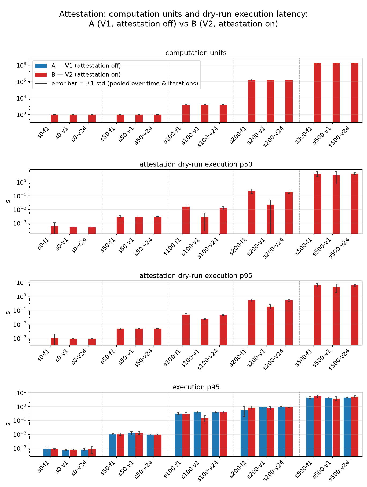

*Same panels, `n24` campaign — same CU steps; latencies match `n4` at the
light sizes and inflate from `slow100` on (finding 1).*

The full attestation latency adds the pool wait and async resume around the
dry-run: nothing at light load on either network, but the two grow to
dominate it once the machine runs hot — from `slow200` on `n4` (444 ms full
vs 95 ms dry-run on `f1`), from `slow100` on `n24` (77 ms full vs 16 ms
dry-run on `f1`). The split into its three parts (pool wait + dry-run
execution + async resume), each cell `n4` ∣ `n24`:

> [!NOTE]
> At light compute, every value is below the smallest histogram bucket (1 ms),
> so each part reads as the interpolation floor — `p × 1` ms, i.e. 0.50 ms at
> p50 and 0.99 ms at p99 — rather than a real latency; sub-millisecond parts
> are unresolvable, which is also why they don't sum to the full column.

Fullnode path (`f1`), p50:

| slow_size | pool wait | dry-run exec | async resume | full |
| :---: | --- | --- | --- | --- |
| 0   | 0.50 ms   ∣ **0.52 ms** | 0.50 ms   ∣ **0.60 ms** | 0.50 ms ∣ **0.50 ms** | 0.50 ms   ∣ **0.68 ms** |
| 50  | 0.51 ms   ∣ **0.71 ms** | 2.96 ms   ∣ **2.98 ms** | 0.50 ms ∣ **0.52 ms** | 2.99 ms   ∣ **3.35 ms** |
| 100 | 0.55 ms   ∣ **48.82 ms** | 6.10 ms   ∣ **16.26 ms** | 0.51 ms ∣ **0.81 ms** | 6.52 ms   ∣ **77.46 ms** |
| 200 | 59.26 ms  ∣ **212.89 ms** | 36.24 ms  ∣ **223.02 ms** | 0.83 ms ∣ **2.80 ms** | 113.94 ms ∣ **488.59 ms** |
| 500 | 170.36 ms ∣ **666.87 ms** | 765.24 ms ∣ **4.185 s** | 8.69 ms ∣ **113.29 ms** | 1.050 s    ∣ **5.475 s** |

Direct-to-one-validator path (`v1`), p50:

| slow_size | pool wait | dry-run exec | async resume | full |
| :---: | --- | --- | --- | --- |
| 0   | 0.50 ms  ∣ **0.54 ms** | 0.50 ms   ∣ **0.50 ms** | 0.50 ms   ∣ **0.50 ms** | 0.50 ms   ∣ **0.55 ms** |
| 50  | 0.51 ms  ∣ **1.79 ms** | 2.97 ms   ∣ **2.84 ms** | 0.50 ms   ∣ **0.52 ms** | 3.01 ms   ∣ **4.47 ms** |
| 100 | 0.57 ms  ∣ **8.87 ms** | 6.29 ms   ∣ **2.92 ms** | 0.51 ms   ∣ **12.07 ms** | 6.82 ms   ∣ **46.53 ms** |
| 200 | 7.93 ms  ∣ **36.91 ms** | 10.86 ms  ∣ **23.21 ms** | 7.16 ms   ∣ **78.99 ms** | 60.82 ms  ∣ **241.37 ms** |
| 500 | 42.59 ms ∣ **1.267 s** | 201.44 ms ∣ **3.328 s** | 182.38 ms ∣ **3.089 s** | 597.20 ms ∣ **5.029 s** |

Direct-to-all-validators path (`v4` / `v24`), p50:

| slow_size | pool wait | dry-run exec | async resume | full |
| :---: | --- | --- | --- | --- |
| 0   | 0.50 ms   ∣ **0.53 ms** | 0.50 ms   ∣ **0.50 ms** | 0.50 ms  ∣ **0.50 ms** | 0.50 ms   ∣ **0.54 ms** |
| 50  | 0.51 ms   ∣ **0.71 ms** | 2.98 ms   ∣ **2.89 ms** | 0.50 ms  ∣ **0.52 ms** | 3.01 ms   ∣ **3.33 ms** |
| 100 | 0.56 ms   ∣ **49.68 ms** | 6.49 ms   ∣ **12.36 ms** | 0.51 ms  ∣ **0.77 ms** | 6.92 ms   ∣ **71.10 ms** |
| 200 | 45.72 ms  ∣ **243.03 ms** | 36.77 ms  ∣ **190.07 ms** | 2.02 ms  ∣ **4.46 ms** | 117.28 ms ∣ **533.75 ms** |
| 500 | 145.01 ms ∣ **1.153 s** | 836.25 ms ∣ **4.302 s** | 27.83 ms ∣ **91.32 ms** | 1.276 s    ∣ **5.920 s** |

The same split at p99 (the tails)

Fullnode path (`f1`), p99:

| slow_size | pool wait | dry-run exec | async resume | full |
| :---: | --- | --- | --- | --- |
| 0   | 0.99 ms   ∣ **4.20 ms** | 0.99 ms   ∣ **1.16 ms** | 0.99 ms   ∣ **1.00 ms** | 0.99 ms   ∣ **4.77 ms** |
| 50  | 2.17 ms   ∣ **19.89 ms** | 4.96 ms   ∣ **7.08 ms** | 0.99 ms   ∣ **4.00 ms** | 5.21 ms   ∣ **22.76 ms** |
| 100 | 9.44 ms   ∣ **825.62 ms** | 23.24 ms  ∣ **71.16 ms** | 2.93 ms   ∣ **88.32 ms** | 24.74 ms  ∣ **854.23 ms** |
| 200 | 597.54 ms ∣ **1.705 s** | 135.36 ms ∣ **650.89 ms** | 67.57 ms  ∣ **130.96 ms** | 649.60 ms ∣ **2.047 s** |
| 500 | 1.413 s    ∣ **4.839 s** | 1.475 s    ∣ **7.416 s** | 498.77 ms ∣ **3.465 s** | 2.474 s    ∣ **11.961 s** |

Direct-to-one-validator path (`v1`), p99:

| slow_size | pool wait | dry-run exec | async resume | full |
| :---: | --- | --- | --- | --- |
| 0   | 0.99 ms   ∣ **7.52 ms** | 0.99 ms   ∣ **0.99 ms** | 0.99 ms   ∣ **0.99 ms** | 0.99 ms   ∣ **8.03 ms** |
| 50  | 2.98 ms   ∣ **101.12 ms** | 4.97 ms   ∣ **7.74 ms** | 1.00 ms   ∣ **4.03 ms** | 6.19 ms   ∣ **103.33 ms** |
| 100 | 14.80 ms  ∣ **685.04 ms** | 23.47 ms  ∣ **44.53 ms** | 2.84 ms   ∣ **592.67 ms** | 27.92 ms  ∣ **990.00 ms** |
| 200 | 474.62 ms ∣ **1.720 s** | 125.30 ms ∣ **294.00 ms** | 535.39 ms ∣ **1.656 s** | 747.32 ms ∣ **2.560 s** |
| 500 | 1.297 s    ∣ **8.071 s** | 1.296 s    ∣ **5.449 s** | 2.217 s    ∣ **7.599 s** | 3.287 s    ∣ **10.245 s** |

Direct-to-all-validators path (`v4` / `v24`), p99:

| slow_size | pool wait | dry-run exec | async resume | full |
| :---: | --- | --- | --- | --- |
| 0   | 0.99 ms   ∣ **4.73 ms** | 0.99 ms   ∣ **0.99 ms** | 0.99 ms   ∣ **1.04 ms** | 0.99 ms   ∣ **5.03 ms** |
| 50  | 2.55 ms   ∣ **18.67 ms** | 4.96 ms   ∣ **7.05 ms** | 0.99 ms   ∣ **4.08 ms** | 5.50 ms   ∣ **22.05 ms** |
| 100 | 9.66 ms   ∣ **750.20 ms** | 23.60 ms  ∣ **62.03 ms** | 3.06 ms   ∣ **55.65 ms** | 24.42 ms  ∣ **778.16 ms** |
| 200 | 644.57 ms ∣ **2.229 s** | 132.85 ms ∣ **650.03 ms** | 293.54 ms ∣ **430.48 ms** | 753.15 ms ∣ **2.579 s** |
| 500 | 1.793 s    ∣ **6.243 s** | 1.547 s    ∣ **6.841 s** | 1.723 s    ∣ **3.357 s** | 3.457 s    ∣ **12.918 s** |

The tails sharpen the same picture.

- On `n4`, the overhead is tail-only: `f1` pool wait dominates (598 ms at
`slow200`); `v1`'s async resume grows into the largest part (2.217 s at
`slow500`, more than the dry-run itself); `v4` — where each validator attests
only a quarter of the load — lands mid-way (1.723 s vs 0.499 s on `f1` and
2.217 s on `v1`).
- On `n24`, the light sizes stay near the floor (pool-wait p99 4–8 ms at
`slow0`); the tails grow from `slow100` on (pool wait 0.69–0.83 s) and reach
≈10–13 s full at `slow500`, where `v1`'s resume tail is 7.6 s — the same
starvation as on `n4`, at saturated-machine scale.

- At light compute, every part sits at the histogram floor on `n4` (see the
note above) — the full latency is just the dry-run.
- On `n24`, the medians sit at the floor through `slow50` as well; the
overhead around the dry-run appears at `slow100` (`f1` full 77 ms, 49 ms of
it pool wait, against a 16 ms dry-run).
- On `f1` and `v4`/`v24`, the dry-runs queue up for a pool thread: pool wait
plus the dry-run itself carry nearly the whole latency, while resume stays
small on both networks.
- On `v1`, the one pinned validator attests everything; its cores saturate and
finished dry-runs wait for the starved async runtime to pick the result up.
On `n4`, that shows only in the tail (see the p99 tables in the spoiler); on
`n24`, async resume reaches the median from `slow100` on — 12 ms at
`slow100`, 79 ms at `slow200`, and 3.089 s at `slow500`, on par with the
dry-run itself (3.328 s).
- The parts do not sum exactly to the full column: each column is its own
percentile over different transactions, so the split is additive at the mean,
not per percentile.

*Attestation pool wait (p99/p95/p50), `n4` campaign — how long a dry-run sits
queued before a `spawn_blocking` pool thread starts it. Grows on the heavy
`f1` configurations, where dry-runs arrive faster than pool threads get CPU.*

The same figure for the <code>n24</code> campaign

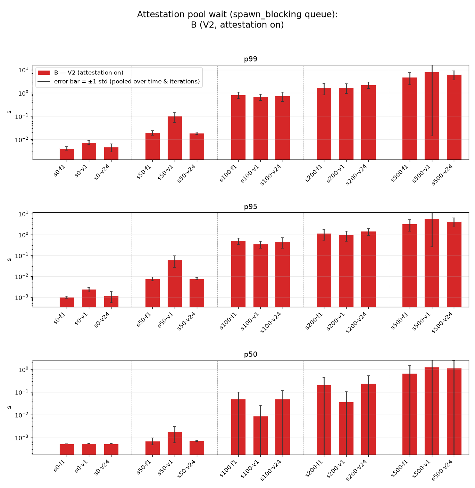

*Pool wait, `n24` campaign — at the floor through `slow50`, then largest on
`f1` and `v24` at the heavy sizes.*

*Attestation async resume (p99/p95/p50), `n4` campaign — how long after the
dry-run finishes until the waiting async task gets CPU time to continue. The
tail grows largest on the heavy pinned (`v1`) configurations, where the one
attesting validator's cores are saturated.*

The same figure for the <code>n24</code> campaign

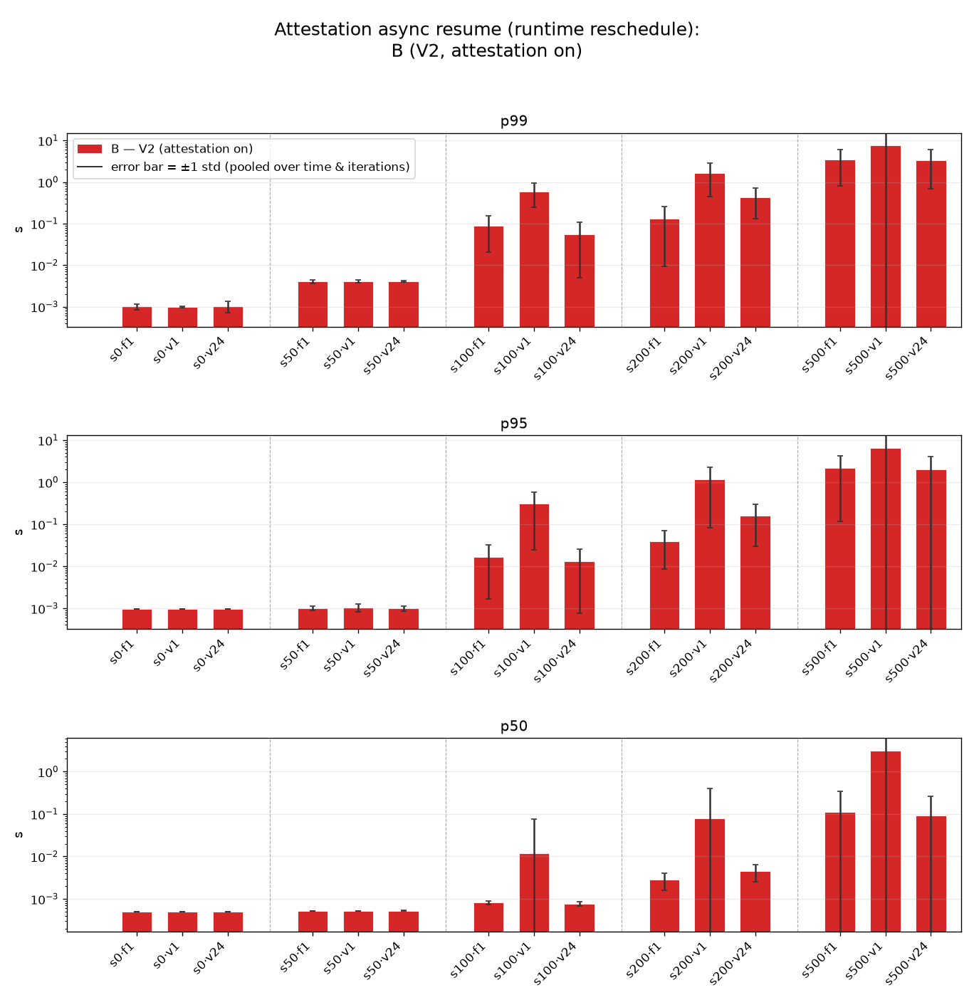

*Async resume, `n24` campaign — the `v1` starvation reaches the median at
the heavy sizes, not just the tail.*

*Full attestation latency (p99/p95/p50), `n4` campaign — pool wait + dry-run
execution + async resume, the whole `attest_transaction` span.*

The same figure for the <code>n24</code> campaign

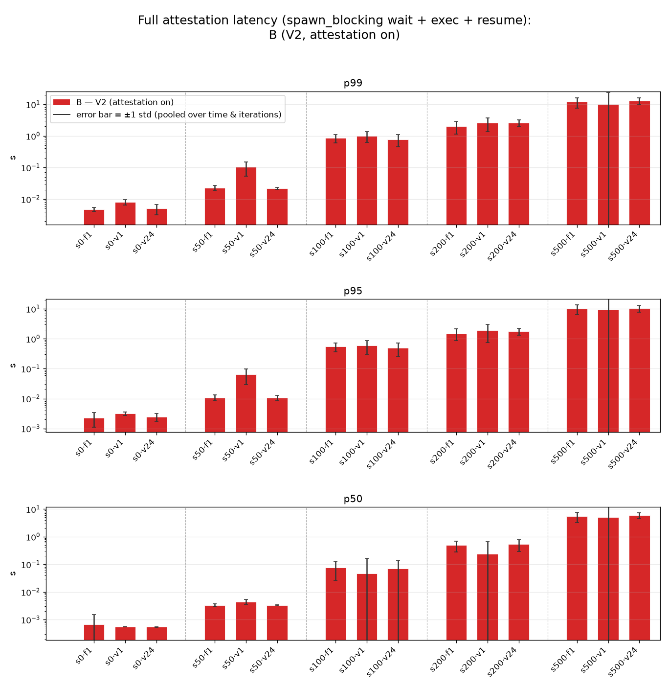

*Full attestation latency, `n24` campaign — matches `n4` through `slow50`,
then inflates with the saturated machine.*

Compute-unit accounting is also exact: attested computation units equal actual
computation units for every owned-object configuration of both campaigns,
`n4` and `n24` (`actual_to_attested_computation_units_ratio` = 1.0), confirming
attestation predicts the computation cost precisely for these transactions
regardless of the committee size. CUs are reported as the exact per-transaction
mean (`_sum`/`_count`), not a p50: the workload is deterministic, so every
transaction is identical and the mean is the exact cost. A p50 would instead
interpolate between histogram bucket edges and land on impossible values
(e.g., 850 for `slow0`, below the 1000-unit `gas_rounding_step` floor).

---

**2. Internal execution latency: unchanged by attestation.**

> [!TIP]
> Both metrics of this finding — `authority_state_internal_execution_latency`
> and `actual_computation_units` — are described in finding 1's metric table.

`authority_state_internal_execution_latency` (the real, post-consensus VM
execution) is A≈B on `n4`: the p95 B/A ratio has median **1.00** across all
45 configurations (range 0.77–1.52). The deviations sit on the heavy-compute
configurations and swing in both directions — B faster on some, slower on
others — so they are load noise, not a systematic attestation cost. The
largest one (`v4` at `slow500`, 1.52) is the contention effect from finding 1:
B's dry-runs add CPU load that stretches the real execution's wall clock.
Attestation does not touch the execution path itself; its cost lives in the
pre-consensus dry-run (finding 1). Execution latency p95 (CUs are measured
on attested transactions, so they exist for B only), each latency cell
`n4` ∣ `n24`:

Fullnode path (`f1`):

| slow_size | A | B | B/A | CUs |
| :---: | --- | --- | --- | :---: |
| 0   | 1.80 ms   ∣ **0.85 ms** | 2.06 ms   ∣ **0.83 ms** | 1.14 ∣ **0.98** | 1k    |
| 50  | 5.45 ms   ∣ **10.03 ms** | 5.87 ms   ∣ **10.09 ms** | 1.08 ∣ **1.01** | 1k    |
| 100 | 21.35 ms  ∣ **319.38 ms** | 20.30 ms  ∣ **298.71 ms** | 0.95 ∣ **0.94** | 4k    |
| 200 | 212.18 ms ∣ **593.11 ms** | 185.32 ms ∣ **846.48 ms** | 0.87 ∣ **1.43** | 128k  |
| 500 | 969.08 ms ∣ **4.501 s** | 1.200 s    ∣ **5.421 s** | 1.24 ∣ **1.20** | 1.37M |

Direct-to-one-validator path (`v1`):

| slow_size | A | B | B/A | CUs |
| :---: | --- | --- | --- | :---: |
| 0   | 1.34 ms   ∣ **0.75 ms** | 1.32 ms   ∣ **0.81 ms** | 0.98 ∣ **1.07** | 1k    |
| 50  | 5.91 ms   ∣ **12.60 ms** | 6.20 ms   ∣ **12.90 ms** | 1.05 ∣ **1.02** | 1k    |
| 100 | 21.98 ms  ∣ **390.31 ms** | 21.29 ms  ∣ **146.65 ms** | 0.97 ∣ **0.38** | 4k    |
| 200 | 222.24 ms ∣ **912.59 ms** | 207.46 ms ∣ **760.29 ms** | 0.93 ∣ **0.83** | 128k  |
| 500 | 971.15 ms ∣ **4.468 s** | 999.34 ms ∣ **3.868 s** | 1.03 ∣ **0.87** | 1.37M |

Direct-to-all-validators path (`v4` / `v24`):

| slow_size | A | B | B/A | CUs |
| :---: | --- | --- | --- | :---: |
| 0   | 1.12 ms   ∣ **0.82 ms** | 1.21 ms   ∣ **0.83 ms** | 1.08 ∣ **1.01** | 1k    |
| 50  | 5.95 ms   ∣ **9.61 ms** | 6.02 ms   ∣ **9.88 ms** | 1.01 ∣ **1.03** | 1k    |
| 100 | 21.92 ms  ∣ **399.62 ms** | 21.19 ms  ∣ **394.29 ms** | 0.97 ∣ **0.99** | 4k    |
| 200 | 207.40 ms ∣ **960.46 ms** | 221.61 ms ∣ **943.29 ms** | 1.07 ∣ **0.98** | 128k  |
| 500 | 970.22 ms ∣ **4.580 s** | 1.478 s    ∣ **5.141 s** | 1.52 ∣ **1.12** | 1.37M |

On `n24`, `f1` and `v24` hold as on `n4` (B/A p95 medians 1.02 and 1.02,
ranges 0.94–1.43 and 0.78–1.18). On `v1`, B runs one-sidedly faster once the
semaphore binds (median 0.87, down to 0.38 at `slow100-qps1000`) — the
pinned path's throttled intake (see the `n24` campaign notes; finding 11):
fewer transactions are admitted, so fewer execute concurrently and each
takes less wall clock on the shared cores. The execution path itself is
untouched.

---

**3. Receipt → execution latency: roughly doubles under heavy load — and the
client sees the same doubling in settlement finality.**

Metric descriptions

| metric | codebase description | aggregation |
| --- | --- | --- |
| `validator_transaction_execution_latency` | Validator-internal latency from receiving a transaction via `submit_tx` until it finished executing (pre-consensus check, consensus, post-consensus validation, sequencing incl. deferral, execution); excludes client/fullnode time | histogram; p50/p95/p99 (`histogram_quantile`) per validator, then max across validators (busiest); averaged over all seconds of all iterations |
| `transaction_driver_settlement_finality_latency` | Settlement finality latency observed from transaction driver | histogram; p50/p95/p99 (`histogram_quantile`), fullnode client series only; averaged over all seconds of all iterations |

`validator_transaction_execution_latency` times the whole internal pipeline on
the receiving validator — receipt via `submit_tx`, attestation, consensus,
post-consensus validation, and execution — no client/fullnode time. Median
(p50), each latency cell `n4` ∣ `n24`:

Fullnode path (`f1`):

| slow_size | A | B | B/A |
| :---: | --- | --- | --- |
| 0   | 300 ms ∣ **374 ms** | 284 ms ∣ **375 ms** | 0.95 ∣ **1.00** |
| 50  | 299 ms ∣ **374 ms** | 294 ms ∣ **372 ms** | 0.98 ∣ **0.99** |
| 100 | 290 ms ∣ **6.01 s** | 305 ms ∣ **6.25 s** | 1.05 ∣ **1.04** |
| 200 | 787 ms ∣ **6.16 s** | 1.37 s  ∣ **8.12 s** | 1.75 ∣ **1.32** |
| 500 | 4.23 s  ∣ **28.81 s** | 8.39 s  ∣ **30.67 s** | 1.99 ∣ **1.06** |

Direct-to-one-validator path (`v1`):

| slow_size | A | B | B/A |
| :---: | --- | --- | --- |
| 0   | 244 ms ∣ **300 ms** | 225 ms ∣ **328 ms** | 0.92 ∣ **1.09** |
| 50  | 245 ms ∣ **364 ms** | 288 ms ∣ **376 ms** | 1.18 ∣ **1.03** |
| 100 | 265 ms ∣ **2.32 s** | 286 ms ∣ **2.91 s** | 1.08 ∣ **1.26** |
| 200 | 1.60 s  ∣ **7.27 s** | 2.93 s  ∣ **10.50 s** | 1.82 ∣ **1.44** |
| 500 | 10.83 s ∣ **27.64 s** | 17.95 s ∣ **24.59 s** | 1.66 ∣ **0.89** |

Direct-to-all-validators path (`v4` / `v24`):

| slow_size | A | B | B/A |
| :---: | --- | --- | --- |
| 0   | 250 ms ∣ **355 ms** | 249 ms ∣ **334 ms** | 1.00 ∣ **0.94** |
| 50  | 264 ms ∣ **355 ms** | 275 ms ∣ **367 ms** | 1.04 ∣ **1.03** |
| 100 | 297 ms ∣ **5.94 s** | 295 ms ∣ **6.90 s** | 0.99 ∣ **1.16** |
| 200 | 1.60 s  ∣ **12.48 s** | 2.43 s  ∣ **13.13 s** | 1.52 ∣ **1.05** |
| 500 | 11.25 s ∣ **29.51 s** | 13.29 s ∣ **30.22 s** | 1.18 ∣ **1.02** |

On `n4` at light load, the pipeline is ≈230–300 ms and A≈B — dominated by
consensus, with attestation (a few ms at these sizes) lost in the noise. At
heavy compute, B runs ≈1.7–2.0× A (`slow500-f1` 4.23 s → 8.39 s), because
attestation adds a second full execution before consensus (finding 1) and,
under load, the extra work compounds through queueing. p95 tracks the same
(`slow500-f1` 6.8 s → 13.1 s). Two path effects stand out. The direct paths
(`v1`, `v4`) start from a far higher A baseline under heavy compute (≈11 s vs
4.2 s on `f1` at `slow500`) — without the fullnode in between, the client
pushes into consensus at full rate and the backlog builds up on the receiving
side. And B's relative cost shrinks as attestation spreads: B/A at `slow500`
is 1.99 on `f1`, 1.66 on `v1`, 1.18 on `v4`, where each validator attests
only a quarter of the load.

On `n24`, the unsaturated sizes look like `n4` — ≈300–375 ms and A≈B at
`slow0`/`slow50` — and the saturated ones like a backlog measurement: every
path sits at ≈25–31 s p50 at `slow500`, where the ratio washes out (B/A
0.89–1.06). In between, B's penalty is visible but milder than `n4`'s
doubling: B/A 1.26 at `slow100-v1` and 1.44 at `slow200-v1` (B queues behind
the pinned validator's dry-runs and starved runtime, finding 1), 1.32 at
`slow200-f1`, and 1.05–1.16 on `v24`.

*Validator-internal receipt → executed latency, `n4` campaign — the pure
validator-internal pipeline, with no client/fullnode time.*

The same figure for the <code>n24</code> campaign

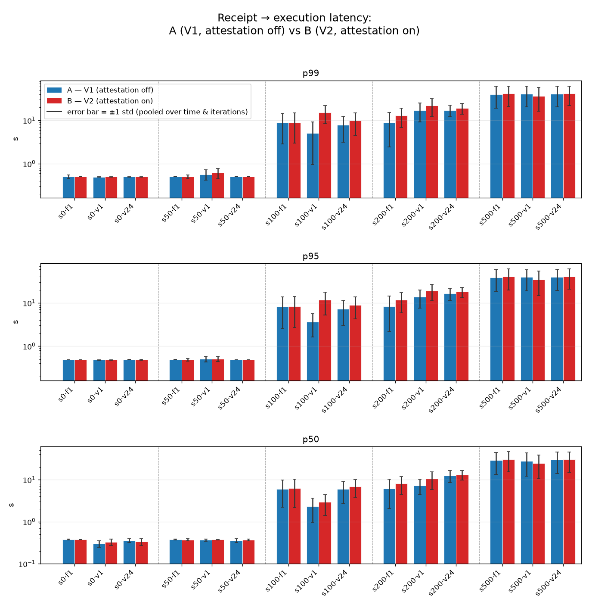

*Receipt → executed latency, `n24` campaign — `n4`-like at the light sizes;
at the heavy sizes every path sits on the saturated machine's backlog, with
the pinned path's B penalty at `slow100`/`slow200`.*

The client sees the same picture: `settlement_finality_latency` is the
client's submit→finality time (fullnode path only). It's the end-to-end view
of the internal pipeline above plus network and finality, so it moves the same
way. Fullnode path, each cell `n4` ∣ `n24`:

| slow_size | p50 A | p50 B | p50 B/A |
| :---: | --- | --- | --- |
| 0   | 253 ms ∣ **267 ms** | 252 ms ∣ **266 ms** | 1.00 ∣ **1.00** |
| 50  | 259 ms ∣ **294 ms** | 258 ms ∣ **297 ms** | 1.00 ∣ **1.01** |
| 100 | 264 ms ∣ **1.73 s** | 270 ms ∣ **1.89 s** | 1.02 ∣ **1.10** |
| 200 | 804 ms ∣ **4.64 s** | 1.25 s  ∣ **6.18 s** | 1.56 ∣ **1.33** |
| 500 | 4.26 s  ∣ **15.06 s** | 7.53 s  ∣ **15.52 s** | 1.77 ∣ **1.03** |

The same latency at p95

| slow_size | p95 A | p95 B | p95 B/A |
| :---: | --- | --- | --- |
| 0   | 367 ms ∣ **332 ms** | 374 ms ∣ **327 ms** | 1.02 ∣ **0.98** |
| 50  | 359 ms ∣ **359 ms** | 351 ms ∣ **364 ms** | 0.98 ∣ **1.01** |
| 100 | 373 ms ∣ **2.62 s** | 390 ms ∣ **3.07 s** | 1.05 ∣ **1.17** |
| 200 | 1.20 s  ∣ **7.20 s** | 2.00 s  ∣ **9.46 s** | 1.67 ∣ **1.31** |
| 500 | 7.08 s  ∣ **18.37 s** | 11.65 s ∣ **19.32 s** | 1.65 ∣ **1.05** |

On `n4`, at light load B≈A (≈250 ms, dominated by consensus/finality;
attestation is negligible). At heavy compute, B runs ≈1.6–1.8× A (`slow500`
4.26 s → 7.53 s p50), the doubling above carried through to what the client
observes.

On `n24`, the unsaturated window gives the client-side answer at committee
scale: at `slow0`/`slow50` finality is ≈270–300 ms with B/A = 1.00–1.01 —
the same as `n4`, so a larger committee neither adds nor removes
client-visible cost at normal load. From `slow100` the saturated machine
takes over (A itself is 1.7–15 s), and the remaining B/A bump peaks at
`slow200` (1.33 p50, 1.31 p95) before washing out at `slow500` (1.03).

*Client settlement-finality latency, fullnode path only, `n4` campaign.*

The same figure for the <code>n24</code> campaign

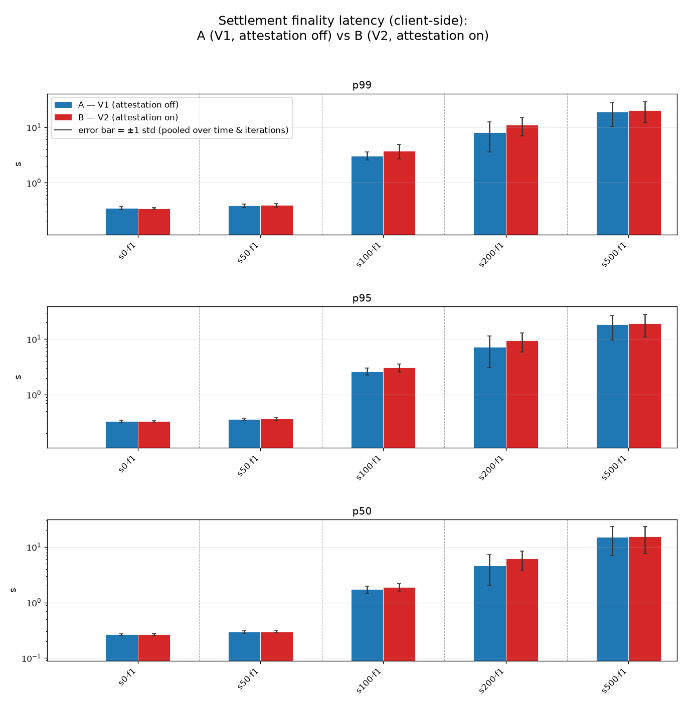

*Client settlement-finality latency, `n24` campaign — `n4`-like at
`slow0`/`slow50`; above that, A and B climb together with the saturated
machine's backlog.*

---

**4. Checkpoint creation lag: attestation moves the backlog ahead of
consensus.**

Metric descriptions

| metric | codebase description | aggregation |
| --- | --- | --- |
| `checkpoint_creation_latency` | Latency from consensus commit timestamp to local checkpoint creation in milliseconds | histogram; p50/p95/p99 (`histogram_quantile`) over buckets combined across validators; averaged over all seconds of all iterations |

`checkpoint_creation_latency` times consensus commit created → checkpoint
built (values are seconds, despite the help text saying milliseconds). The
builder can only seal a checkpoint once that commit's transactions have
executed, so the lag is a direct view of the post-consensus execution backlog.
p95, each latency cell `n4` ∣ `n24`:

Fullnode path (`f1`):

| slow_size | A | B | B/A |
| :---: | --- | --- | --- |
| 0   | 562 ms ∣ **1.24 s** | 655 ms ∣ **1.99 s** | 1.17 ∣ **1.60** |
| 50  | 401 ms ∣ **233 ms** | 520 ms ∣ **1.15 s** | 1.30 ∣ **4.95** |
| 100 | 274 ms ∣ **5.67 s** | 322 ms ∣ **6.39 s** | 1.18 ∣ **1.13** |
| 200 | 3.12 s  ∣ **19.59 s** | 4.47 s  ∣ **11.14 s** | 1.43 ∣ **0.57** |
| 500 | 9.99 s  ∣ **36.45 s** | 11.56 s ∣ **33.96 s** | 1.16 ∣ **0.93** |

Direct-to-one-validator path (`v1`):

| slow_size | A | B | B/A |
| :---: | --- | --- | --- |
| 0   | 499 ms ∣ **198 ms** | 251 ms ∣ **208 ms** | 0.50 ∣ **1.05** |
| 50  | 268 ms ∣ **259 ms** | 584 ms ∣ **254 ms** | 2.18 ∣ **0.98** |
| 100 | 293 ms ∣ **22.56 s** | 258 ms ∣ **2.35 s** | 0.88 ∣ **0.10** |
| 200 | 15.57 s ∣ **16.30 s** | 5.59 s  ∣ **5.93 s** | 0.36 ∣ **0.36** |
| 500 | 30.21 s ∣ **34.75 s** | 11.74 s ∣ **14.13 s** | 0.39 ∣ **0.41** |

Direct-to-all-validators path (`v4` / `v24`):

| slow_size | A | B | B/A |
| :---: | --- | --- | --- |
| 0   | 243 ms ∣ **220 ms** | 239 ms ∣ **614 ms** | 0.98 ∣ **2.79** |
| 50  | 511 ms ∣ **223 ms** | 723 ms ∣ **227 ms** | 1.42 ∣ **1.02** |
| 100 | 695 ms ∣ **24.11 s** | 273 ms ∣ **24.53 s** | 0.39 ∣ **1.02** |
| 200 | 15.29 s ∣ **23.77 s** | 11.74 s ∣ **20.68 s** | 0.77 ∣ **0.87** |
| 500 | 32.39 s ∣ **35.39 s** | 26.36 s ∣ **30.90 s** | 0.81 ∣ **0.87** |

At light compute, the lag is a steady ≈0.2–0.7 s on all paths. Under heavy
compute, the paths diverge, in two separate ways.

First, the A side splits by submission route, not by spreading: both direct
paths pile up a huge post-consensus backlog (A at `slow500`: 30.21 s on `v1`,
32.39 s on `v4`) while the fullnode path stays at 9.99 s. The fullnode's own
transaction driver queues and paces what enters consensus (client-side
pacing on the fullnode, not a validator admission check), and spreading the
direct submissions over all 4 validators (`v4`) does not substitute for it.

Second, on the B side attestation moves the backlog ahead of consensus, and
the strength of that shift follows how concentrated the attestation is. On
`v1`, one validator attests everything and intake is throttled hardest: A lags
far more than B (30.21 vs 11.74 s; at p50 16.73 vs 2.31 s). On `v4`, each
validator attests a quarter and the shift is half-hearted (B/A 0.77–0.81). On
`f1`, attestation is spread the same way but B also keeps the deeper execution
backlog, so B lags slightly more than A (1.2–1.4×). Without attestation, the
load goes straight into consensus and the backlog piles up after it — exactly
where checkpoints wait; with attestation, each transaction first spends time
in the dry-run while the client holds a bounded number in flight (finding 3's
receipt→execution shows that side: B ≈1.7× A on `v1`, ≈1.2× on `v4`).
Attestation does not shrink the total backlog — it moves it from after
consensus, where checkpoints wait on it, to before consensus, and the more
concentrated the attestation, the stronger the move.

On `n24`, the shift concentrates entirely on the pinned path. On `v1`, the
throttled intake (`n24` campaign notes; finding 11) empties the
post-consensus backlog from `slow100` on: B/A p95 0.10 at `slow100` (22.6 s
→ 2.35 s; p50 8.56 s → 637 ms), 0.36 at `slow200`, 0.41 at `slow500`. On
`v24`, where each validator attests only 1/24th, the shift vanishes at the
saturated sizes (B/A 0.87–1.02 from `slow100` up); `f1` is mixed and noisy
(0.57–1.13 there). The A-side contrast from `n4` also dissolves: at
`slow500` every path hits ≈34–36 s — when execution itself is the
bottleneck, the fullnode's pacing buys nothing.

*Checkpoint creation lag (p99/p95/p50), `n4` campaign — consensus commit
created → checkpoint built. Note the heavy direct-path (`v1`, `v4`)
configurations: A (attestation off) lags far more than B, because its backlog
sits after consensus.*

The same figure for the <code>n24</code> campaign

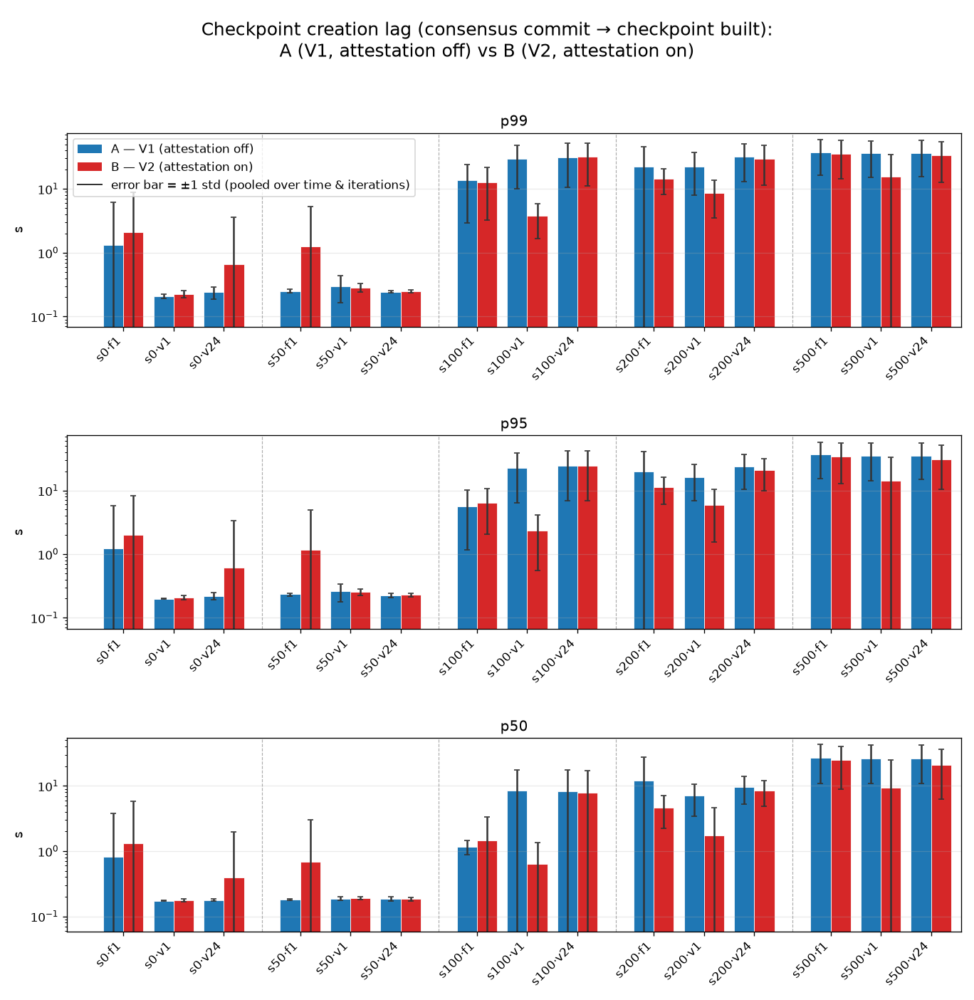

*Checkpoint creation lag, `n24` campaign — on the pinned path B's bars
collapse from `slow100` on (attestation plus the semaphore move the backlog
ahead of consensus); `v24` shows no such shift.*

---

**5. Post-consensus validation latency: unaffected by attestation.**

Metric descriptions

| metric | codebase description | aggregation |
| --- | --- | --- |
| `post_consensus_validation_latency` | Latency of `validate_and_resolve_conflicts` over one consensus commit's user transactions (Checks #0-#3 plus owned-object conflict resolution) | histogram; p50/p95/p99 (`histogram_quantile`) over buckets combined across validators; averaged over all seconds of all iterations |

`validate_and_resolve_conflicts` (the post-consensus pass) is where attestation
adds Check #3 — attestor verification plus cost bounds. But that's a few integer
comparisons per tx; the pass is dominated by the already-executed cache lookup
(Check #1) and owned-object lock/conflict resolution. All paths, each
cell `n4` ∣ `n24`:

Fullnode path (`f1`):

| slow_size | p50 A | p50 B | p50 B/A |
| :---: | --- | --- | --- |
| 0   | 2.9 ms ∣ **2.4 ms** | 2.8 ms ∣ **2.3 ms** | 0.96 ∣ **0.94** |
| 50  | 2.9 ms ∣ **2.8 ms** | 2.8 ms ∣ **2.2 ms** | 0.96 ∣ **0.80** |
| 100 | 2.5 ms ∣ **4.2 ms** | 2.0 ms ∣ **3.2 ms** | 0.80 ∣ **0.76** |
| 200 | 2.3 ms ∣ **4.0 ms** | 1.1 ms ∣ **3.9 ms** | 0.48 ∣ **0.98** |
| 500 | 2.1 ms ∣ **88 ms** | 1.7 ms ∣ **30 ms** | 0.82 ∣ **0.34** |

Direct-to-one-validator path (`v1`):

| slow_size | p50 A | p50 B | p50 B/A |
| :---: | --- | --- | --- |
| 0   | 2.9 ms ∣ **2.8 ms** | 2.9 ms ∣ **2.7 ms** | 1.00 ∣ **0.97** |
| 50  | 2.9 ms ∣ **2.5 ms** | 2.8 ms ∣ **2.2 ms** | 0.98 ∣ **0.86** |
| 100 | 2.5 ms ∣ **3.9 ms** | 2.2 ms ∣ **0.4 ms** | 0.89 ∣ **0.10** |
| 200 | 3.3 ms ∣ **5.7 ms** | 0.6 ms ∣ **0.3 ms** | 0.20 ∣ **0.06** |
| 500 | 7.0 ms ∣ **1.7 ms** | 0.4 ms ∣ **3.4 ms** | 0.06 ∣ **1.97** |

Direct-to-all-validators path (`v4` / `v24`):

| slow_size | p50 A | p50 B | p50 B/A |
| :---: | --- | --- | --- |
| 0   | 3.0 ms ∣ **2.8 ms** | 2.9 ms ∣ **2.6 ms** | 0.98 ∣ **0.95** |
| 50  | 2.9 ms ∣ **2.8 ms** | 2.8 ms ∣ **2.6 ms** | 0.95 ∣ **0.92** |
| 100 | 2.5 ms ∣ **5.5 ms** | 2.2 ms ∣ **4.5 ms** | 0.87 ∣ **0.82** |
| 200 | 3.6 ms ∣ **22 ms** | 3.3 ms ∣ **14 ms** | 0.90 ∣ **0.63** |
| 500 | 13 ms ∣ **94 ms** | 7.2 ms ∣ **29 ms** | 0.56 ∣ **0.30** |

The same pass at p95

Fullnode path (`f1`), p95:

| slow_size | p95 A | p95 B | p95 B/A |
| :---: | --- | --- | --- |
| 0   | 5.7 ms ∣ **4.5 ms** | 5.1 ms ∣ **4.4 ms** | 0.89 ∣ **0.97** |
| 50  | 5.2 ms ∣ **5.1 ms** | 4.9 ms ∣ **4.7 ms** | 0.95 ∣ **0.91** |
| 100 | 4.9 ms ∣ **37 ms** | 4.8 ms ∣ **29 ms** | 0.98 ∣ **0.78** |
| 200 | 19 ms ∣ **53 ms** | 12 ms ∣ **65 ms** | 0.63 ∣ **1.22** |
| 500 | 26 ms ∣ **308 ms** | 24 ms ∣ **186 ms** | 0.94 ∣ **0.60** |

Direct-to-one-validator path (`v1`), p95:

| slow_size | p95 A | p95 B | p95 B/A |
| :---: | --- | --- | --- |
| 0   | 5.9 ms ∣ **4.9 ms** | 5.1 ms ∣ **4.8 ms** | 0.85 ∣ **0.98** |
| 50  | 5.4 ms ∣ **6.2 ms** | 5.0 ms ∣ **5.8 ms** | 0.93 ∣ **0.93** |
| 100 | 5.4 ms ∣ **36 ms** | 4.8 ms ∣ **13 ms** | 0.90 ∣ **0.37** |
| 200 | 22 ms ∣ **116 ms** | 21 ms ∣ **19 ms** | 0.95 ∣ **0.16** |
| 500 | 69 ms ∣ **96 ms** | 15 ms ∣ **61 ms** | 0.21 ∣ **0.63** |

Direct-to-all-validators path (`v4` / `v24`), p95:

| slow_size | p95 A | p95 B | p95 B/A |
| :---: | --- | --- | --- |
| 0   | 5.3 ms ∣ **4.9 ms** | 4.9 ms ∣ **4.9 ms** | 0.93 ∣ **0.99** |
| 50  | 5.3 ms ∣ **5.0 ms** | 4.9 ms ∣ **4.9 ms** | 0.92 ∣ **0.99** |
| 100 | 4.9 ms ∣ **34 ms** | 4.8 ms ∣ **30 ms** | 0.98 ∣ **0.87** |
| 200 | 19 ms ∣ **145 ms** | 22 ms ∣ **121 ms** | 1.13 ∣ **0.83** |
| 500 | 61 ms ∣ **306 ms** | 57 ms ∣ **219 ms** | 0.95 ∣ **0.72** |

On `n4`, p50 is ≈2–3 ms at light load, and the B/A column has no consistent
direction — it swings from 0.06 to 1.13, worst on the direct-path heavy
configs. That's noise, not an attestation effect: the pass is timed per
consensus commit, so heavy configs (low throughput) get few samples. p95
rises under load (≈5 ms → 12–69 ms) on both A and B, from contention on the
pass. Attestation's Check #3 is lost in the noise; its cost is pre-consensus
(finding 1), not here.

On `n24`, the pass stays in the same few-millisecond band as `n4` at the
light sizes and inflates moderately at the heavy ones (p95 up to ≈0.3 s).
`f1` and `v24` stay A≈B-ish with B mostly a shade lower; the `slow500` rows
show B well below A on every path (p50 88 → 30 ms on `f1`, 94 → 29 ms on
`v24`). On `v1`, B runs the pass at a tenth of A from `slow100` on (p50 3.9
→ 0.4 ms, 5.7 → 0.3 ms); that is commit size, not Check #3: the pass is
timed per consensus commit, and the pinned path's throttled intake (`n24`
campaign notes; finding 11) gives B near-empty commits.

*Time in `validate_and_resolve_conflicts`, `n4` campaign; Check #3 (attestor
verification) is the attestation-added work on this path.*

The same figure for the <code>n24</code> campaign

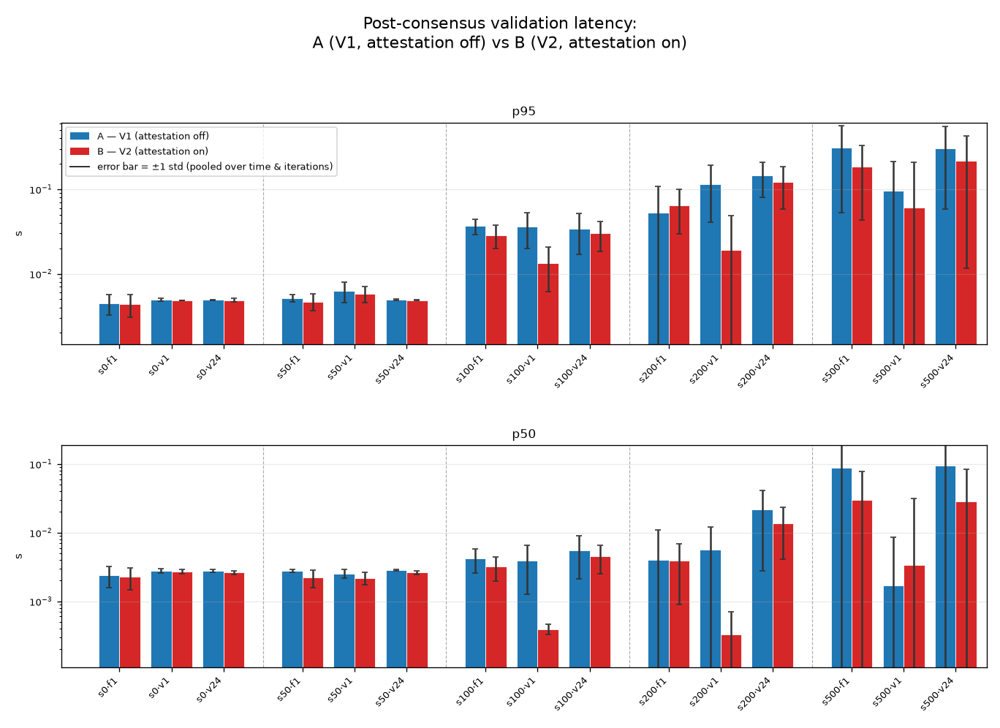

*The pass on `n24` — `f1` and `v24` stay A≈B; the pinned path's B bars
collapse from `slow100` on (near-empty commits).*

---

**6. Submit latency (fullnode path): a fixed per-transaction addition.**

Metric descriptions

| metric | codebase description | aggregation |
| --- | --- | --- |
| `transaction_driver_submit_transaction_latency` | Time in seconds to successfully submit a transaction to a validator | histogram; p50/p95/p99 (`histogram_quantile`), fullnode client series only; averaged over all seconds of all iterations |

The full help text continues: "Includes all retries and measures from the
start of submission until a validator accepts the transaction." The timer
runs on the fullnode's `TransactionDriver`, and the validator's `submit_tx`
RPC responds only after the transaction passed the overload check, the whole
attestation finished (pool wait + dry-run + async resume — the
attestation payload is needed to build the consensus transaction), and the
transaction was handed to the consensus adapter. It does not wait for
consensus sequencing — that time is in settlement finality (finding 3), not
here.

B's submit `p50` exceeds A's by roughly the full attestation latency
(`validator_attestation_latency`, pool wait + dry-run execution + async
resume — the submit RPC returns only after the whole attestation), so the
*ratio* is largest where the baseline is smallest (low rate / low computation
cost): `slow0-f1-q200` 4.7 ms → 14.5 ms (3.1×), `slow500-f1-q200` 25.2 ms →
674 ms
(27×, i.e. +649 ms ≈ the full attestation p50, 616 ms at that configuration).
At high rate, the queueing baseline dominates and the ratio shrinks (≈1.1–5×).
The *added* latency (B − A) equals the full attestation latency only at low
rate;
under load the dry-runs queue and it grows well past that (`slow500-f1-q2000`
submit reaches 3.8 s).

Submit p50 (ms) on the fullnode path (A = attestation off, B = on), with
B's full attestation latency p50 alongside to check the addition directly
(submit A + full attestation ≈ submit B); each cell `n4` ∣ `n24`:

Target rate `qps200`:

| slow_size | A | B | B/A | full attest. |
| :---: | --- | --- | --- | --- |
| 0   | 4.7  ∣ **6.6** | 14.5 ∣ **14.7** | 3.1  ∣ **2.2** | 0.5  ∣ **0.5** |
| 50  | 4.9  ∣ **7.0** | 24.9 ∣ **21.2** | 5.1  ∣ **3.1** | 3.0  ∣ **2.9** |
| 100 | 4.4  ∣ **10.5** | 26.3 ∣ **26.0** | 6.0  ∣ **2.5** | 8.6  ∣ **5.5** |
| 200 | 3.7  ∣ **96.4** | 41.4 ∣ **388** | 11.1 ∣ **4.0** | 33.1 ∣ **248** |
| 500 | 25.2 ∣ **321** | 674 ∣ **2875** | 26.8 ∣ **9.0** | 616 ∣ **2767** |

Target rate `qps1000`:

| slow_size | A | B | B/A | full attest. |
| :---: | --- | --- | --- | --- |
| 0   | 3.7  ∣ **3.9** | 4.2   ∣ **4.6** | 1.1 ∣ **1.2** | 0.5   ∣ **0.7** |
| 50  | 3.7  ∣ **9.2** | 10.2 ∣ **15.6** | 2.8 ∣ **1.7** | 3.0   ∣ **3.4** |
| 100 | 3.3  ∣ **218** | 15.0 ∣ **378** | 4.5 ∣ **1.7** | 6.5   ∣ **77.5** |
| 200 | 83.0 ∣ **452** | 261  ∣ **1223** | 3.1 ∣ **2.7** | 114  ∣ **489** |
| 500 | 386 ∣ **3814** | 2044 ∣ **8957** | 5.3 ∣ **2.3** | 1050 ∣ **5475** |

Target rate `qps2000`:

| slow_size | A | B | B/A | full attest. |
| :---: | --- | --- | --- | --- |
| 0   | 3.6   ∣ **5.9** | 3.8   ∣ **6.5** | 1.1 ∣ **1.1** | 0.5   ∣ **0.6** |
| 50  | 3.1   ∣ **251** | 6.6   ∣ **303** | 2.1 ∣ **1.2** | 2.8   ∣ **7.3** |
| 100 | 5.0   ∣ **235** | 21.6 ∣ **432** | 4.3 ∣ **1.8** | 8.7   ∣ **117** |
| 200 | 106  ∣ **705** | 379  ∣ **1723** | 3.6 ∣ **2.4** | 116  ∣ **499** |
| 500 | 1007 ∣ **3682** | 3760 ∣ **11034** | 3.7 ∣ **3.0** | 1381 ∣ **6483** |

The addition holds at low rate — e.g. `slow500-f1-q200`: 25.2 + 616 ≈ 674, and
`slow200-f1-q200`: 3.7 + 33.1 ≈ 41.4. At high rate B's submit grows past the
sum (`slow500-f1-q2000`: 1007 + 1381 = 2389 vs 3760 measured) — the extra is
queueing on the loaded validator beyond the attestation itself.

On `n24`, the unsaturated sizes reproduce `n4`'s addition on a slightly
higher fullnode baseline: at `qps1000` `slow0`/`slow50`, B adds ≈1–6 ms over
a 4–9 ms A (≈ the 0.7–3.4 ms attestation latency plus noise). Once the
machine saturates the baselines inflate and the ratio caps at ≈9× at
`qps200` (vs 27× on `n4`); the addition still roughly holds there (`slow500`:
321 + 2767 ≈ 3088 vs 2875 measured; `slow200`: 96 + 248 ≈ 344 vs 388).

*Client submit latency, fullnode path only, `n4` campaign — finding 6.*

The same figure for the <code>n24</code> campaign

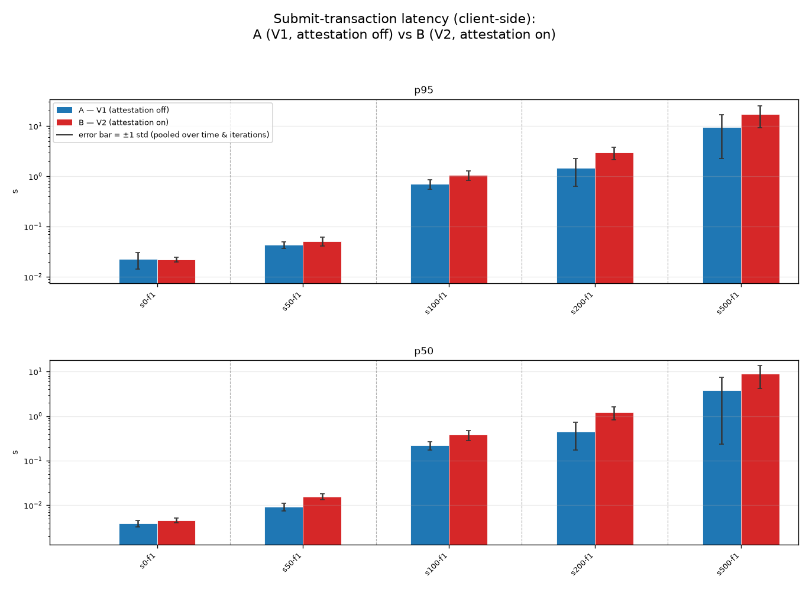

*Client submit latency, `n24` campaign — `n4`'s shape at the light sizes;
queueing baselines above that.*

---

**7. CPU: attestation adds ≈30 % busy cores.**

Metric descriptions

| metric | codebase description | aggregation |
| --- | --- | --- |
| `container_cpu_usage_seconds_total` | cadvisor (no in-repo help): cumulative CPU seconds consumed by the container | counter; `rate()` → busy cores, max across validators (busiest); averaged over all seconds of all iterations |
| `container_memory_rss` | cadvisor (no in-repo help): container resident set size (RSS) in bytes | gauge; max across validators (busiest); averaged over all seconds of all iterations |
| `node_cpu_seconds_total` | node-exporter (no in-repo help): seconds each CPU spent in each mode | counter; `rate()` over non-idle modes summed to whole-machine busy cores; averaged over all seconds of all iterations |

Per-validator CPU (busiest validator, cadvisor) B/A median = **1.28×** (range
0.99–2.23×) — e.g. `slow100-f1` 8.7 → 11.1 cores, `slow500-f1`
20.9 → 24.7 cores. Consistent with the extra dry-run execution.

Busiest-validator CPU (cores) by slow_size, each cell `n4` ∣ `n24`:

Fullnode path (`f1`):

| slow_size | A | B | B/A |
| :---: | --- | --- | --- |
| 0   | 2.7  ∣ **1.8** | 2.8  ∣ **1.8** | 1.05 ∣ **1.01** |
| 50  | 5.3  ∣ **3.4** | 6.4  ∣ **3.4** | 1.21 ∣ **1.00** |
| 100 | 8.7  ∣ **4.3** | 11.1 ∣ **4.3** | 1.28 ∣ **1.01** |
| 200 | 18.7 ∣ **3.4** | 21.0 ∣ **4.5** | 1.12 ∣ **1.32** |
| 500 | 20.9 ∣ **4.4** | 24.7 ∣ **5.3** | 1.19 ∣ **1.19** |

Direct-to-one-validator path (`v1`):

| slow_size | A | B | B/A |
| :---: | --- | --- | --- |
| 0   | 3.0  ∣ **2.1** | 3.3  ∣ **2.3** | 1.09 ∣ **1.07** |
| 50  | 5.7  ∣ **3.4** | 8.1  ∣ **4.7** | 1.43 ∣ **1.38** |
| 100 | 9.1  ∣ **4.6** | 14.6 ∣ **6.1** | 1.60 ∣ **1.32** |
| 200 | 21.1 ∣ **4.4** | 31.9 ∣ **8.5** | 1.51 ∣ **1.92** |
| 500 | 23.0 ∣ **4.4** | 35.9 ∣ **9.0** | 1.56 ∣ **2.06** |

Direct-to-all-validators path (`v4` / `v24`):

| slow_size | A | B | B/A |
| :---: | --- | --- | --- |
| 0   | 2.7  ∣ **1.9** | 2.9  ∣ **1.9** | 1.05 ∣ **1.02** |
| 50  | 5.3  ∣ **3.3** | 6.7  ∣ **3.5** | 1.26 ∣ **1.06** |
| 100 | 9.0  ∣ **4.7** | 11.8 ∣ **4.9** | 1.30 ∣ **1.04** |
| 200 | 20.2 ∣ **4.6** | 24.4 ∣ **4.7** | 1.21 ∣ **1.04** |
| 500 | 23.7 ∣ **4.5** | 24.7 ∣ **4.7** | 1.04 ∣ **1.05** |

The pinned path (`v1`) rises more (up to ≈1.6×) than the fullnode path
(≈1.1–1.3×), because that one validator attests every transaction, while on
`f1` the attestation work is spread across the four. `v4` confirms it is the
spreading that matters, not the fullnode: submitting directly to all 4 keeps
the busiest validator at fullnode-path levels (B ≈ 24.7 cores at `slow500`,
matching `f1` and well below `v1`'s 35.9).

On `n24`, the same split appears one step milder. On `v24`, attestation is
≈free: B/A 1.00–1.06 at every size (each validator attests ≈1/24th of the
load). On `f1`, it is free through `slow100` (1.00–1.01) with moderate
bumps at the heavy sizes (1.32 at `slow200`, 1.19 at `slow500`; the busiest
validator runs at 1.8–5.3 cores). The pinned host pays instead: B/A climbs
from 1.10 at `slow0` to 1.95 at `slow200` and 2.06 at `slow500` (4.4 → 9.0
cores) — it runs the full dry-run stream on top of its execution share,
continuing the concentration gradient from `n4` (1.56 → 2.06 at `slow500`).
Memory moves the same direction but barely: `v1`-B up to 1.28, elsewhere
≤1.22.

Busiest-validator memory RSS (GB), same cell format

Fullnode path (`f1`):

| slow_size | A | B | B/A |
| :---: | --- | --- | --- |
| 0   | 0.8 ∣ **0.88** | 0.8 ∣ **0.88** | 1.00 ∣ **1.00** |
| 50  | 0.8 ∣ **0.90** | 0.7 ∣ **0.89** | 0.99 ∣ **0.99** |
| 100 | 0.7 ∣ **0.94** | 0.7 ∣ **0.96** | 1.00 ∣ **1.02** |
| 200 | 0.7 ∣ **0.80** | 0.8 ∣ **0.78** | 1.08 ∣ **0.98** |
| 500 | 0.5 ∣ **0.65** | 0.6 ∣ **0.77** | 1.29 ∣ **1.18** |

Direct-to-one-validator path (`v1`):

| slow_size | A | B | B/A |
| :---: | --- | --- | --- |
| 0   | 0.8 ∣ **1.02** | 0.8 ∣ **1.02** | 0.99 ∣ **1.00** |
| 50  | 0.8 ∣ **1.03** | 0.8 ∣ **1.11** | 0.99 ∣ **1.07** |
| 100 | 0.8 ∣ **0.98** | 0.8 ∣ **1.09** | 1.01 ∣ **1.12** |
| 200 | 0.8 ∣ **0.78** | 0.9 ∣ **0.93** | 1.07 ∣ **1.20** |
| 500 | 0.5 ∣ **0.68** | 0.7 ∣ **0.87** | 1.38 ∣ **1.29** |

Direct-to-all-validators path (`v4` / `v24`):

| slow_size | A | B | B/A |
| :---: | --- | --- | --- |
| 0   | 0.8 ∣ **0.92** | 0.8 ∣ **0.92** | 1.00 ∣ **1.00** |
| 50  | 0.8 ∣ **0.92** | 0.8 ∣ **0.92** | 1.01 ∣ **1.00** |
| 100 | 0.8 ∣ **0.95** | 0.8 ∣ **0.98** | 0.99 ∣ **1.03** |
| 200 | 0.8 ∣ **0.76** | 0.8 ∣ **0.81** | 1.05 ∣ **1.07** |
| 500 | 0.5 ∣ **0.65** | 0.7 ∣ **0.79** | 1.25 ∣ **1.22** |

Memory stays small and roughly flat (≈0.7–0.8 GB); attestation barely moves it —
the heavy-config bumps are on ≈0.5–0.9 GB and noisy. Attestation's cost is CPU,
not memory.

*Whole-machine host CPU and busiest-validator CPU / memory (RSS), `n4`
campaign — finding 7.*

The same figure for the <code>n24</code> campaign

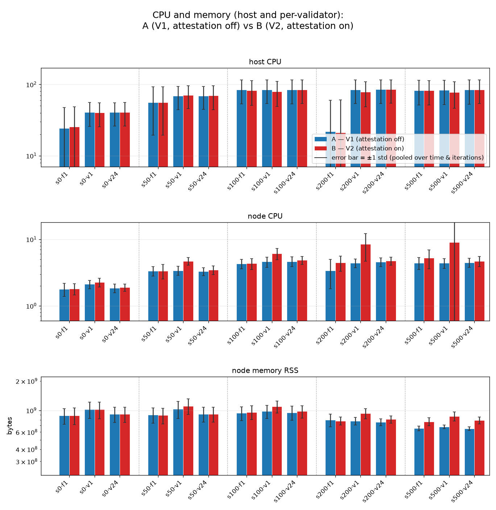

*Resources, `n24` campaign — spread paths stay at their machine share on
both sides; the attesting `v1` host doubles.*

---

**8. Throughput: no penalty at normal load, a fullnode cost at heavy compute,
and no post-consensus validation drops.**

Metric descriptions

| metric | codebase description | aggregation |
| --- | --- | --- |
| `transactions_included_in_checkpoint` | Transactions included in a checkpoint | counter; `rate()` → finalized TPS, mean across validators (replicated); averaged over all seconds of all iterations |
| `validator_attestations_total` | Number of attestations performed (dry-runs that completed without panicking) | counter; `rate()` → attestations/s, max across validators (busiest); averaged over all seconds of all iterations |
| `consensus_handler_validation_dropped_transactions` | Number of `UserTransactionV1`/`UserTransactionV2` transactions dropped by post-consensus validation | counter; `rate()` → drops/s, mean across validators; averaged over all seconds of all iterations |

Finalized TPS (`transactions_included_in_checkpoint`) is statistically
identical A vs B at normal load — median `(B−A)/A = −0.4 %` across all 45
configurations, within the few-percent run-to-run noise.

Finalized TPS by slow_size (A = attestation off, B = on; `slow500` is small
and noisy), each cell `n4` ∣ `n24`:

Fullnode path (`f1`):

| slow_size | A | B | B/A |
| :---: | --- | --- | --- |
| 0   | 994  ∣ **897** | 987  ∣ **896** | 0.99 ∣ **1.00** |
| 50  | 1010 ∣ **1006** | 1003 ∣ **930** | 0.99 ∣ **0.92** |
| 100 | 1023 ∣ **462** | 1019 ∣ **423** | 1.00 ∣ **0.91** |
| 200 | 747  ∣ **102** | 584  ∣ **133** | 0.78 ∣ **1.30** |
| 500 | 129  ∣ **10** | 104  ∣ **16** | 0.81 ∣ **1.57** |

Direct-to-one-validator path (`v1`):

| slow_size | A | B | B/A |
| :---: | --- | --- | --- |
| 0   | 1024 ∣ **1019** | 1024 ∣ **1019** | 1.00 ∣ **1.00** |
| 50  | 1022 ∣ **1010** | 1020 ∣ **1006** | 1.00 ∣ **1.00** |
| 100 | 1010 ∣ **334** | 1024 ∣ **425** | 1.01 ∣ **1.27** |
| 200 | 602  ∣ **140** | 636  ∣ **116** | 1.06 ∣ **0.83** |
| 500 | 105  ∣ **11** | 94   ∣ **15** | 0.90 ∣ **1.39** |

Direct-to-all-validators path (`v4` / `v24`):

| slow_size | A | B | B/A |
| :---: | --- | --- | --- |
| 0   | 1022 ∣ **1017** | 1022 ∣ **1016** | 1.00 ∣ **1.00** |
| 50  | 1022 ∣ **1007** | 1022 ∣ **1009** | 1.00 ∣ **1.00** |
| 100 | 1022 ∣ **319** | 1022 ∣ **310** | 1.00 ∣ **0.97** |
| 200 | 589  ∣ **125** | 564  ∣ **120** | 0.96 ∣ **0.96** |
| 500 | 88   ∣ **9** | 79   ∣ **13** | 0.89 ∣ **1.46** |

Caveat: the −0.4 % median is the normal-load result. On the fullnode path the
cost grows with compute — B/A ≈ 0.78 at `slow200`, ≈ 0.81 at `slow500` — while
the direct paths pay little or nothing (`v1` 1.06/0.90 and `v4` 0.96/0.89 at
`slow200`/`slow500`),
even though it sends every attestation to a single validator. Why the fullnode
path pays more is not established here (both sit at ≈76–85/96 host CPU, so it
is not spare capacity); it needs a dedicated look.

On `n24`, `slow0` and `slow50` deliver the full target (≈900–1020 TPS) and
A≈B holds there on every path; from `slow100` the machine collapses the
rate identically on A and B (≈320–460, then ≈100–140, then ≈10). Within
that, the `n4` fullnode dip does not reappear cleanly (`f1` B/A 0.92 at
`slow50`/`slow100`, then 1.30/1.60 at the noisy heavy sizes), and the
pinned path shows the throttle instead (finding 11): B/A 1.27 at `slow100`
— B delivers *more* while shedding 85/s, the same
admitting-less-finishes-more effect as in findings 2 and 4 — then 0.83 at
`slow200`. `v24` stays at B/A 0.96–1.01 through `slow200` (1.44 at the
noisy `slow500`).

attestations / sec (the busiest validator's rate) shows how the two client
paths spread attestation work. On the pinned path (`v1`) one validator attests
nearly all traffic, so its rate tracks the full transaction rate; on the
fullnode path (`f1`), the fullnode spreads submissions across the four
validators, so the busiest one attests only its share — about half the pinned
rate at light load (`slow0`: 484 vs 994 /s) and roughly a fifth under
heavy compute (`slow200`: 306 vs 1546 /s). `v4` spreads just as evenly
without a fullnode in the picture (busiest ≈ 500 /s at light load, 426 at
`slow200`) — the driver's validator selection balances the load on its own.
Finalized TPS is approximately the same on all paths, so this is about how
attestation work is spread, not throughput. On `n24`, the concentration
contrast widens: the busiest validator on `f1` and `v24` attests ≈150–170/s
at light load (≈1000 TPS over 24 validators, with some imbalance) while the
pinned one attests ≈990/s — a 6.6× ratio, up from 2.1× on `n4` — and the
ratio only closes at `slow500` (1.9×), where the pinned validator's shedding
caps its intake.

*Finalized TPS, attestations / sec, and post-consensus validation-drops / sec,
`n4` campaign — finding 8. TPS is A≈B; no validation drops on either
path.*

The same figure for the <code>n24</code> campaign

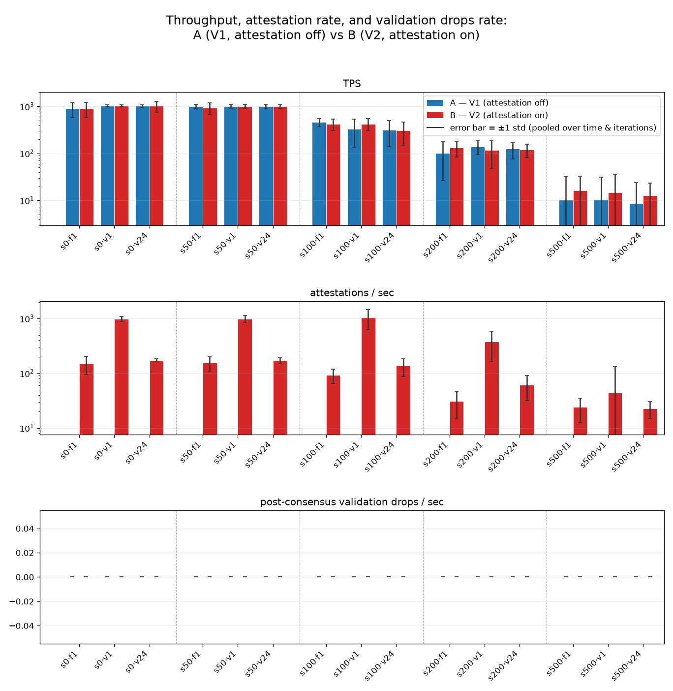

*The same panels, `n24` campaign — full target through `slow50`, machine
collapse above it; validation drops stay zero on every path.*

attestations / sec by path (busiest validator), each cell `n4` ∣ `n24`:

| config | `f1` | `v1` | `v4` / `v24` | v1/f1 |
| :---: | --- | --- | --- | --- |
| `slow0` | 484 ∣ **150** | 994  ∣ **991** | 500 ∣ **172** | 2.1× ∣ **6.6×** |
| `slow100` | 501 ∣ **92** | 993  ∣ **1042** | 503 ∣ **137** | 2.0× ∣ **11.3×** |
| `slow200` | 306 ∣ **31** | 1546 ∣ **375** | 426 ∣ **61** | 5.0× ∣ **12.1×** |
| `slow500` | 74  ∣ **24** | 516  ∣ **44** | 96  ∣ **23** | 7.0× ∣ **1.8×** |

Post-consensus validation drops stay at zero throughout:
`consensus_handler_validation_dropped_transactions` is ≈0 on both the attested
(V2) and unattested (V1) paths, across every configuration of both campaigns
(`n4` and `n24`) — the counter never moves even where shedding and saturation
are at their worst. Its rate is the third panel of the throughput figure
above.

---

**9. Execution queues and backpressure: deeper backlog under heavy load.**

Metric descriptions

| metric | codebase description | aggregation |
| --- | --- | --- |
| `execution_queueing_delay_s` | Queueing delay between a transaction is ready for execution until it starts executing | histogram; p50/p95/p99 (`histogram_quantile`) per validator, then max across validators; averaged over all seconds of all iterations |
| `execution_driver_dispatch_queue` | Number of transaction pending in execution driver dispatch queue | gauge; max across validators (busiest); peak — max over time per iteration, averaged across iterations |
| `transaction_manager_num_pending_certificates` | Number of certificates pending in `TransactionManager`, with at least 1 missing input object | gauge; max across validators (busiest); peak — max over time per iteration, averaged across iterations |

Under load, execution work queues up. Headline signal: queue-delay p95 (how
long a tx waits before executing); dispatch-queue depth and pending-tx count
track it. Each cell `n4` ∣ `n24`:

Fullnode path (`f1`):

| slow_size | A | B | B/A |
| :---: | --- | --- | --- |
| 0   | 5 ms   ∣ **6 ms** | 5 ms   ∣ **5 ms** | 1.00 ∣ **0.87** |
| 50  | 10 ms  ∣ **33 ms** | 10 ms  ∣ **40 ms** | 1.08 ∣ **1.20** |
| 100 | 27 ms  ∣ **3.17 s** | 29 ms  ∣ **2.78 s** | 1.05 ∣ **0.88** |
| 200 | 508 ms ∣ **1.91 s** | 997 ms ∣ **2.77 s** | 1.96 ∣ **1.45** |
| 500 | 2.44 s  ∣ **15.42 s** | 3.41 s  ∣ **8.09 s** | 1.39 ∣ **0.52** |

Direct-to-one-validator path (`v1`):

| slow_size | A | B | B/A |
| :---: | --- | --- | --- |
| 0   | 5 ms  ∣ **5 ms** | 5 ms  ∣ **5 ms** | 0.98 ∣ **1.04** |
| 50  | 11 ms ∣ **32 ms** | 11 ms ∣ **42 ms** | 0.98 ∣ **1.32** |
| 100 | 28 ms ∣ **3.57 s** | 26 ms ∣ **900 ms** | 0.92 ∣ **0.25** |
| 200 | 1.91 s ∣ **4.06 s** | 1.81 s ∣ **3.42 s** | 0.95 ∣ **0.84** |
| 500 | 5.21 s ∣ **16.01 s** | 5.33 s ∣ **12.17 s** | 1.02 ∣ **0.76** |

Direct-to-all-validators path (`v4` / `v24`):

| slow_size | A | B | B/A |
| :---: | --- | --- | --- |
| 0   | 5 ms  ∣ **5 ms** | 5 ms  ∣ **6 ms** | 1.00 ∣ **1.19** |
| 50  | 10 ms ∣ **26 ms** | 11 ms ∣ **29 ms** | 1.09 ∣ **1.10** |
| 100 | 29 ms ∣ **3.44 s** | 27 ms ∣ **3.60 s** | 0.94 ∣ **1.05** |
| 200 | 1.83 s ∣ **4.85 s** | 1.70 s ∣ **5.24 s** | 0.93 ∣ **1.08** |
| 500 | 5.23 s ∣ **14.02 s** | 7.35 s ∣ **6.83 s** | 1.41 ∣ **0.49** |

On `n4`, light configs barely queue (≈5–29 ms, A≈B). On the fullnode path B
carries a deeper backlog under heavy compute — queue-delay 1.4–2.0× A, and
the dispatch-queue peak grows the same way (`slow200-f1` 877 → 1280) — because
attestation's extra execution piles onto a busy pipeline. The direct paths
show no clean effect on queue delay (`v1` B/A 0.92–1.02; `v4` mixed,
0.93–1.41), but their A sides carry large pending-transactions outliers
(`slow200` peaks: 1482 pending in A vs 74 in B on `v1`, 2308 vs 131 on `v4`) —
the same picture as finding 4: without attestation the direct paths' backlog
sits after consensus.

On `n24`, the light sizes queue like `n4` (≈5–42 ms), and the saturated
sizes queue like a saturated machine: the delay peaks at `slow200`–`slow500`
(up to 16 s on A) and shows no consistent A-vs-B direction (`f1` B/A
0.52–1.45, `v24` 0.49–1.19). The one systematic effect is again the pinned
path's throttled intake (finding 11): B's queue drains at `slow100`
(900 ms vs 3.57 s, B/A 0.25) and stays below A at the heavier sizes. The
`n4` A-side pending-transaction outliers do not reappear (peaks ≈10–50,
except ≈125–190 on `v24` at `slow200`).

*Execution dispatch queue, pending transactions, and execution queue delay
(p95), `n4` campaign.*

The same figure for the <code>n24</code> campaign

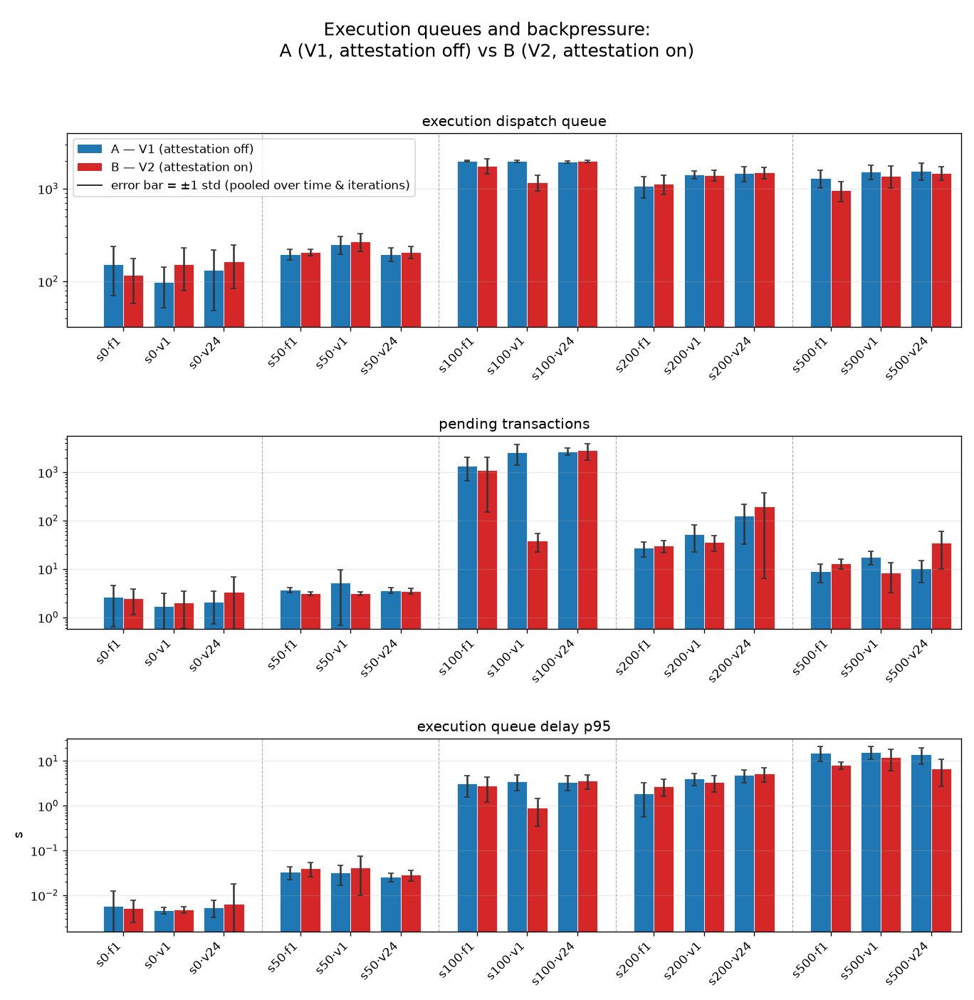

*Queues, `n24` campaign — `n4`-like through `slow50`; above that the delay
tracks the saturated machine, with the pinned path's B draining early.*

---

**10. Post-consensus load shedding: sheds under heavy compute on both
paths.**

Metric descriptions

| metric | codebase description | aggregation |
| --- | --- | --- |
| `consensus_handler_load_shedding_dropped_transactions` | Number of user transactions dropped by post-consensus load shedding, based on the quorum load shedding percentage | counter; `rate()` → drops/s, max across validators (busiest); averaged over all seconds of all iterations |
| `consensus_handler_load_shedding_percentage` | Stake-weighted quorum (2f+1) load shedding percentage enforced on user transactions in the most recent consensus commit. 0 when the P-COOL flow is disabled | gauge; max across validators; peak — max over time per iteration, averaged across iterations |
| `authority_load_shedding_percentage` | This authority's locally computed load shedding percentage. In the P-COOL flow this is the value broadcast to peers, not necessarily the rate enforced (see `consensus_handler_load_shedding_percentage`) | gauge; max across validators; peak — max over time per iteration, averaged across iterations |

On `n4`, light and moderate configurations (`slow0`–`slow100`) barely shed —
only small bursts at `qps2000` (percentages of a few percent, drops up to
≈7/s on `slow0-f1-q2000` A). The heavy `n4` configurations:

| config | A drops/s | A quorum % | A local % | B drops/s | B quorum % | B local % |
| --- | --- | --- | --- | --- | --- | --- |
| `slow200-f1` | 0    | 0    | 2.2  | 0    | 0    | 1.1  |
| `slow200-v1` | 10.2 | 6.5  | 22.7 | 0    | 0    | 20.1 |
| `slow200-v4` | 22.2 | 12.2 | 27.9 | 6.9  | 6.3  | 17.7 |
| `slow500-f1` | 1.1  | 4.1  | 10.4 | 6.8  | 26.4 | 41.8 |
| `slow500-v1` | 13.9 | 30.7 | 45.6 | 2.8  | 17.9 | 60.7 |
| `slow500-v4` | 12.1 | 28.4 | 38.6 | 4.8  | 42.4 | 70.2 |
| `slow200-f1-q2000` | 1.8  | 1.9  | 11.6 | 27.1 | 15.4 | 27.6 |
| `slow200-v1-q2000` | 71.1 | 27.1 | 31.1 | 3.0  | 2.5  | 24.7 |
| `slow200-v4-q2000` | 71.3 | 26.2 | 31.5 | 52.3 | 27.4 | 37.1 |
| `slow500-f1-q2000` | 3.6  | 17.4 | 25.2 | 2.1  | 18.5 | 47.3 |
| `slow500-v1-q2000` | 19.8 | 62.9 | 72.8 | 0.9  | 20.1 | 51.6 |
| `slow500-v4-q2000` | 25.1 | 71.1 | 78.6 | 0.7  | 8.8  | 63.8 |

Under heavy compute, all paths shed: the percentages rise on A and B alike
(the locally broadcast value runs ahead of the enforced quorum value, as
expected — the quorum needs 2f+1 validators to agree), and all drop
transactions. The paths differ in degree, not kind. On the direct paths, A
drops far more than B (71.1 vs 3.0 /s at `slow200-v1-q2000`, 25.1 vs 0.7 /s at
`slow500-v4-q2000`): attestation throttles admission, so less backlog reaches
post-consensus load shedding (finding 4). How much less follows the attestation
concentration: `v1` throttles hardest and its B drops least (0.9–3.0 /s); on
`v4`, where each validator attests only a quarter, the throttling is weaker
and B can still drop heavily (52.3 /s at `slow200-v4-q2000`). On the fullnode
path, the order can flip outright (1.8 vs 27.1 /s at `slow200-f1-q2000`) —
there B carries the deeper execution backlog (finding 9), and its shed
percentages run higher.

On `n24`, the shedding window moves down the size scale: drops fire at
`slow50`–`slow200` and vanish entirely at `slow500` — on both sides, at
both rates — because the heaviest configurations barely admit anything for
post-consensus load shedding to act on (finding 8's collapse). The `n24`
rows with ≥1 drop/s:

| config | A drops/s | A quorum % | A local % | B drops/s | B quorum % | B local % |
| --- | --- | --- | --- | --- | --- | --- |
| `slow200-f1` | 7.3 | 19.9 | 31.9 | 10.6 | 20.0 | 38.8 |
| `slow100-v1` | 12.0 | 7.9 | 42.7 | 0.0 | 0.0 | 2.7 |
| `slow200-v1` | 30.8 | 35.5 | 49.6 | 16.3 | 27.4 | 58.3 |
| `slow100-v24` | 15.5 | 10.7 | 44.7 | 15.4 | 9.1 | 44.7 |
| `slow200-v24` | 23.7 | 33.2 | 51.3 | 16.4 | 35.3 | 61.7 |
| `slow100-f1-q2000` | 36.1 | 21.7 | 38.1 | 46.1 | 25.8 | 47.0 |
| `slow200-f1-q2000` | 12.0 | 22.9 | 56.8 | 8.5 | 26.9 | 53.3 |
| `slow50-v1-q2000` | 0.0 | 0.0 | 3.6 | 3.0 | 2.0 | 3.6 |
| `slow100-v1-q2000` | 60.4 | 26.1 | 45.6 | 0.0 | 0.0 | 9.0 |
| `slow200-v1-q2000` | 32.5 | 37.6 | 57.0 | 9.6 | 25.0 | 60.2 |
| `slow50-v24-q2000` | 7.7 | 6.3 | 10.0 | 0.0 | 0.0 | 2.0 |
| `slow100-v24-q2000` | 72.2 | 35.6 | 44.4 | 73.4 | 35.2 | 47.5 |
| `slow200-v24-q2000` | 23.4 | 60.8 | 84.4 | 26.5 | 62.4 | 85.9 |

The A ≫ B contrast survives only on the pinned path (12.0 vs 0.0 /s at
`slow100-v1`, 60.4 vs 0.0 at `slow100-v1-q2000`), where attestation and the
semaphore move the whole backlog ahead of consensus (finding 4). On `f1`
and `v24`, A ≈ B (72.2 vs 73.4 /s at `slow100-v24-q2000`): the backlog
stays after consensus for B exactly as for A, and both shed alike.

*Post-consensus load shedding, `n4` campaign: drops / sec, enforced quorum
shed %, and locally broadcast shed % (peaks). A dominates the drops on the
pinned path; B can dominate on the fullnode path. The largest drops land at
`qps2000` (see the table above).*

The same figure for the <code>n24</code> campaign

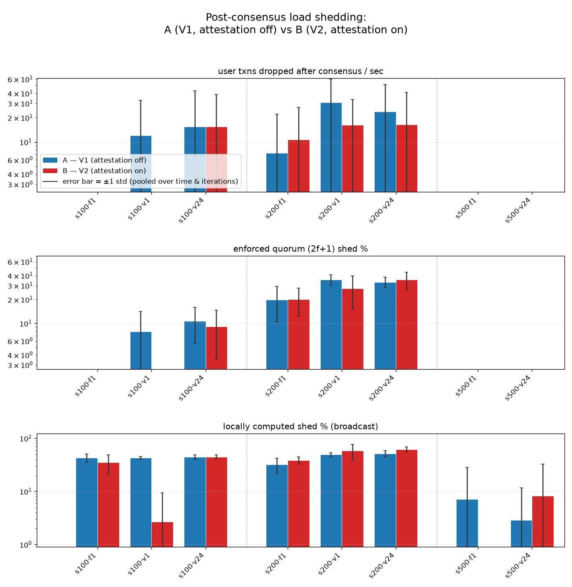

*Post-consensus shedding, `n24` campaign — drops fire at the moderate
sizes; at `slow500` the locally computed shed % is high but next to nothing
is dropped, because almost nothing is admitted (finding 8).*

---

**11. Pre-consensus load shedding: quiet until the heaviest pinned
configuration hits the submit semaphore.**

Metric descriptions

| metric | codebase description | aggregation |
| --- | --- | --- |
| `transaction_overload_sources` | Number of times each source indicates transaction overload | counter with a `source` label (`consensus_graduated` / `consensus_max_pending` / `consensus_semaphore`); `rate()` → rejections/s per source, max across validators; averaged over all seconds of all iterations |
| `validator_service_num_rejected_tx_during_overload` | Number of rejected transaction due to system overload | counter; `rate()` → rejections/s summed over error types, max across validators; averaged over all seconds of all iterations |
| `consensus_queue_load_shedding_percentage` | Percentage of transactions shed due to consensus queue length. Separate admission-control signal, not an input to `authority_load_shedding_percentage` | gauge; max across validators; peak — max over time per iteration, averaged across iterations |
| `sequencing_certificate_inflight` | The inflight requests to sequence certificates | gauge, one series per transaction type; summed per validator = `num_inflight` (the value the graduated / max-pending limits gate on), max across validators; peak — max over time per iteration, averaged across iterations |

`check_system_overload` rejects a transaction before consensus when the
consensus queue is saturated, labeled by which limit tripped: the graduated
soft band, the `max_pending_transactions` hard limit (20000), or the submit
semaphore (`max_pending_transactions × 2 / committee size` — 10000 on the
4-validator network, 1666 on the 24-validator one). Across the whole `n4`
matrix it fired in exactly one configuration — B at `slow500-v1-qps2000`; no
other `n4` configuration, at any rate, rejected a single transaction
pre-consensus:

| config | A `num_inflight` | B `num_inflight` | B graduated/s | B semaphore/s | B cons-queue % |
| --- | --- | --- | --- | --- | --- |
| `slow500-v1-q2000` | 3667 | 9726 | 32.1 | 126.8 | 4.7 |

`num_inflight` (transactions submitted to consensus but not yet sequenced) peaks
higher in B than A on every heavy configuration — under attestation each
transaction stays in the submit pipeline longer, so more sit in flight at
once. At `slow500-v1-qps2000`, B's peak reaches ≈9700 ≈ the 10000-permit submit
semaphore, and rejections fire: mostly `consensus_semaphore` (≈127/s) with
some `consensus_graduated` (≈32/s), and `consensus_max_pending` never — the
semaphore is reached first and holds `num_inflight` below the 20000 hard limit.
The totals cross-check: rejections/s (≈154) ≈ graduated + semaphore. On
`n4`, A never sheds pre-consensus at any configuration, and neither does
`v4` at any load: spreading the submissions keeps every validator's
`num_inflight` at ≈2100 or less, far from the semaphore — the pre-consensus
limits only come into play when the load pins to a single validator.

On `n24`, the smaller semaphore (1666 permits) turns the pinned path's B
into a steady shedder: at `qps1000`, from `slow100` on, B rejects
continuously (85/49/24 per second at `slow100`/`slow200`/`slow500`) while A
rejects only a trickle (4/13/23 per second) — each attested submission
holds its permit through the dry-run, so B trips the limit far earlier than
A. Every rejection is `consensus_semaphore`: the graduated band and
`max_pending` never fire, and the consensus-queue shed % stays 0
throughout. The pinned path at `qps1000` (`slow0`/`slow50` reject
nothing):

| config | A rej/s | B rej/s | A `num_inflight` | B `num_inflight` |
| --- | --- | --- | --- | --- |
| `slow100-v1` | 3.9 | 85.1 | 1369 | 1968 |
| `slow200-v1` | 12.7 | 49.1 | 1668 | 2030 |
| `slow500-v1` | 22.8 | 24.1 | 1832 | 2057 |

`num_inflight` peaks track the same pressure: ≈315–400 on both sides at
`slow0`/`slow50` (well below the limit), then B 1968–2057 vs A 1369–1832 at
the firing sizes — above the 1666 permits, because the gauge counts
everything queued for sequencing, not only submissions currently holding a
permit. Raising the rate moves the onset down to `slow50` and amplifies it
(B up to 245 /s rejected at `slow100-qps2000`); at `qps200` nothing fires
anywhere. Outside the pinned path, exactly two configurations fire, both at
`qps2000` and both A-heavy: `f1-slow500` (A ≈31 /s, B none — B's longer
submit RPC paces the fullnode's driver, so its stream arrives gentler) and
`v24-slow500` (A 43 /s vs B 5.8).

---

### H4 — safety (pass/fail)

**PASS.** All safety counters are zero across all runs of all three
campaigns — `n4`, `n24`, and the unpresented `n48` (checkpoint forks,
inconsistent state hash, double-spend, attestation task panics, soft-lock
equivocation) — and no validator crashed, restarted, or OOM'd inside any
measurement window. The one incident anywhere: two checkpoint-executor
watchdog panics ("No new synced checkpoints received for 60s") on `n48`'s
oversaturated `slow500-f1-qps1000` configuration, each firing seconds after
its measurement window closed, while the network was being torn down — a
symptom of the extreme checkpoint lag on oversaturated runs (finding 4),
not a safety event.

Metric descriptions

| metric | codebase description | aggregation |
| --- | --- | --- |
| `split_brain_checkpoint_forks` | Number of checkpoints that have resulted in a split brain | counter; max across validators over the whole window (H4 requires 0) |
| `remote_checkpoint_forks` | Number of remote checkpoints that forked from local checkpoints | counter; max across validators over the whole window (H4 requires 0) |
| `global_state_hash_inconsistent_state` | 1 if accumulated live object set differs from `GlobalStateHasher` root state hash for the previous epoch | gauge; max across validators over the whole window (H4 requires 0) |
| `total_client_double_spend_attempts_detected` | Total number of client double spend attempts that are detected | counter; max over the whole window (H4 requires 0) |
| `validator_attestation_task_panics` | Number of attestation dry-runs that panicked (surfaced as a `JoinError`) | counter; max across validators over the whole window (H4 requires 0) |
| `validator_service_num_rejected_tx_soft_lock_conflict` | Number of transactions rejected due to pre-consensus soft lock conflict on owned objects | counter; max across validators over the whole window (H4 requires 0) |

> [!NOTE]
> These results use two temporary post-consensus-validation fixes (one per
> transaction path): each keeps a sequenced transaction when an owned input is
> not yet available (`ObjectNotFound`) rather than dropping it, since a drop
> there is per-node and would fork the checkpoint. Both fixes come from branch
> `protocol-research/fix/attestation-coin-deny-post-consensus-drop-fork` and
> are cherry-picked into the branch tested here. The
> proper fix routes such deterministic failures to a cancelled-execution status
> — tracked in
> [iota-private#438](https://github.com/iotaledger/iota-private/issues/438).

---

### Summary

The takeaway of both campaigns is the [TL;DR](#tldr) at the top of this
document.

Full per-configuration numbers: `h1/results/summary_table_n4.md` and
`h1/results/summary_table_n24.md`. Figures: `h1/results/summary_plots_n4/`
and `h1/results/summary_plots_n24/`.
