# Stress-test runs and results

Running log of the stress tests from `stress-plan.md`: the exact commands,
the results of each run, and a brief analysis.

All commands are run from the `iota` monorepo root unless noted.

---

## H1 — attestation overhead (W4: slow owned-object; V1 vs V2)

**Goal:** measure what validator attestation costs. Attestation (the
pre-consensus dry-run) happens in the `submit_tx` path independent of the
congestion mode, so H1 deliberately keeps sequencing out of the picture:
**owned-object** transactions only (no shared-object scheduling at all). Each
configuration is run twice under identical load; the only difference is
attestation off (all `UserTransactionV1`, the zero-attestation control — "A")
vs on (all `UserTransactionV2`, attested — "B"). We then compare the two runs to
see how the metrics differ between them; this is purely a measurement, with no
pass/fail threshold.

---

### Experiment as run

Rather than a single submission rate (target QPS), H1 sweeps a matrix so the
overhead is measured across a range of per-transaction computation units,
three client submission paths (via fullnode, direct to a single validator,
direct to all four), and three load levels — target QPS of 200, 1000, and
2000 tx/s. Driven by
`stress-attestation-sequencer/h1/matrix.sh` (each configuration calls `run.sh`,
which runs A then B back-to-back on a fresh network, scrapes Prometheus into
per-run JSON, aggregates, and plots):

- **Workload**: `slow::slow(n, size)` with `n == size`, owned-object
  (`SLOW_SHARED=false`) — each transaction only does CPU work (no shared
  objects), so no congestion control or scheduling noise, so nothing but
  attestation drives the A vs B difference.
- **Computation** (`slow_size`, with `n == size`): {0, 50, 100, 200, 500} — the
  argument passed to `slow::slow(n, size)`; larger values mean more CPU work
  per transaction. But gas is bucketed (rounded up to `gas_rounding_step`), so
  the two smallest workloads fall in the same bucket and bill identically:
  `slow0` and `slow50` both sit at the floor (equal attestation cost — see
  finding 1), and the per-transaction computation cost only steps up from
  `slow100` onward.
- **Path**: `f1` = submit via fullnode (`DIRECT=false`); `v1` = pinned
  direct-to-one-validator (`DIRECT=true NUM_TARGET_VALIDATORS=1`); `v4` =
  direct to all 4 validators (`DIRECT=true NUM_TARGET_VALIDATORS=4`), the
  driver spreading submissions across them.
- **Rate** (`target_qps`): {200, 1000, 2000}.
- **Machine**: all runs on one AMD EPYC 9454P server (48 cores / 96 threads,
  251 GiB RAM, Ubuntu 24.04), running the private network in docker — 4
  validators plus 1 fullnode — with the stress client on the same host.
- 5 × 3 × 3 = **45 configurations**, **10 iterations** each; every iteration
  runs Run A (V1, attestation OFF) and Run B (V2, attestation ON).

The same matrix was then re-run on a **48-validator** network (plus 1
fullnode) on the same machine, to check how the overhead changes when
attestation spreads across a large committee instead of concentrating on 4
validators. Differences from the 4-validator campaign:

- the all-validators path becomes `v48` (`DIRECT=true
  NUM_TARGET_VALIDATORS=48`); configuration labels carry the network size as
  an `-n48` suffix (`-n4` for the 4-validator matrix);
- the host needed tuning to hold 49 node containers: larger kernel neighbor
  table limits, static container hostnames via `extra_hosts` (docker's
  embedded DNS drops lookups under the churn of that many peers), and larger
  UDP buffers.

Its results land in `results/summary_table_n48.{md,csv}` and
`results/summary_plots_n48/` (`--net 48` on the tooling below).

Unless stated otherwise, every table and figure below shows the `qps1000`
rate. All three rates were run; the effects barely depend on the rate, so one
representative rate keeps the tables and figures readable. Where a result does
depend on the rate, the prose or an extra table says so explicitly.

`run.sh` re-bootstraps a fresh genesis and network (empty DB) between A and B so
both share the same cold baseline and warmup — only attestation differs. The
monitoring stack is cycled down (without wiping its volume) and back up too,
since leaving Prometheus up across the reset would give Run B a longer warmup.
In unattended runs the TSDB is additionally wiped between A and B (Run A's
JSON is saved first); in interactive runs, it is kept, so both runs' windows
coexist in one Grafana view.

Aggregation and reporting tooling (all under `h1/` directory):

- `make_table.py` generates `results/summary_table_n<N>.md` (+
  `results/summary_table_n<N>.csv`) for one network size at a time (`--net`,
  default 4): one row per configuration, an A/B cell per
  metric (`mean ± std` over all seconds of all iterations), with the
  network-level series computed exactly as `plot.py` does (rate /
  `histogram_quantile`, per-validator collapse). Bursty queue and shedding
  gauges (in-flight count, dispatch queue, pending transactions, shed
  percentages) instead report the
  peak: max over time per iteration, averaged across iterations — their mean
  over time would hide the short spikes that actually hit a limit.
- `summary_plot.py` generates `results/summary_plots_n<N>/*.png` (same `--net`
  switch): grouped A vs B bar charts per metric, configurations on the x-axis,
  log-scale y.

> [!NOTE]
> Client-side `settlement_finality_latency` and `submit_transaction_latency` are
> recorded only on the fullnode path, so they exist for `f1` configurations
> only; direct-to-validator configurations bypass the fullnode and report no
> client-side latency.

---

### Findings (10 iterations per configuration)

Numbers below are means over all seconds of all iterations, except the bursty
queue/shedding gauges, which report peaks (see the tooling note above).
Per-configuration means are steady at light and moderate load — they vary a
few percent from run to run — and noisier on the heavy-compute configurations,
where throughput is small (up to tens of percent). Figure error bars are
±1 std (signal variability) by default; `summary_plot.py --disp sem` switches
them to the standard error of the mean.

In the figures below, blue = **A (V1, attestation off)** and red = **B (V2,
attestation on)**; the x-axis is one group per configuration
(`s<size>·<path>`, `f1` = fullnode, `v1` = pinned to one validator,
`v4`/`v48` = direct to all validators), with dashed separators between
computation sizes; the y-axis is log-scaled. To keep the figures readable,
the shedding figure shows only the heavy sizes (`slow200`/`slow500`) and the
client-side figures only the fullnode path. The tables and
`summary_table_n4.md` / `summary_table_n48.md` carry the full 45
configurations of each campaign.

---

**1. Attestation is a full execution dry-run, plus scheduling overhead that
grows with load.**

Metric descriptions

| metric | codebase description | aggregation |
| --- | --- | --- |
| `validator_attestation_latency` | Latency of `attest_transaction` (the pre-consensus dry-run) for `UserTransactionV2` transactions; spans pool wait + dry-run execution + async resume | histogram; p50/p95/p99 (`histogram_quantile`) over buckets combined across validators; averaged over all seconds of all iterations |
| `validator_attestation_queue_wait` | Time an attestation dry-run waits on the `spawn_blocking` pool before a worker starts it (queue wait only) | histogram; p50/p95/p99 (`histogram_quantile`) over buckets combined across validators; averaged over all seconds of all iterations |
| `validator_attestation_execution_latency` | Wall-clock of the attestation Move-VM dry-run itself (`spawn_blocking` closure body), excluding pool wait | histogram; p50/p95/p99 (`histogram_quantile`) over buckets combined across validators; averaged over all seconds of all iterations |
| `validator_attestation_async_resume_latency` | Time from the dry-run finishing on the blocking pool until the awaiting async task resumes (`spawn_blocking` join). Grows when the async runtime is saturated; full latency = queue wait + execution + this | histogram; p50/p95/p99 (`histogram_quantile`) over buckets combined across validators; averaged over all seconds of all iterations |
| `authority_state_internal_execution_latency` | Latency of actual certificate executions | histogram; p50/p95/p99 (`histogram_quantile`) over buckets combined across validators; averaged over all seconds of all iterations |
| `actual_computation_units` | Actual computation cost in gas units (CU) of attested transactions (`computation_cost` / `gas_price`), observed after execution | histogram; per-tx mean `rate(_sum)/rate(_count)` combined across validators (exact, not a quantile); averaged over all seconds of all iterations |

> [!IMPORTANT]
> The dry-run does not run on the async runtime: it is handed to a separate
> thread pool (`tokio::task::spawn_blocking`), and the async task that
> submitted it waits for the result. **Pool wait** is the time the dry-run sits
> queued before a pool thread starts it. **Async resume** is the time after the
> dry-run finishes until the waiting async task gets CPU time to continue. So
> full attestation latency = pool wait + dry-run execution + async resume.
> Under heavy load the pool's threads keep all CPU cores busy, which starves
> the async runtime — the async resume part then grows to seconds.

`validator_attestation_execution_latency` (B only — the dry-run itself, without
the pool wait and async resume around it) grows with the transaction's
computation cost and tracks the actual execution latency across the whole
sweep, matching it at the heavy end. The full attestation latency
(`validator_attestation_latency`) equals the dry-run at light compute, then
pulls away from `slow200` on — the wait and resume around the dry-run grow
with load, on every client path:

Fullnode path (`f1`), each latency cell `n4` ∣ `n48` (CUs are identical
on both networks):

| slow_size | attest. exec. lat. p95 | exec. lat. p95 | attest. full lat. p95 | CUs |
| :---: | --- | --- | --- | :---: |
| 0   | 0.95 ms  ∣ **0.99 ms** | 2.06 ms   ∣ **7.84 ms** | 0.95 ms   ∣ **58.17 ms** | 1k    |
| 50  | 4.80 ms  ∣ **17.42 ms** | 5.87 ms   ∣ **190.88 ms** | 4.83 ms   ∣ **236.95 ms** | 1k    |
| 100 | 16.21 ms ∣ **106.32 ms** | 20.30 ms  ∣ **574.57 ms** | 19.29 ms  ∣ **640.22 ms** | 4k    |
| 200 | 94.85 ms ∣ **1.024 s** | 185.32 ms ∣ **1.697 s** | 444.29 ms ∣ **2.616 s** | 128k  |
| 500 | 1.307 s   ∣ **11.168 s** | 1.200 s    ∣ **8.942 s** | 2.013 s    ∣ **14.204 s** | 1.37M |

Direct-to-one-validator path (`v1`):

| slow_size | attest. exec. lat. p95 | exec. lat. p95 | attest. full lat. p95 | CUs |
| :---: | --- | --- | --- | :---: |
| 0   | 0.95 ms   ∣ **0.98 ms** | 1.32 ms   ∣ **8.40 ms** | 0.95 ms   ∣ **80.52 ms** | 1k    |
| 50  | 4.80 ms   ∣ **7.39 ms** | 6.20 ms   ∣ **61.00 ms** | 4.85 ms   ∣ **713.25 ms** | 1k    |
| 100 | 17.37 ms  ∣ **41.84 ms** | 21.29 ms  ∣ **251.13 ms** | 20.60 ms  ∣ **1.483 s** | 4k    |
| 200 | 78.78 ms  ∣ **293.23 ms** | 207.46 ms ∣ **1.234 s** | 505.16 ms ∣ **4.125 s** | 128k  |
| 500 | 990.24 ms ∣ **2.615 s** | 999.34 ms ∣ **1.812 s** | 2.515 s    ∣ **10.585 s** | 1.37M |

Direct-to-all-validators path (`v4` / `v48`):

| slow_size | attest. exec. lat. p95 | exec. lat. p95 | attest. full lat. p95 | CUs |
| :---: | --- | --- | --- | :---: |
| 0   | 0.95 ms  ∣ **1.01 ms** | 1.21 ms   ∣ **7.86 ms** | 0.95 ms   ∣ **20.14 ms** | 1k    |
| 50  | 4.80 ms  ∣ **15.91 ms** | 6.02 ms   ∣ **88.97 ms** | 4.84 ms   ∣ **81.18 ms** | 1k    |
| 100 | 18.00 ms ∣ **91.85 ms** | 21.19 ms  ∣ **617.04 ms** | 20.35 ms  ∣ **673.67 ms** | 4k    |
| 200 | 93.27 ms ∣ **1.010 s** | 221.61 ms ∣ **1.769 s** | 503.07 ms ∣ **3.517 s** | 128k  |
| 500 | 1.372 s   ∣ **9.892 s** | 1.478 s    ∣ **7.933 s** | 2.712 s    ∣ **16.607 s** | 1.37M |

The dry-run and the real execution share the bulk of the work — load the
inputs, run the Move VM — so their latencies scale together with computation
cost. The differences are at the edges.

- For a no-op transaction (`slow0`) the Move work is almost nothing and only
fixed overhead remains; the real execution (`try_execute_immediately`: lock,
input load, Move VM, effects commit) carries more of it than the attestation
checks do, so it sits a little above the dry-run (≈1.3–2.1 vs ≈0.95 ms on `n4`).
- At mid-range compute (`slow200`), the real execution reads about twice the
dry-run — not extra work, but timing: it runs after consensus, where a whole
commit's transactions land at once and execute in parallel, and every validator
executes every transaction, while each transaction is attested once, paced
by client arrivals.
- On this one machine, that is 4× the CPU demand on `n4` and 48× on `n48`, so
the parallel executions share cores and each takes longer on the wall clock.
At `slow500`, the machine is saturated continuously either way and the two
converge.
- On `n48`, the 48× replication fills the machine already at `slow0`, so the
edges move: even a no-op's real execution sits ≈8× above the dry-run (≈7.8–8.4
ms vs ≈1 ms).
- A heavy attested transaction is still executed twice — once for the dry-run,
once for real — so it costs the validator roughly double.

*Computation units, attestation dry-run execution latency (p50/p95), and actual
execution latency (p95) — findings 1–3, `n4` campaign. CUs sit at the gas floor
for `slow0` and `slow50` and step up from `slow100`; the dry-run tracks actual
execution latency across the sweep.*

The same figure for the <code>n48</code> campaign

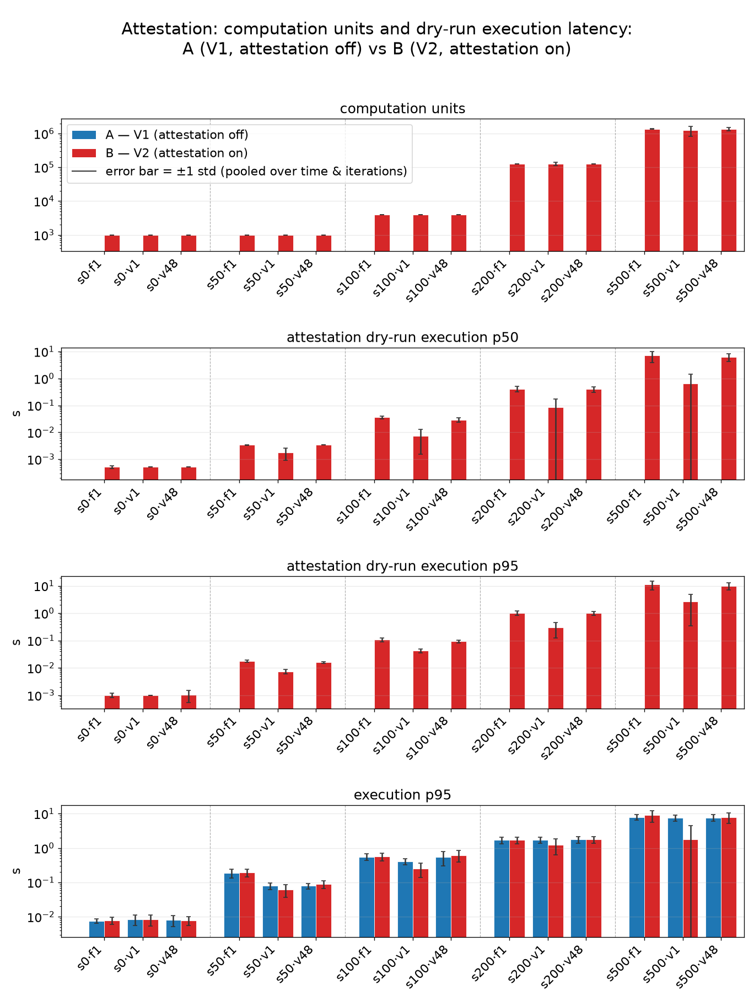

*Same panels, `n48` campaign — same CU steps, latencies an order of magnitude
higher (finding 1).*

The full attestation latency adds the scheduling around the dry-run: on `n4`,
nothing at light load, but from `slow200` on, the pool wait and async resume
grow to dominate it (444 ms full vs 95 ms dry-run on `f1`); on `n48`, that
scheduling overhead is visible at every size (58 ms full vs ≈1 ms dry-run on
`f1` at `slow0`). The split into its three parts (pool wait + dry-run
execution + async resume), each cell `n4` ∣ `n48`:

> [!NOTE]
> At light compute, every value is below the smallest histogram bucket (1 ms),
> so each part reads as the interpolation floor — `p × 1` ms, i.e. 0.50 ms at
> p50 and 0.99 ms at p99 — rather than a real latency; sub-millisecond parts
> are unresolvable, which is also why they don't sum to the full column.

Fullnode path (`f1`), p50:

| slow_size | pool wait | dry-run exec | async resume | full |
| :---: | --- | --- | --- | --- |
| 0   | 0.50 ms   ∣ **5.66 ms** | 0.50 ms   ∣ **0.52 ms** | 0.50 ms ∣ **0.60 ms** | 0.50 ms   ∣ **7.34 ms** |
| 50  | 0.51 ms   ∣ **21.35 ms** | 2.96 ms   ∣ **3.41 ms** | 0.50 ms ∣ **0.75 ms** | 2.99 ms   ∣ **28.13 ms** |
| 100 | 0.55 ms   ∣ **55.93 ms** | 6.10 ms   ∣ **35.91 ms** | 0.51 ms ∣ **1.32 ms** | 6.52 ms   ∣ **108.44 ms** |
| 200 | 59.26 ms  ∣ **286.38 ms** | 36.24 ms  ∣ **410.53 ms** | 0.83 ms ∣ **5.31 ms** | 113.94 ms ∣ **846.21 ms** |
| 500 | 170.36 ms ∣ **824.21 ms** | 765.24 ms ∣ **7.061 s** | 8.69 ms ∣ **334.37 ms** | 1.050 s    ∣ **8.638 s** |

Direct-to-one-validator path (`v1`), p50:

| slow_size | pool wait | dry-run exec | async resume | full |
| :---: | --- | --- | --- | --- |
| 0   | 0.50 ms  ∣ **7.28 ms** | 0.50 ms   ∣ **0.52 ms** | 0.50 ms   ∣ **0.57 ms** | 0.50 ms   ∣ **8.34 ms** |
| 50  | 0.51 ms  ∣ **32.85 ms** | 2.97 ms   ∣ **1.74 ms** | 0.50 ms   ∣ **14.84 ms** | 3.01 ms   ∣ **80.92 ms** |
| 100 | 0.57 ms  ∣ **103.07 ms** | 6.29 ms   ∣ **7.27 ms** | 0.51 ms   ∣ **83.93 ms** | 6.82 ms   ∣ **279.59 ms** |
| 200 | 7.93 ms  ∣ **422.29 ms** | 10.86 ms  ∣ **85.77 ms** | 7.16 ms   ∣ **692.45 ms** | 60.82 ms  ∣ **1.348 s** |
| 500 | 42.59 ms ∣ **1.221 s** | 201.44 ms ∣ **652.29 ms** | 182.38 ms ∣ **1.937 s** | 597.20 ms ∣ **3.947 s** |

Direct-to-all-validators path (`v4` / `v48`), p50:

| slow_size | pool wait | dry-run exec | async resume | full |
| :---: | --- | --- | --- | --- |
| 0   | 0.50 ms   ∣ **1.61 ms** | 0.50 ms   ∣ **0.52 ms** | 0.50 ms  ∣ **0.57 ms** | 0.50 ms   ∣ **2.92 ms** |
| 50  | 0.51 ms   ∣ **8.86 ms** | 2.98 ms   ∣ **3.40 ms** | 0.50 ms  ∣ **0.72 ms** | 3.01 ms   ∣ **15.27 ms** |
| 100 | 0.56 ms   ∣ **40.72 ms** | 6.49 ms   ∣ **29.31 ms** | 0.51 ms  ∣ **1.23 ms** | 6.92 ms   ∣ **85.78 ms** |
| 200 | 45.72 ms  ∣ **373.89 ms** | 36.77 ms  ∣ **397.54 ms** | 2.02 ms  ∣ **7.37 ms** | 117.28 ms ∣ **974.89 ms** |
| 500 | 145.01 ms ∣ **2.653 s** | 836.25 ms ∣ **6.246 s** | 27.83 ms ∣ **41.28 ms** | 1.276 s    ∣ **9.558 s** |

The same split at p99 (the tails)

Fullnode path (`f1`), p99:

| slow_size | pool wait | dry-run exec | async resume | full |
| :---: | --- | --- | --- | --- |
| 0   | 0.99 ms   ∣ **110.32 ms** | 0.99 ms   ∣ **4.00 ms** | 0.99 ms   ∣ **17.97 ms** | 0.99 ms   ∣ **111.67 ms** |
| 50  | 2.17 ms   ∣ **404.98 ms** | 4.96 ms   ∣ **33.20 ms** | 0.99 ms   ∣ **33.25 ms** | 5.21 ms   ∣ **411.50 ms** |
| 100 | 9.44 ms   ∣ **961.63 ms** | 23.24 ms  ∣ **156.32 ms** | 2.93 ms   ∣ **87.63 ms** | 24.74 ms  ∣ **1.035 s** |
| 200 | 597.54 ms ∣ **2.779 s** | 135.36 ms ∣ **1.242 s** | 67.57 ms  ∣ **457.24 ms** | 649.60 ms ∣ **3.483 s** |
| 500 | 1.413 s    ∣ **5.426 s** | 1.475 s    ∣ **12.309 s** | 498.77 ms ∣ **2.600 s** | 2.474 s    ∣ **16.316 s** |

Direct-to-one-validator path (`v1`), p99:

| slow_size | pool wait | dry-run exec | async resume | full |
| :---: | --- | --- | --- | --- |
| 0   | 0.99 ms   ∣ **148.72 ms** | 0.99 ms   ∣ **4.16 ms** | 0.99 ms   ∣ **8.93 ms** | 0.99 ms   ∣ **150.19 ms** |
| 50  | 2.98 ms   ∣ **701.69 ms** | 4.97 ms   ∣ **18.78 ms** | 1.00 ms   ∣ **596.41 ms** | 6.19 ms   ∣ **1.016 s** |
| 100 | 14.80 ms  ∣ **1.313 s** | 23.47 ms  ∣ **59.93 ms** | 2.84 ms   ∣ **1.190 s** | 27.92 ms  ∣ **2.002 s** |
| 200 | 474.62 ms ∣ **3.171 s** | 125.30 ms ∣ **406.11 ms** | 535.39 ms ∣ **3.421 s** | 747.32 ms ∣ **4.881 s** |
| 500 | 1.297 s    ∣ **6.693 s** | 1.296 s    ∣ **3.290 s** | 2.217 s    ∣ **6.288 s** | 3.287 s    ∣ **12.389 s** |

Direct-to-all-validators path (`v4` / `v48`), p99:

| slow_size | pool wait | dry-run exec | async resume | full |
| :---: | --- | --- | --- | --- |
| 0   | 0.99 ms   ∣ **29.19 ms** | 0.99 ms   ∣ **4.23 ms** | 0.99 ms   ∣ **7.57 ms** | 0.99 ms   ∣ **31.93 ms** |
| 50  | 2.55 ms   ∣ **145.09 ms** | 4.96 ms   ∣ **26.26 ms** | 0.99 ms   ∣ **18.72 ms** | 5.50 ms   ∣ **151.02 ms** |
| 100 | 9.66 ms   ∣ **1.057 s** | 23.60 ms  ∣ **141.39 ms** | 3.06 ms   ∣ **68.83 ms** | 24.42 ms  ∣ **1.118 s** |
| 200 | 644.57 ms ∣ **4.030 s** | 132.85 ms ∣ **1.229 s** | 293.54 ms ∣ **793.91 ms** | 753.15 ms ∣ **4.766 s** |
| 500 | 1.793 s    ∣ **12.596 s** | 1.547 s    ∣ **11.412 s** | 1.723 s    ∣ **2.684 s** | 3.457 s    ∣ **19.638 s** |

The tails sharpen the same picture.

- On `n4`, the overhead is tail-only: `f1` pool wait dominates (598 ms at
`slow200`); `v1`'s async resume grows into the largest part (2.217 s at
`slow500`, more than the dry-run itself); `v4` — where each validator attests
only a quarter of the load — lands mid-way (1.723 s vs 0.499 s on `f1` and
2.217 s on `v1`).
- On `n48`, the tails grow an order of magnitude and start at `slow0`: pool
wait 110 ms on `f1`, 149 ms on `v1`, 29 ms on `v48`.
- On `n48` at `slow500`, the spread paths pay pool wait plus dry-run (full
≈16–20 s) while `v1`'s resume tail reaches 6.3 s.

- At light compute, every part sits at the histogram floor on `n4` (see the
note above) — the full latency is just the dry-run.
- On `n48`, the scheduling overhead is already real at `slow0`: `f1` full is
7.3 ms against a 0.5 ms dry-run, 5.7 ms of it pool wait.
- On `f1` and `v4`/`v48`, the dry-runs queue up for a pool thread: pool wait
plus the dry-run itself carry nearly the whole latency, while resume stays
small on both networks.
- On `v1`, the one pinned validator attests everything; its cores saturate and
finished dry-runs wait for the starved async runtime to pick the result up.
On `n4`, that shows only in the tail (see the p99 tables in the spoiler); on
`n48`, async resume dominates the median — 692 ms at `slow200` and 1.937 s
at `slow500`, more than the dry-run itself.
- The parts do not sum exactly to the full column: each column is its own
percentile over different transactions, so the split is additive at the mean,
not per percentile.

*Attestation pool wait (p99/p95/p50), `n4` campaign — how long a dry-run sits
queued before a `spawn_blocking` pool thread starts it. Grows on the heavy
`f1` configurations, where dry-runs arrive faster than pool threads get CPU.*

The same figure for the <code>n48</code> campaign

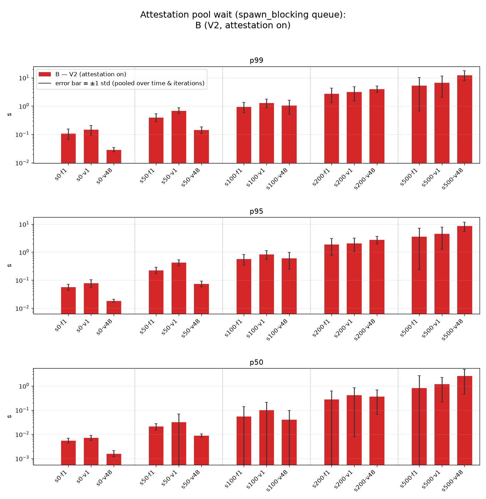

*Pool wait, `n48` campaign — nonzero from `slow0` on every path, largest on
the spread paths at heavy sizes.*

*Attestation async resume (p99/p95/p50), `n4` campaign — how long after the
dry-run finishes until the waiting async task gets CPU time to continue. The
tail grows largest on the heavy pinned (`v1`) configurations, where the one
attesting validator's cores are saturated.*

The same figure for the <code>n48</code> campaign

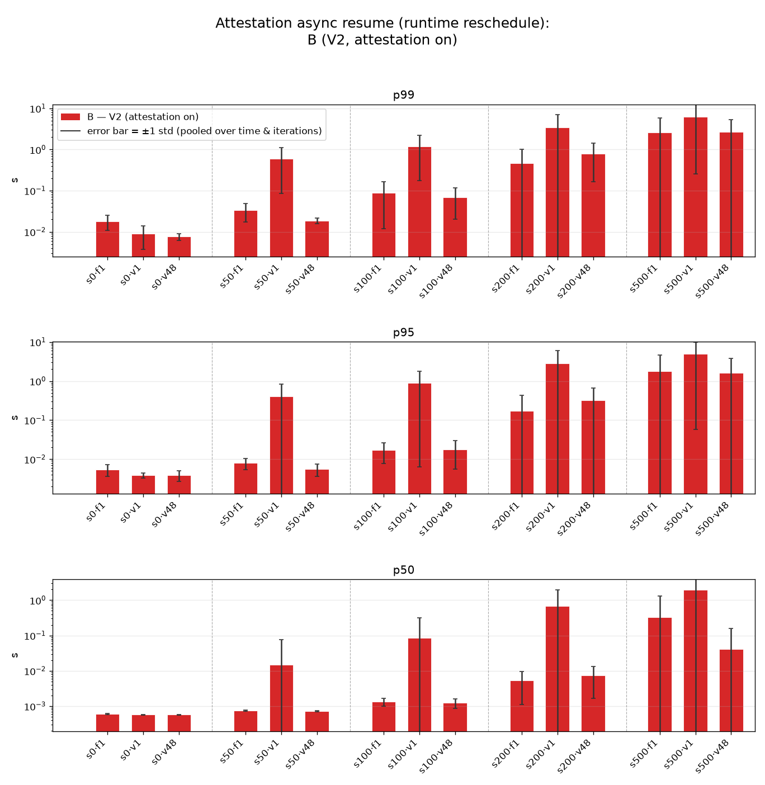

*Async resume, `n48` campaign — the `v1` starvation shows at every percentile,
not just the tail.*

*Full attestation latency (p99/p95/p50), `n4` campaign — pool wait + dry-run
execution + async resume, the whole `attest_transaction` span.*

The same figure for the <code>n48</code> campaign

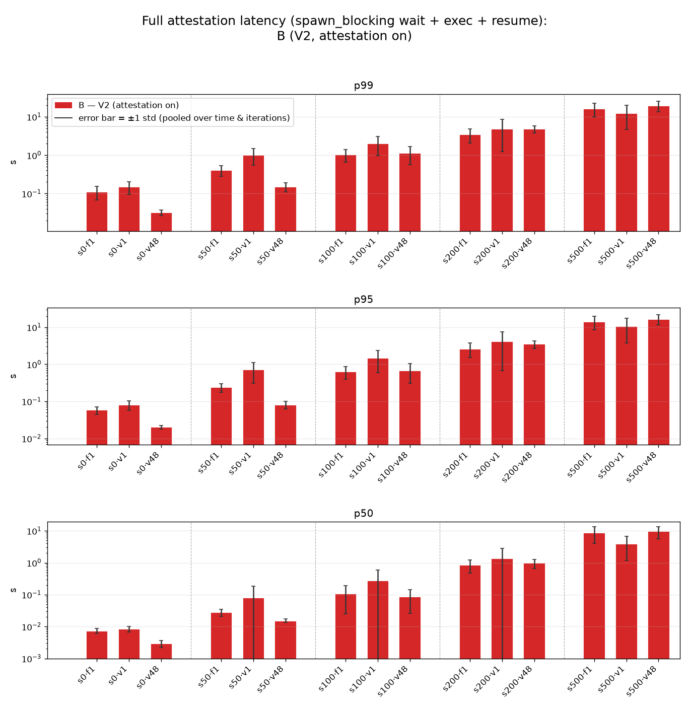

*Full attestation latency, `n48` campaign — an order of magnitude above `n4`
throughout.*

---

**2. Internal execution latency: unchanged by attestation.**

> [!NOTE]
> The title holds as stated on `n4`. On `n48`, the pinned path deviates
> one-sidedly — B's executions run faster than A's — through an admission
> side effect, not an execution cost; see the `n48` paragraph below.

> [!TIP]
> Both metrics of this finding — `authority_state_internal_execution_latency`
> and `actual_computation_units` — are described in finding 1's metric table.

`authority_state_internal_execution_latency` (the real, post-consensus VM
execution) is A≈B on `n4`: the p95 B/A ratio has median **1.00** across all
45 configurations (range 0.77–1.52). The deviations sit on the heavy-compute
configurations and swing in both directions — B faster on some, slower on
others — so they are load noise, not a systematic attestation cost. The
largest one (`v4` at `slow500`, 1.52) is the contention effect from finding 1:
B's dry-runs add CPU load that stretches the real execution's wall clock.
Attestation does not touch the execution path itself; its cost lives in the
pre-consensus dry-run (finding 1). Execution latency p95 (CUs are measured
on attested transactions, so they exist for B only), each latency cell
`n4` ∣ `n48`:

Fullnode path (`f1`):

| slow_size | A | B | B/A | CUs |
| :---: | --- | --- | --- | :---: |
| 0   |   1.80 ms   ∣ **7.59 ms** |   2.06 ms   ∣ **7.84 ms** | 1.14 ∣ **1.03** | 1k    |
| 50  |   5.45 ms   ∣ **189.17 ms** |   5.87 ms   ∣ **190.88 ms** | 1.08 ∣ **1.01** | 1k    |
| 100 |  21.35 ms  ∣ **553.39 ms** |  20.30 ms  ∣ **574.57 ms** | 0.95 ∣ **1.04** | 4k    |
| 200 | 212.18 ms ∣ **1.690 s** | 185.32 ms ∣ **1.697 s** | 0.87 ∣ **1.00** | 128k  |
| 500 | 969.08 ms ∣ **7.895 s** |   1.200 s    ∣ **8.942 s** | 1.24 ∣ **1.13** | 1.37M |

Direct-to-one-validator path (`v1`):

| slow_size | A | B | B/A | CUs |
| :---: | --- | --- | --- | :---: |
| 0   |   1.34 ms   ∣ **8.35 ms** |   1.32 ms   ∣ **8.40 ms** | 0.98 ∣ **1.01** | 1k    |
| 50  |   5.91 ms   ∣ **78.75 ms** |   6.20 ms   ∣ **61.00 ms** | 1.05 ∣ **0.77** | 1k    |
| 100 |  21.98 ms  ∣ **411.99 ms** |  21.29 ms  ∣ **251.13 ms** | 0.97 ∣ **0.61** | 4k    |
| 200 | 222.24 ms ∣ **1.707 s** | 207.46 ms ∣ **1.234 s** | 0.93 ∣ **0.72** | 128k  |
| 500 | 971.15 ms ∣ **7.583 s** | 999.34 ms ∣ **1.812 s** | 1.03 ∣ **0.24** | 1.37M |

Direct-to-all-validators path (`v4` / `v48`):

| slow_size | A | B | B/A | CUs |
| :---: | --- | --- | --- | :---: |
| 0   |   1.12 ms   ∣ **8.01 ms** |   1.21 ms   ∣ **7.86 ms** | 1.08 ∣ **0.98** | 1k    |
| 50  |   5.95 ms   ∣ **79.26 ms** |   6.02 ms   ∣ **88.97 ms** | 1.01 ∣ **1.12** | 1k    |
| 100 |  21.92 ms  ∣ **545.53 ms** |  21.19 ms  ∣ **617.04 ms** | 0.97 ∣ **1.13** | 4k    |
| 200 | 207.40 ms ∣ **1.785 s** | 221.61 ms ∣ **1.769 s** | 1.07 ∣ **0.99** | 128k  |
| 500 | 970.22 ms ∣ **7.678 s** |   1.478 s    ∣ **7.933 s** | 1.52 ∣ **1.03** | 1.37M |

On `n48`, the picture splits by path. On `f1` and `v48`, the claim holds as
on `n4`: the B/A p95 median is 1.01 and 1.00 (ranges 0.99–1.17 and 0.92–1.14,
respectively). On `v1`, it turns one-sided: median 0.75, down to 0.24 at
`slow500-qps1000` — B's executions are systematically faster than A's. That is
not attestation speeding anything up: on the pinned path B's attestation and
the submit semaphore throttle admission on the single entry validator (finding
14), so fewer transactions execute concurrently and each takes less wall clock
on the shared cores. The execution path itself is still untouched by
attestation — the deviation is an upstream admission effect, visible only
because this metric measures wall clock under CPU contention.

---

**3. Compute-unit accounting is exact.**

Metric descriptions

| metric | codebase description | aggregation |
| --- | --- | --- |
| `attested_computation_units` | Attestor's pre-consensus estimate of the computation cost in gas units (CU), for transactions that arrived as `UserTransactionV2` | histogram; per-tx mean `rate(_sum)/rate(_count)` combined across validators; averaged over all seconds of all iterations |
| `actual_to_attested_computation_units_ratio` | Ratio actual / attested computation units for attested transactions | histogram; per-tx mean `rate(_sum)/rate(_count)` combined across validators; averaged over all seconds of all iterations |

> [!TIP]
> `actual_computation_units` — the other metric of this finding — is described
> in finding 1's metric table.

Attested computation units equal actual computation units for every
owned-object configuration of both campaigns, `n4` and `n48` (ratio = 1.0),
confirming attestation predicts the computation cost precisely for these
transactions regardless of the committee size. CUs are reported as the
exact per-transaction mean (`_sum`/`_count`), not a p50: the
workload is deterministic, so every transaction is identical and the mean is
the exact cost. A p50 would instead interpolate between histogram bucket edges
and land on impossible values (e.g., 850 for `slow0`, below the 1000-unit
`gas_rounding_step` floor).

---

**4. Receipt → execution latency: roughly doubles under heavy load.**

> [!NOTE]
> The title describes `n4`. On `n48`, the doubling moves to the moderate
> sizes on the pinned path (B/A ≈2.6–2.9) and washes out at heavy compute,
> where every path sits at the backlog ceiling; see the `n48` paragraph
> below.

Metric descriptions

| metric | codebase description | aggregation |
| --- | --- | --- |
| `validator_transaction_execution_latency` | Validator-internal latency from receiving a transaction via `submit_tx` until it finished executing (pre-consensus check, consensus, post-consensus validation, sequencing incl. deferral, execution); excludes client/fullnode time | histogram; p50/p95/p99 (`histogram_quantile`) per validator, then max across validators (busiest); averaged over all seconds of all iterations |

`validator_transaction_execution_latency` times the whole internal pipeline on
the receiving validator — receipt via `submit_tx`, attestation, consensus,
post-consensus validation, and execution — no client/fullnode time. Median
(p50), each latency cell `n4` ∣ `n48`:

Fullnode path (`f1`):

| slow_size | A | B | B/A |
| :---: | --- | --- | --- |
| 0   | 300 ms ∣ **972 ms** | 284 ms ∣ **964 ms** | 0.95 ∣ **0.99** |
| 50  | 299 ms ∣ **2.87 s** | 294 ms ∣ **3.27 s** | 0.98 ∣ **1.14** |
| 100 | 290 ms ∣ **6.38 s** | 305 ms ∣ **7.35 s** | 1.05 ∣ **1.15** |
| 200 | 787 ms ∣ **15.80 s** | 1.37 s  ∣ **17.74 s** | 1.75 ∣ **1.12** |
| 500 | 4.23 s   ∣ **31.78 s** | 8.39 s  ∣ **31.87 s** | 1.99 ∣ **1.00** |

Direct-to-one-validator path (`v1`):

| slow_size | A | B | B/A |
| :---: | --- | --- | --- |
| 0   |  244 ms ∣ **779 ms** |  225 ms ∣ **856 ms** | 0.92 ∣ **1.10** |
| 50  |  245 ms ∣ **2.03 s** |  288 ms ∣ **5.95 s** | 1.18 ∣ **2.92** |
| 100 |  265 ms ∣ **4.62 s** |  286 ms ∣ **11.94 s** | 1.08 ∣ **2.58** |
| 200 |  1.60 s  ∣ **17.54 s** |  2.93 s  ∣ **22.53 s** | 1.82 ∣ **1.28** |
| 500 | 10.83 s ∣ **30.38 s** | 17.95 s ∣ **19.90 s** | 1.66 ∣ **0.66** |

Direct-to-all-validators path (`v4` / `v48`):

| slow_size | A | B | B/A |
| :---: | --- | --- | --- |
| 0   |  250 ms ∣ **734 ms** |  249 ms ∣ **740 ms** | 1.00 ∣ **1.01** |
| 50  |  264 ms ∣ **1.63 s** |  275 ms ∣ **1.77 s** | 1.04 ∣ **1.09** |
| 100 |  297 ms ∣ **9.54 s** |  295 ms ∣ **10.11 s** | 0.99 ∣ **1.06** |
| 200 |  1.60 s  ∣ **20.79 s** |  2.43 s  ∣ **23.20 s** | 1.52 ∣ **1.12** |
| 500 | 11.25 s ∣ **30.43 s** | 13.29 s ∣ **28.94 s** | 1.18 ∣ **0.95** |

On `n4` at light load, the pipeline is ≈230–300 ms and A≈B — dominated by
consensus, with attestation (a few ms at these sizes) lost in the noise. At
heavy compute, B runs ≈1.7–2.0× A (`slow500-f1` 4.23 s → 8.39 s), because
attestation adds a second full execution before consensus (finding 1) and,
under load, the extra work compounds through queueing. p95 tracks the same
(`slow500-f1` 6.8 s → 13.1 s). Two path effects stand out. The direct paths
(`v1`, `v4`) start from a far higher A baseline under heavy compute (≈11 s vs
4.2 s on `f1` at `slow500`) — without the fullnode in between, the client
pushes into consensus at full rate and the backlog builds up on the receiving
side. And B's relative cost shrinks as attestation spreads: B/A at `slow500`
is 1.99 on `f1`, 1.66 on `v1`, 1.18 on `v4`, where each validator attests
only a quarter of the load.

On `n48`, the shape changes. The floor is ≈0.7–1.0 s already at `slow0`
(consensus and execution share a saturated machine), and the heavy end hits
a ceiling: at `slow500` every path sits at ≈30 s p50 for A and B alike —
half the 60 s run window, pure backlog — so the doubling washes out (B/A
0.66–1.00, with `v1`'s 0.66 the admission-throttling effect from finding 2).
The attestation cost instead shows at the moderate sizes on the pinned path
— B/A 2.92 at `slow50-v1` and 2.58 at `slow100-v1`, where B's transactions
queue behind the one attesting validator's dry-runs and starved runtime
(finding 1) — while the spread paths stay at 1.06–1.15 throughout.

*Validator-internal receipt → executed latency, `n4` campaign — the pure
validator-internal pipeline, with no client/fullnode time.*

The same figure for the <code>n48</code> campaign

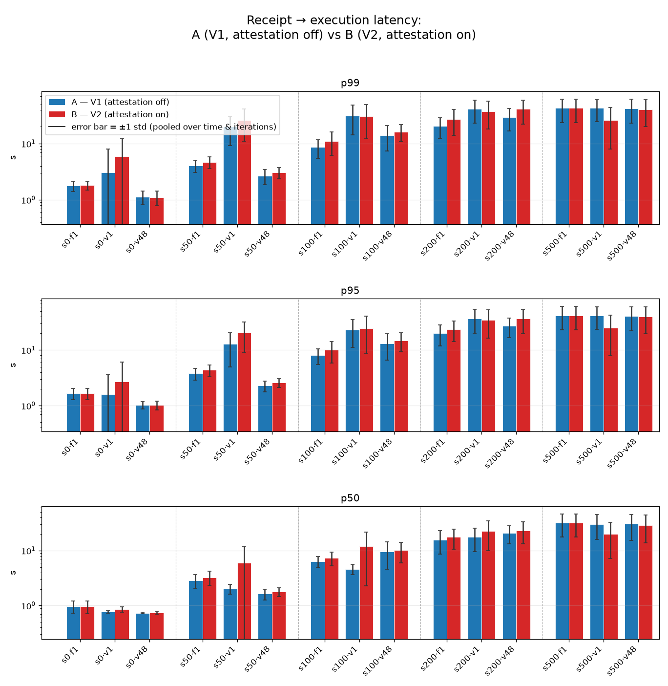

*Receipt → executed latency, `n48` campaign — the heavy sizes sit at the
≈30–40 s backlog ceiling on every path; the pinned path's B penalty shows at
`slow50`/`slow100`.*

---

**5. Checkpoint creation lag: attestation moves the backlog ahead of
consensus.**

> [!NOTE]
> The title holds on both networks, but on `n48`, the shift is all-or-nothing:
> total on the pinned path (B/A ≈0.07 at `slow500`), absent on the spread
> paths (≈1.0); see the `n48` paragraph below.

Metric descriptions

| metric | codebase description | aggregation |
| --- | --- | --- |
| `checkpoint_creation_latency` | Latency from consensus commit timestamp to local checkpoint creation in milliseconds | histogram; p50/p95/p99 (`histogram_quantile`) over buckets combined across validators; averaged over all seconds of all iterations |

`checkpoint_creation_latency` times consensus commit created → checkpoint
built (values are seconds, despite the help text saying milliseconds). The
builder can only seal a checkpoint once that commit's transactions have
executed, so the lag is a direct view of the post-consensus execution backlog.
p95, each latency cell `n4` ∣ `n48`:

Fullnode path (`f1`):

| slow_size | A | B | B/A |
| :---: | --- | --- | --- |
| 0   | 562 ms ∣ **683 ms** | 655 ms ∣ **683 ms** | 1.17 ∣ **1.00** |
| 50  | 401 ms ∣ **3.33 s** | 520 ms ∣ **3.65 s** | 1.30 ∣ **1.10** |
| 100 | 274 ms ∣ **7.94 s** | 322 ms ∣ **8.82 s** | 1.18 ∣ **1.11** |
| 200 | 3.12 s  ∣ **15.67 s** | 4.47 s  ∣ **17.70 s** | 1.43 ∣ **1.13** |
| 500 | 9.99 s  ∣ **35.14 s** | 11.56 s ∣ **32.55 s** | 1.16 ∣ **0.93** |

Direct-to-one-validator path (`v1`):

| slow_size | A | B | B/A |
| :---: | --- | --- | --- |
| 0   | 499 ms ∣ **519 ms** | 251 ms ∣ **529 ms** | 0.50 ∣ **1.02** |
| 50  | 268 ms ∣ **1.27 s** | 584 ms ∣ **846 ms** | 2.18 ∣ **0.67** |
| 100 | 293 ms ∣ **5.04 s** | 258 ms ∣ **1.98 s** | 0.88 ∣ **0.39** |
| 200 | 15.57 s ∣ **13.64 s** | 5.59 s  ∣ **5.48 s** | 0.36 ∣ **0.40** |
| 500 | 30.21 s ∣ **30.56 s** | 11.74 s ∣ **1.99 s** | 0.39 ∣ **0.07** |

Direct-to-all-validators path (`v4` / `v48`):

| slow_size | A | B | B/A |
| :---: | --- | --- | --- |
| 0   | 243 ms ∣ **508 ms** | 239 ms ∣ **514 ms** | 0.98 ∣ **1.01** |
| 50  | 511 ms ∣ **1.40 s** | 723 ms ∣ **1.56 s** | 1.42 ∣ **1.11** |
| 100 | 695 ms ∣ **14.28 s** | 273 ms ∣ **15.70 s** | 0.39 ∣ **1.10** |
| 200 | 15.29 s ∣ **30.02 s** | 11.74 s ∣ **29.62 s** | 0.77 ∣ **0.99** |
| 500 | 32.39 s ∣ **34.06 s** | 26.36 s ∣ **33.98 s** | 0.81 ∣ **1.00** |

At light compute, the lag is a steady ≈0.2–0.7 s on all paths. Under heavy
compute, the paths diverge, in two separate ways.

First, the A side splits by submission route, not by spreading: both direct
paths pile up a huge post-consensus backlog (A at `slow500`: 30.21 s on `v1`,
32.39 s on `v4`) while the fullnode path stays at 9.99 s. The fullnode acts as
an admission buffer — its own transaction driver queues and paces what enters
consensus — and spreading the direct submissions over all 4 validators (`v4`)
does not substitute for it.

Second, on the B side attestation moves the backlog ahead of consensus, and
the strength of that shift follows how concentrated the attestation is. On
`v1`, one validator attests everything and intake is throttled hardest: A lags
far more than B (30.21 vs 11.74 s; at p50 16.73 vs 2.31 s). On `v4`, each
validator attests a quarter and the shift is half-hearted (B/A 0.77–0.81). On
`f1`, attestation is spread the same way but B also keeps the deeper execution
backlog, so B lags slightly more than A (1.2–1.4×). Without attestation, the
load goes straight into consensus and the backlog piles up after it — exactly
where checkpoints wait; with attestation, each transaction first spends time
in the dry-run while the client holds a bounded number in flight (finding 4's
receipt→execution shows that side: B ≈1.7× A on `v1`, ≈1.2× on `v4`).
Attestation does not shrink the total backlog — it moves it from after
consensus, where checkpoints wait on it, to before consensus, and the more
concentrated the attestation, the stronger the move.

On `n48`, the gradient sharpens into all-or-nothing. On `v1`, the shift is
total: B/A p95 falls from 0.67 at `slow50` to 0.07 at `slow500` (p50:
21.49 s → 514 ms) — the pinned validator's attestation pacing and continuous
pre-consensus shedding (finding 14) keep the post-consensus backlog nearly
empty. On `v48`, each validator attests 1/48th of the load and the shift
vanishes (B/A 0.99–1.11); `f1` sits mildly above one (1.10–1.13, 0.93 at
`slow500`). The A-side contrast from `n4` also dissolves: at `slow500`, every
path hits the same ≈30–35 s ceiling — when execution itself is the
bottleneck, the fullnode's pacing buys nothing — and at `slow200` the
ordering flips: `v48`-A (30.0 s) doubles `f1`-A (15.7 s), while `v1`-A is
lowest (13.6 s), capped by its own pre-consensus shedding rather than by any
buffering.

*Checkpoint creation lag (p99/p95/p50), `n4` campaign — consensus commit
created → checkpoint built. Note the heavy direct-path (`v1`, `v4`)
configurations: A (attestation off) lags far more than B, because its backlog
sits after consensus.*

The same figure for the <code>n48</code> campaign

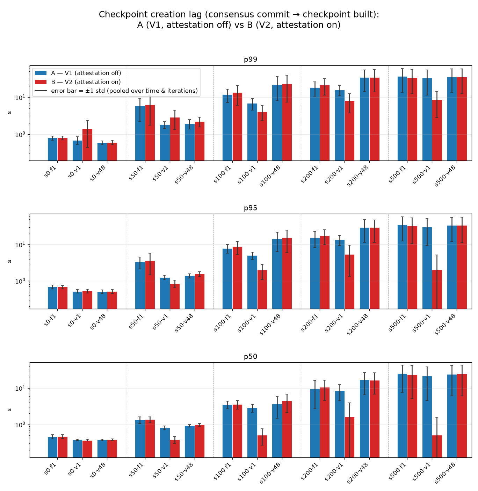

*Checkpoint creation lag, `n48` campaign — on the pinned path B's bars
collapse (the relocation at full strength); the spread paths show none.*

---

**6. Post-consensus validation latency: unaffected by attestation.**

> [!NOTE]
> The title holds as stated on `n4`. On `n48`, the pinned path's B runs the
> pass far below A (B/A 0.02–0.26) — near-empty consensus commits under
> throttled admission, not cheaper validation; see the `n48` paragraph below.

Metric descriptions

| metric | codebase description | aggregation |
| --- | --- | --- |
| `post_consensus_validation_latency` | Latency of `validate_and_resolve_conflicts` over one consensus commit's user transactions (Checks #0-#3 plus owned-object conflict resolution) | histogram; p50/p95/p99 (`histogram_quantile`) over buckets combined across validators; averaged over all seconds of all iterations |

`validate_and_resolve_conflicts` (the post-consensus pass) is where attestation
adds Check #3 — attestor verification plus cost bounds. But that's a few integer
comparisons per tx; the pass is dominated by the already-executed cache lookup
(Check #1) and owned-object lock/conflict resolution. All paths, each
cell `n4` ∣ `n48`:

Fullnode path (`f1`):

| slow_size | p50 A | p50 B | p50 B/A |
| :---: | --- | --- | --- |
| 0   | 2.9 ms ∣ **5.1 ms** | 2.8 ms ∣ **4.3 ms** | 0.96 ∣ **0.85** |
| 50  | 2.9 ms ∣ **10 ms** | 2.8 ms ∣ **8.7 ms** | 0.96 ∣ **0.85** |
| 100 | 2.5 ms ∣ **9.8 ms** | 2.0 ms ∣ **7.7 ms** | 0.80 ∣ **0.79** |
| 200 | 2.3 ms ∣ **8.6 ms** | 1.1 ms ∣ **8.9 ms** | 0.48 ∣ **1.04** |
| 500 | 2.1 ms ∣ **37 ms** | 1.7 ms ∣ **78 ms** | 0.82 ∣ **2.12** |

Direct-to-one-validator path (`v1`):

| slow_size | p50 A | p50 B | p50 B/A |
| :---: | --- | --- | --- |
| 0   | 2.9 ms ∣ **3.3 ms** | 2.9 ms ∣ **2.6 ms** | 1.00 ∣ **0.78** |
| 50  | 2.9 ms ∣ **4.6 ms** | 2.8 ms ∣ **0.4 ms** | 0.98 ∣ **0.08** |
| 100 | 2.5 ms ∣ **3.4 ms** | 2.2 ms ∣ **0.3 ms** | 0.89 ∣ **0.09** |
| 200 | 3.3 ms ∣ **2.1 ms** | 0.6 ms ∣ **0.3 ms** | 0.20 ∣ **0.14** |
| 500 | 7.0 ms ∣ **28 ms** | 0.4 ms ∣ **0.6 ms** | 0.06 ∣ **0.02** |

Direct-to-all-validators path (`v4` / `v48`):

| slow_size | p50 A | p50 B | p50 B/A |
| :---: | --- | --- | --- |
| 0   | 3.0 ms ∣ **3.9 ms** | 2.9 ms ∣ **3.5 ms** | 0.98 ∣ **0.89** |
| 50  | 2.9 ms ∣ **11 ms** | 2.8 ms ∣ **9.0 ms** | 0.95 ∣ **0.83** |
| 100 | 2.5 ms ∣ **8.7 ms** | 2.2 ms ∣ **8.5 ms** | 0.87 ∣ **0.98** |
| 200 | 3.6 ms ∣ **28 ms** | 3.3 ms ∣ **25 ms** | 0.90 ∣ **0.89** |
| 500 | 13 ms ∣ **222 ms** | 7.2 ms ∣ **45 ms** | 0.56 ∣ **0.20** |

The same pass at p95

Fullnode path (`f1`), p95:

| slow_size | p95 A | p95 B | p95 B/A |
| :---: | --- | --- | --- |
| 0   | 5.7 ms ∣ **39 ms** | 5.1 ms ∣ **36 ms** | 0.89 ∣ **0.91** |
| 50  | 5.2 ms ∣ **67 ms** | 4.9 ms ∣ **57 ms** | 0.95 ∣ **0.85** |
| 100 | 4.9 ms ∣ **94 ms** | 4.8 ms ∣ **81 ms** | 0.98 ∣ **0.86** |
| 200 | 19 ms ∣ **171 ms** | 12 ms ∣ **143 ms** | 0.63 ∣ **0.84** |
| 500 | 26 ms ∣ **278 ms** | 24 ms ∣ **296 ms** | 0.94 ∣ **1.07** |

Direct-to-one-validator path (`v1`), p95:

| slow_size | p95 A | p95 B | p95 B/A |
| :---: | --- | --- | --- |
| 0   | 5.9 ms ∣ **25 ms** | 5.1 ms ∣ **23 ms** | 0.85 ∣ **0.94** |
| 50  | 5.4 ms ∣ **45 ms** | 5.0 ms ∣ **12 ms** | 0.93 ∣ **0.26** |
| 100 | 5.4 ms ∣ **79 ms** | 4.8 ms ∣ **9.4 ms** | 0.90 ∣ **0.12** |
| 200 | 22 ms ∣ **124 ms** | 21 ms ∣ **17 ms** | 0.95 ∣ **0.13** |
| 500 | 69 ms ∣ **186 ms** | 15 ms ∣ **6.1 ms** | 0.21 ∣ **0.03** |

Direct-to-all-validators path (`v4` / `v48`), p95:

| slow_size | p95 A | p95 B | p95 B/A |
| :---: | --- | --- | --- |
| 0   | 5.3 ms ∣ **23 ms** | 4.9 ms ∣ **22 ms** | 0.93 ∣ **0.94** |
| 50  | 5.3 ms ∣ **48 ms** | 4.9 ms ∣ **46 ms** | 0.92 ∣ **0.96** |
| 100 | 4.9 ms ∣ **79 ms** | 4.8 ms ∣ **78 ms** | 0.98 ∣ **0.99** |
| 200 | 19 ms ∣ **234 ms** | 22 ms ∣ **183 ms** | 1.13 ∣ **0.78** |
| 500 | 61 ms ∣ **675 ms** | 57 ms ∣ **184 ms** | 0.95 ∣ **0.27** |

On `n4`, p50 is ≈2–3 ms at light load, and the B/A column has no consistent
direction — it swings from 0.06 to 1.13, worst on the direct-path heavy
configs. That's noise, not an attestation effect: the pass is timed per
consensus commit, so heavy configs (low throughput) get few samples. p95
rises under load (≈5 ms → 12–69 ms) on both A and B, from contention on the
pass. Attestation's Check #3 is lost in the noise; its cost is pre-consensus
(finding 1), not here.

On `n48`, the absolute pass times inflate with everything else (p95 tens to
hundreds of ms) and the spread paths stay A≈B (B/A mostly 0.78–1.07). The
pinned path turns systematic instead of noisy: B runs the pass at a fraction
of A from `slow50` up (p50 B/A 0.02–0.26 — e.g. 28 ms vs 0.6 ms at
`slow500`). That is still not Check #3: the pass is timed per consensus
commit, so its duration tracks how many transactions a commit carries, and
B's throttled admission on `v1` (finding 14) produces near-empty commits.
`v48` shows the same commit-size effect once, at `slow500` (p50 222 ms →
45 ms), where A admits more than B and its commits arrive stuffed.

*Time in `validate_and_resolve_conflicts`, `n4` campaign; Check #3 (attestor
verification) is the attestation-added work on this path.*

The same figure for the <code>n48</code> campaign

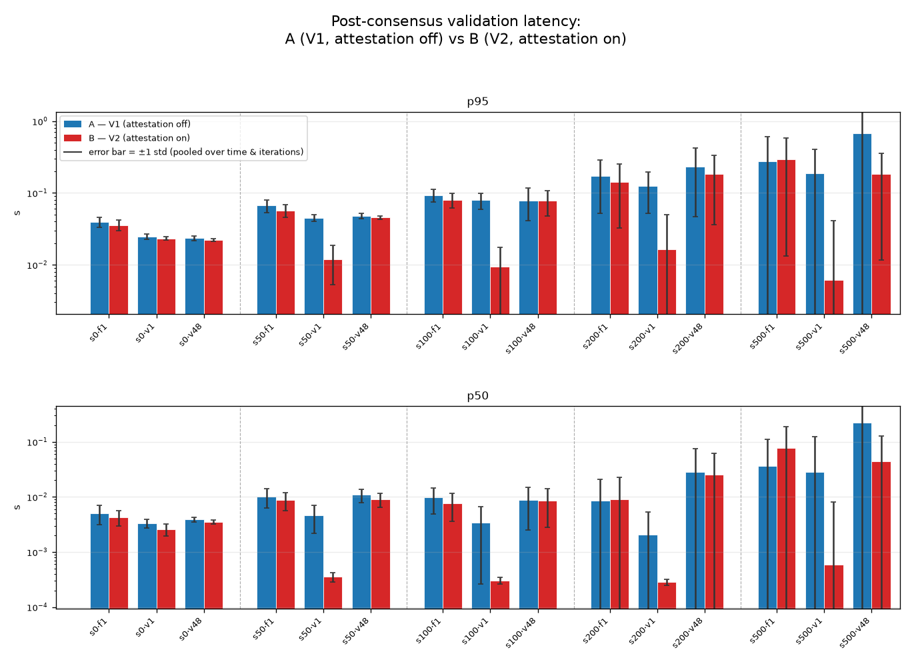

*The pass on `n48` — spread paths A≈B at inflated absolute times; the pinned
path's B bars collapse (near-empty commits).*

---

**7. Submit latency (fullnode path): a fixed per-transaction addition.**

Metric descriptions

| metric | codebase description | aggregation |
| --- | --- | --- |
| `transaction_driver_submit_transaction_latency` | Time in seconds to successfully submit a transaction to a validator | histogram; p50/p95/p99 (`histogram_quantile`), fullnode client series only; averaged over all seconds of all iterations |

The full help text continues: "Includes all retries and measures from the
start of submission until a validator accepts the transaction." The timer
runs on the fullnode's `TransactionDriver`, and the validator's `submit_tx`
RPC responds only after the transaction passed the overload check, the whole
attestation span finished (pool wait + dry-run + async resume — the
attestation payload is needed to build the consensus transaction), and the
transaction was handed to the consensus adapter. It does not wait for
consensus sequencing — that time is in settlement finality (finding 8), not
here.

B's submit `p50` exceeds A's by roughly the full attestation latency
(`validator_attestation_latency`, pool wait + dry-run execution + async
resume — the submit RPC returns only after the whole attestation span), so the
*ratio* is largest where the baseline is smallest (low rate / low computation
cost): `slow0-f1-q200` 4.7 ms → 14.5 ms (3.1×), `slow500-f1-q200` 25.2 ms →
674 ms
(27×, i.e. +649 ms ≈ the full attestation p50, 616 ms at that configuration).
At high rate, the queueing baseline dominates and the ratio shrinks (≈1.1–5×).
The *added* latency (B − A) equals the full attestation span only at low rate;
under load the dry-runs queue and it grows well past that (`slow500-f1-q2000`
submit reaches 3.8 s).

Submit p50 (ms) on the fullnode path (A = attestation off, B = on), with
B's full attestation latency p50 alongside to check the addition directly
(submit A + full attestation ≈ submit B); each cell `n4` ∣ `n48`:

Target rate `qps200`:

| slow_size | A | B | B/A | full attest. |
| :---: | --- | --- | --- | --- |
| 0   | 4.7  ∣ **19.9** | 14.5 ∣ **23.1** | 3.1  ∣ **1.2** | 0.5  ∣ **2.6** |
| 50  | 4.9  ∣ **28.7** | 24.9 ∣ **38.2** | 5.1  ∣ **1.3** | 3.0  ∣ **6.3** |
| 100 | 4.4  ∣ **82.7** | 26.3 ∣ **135** | 6.0  ∣ **1.6** | 8.6  ∣ **43.7** |
| 200 | 3.7  ∣ **246** | 41.4 ∣ **655** | 11.1 ∣ **2.7** | 33.1 ∣ **394** |
| 500 | 25.2 ∣ **1478** | 674 ∣ **5049** | 26.8 ∣ **3.4** | 616 ∣ **4540** |

Target rate `qps1000`:

| slow_size | A | B | B/A | full attest. |
| :---: | --- | --- | --- | --- |
| 0   | 3.7  ∣ **614** | 4.2   ∣ **616** | 1.1 ∣ **1.0** | 0.5   ∣ **7.3** |
| 50  | 3.7  ∣ **350** | 10.2 ∣ **423** | 2.8 ∣ **1.2** | 3.0   ∣ **28.1** |
| 100 | 3.3  ∣ **469** | 15.0 ∣ **646** | 4.5 ∣ **1.4** | 6.5   ∣ **108** |
| 200 | 83.0 ∣ **1201** | 261  ∣ **2432** | 3.1 ∣ **2.0** | 114  ∣ **846** |
| 500 | 386 ∣ **3933** | 2044 ∣ **10691** | 5.3 ∣ **2.7** | 1050 ∣ **8638** |

Target rate `qps2000`:

| slow_size | A | B | B/A | full attest. |
| :---: | --- | --- | --- | --- |
| 0   | 3.6   ∣ **1326** | 3.8   ∣ **1373** | 1.1 ∣ **1.0** | 0.5   ∣ **11.3** |
| 50  | 3.1   ∣ **648** | 6.6   ∣ **748** | 2.1 ∣ **1.2** | 2.8   ∣ **40.5** |
| 100 | 5.0   ∣ **632** | 21.6 ∣ **853** | 4.3 ∣ **1.4** | 8.7   ∣ **118** |
| 200 | 106  ∣ **2221** | 379  ∣ **4960** | 3.6 ∣ **2.2** | 116  ∣ **1233** |
| 500 | 1007 ∣ **4341** | 3760 ∣ **9998** | 3.7 ∣ **2.3** | 1381 ∣ **10321** |

The addition holds at low rate — e.g. `slow500-f1-q200`: 25.2 + 616 ≈ 674, and
`slow200-f1-q200`: 3.7 + 33.1 ≈ 41.4. At high rate B's submit grows past the
sum (`slow500-f1-q2000`: 1007 + 1381 = 2389 vs 3760 measured) — the extra is
queueing on the loaded validator beyond the attestation span itself.

On `n48`, the same structure sits on inflated baselines: A's submit is already
20 ms–4.3 s from queueing alone, so the ratio never exceeds 3.4× (vs 27× on
`n4`). The addition still holds at `qps200` through `slow200` (B − A 409 ms
vs a 394 ms attestation span; 52 vs 44 ms at `slow100`). At `slow500`, it
over-predicts: B − A (3.6 s at `qps200`) falls short of the 4.5 s attestation
span — under saturation the attestation span and the submit queue overlap
rather than add.

*Client submit latency, fullnode path only, `n4` campaign — finding 7.*

The same figure for the <code>n48</code> campaign

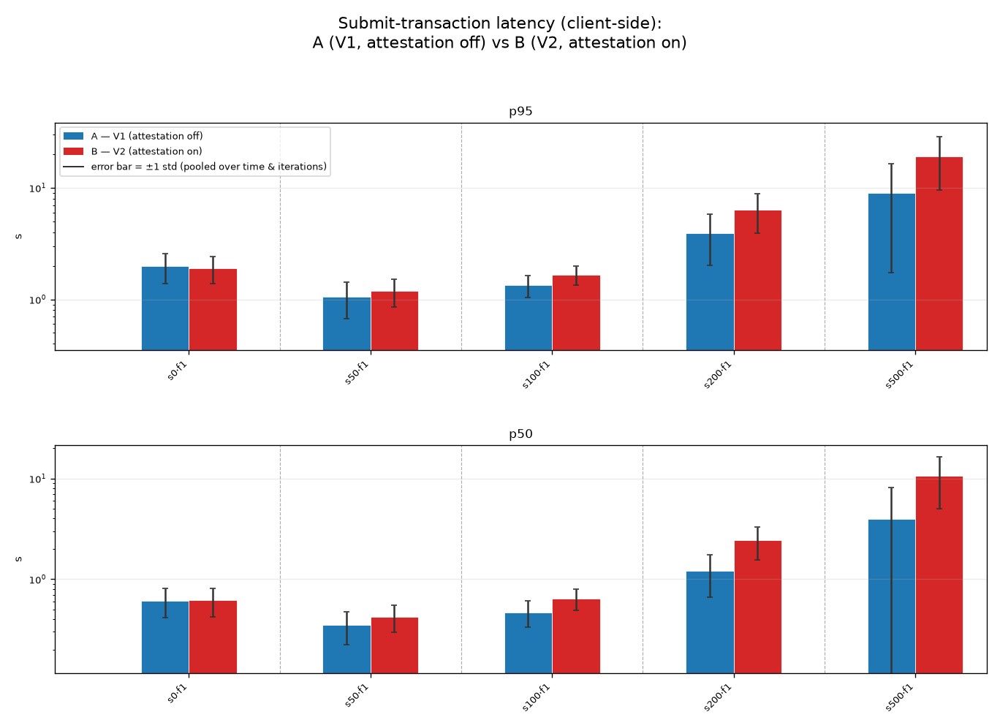

*Client submit latency, `n48` campaign — same shape on baselines dominated by
queueing.*

---

**8. Settlement finality latency: the client sees the same doubling.**

> [!NOTE]
> The title describes `n4`. On `n48`, the doubling does not reach the client:
> both sides sit on the saturated pipeline (finding 4's ceiling) and B/A
> stays 0.96–1.18; see the `n48` paragraph below.

Metric descriptions

| metric | codebase description | aggregation |
| --- | --- | --- |
| `transaction_driver_settlement_finality_latency` | Settlement finality latency observed from transaction driver | histogram; p50/p95/p99 (`histogram_quantile`), fullnode client series only; averaged over all seconds of all iterations |

`settlement_finality_latency` is the client's submit→finality time (fullnode
path only). It's the end-to-end view of the internal pipeline (finding 4) plus
network and finality, so it moves the same way. Fullnode path, each cell
`n4` ∣ `n48`:

| slow_size | p50 A | p50 B | p50 B/A |
| :---: | --- | --- | --- |
| 0   | 253 ms ∣ **1.84 s** | 252 ms ∣ **1.82 s** | 1.00 ∣ **0.99** |
| 50  | 259 ms ∣ **2.35 s** | 258 ms ∣ **2.46 s** | 1.00 ∣ **1.04** |
| 100 | 264 ms ∣ **4.83 s** | 270 ms ∣ **5.03 s** | 1.02 ∣ **1.04** |
| 200 | 804 ms ∣ **12.57 s** | 1.25 s  ∣ **14.81 s** | 1.56 ∣ **1.18** |
| 500 | 4.26 s  ∣ **16.86 s** | 7.53 s  ∣ **16.24 s** | 1.77 ∣ **0.96** |

The same latency at p95

| slow_size | p95 A | p95 B | p95 B/A |
| :---: | --- | --- | --- |
| 0   | 367 ms ∣ **3.38 s** | 374 ms ∣ **3.32 s** | 1.02 ∣ **0.98** |
| 50  | 359 ms ∣ **3.26 s** | 351 ms ∣ **3.43 s** | 0.98 ∣ **1.05** |
| 100 | 373 ms ∣ **6.51 s** | 390 ms ∣ **6.84 s** | 1.05 ∣ **1.05** |
| 200 | 1.20 s  ∣ **18.32 s** | 2.00 s  ∣ **20.97 s** | 1.67 ∣ **1.14** |
| 500 | 7.08 s  ∣ **20.88 s** | 11.65 s ∣ **20.08 s** | 1.65 ∣ **0.96** |

On `n4`, at light load B≈A (≈250 ms, dominated by consensus/finality;
attestation is negligible). At heavy compute, B runs ≈1.6–1.8× A (`slow500`
4.26 s → 7.53 s p50), the doubling from finding 4 carried through to what
the client observes.

On `n48`, the client sees finding 4's ceiling instead: the floor is already
≈1.8 s at `slow0` and both sides climb together to ≈16–21 s at `slow500`, so
B/A stays 0.96–1.18 throughout — the only visible bump is at `slow200`
(1.14–1.18), matching the pipeline's 1.12 there. What the client observes is
the saturated backlog, not the attestation span.

*Client settlement-finality latency, fullnode path only, `n4` campaign.*

The same figure for the <code>n48</code> campaign

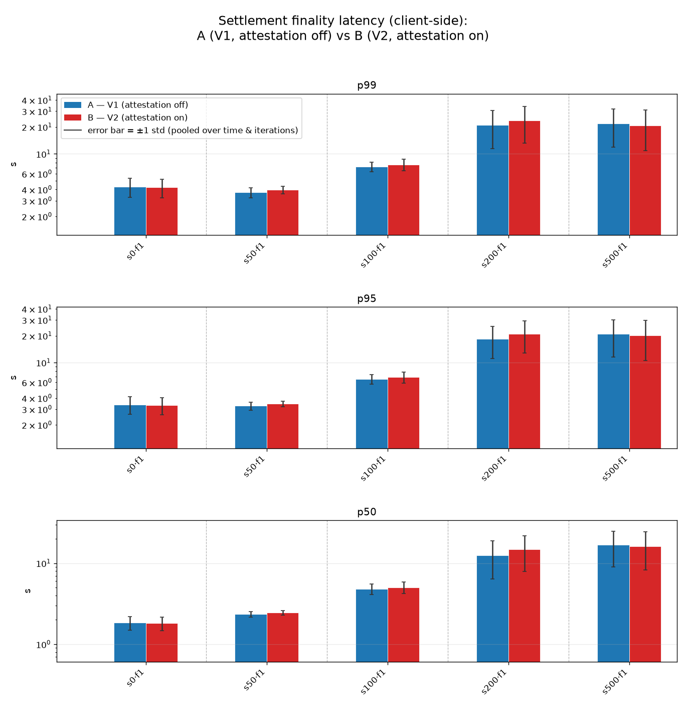

*Client settlement-finality latency, `n48` campaign — A and B climb together
to the backlog ceiling.*

---

**9. CPU: attestation adds ≈30 % busy cores.**

> [!NOTE]
> The ≈30 % is the `n4` median. On `n48`, the overhead follows attestation
> concentration: ≈0–13 % on the spread paths, up to +134 % on the pinned
> validator's host; see the `n48` paragraph below.

Metric descriptions

| metric | codebase description | aggregation |
| --- | --- | --- |
| `container_cpu_usage_seconds_total` | cadvisor (no in-repo help): cumulative CPU seconds consumed by the container | counter; `rate()` → busy cores, max across validators (busiest); averaged over all seconds of all iterations |
| `container_memory_rss` | cadvisor (no in-repo help): container resident set size (RSS) in bytes | gauge; max across validators (busiest); averaged over all seconds of all iterations |
| `node_cpu_seconds_total` | node-exporter (no in-repo help): seconds each CPU spent in each mode | counter; `rate()` over non-idle modes summed to whole-machine busy cores; averaged over all seconds of all iterations |

Per-validator CPU (busiest validator, cadvisor) B/A median = **1.28×** (range
0.99–2.23×) — e.g. `slow100-f1` 8.7 → 11.1 cores, `slow500-f1`
20.9 → 24.7 cores. Consistent with the extra dry-run execution.

Busiest-validator CPU (cores) by slow_size, each cell `n4` ∣ `n48`:

Fullnode path (`f1`):

| slow_size | A | B | B/A |
| :---: | --- | --- | --- |
| 0   | 2.7  ∣ **2.0** | 2.8  ∣ **2.0** | 1.05 ∣ **1.00** |
| 50  | 5.3  ∣ **2.0** | 6.4  ∣ **2.0** | 1.21 ∣ **1.01** |
| 100 | 8.7  ∣ **2.1** | 11.1 ∣ **2.1** | 1.28 ∣ **1.01** |
| 200 | 18.7 ∣ **2.2** | 21.0 ∣ **2.2** | 1.12 ∣ **1.02** |
| 500 | 20.9 ∣ **2.2** | 24.7 ∣ **2.4** | 1.19 ∣ **1.10** |

Direct-to-one-validator path (`v1`):

| slow_size | A | B | B/A |
| :---: | --- | --- | --- |
| 0   | 3.0  ∣ **2.1** | 3.3  ∣ **2.1** | 1.09 ∣ **1.04** |
| 50  | 5.7  ∣ **2.1** | 8.1  ∣ **2.2** | 1.43 ∣ **1.05** |
| 100 | 9.1  ∣ **2.1** | 14.6 ∣ **2.4** | 1.60 ∣ **1.13** |
| 200 | 21.1 ∣ **2.1** | 31.9 ∣ **3.2** | 1.51 ∣ **1.51** |
| 500 | 23.0 ∣ **2.2** | 35.9 ∣ **5.0** | 1.56 ∣ **2.34** |

Direct-to-all-validators path (`v4` / `v48`):

| slow_size | A | B | B/A |
| :---: | --- | --- | --- |
| 0   | 2.7  ∣ **2.0** | 2.9  ∣ **2.0** | 1.05 ∣ **0.99** |
| 50  | 5.3  ∣ **2.0** | 6.7  ∣ **2.1** | 1.26 ∣ **1.02** |
| 100 | 9.0  ∣ **2.2** | 11.8 ∣ **2.2** | 1.30 ∣ **1.01** |
| 200 | 20.2 ∣ **2.2** | 24.4 ∣ **2.2** | 1.21 ∣ **1.03** |
| 500 | 23.7 ∣ **2.2** | 24.7 ∣ **2.5** | 1.04 ∣ **1.13** |

The pinned path (`v1`) rises more (up to ≈1.6×) than the fullnode path
(≈1.1–1.3×), because that one validator attests every transaction, while on
`f1` the attestation work is spread across the four. `v4` confirms it is the
spreading that matters, not the fullnode: submitting directly to all 4 keeps
the busiest validator at fullnode-path levels (B ≈ 24.7 cores at `slow500`,
matching `f1` and well below `v1`'s 35.9).

On `n48`, every validator runs at ≈2.0–2.5 cores — 49 containers share the
96 hardware threads, so the machine, not the workload, sets the level — and
the B/A ratio becomes the cleanest per-validator view of the overhead. On
the spread paths, attestation is ≈free: B/A 0.99–1.13 (each validator attests
≈1/48th of the load). On the pinned path, the one attesting host climbs from
1.04 at `slow0` to 2.34 at `slow500` (2.2 → 5.0 cores) — it pays the full
dry-run stream on top of its execution share. Memory moves the same
direction but barely: `v1`-B up to 1.21, spread paths ≤1.09.

Busiest-validator memory RSS (GB), same cell format

Fullnode path (`f1`):

| slow_size | A | B | B/A |
| :---: | --- | --- | --- |
| 0   | 0.8 ∣ **1.61** | 0.8 ∣ **1.62** | 1.00 ∣ **1.01** |
| 50  | 0.8 ∣ **1.57** | 0.7 ∣ **1.58** | 0.99 ∣ **1.00** |
| 100 | 0.7 ∣ **1.47** | 0.7 ∣ **1.46** | 1.00 ∣ **1.00** |
| 200 | 0.7 ∣ **1.37** | 0.8 ∣ **1.39** | 1.08 ∣ **1.01** |
| 500 | 0.5 ∣ **1.34** | 0.6 ∣ **1.41** | 1.29 ∣ **1.05** |

Direct-to-one-validator path (`v1`):

| slow_size | A | B | B/A |
| :---: | --- | --- | --- |
| 0   | 0.8 ∣ **1.62** | 0.8 ∣ **1.69** | 0.99 ∣ **1.04** |
| 50  | 0.8 ∣ **1.58** | 0.8 ∣ **1.67** | 0.99 ∣ **1.06** |
| 100 | 0.8 ∣ **1.47** | 0.8 ∣ **1.61** | 1.01 ∣ **1.09** |
| 200 | 0.8 ∣ **1.38** | 0.9 ∣ **1.53** | 1.07 ∣ **1.11** |
| 500 | 0.5 ∣ **1.31** | 0.7 ∣ **1.59** | 1.38 ∣ **1.21** |

Direct-to-all-validators path (`v4` / `v48`):

| slow_size | A | B | B/A |
| :---: | --- | --- | --- |
| 0   | 0.8 ∣ **1.56** | 0.8 ∣ **1.57** | 1.00 ∣ **1.01** |
| 50  | 0.8 ∣ **1.54** | 0.8 ∣ **1.54** | 1.01 ∣ **1.00** |
| 100 | 0.8 ∣ **1.48** | 0.8 ∣ **1.47** | 0.99 ∣ **1.00** |
| 200 | 0.8 ∣ **1.38** | 0.8 ∣ **1.40** | 1.05 ∣ **1.01** |
| 500 | 0.5 ∣ **1.34** | 0.7 ∣ **1.45** | 1.25 ∣ **1.09** |

Memory stays small and roughly flat (≈0.7–0.8 GB); attestation barely moves it —
the heavy-config bumps are on ≈0.5–0.9 GB and noisy. Attestation's cost is CPU,
not memory.

*Whole-machine host CPU and busiest-validator CPU / memory (RSS), `n4`
campaign — finding 9.*

The same figure for the <code>n48</code> campaign

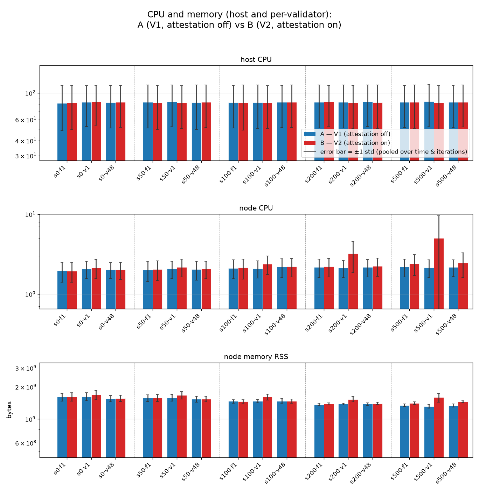

*Resources, `n48` campaign — per-validator CPU pinned at the ≈2-core machine
share on every path except the attesting `v1` host.*

---

**10. Throughput: no penalty at normal load; a fullnode cost at heavy compute.**

> [!NOTE]
> The title describes `n4`. On `n48`, the fullnode cost is absent (B/A
> 0.98–1.00 through `slow200`); instead the pinned path halves B's
> throughput at moderate sizes (continuous shedding) and multiplies it at
> `slow500` (B 2.9× A — admission control wins under overload); see the
> `n48` paragraph below.

Metric descriptions

| metric | codebase description | aggregation |
| --- | --- | --- |
| `transactions_included_in_checkpoint` | Transactions included in a checkpoint | counter; `rate()` → finalized TPS, mean across validators (replicated); averaged over all seconds of all iterations |
| `validator_attestations_total` | Number of attestations performed (dry-runs that completed without panicking) | counter; `rate()` → attestations/s, max across validators (busiest); averaged over all seconds of all iterations |

Finalized TPS (`transactions_included_in_checkpoint`) is statistically
identical A vs B at normal load — median `(B−A)/A = −0.4 %` across all 45
configurations, within the few-percent run-to-run noise.

Finalized TPS by slow_size (A = attestation off, B = on; `slow500` is small
and noisy), each cell `n4` ∣ `n48`:

Fullnode path (`f1`):

| slow_size | A | B | B/A |
| :---: | --- | --- | --- |
| 0   | 994  ∣ **602** | 987  ∣ **604** | 0.99 ∣ **1.00** |
| 50  | 1010 ∣ **431** | 1003 ∣ **427** | 0.99 ∣ **0.99** |
| 100 | 1023 ∣ **194** | 1019 ∣ **189** | 1.00 ∣ **0.98** |
| 200 | 747  ∣ **64** | 584  ∣ **63** | 0.78 ∣ **1.00** |
| 500 | 129  ∣ **6** | 104  ∣ **5** | 0.81 ∣ **0.85** |

Direct-to-one-validator path (`v1`):

| slow_size | A | B | B/A |
| :---: | --- | --- | --- |
| 0   | 1024 ∣ **488** | 1024 ∣ **487** | 1.00 ∣ **1.00** |
| 50  | 1022 ∣ **374** | 1020 ∣ **187** | 1.00 ∣ **0.50** |
| 100 | 1010 ∣ **190** | 1024 ∣ **103** | 1.01 ∣ **0.54** |
| 200 | 602  ∣ **66** | 636  ∣ **47** | 1.06 ∣ **0.72** |
| 500 | 105  ∣ **5** | 94   ∣ **15** | 0.90 ∣ **2.94** |

Direct-to-all-validators path (`v4` / `v48`):

| slow_size | A | B | B/A |
| :---: | --- | --- | --- |
| 0   | 1022 ∣ **471** | 1022 ∣ **471** | 1.00 ∣ **1.00** |
| 50  | 1022 ∣ **398** | 1022 ∣ **401** | 1.00 ∣ **1.01** |
| 100 | 1022 ∣ **186** | 1022 ∣ **188** | 1.00 ∣ **1.01** |
| 200 | 589  ∣ **62** | 564  ∣ **64** | 0.96 ∣ **1.02** |
| 500 | 88   ∣ **6** | 79   ∣ **10** | 0.89 ∣ **1.67** |

Caveat: the −0.4 % median is the normal-load result. On the fullnode path the
cost grows with compute — B/A ≈ 0.78 at `slow200`, ≈ 0.81 at `slow500` — while
the direct paths pay little or nothing (`v1` 1.06/0.90 and `v4` 0.96/0.89 at
`slow200`/`slow500`),
even though it sends every attestation to a single validator. Why the fullnode
path pays more is not established here (both sit at ≈76–85/96 host CPU, so it
is not spare capacity); it needs a dedicated look.

On `n48`, the absolute numbers are saturation-bound before anything else: the
machine delivers ≈470–600 TPS at `slow0` regardless of the requested 1000/s,
and the sizes above collapse identically on A and B (`slow100` ≈190,
`slow200` ≈64, `slow500` single digits). Within that ceiling the `n4` caveat
inverts. The fullnode dip is gone — `f1` B/A is 0.98–1.00 through `slow200`
(0.85 at the degenerate `slow500`). The pinned path pays instead: B/A ≈0.50
at `slow50`/`slow100` — half of B's stream is rejected by the entry
validator's continuous pre-consensus shedding (finding 14) — and 0.72 at
`slow200`. At `slow500`, the same throttle wins: B delivers 2.9× A (15 vs
5 TPS), the load-shedding paradox already visible in findings 2 and 5 —
admitting less lets the network finish more. `v48` stays at B/A ≈1.0
throughout (1.67 at the noisy `slow500`).

attestations / sec (the busiest validator's rate) shows how the two client
paths spread attestation work. On the pinned path (`v1`) one validator attests
nearly all traffic, so its rate tracks the full transaction rate; on the
fullnode path (`f1`), the fullnode spreads submissions across the four
validators, so the busiest one attests only its share — about half the pinned
rate at light load (`slow0`: 484 vs 994 /s) and roughly a fifth under
heavy compute (`slow200`: 306 vs 1546 /s). `v4` spreads just as evenly
without a fullnode in the picture (busiest ≈ 500 /s at light load, 426 at
`slow200`) — the driver's validator selection balances the load on its own.
Finalized TPS is approximately the same on all paths, so this is about how
attestation work is spread, not throughput. On `n48`, the concentration
contrast widens: the spread paths' busiest validator attests ≈50–70/s at
light load (≈600 TPS over 48 validators, with some imbalance) while the
pinned one attests ≈480/s — a 6.8× ratio, up from 2.1× on `n4` — and the
ratio only closes at `slow500` (1.9×), where the pinned validator's shedding
caps its intake.

*Finalized TPS, attestations / sec, and post-consensus validation-drops / sec,
`n4` campaign — findings 10 and 11. TPS is A≈B; no validation drops on either
path.*

The same figure for the <code>n48</code> campaign

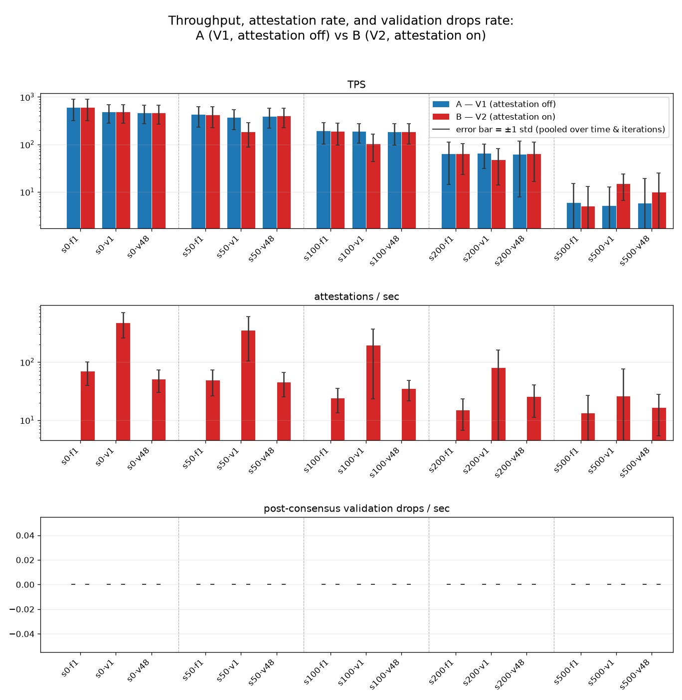

*The same panels, `n48` campaign — `v1`'s B throughput halves at the moderate
sizes (shedding); validation drops stay zero on every path.*

attestations / sec by path (busiest validator), each cell `n4` ∣ `n48`:

| config | `f1` | `v1` | `v4` / `v48` | v1/f1 |
| :---: | --- | --- | --- | --- |
| `slow0` | 484 ∣ **70** | 994  ∣ **480** | 500 ∣ **51** | 2.1× ∣ **6.8×** |
| `slow100` | 501 ∣ **24** | 993  ∣ **195** | 503 ∣ **35** | 2.0× ∣ **8.0×** |
| `slow200` | 306 ∣ **15** | 1546 ∣ **81** | 426 ∣ **26** | 5.0× ∣ **5.4×** |
| `slow500` | 74  ∣ **13** | 516  ∣ **26** | 96  ∣ **17** | 7.0× ∣ **1.9×** |

---

**11. No post-consensus validation drops.**

Metric descriptions

| metric | codebase description | aggregation |
| --- | --- | --- |
| `consensus_handler_validation_dropped_transactions` | Number of `UserTransactionV1`/`UserTransactionV2` transactions dropped by post-consensus validation | counter; `rate()` → drops/s, mean across validators; averaged over all seconds of all iterations |

`consensus_handler_validation_dropped_transactions` is ≈0 on both the attested
(V2) and unattested (V1) paths, across every configuration of both campaigns
(`n4` and `n48`) — the counter never moves even where shedding and
saturation are at their worst. The rates are shown in the throughput figure
(finding 10).

---

**12. Execution queues and backpressure: deeper backlog under heavy load.**

> [!NOTE]
> The title describes `n4`'s fullnode path. On `n48` queue delay tracks
> saturation, not attestation: the fullnode effect does not reproduce, and
> the pinned path's B queues far less than A (B/A 0.12 at `slow500`); see
> the `n48` paragraph below.

Metric descriptions

| metric | codebase description | aggregation |
| --- | --- | --- |
| `execution_queueing_delay_s` | Queueing delay between a transaction is ready for execution until it starts executing | histogram; p50/p95/p99 (`histogram_quantile`) per validator, then max across validators; averaged over all seconds of all iterations |
| `execution_driver_dispatch_queue` | Number of transaction pending in execution driver dispatch queue | gauge; max across validators (busiest); peak — max over time per iteration, averaged across iterations |
| `transaction_manager_num_pending_certificates` | Number of certificates pending in `TransactionManager`, with at least 1 missing input object | gauge; max across validators (busiest); peak — max over time per iteration, averaged across iterations |

Under load, execution work queues up. Headline signal: queue-delay p95 (how
long a tx waits before executing); dispatch-queue depth and pending-tx count
track it. Each cell `n4` ∣ `n48`:

Fullnode path (`f1`):

| slow_size | A | B | B/A |
| :---: | --- | --- | --- |
| 0   | 5 ms   ∣ **381 ms** | 5 ms   ∣ **358 ms** | 1.00 ∣ **0.94** |
| 50  | 10 ms  ∣ **1.14 s** | 10 ms  ∣ **1.16 s** | 1.08 ∣ **1.02** |
| 100 | 27 ms  ∣ **2.12 s** | 29 ms  ∣ **2.22 s** | 1.05 ∣ **1.05** |
| 200 | 508 ms ∣ **5.31 s** | 997 ms ∣ **4.09 s** | 1.96 ∣ **0.77** |
| 500 | 2.44 s  ∣ **2.09 s** | 3.41 s  ∣ **2.57 s** | 1.39 ∣ **1.23** |

Direct-to-one-validator path (`v1`):

| slow_size | A | B | B/A |
| :---: | --- | --- | --- |
| 0   | 5 ms  ∣ **31 ms** | 5 ms  ∣ **46 ms** | 0.98 ∣ **1.47** |
| 50  | 11 ms ∣ **274 ms** | 11 ms ∣ **326 ms** | 0.98 ∣ **1.19** |
| 100 | 28 ms ∣ **1.39 s** | 26 ms ∣ **952 ms** | 0.92 ∣ **0.69** |
| 200 | 1.91 s ∣ **2.97 s** | 1.81 s ∣ **2.48 s** | 0.95 ∣ **0.84** |
| 500 | 5.21 s ∣ **2.10 s** | 5.33 s ∣ **258 ms** | 1.02 ∣ **0.12** |

Direct-to-all-validators path (`v4` / `v48`):

| slow_size | A | B | B/A |
| :---: | --- | --- | --- |
| 0   | 5 ms  ∣ **23 ms** | 5 ms  ∣ **24 ms** | 1.00 ∣ **1.02** |
| 50  | 10 ms ∣ **305 ms** | 11 ms ∣ **353 ms** | 1.09 ∣ **1.16** |
| 100 | 29 ms ∣ **3.20 s** | 27 ms ∣ **3.31 s** | 0.94 ∣ **1.04** |
| 200 | 1.83 s ∣ **9.54 s** | 1.70 s ∣ **7.90 s** | 0.93 ∣ **0.83** |
| 500 | 5.23 s ∣ **2.60 s** | 7.35 s ∣ **2.01 s** | 1.41 ∣ **0.77** |

On `n4`, light configs barely queue (≈5–29 ms, A≈B). On the fullnode path B
carries a deeper backlog under heavy compute — queue-delay 1.4–2.0× A, and
the dispatch-queue peak grows the same way (`slow200-f1` 877 → 1280) — because
attestation's extra execution piles onto a busy pipeline. The direct paths
show no clean effect on queue delay (`v1` B/A 0.92–1.02; `v4` mixed,
0.93–1.41), but their A sides carry large pending-transactions outliers
(`slow200` peaks: 1482 pending in A vs 74 in B on `v1`, 2308 vs 131 on `v4`) —
the same picture as finding 5: without attestation the direct paths' backlog
sits after consensus.

On `n48`, queue delay stops tracking attestation and tracks saturation: even
`slow0` queues 23–381 ms, the delay peaks at `slow200` (up to 9.5 s on
`v48`-A), and shrinks again at `slow500`, where little is admitted at all.
The `n4` fullnode effect does not reproduce (`f1` B/A 0.77–1.23, no
direction). On the pinned path, B queues far less than A at heavy compute
(258 ms vs 2.10 s at `slow500`, B/A 0.12 — finding 14's admission throttle
again), and its dispatch-queue peak drops the same way (688 → 177 at
`slow500`; `v48` 1559 → 776). Pending transactions stay at ≈10–20 on every
`n48` configuration — the large A-side outliers from `n4` do not reappear.

*Execution dispatch queue, pending transactions, and execution queue delay
(p95), `n4` campaign.*

The same figure for the <code>n48</code> campaign

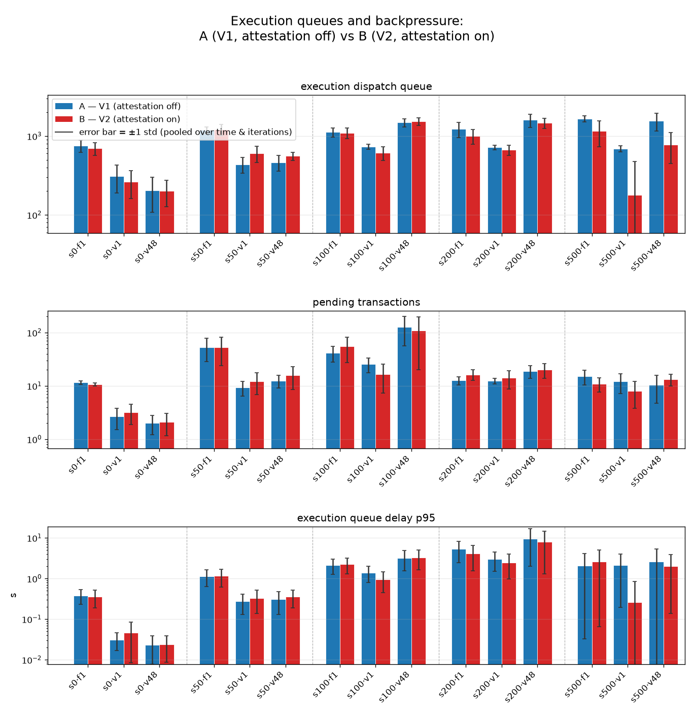

*Queues, `n48` campaign — delay peaks at `slow200`, and the throttled paths'
B queues drain below A.*

---

**13. Post-consensus load shedding: sheds under heavy compute on both
paths.**

Metric descriptions

| metric | codebase description | aggregation |
| --- | --- | --- |
| `consensus_handler_load_shedding_dropped_transactions` | Number of user transactions dropped by post-consensus load shedding, based on the quorum load shedding percentage | counter; `rate()` → drops/s, max across validators (busiest); averaged over all seconds of all iterations |
| `consensus_handler_load_shedding_percentage` | Stake-weighted quorum (2f+1) load shedding percentage enforced on user transactions in the most recent consensus commit. 0 when the P-COOL flow is disabled | gauge; max across validators; peak — max over time per iteration, averaged across iterations |
| `authority_load_shedding_percentage` | This authority's locally computed load shedding percentage. In the P-COOL flow this is the value broadcast to peers, not necessarily the rate enforced (see `consensus_handler_load_shedding_percentage`) | gauge; max across validators; peak — max over time per iteration, averaged across iterations |

Light and moderate configurations (`slow0`–`slow100`) barely shed — only
small bursts at `qps2000` (percentages of a few percent, drops up to ≈7/s on
`slow0-f1-q2000` A). The heavy configurations:

| config | A drops/s | A quorum % | A local % | B drops/s | B quorum % | B local % |
| --- | --- | --- | --- | --- | --- | --- |
| `slow200-f1` | 0    | 0    | 2.2  | 0    | 0    | 1.1  |
| `slow200-v1` | 10.2 | 6.5  | 22.7 | 0    | 0    | 20.1 |
| `slow200-v4` | 22.2 | 12.2 | 27.9 | 6.9  | 6.3  | 17.7 |
| `slow500-f1` | 1.1  | 4.1  | 10.4 | 6.8  | 26.4 | 41.8 |
| `slow500-v1` | 13.9 | 30.7 | 45.6 | 2.8  | 17.9 | 60.7 |
| `slow500-v4` | 12.1 | 28.4 | 38.6 | 4.8  | 42.4 | 70.2 |
| `slow200-f1-q2000` | 1.8  | 1.9  | 11.6 | 27.1 | 15.4 | 27.6 |
| `slow200-v1-q2000` | 71.1 | 27.1 | 31.1 | 3.0  | 2.5  | 24.7 |
| `slow200-v4-q2000` | 71.3 | 26.2 | 31.5 | 52.3 | 27.4 | 37.1 |
| `slow500-f1-q2000` | 3.6  | 17.4 | 25.2 | 2.1  | 18.5 | 47.3 |
| `slow500-v1-q2000` | 19.8 | 62.9 | 72.8 | 0.9  | 20.1 | 51.6 |
| `slow500-v4-q2000` | 25.1 | 71.1 | 78.6 | 0.7  | 8.8  | 63.8 |

Under heavy compute all paths shed: the percentages rise on A and B alike
(the locally broadcast value runs ahead of the enforced quorum value, as
expected — the quorum needs 2f+1 validators to agree), and all drop
transactions. The paths differ in degree, not kind. On the direct paths A
drops far more than B (71.1 vs 3.0 /s at `slow200-v1-q2000`, 25.1 vs 0.7 /s at
`slow500-v4-q2000`): attestation throttles admission, so less backlog reaches
the post-consensus dropper (finding 5). How much less follows the attestation
concentration: `v1` throttles hardest and its B drops least (0.9–3.0 /s); on
`v4`, where each validator attests only a quarter, the throttling is weaker
and B can still drop heavily (52.3 /s at `slow200-v4-q2000`). On the fullnode
path the order can flip outright (1.8 vs 27.1 /s at `slow200-f1-q2000`) —
there B carries the deeper execution backlog (finding 12), and its shed
percentages run higher.

*Post-consensus load shedding: drops / sec, enforced quorum shed %, and locally
broadcast shed % (peaks). A dominates the drops on the pinned path; B can
dominate on the fullnode path. The largest drops land at `qps2000` (see the
table above).*

---

**14. Pre-consensus load shedding: quiet until the heaviest pinned
configuration hits the submit semaphore.**

Metric descriptions

| metric | codebase description | aggregation |
| --- | --- | --- |
| `transaction_overload_sources` | Number of times each source indicates transaction overload | counter with a `source` label (`consensus_graduated` / `consensus_max_pending` / `consensus_semaphore`); `rate()` → rejections/s per source, max across validators; averaged over all seconds of all iterations |
| `validator_service_num_rejected_tx_during_overload` | Number of rejected transaction due to system overload | counter; `rate()` → rejections/s summed over error types, max across validators; averaged over all seconds of all iterations |
| `consensus_queue_load_shedding_percentage` | Percentage of transactions shed due to consensus queue length. Separate admission-control signal, not an input to `authority_load_shedding_percentage` | gauge; max across validators; peak — max over time per iteration, averaged across iterations |
| `sequencing_certificate_inflight` | The inflight requests to sequence certificates | gauge, one series per transaction type; summed per validator = `num_inflight` (the value the graduated / max-pending limits gate on), max across validators; peak — max over time per iteration, averaged across iterations |

`check_system_overload` rejects a transaction before consensus when the
consensus queue is saturated, labeled by which limit tripped: the graduated
soft band, the `max_pending_transactions` hard limit (20000), or the submit
semaphore (`max_pending_transactions × 2 / committee size` = 10000 for this
4-validator network). Across the whole matrix it fired in exactly one
configuration — B at `slow500-v1-qps2000`; no other configuration, at any
rate, rejected a single transaction pre-consensus:

| config | A `num_inflight` | B `num_inflight` | B graduated/s | B semaphore/s | B cons-queue % |
| --- | --- | --- | --- | --- | --- |
| `slow500-v1-q2000` | 3667 | 9726 | 32.1 | 126.8 | 4.7 |

`num_inflight` (transactions submitted to consensus but not yet sequenced) peaks
higher in B than A on every heavy configuration — under attestation each
transaction stays in the submit pipeline longer, so more sit in flight at
once. At `slow500-v1-qps2000` B's peak reaches ≈9700 ≈ the 10000-permit submit
semaphore, and rejections fire: mostly `consensus_semaphore` (≈127/s) with
some `consensus_graduated` (≈32/s), and `consensus_max_pending` never — the
semaphore is reached first and holds `num_inflight` below the 20000 hard limit.
The totals cross-check: rejections/s (≈154) ≈ graduated + semaphore. A never
sheds pre-consensus at any configuration, and neither does `v4` at any load:
spreading the submissions keeps every validator's `num_inflight` at ≈2100 or
less, far from the semaphore — the pre-consensus limits only come into play
when the load pins to a single validator.

---

### H4 — safety (pass/fail)

**PASS.** All safety counters are zero across all runs (checkpoint forks,
inconsistent state hash, double-spend, attestation task panics, soft-lock
equivocation), and no validator crashed, restarted, or OOM'd.

Metric descriptions

| metric | codebase description | aggregation |
| --- | --- | --- |
| `split_brain_checkpoint_forks` | Number of checkpoints that have resulted in a split brain | counter; max across validators over the whole window (H4 requires 0) |
| `remote_checkpoint_forks` | Number of remote checkpoints that forked from local checkpoints | counter; max across validators over the whole window (H4 requires 0) |
| `global_state_hash_inconsistent_state` | 1 if accumulated live object set differs from `GlobalStateHasher` root state hash for the previous epoch | gauge; max across validators over the whole window (H4 requires 0) |
| `total_client_double_spend_attempts_detected` | Total number of client double spend attempts that are detected | counter; max over the whole window (H4 requires 0) |
| `validator_attestation_task_panics` | Number of attestation dry-runs that panicked (surfaced as a `JoinError`) | counter; max across validators over the whole window (H4 requires 0) |
| `validator_service_num_rejected_tx_soft_lock_conflict` | Number of transactions rejected due to pre-consensus soft lock conflict on owned objects | counter; max across validators over the whole window (H4 requires 0) |

> [!NOTE]
> These results use two temporary post-consensus-validation fixes (one per
> transaction path): each keeps a sequenced transaction when an owned input is
> not yet available (`ObjectNotFound`) rather than dropping it, since a drop
> there is per-node and would fork the checkpoint. Both fixes come from branch
> `protocol-research/fix/attestation-coin-deny-post-consensus-drop-fork` and
> are cherry-picked into the branch tested here. The
> proper fix routes such deterministic failures to a cancelled-execution status
> — tracked in
> [iota-private#438](https://github.com/iotaledger/iota-private/issues/438).

---

### Takeaway

Attestation's cost is a **pre-consensus execution dry-run plus the scheduling
around it**. The dry-run itself tracks the real execution latency — a heavy
attested transaction is executed twice, roughly doubling the validator's work
(≈+30 % busy cores). At light load that is the whole story (sub-millisecond
overhead); under load the pool wait and async resume around the dry-run grow
to dominate the attestation time (findings 1, 9). Compute-unit accounting is
exact, and actual execution, post-consensus validation, and throughput at
normal load are untouched (findings 2, 3, 6, 10).

The costs surface under heavy compute. The client pays the full attestation
span on every fullnode submit, and end-to-end latency — receipt→execution and
settlement finality — roughly doubles; on the fullnode path throughput also
dips (B/A ≈ 0.78–0.81) and the execution backlog deepens (findings 4, 7, 8,
12). But attestation also *relocates* load: by slowing admission it moves the
backlog from after consensus to before it — checkpoint lag on the direct paths
is far smaller with attestation on, while `num_inflight` grows until the
heaviest pinned configuration reaches the submit semaphore and pre-consensus
shedding fires (findings 5, 14). The strength of that shift follows how
concentrated the attestation is (pinned strongest, spread-direct weaker,
fullnode weakest), and the fullnode itself acts as an admission buffer: with
attestation off, the direct paths — spread or pinned — build several times
its post-consensus backlog (finding 5). One observation deserves follow-up: the
fullnode-path throughput dip is unexplained (finding 10). With the temporary
post-consensus fixes in place, there are no validation drops or checkpoint
forks on either path (finding 11, H4 PASS).

Full per-configuration numbers: `h1/results/summary_table_n4.md`. Figures:
`h1/results/summary_plots_n4/*.png`.
